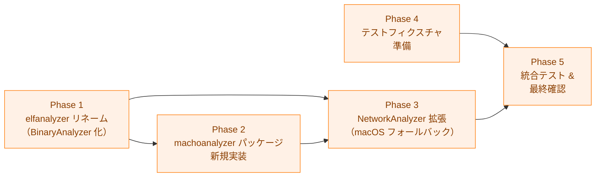

# 実装計画書: Mach-O バイナリ解析によるネットワーク操作検出（macOS 対応）

## 概要

本ドキュメントは Mach-O バイナリ解析によるネットワーク操作検出（macOS 対応）の実装進捗を追跡する。
詳細仕様は [03_detailed_specification.md](03_detailed_specification.md) を参照。
アーキテクチャ設計は [02_architecture.md](02_architecture.md) を参照。

## 依存関係



**注記**: Phase 2 と Phase 4 は Phase 1 完了後に並行して実施可能。
Phase 3 は Phase 1・2 の完了後に実施する。

## Phase 1: elfanalyzer パッケージのリネーム

`ELFAnalyzer` / `NotELFBinary` という ELF 固有命名を汎用名に変更し、
Mach-O 解析を統合するための共通インターフェース基盤を整える。
全既存テストが引き続きパスすることを確認してから次の Phase に移る。

仕様参照: 詳細仕様書 §2

### 1.1 BinaryAnalyzer インターフェースへのリネーム

- [ ] `internal/runner/security/elfanalyzer/analyzer.go` を更新する
  - `ELFAnalyzer` インターフェースを `BinaryAnalyzer` にリネーム
  - コメント・ドキュメントを更新（ELF 固有の記述を除去）
  - 仕様: 詳細仕様書 §2.1

### 1.2 NotSupportedBinary 定数へのリネーム

- [ ] `internal/runner/security/elfanalyzer/analyzer.go` の定数を更新する
  - `NotELFBinary` 定数を `NotSupportedBinary` にリネーム
  - `String()` の対応する case を `"not_supported_binary"` に更新
  - `NotSupportedBinary` のコメントをバイナリ形式非依存の内容に更新
  - 仕様: 詳細仕様書 §2.2, §2.3

### 1.3 standard_analyzer.go の参照更新

- [ ] `internal/runner/security/elfanalyzer/standard_analyzer.go` の参照を更新する
  - `NotELFBinary` → `NotSupportedBinary` に変更（2 箇所）
  - 仕様: 詳細仕様書 §2.4

### 1.4 既存テストの更新

- [ ] `internal/runner/security/elfanalyzer/analyzer_test.go` を更新する
  - `NotELFBinary` → `NotSupportedBinary` に変更
- [ ] `make test` を実行し全テストがパスすることを確認

## Phase 2: machoanalyzer パッケージの新規実装

仕様参照: 詳細仕様書 §3

### 2.1 シンボル名正規化の実装

- [ ] `internal/runner/security/machoanalyzer/symbol_normalizer.go` を新規作成する
  - `normalizeSymbolName(name string) string` を実装
  - 先頭アンダースコア除去（`_socket` → `socket`）
  - バージョンサフィックス除去（`$UNIX2003` 等）
  - 仕様: 詳細仕様書 §3.4

### 2.2 svc #0x80 スキャンの実装

- [ ] `internal/runner/security/machoanalyzer/svc_scanner.go` を新規作成する
  - `svcInstruction` バイト定数（`[0x01, 0x10, 0x00, 0xD4]`）を定義
  - `containsSVCInstruction(f *macho.File) bool` を実装
    - `f.Cpu != macho.CpuArm64` の場合は `false` を返す
    - `f.Section("__TEXT", "__text")` からデータを取得
    - 4 バイト境界アラインで `svcInstruction` を検索
  - 仕様: 詳細仕様書 §3.5

### 2.3 StandardMachOAnalyzer 構造体とコンストラクタの実装

- [ ] `internal/runner/security/machoanalyzer/analyzer.go` を新規作成する
  - `StandardMachOAnalyzer` 構造体を定義
    - `fs safefileio.FileSystem` フィールド
    - `networkSymbols map[string]elfanalyzer.SymbolCategory` フィールド
  - `NewStandardMachOAnalyzer(fs safefileio.FileSystem) *StandardMachOAnalyzer` を実装
    - `fs == nil` の場合は `safefileio.NewFileSystem(safefileio.FileSystemConfig{})` を使用
    - `networkSymbols` は `elfanalyzer.GetNetworkSymbols()` で取得
  - 仕様: 詳細仕様書 §3.2

### 2.4 マジックナンバーヘルパーの実装

- [ ] `internal/runner/security/machoanalyzer/standard_analyzer.go` に定数とヘルパーを実装する
  - `machoMagic64`, `machoCigam64`, `fatMagic`, `fatCigam` 定数を定義
  - `isMachOMagic(b []byte) bool` を実装
  - 仕様: 詳細仕様書 §3.3.1

### 2.5 Fat バイナリのスライス選択の実装

- [ ] `internal/runner/security/machoanalyzer/standard_analyzer.go` に実装する
  - `selectMachOFromFat(fat *macho.FatFile) (*macho.File, error)` を実装
    - `arch.Cpu == macho.CpuArm64` のスライスを返す
    - arm64 スライスが存在しない場合はエラーを返す
  - 仕様: 詳細仕様書 §3.3.3

### 2.6 parseMachO ヘルパーの実装

- [ ] `internal/runner/security/machoanalyzer/standard_analyzer.go` に実装する
  - `parseMachO(file safefileio.File, magic []byte) (*macho.File, io.Closer, *elfanalyzer.AnalysisOutput)` を実装
    - Fat バイナリ: `macho.NewFatFile` で開き、arm64 スライスを返す。
      `io.Closer` として `*macho.FatFile` を返す（スライスのライフタイムを保持するため）
    - arm64 スライスなし: `fat.Close()` は呼ばず `(nil, nil, &elfanalyzer.AnalysisOutput{Result: elfanalyzer.NotSupportedBinary})` を返す（呼び出し元の `defer file.Close()` がクリーンアップを担う）
    - 単一 Mach-O: `macho.NewFile(file)` でパース。`io.Closer` として `*macho.File` 自身を返す
  - 仕様: 詳細仕様書 §3.6（parseMachO ヘルパー節）

### 2.7 AnalyzeNetworkSymbols の実装

- [ ] `internal/runner/security/machoanalyzer/standard_analyzer.go` に `AnalyzeNetworkSymbols` を実装する
  - Step 1: `a.fs.SafeOpenFile` でファイルを安全にオープン
  - Step 2: `file.Stat()` で正規ファイル確認
  - Step 3: 先頭 4 バイト読み取りと `isMachOMagic` 確認
  - Step 4: `file.Seek(0, io.SeekStart)` して `parseMachO` を呼び出す
  - Step 4b: `defer closer.Close()` を登録
  - Step 5: `machOFile.ImportedSymbols()` でシンボル取得
  - Step 6: `normalizeSymbolName` で正規化して `networkSymbols` と照合
  - Step 7: 一致あり → `NetworkDetected` を返す
  - Step 8: 一致なし → `containsSVCInstruction` で svc #0x80 を検索
    - 検出: `AnalysisError`（`ErrDirectSyscall` を wrap）
    - 未検出: `NoNetworkSymbols`
  - 仕様: 詳細仕様書 §3.6

### 2.8 machoanalyzer 単体テストの実装

- [ ] `internal/runner/security/machoanalyzer/analyzer_test.go` を新規作成する（`//go:build test`）
  - `TestNormalizeSymbolName`: `_socket`, `_socket$UNIX2003`, `socket` 等の正規化確認
  - `TestStandardMachOAnalyzer_NetworkSymbols_Detected`: `NetworkDetected` とシンボルリスト確認
  - `TestStandardMachOAnalyzer_NoNetworkSymbols`: `NoNetworkSymbols` を確認
  - `TestStandardMachOAnalyzer_SVCOnly_HighRisk`: `AnalysisError` を確認
  - `TestStandardMachOAnalyzer_NetworkSymbols_SVCIgnored`: シンボル優先を確認
  - `TestStandardMachOAnalyzer_FatBinary_Arm64Selected`: arm64 スライス選択を確認
  - `TestStandardMachOAnalyzer_FatBinary_NoArm64Slice`: `NotSupportedBinary` を確認
  - `TestStandardMachOAnalyzer_GoNetwork_Detected`: Go バイナリのネットワーク検出を確認
  - `TestStandardMachOAnalyzer_GoNoNetwork_NoSymbols`: Go バイナリのネットワークなしを確認
  - `TestStandardMachOAnalyzer_NonMachO_Script`: `NotSupportedBinary` を確認
  - `TestStandardMachOAnalyzer_InvalidMachO_NoPanic`: パニックしないことを確認
  - `TestStandardMachOAnalyzer_FileOpenError`: `AnalysisError` を確認
  - 受け入れ条件: AC-1, AC-2, AC-3, AC-5, AC-6
  - 仕様: 詳細仕様書 §5.2, §5.3

## Phase 3: NetworkAnalyzer の拡張

仕様参照: 詳細仕様書 §4

### 3.1 NetworkAnalyzer フィールドのリネーム

- [ ] `internal/runner/security/network_analyzer.go` のフィールドをリネームする
  - `elfAnalyzer elfanalyzer.ELFAnalyzer` → `binaryAnalyzer elfanalyzer.BinaryAnalyzer`
  - 仕様: 詳細仕様書 §4.1

### 3.2 NewNetworkAnalyzer の macOS 対応

- [ ] `internal/runner/security/network_analyzer.go` の `NewNetworkAnalyzer` を更新する
  - `runtime` と `machoanalyzer` の import を追加
  - `runtime.GOOS == "darwin"` の場合は `machoanalyzer.NewStandardMachOAnalyzer(nil)` を使用
  - その他は `elfanalyzer.NewStandardELFAnalyzer(nil, nil)` を使用（既存の動作を維持）
  - 仕様: 詳細仕様書 §4.1

### 3.3 isNetworkViaBinaryAnalysis へのリネームと更新

- [ ] `internal/runner/security/network_analyzer.go` のメソッドをリネーム・更新する
  - `isNetworkViaELFAnalysis` → `isNetworkViaBinaryAnalysis` にリネーム
  - `IsNetworkOperation` 内の呼び出しも更新
  - `case elfanalyzer.NotELFBinary:` → `case elfanalyzer.NotSupportedBinary:` に変更
  - ログメッセージを "Binary analysis" プレフィックスに統一
  - パニックメッセージ内の関数名を更新
  - 仕様: 詳細仕様書 §4.2

### 3.4 テストヘルパーのリネーム

- [ ] `internal/runner/security/network_analyzer_test_helpers.go` を更新する
  - `NewNetworkAnalyzerWithELFAnalyzer` → `NewNetworkAnalyzerWithBinaryAnalyzer` にリネーム
  - 引数型 `elfanalyzer.ELFAnalyzer` → `elfanalyzer.BinaryAnalyzer` に変更
  - フィールド代入を `binaryAnalyzer: analyzer` に変更
  - 仕様: 詳細仕様書 §4.3

### 3.5 command_analysis_test.go の更新

- [ ] `internal/runner/security/command_analysis_test.go` を更新する
  - `mockELFAnalyzer` → `mockBinaryAnalyzer` にリネーム（型名・変数名）
  - `NewNetworkAnalyzerWithELFAnalyzer` → `NewNetworkAnalyzerWithBinaryAnalyzer` に変更
  - `elfanalyzer.NotELFBinary` → `elfanalyzer.NotSupportedBinary` に変更
  - 仕様: 詳細仕様書 §5.5

### 3.6 テスト確認

- [ ] `make test` を実行し全テストがパスすることを確認

## Phase 4: テストフィクスチャの準備

仕様参照: 詳細仕様書 §5.1

### 4.1 テストフィクスチャの生成とコミット

macOS 環境で以下のバイナリを生成してリポジトリに含める。

- [ ] `network_macho_arm64` を生成する（socket をインポートする arm64 C バイナリ）
  ```bash
  cat > /tmp/network.c << 'EOF'
  #include <sys/socket.h>
  int main() { return socket(AF_INET, SOCK_STREAM, 0); }
  EOF
  cc -target arm64-apple-macos11 /tmp/network.c \
      -o internal/runner/security/machoanalyzer/testdata/network_macho_arm64
  ```
- [ ] `no_network_macho_arm64` を生成する（ネットワークシンボルなしの arm64 C バイナリ）
  ```bash
  cat > /tmp/no_network.c << 'EOF'
  #include <stdio.h>
  int main() { return 0; }
  EOF
  cc -target arm64-apple-macos11 /tmp/no_network.c \
      -o internal/runner/security/machoanalyzer/testdata/no_network_macho_arm64
  ```
- [ ] `svc_only_arm64` を生成する（`svc #0x80` のみを含む最小バイナリ）
  ```bash
  cat > /tmp/svc_only.s << 'EOF'
  .section __TEXT,__text
  .globl _main
  _main:
      .long 0xd4001001 /* svc #0x80 */
      ret
  EOF
  as -arch arm64 /tmp/svc_only.s -o /tmp/svc_only.o
  ld -o internal/runner/security/machoanalyzer/testdata/svc_only_arm64 \
      /tmp/svc_only.o -lSystem -syslibroot $(xcrun --sdk macosx --show-sdk-path) \
      -arch arm64
  ```
- [ ] `fat_binary` を生成する（arm64 + x86_64 Fat バイナリ）
  ```bash
  # /tmp/network.c は network_macho_arm64 の生成時に作成済み
  cc -target x86_64-apple-macos11 /tmp/network.c \
      -o internal/runner/security/machoanalyzer/testdata/network_macho_x86_64
  lipo -create \
      internal/runner/security/machoanalyzer/testdata/network_macho_arm64 \
      internal/runner/security/machoanalyzer/testdata/network_macho_x86_64 \
      -output internal/runner/security/machoanalyzer/testdata/fat_binary
  ```
- [ ] `network_go_macho_arm64` を生成する（net パッケージを使用する Go バイナリ）
  ```bash
  GOOS=darwin GOARCH=arm64 go build \
      -o internal/runner/security/machoanalyzer/testdata/network_go_macho_arm64 \
      ./internal/runner/security/machoanalyzer/testdata/network_go/
  ```
- [ ] `no_network_go_arm64` を生成する（ネットワーク操作なし Go バイナリ）
  ```bash
  GOOS=darwin GOARCH=arm64 go build \
      -o internal/runner/security/machoanalyzer/testdata/no_network_go_arm64 \
      ./internal/runner/security/machoanalyzer/testdata/no_network_go/
  ```
- [ ] `script.sh` を生成する（非 Mach-O ファイル）
  ```bash
  echo '#!/bin/sh' > \
      internal/runner/security/machoanalyzer/testdata/script.sh
  ```
- [ ] `testdata/README.md` に各フィクスチャの説明と生成コマンドを記録する
- [ ] フィクスチャをリポジトリにコミットする

## Phase 5: 統合テスト & 最終確認

仕様参照: 詳細仕様書 §5.6

### 5.1 macOS 統合テストの実装

- [ ] `internal/runner/security/machoanalyzer/analyzer_test.go` に macOS 統合テストを追加する
  - `TestNetworkAnalyzer_Integration_MachO_Curl`: `/usr/bin/curl` 等の実バイナリで
    `NetworkDetected` が返ることを確認
  - `runtime.GOOS != "darwin"` の場合は `t.Skip` でスキップ
  - 受け入れ条件: AC-4（フォールバック動作の macOS 側）
  - 仕様: 詳細仕様書 §5.6

### 5.2 既存テストの回帰確認

- [ ] `make test` を実行し全テストがパスすることを確認
  - 受け入れ条件: AC-7（既存機能への非影響）

### 5.3 ビルドチェック

- [ ] `make build` を実行し全バイナリがビルドできることを確認
- [ ] Linux 環境でのクロスビルドが壊れていないことを確認
  ```bash
  GOOS=linux GOARCH=amd64 go build ./...
  GOOS=linux GOARCH=arm64 go build ./...
  ```

### 5.4 lint・フォーマットチェック

- [ ] `make fmt` を実行
- [ ] `make lint` を実行し警告・エラーがないことを確認

## 受け入れ条件とテストの対応

| 受け入れ条件 | 要件 | テスト |
|------------|------|--------|
| AC-1: Mach-O バイナリの判定 | FR-3.1.1, FR-3.1.2 | Phase 2 §2.8 の対応テスト群 |
| AC-2: ネットワークシンボルの検出 | FR-3.1.3, FR-3.1.4 | Phase 2 §2.8 の対応テスト群 |
| AC-3: Go バイナリの検出 | FR-3.1.4 | Phase 2 §2.8 の対応テスト群 |
| AC-4: フォールバック動作 | FR-3.2.2 | Phase 5 §5.1 の統合テスト |
| AC-5: 解析失敗時の安全性 | FR-3.3.2, NFR-4.2.2 | Phase 2 §2.8 の対応テスト群 |
| AC-6: svc #0x80 high risk 検出 | FR-3.1.5 | Phase 2 §2.8 の対応テスト群 |
| AC-7: 既存機能への非影響 | FR-3.2.1, NFR 後方互換 | Phase 5 §5.2 の回帰テスト |
