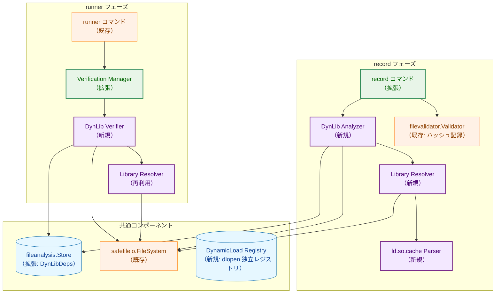
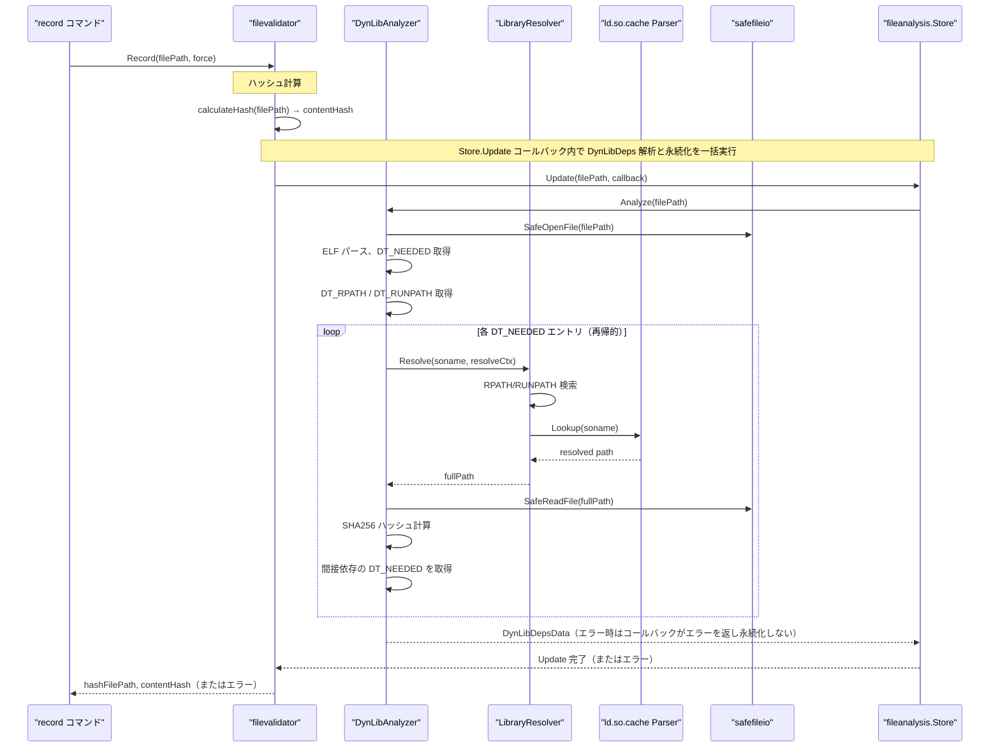
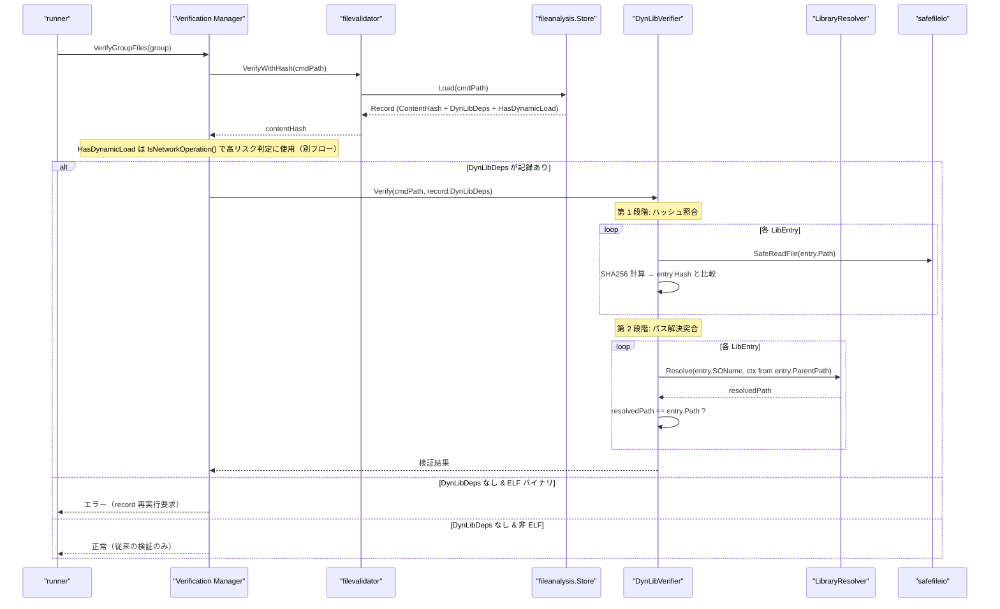
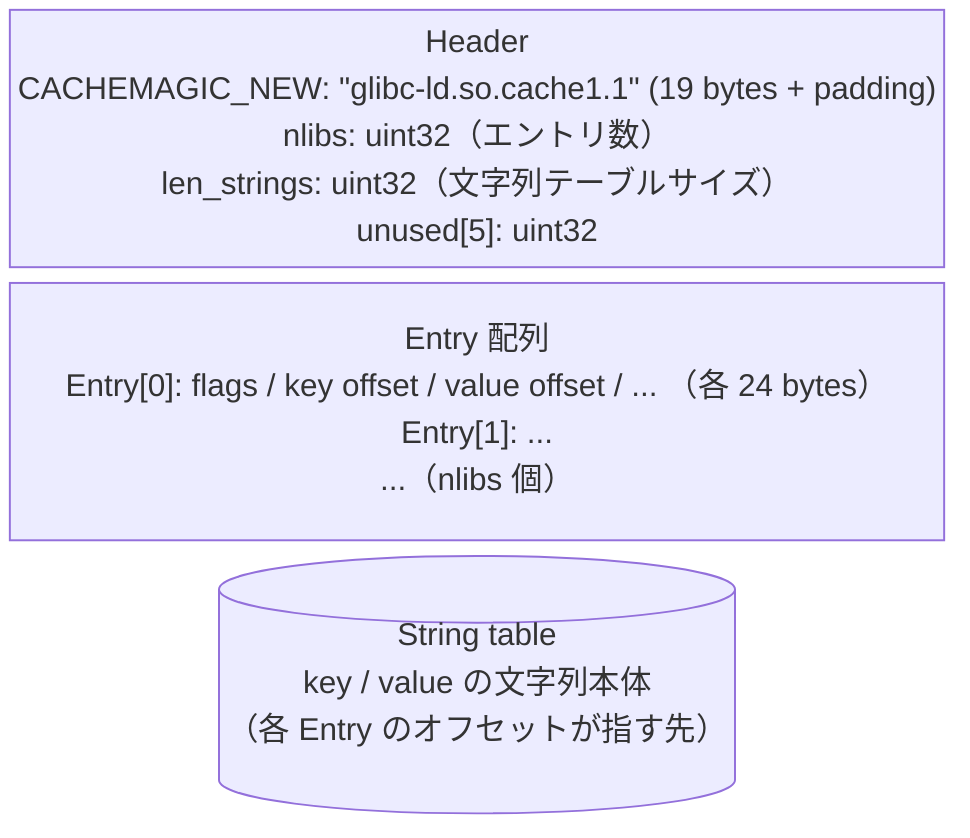
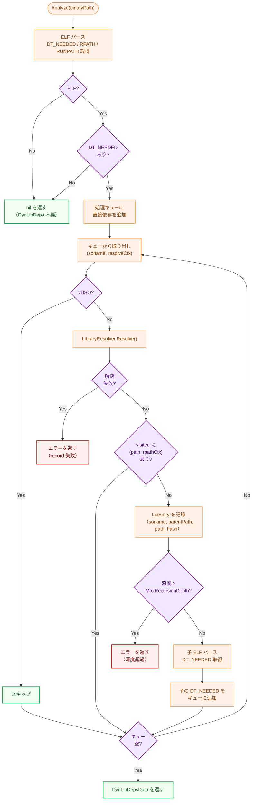
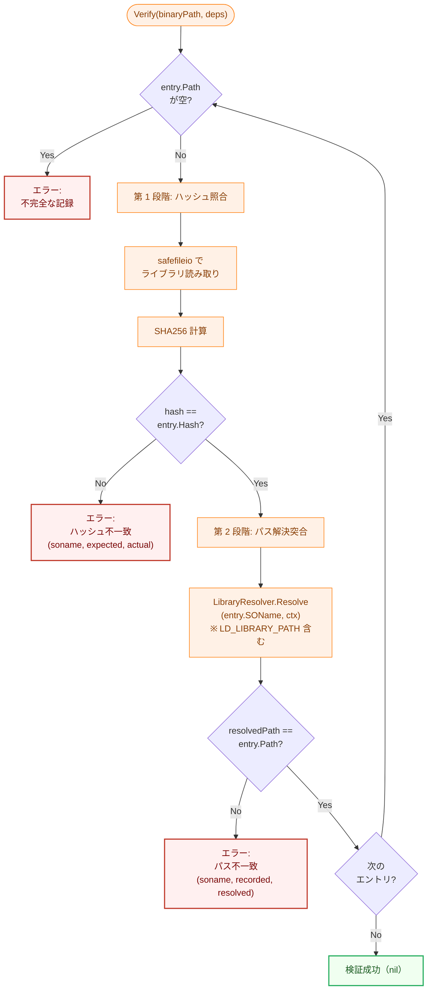
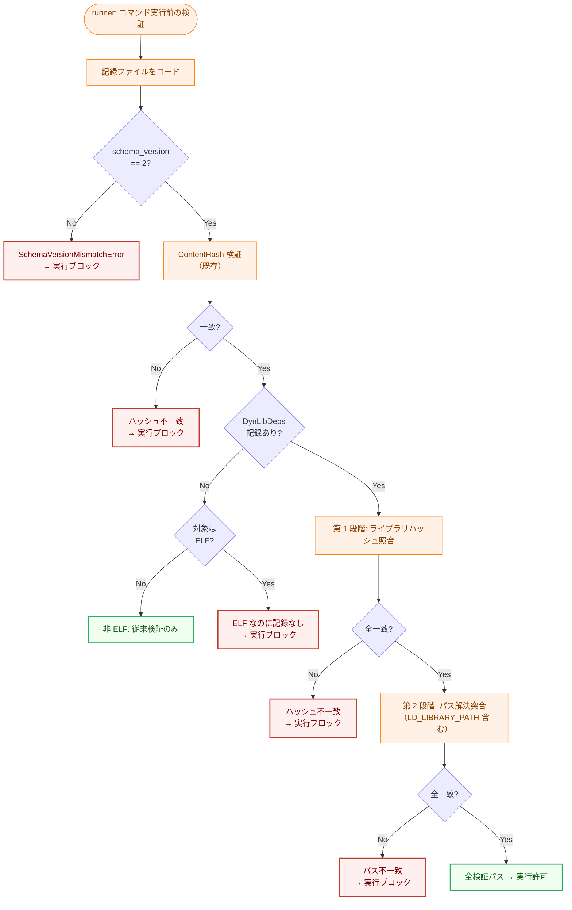
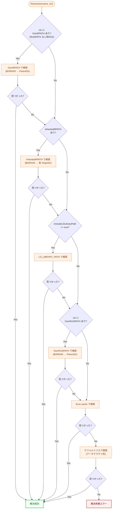
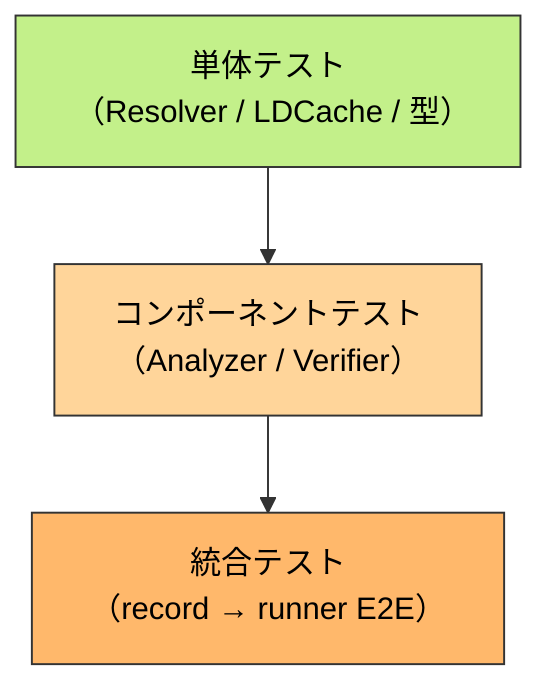
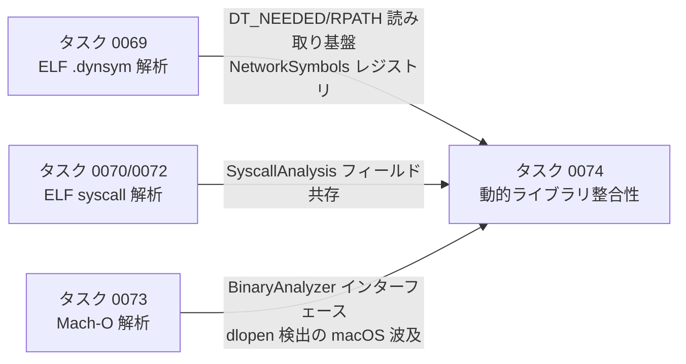

# ELF 動的リンクライブラリ整合性検証 アーキテクチャ設計書

## 1. システム概要

### 1.1 目的

ELF バイナリの `DT_NEEDED` エントリから依存ライブラリの完全な依存ツリーを解決し、`record` 時にライブラリのフルパスとハッシュのスナップショットを記録する。`runner` 実行時にスナップショットと実環境を照合し、ライブラリの差し替え・改ざんを検出する。

同時に、`dlopen` / `dlsym` / `dlvsym` を検出対象シンボルに追加し、実行時ロードを使用するバイナリを安全側に倒してリスクありと判定する。

### 1.2 設計原則

- **Security First**: ライブラリ解決失敗時は `record` を失敗させ、不完全なスナップショットを許容しない
- **Breaking Schema Migration**: `CurrentSchemaVersion` を 1 → 2 に上げ、旧記録は `SchemaVersionMismatchError` で一律拒否する。後方互換性は維持しない（`record` の再実行が必須）
- **Zero External Dependencies**: `ldd`・`ldconfig` 等の外部コマンドに依存せず、Go 標準ライブラリ（`debug/elf`）と自前の `/etc/ld.so.cache` パーサーのみを使用する
- **DRY**: 既存の `fileanalysis.Store` の `Update` パターン、`safefileio` によるファイル読み取り、`binaryanalyzer.GetNetworkSymbols()` のシンボルレジストリを再利用する
- **YAGNI**: `ld.so` の挙動を完全に再現するのではなく、セキュリティ検証に必要な範囲でライブラリパス解決を実装する

## 2. システムアーキテクチャ

### 2.1 全体構成図



**凡例（Legend）**


### 2.2 パッケージ構成

```
internal/
├── fileanalysis/
│   └── schema.go                          # Record 拡張（DynLibDeps 追加）、DynLibDepsData/LibEntry 型定義、CurrentSchemaVersion 2
│
├── dynlibanalysis/                        # NEW: 動的ライブラリ解析パッケージ
│   ├── analyzer.go                        # DynLibAnalyzer 構造体・コンストラクタ
│   ├── resolver.go                        # LibraryResolver: DT_NEEDED → フルパス解決
│   ├── resolver_context.go                # ResolveContext: RPATH 継承チェーン管理
│   ├── ldcache.go                         # ld.so.cache パーサー
│   ├── default_paths.go                   # アーキテクチャ別デフォルト検索パス
│   ├── verifier.go                        # DynLibVerifier: runner 実行時の検証
│   └── errors.go                          # エラー型定義
│
├── runner/
│   └── security/
│       └── binaryanalyzer/
│           ├── network_symbols.go         # dynamicLoadSymbolRegistry 追加、IsDynamicLoadSymbol 追加
│           └── analyzer.go                # AnalysisOutput に HasDynamicLoad フィールド追加
│
└── cmd/
    └── record/
        └── main.go                        # dynlib 解析コンテキスト追加
```

### 2.3 データフロー: `record` フェーズ



### 2.4 データフロー: `runner` フェーズ（2 段階検証）



## 3. コンポーネント設計

### 3.1 データ構造の拡張

#### 3.1.1 `fileanalysis.Record` の拡張

```go
// internal/fileanalysis/schema.go

const (
    CurrentSchemaVersion = 2  // 1 → 2 に変更
)

type Record struct {
    SchemaVersion   int                  `json:"schema_version"`
    FilePath        string               `json:"file_path"`
    ContentHash     string               `json:"content_hash"`
    UpdatedAt       time.Time            `json:"updated_at"`
    SyscallAnalysis *SyscallAnalysisData `json:"syscall_analysis,omitempty"`
    // DynLibDeps contains the dynamic library dependency snapshot recorded at record time.
    // Only present for ELF binaries with DT_NEEDED entries.
    DynLibDeps      *DynLibDepsData      `json:"dyn_lib_deps,omitempty"`
    // HasDynamicLoad indicates that dlopen/dlsym/dlvsym symbols were found in the binary
    // at record time. When true, runner blocks execution because runtime-loaded libraries
    // cannot be statically verified.
    HasDynamicLoad  bool                 `json:"has_dynamic_load,omitempty"`
}
```

#### 3.1.2 依存ライブラリスナップショットの型定義

```go
// internal/fileanalysis/schema.go

// DynLibDepsData contains the dynamic library dependency snapshot.
type DynLibDepsData struct {
    RecordedAt time.Time  `json:"recorded_at"`
    Libs       []LibEntry `json:"libs"`
}

// LibEntry represents a single resolved dynamic library dependency.
type LibEntry struct {
    // SOName is the DT_NEEDED library name (e.g., "libssl.so.3").
    SOName string `json:"soname"`

    // ParentPath is the full path of the ELF whose DT_NEEDED references this library.
    // Used as part of the resolution key (ParentPath, SOName) for re-resolution at runner time.
    ParentPath string `json:"parent_path"`

    // Path is the resolved full path to the library file, normalized via
    // filepath.EvalSymlinks + filepath.Clean.
    Path string `json:"path"`

    // Hash is the SHA256 hash of the library file in "sha256:<hex>" format.
    Hash string `json:"hash"`
}
```

### 3.2 ライブラリパス解決エンジン

#### 3.2.1 `LibraryResolver`

```go
// internal/dynlibanalysis/resolver.go

// LibraryResolver resolves DT_NEEDED library names to filesystem paths.
// It implements a subset of the ld.so resolution algorithm sufficient for
// security verification purposes.
type LibraryResolver struct {
    cache     *LDCache         // parsed /etc/ld.so.cache (may be nil)
    fs        safefileio.FileSystem
    archPaths []string         // architecture-specific default search paths
}

// NewLibraryResolver creates a new resolver. It attempts to parse /etc/ld.so.cache
// and falls back to default paths only if the cache is unavailable.
func NewLibraryResolver(fs safefileio.FileSystem, elfMachine elf.Machine) *LibraryResolver

// Resolve resolves a DT_NEEDED soname to a filesystem path using the given context.
// The resolution order follows ld.so(8) with inherited RPATH support (see Section 5.1):
//   1. OwnRPATH    – ctx.OwnRPATH, only when ctx.OwnRUNPATH is absent
//   2. InheritedRPATH – ctx.InheritedRPATH from ancestor ELFs ($ORIGIN per originating ELF)
//   3. LD_LIBRARY_PATH – only if ctx.IncludeLDLibraryPath is true
//   4. OwnRUNPATH  – ctx.OwnRUNPATH ($ORIGIN → ctx.ParentDir)
//   5. /etc/ld.so.cache
//   6. Default paths (architecture-dependent)
func (r *LibraryResolver) Resolve(soname string, ctx *ResolveContext) (string, error)
```

#### 3.2.2 `ResolveContext`: RPATH 継承チェーン管理

```go
// internal/dynlibanalysis/resolver_context.go

// ResolveContext holds the resolution context for a specific DT_NEEDED entry.
// It tracks the RPATH/RUNPATH of the parent ELF and the inherited RPATH chain
// from ancestor ELFs.
type ResolveContext struct {
    // ParentPath is the full path of the ELF whose DT_NEEDED is being resolved.
    ParentPath string

    // ParentDir is filepath.Dir(ParentPath), used for $ORIGIN expansion
    // of the parent's own RPATH/RUNPATH.
    ParentDir string

    // OwnRPATH is the DT_RPATH of ParentPath (empty if DT_RUNPATH is present).
    OwnRPATH []string

    // OwnRUNPATH is the DT_RUNPATH of ParentPath.
    OwnRUNPATH []string

    // InheritedRPATH is the ordered list of RPATH entries inherited from
    // ancestor ELFs. Each entry is an ExpandedRPATHEntry containing the
    // search path and the originating ELF path (for $ORIGIN expansion).
    // Inheritance is terminated when an ancestor with DT_RUNPATH is encountered.
    InheritedRPATH []ExpandedRPATHEntry

    // IncludeLDLibraryPath controls whether LD_LIBRARY_PATH is consulted.
    // false at record time, true at runner time.
    IncludeLDLibraryPath bool
}

// ExpandedRPATHEntry is an RPATH entry with its originating ELF path,
// needed for correct $ORIGIN expansion of inherited RPATH entries.
type ExpandedRPATHEntry struct {
    // Path is the RPATH entry (may contain $ORIGIN).
    Path string
    // OriginDir is the directory of the ELF that owns this RPATH entry.
    OriginDir string
}

// NewChildContext creates a ResolveContext for resolving the DT_NEEDED entries
// of a resolved library. It computes the RPATH inheritance chain according to
// ld.so rules: DT_RPATH is inherited to children (when DT_RUNPATH is absent),
// while DT_RUNPATH is not inherited.
func (c *ResolveContext) NewChildContext(
    childPath string,
    childRPATH []string,
    childRUNPATH []string,
) *ResolveContext
```

### 3.3 `/etc/ld.so.cache` パーサー

```go
// internal/dynlibanalysis/ldcache.go

// LDCache represents a parsed /etc/ld.so.cache file.
type LDCache struct {
    entries map[string]string // soname → resolved path
}

// ParseLDCache parses the /etc/ld.so.cache binary file.
// Only the new format ("glibc-ld.so.cache1.1") is supported.
// Returns nil and a warning-level log if the cache is unavailable or unsupported.
func ParseLDCache(path string) (*LDCache, error)

// Lookup returns the resolved path for the given soname.
// Returns empty string if not found.
func (c *LDCache) Lookup(soname string) string
```

**`ld.so.cache` バイナリフォーマット（新形式）**:



### 3.4 `DynLibAnalyzer`: `record` 時の解析

```go
// internal/dynlibanalysis/analyzer.go

const (
    // MaxRecursionDepth is the maximum depth for recursive dependency resolution.
    MaxRecursionDepth = 20
)

// DynLibAnalyzer resolves and records dynamic library dependencies for ELF binaries.
type DynLibAnalyzer struct {
    resolver *LibraryResolver
    fs       safefileio.FileSystem
    hashAlgo string // "sha256"
}

// NewDynLibAnalyzer creates a new analyzer.
func NewDynLibAnalyzer(fs safefileio.FileSystem) (*DynLibAnalyzer, error)

// Analyze resolves all direct and transitive DT_NEEDED dependencies of the given
// ELF binary, computes their hashes, and returns a DynLibDepsData snapshot.
//
// Returns nil (not an error) if the file is not ELF or has no DT_NEEDED entries.
// Returns an error if any library cannot be resolved (FR-3.1.7).
func (a *DynLibAnalyzer) Analyze(binaryPath string) (*DynLibDepsData, error)
```

**再帰解決の処理フロー**:



**`visited` セットのキー設計**:

`visited` セットは `(resolvedPath, inheritedRPATHContext)` の組をキーとして管理する。`resolvedPath` 単独をキーにすることは**禁止**する。

同一の `.so` ファイル（同一 `resolvedPath`）でも、異なる依存チェーンを経て到達した場合は継承 RPATH が異なることがある。継承 RPATH が異なれば、その子依存の解決結果も変わり得るため、別エントリとして解析しなければ依存ツリーが不正確になる。

例: `binary`（RPATH: `/opt/A`）→ `libX.so` と、`libY.so`（RPATH なし）→ `libX.so` は、同じ `libX.so` でも継承 RPATH が異なるため、`libX.so` の子依存の解決に使われるパスが変わる。

### 3.5 `DynLibVerifier`: `runner` 時の検証

```go
// internal/dynlibanalysis/verifier.go

// DynLibVerifier performs two-stage verification of recorded library dependencies.
type DynLibVerifier struct {
    fs safefileio.FileSystem
}

// NewDynLibVerifier creates a new verifier.
func NewDynLibVerifier(fs safefileio.FileSystem) *DynLibVerifier

// Verify performs two-stage verification of dynamic library dependencies.
//
// Stage 1 (Hash verification): For each LibEntry, compute the hash of the file
// at entry.Path and compare with entry.Hash.
//
// Stage 2 (Path resolution verification): For each LibEntry, re-resolve
// (entry.ParentPath, entry.SOName) using the current environment (including
// LD_LIBRARY_PATH) and verify that the resolved path matches entry.Path.
//
// Returns nil if all checks pass.
// Returns a descriptive error if any check fails (hash mismatch, path mismatch,
// empty path, or resolution failure).
func (v *DynLibVerifier) Verify(binaryPath string, deps *DynLibDepsData) error
```

**2 段階検証のフロー**:



### 3.6 `dlopen` シンボル検出（方策 B）

#### 3.6.1 設計方針

`dlopen/dlsym/dlvsym` はネットワーク操作ではなく動的ロードであり、`networkSymbolRegistry` に追加して `NetworkDetected` を返す設計では `AnalysisOutput.IsNetworkCapable()` や `"network_detected"` ログの意味が崩れる。

そのため、**`AnalysisOutput` に `HasDynamicLoad bool` フィールドを追加**し、`networkSymbolRegistry` とは独立したレジストリ（`dynamicLoadSymbolRegistry`）で検出する。既存の `NetworkDetected` の意味（ネットワーク操作可能）は変更しない。

#### 3.6.2 `AnalysisOutput` の拡張

```go
// internal/runner/security/binaryanalyzer/analyzer.go

// AnalysisOutput contains the complete result of binary analysis.
type AnalysisOutput struct {
    Result          AnalysisResult
    DetectedSymbols []DetectedSymbol
    Error           error
    // HasDynamicLoad indicates that dlopen/dlsym/dlvsym symbols were found.
    // When true, dynamic library integrity cannot be statically verified.
    // This field is independent of Result (a binary can have both network
    // symbols and dynamic load symbols).
    HasDynamicLoad bool
}
```

#### 3.6.3 動的ロードシンボルレジストリ

```go
// internal/runner/security/binaryanalyzer/network_symbols.go

// dynamicLoadSymbolRegistry contains symbols indicating runtime library loading.
// Kept separate from networkSymbolRegistry to avoid conflating dynamic load
// detection with network capability detection.
var dynamicLoadSymbolRegistry = map[string]struct{}{
    "dlopen":  {},  // Runtime library loading
    "dlsym":   {},  // Symbol resolution from loaded library
    "dlvsym":  {},  // Versioned symbol resolution
}

// IsDynamicLoadSymbol checks if the given symbol name is a dynamic load function.
func IsDynamicLoadSymbol(name string) bool {
    _, found := dynamicLoadSymbolRegistry[name]
    return found
}
```

この変更は ELF・Mach-O 両方のアナライザーに波及する（`HasDynamicLoad` フラグのセットを各アナライザーに追加）。`dlopen` を使用する `python3`, `java`, `bash`, `git` 等が `HasDynamicLoad: true` と判定されるのは仕様通りの動作である。

### 3.7 `record` コマンドの拡張

既存の `Validator.Record()` は内部で `Store.Update(filePath, callback)` を呼ぶ構造になっている。DynLibDeps の解析と永続化をこのコールバック内に組み込むことで、解析失敗時にコールバックがエラーを返し `Store.Update` 全体がロールバックされる（何も書かれない）。

`Validator` に `DynLibAnalyzer` を注入し、`Record()` 内で呼び出す:

```go
// internal/filevalidator/validator.go

// Validator provides functionality to record and verify file hashes.
type Validator struct {
    algorithm          HashAlgorithm
    hashDir            string
    hashFilePathGetter common.HashFilePathGetter
    // ...existing fields...
    dynlibAnalyzer *dynlibanalysis.DynLibAnalyzer // nil if dynlib analysis is disabled
}

// Record calculates the hash of the file and saves it together with DynLibDeps
// and HasDynamicLoad in a single Store.Update call. If dynlib analysis fails
// (resolution error, depth exceeded), the callback returns an error and nothing
// is persisted.
func (v *Validator) Record(filePath string, force bool) (string, string, error) {
    // 1. calculateHash(filePath) → contentHash
    // 2. output = binaryanalyzer.AnalyzeNetworkSymbols(filePath) → HasDynamicLoad
    // 3. store.Update(filePath, func(record) {
    //        record.ContentHash = contentHash
    //        record.HasDynamicLoad = output.HasDynamicLoad
    //        if v.dynlibAnalyzer != nil {
    //            dynLibDeps, err := v.dynlibAnalyzer.Analyze(filePath)
    //            if err != nil { return err }  // ← 解析失敗 → 永続化しない
    //            record.DynLibDeps = dynLibDeps
    //        }
    //    })
}
```

`processFiles()` のフローに統合:

```
processFiles():
  for each file:
    1. recorder.Record(filePath, force)          ← 既存 API（ハッシュ計算 + DynLibDeps 解析 + 一括永続化）
       ├─ 解析失敗（解決失敗・深度超過）→ failures++; continue  ← 何も永続化されない
       └─ ErrNotELF / ErrNotDynELF → DynLibDeps = nil のまま永続化（正常）
    2. syscallCtx.analyzeFile(filePath, contentHash)  ← 既存（静的 ELF 用、内部で永続化、非致命的）
```

> **NOTE**: syscall 解析（ステップ 2）は既存実装を変更しないため、内部で `SaveSyscallAnalysis()` を呼んで独立して永続化する。`Record()`（ステップ 1）との統合は本タスクのスコープ外である。

### 3.8 `runner` 検証フローの拡張

#### 3.8.1 `FileValidator` インターフェースへの `LoadRecord` 追加

`Manager` が持つのは `filevalidator.FileValidator` インターフェースのみであり、具象型 `*Validator` の `GetStore()` には直接アクセスできない。`DynLibDeps` を読み取るため、`FileValidator` に `LoadRecord` を追加する。

```go
// internal/filevalidator/validator.go

// FileValidator interface defines the basic file validation methods
type FileValidator interface {
    Record(filePath string, force bool) (string, string, error)
    Verify(filePath string) error
    VerifyWithHash(filePath string) (string, error)
    VerifyWithPrivileges(filePath string, privManager runnertypes.PrivilegeManager) error
    VerifyAndRead(filePath string) ([]byte, error)
    VerifyAndReadWithPrivileges(filePath string, privManager runnertypes.PrivilegeManager) ([]byte, error)
    // LoadRecord returns the full analysis record for the given file path.
    // Used by verification.Manager to access DynLibDeps without exposing the store directly.
    LoadRecord(filePath string) (*fileanalysis.Record, error)
}
```

#### 3.8.2 `verifyDynLibDeps` の実装

`verification.Manager.VerifyGroupFiles()` の検証ループ内に、`DynLibDeps` の検証を追加する。

```go
// internal/verification/manager.go

// verifyDynLibDeps performs dynamic library integrity verification
// when a DynLibDeps snapshot is present in the analysis record.
func (m *Manager) verifyDynLibDeps(cmdPath string, contentHash string) error {
    // 1. m.fileValidator.LoadRecord(cmdPath) でレコードを取得
    // 2. If DynLibDeps is nil:
    //    a. Check if target is ELF → error (record re-run required)
    //    b. Non-ELF → return nil (no verification needed)
    // 3. DynLibVerifier.Verify(cmdPath, record.DynLibDeps)
    //
    // NOTE: HasDynamicLoad の判定は IsNetworkOperation() で行う（3.9節参照）
}
```

統合ポイント: 既存の `verifyFileWithHash()` が成功した後に `verifyDynLibDeps()` を呼び出す。

### 3.9 `HasDynamicLoad` と `NetworkAnalyzer` の統合

`HasDynamicLoad` は `verifyDynLibDeps()` でブロックするのではなく、既存の `NetworkAnalyzer.isNetworkViaBinaryAnalysis()` と同様に「ネットワーク操作とみなす（高リスク扱い）」として処理する。これにより `dlopen` 使用バイナリは `NetworkDetected` バイナリと同等の扱いになる。

```go
// internal/runner/security/network_analyzer.go

func (a *NetworkAnalyzer) isNetworkViaBinaryAnalysis(cmdPath string, contentHash string) bool {
    output := a.binaryAnalyzer.AnalyzeNetworkSymbols(cmdPath, contentHash)

    // 既存: NetworkDetected → true
    // 既存: AnalysisError → true（安全側）

    // NEW: HasDynamicLoad → true（dlopen 使用バイナリも高リスク扱い）
    if output.HasDynamicLoad {
        slog.Debug("Binary analysis detected dynamic load symbols (dlopen/dlsym/dlvsym)",
            "path", cmdPath)
        return true
    }

    // ... 既存の switch output.Result { ... }
}
```

`fileanalysis.Record.HasDynamicLoad` は `record` 時に保存済みのため、`runner` は再解析不要で `LoadRecord()` 経由で値を読み取れる。ただし `isNetworkViaBinaryAnalysis()` は `AnalysisOutput`（メモリ）を使う構造のため、`Record` の `HasDynamicLoad` を `AnalysisOutput.HasDynamicLoad` に反映する経路が必要である。

**実装方針**: `Validator.Record()` で `AnalyzeNetworkSymbols()` を呼んで `output.HasDynamicLoad` を `record.HasDynamicLoad` に保存する（3.7節参照）。`runner` フェーズでは `LoadRecord()` で読み込んだ `record.HasDynamicLoad` を `AnalysisOutput` に注入して `isNetworkViaBinaryAnalysis()` の判定に使用する。

## 4. セキュリティアーキテクチャ

### 4.1 攻撃ベクターと防御

| 攻撃ベクター | 防御層 | 検出メカニズム |
|------------|-------|-------------|
| ライブラリ改ざん（同一パスで中身書き換え） | 第 1 段階 | ハッシュ不一致 |
| `LD_LIBRARY_PATH` ハイジャック | 第 2 段階 | パス解決不一致 |
| ライブラリ丸ごと差し替え | 第 1 + 第 2 段階 | ハッシュ不一致 + パス不一致 |
| 間接依存ライブラリの差し替え | 再帰的解決 | 全依存ツリーがスナップショットに含まれる |
| `dlopen` による未知ライブラリのロード | 方策 B | `record` 時に `HasDynamicLoad: true` を記録し `runner` で高リスク扱い（`NetworkDetected` と同等） |
| 不完全な記録（`path: ""`）の悪用 | 防御的検出 | `record` 時にエラー + `runner` 時にブロック |
| シンボリックリンク攻撃（ライブラリ読み取り時） | `safefileio` | `O_NOFOLLOW` による防止 |
| `record` 時と `runner` 時の `LD_LIBRARY_PATH` の非対称性 | 設計方針 | `record` 時は使用しない（基準の安定性）、`runner` 時は含める（実際のロードパスとの合致） |
| 旧スキーマの記録による検証すり抜け | スキーマバージョン | `SchemaVersionMismatchError` で一律拒否 |

### 4.2 セキュリティ処理フロー



### 4.3 ファイル読み取りの安全性

ライブラリのハッシュ計算時は `safefileio.SafeReadFile()` を使用する。これにより、ハッシュ計算対象のファイルがシンボリックリンクでないことが保証される。

パスの正規化は以下の順序で行う:
1. `filepath.EvalSymlinks()` — シンボリックリンクを解決して物理パスを取得
2. `filepath.Clean()` — `..` や重複スラッシュを正規化

この正規化は `record` 時の `LibEntry.Path` 記録前と、`runner` 時のパス比較前の両方で適用する。

## 5. ライブラリパス解決アルゴリズム

### 5.1 解決優先順位



### 5.2 RPATH/RUNPATH の適用スコープ

| 属性 | 適用スコープ | `$ORIGIN` 展開基準 | 継承 |
|------|------------|-------------------|------|
| `DT_RPATH` | 直接依存 + 全間接依存 | エントリを持つ ELF のディレクトリ | あり（`DT_RUNPATH` を持つ ELF で打ち切り）|
| `DT_RUNPATH` | 直接依存のみ | エントリを持つ ELF のディレクトリ | なし |

**RPATH 継承の具体例**:

```
binary (/usr/bin/app)
  RPATH: $ORIGIN/../lib          (RUNPATH なし)
  └── libA.so (/usr/lib/libA.so)
       RUNPATH: /opt/A/lib
       └── libB.so
            → 解決に使うパス:
              1. LD_LIBRARY_PATH （runner 実行時のみ。record 時は使用しない: Section 5.6 参照）
              2. libA.so の OwnRUNPATH: /opt/A/lib
              3. ld.so.cache
              4. デフォルトパス
              ※ binary の RPATH は libA.so が RUNPATH を持つため継承打ち切り
```

### 5.3 `$ORIGIN` の展開

`$ORIGIN` は「そのエントリを持つ ELF ファイル自身」のディレクトリに展開する。継承された RPATH の `$ORIGIN` は、継承元 ELF のディレクトリが基準となる。

```go
// expandOrigin replaces $ORIGIN in the given path with the directory
// of the ELF file that owns the RPATH/RUNPATH entry.
func expandOrigin(path string, originDir string) string {
    return strings.ReplaceAll(path, "$ORIGIN", originDir)
}
```

### 5.4 デフォルト検索パス

ELF ヘッダの `e_machine` フィールドから判定:

| `elf.Machine` | アーキテクチャ | デフォルトパス（順番） |
|--------------|-------------|-------------------|
| `elf.EM_X86_64` | x86_64 | `/lib/x86_64-linux-gnu`, `/usr/lib/x86_64-linux-gnu`, `/lib64`, `/usr/lib64`, `/lib`, `/usr/lib` |
| `elf.EM_AARCH64` | arm64 | `/lib/aarch64-linux-gnu`, `/usr/lib/aarch64-linux-gnu`, `/lib64`, `/usr/lib64`, `/lib`, `/usr/lib` |
| その他 | — | `/lib64`, `/usr/lib64`, `/lib`, `/usr/lib` |

> **NOTE**: デフォルトパスは `ld.so.cache` が利用できない場合のフォールバックである（Section 5.1 ステップ 6）。64ビット専用パス（`/lib64`, `/usr/lib64`）を multi-arch パスの次に置くことで、Red Hat 系ディストリビューションとの互換性を確保しつつ、32ビットライブラリが誤って優先される問題を防ぐ。

### 5.5 vDSO のスキップ

以下の既知の vDSO 名は `DT_NEEDED` に現れてもスキップし、解決失敗扱いにしない:

```go
var knownVDSOs = map[string]struct{}{
    "linux-vdso.so.1":   {},
    "linux-gate.so.1":   {},
    "linux-vdso64.so.1": {},
}
```

### 5.6 `record` 時と `runner` 時の `LD_LIBRARY_PATH` の相違

| フェーズ | `LD_LIBRARY_PATH` | 理由 |
|---------|-------------------|------|
| `record` 時 | **使用しない** | 基準の安定性。ユーザー環境に依存しない絶対パスを記録する |
| `runner` 実行時 | **使用する** | `ld.so` が実際にロードするパスを模倣し、パスハイジャックを検出する |

## 6. エラーハンドリング設計

### 6.1 エラー型定義

```go
// internal/dynlibanalysis/errors.go

// ErrLibraryNotResolved indicates that a DT_NEEDED library could not be resolved.
type ErrLibraryNotResolved struct {
    SOName     string
    ParentPath string
    SearchPaths []string
}

// ErrRecursionDepthExceeded indicates that dependency resolution exceeded the
// maximum allowed depth.
type ErrRecursionDepthExceeded struct {
    Depth    int
    MaxDepth int
    SOName   string
}

// ErrLibraryHashMismatch indicates that a library's hash does not match the recorded value.
type ErrLibraryHashMismatch struct {
    SOName       string
    Path         string
    ExpectedHash string
    ActualHash   string
}

// ErrLibraryPathMismatch indicates that a library resolved to a different path
// than what was recorded.
type ErrLibraryPathMismatch struct {
    SOName       string
    ParentPath   string
    RecordedPath string
    ResolvedPath string
}

// ErrEmptyLibraryPath indicates that a LibEntry has an empty path,
// which should never happen in valid records (defensive check).
type ErrEmptyLibraryPath struct {
    SOName     string
    ParentPath string
}

// ErrDynLibDepsRequired indicates that a DynLibDeps record is required
// but not present for an ELF binary.
type ErrDynLibDepsRequired struct {
    BinaryPath string
}

```

### 6.2 エラーメッセージ例

**ハッシュ不一致（第 1 段階）**:
```
dynamic library hash mismatch: libssl.so.3
  path: /usr/lib/x86_64-linux-gnu/libssl.so.3
  expected hash: sha256:abc123...
  actual hash: sha256:def456...
  please re-run 'record' command
```

**パス不一致（第 2 段階）**:
```
dynamic library path mismatch: libssl.so.3
  recorded path: /usr/lib/x86_64-linux-gnu/libssl.so.3
  resolved path: /tmp/evil/libssl.so.3
  parent: /usr/bin/openssl
  cause: LD_LIBRARY_PATH may have been modified
  please re-run 'record' command
```

**解決失敗（`record` 時）**:
```
failed to resolve dynamic library: libcustom.so.1
  parent: /usr/bin/myapp
  searched paths:
    - /usr/bin/../lib (RPATH, $ORIGIN expanded)
    - /etc/ld.so.cache (not found)
    - /lib/x86_64-linux-gnu (not found)
    - /usr/lib/x86_64-linux-gnu (not found)
    - /lib (not found)
    - /usr/lib (not found)
    - /lib64 (not found)
    - /usr/lib64 (not found)
```

## 7. パフォーマンス設計

### 7.1 パフォーマンス特性

| 操作 | 処理内容 | 想定時間 |
|------|---------|---------|
| `ld.so.cache` 解析 | バイナリファイルのパース（`DynLibAnalyzer` 作成時に1回のみ） | < 10ms |
| 直接依存ライブラリ解決 | RPATH/cache/デフォルトパス検索 | < 1ms/ライブラリ |
| ライブラリハッシュ計算 | ファイル読み取り + SHA256 | < 50ms/ライブラリ（数 MB の場合） |
| 再帰的依存解決（典型的） | 10〜30 ライブラリ × (解決 + ハッシュ) | < 2s |
| `runner` 2 段階検証 | ハッシュ照合 + パス再解決 | ハッシュ計算時間に支配される |

### 7.2 最適化方針

- `ld.so.cache` は `DynLibAnalyzer` 作成時に一度パースし、全ライブラリ解決で再利用する
- `visited` セットにより同一ライブラリの重複解析を防止する
- ハッシュ計算にはストリーミング計算を使用し、メモリ使用量を抑制する

## 8. 段階的実装計画

### 8.1 Phase 1: 基盤型とライブラリ解決エンジン

- [ ] `dynlibanalysis` パッケージ作成、型定義（`DynLibDepsData`, `LibEntry`）
- [ ] `fileanalysis.Record` に `DynLibDeps` フィールド追加
- [ ] `CurrentSchemaVersion` を 2 に変更
- [ ] `ld.so.cache` パーサー実装
- [ ] `LibraryResolver` 実装（RPATH/RUNPATH/$ORIGIN/cache/デフォルトパス）
- [ ] `ResolveContext` 実装（RPATH 継承チェーン管理）
- [ ] デフォルト検索パス定義（アーキテクチャ別）
- [ ] ライブラリ解決のユニットテスト

### 8.2 Phase 2: `DynLibAnalyzer`（`record` 拡張）

- [ ] `DynLibAnalyzer` 実装（再帰的依存解決 + ハッシュ計算）
- [ ] vDSO スキップリスト実装
- [ ] 循環依存防止（visited セット）
- [ ] 再帰深度制限
- [ ] `record` コマンドへの `dynlibAnalysisContext` 統合
- [ ] `record` 拡張の統合テスト

### 8.3 Phase 3: `DynLibVerifier`（`runner` 拡張）

- [ ] `DynLibVerifier` 実装（2 段階検証）
- [ ] `verification.Manager` への統合
- [ ] ELF バイナリの `DynLibDeps` 未記録検出
- [ ] `LD_LIBRARY_PATH` 対応（`runner` 時のパス解決）
- [ ] エラー型・エラーメッセージ実装
- [ ] `runner` 検証の統合テスト

### 8.4 Phase 4: `dlopen` シンボル検出 + 仕上げ

- [ ] `dynamicLoadSymbolRegistry` と `IsDynamicLoadSymbol()` 追加
- [ ] `AnalysisOutput` に `HasDynamicLoad bool` フィールド追加
- [ ] ELF・Mach-O アナライザーに `HasDynamicLoad` セット処理追加
- [ ] `fileanalysis.Record` に `HasDynamicLoad bool` フィールド追加
- [ ] `Validator.Record()` で `HasDynamicLoad` を解析・記録
- [ ] `isNetworkViaBinaryAnalysis()` に `output.HasDynamicLoad` の高リスク判定を追加
- [ ] `runner` フェーズで `LoadRecord().HasDynamicLoad` を `AnalysisOutput` に注入する経路を実装
- [ ] `dlopen` 検出のユニットテスト
- [ ] `HasDynamicLoad: true` のバイナリで `runner` が高リスク扱いになることの統合テスト
- [ ] 既存テストの全パス確認
- [ ] `make lint` / `make fmt` パス確認

## 9. テスト戦略

### 9.1 テスト階層



### 9.2 単体テスト

| テストケース | パッケージ | 検証内容 |
|-------------|----------|---------|
| `ld.so.cache` 解析 | `dynlibanalysis` | テストデータ（最小構成バイナリ）を使ったパース |
| RPATH 解決 | `dynlibanalysis` | RPATH ディレクトリからの解決 |
| RUNPATH 解決 | `dynlibanalysis` | RUNPATH ディレクトリからの解決 |
| RPATH/RUNPATH 優先順位 | `dynlibanalysis` | RUNPATH 存在時に RPATH が無効化されること |
| `$ORIGIN` 展開 | `dynlibanalysis` | ELF 自身のディレクトリに展開 |
| RPATH 継承 | `dynlibanalysis` | 間接依存に親の RPATH が適用されること |
| RPATH 継承打ち切り | `dynlibanalysis` | RUNPATH を持つ ELF で継承が打ち切られること |
| `$ORIGIN` 継承時の展開基準 | `dynlibanalysis` | 継承元 ELF のディレクトリが基準 |
| デフォルトパス | `dynlibanalysis` | アーキテクチャ別パスからの解決 |
| vDSO スキップ | `dynlibanalysis` | `linux-vdso.so.1` 等がスキップされること |
| 解決失敗 | `dynlibanalysis` | エラーに soname が含まれること |
| 循環依存防止 | `dynlibanalysis` | visited セットで無限ループ防止 |
| 再帰深度超過 | `dynlibanalysis` | 上限超過時にエラー |
| `dlopen` シンボル検出 | `binaryanalyzer` | `IsDynamicLoadSymbol` が `dlopen/dlsym/dlvsym` を認識すること |
| `HasDynamicLoad` フラグ | `binaryanalyzer` | `dlopen` を持つバイナリで `HasDynamicLoad: true` が返ること |
| `NetworkDetected` との独立性 | `binaryanalyzer` | `dlopen` のみのバイナリで `Result != NetworkDetected` であること |

### 9.3 コンポーネントテスト

| テストケース | 検証内容 |
|-------------|---------|
| `DynLibAnalyzer` 正常系 | 動的 ELF から DynLibDepsData を取得 |
| `DynLibAnalyzer` 非 ELF | nil を返すこと |
| `DynLibAnalyzer` 静的 ELF | nil を返すこと（DT_NEEDED なし）|
| `DynLibAnalyzer` 解決失敗 | エラーで記録が保存されないこと |
| `DynLibVerifier` Stage 1 正常 | ハッシュ一致で成功 |
| `DynLibVerifier` Stage 1 不一致 | ハッシュ不一致でエラー |
| `DynLibVerifier` Stage 2 正常 | パス一致で成功 |
| `DynLibVerifier` Stage 2 不一致 | パス不一致でエラー |
| `DynLibVerifier` 空パス | エラーでブロック |

### 9.4 統合テスト

| テストケース | 検証内容 |
|-------------|---------|
| `record` → `runner` 正常 | 全ステージ成功 |
| ライブラリ改ざん検出 | `record` 後にライブラリ書き換え → ブロック |
| `LD_LIBRARY_PATH` ハイジャック | パス不一致検出 |
| 旧スキーマ拒否 | `schema_version: 1` → `SchemaVersionMismatchError` |
| 非 ELF の正常動作 | `DynLibDeps` なしで従来検証 |
| `path: ""` 防御 | 手動作成の不正記録をブロック |

### 9.5 テストデータ

- `ld.so.cache` テストデータ: 最小構成のバイナリファイルをリポジトリに含める
- ELF テストバイナリ: テスト用の小さな C/Go プログラムを `testdata/` に配置（`DT_NEEDED` あり/なし、RPATH/RUNPATH 付き等）
- ライブラリ解決テスト: テンポラリディレクトリにダミー `.so` ファイルを配置して解決パスを検証

## 10. 依存関係とリスク

### 10.1 内部依存関係

| 依存元 | 依存先 | 依存内容 |
|-------|-------|---------|
| `dynlibanalysis` | `fileanalysis` | `DynLibDepsData`, `LibEntry`, `Store` |
| `dynlibanalysis` | `safefileio` | 安全なファイル読み取り |
| `filevalidator` | `dynlibanalysis` | `Validator.Record()` 内で `DynLibAnalyzer` を呼び出し（拡張） |
| `filevalidator` | `fileanalysis` | `FileValidator` インターフェースに `LoadRecord` 追加（拡張） |
| `verification` | `dynlibanalysis` | `DynLibVerifier` |
| `verification` | `filevalidator` | `FileValidator.LoadRecord` 経由で `DynLibDeps` 読み取り |
| `binaryanalyzer` | — | `CategoryDynamicLoad` 追加（自己完結） |

### 10.2 アーキテクチャリスク

| リスク | 影響度 | 対策 |
|-------|-------|------|
| `ld.so.cache` フォーマットの差異 | 中 | 新フォーマットのみサポート、失敗時はデフォルトパスフォールバック |
| ライブラリ解決精度 | 低 | `ld.so` の完全再現は不要、セキュリティ検証に必要な範囲に限定 |
| `CurrentSchemaVersion` 変更の影響 | 高 | 全管理対象バイナリの `record --force` 再実行が必要（README に明記）|
| パフォーマンス（大量依存ライブラリ） | 低 | 典型バイナリは 10〜30 依存、上限 20 段で制御 |
| `dlopen` 検出の false positive 増加 | 中 | 仕様通りの動作として文書化 |

### 10.3 先行タスクとの関係



| 再利用元 | 再利用内容 |
|---------|----------|
| `fileanalysis.Store` | 記録の読み書き（`Update` / `Load`） |
| `fileanalysis.Record` | スキーマバージョン管理、`SyscallAnalysis` 共存 |
| `safefileio.FileSystem` | シンボリックリンク攻撃防止 |
| `binaryanalyzer.AnalysisOutput` | `HasDynamicLoad` フィールドを追加して動的ロード検出を拡張 |
| `filevalidator.Validator` | ハッシュ計算・検証（既存フロー維持） |
| `verification.Manager` | 検証フローの統合ポイント |
