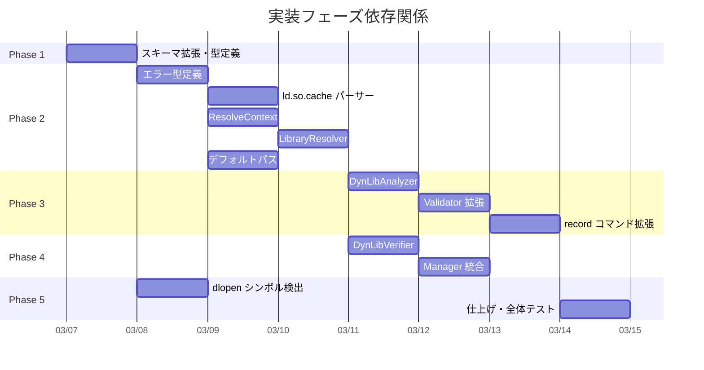
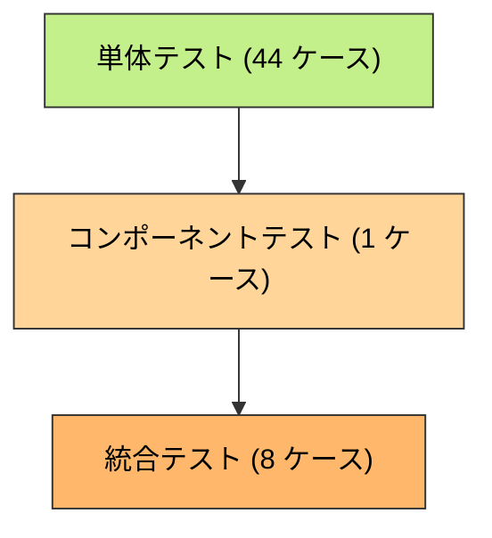

# ELF 動的リンクライブラリ整合性検証 実装計画書

## 1. 実装概要

### 1.1 実装目標

- ELF バイナリの `DT_NEEDED` から依存ライブラリの完全な依存ツリーを解決し、`record` 時にスナップショットを記録する
- `runner` 実行時に 2 段階検証（ハッシュ照合 + パス解決突合）でライブラリの差し替え・改ざんを検出する
- `dlopen` / `dlsym` / `dlvsym` を検出し、実行時ロードを使用するバイナリを高リスクと判定する
- `CurrentSchemaVersion` を 1 → 2 に上げ、旧記録を一律拒否する

### 1.2 実装スコープ

| 区分 | 内容 |
|------|------|
| 新規パッケージ | `internal/dynlibanalysis/`（7 ファイル + テスト + testdata） |
| 拡張対象 | `fileanalysis`, `filevalidator`, `verification`, `binaryanalyzer`, `elfanalyzer`, `machoanalyzer`, `network_analyzer`, `cmd/record` |
| 新規ファイル数 | 約 15 ファイル（実装 + テスト + testdata） |
| テストケース | 単体 44 件、コンポーネント 1 件、統合 8 件 |

### 1.3 想定工数

| Phase | 工数 | 内容 |
|-------|------|------|
| Phase 1 | 0.5 日 | スキーマ拡張・型定義 |
| Phase 2 | 3 日 | ライブラリ解決エンジン（ld.so.cache パーサー含む） |
| Phase 3 | 2 日 | DynLibAnalyzer（record 拡張） |
| Phase 4 | 2 日 | DynLibVerifier（runner 拡張） |
| Phase 5 | 1.5 日 | dlopen シンボル検出 + 仕上げ |
| 合計 | 9 日 | |

## 2. 実装フェーズ計画

### 2.1 Phase 1: スキーマ拡張・型定義 (0.5 日)

**目標**: `fileanalysis.Record` を拡張し、`DynLibDeps` と `HasDynamicLoad` を格納できるようにする。スキーマバージョンを 2 に上げる。

#### 実装対象

```
internal/fileanalysis/schema.go
```

#### 実装内容

##### 2.1.1 `CurrentSchemaVersion` の変更

**ファイル**: `internal/fileanalysis/schema.go`

```go
const (
    CurrentSchemaVersion = 2  // 1 → 2 に変更
)
```

##### 2.1.2 `DynLibDepsData` / `LibEntry` 型定義

**ファイル**: `internal/fileanalysis/schema.go`

```go
type DynLibDepsData struct {
    RecordedAt time.Time  `json:"recorded_at"`
    Libs       []LibEntry `json:"libs"`
}

type LibEntry struct {
    SOName         string   `json:"soname"`
    ParentPath     string   `json:"parent_path"`
    Path           string   `json:"path"`
    Hash           string   `json:"hash"`
    InheritedRPATH []string `json:"inherited_rpath,omitempty"`
}
```

##### 2.1.3 `Record` 構造体の拡張

**ファイル**: `internal/fileanalysis/schema.go`

- `DynLibDeps *DynLibDepsData` フィールド追加
- `HasDynamicLoad bool` フィールド追加

##### 2.1.4 `Store.Update` — 旧スキーマレコードの上書き許可

**ファイル**: `internal/fileanalysis/file_analysis_store.go`

`CurrentSchemaVersion` を 1 → 2 に変更すると、既存の v1 レコードを持つ全ファイルで `record --force` が失敗する問題がある。`Store.Update` が `SchemaVersionMismatchError` を一律に拒否するためである。

移行手順（「全管理対象バイナリに `record --force` を再実行」）を実行可能にするため、`Update` の `SchemaVersionMismatchError` 処理を以下のように変更する:

- `Actual < Expected`（旧スキーマ、例: v1 レコードを v2 バイナリで上書き）→ `ErrRecordNotFound` と同等に扱い、`Record{}` で上書きを許可
- `Actual > Expected`（新スキーマ、例: v3 レコードを v2 バイナリが読む）→ 現行通りエラーを返す（前方互換性保護）

```go
// internal/fileanalysis/file_analysis_store.go

if errors.As(err, new(*SchemaVersionMismatchError)) {
    var schemaErr *SchemaVersionMismatchError
    errors.As(err, &schemaErr)
    if schemaErr.Actual > schemaErr.Expected {
        // Future schema: do NOT overwrite (forward compatibility protection)
        return fmt.Errorf("cannot update record: %w", err)
    }
    // Older schema (e.g. v1 record, current binary is v2):
    // treat as if not found and allow --force to overwrite.
    record = &Record{}
} else if ...
```

##### 2.1.5 既存テストの更新

`CurrentSchemaVersion` に依存するテストケース（`Store.Load` の `SchemaVersionMismatchError` テスト等）を新しいバージョン値に更新する。

#### 完了条件

- [ ] `CurrentSchemaVersion` が 2 に変更されていること
- [ ] `DynLibDepsData`, `LibEntry` 型が定義されていること
- [ ] `Record` に `DynLibDeps`, `HasDynamicLoad` フィールドが追加されていること
- [ ] `Store.Update` が旧スキーマ（`Actual < Expected`）の `SchemaVersionMismatchError` 時に上書きを許可すること
- [ ] `Store.Update` が新スキーマ（`Actual > Expected`）の `SchemaVersionMismatchError` 時にエラーを返すこと
- [ ] 既存テストが全てパスすること
- [ ] `make lint` / `make fmt` がパスすること

---

### 2.2 Phase 2: ライブラリ解決エンジン (3 日)

**目標**: `DT_NEEDED` のライブラリ名からファイルシステム上のフルパスを解決するエンジンを実装する。RPATH/RUNPATH 継承や `/etc/ld.so.cache` の解析を含む。

#### 実装対象

```
internal/dynlibanalysis/           # NEW パッケージ
├── doc.go
├── errors.go
├── default_paths.go
├── ldcache.go
├── resolver_context.go
├── resolver.go
├── default_paths_test.go
├── ldcache_test.go
├── resolver_context_test.go
├── resolver_test.go
└── testdata/
    ├── README.md
    └── ldcache_new_format.bin
```

#### 実装内容

##### 2.2.1 パッケージ作成とエラー型

**ファイル**: `internal/dynlibanalysis/doc.go`

```go
// Package dynlibanalysis provides dynamic library dependency analysis
// and verification for ELF binaries.
package dynlibanalysis
```

**ファイル**: `internal/dynlibanalysis/errors.go`

- `ErrLibraryNotResolved`: ライブラリ解決失敗（soname, parentPath, searchPaths を含む）
- `ErrRecursionDepthExceeded`: 再帰深度超過
- `ErrLibraryHashMismatch`: ハッシュ不一致（Stage 1 検証失敗）
- `ErrLibraryPathMismatch`: パス不一致（Stage 2 検証失敗）
- `ErrEmptyLibraryPath`: 空パス（防御的チェック）
- `ErrDynLibDepsRequired`: ELF バイナリに DynLibDeps がない

##### 2.2.2 デフォルト検索パス

**ファイル**: `internal/dynlibanalysis/default_paths.go`

- `DefaultSearchPaths(machine elf.Machine) []string`
- x86_64: multiarch → lib64 → generic
- aarch64: multiarch → lib64 → generic
- その他: lib64 → generic

##### 2.2.3 `/etc/ld.so.cache` パーサー

**ファイル**: `internal/dynlibanalysis/ldcache.go`

- `LDCache` 構造体（`entries map[string]string`）
- `ParseLDCache(path string) (*LDCache, error)`: 新形式（`glibc-ld.so.cache1.1`）のみサポート
- `parseLDCacheData(data []byte) (*LDCache, error)`: unexported ヘルパー関数。テスト用に合成キャッシュデータから直接パース可能（同一パッケージ内からアクセス）
- `Lookup(soname string) string`: soname → パス検索
- ヘッダー・エントリ構造体の定義
- `extractCString` ヘルパー

##### 2.2.4 `ResolveContext`: RPATH 継承チェーン管理

> **参照**: `DT_RPATH` / `DT_RUNPATH` の継承・打ち切りルールの詳細は [docs/dev/elf-rpath-runpath-inheritance.ja.md](../../../docs/dev/elf-rpath-runpath-inheritance.ja.md) を参照のこと。`NewChildContext` の打ち切りロジックは §3（打ち切りルール）と §6（設計対応）に基づく。

**ファイル**: `internal/dynlibanalysis/resolver_context.go`

- `ResolveContext` 構造体
- `ExpandedRPATHEntry` 構造体（Path + OriginDir）
- `NewRootContext()`: ルートバイナリ用の初期コンテキスト
- `NewChildContext()`: 子依存用のコンテキスト（RPATH 継承ルール適用）
- `InheritedRPATHKey()`: visited セット用のキー生成
- `expandOrigin()`: `$ORIGIN` 展開ヘルパー

##### 2.2.5 `LibraryResolver`: パス解決

**ファイル**: `internal/dynlibanalysis/resolver.go`

- `LibraryResolver` 構造体（cache, archPaths）— `fs` フィールドなし
- `NewLibraryResolver(cache *LDCache, elfMachine elf.Machine) *LibraryResolver`
  - `cache` は呼び出し元（`DynLibAnalyzer` / `DynLibVerifier`）が構築時に 1 回パースして渡す
  - ld.so.cache のパースは `NewLibraryResolver` の責務**ではない**
  - `safefileio.FileSystem` は不要: `tryResolve` は `os.Lstat` + `filepath.EvalSymlinks` を直接使用（`safefileio` はコンテンツ読み取り向け、パス存在確認向けではない）
- `Resolve(soname string, ctx *ResolveContext) (string, error)`: 6 段階の優先順位で解決
- `tryResolve(candidate string) (string, error)`: 存在確認 + `EvalSymlinks` + `Clean`

##### 2.2.6 テストデータ作成

**ファイル**: `internal/dynlibanalysis/testdata/README.md`

- テストデータの説明と生成方法
- `ldcache_new_format.bin`: Go のテストコード内で最小構成のバイナリデータを生成

#### 完了条件

- [ ] `dynlibanalysis` パッケージが作成されていること
- [ ] エラー型が全て定義されていること
- [ ] `DefaultSearchPaths` がアーキテクチャ別に正しいパスを返すこと
- [ ] `ParseLDCache` が新形式のキャッシュを正しくパースすること
- [ ] `ParseLDCache` がキャッシュ不在・フォーマット不正時にエラーを返すこと
- [ ] `NewLibraryResolver(cache, machine)` が `cache` を引数で受け取り、自身で `ParseLDCache` を呼ばないこと（`fs` 引数なし）
- [ ] `ResolveContext.NewChildContext` が RPATH 継承ルールに従うこと
- [ ] `ResolveContext.NewChildContext` が loading object（child）自身に RUNPATH がある場合に `InheritedRPATH = nil` とし、祖先の RPATH チェーン全体を打ち切ること（[参照](../../../docs/dev/elf-rpath-runpath-inheritance.ja.md#3-dt_rpath-継承チェーンの打ち切りルール)）
- [ ] `LibraryResolver.Resolve` が 6 段階の優先順位で解決すること
- [ ] `$ORIGIN` が正しく展開されること（直接・継承時ともに）
- [ ] 全ユニットテストがパスすること
- [ ] `make lint` / `make fmt` がパスすること

---

### 2.3 Phase 3: DynLibAnalyzer — record 拡張 (2 日)

**目標**: `record` コマンドで ELF バイナリの動的ライブラリ依存関係を再帰的に解決・記録する。

#### 実装対象

```
internal/dynlibanalysis/analyzer.go        # NEW
internal/dynlibanalysis/analyzer_test.go   # NEW
internal/filevalidator/validator.go        # 拡張
cmd/record/main.go                         # 拡張
```

#### 実装内容

##### 2.3.1 `DynLibAnalyzer` 実装

**ファイル**: `internal/dynlibanalysis/analyzer.go`

- `DynLibAnalyzer` 構造体（fs, cache）— `resolver` フィールドは持たない
- `NewDynLibAnalyzer(fs) *DynLibAnalyzer`: 構築時に `ParseLDCache` を 1 回呼び `cache` を保持
- `Analyze()` 内でバイナリのアーキテクチャが確定してから `NewLibraryResolver(cache, machine)` を呼ぶ
- `Analyze(binaryPath string) (*DynLibDepsData, error)`:
  - ELF パース → `DT_NEEDED`, `DT_RPATH`, `DT_RUNPATH` 取得
  - 非 ELF → `nil, nil`（正常）
  - `DT_NEEDED` なし → `nil, nil`（正常）
  - BFS キューで再帰的依存解決
  - `knownVDSOs` スキップ
  - `visitedKey`（resolvedPath + inheritedRPATHKey）で重複防止
  - `MaxRecursionDepth`（20 段）超過時はエラー
  - ライブラリ解決失敗時はエラー（何も永続化しない）
- `computeFileHash(path string) (string, error)`: パッケージレベル関数。`safefileio.SafeReadFile` + SHA256。`DynLibAnalyzer` と `DynLibVerifier` の両方から呼び出す（DRY）
- `parseELFDeps(path string) (needed, rpath, runpath []string, err error)`
- `splitPathList(pathLists []string) []string`

##### 2.3.2 `Validator` への `DynLibAnalyzer` 注入

**ファイル**: `internal/filevalidator/validator.go`

- `Validator.dynlibAnalyzer` フィールド追加（`*dynlibanalysis.DynLibAnalyzer`、nil 可）
- `LoadRecord(filePath string) (*fileanalysis.Record, error)` メソッド追加
- `FileValidator` インターフェースに `LoadRecord` 追加
- `saveHash` の `store.Update` コールバック内に DynLibDeps 解析を統合

> **設計注記（I/O と store.Update の関係）**: `store.Update` は現時点でファイルロック機構を持たない（Load → インメモリ修正 → Save の単純シーケンス）。そのため、コールバック内で重いI/O（再帰 ELF 探索・SHA256 計算等）を行っても「ロック保持期間の肥大化」は発生しない。並行 `record` 実行時の競合ウィンドウはコールバック外に出しても縮まるだけでゼロにはならず、YAGNI 観点からも今の設計（コールバック内で解析）で問題ない。将来 `store.Update` にファイルロックが導入される場合は、解析を事前に完了させてから `store.Update` を呼ぶ形にリファクタリングすること。

> **設計注記（Setter メソッド）**: `Validator` は `filevalidator` パッケージに属し、フィールドはパッケージ外から直接アクセス不可である。`cmd/record/main.go` から注入するため、**公開セッターメソッド**（`SetDynLibAnalyzer`, `SetBinaryAnalyzer`）を追加する。

##### 2.3.3 `record` コマンドへの統合

**ファイル**: `cmd/record/main.go`

- `deps.validatorFactory` のシグネチャを `func(hashDir string) (*filevalidator.Validator, error)` に変更する
  （戻り値をインターフェース型 `hashRecorder` から具象型 `*filevalidator.Validator` に変更）
- `run()` 関数内で `DynLibAnalyzer` を作成し、`validatorFactory` が返した `*Validator` の `SetDynLibAnalyzer` セッターで注入する
- `processFiles` には引き続き `hashRecorder` インターフェースとして渡す（シグネチャ変更不要）
- `processFiles` のフロー変更なし（`Record()` 内部で自動的に解析される）

> **根拠**: `syscallAnalysisContext` が既に「`run()` で構築し依存を構築時に解決する」パターンを採用している。同じパターンに揃えることで一貫性を保ち、インターフェースを汚染しない。

#### 完了条件

- [ ] `DynLibAnalyzer.Analyze` が動的 ELF から `DynLibDepsData` を返すこと
- [ ] `DynLibAnalyzer.Analyze` が非 ELF / 静的 ELF で `nil` を返すこと
- [ ] `LibEntry` に `soname`, `parent_path`, `path`, `hash`, `inherited_rpath` が正しく記録されること
- [ ] 間接依存が再帰的に解決・記録されること
- [ ] vDSO がスキップされること
- [ ] 循環依存で無限ループしないこと
- [ ] 再帰深度超過時にエラーで `record` が失敗すること
- [ ] ライブラリ解決失敗時にエラーで `record` が失敗し、何も永続化されないこと
- [ ] `record --force` で `DynLibDeps` が更新されること
- [ ] `FileValidator.LoadRecord` が正しくレコードを返すこと
- [ ] 既存テストが全てパスすること
- [ ] `make lint` / `make fmt` がパスすること

---

### 2.4 Phase 4: DynLibVerifier — runner 拡張 (2 日)

**目標**: `runner` 実行時に 2 段階検証でライブラリの整合性を検証する。

#### 実装対象

```
internal/dynlibanalysis/verifier.go        # NEW
internal/dynlibanalysis/verifier_test.go   # NEW
internal/verification/manager.go           # 拡張
internal/verification/interfaces.go        # 拡張（ManagerInterface への VerifyCommandDynLibDeps 追加）
internal/runner/group_executor.go          # 拡張（コマンドごとの VerifyCommandDynLibDeps 呼び出し）
internal/verification/testing/testify_mocks.go  # 更新（MockManager, MockFileValidator への追加）
```

#### 実装内容

##### 2.4.1 `DynLibVerifier` 実装

**ファイル**: `internal/dynlibanalysis/verifier.go`

- `DynLibVerifier` 構造体（fs, cache）— `DynLibAnalyzer` と同じパターン
- `NewDynLibVerifier(fs) *DynLibVerifier`: 構築時に `ParseLDCache` を 1 回呼び `cache` を保持
- `Verify(binaryPath string, deps *DynLibDepsData) error`:
  - 第 1 段階: 各 `LibEntry.Path` のハッシュ計算 → `LibEntry.Hash` と比較
  - 第 2 段階: 各 `(ParentPath, SOName)` をランタイム環境で再解決 → `LibEntry.Path` と比較
  - `IncludeLDLibraryPath: true`（runner 時は LD_LIBRARY_PATH を含む）
  - `buildResolveContext(entry)`: ParentPath の ELF を再読して ResolveContext を再構築
- `readELFPaths(path) (rpath, runpath, error)`: ELF から RPATH/RUNPATH 読み取り
- `getELFMachine(path) (elf.Machine, error)`: アーキテクチャ判定
- `computeFileHash` は `analyzer.go` で定義されたパッケージ共有関数を使用（DRY）

##### 2.4.2 `verification.Manager` への統合

**ファイル**: `internal/verification/manager.go`

- `Manager.dynlibVerifier *dynlibanalysis.DynLibVerifier` フィールド追加
- `newManagerInternal` 関数内で `NewDynLibVerifier(fs)` を 1 回呼び、`m.dynlibVerifier` に保持する（`ld.so.cache` のパースはプロセス起動時に 1 回のみ）
  - 既存コードは `newManagerInternal` + functional options パターンを採用しているため、このコンストラクタ内でフィールドを直接初期化する
  - `InternalOption` による注入は不要（`fs` は常に存在するため条件分岐不要）
- `verifyDynLibDeps(cmdPath string) error` 非公開ヘルパー追加:
  1. `m.fileValidator.LoadRecord(cmdPath)` でレコード取得
  2. `DynLibDeps` あり → `m.dynlibVerifier.Verify()`
  3. `DynLibDeps` なし & 動的リンク ELF（`DT_NEEDED` あり）→ `ErrDynLibDepsRequired`
  4. `DynLibDeps` なし & 静的 ELF / `DT_NEEDED` なし ELF / 非 ELF → `nil`（正常）
- `hasDynamicLibraryDeps(path string) (bool, error)` ヘルパー追加（`elf.Open` で `DT_NEEDED` の有無を確認）
- `VerifyCommandDynLibDeps(cmdPath string) error` **公開メソッド**追加（内部で `verifyDynLibDeps` を呼ぶ）
- `ManagerInterface` に `VerifyCommandDynLibDeps` を追加（`internal/verification/interfaces.go`）

> **注意**: `VerifyGroupFiles` 内での呼び出しは採用しない。`collectVerificationFiles` が返す `map[string]struct{}` の時点でファイルの由来（コマンドファイルか `verify_files` か）が失われており、`isCommandFile` を判定できないためである。

**呼び出し元**: `internal/runner/group_executor.go` の `verifyGroupFiles` 内で、`VerifyGroupFiles` 成功後に `runtimeGroup.Commands` をループして各コマンドパスに `VerifyCommandDynLibDeps` を呼ぶ。

##### 2.4.3 `FileValidator` インターフェースのモック更新

既存のテスト用モック（`MockFileValidator` 等）に `LoadRecord` メソッドを追加する。

##### 2.4.4 `MockManager` の更新

`internal/verification/testing/testify_mocks.go` の `MockManager` に `VerifyCommandDynLibDeps` を追加する。

#### 完了条件

- [ ] 第 1 段階: ハッシュ一致で検証成功すること
- [ ] 第 1 段階: ハッシュ不一致で `ErrLibraryHashMismatch` が返ること
- [ ] 第 2 段階: パス一致で検証成功すること
- [ ] 第 2 段階: `LD_LIBRARY_PATH` ハイジャックで `ErrLibraryPathMismatch` が返ること
- [ ] 空パスのエントリで `ErrEmptyLibraryPath` が返ること
- [ ] 動的リンク ELF（`DT_NEEDED` あり）に `DynLibDeps` がない場合に `ErrDynLibDepsRequired` が返ること
- [ ] 静的 ELF / `DT_NEEDED` なし ELF に `DynLibDeps` がない場合は正常動作すること
- [ ] 非 ELF バイナリに `DynLibDeps` がない場合は正常動作すること
- [ ] `schema_version: 1` の記録で `SchemaVersionMismatchError` が返ること
- [ ] エラーメッセージにライブラリ名・パス・ハッシュ等の必要情報が含まれること
- [ ] `VerifyCommandDynLibDeps` が `ManagerInterface` に追加されていること
- [ ] `group_executor.go` の `verifyGroupFiles` が `VerifyGroupFiles` 成功後にコマンドごとに `VerifyCommandDynLibDeps` を呼び出すこと
- [ ] `MockManager` に `VerifyCommandDynLibDeps` が追加されていること
- [ ] 既存テストが全てパスすること
- [ ] `make lint` / `make fmt` がパスすること

---

### 2.5 Phase 5: dlopen シンボル検出 + 仕上げ (1.5 日)

**目標**: `dlopen` / `dlsym` / `dlvsym` の使用を検出して高リスク判定する。全テストのパスを確認し、ドキュメントを更新する。

#### 実装対象

```
internal/runner/security/binaryanalyzer/network_symbols.go   # 拡張
internal/runner/security/binaryanalyzer/analyzer.go           # 拡張
internal/runner/security/elfanalyzer/standard_analyzer.go     # 拡張
internal/runner/security/machoanalyzer/standard_analyzer.go   # 拡張
internal/runner/security/network_analyzer.go                  # 拡張
cmd/record/main.go                                            # 拡張（HasDynamicLoad 記録）
```

#### 実装内容

##### 2.5.1 `dynamicLoadSymbolRegistry` 追加

**ファイル**: `internal/runner/security/binaryanalyzer/network_symbols.go`

- `CategoryDynamicLoad SymbolCategory = "dynamic_load"`
- `dynamicLoadSymbolRegistry map[string]struct{}`: `dlopen`, `dlsym`, `dlvsym`
- `IsDynamicLoadSymbol(name string) bool`

##### 2.5.2 `AnalysisOutput.HasDynamicLoad` 追加

**ファイル**: `internal/runner/security/binaryanalyzer/analyzer.go`

- `AnalysisOutput` に `HasDynamicLoad bool` フィールド追加

##### 2.5.3 ELF/Mach-O アナライザーの拡張

**ファイル**: `internal/runner/security/elfanalyzer/standard_analyzer.go`

- シンボルチェックループに `IsDynamicLoadSymbol` 判定追加
- `hasDynamicLoad` フラグを `AnalysisOutput.HasDynamicLoad` にセット

**ファイル**: `internal/runner/security/machoanalyzer/standard_analyzer.go`

- インポートシンボルチェックループに `IsDynamicLoadSymbol` 判定追加
- `hasDynamicLoad` フラグを `AnalysisOutput.HasDynamicLoad` にセット

##### 2.5.4 `network_analyzer.go` の拡張

**ファイル**: `internal/runner/security/network_analyzer.go`

**`NewBinaryAnalyzer` の追加:**
- `NewBinaryAnalyzer() binaryanalyzer.BinaryAnalyzer` を新規公開関数として追加
- `NewNetworkAnalyzer` のプラットフォーム選択ロジック（`runtime.GOOS` switch）を本関数に委譲
- `cmd/record/main.go` はこの関数を呼び出して `BinaryAnalyzer` を取得する

**`isNetworkViaBinaryAnalysis` の拡張:**
- 戻り値を `bool` から `(isNetwork, isHighRisk bool)` に変更する
  - `HasDynamicLoad` と `output.Result` は独立したシグナルとして処理する
  - `HasDynamicLoad=true` の場合は `isHighRisk=true` をセット（既存ケースの `isNetwork` 判定には影響しない）
  - `NetworkDetected` / `AnalysisError` 等の既存ケースは `(true, isHighRisk)` を返す（`isHighRisk` は `HasDynamicLoad` の値による）
  - `dlopen+socket` を両方持つバイナリは `(true, true)` を返す（ネットワーク操作かつ高リスク）
- `IsNetworkOperation` 内の呼び出しを `isNet, isHigh := a.isNetworkViaBinaryAnalysis(...)` に変更
- ログ出力: `"Binary analysis detected dynamic load symbols (dlopen/dlsym/dlvsym)"`

> **注意**: `isNetworkViaBinaryAnalysis` が `true` を返すだけでは `IsNetworkOperation` が `(true, false)` を返し `RiskLevelMedium`（中リスク）になる。`RiskLevelHigh` にするには `isHighRisk=true` を `EvaluateRisk` まで伝播する必要がある。
>
> **セマンティクスの原則**: `isNetwork` と `isHighRisk` は独立して設定する。`HasDynamicLoad=true` かつ `NetworkDetected=true` の場合に `isNetwork=false` を返すと呼び出し元でのログ・監査時に情報が失われる。`(true, true)` を返すことで両シグナルを正確に伝播する。

##### 2.5.5 `HasDynamicLoad` の record 時記録

**ファイル**: `internal/filevalidator/validator.go`, `cmd/record/main.go`

案 A（`saveHash` の `store.Update` コールバック内に統合）を採用する。

案 B（`processFiles` 内で別途 `store.Update`）は採用しない。理由:
- `AnalyzeNetworkSymbols` はパッケージレベル関数ではなく `BinaryAnalyzer` インターフェースのメソッドであり、`processFiles` から直接呼べない
- `true` の時のみ書き込むと再 record 後に stale な `true` が残る
- `store.Update` を 2 回呼ぶと 2 回目が `DynLibDeps` を消去するリスクがある

実装内容:
- `Validator.binaryAnalyzer binaryanalyzer.BinaryAnalyzer` フィールド追加（nil 可）, `SetBinaryAnalyzer` セッター追加
- `saveHash` コールバック内で `record.HasDynamicLoad = output.HasDynamicLoad` を常に代入（true/false 両方）
- `cmd/record/main.go` の `run()` で `security.NewBinaryAnalyzer()` を呼び、`SetBinaryAnalyzer` セッターで注入する
  （§2.3.3 と同様に `deps.validatorFactory` が `*filevalidator.Validator` を返す設計を利用する）

##### 2.5.6 全体テスト・仕上げ

- `dlopen` シンボル検出のユニットテスト
- `HasDynamicLoad: true` のバイナリで `runner` が高リスク扱いになることの統合テスト
- 既存テストの全パス確認
- `make test` / `make lint` / `make fmt` 全パス確認
- CHANGELOG 更新

#### 完了条件

- [ ] `IsDynamicLoadSymbol` が `dlopen/dlsym/dlvsym` を認識すること
- [ ] `HasDynamicLoad` が `NetworkDetected` とは独立して設定されること
- [ ] ELF アナライザーで `dlopen` 使用バイナリが `HasDynamicLoad: true` と判定されること
- [ ] Mach-O アナライザーで `dlopen` 使用バイナリが `HasDynamicLoad: true` と判定されること
- [ ] `isNetworkViaBinaryAnalysis` が `HasDynamicLoad: true` かつ `NetworkDetected: false` 時に `(false, true)` を返し、`EvaluateRisk` が `RiskLevelHigh` を返すこと
- [ ] `isNetworkViaBinaryAnalysis` が `HasDynamicLoad: true` かつ `NetworkDetected: true` 時に `(true, true)` を返し、`EvaluateRisk` が `RiskLevelHigh` を返すこと
- [ ] `record` で `HasDynamicLoad: true` のバイナリに `true` が保存されること
- [ ] `record` で `HasDynamicLoad: false` のバイナリに `false` が保存されること（stale 値上書き確認）
- [ ] `Validator.binaryAnalyzer` が未設定の場合でも `Record()` が正常動作すること
- [ ] 既存の `ContentHash` 検証が正常に動作すること
- [ ] `SyscallAnalysis` フィールドが保持されること
- [ ] 既存のテストがすべてパスすること
- [ ] `make test` / `make lint` / `make fmt` が全てパスすること

## 3. タスク依存関係

### 3.1 前提条件

- タスク 0069（ELF .dynsym 解析）が完了済みであること
- タスク 0070/0072（ELF syscall 解析）が完了済みであること（`SyscallAnalysis` フィールド共存のため）
- タスク 0073（Mach-O 解析）が完了済みであること（`dlopen` 検出の macOS 波及のため）

### 3.2 実装順序の依存関係



### 3.3 並行実装可能なタスク

| タスクグループ | 含まれるタスク | 前提条件 |
|-------------|------------|---------|
| A: 型定義基盤 | Phase 1 | なし |
| B: 解決エンジン | Phase 2 の全項目 | Phase 1 完了 |
| C: record 拡張 | Phase 3 | Phase 2 完了 |
| D: runner 拡張 | Phase 4 | Phase 2 完了 |
| E: dlopen 検出 | Phase 5 の 2.5.1〜2.5.4 | Phase 1 完了 |

Phase 3（record 拡張）と Phase 4（runner 拡張）は Phase 2 完了後に並行実装可能。
Phase 5 の dlopen 検出部分は Phase 1 完了後に独立して実装可能。

## 4. リスク分析と対策

### 4.1 技術的リスク

#### 4.1.1 HIGH: `ld.so.cache` のフォーマット差異

**リスク**: 異なる glibc バージョンや Linux ディストリビューションで `ld.so.cache` のバイナリフォーマットが異なる可能性がある。

**対策**: 新形式（`glibc-ld.so.cache1.1`）のみをサポート。パース失敗時はデフォルトパスにフォールバックする。テストデータとして最小構成のキャッシュバイナリを用意し、フォーマット差異の早期検出を可能にする。

**検出方法**: `ParseLDCache` が `nil` を返した場合にログ出力。CI 環境でのテスト実行で検出。

#### 4.1.2 MEDIUM: RPATH 継承ルールの複雑さ

**リスク**: `ld.so` の RPATH/RUNPATH 継承ルールを正確に実装しないと、偽陽性（正規ライブラリの解決失敗）が発生する。

**対策**: `ResolveContext.NewChildContext` のユニットテストで継承チェーンの正確性を検証。`ld.so(8)` のマニュアルに基づく実装。

**検出方法**: システムバイナリ（`/bin/ls` 等）を使った統合テストで実環境での動作を確認。

#### 4.1.3 LOW: パフォーマンス（大量依存ライブラリ）

**リスク**: 依存ライブラリ数が非常に多いバイナリで `record` / `runner` の処理時間が長くなる。

**対策**: `visited` セットで重複解析を防止。`ld.so.cache` は `DynLibAnalyzer`・`DynLibVerifier` それぞれの構築時に 1 回のみパースし、`cache *LDCache` として保持する。`NewLibraryResolver` はキャッシュを引数で受け取るためパースを行わない。典型バイナリは 10〜30 依存であり、上限 20 段で制御。

### 4.2 セキュリティリスク

#### 4.2.1 HIGH: `CurrentSchemaVersion` 変更の影響

**リスク**: バージョン変更後、全管理対象バイナリの `record --force` 再実行が必要。失念すると `runner` が全コマンドをブロックする。

**対策**: README に移行手順を明記。`SchemaVersionMismatchError` のエラーメッセージに `record --force` の再実行を促す文言を含める。

#### 4.2.2 MEDIUM: `dlopen` 検出の false positive 増加

**リスク**: `python3`, `bash`, `git` 等の一般的なコマンドが `HasDynamicLoad: true` となり、高リスク扱いになる。

**対策**: 仕様通りの動作として文書化。`dlopen` を使うバイナリが多数存在することは事前に想定済み。

### 4.3 運用リスク

#### 4.3.1 MEDIUM: 依存ライブラリのセキュリティアップデート

**リスク**: OS パッケージアップデートでライブラリが更新されると、`runner` が全コマンドをブロックする。

**対策**: エラーメッセージに `record --force` の再実行を促す文言を含める。運用ガイドでアップデート後の `record` 再実行手順を文書化する。

## 5. 品質保証計画

### 5.1 テストピラミッド



### 5.2 テストカバレッジ目標

| パッケージ | 目標カバレッジ | 重点テスト領域 |
|----------|-------------|-------------|
| `dynlibanalysis` | 80% | 解決優先順位、RPATH 継承、循環防止 |
| `fileanalysis` | 既存維持 | スキーマバージョン変更の影響 |
| `filevalidator` | 既存維持 | `LoadRecord`, DynLibDeps 解析統合 |
| `verification` | 既存維持 | `verifyDynLibDeps` 統合 |
| `binaryanalyzer` | 既存維持 | `IsDynamicLoadSymbol`, `HasDynamicLoad` |

### 5.3 テストケース一覧

#### 単体テスト

| # | テストケース | パッケージ | 検証内容 |
|---|-------------|----------|---------|
| 1 | `TestResolve_RPATH` | `dynlibanalysis` | RPATH ディレクトリからの解決 |
| 2 | `TestResolve_RUNPATH` | `dynlibanalysis` | RUNPATH ディレクトリからの解決 |
| 3 | `TestResolve_RPATHvsRUNPATH` | `dynlibanalysis` | RUNPATH 存在時に RPATH が無効化 |
| 4 | `TestResolve_Origin` | `dynlibanalysis` | `$ORIGIN` → ParentDir 展開 |
| 5 | `TestResolve_OriginInherited` | `dynlibanalysis` | 継承 RPATH の `$ORIGIN` 展開基準 |
| 6 | `TestResolve_InheritedRPATH` | `dynlibanalysis` | 間接依存に親の RPATH 適用 |
| 7 | `TestResolve_InheritanceTermination` | `dynlibanalysis` | loading object が RUNPATH を持つ場合に祖先 RPATH チェーンを使わないことを検証 |
| 8 | `TestResolve_LDLibraryPath` | `dynlibanalysis` | LD_LIBRARY_PATH の record/runner 差異 |
| 9 | `TestResolve_LDCache` | `dynlibanalysis` | ld.so.cache 経由の解決 |
| 10 | `TestResolve_DefaultPaths` | `dynlibanalysis` | アーキテクチャ別デフォルトパス |
| 11 | `TestResolve_Failure` | `dynlibanalysis` | 解決失敗エラーの内容検証 |
| 12 | `TestParseLDCache_NewFormat` | `dynlibanalysis` | 新形式キャッシュのパース |
| 13 | `TestParseLDCache_NotFound` | `dynlibanalysis` | キャッシュ不在時の動作 |
| 14 | `TestParseLDCache_UnsupportedFormat` | `dynlibanalysis` | 非対応フォーマット |
| 15 | `TestParseLDCache_Truncated` | `dynlibanalysis` | データ切れ |
| 16 | `TestLDCache_Lookup` | `dynlibanalysis` | soname → パス検索 |
| 17 | `TestNewRootContext` | `dynlibanalysis` | ルートコンテキスト初期化 |
| 18 | `TestNewChildContext_RPATHInheritance` | `dynlibanalysis` | RPATH 継承 |
| 19 | `TestNewChildContext_RUNPATHTermination` | `dynlibanalysis` | child が RUNPATH を持つ場合、親・祖先の RPATH（OwnRPATH・InheritedRPATH）を継承しないことを検証 |
| 20 | `TestInheritedRPATHKey` | `dynlibanalysis` | visited キー生成 |
| 21 | `TestAnalyze_DynamicELF` | `dynlibanalysis` | 動的 ELF の解析 |
| 22 | `TestAnalyze_NonELF` | `dynlibanalysis` | 非 ELF → nil |
| 23 | `TestAnalyze_StaticELF` | `dynlibanalysis` | 静的 ELF → nil |
| 24 | `TestAnalyze_LibEntryFields` | `dynlibanalysis` | LibEntry の全フィールド（soname, parent_path, path, hash, inherited_rpath）が正しく記録されること |
| 25 | `TestAnalyze_ParentPath` | `dynlibanalysis` | ParentPath が各依存の直接の親 ELF パスを指すこと |
| 26 | `TestAnalyze_Force` | `filevalidator` | `record --force` で DynLibDeps が更新されること |
| 27 | `TestAnalyze_TransitiveDeps` | `dynlibanalysis` | 間接依存の再帰解決 |
| 28 | `TestAnalyze_CircularDeps` | `dynlibanalysis` | 循環依存防止 |
| 29 | `TestAnalyze_MaxDepth` | `dynlibanalysis` | 深度超過エラー |
| 30 | `TestAnalyze_ResolutionFailure` | `dynlibanalysis` | 解決失敗 → record 失敗 |
| 31 | `TestVerify_Stage1_HashMatch` | `dynlibanalysis` | ハッシュ一致 → 成功 |
| 32 | `TestVerify_Stage1_HashMismatch` | `dynlibanalysis` | ハッシュ不一致 → エラー |
| 33 | `TestVerify_Stage2_PathMatch` | `dynlibanalysis` | パス一致 → 成功（Stage 2 正常系） |
| 34 | `TestVerify_Stage2_PathMismatch` | `dynlibanalysis` | パス不一致 → エラー（LD_LIBRARY_PATH ハイジャック検出） |
| 35 | `TestVerify_EmptyPath` | `dynlibanalysis` | 空パス → エラー |
| 36 | `TestVerify_SchemaVersion` | `verification` | schema_version 1 → SchemaVersionMismatchError |
| 37 | `TestVerify_ELFNoDynLibDeps` | `verification` | 動的 ELF（DT_NEEDED あり）に DynLibDeps なし → ErrDynLibDepsRequired |
| 38 | `TestVerify_NonELFNoDynLibDeps` | `verification` | 非 ELF に DynLibDeps なし → 正常動作 |
| 39 | `TestIsDynamicLoadSymbol` | `binaryanalyzer` | dlopen/dlsym/dlvsym 認識 |
| 40 | `TestHasDynamicLoad_ELF` | `elfanalyzer` | ELF で dlopen 使用 → HasDynamicLoad=true |
| 41 | `TestHasDynamicLoad_Independent` | `binaryanalyzer` | `NetworkDetected` と独立して設定されること（dlopen+socket 両方 → `HasDynamicLoad=true` かつ `NetworkDetected=true`） |
| 42 | `TestRecord_HasDynamicLoad_True` | `filevalidator` | dlopen 使用バイナリで HasDynamicLoad=true が記録されること |
| 43 | `TestRecord_HasDynamicLoad_WrittenWhenFalse` | `filevalidator` | dlopen 不使用バイナリで HasDynamicLoad=false が記録されること（stale 値上書き確認） |
| 44 | `TestRecord_BinaryAnalyzerNil_NoError` | `filevalidator` | binaryAnalyzer 未設定時でも Record() が正常動作すること |

#### コンポーネントテスト

| # | テストケース | パッケージ | 検証内容 |
|---|-------------|----------|---------|
| 1 | `TestVerifyGroupFiles_DynLibNotCalledForVerifyFiles` | `runner/executor`（`group_executor_test.go`） | `verify_files` に含まれる非コマンドファイルには `VerifyCommandDynLibDeps` が呼ばれないことを `MockManager` で検証（モックを使った呼び出しパターンの単体テスト） |

#### 統合テスト

| # | テストケース | 検証内容 |
|---|-------------|---------|
| 1 | `TestIntegration_RecordAndVerify_Normal` | record → runner 全ステージ成功 |
| 2 | `TestIntegration_LibraryTamperingDetection` | ライブラリ改ざん → ブロック |
| 3 | `TestIntegration_LDLibraryPathHijack` | LD_LIBRARY_PATH ハイジャック → ブロック |
| 4 | `TestIntegration_OldSchemaRejection` | schema_version 1 → ブロック |
| 5 | `TestIntegration_NonELFNormal` | 非 ELF → 従来検証のみ |
| 6 | `TestIntegration_EmptyPathDefense` | path="" → ブロック |
| 7 | `TestIntegration_HasDynamicLoad` | dlopen 使用バイナリ → 高リスク判定 |
| 8 | `TestIntegration_RecordFailure` | ライブラリ解決失敗 → record 失敗 |

## 6. 成功基準

### 6.1 機能要件

- [ ] AC-1: ライブラリパス解決が全ケースで正しく動作すること
- [ ] AC-2: `record` で `DynLibDeps` が正しく記録されること
- [ ] AC-3: `runner` の 2 段階検証が全ケースで正しく動作すること
- [ ] AC-4: `dlopen` シンボルが正しく検出・判定されること
- [ ] AC-5: 既存機能への非影響が確認されていること

### 6.2 非機能要件

- [ ] `record` の解析時間が一般的なバイナリで実用的な範囲内であること
- [ ] ライブラリファイル読み取りに `safefileio` が使用されていること
- [ ] 全パスが `filepath.EvalSymlinks` + `filepath.Clean` で正規化されていること
- [ ] `ldd` / `ldconfig` 等の外部コマンドに依存していないこと

### 6.3 品質要件

- [ ] `make test` が全てパスすること
- [ ] `make lint` が全てパスすること
- [ ] `make fmt` が全てパスすること
- [ ] 新規コードのテストカバレッジが 80% 以上であること

## 7. 実装チェックリスト

### Phase 1: スキーマ拡張
- [ ] `fileanalysis/schema.go`: `CurrentSchemaVersion = 2`
- [ ] `fileanalysis/schema.go`: `DynLibDepsData`, `LibEntry` 型定義
- [ ] `fileanalysis/schema.go`: `Record.DynLibDeps`, `Record.HasDynamicLoad` 追加
- [ ] 既存テストの `CurrentSchemaVersion` 依存箇所を更新

### Phase 2: ライブラリ解決エンジン
- [ ] `dynlibanalysis/doc.go`: パッケージドキュメント
- [ ] `dynlibanalysis/errors.go`: 全エラー型定義
- [ ] `dynlibanalysis/default_paths.go`: `DefaultSearchPaths`
- [ ] `dynlibanalysis/ldcache.go`: `ParseLDCache`, `Lookup`
- [ ] `dynlibanalysis/resolver_context.go`: `ResolveContext`, `NewChildContext`, `expandOrigin`
- [ ] `dynlibanalysis/resolver.go`: `LibraryResolver`, `Resolve`, `tryResolve`
- [ ] `dynlibanalysis/testdata/README.md`
- [ ] `dynlibanalysis/default_paths_test.go`
- [ ] `dynlibanalysis/ldcache_test.go`
- [ ] `dynlibanalysis/resolver_context_test.go`
- [ ] `dynlibanalysis/resolver_test.go`

### Phase 3: DynLibAnalyzer（record 拡張）
- [ ] `dynlibanalysis/analyzer.go`: `DynLibAnalyzer`, `Analyze`, ヘルパー関数
- [ ] `dynlibanalysis/analyzer_test.go`
- [ ] `filevalidator/validator.go`: `dynlibAnalyzer` フィールド, `SetDynLibAnalyzer` セッター, `LoadRecord`
- [ ] `filevalidator/validator.go`: `FileValidator` IF に `LoadRecord` 追加
- [ ] `filevalidator/validator.go`: `saveHash` コールバック拡張
- [ ] `cmd/record/main.go`: `DynLibAnalyzer` 統合

### Phase 4: DynLibVerifier（runner 拡張）
- [ ] `dynlibanalysis/verifier.go`: `DynLibVerifier`, `Verify`, ヘルパー関数
- [ ] `dynlibanalysis/verifier_test.go`
- [ ] `verification/manager.go`: `dynlibVerifier` フィールド追加・コンストラクタで 1 回生成
- [ ] `verification/manager.go`: `verifyDynLibDeps`, `hasDynamicLibraryDeps`
- [ ] `verification/interfaces.go`: `ManagerInterface` に `VerifyCommandDynLibDeps` 追加
- [ ] `internal/runner/group_executor.go`: `verifyGroupFiles` からの `VerifyCommandDynLibDeps` 呼び出し統合
- [ ] `verification/testing/testify_mocks.go`: `MockManager` に `VerifyCommandDynLibDeps` 追加
- [ ] `verification/testing/testify_mocks.go`: `MockFileValidator` に `LoadRecord` 追加

### Phase 5: dlopen シンボル検出 + 仕上げ
- [ ] `binaryanalyzer/network_symbols.go`: `CategoryDynamicLoad`, `dynamicLoadSymbolRegistry`, `IsDynamicLoadSymbol`
- [ ] `binaryanalyzer/analyzer.go`: `AnalysisOutput.HasDynamicLoad`
- [ ] `elfanalyzer/standard_analyzer.go`: `HasDynamicLoad` 検出
- [ ] `machoanalyzer/standard_analyzer.go`: `HasDynamicLoad` 検出
- [ ] `filevalidator/validator.go`: `binaryAnalyzer` フィールド, `SetBinaryAnalyzer` セッター追加・`saveHash` コールバック拡張
- [ ] `cmd/record/main.go`: `SetBinaryAnalyzer` / `SetDynLibAnalyzer` で各アナライザーを注入
- [ ] `network_analyzer.go`: `NewBinaryAnalyzer() binaryanalyzer.BinaryAnalyzer` 公開ファクトリ関数を追加（プラットフォーム選択ロジックを `NewNetworkAnalyzer` から分離）
- [ ] `network_analyzer.go`: `isNetworkViaBinaryAnalysis` 戻り値を `(isNetwork, isHighRisk bool)` に変更し、`HasDynamicLoad` と `output.Result` を独立して処理する拡張（`dlopen+socket` 同時検出時は `(true, true)` を返す）
- [ ] `network_analyzer.go`: `IsNetworkOperation` の呼び出し側を `isNet, isHigh := a.isNetworkViaBinaryAnalysis(...)` に更新
- [ ] 全テストパス確認
- [ ] `make lint` / `make fmt` パス確認

## 8. 参照

- [01_requirements.md](01_requirements.md): 要件定義書
- [02_architecture.md](02_architecture.md): アーキテクチャ設計書
- [03_detailed_specification.md](03_detailed_specification.md): 詳細仕様書
