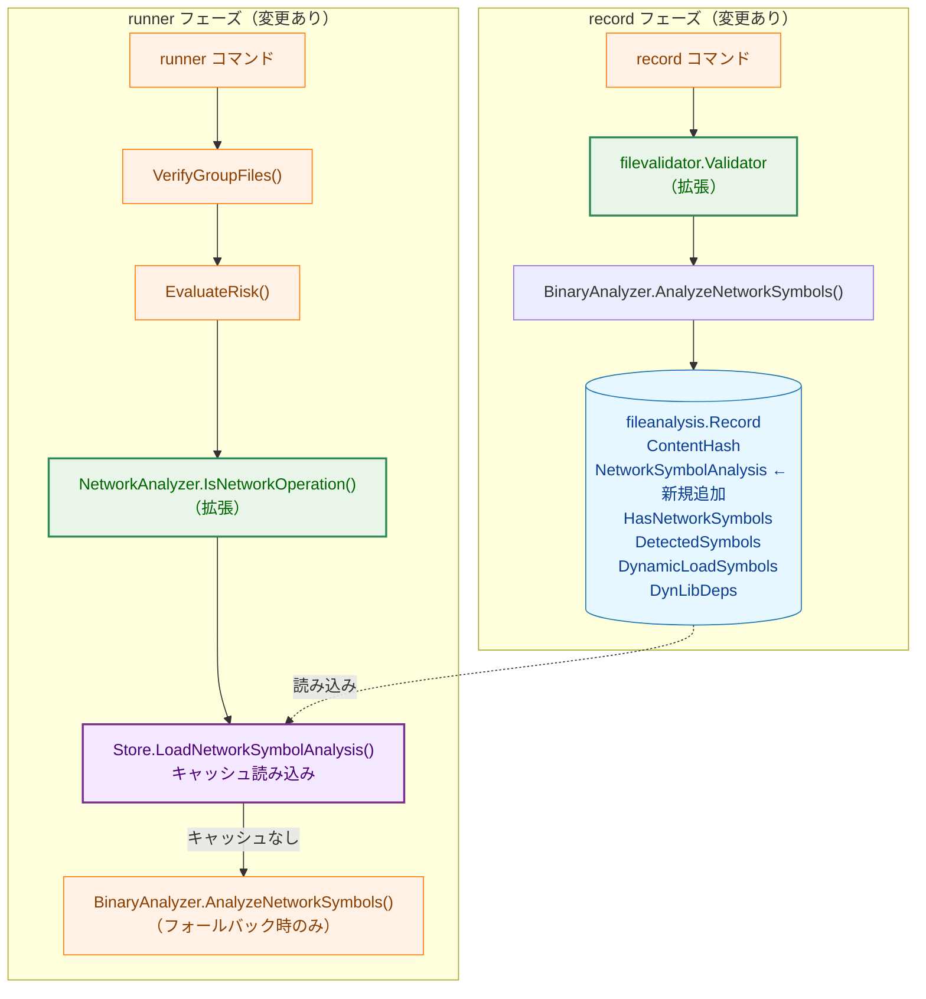
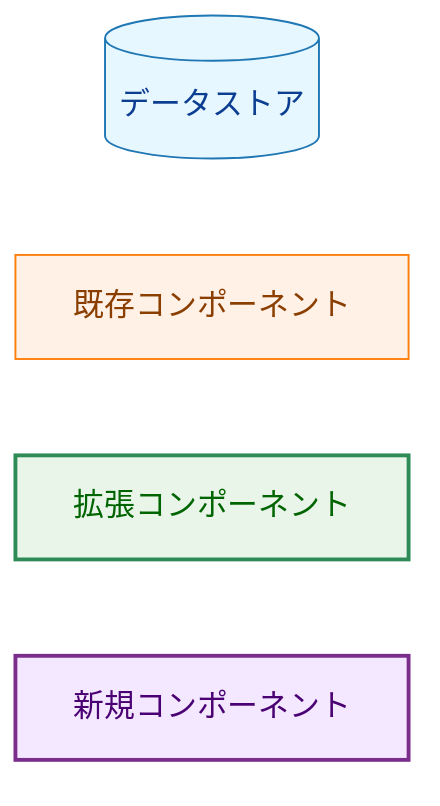
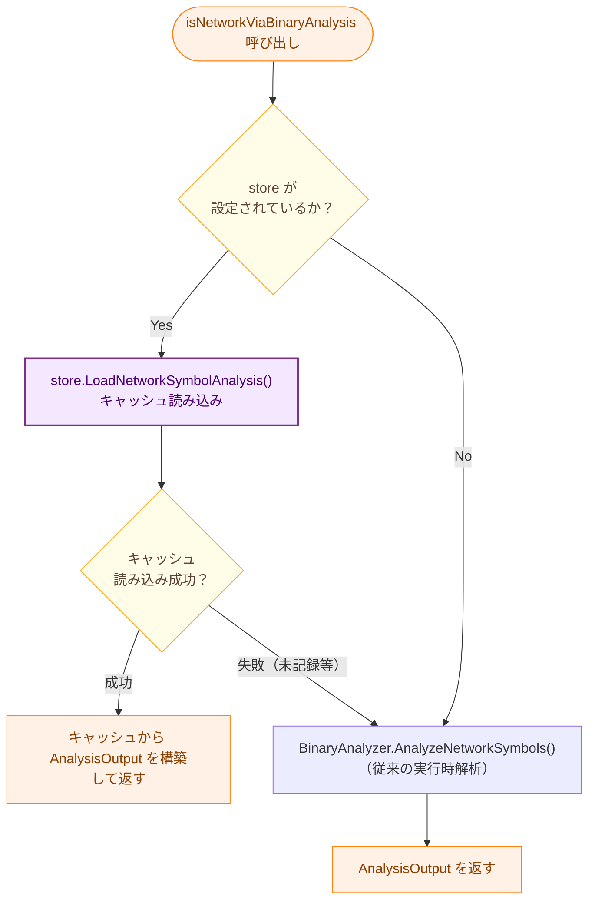
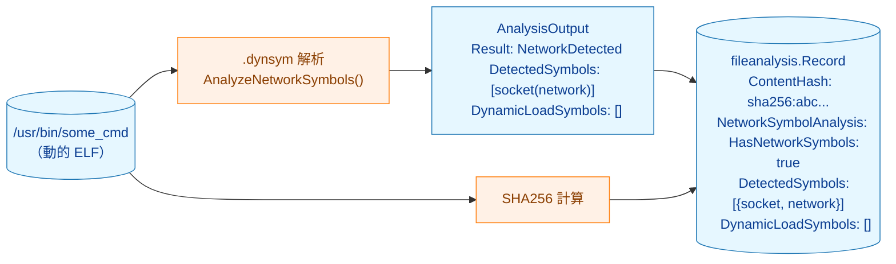
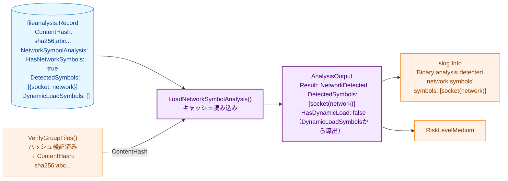

# ネットワークシンボル解析結果のキャッシュ アーキテクチャ設計書

## 1. システム概要

### 1.1 目的

`runner` 実行時の ELF バイナリ再解析（`.dynsym` パース）を廃止し、`record` 時に計算したネットワークシンボル解析結果を `fileanalysis.Record` に保存して再利用する。

`SyscallAnalysis`（タスク 0070/0072）が確立した「`record` 時保存・`runner` 時読み込み」パターンをネットワークシンボル解析にも適用することで、実装の一貫性を高める。

### 1.2 設計原則

- **DRY**: `SyscallAnalysis` の保存・読み込みパターンをそのまま踏襲する
- **Security First**: ハッシュ検証完了後にキャッシュを参照する順序を維持する
- **YAGNI**: フォールバック（実行時解析）は互換性維持に必要な最小限の変更にとどめる

## 2. システムアーキテクチャ

### 2.1 現行の処理フロー（変更前）

```mermaid
flowchart TB
    classDef data fill:#e6f7ff,stroke:#1f77b4,stroke-width:1px,color:#0b3d91;
    classDef process fill:#fff1e6,stroke:#ff7f0e,stroke-width:1px,color:#8a3e00;

    subgraph RecordPhase["record フェーズ"]
        REC["record コマンド"]
        FV["filevalidator.Validator"]
        BA1["BinaryAnalyzer.AnalyzeNetworkSymbols()"]
        STORE1[("fileanalysis.Record<br>ContentHash<br>HasDynamicLoad ← 保存<br>DynLibDeps")]
    end

    subgraph RunnerPhase["runner フェーズ（毎回実行）"]
        RUN["runner コマンド"]
        VGF["VerifyGroupFiles()"]
        EVAL["EvaluateRisk()"]
        NA["NetworkAnalyzer.IsNetworkOperation()"]
        BA2["BinaryAnalyzer.AnalyzeNetworkSymbols()<br>（毎回 .dynsym をパース）"]
    end

    REC --> FV
    FV --> BA1
    BA1 --> STORE1

    RUN --> VGF
    VGF --> EVAL
    EVAL --> NA
    NA --> BA2

    class STORE1 data;
    class REC,FV,BA1,RUN,VGF,EVAL,NA,BA2 process;
```



**問題点**: `runner` 実行時に `BA2` が毎回 ELF ファイルをパースしている。`STORE1` の `HasDynamicLoad` は保存されているが runner から参照されていない（コメントに「does NOT read this field directly」と明記）。

### 2.2 変更後の処理フロー



**凡例（Legend）**



## 3. コンポーネント設計

### 3.1 `fileanalysis` パッケージの変更

#### 3.1.1 `schema.go`

`fileanalysis.Record` を以下のように変更する：

```go
// 変更前（schema_version: 2）
type Record struct {
    SchemaVersion   int               `json:"schema_version"`
    FilePath        string            `json:"file_path"`
    ContentHash     string            `json:"content_hash"`
    UpdatedAt       time.Time         `json:"updated_at"`
    SyscallAnalysis *SyscallAnalysisData `json:"syscall_analysis,omitempty"`
    DynLibDeps      *DynLibDepsData   `json:"dyn_lib_deps,omitempty"`
    HasDynamicLoad  bool              `json:"has_dynamic_load,omitempty"` // ← 削除
}

// 変更後（schema_version: 3）
type Record struct {
    SchemaVersion         int                        `json:"schema_version"`
    FilePath              string                     `json:"file_path"`
    ContentHash           string                     `json:"content_hash"`
    UpdatedAt             time.Time                  `json:"updated_at"`
    SyscallAnalysis       *SyscallAnalysisData       `json:"syscall_analysis,omitempty"`
    DynLibDeps            *DynLibDepsData            `json:"dyn_lib_deps,omitempty"`
    NetworkSymbolAnalysis *NetworkSymbolAnalysisData `json:"network_symbol_analysis,omitempty"` // ← 追加
}

// 追加する型
type NetworkSymbolAnalysisData struct {
    AnalyzedAt         time.Time             `json:"analyzed_at"`
    HasNetworkSymbols  bool                  `json:"has_network_symbols"`
    DetectedSymbols    []DetectedSymbolEntry `json:"detected_symbols,omitempty"`
    DynamicLoadSymbols []DetectedSymbolEntry `json:"dynamic_load_symbols,omitempty"`
}

// HasDynamicLoad は len(DynamicLoadSymbols) > 0 で導出する（独立フィールドなし）

type DetectedSymbolEntry struct {
    Name     string `json:"name"`
    Category string `json:"category"`
}
```

#### 3.1.2 スキーマバージョン更新

```go
const CurrentSchemaVersion = 3  // 2 → 3
```

### 3.2 `filevalidator` パッケージの変更

#### 3.2.1 `validator.go` の `saveHash` 関数

`saveHash` 内の `binaryAnalyzer` 呼び出し部分を拡張する：

```go
// 変更前
if v.binaryAnalyzer != nil {
    output := v.binaryAnalyzer.AnalyzeNetworkSymbols(filePath.String(), contentHash)
    record.HasDynamicLoad = output.HasDynamicLoad
}

// 変更後
if v.binaryAnalyzer != nil {
    output := v.binaryAnalyzer.AnalyzeNetworkSymbols(filePath.String(), contentHash)
    switch output.Result {
    case binaryanalyzer.NetworkDetected, binaryanalyzer.NoNetworkSymbols:
        record.NetworkSymbolAnalysis = &fileanalysis.NetworkSymbolAnalysisData{
            AnalyzedAt:         time.Now(),
            HasNetworkSymbols:  output.Result == binaryanalyzer.NetworkDetected,
            DetectedSymbols:    convertDetectedSymbols(output.DetectedSymbols),
            DynamicLoadSymbols: convertDetectedSymbols(output.DynamicLoadSymbols),
        }
    case binaryanalyzer.StaticBinary, binaryanalyzer.NotSupportedBinary:
        // 静的バイナリ・非 ELF: NetworkSymbolAnalysis を記録しない
    case binaryanalyzer.AnalysisError:
        return fmt.Errorf("network symbol analysis failed: %w", output.Error)
    }
}
```

### 3.3 `fileanalysis.Store` の変更

#### 3.3.1 `LoadNetworkSymbolAnalysis` メソッドの追加

`SyscallAnalysisStore` インターフェースに倣い、`NetworkSymbolAnalysis` の読み込みメソッドを追加する：

```go
// fileanalysis.Store に追加
func (s *Store) LoadNetworkSymbolAnalysis(filePath string, expectedHash string) (*NetworkSymbolAnalysisData, error)
```

- `expectedHash` と `record.ContentHash` が一致しない場合は `ErrHashMismatch` を返す
- `record.NetworkSymbolAnalysis` が `nil` の場合は `ErrNoNetworkSymbolAnalysis` を返す

### 3.4 `security` パッケージの変更

#### 3.4.1 `NetworkAnalyzer` の拡張

`NetworkAnalyzer` にストアへの参照を持たせる：

```go
type NetworkAnalyzer struct {
    binaryAnalyzer binaryanalyzer.BinaryAnalyzer
    store          NetworkSymbolStore  // nil の場合はキャッシュ不使用
}

type NetworkSymbolStore interface {
    LoadNetworkSymbolAnalysis(filePath string, expectedHash string) (*fileanalysis.NetworkSymbolAnalysisData, error)
}
```

#### 3.4.2 `isNetworkViaBinaryAnalysis` の変更



## 4. データフロー

### 4.1 `record` フェーズのデータフロー



### 4.2 `runner` フェーズのデータフロー（キャッシュ利用時）



## 5. スキーマ移行

### 5.1 バージョン履歴

| `schema_version` | 追加内容 | タスク |
|-----------------|---------|--------|
| 1 | `ContentHash`, `FilePath`, `UpdatedAt` | 0071 |
| 2 | `DynLibDeps`, `HasDynamicLoad` | 0074 |
| 3 | `NetworkSymbolAnalysis`（`HasDynamicLoad` を統合）| 0076（本タスク）|

### 5.2 移行の影響

- `schema_version: 2` 以前の記録ファイルは `SchemaVersionMismatchError` で拒否される
- すべての管理対象バイナリに対して `record --force` の再実行が必要

## 6. 変更ファイル一覧

| ファイル | 変更種別 | 内容 |
|---------|---------|------|
| `internal/fileanalysis/schema.go` | 変更 | `NetworkSymbolAnalysisData` / `DetectedSymbolEntry` 型追加（`DynamicLoadSymbols` フィールド含む）、`HasDynamicLoad` フィールド削除、`CurrentSchemaVersion` を 3 に更新 |
| `internal/fileanalysis/store.go` | 変更 | `LoadNetworkSymbolAnalysis()` メソッド追加 |
| `internal/filevalidator/validator.go` | 変更 | `saveHash` 内の `binaryAnalyzer` 呼び出しを拡張、`NetworkSymbolAnalysis` を保存 |
| `internal/runner/security/network_analyzer.go` | 変更 | `NetworkAnalyzer` に `NetworkSymbolStore` を追加、`isNetworkViaBinaryAnalysis` にキャッシュ参照ロジックを追加 |
| `internal/runner/security/network_analyzer_test_helpers.go` | 変更 | テスト用ヘルパーの更新 |
| `internal/runner/risk/evaluator.go` | 変更（可能性あり） | `NetworkAnalyzer` にストアを渡すコンストラクタ変更 |
