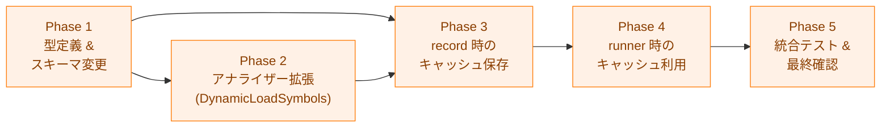

# 実装計画書: ネットワークシンボル解析結果のキャッシュ

## 概要

本ドキュメントは、ネットワークシンボル解析結果のキャッシュ実装進捗を追跡する。
詳細仕様は [03_detailed_specification.md](03_detailed_specification.md) を参照。
アーキテクチャ設計は [02_architecture.md](02_architecture.md) を参照。

## 依存関係

**注記**: Phase 1 完了後に Phase 2 と Phase 3 の型定義部分は並行して作業可能だが、
Phase 3 のテストは Phase 2 の `DynamicLoadSymbols` 収集ロジックに依存する。
Phase 4 は Phase 3 完了後に実施する。

## Phase 1: 型定義 & スキーマ変更

`fileanalysis` および `binaryanalyzer` パッケージの型定義を更新し、
全既存テストのビルドが通る状態を維持する。

仕様参照: 詳細仕様書 §1

### 1.1 `binaryanalyzer.AnalysisOutput` の変更

- [x] `internal/runner/security/binaryanalyzer/analyzer.go` を更新
  - `HasDynamicLoad bool` フィールドを削除
  - `DynamicLoadSymbols []DetectedSymbol` フィールドを追加
  - 仕様: 詳細仕様書 §1.1

### 1.2 `HasDynamicLoad` 参照箇所の修正

- [x] `HasDynamicLoad` を参照しているコード箇所を `len(DynamicLoadSymbols) > 0` に置換
  - `elfanalyzer/standard_analyzer.go`: `checkDynamicSymbols()` の返り値を修正
  - `machoanalyzer/standard_analyzer.go`: ビルド維持の最小限修正
  - `security/network_analyzer.go`: `output.HasDynamicLoad` の参照を修正
  - `filevalidator/validator.go`: `record.HasDynamicLoad` の参照を修正
  - テストファイルの `HasDynamicLoad` 参照を修正

### 1.3 `fileanalysis` スキーマ変更

- [x] `internal/fileanalysis/schema.go` を更新
  - `NetworkSymbolAnalysisData` 構造体を追加
  - `DetectedSymbolEntry` 構造体を追加
  - `Record` から `HasDynamicLoad bool` フィールドを削除
  - `Record` に `NetworkSymbolAnalysis *NetworkSymbolAnalysisData` フィールドを追加
  - `CurrentSchemaVersion` を 2 → 3 に更新
  - 仕様: 詳細仕様書 §1.2
- [x] `CurrentSchemaVersion` 変更に伴う既存テストのコメント・ヘルパー修正
  - `verification/manager_test.go:1481` `createOldSchemaRecord` のコメントから
    「pre-dynlib schema」という説明を削除し、「schema_version 2 以前（dynlib 導入済みだが
    NetworkSymbolAnalysis 未導入）の旧レコード」と書き直す
  - `verification/manager_test.go:1494` の `// pre-dynlib schema (< CurrentSchemaVersion)`
    コメントを同様に更新
  - `verification/manager_test.go:1517–1519` `TestVerify_SchemaVersion` のコメントを
    「old records predate dynlib tracking」から「old records predate network symbol caching
    (schema_version < CurrentSchemaVersion)」に修正する
  - `file_analysis_store_test.go:406` の `// older schema` コメントは内容的に正確なので
    変更不要だが、`CurrentSchemaVersion - 1` が何を指すかのコンテキストを確認すること
  - ランタイム動作（`manager.go:654` の `schemaErr.Actual < schemaErr.Expected` 比較）は
    version 非依存のため修正不要

### 1.4 `fileanalysis` エラー変数の追加

- [x] `internal/fileanalysis/errors.go` を更新
  - `ErrNoNetworkSymbolAnalysis` エラー変数を追加
  - 仕様: 詳細仕様書 §1.3

### 1.5 `fileanalysis.NetworkSymbolStore` の実装

- [x] `internal/fileanalysis/network_symbol_store.go` を新規作成
  - `NetworkSymbolStore` インターフェースを定義
  - `networkSymbolStore` 非公開実装を定義
  - `NewNetworkSymbolStore` ファクトリ関数を定義
  - `syscall_store.go` と同じ adapter パターンを踏襲
  - 仕様: 詳細仕様書 §4

### 1.6 `NetworkSymbolStore` のユニットテスト

- [x] `internal/fileanalysis/network_symbol_store_test.go` を新規作成
  - `syscall_store_test.go` と対称なテストケースを実装する
  - 保存・取得の正常系（`HasNetworkSymbols: true`、`DetectedSymbols`、`DynamicLoadSymbols` が正しく往復すること）
  - ハッシュ不一致 → `ErrHashMismatch`
  - `NetworkSymbolAnalysis` が `nil` のレコード → `ErrNoNetworkSymbolAnalysis`
  - 存在しないファイルパス → `ErrRecordNotFound`
  - 下位 `Store` がその他のエラー（例: `SchemaVersionMismatchError`）を返した場合、そのエラーがそのまま呼び出し元に伝播すること（キャッシュミス扱いにならないこと）
  - 受け入れ条件: AC-1（エラー契約の保証）、AC-4（schema mismatch が握りつぶされないことの安全前提）

### 1.7 ビルド確認

- [x] `make build` が成功すること
- [x] `make test` が成功すること（既存テストの `HasDynamicLoad` 参照修正含む）

## Phase 2: アナライザー拡張（DynamicLoadSymbols 収集）

`elfanalyzer` の `checkDynamicSymbols()` で dynamic_load シンボル名を
収集し `AnalysisOutput.DynamicLoadSymbols` に設定する。

仕様参照: 詳細仕様書 §2

### 2.1 `elfanalyzer/standard_analyzer.go` の変更

- [x] `checkDynamicSymbols()` を変更
  - `hasDynamicLoad = true` の代わりに `dynamicLoadSyms` スライスに
    `DetectedSymbol{Name, Category:"dynamic_load"}` を収集
  - `DynamicLoadSymbols` フィールドに設定して返す
  - 仕様: 詳細仕様書 §2.1

### 2.2 `elfanalyzer` 単体テストの更新

- [x] `elfanalyzer/analyzer_test.go` の既存 `HasDynamicLoad` テストを置換
  - `TestHasDynamicLoad_ELF`（`analyzer_test.go:114`）: `HasDynamicLoad` アサーションを
    `len(output.DynamicLoadSymbols) > 0` に更新
  - `TestCheckDynamicSymbols_HasDynamicLoad`（`analyzer_test.go:146`）: `wantDynamicLoad bool`
    フィールドと `HasDynamicLoad` アサーションを `DynamicLoadSymbols` ベースに置換
- [x] `elfanalyzer/analyzer_test.go` に新規テストケースを追加
  - `dlopen` のみを持つ ELF → `DynamicLoadSymbols: [{dlopen, dynamic_load}]`
  - `dlsym` と `dlvsym` を両方持つ ELF → 両シンボルが列挙
  - ネットワークシンボルと `dlopen` の同時検出 → 独立して設定
  - dynamic_load シンボルなし → `DynamicLoadSymbols: nil`
  - 受け入れ条件: AC-2

### 2.3 `machoanalyzer` の `DynamicLoadSymbols` 移行

- [x] `machoanalyzer/standard_analyzer.go` の dynamic load 検出意味論を `DynamicLoadSymbols` ベースへ移植
  - 既存の `hasDynamicLoad bool` フラグ収集ロジック（`analyzeSlice` および
    `analyzeAllFatSlices`）を `DynamicLoadSymbols []DetectedSymbol` 収集に置き換える
  - fat binary 集約時のスライス間 OR 伝播（`hasDynamicLoad = true`）を
    `DynamicLoadSymbols` の union に変更し、既存の「いずれかのスライスが dynamic load
    シンボルを持てば集約結果も持つ」意味論を維持する
  - 新機能の追加はしない。既存の macOS 高リスク判定を落とさないことを目的とする
  - 仕様: 詳細仕様書 §2.2
- [x] `machoanalyzer/standard_analyzer_test.go` の既存 `HasDynamicLoad` テストを
  `DynamicLoadSymbols` ベースに置換（ELF 側と同様のパターン。テストファイルに該当テストなし）

### 2.4 テスト確認

- [x] `make test` が成功すること
- [x] `make lint` が成功すること

## Phase 3: `record` 時のキャッシュ保存

`filevalidator` の `updateAnalysisRecord` を拡張し、
`AnalyzeNetworkSymbols` の結果を `NetworkSymbolAnalysis` として記録する。

仕様参照: 詳細仕様書 §3

### 3.1 `convertDetectedSymbols` ヘルパー関数の追加

- [x] `internal/filevalidator/validator.go` にヘルパー関数を追加
  - `binaryanalyzer.DetectedSymbol` → `fileanalysis.DetectedSymbolEntry` の変換
  - 空スライスの場合は `nil` を返す（`omitempty` との整合性）
  - 仕様: 詳細仕様書 §3.2

### 3.2 `updateAnalysisRecord` 関数の変更

- [x] `internal/filevalidator/validator.go` の `updateAnalysisRecord` を変更
  - `AnalyzeNetworkSymbols` の `Result` で分岐
  - `NetworkDetected` / `NoNetworkSymbols` → `record.NetworkSymbolAnalysis` を設定
  - `StaticBinary` / `NotSupportedBinary` → 記録しない
  - `AnalysisError` → エラーを返す
  - 既存の `HasDynamicLoad` への書き込みを廃止
  - 仕様: 詳細仕様書 §3.1

### 3.3 `record` 拡張のユニットテスト

- [x] `filevalidator/validator_test.go` にテストを追加
  - ネットワークシンボルありの動的 ELF → `HasNetworkSymbols: true`、
    `DetectedSymbols` に socket を含む
  - ネットワークシンボルなしの動的 ELF → `HasNetworkSymbols: false`、
    `DetectedSymbols` が空
  - `dlopen` のみを持つ動的 ELF → `DynamicLoadSymbols` に dlopen を含む
  - 非 ELF ファイル → `NetworkSymbolAnalysis` が `nil`
  - 静的 ELF バイナリ → `NetworkSymbolAnalysis` が `nil`
  - `AnalysisError` → `record` がエラーを返し記録が保存されない
  - `record --force` で既存の `NetworkSymbolAnalysis` が新しい値で上書きされること
  - 受け入れ条件: AC-2

### 3.4 テスト確認

- [x] `make test` が成功すること
- [x] `make lint` が成功すること

## Phase 4: `runner` 時のキャッシュ利用

`security.NetworkAnalyzer` に store を注入し、
`isNetworkViaBinaryAnalysis` でキャッシュを参照するロジックを追加する。

仕様参照: 詳細仕様書 §5

### 4.0 `handleAnalysisOutput` ヘルパー関数の抽出

- [x] `internal/runner/security/network_analyzer.go` を変更
  - `isNetworkViaBinaryAnalysis` 内のインライン `switch output.Result` ロジックを `handleAnalysisOutput(output binaryanalyzer.AnalysisOutput, cmdPath string) (isNetwork, isHighRisk bool)` として抽出する
  - 抽出後、`isNetworkViaBinaryAnalysis` 末尾は `return handleAnalysisOutput(output, cmdPath)` 一行になること
  - 動作変更なし（リファクタリングのみ）。`make test` が成功すること

### 4.1 `NetworkAnalyzer` 構造体の拡張

- [x] `internal/runner/security/network_analyzer.go` を変更
  - `store fileanalysis.NetworkSymbolStore` フィールドを追加
  - `NewNetworkAnalyzerWithStore(store)` コンストラクタを本番コードに追加
  - 仕様: 詳細仕様書 §5.1, §5.2

### 4.2 `convertNetworkSymbolEntries` ヘルパー関数の追加

- [x] `internal/runner/security/network_analyzer.go` にヘルパーを追加
  - `fileanalysis.DetectedSymbolEntry` → `binaryanalyzer.DetectedSymbol`
    の逆変換
  - 仕様: 詳細仕様書 §5.4

### 4.3 `isNetworkViaBinaryAnalysis` の変更

- [x] キャッシュ参照ロジックを先頭に追加
  - `store != nil` の場合のみキャッシュを参照
  - キャッシュヒット → `AnalysisOutput` を構築して `handleAnalysisOutput` に渡す
  - キャッシュミス（`ErrNoNetworkSymbolAnalysis`、`ErrHashMismatch`、`ErrRecordNotFound`）→ 従来の実行時解析にフォールバック
  - `SchemaVersionMismatchError` は `VerifyGroupFiles` が実行前にブロックするため、ここには到達しない。`isNetworkViaBinaryAnalysis` での追加処理は不要
  - 仕様: 詳細仕様書 §5.4

### 4.4 store 注入チェーンの実装

- [x] `internal/runner/risk/evaluator.go` を変更
  - `NewStandardEvaluator()` に `store fileanalysis.NetworkSymbolStore` 引数を追加
  - `security.NewNetworkAnalyzerWithStore(store)` を呼び出す
  - 仕様: 詳細仕様書 §5.3
- [x] `internal/runner/resource/normal_manager.go` を変更
  - `NewNormalResourceManagerWithOutput()` シグネチャに
    `store fileanalysis.NetworkSymbolStore` 引数を追加
  - `risk.NewStandardEvaluator(store)` に渡す
- [x] `internal/runner/resource/default_manager.go` を変更
  - `NewDefaultResourceManager()` シグネチャに
    `store fileanalysis.NetworkSymbolStore` 引数を追加
  - `NewNormalResourceManagerWithOutput()` に渡す
- [x] `internal/runner/runner.go` を変更
  - `createNormalResourceManager()` 内で `fileanalysis.Store` を生成し
    `fileanalysis.NewNetworkSymbolStore(store)` で変換して渡す

### 4.5 テスト用ヘルパーの統合

- [x] `internal/runner/security/network_analyzer_test_helpers.go` を更新
  - 既存の `NewNetworkAnalyzerWithBinaryAnalyzer(analyzer)` を削除し、
    `newNetworkAnalyzer(analyzer binaryanalyzer.BinaryAnalyzer, store fileanalysis.NetworkSymbolStore) *NetworkAnalyzer`
    に一本化する（パッケージ内限定の小文字関数）
  - store 不要なテストは第 2 引数に `nil` を渡す
  - 既存の 3 呼び出し元（`command_analysis_test.go`）を `newNetworkAnalyzer(mock, nil)` に更新
  - 仕様: 詳細仕様書 §5.5

### 4.6 シグネチャ変更に伴う呼び出し元修正

- [x] `NewDefaultResourceManager()` / `NewNormalResourceManagerWithOutput()` /
  `NewStandardEvaluator()` のシグネチャ変更に伴い、`_test.go` および
  `//go:build test || performance` タグ付きヘルパー（`internal/runner/resource/testutil/helpers.go` 等）を含む
  全呼び出し元で `nil` を引数に追加

### 4.7 `runner` キャッシュ利用のユニットテスト

- [x] `security/command_analysis_test.go` にテストを追加
  - キャッシュあり・`HasNetworkSymbols: true` → `NetworkDetected`、
    `BinaryAnalyzer` 未呼出
  - キャッシュあり・`HasNetworkSymbols: false` → `NoNetworkSymbols`、
    `BinaryAnalyzer` 未呼出
  - キャッシュなし（`ErrNoNetworkSymbolAnalysis`） →
    `BinaryAnalyzer.AnalyzeNetworkSymbols()` にフォールバック
  - キャッシュあり・`DynamicLoadSymbols` に `dlopen` を含む →
    `isHighRisk: true`
  - キャッシュあり・`NetworkDetected` → `slog.Info` に `DetectedSymbols` が出力されること（`BinaryAnalyzer` 未呼出でもログが欠落しないこと）
  - 受け入れ条件: AC-3

### 4.8 テスト確認

- [x] `make test` が成功すること
- [x] `make lint` が成功すること

## Phase 5: 統合テスト & 最終確認

全フェーズの変更を統合テストし、受け入れ条件を検証する。

### 5.1 統合テスト

- [x] `record` → `runner` の正常フロー
  - キャッシュを利用して正しくネットワーク判定されること
  - キャッシュ利用時に `slog.Info` ログに `DetectedSymbols` が出力されること
  - `TestNetworkSymbolCache_RecordToRunner`（`command_analysis_test.go`）
  - 受け入れ条件: AC-3
- [x] 旧スキーマ（`schema_version: 2`）の記録で実行
  - `VerifyGroupFiles` が group verification failed（`ErrGroupVerificationFailed` を内包する `verification.Error`）を返して実行前に停止すること（`isNetworkViaBinaryAnalysis` まで到達しない）
  - `TestVerifyGroupFiles_OldSchema_BlocksExecution`（`manager_test.go`）
  - 受け入れ条件: AC-4

### 5.2 既存機能への非影響確認

- [x] `commandProfileDefinitions` 登録済みコマンドの判定が変更されないこと
  - 受け入れ条件: AC-5（`make test` 全パスで確認）
- [x] 静的 ELF バイナリの `SyscallAnalysis` ベースフローが維持されること
  - 受け入れ条件: AC-5（既存テスト継続 PASS）
- [x] `DynLibDeps` 検証が引き続き動作すること
  - 受け入れ条件: AC-5（既存テスト継続 PASS）

### 5.3 全テスト・lint の最終確認

- [x] `make test` が全テストパスすること
- [x] `make lint` が警告・エラーなしであること
- [x] `make fmt` で変更がないこと

## 受け入れ条件とテストの対応

| 受け入れ条件 | 要件 | テスト / 検証箇所 |
|---|---|---|
| AC-1: `fileanalysis.Record` フィールド追加 | FR-3.1.1, FR-3.1.2 | Phase 1（§1.3 型定義、§1.6 NetworkSymbolStore テスト、§1.7 ビルド確認） |
| AC-2: `record` コマンドの拡張 | FR-3.2.0, FR-3.4.1, FR-3.4.2 | Phase 2（§2.2 アナライザーテスト）、Phase 3（§3.3 record テスト） |
| AC-3: `runner` 時のキャッシュ利用 | FR-3.5.1, FR-3.5.3 | Phase 4（§4.7 キャッシュ利用テスト）、Phase 5（§5.1 統合テスト） |
| AC-4: スキーマ移行 | FR-3.1.2 | Phase 5（§5.1 旧スキーマテスト） |
| AC-5: 既存機能への非影響 | FR-3.5.2 | Phase 5（§5.2 非影響確認） |
