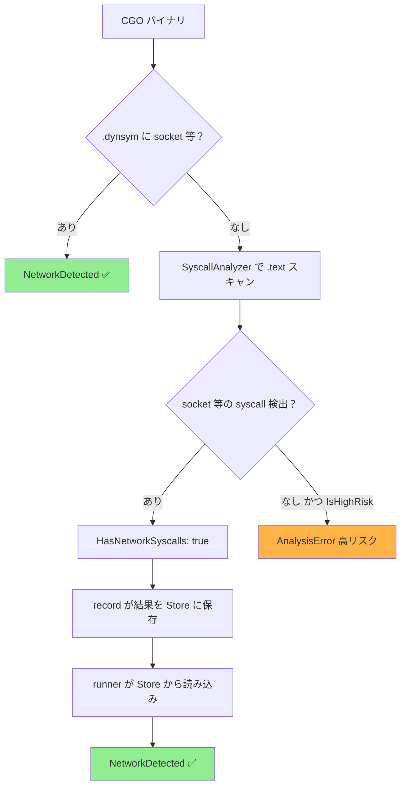
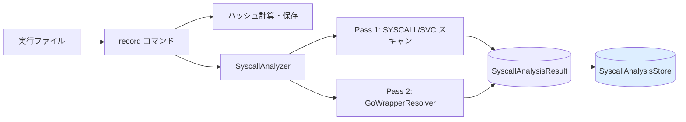
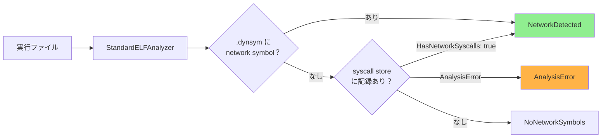

# アーキテクチャ設計: CGO バイナリネットワーク検出（タスク 0077）

## 概要

本タスクでは、CGO バイナリに対してネットワーク使用を正しく検出できるよう、以下 4 つの問題を修正する。



## 問題と修正方針

### 問題 1（Pass 1）: `knownSyscallImpls` シンボル名不一致（arm64）

**原因:** Go 1.23+ / arm64 では `internal/runtime/syscall.Syscall6.abi0` が使われるが、コードには旧名 `internal/runtime/syscall/linux.Syscall6` のみ登録されている。

**影響:** Pass 1 がこの関数内の `SVC #0` 命令を除外できず、`unknown:indirect_setting` → `IsHighRisk: true` となる。

**修正:** `knownSyscallImpls` に新しいシンボル名を追加する。

```
ファイル: internal/runner/security/elfanalyzer/go_wrapper_resolver.go
```

### 問題 2（Pass 2）: pclntab アドレスずれ（CGO バイナリ共通）

**原因:** CGO バイナリでは `.text` 先頭に C ランタイムスタートアップコードが挿入されるため、`gosym.NewLineTable` に `.text.Addr` を渡すと、pclntab が返す関数アドレスが実際の仮想アドレスと一定量（x86_64 で確認: 0x100）ずれる。

**影響:** `wrapperAddrs` に登録されたアドレスと実際の `CALL syscall.RawSyscall` ターゲットが一致せず、Pass 2 が機能しない。

**修正:** `ParsePclntab` がパース後に `.symtab` と照合してオフセットを検出し、全エントリに補正を適用する。

```
ファイル: internal/runner/security/elfanalyzer/pclntab_parser.go
```

### 問題 3（record コマンド）: 動的バイナリのスキャンスキップ

**原因:** `analyzeFile` が `.dynsym` の存在を確認すると即座に `ErrNotStaticELF` を返し、SyscallAnalysis を実行しない。

**修正:** `.dynsym` チェックを削除し、動的バイナリでも SyscallAnalysis を実行して結果を Store に保存する。

```
ファイル: cmd/record/main.go
```

### 問題 4（runner コマンド）: 動的バイナリの syscall store 参照なし

**原因:** `AnalyzeNetworkSymbols` の動的バイナリパスで `checkDynamicSymbols` が `NoNetworkSymbols` を返す際に syscall store を参照しない。

**修正:** `NoNetworkSymbols` を返す前に syscall store にフォールバックする。

```
ファイル: internal/runner/security/elfanalyzer/standard_analyzer.go
```

---

## データフロー

### record コマンド（変更後）



### runner コマンド（変更後）



---

## 変更ファイル一覧

| ファイル | 変更内容 |
|---------|---------|
| `internal/runner/security/elfanalyzer/go_wrapper_resolver.go` | `knownSyscallImpls` に `"internal/runtime/syscall.Syscall6.abi0"` を追加 |
| `internal/runner/security/elfanalyzer/pclntab_parser.go` | `detectPclntabOffset` 関数を追加し `ParsePclntab` でオフセット補正を実施 |
| `cmd/record/main.go` | `analyzeFile` から `.dynsym` チェックを削除（動的バイナリも解析対象に） |
| `internal/runner/security/elfanalyzer/standard_analyzer.go` | `AnalyzeNetworkSymbols` に CGO バイナリ用 syscall store フォールバックを追加 |
| `internal/runner/security/elfanalyzer/pclntab_parser_test.go` | `detectPclntabOffset` のユニットテストを追加 |

---

## 制約・留意事項

- **stripped CGO バイナリ（`.symtab` なし）**: pclntab オフセット補正は `.symtab` が存在する場合のみ実施。stripped バイナリは現状通り `IsHighRisk: true` のフェイルセーフで安全方向に倒れる（スコープ外）。
- **`ErrNotStaticELF` の利用箇所**: `analyzeFile` から返すことをやめたが、他のコードから参照されている場合は影響なし（削除はしない）。
- **`lookupSyscallAnalysis` の `StaticBinary` 戻り値**: store にエントリなしを意味するため、動的バイナリのフォールバックでは「記録なし」として扱い `NoNetworkSymbols` を返す。
