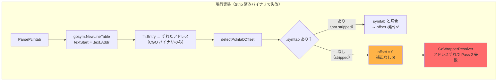
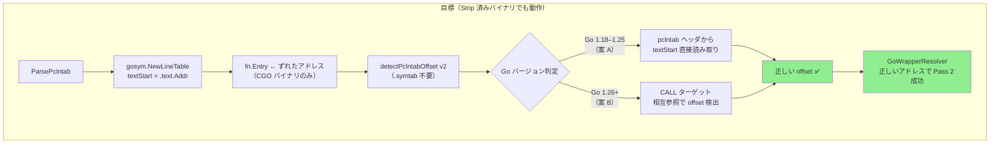
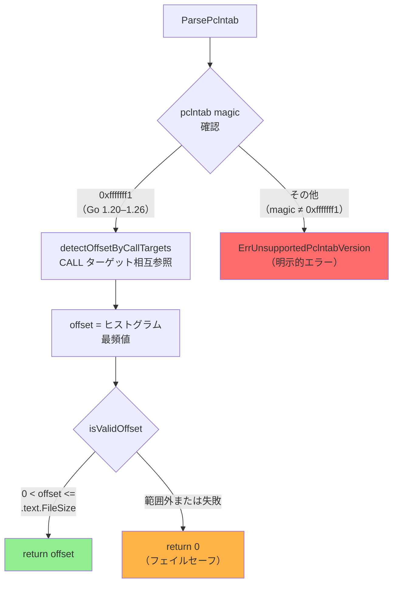

# アーキテクチャ設計書: pclntab オフセット検出の .symtab 非依存化

## 1. 問題の再整理





---

## 2. 案 A: pclntab ヘッダからの textStart 直接読み取り

> **⚠️ Go 1.26.0 ソースコード調査結果（2026-03-13 確認）**
>
> 当初の設計仮説は誤りであった。以下に実際の動作を記録する。

### 2.1 Go 1.26 確認結果: magic 値とヘッダ構造

**magic 値（`$GOROOT/src/internal/abi/symtab.go` より）:**

| 定数 | 値 | 適用バージョン |
|------|-----|--------------|
| `Go118PCLnTabMagic` | `0xfffffff0` | Go 1.18–1.19 |
| `Go120PCLnTabMagic` | `0xfffffff1` | Go 1.20–現在 |
| `CurrentPCLnTabMagic` | `Go120PCLnTabMagic` | Go 1.26 も同値 |

**結論: Go 1.26 で新しい magic 値は追加されていない。**

**pclntab ヘッダレイアウト（`$GOROOT/src/cmd/link/internal/ld/pcln.go` より）:**

Go 1.18 以降すべてのバージョン（1.18–1.26）で、リンカは以下の順でヘッダを書き込む:

| オフセット | フィールド | サイズ | 説明 |
|----------|----------|-------|------|
| 0 | magic | 4 bytes | Go 1.18–1.19: 0xfffffff0, Go 1.20+: 0xfffffff1 |
| 4–5 | pad | 2 bytes | 0, 0 |
| 6 | minLC | 1 byte | quantum（x86: 1, ARM: 4）|
| 7 | ptrSize | 1 byte | 4 or 8 |
| 8 | nfunc | ptrSize | 関数数 |
| 8 + ptrSize | nfiles | ptrSize | ファイル数（Go 1.18+）|
| 8 + 2*ptrSize | **_(unused)_** | ptrSize | **常に 0**（`SetUintptr(0) // unused`）|
| 8 + 3*ptrSize | funcnametab offset | ptrSize | pcHeader からの相対オフセット |
| … | cutab, filetab, pctab, pclntab | ptrSize 各 | 同上 |

**重要: Go 1.18–1.19 のヘッダ `8+ptrSize` は textStart ではなく nfiles である。**
`8+2*ptrSize` は Go 1.18–1.25 ではリロケーション予定フィールドだったが、
Go 1.20 以降は `0` で固定（`// unused`）されている。

### 2.2 `debug/gosym` の textStart 処理（Go 1.26 確認）

`$GOROOT/src/debug/gosym/pclntab.go` の `parsePclnTab` 関数（ver118/ver120 分岐）:

```go
case ver118, ver120:
    t.nfunctab = uint32(offset(0))   // word 0 = nfunc
    t.nfiletab = uint32(offset(1))   // word 1 = nfiles
    t.textStart = t.PC               // ヘッダのワード2(unused)は読まない
    t.funcnametab = data(3)          // word 3 = funcnametab
    ...
```

`t.textStart = t.PC` — `NewLineTable(data, addr)` の第2引数 `addr` が textStart になる。
**ヘッダのバイトからは一切読まない。**

### 2.3 案 A の実際の対応範囲

| Go バージョン | ヘッダ `8+N*ptrSize` の値 | `debug/gosym` の textStart | 案 A の効果 |
|-------------|--------------------------|--------------------------|------------|
| 1.18–1.19 | nfunc/nfiles/reloc(textStart)/… | `t.PC`（引数） | **ヘッダ読み取り不可**（textStart 位置が誤り） |
| 1.20–1.26 | nfunc/nfiles/**0**/funcnametab/… | `t.PC`（引数） | **ヘッダ読み取り不可**（フィールドが 0）|

**結論: 案 A（`readPclntabTextStart`）は Go 1.18–1.26 のいずれのバージョンでも機能しない。**
ヘッダから有効な textStart を読み取る方法は存在せず、案 A はすべてのバージョンで
`return 0, false` となる（textStart が 0 または誤った位置）。

### 2.4 設計への影響

案 A は実質的に**常に失敗するパス**であり、有害ではないが無意味である。

採用方針の変更:
- **案 A の `readPclntabTextStart` は削除する**（または `gosymAlreadyAppliedTextStart` の前提として流用不可）
- **案 B（CALL ターゲット相互参照）を唯一の検出手段とする**
- Go バージョンによる分岐は不要（案 B はヘッダ形式に依存しない）

比較表（4節）および 5節の採用決定も本調査結果を踏まえて更新する。

---

## 3. 案 B: CALL ターゲット相互参照

### 3.1 原理

`.text` セクション内の CALL 即値命令のターゲットアドレスはリンカが計算した
**実際の仮想アドレス**であり、pclntab のずれとは無関係に正確である。
一方、pclntab の関数エントリは `C_startup_size` 分低い値になっている。

複数の CALL/BL 命令ターゲットと pclntab エントリを照合して差分のヒストグラムを作れば、
出現頻度が最も高い差分（= offset）を統計的に検出できる。

```
(CALL ターゲット実際の VA) - (pclntab が返す fn.Entry) = C_startup_size = offset
```

### 3.2 アルゴリズム

```
1. .text セクションを取得。なければ return 0
2. .text 先頭 min(len, 256 KB) をサンプリング範囲とする
3. pclntabFuncs の Entry アドレスをソート済みスライスに格納: sortedEntries
4. ELF Machine から アーキテクチャを判定（x86_64 / arm64）
5. サンプリング範囲を走査し CALL/BL 即値命令のターゲットを収集:
     x86_64: opcode E8 + int32 相対オフセット
             target = callSite + 5 + int32(data[callSite+1:callSite+5])
     arm64:  BL 命令（上位 6 bit = 0b100101）
             target = callSite + int26(instr[25:0]) * 4
6. 各 CALL ターゲットについて:
     a. sortedEntries を二分探索して最近傍 entry を検索
     b. |target - entry| < 0x1000 の場合 diffCounts[target - entry]++
7. diffCounts で最頻値を求める
8. 最頻値の出現回数 >= minVotes(3) かつ 最頻値 > 0 かつ 最頻値 <= .text.FileSize の場合:
     return 最頻値
   （負値は CGO バイナリでは理論上あり得ないため除外。6.3 バリデーション節を参照）
9. それ以外: return 0（フェイルセーフ）
```

### 3.3 長所・短所

| 観点 | 評価 |
|------|------|
| 実装複雑度 | 中（約 70 行）|
| 計算コスト | O(calls × log(funcs))（先頭 256 KB サンプリングで実用上問題なし）|
| `.symtab` 依存 | なし |
| **Go 1.26+ 対応** | **可能**（pclntab ヘッダ形式に依存しない）|
| 統計的検出 | 複数一致で自己検証、誤検出が起きにくい |
| CALL 命令が少ない場合 | minVotes を下回ると offset = 0（フェイルセーフに倒れる）|
| デコーダ依存 | なし（既存 `MachineCodeDecoder` を使わず個別実装）|

---

## 4. 案の比較

> **⚠️ 更新（2026-03-13 調査結果反映）**: 案 A はすべての Go バージョンで機能しないことが判明。

| 観点 | 案 A（廃止） | 案 B |
|------|------|------|
| Go 1.18–1.25 CGO 対応 | ❌（ヘッダから textStart を読めない） | ✅ |
| Go 1.26+ CGO 対応 | ❌ | ✅ |
| `.symtab` 依存 | なし | なし |
| 実装複雑度 | — | 中 |
| 信頼性 | — | 高（統計的；複数一致で検証）|
| バージョン依存 | — | なし |

---

## 5. 採用決定

### 5.1 調査結果（2026-03-13）

Go 1.26.0 ソースコードの調査（`$GOROOT/src/internal/abi/symtab.go`、
`src/cmd/link/internal/ld/pcln.go`、`src/debug/gosym/pclntab.go`）により、
以下が確認された：

- **magic 値**: Go 1.26 は `CurrentPCLnTabMagic = Go120PCLnTabMagic = 0xfffffff1`。新 magic は追加されていない
- **ヘッダの textStart フィールド**: Go 1.20 以降、`8+2*ptrSize` は `SetUintptr(0) // unused` で **常に 0**
- **`debug/gosym` の動作**: ver118/ver120 ともに `t.textStart = t.PC`（引数の `addr`）を使用。ヘッダのバイトは読まない
- **案 A の結論**: Go 1.18–1.26 のいずれのバージョンでも `readPclntabTextStart` は機能しない

### 5.2 案 B 単独採用

案 A を廃止し、案 B（CALL ターゲット相互参照）を唯一の検出手段として採用する。

採用根拠：

1. **案 B はすべての Go バージョン（1.18–1.26+）に対応** — ヘッダ形式に依存しない
2. **`.symtab` 不要** — strip されたプロダクションバイナリに対応
3. **案 A は全バージョンで機能しないため廃止** — `readPclntabTextStart` は実装しない



### 5.3 サポートバージョン

**magic = `0xfffffff1` のバイナリのみサポート（Go 1.20–1.26 の共通 magic）**

magic ≠ `0xfffffff1` のバイナリは `ErrUnsupportedPclntabVersion` エラーとして `ParsePclntab` から返す。

**公称サポートバージョン: Go 1.26**（実環境テストが Go 1.26 のみのため）

理由:
- magic `0xfffffff0` を持つ Go 1.18–1.19 バイナリは明示的に拒否する
- Go 1.20–1.25 は magic が `0xfffffff1` で同一のため技術的には通過するが、
  テスト環境が Go 1.26 のみのため動作保証外（通過するが公称サポート外）
- 未検証バイナリへの誤った offset 適用は誤動作（誤検出/見逃し）を引き起こす
- 明示的エラーにより呼び出し元が適切に処理できる（フェイルセーフより明確）

> **注**: `checkPclntabVersion` は magic = `0xfffffff1` を通過させるため、
> Go 1.20–1.25 のバイナリも実質的には通過する。内部コメントに
> 「テストが Go 1.26 のみのため Go 1.26 を公称サポートバージョンとする」旨を記載する。

### 5.4 実装しないこと（スコープ外）

- Go 1.25 以前のバイナリへの対応（明示的エラーで十分）
- macOS Mach-O バイナリへの対応
- 既存 `MachineCodeDecoder` インターフェース経由の CALL 検出
  （`ParsePclntab` 呼び出し時点では decoder インスタンスがないため、案 B は独自実装）

---

## 6. 実装上の注意事項

### 6.1 `debug/gosym` の textStart 動作（参考）

Go 1.18–1.26 の `debug/gosym` は `t.textStart = t.PC`（`NewLineTable` 第2引数）を使用する。
現行実装では `NewLineTable(pclntabData, textSection.Addr)` として `.text.Addr` を渡しているため、
`fn.Entry` は `.text.Addr` を基点とした値になる（CGO バイナリでは C_startup_size 分ずれている）。

案 B で検出した offset を `fn.Entry + offset` として適用することで正しい VA が得られる。
**案 A は廃止されたため、二重補正のリスクは存在しない。**

### 6.2 案 B の minVotes 調整

`minVotes = 3` は保守的な初期値。実際のバイナリで先頭 256 KB をスキャンすれば
通常数十〜数百の CALL 命令が含まれるため、正しいオフセットの出現回数は 3 を大きく超える。
逆に非 CGO バイナリでは差分がランダムに分散するため最頻値の出現回数は低い。

### 6.3 バリデーション

検出した offset が不正値でないことをチェックする：

```
isValidOffset(offset int64, textFileSize uint64) bool:
    offset > 0 &&                      // 非 CGO (0) と区別
    uint64(offset) <= textFileSize     // バイナリサイズを超えない
```

負の offset（pclntab のアドレスが実際より大きい）は理論的にあり得ないため除外する。
