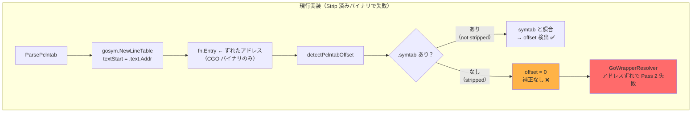
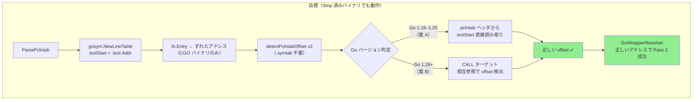
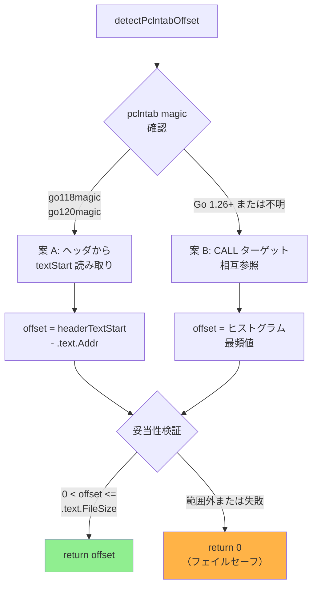

# アーキテクチャ設計書: pclntab オフセット検出の .symtab 非依存化

## 1. 問題の再整理





---

## 2. 案 A: pclntab ヘッダからの textStart 直接読み取り

### 2.1 原理

Go 1.18–1.25 の pclntab ヘッダには `textStart` フィールド（= `runtime.text`）が埋め込まれている。
このフィールドを直接読み取ることで、`.text.Addr`（`.text` セクション先頭）との差分
（= C_startup_size = offset）を O(1) で計算できる。

```
offset = headerTextStart - .text.Addr
       = runtime.text    - .text.Addr
       = C_startup_size
```

### 2.2 pclntab ヘッダレイアウト

**Go 1.18–1.19 (magic = 0xfffffff0)**

| オフセット | フィールド | サイズ | 説明 |
|----------|----------|-------|------|
| 0 | magic | 4 bytes | 0xfffffff0 |
| 4–5 | pad | 2 bytes | パディング |
| 6 | minLC | 1 byte | quantum（x86: 1, ARM: 4） |
| 7 | ptrSize | 1 byte | 4 or 8 |
| 8 | nfunc | ptrSize | 関数数 |
| 8 + ptrSize | **textStart** | ptrSize | **runtime.text** ⭐ |

**Go 1.20–1.25 (magic = 0xfffffff1)**

| オフセット | フィールド | サイズ | 説明 |
|----------|----------|-------|------|
| 0 | magic | 4 bytes | 0xfffffff1 |
| 4–5 | pad | 2 bytes | パディング |
| 6 | minLC | 1 byte | quantum |
| 7 | ptrSize | 1 byte | 4 or 8 |
| 8 | nfunc | ptrSize | 関数数 |
| 8 + ptrSize | nfiles | ptrSize | ファイル数（Go 1.20+）|
| 8 + 2*ptrSize | **textStart** | ptrSize | **runtime.text** ⭐ |

**Go 1.26+ (新 magic, textStart 削除)**

magic 値は実装前に `$GOROOT/src/debug/gosym/pclntab.go` で確認してください。
textStart フィールドはヘッダに含まれません。

> **凡例**: ptrSize の値（4 or 8）に応じてフィールドサイズが変動します。
> ELF バイナリの ByteOrder（リトルエンディアン/ビッグエンディアン）に従ってバイナリ値を読み取ります。

> **注記**: 上記レイアウトは Go 標準ライブラリの `src/debug/gosym/pclntab.go` および
> Go リンカの `src/cmd/link/internal/ld/pcln.go` を参照して作成した。
> 実装前に Go 1.26 版でオフセットと magic 値を改めて確認すること。

### 2.3 アルゴリズム

```
1. pclntab 先頭 4 バイトを ELF ByteOrder で読んで magic を確認
2. magic に応じて textStart のオフセット位置を決定:
     go118magic: textStart offset = 8 + ptrSize
     go120magic: textStart offset = 8 + 2*ptrSize
     その他（Go 1.26+、不明）: return 0, false
3. ptrSize = data[7]（4 or 8）を確認。異常値なら return 0, false
4. データ長が textStart offset + ptrSize 以上あることを確認
5. textStart を ELF ByteOrder で読み取る
6. textStart が 0 なら return 0, false
7. return textStart, true
```

### 2.4 長所・短所

| 観点 | 評価 |
|------|------|
| 実装複雑度 | 低（約 30 行）|
| 計算コスト | O(1)、ヘッダの固定位置を読むだけ |
| `.symtab` 依存 | なし |
| 決定論的 | はい（データが正しければ常に一意の結果）|
| **Go 1.26+ 対応** | **不可**（textStart がヘッダから削除）|
| バージョン依存 | go118magic / go120magic の magic 値とオフセットに依存 |

### 2.5 対応範囲

| Go バージョン | 案 A での offset 検出 |
|-------------|---------------------|
| < 1.18      | 不可（ヘッダ形式が異なる）|
| 1.18–1.25   | **可能** |
| 1.26+       | **不可**（textStart がヘッダから削除）|

---

## 3. 案 B: CALL ターゲット相互参照

### 3.1 原理

`.text` セクション内の CALL 即値命令のターゲットアドレスはリンカが計算した
**実際の仮想アドレス**であり、pclntab のずれとは無関係に正確である。
一方、pclntab の関数エントリは `C_startup_size` 分低い値になっている。

複数の CALL/BL 命令ターゲットと pclntab エントリを照合して差分のヒストグラムを作れば、
出現頻度が最も高い差分（= offset）を統計的に検出できる。

```
(CALL ターゲット実際の VA) - (pclntab が返す fn.Entry) = C_startup_size = offset
```

### 3.2 アルゴリズム

```
1. .text セクションを取得。なければ return 0
2. .text 先頭 min(len, 256 KB) をサンプリング範囲とする
3. pclntabFuncs の Entry アドレスをソート済みスライスに格納: sortedEntries
4. ELF Machine から アーキテクチャを判定（x86_64 / arm64）
5. サンプリング範囲を走査し CALL/BL 即値命令のターゲットを収集:
     x86_64: opcode E8 + int32 相対オフセット
             target = callSite + 5 + int32(data[callSite+1:callSite+5])
     arm64:  BL 命令（上位 6 bit = 0b100101）
             target = callSite + int26(instr[25:0]) * 4
6. 各 CALL ターゲットについて:
     a. sortedEntries を二分探索して最近傍 entry を検索
     b. |target - entry| < 0x1000 の場合 diffCounts[target - entry]++
7. diffCounts で最頻値を求める
8. 最頻値の出現回数 >= minVotes(3) かつ 最頻値 > 0 かつ 最頻値 <= .text.FileSize の場合:
     return 最頻値
   （負値は CGO バイナリでは理論上あり得ないため除外。6.3 バリデーション節を参照）
9. それ以外: return 0（フェイルセーフ）
```

### 3.3 長所・短所

| 観点 | 評価 |
|------|------|
| 実装複雑度 | 中（約 70 行）|
| 計算コスト | O(calls × log(funcs))（先頭 256 KB サンプリングで実用上問題なし）|
| `.symtab` 依存 | なし |
| **Go 1.26+ 対応** | **可能**（pclntab ヘッダ形式に依存しない）|
| 統計的検出 | 複数一致で自己検証、誤検出が起きにくい |
| CALL 命令が少ない場合 | minVotes を下回ると offset = 0（フェイルセーフに倒れる）|
| デコーダ依存 | なし（既存 `MachineCodeDecoder` を使わず個別実装）|

---

## 4. 案の比較

| 観点 | 案 A | 案 B |
|------|------|------|
| Go 1.18–1.25 CGO 対応 | ✅ | ✅ |
| Go 1.26+ CGO 対応 | ❌ | ✅ |
| `.symtab` 依存 | なし | なし |
| 実装複雑度 | 低 | 中 |
| 信頼性 | 高（決定論的）| 高（統計的；複数一致で検証）|
| バージョン依存 | go118magic / go120magic | なし |

---

## 5. 採用決定

### 5.1 テスト環境は Go 1.26

`ac1_verification_result_x86_64.md` の検証は **Go 1.26.0** で実施されており、
pclntab ヘッダに textStart が含まれないバージョンである。
**案 A 単独ではテスト環境の問題を解決できない**。

### 5.2 ハイブリッド戦略（案 A + 案 B フォールバック）を採用

ユーザーの決定：「案 A を採用」。案 A の 実装から始め、Go 1.26+ への対応は
案 B（CALL ターゲット相互参照）をフォールバックとして追加実装する。

採用根拠：

1. **案 A は Go 1.18–1.25 向けに正確・高速** — O(1) で決定論的
2. **案 B は Go 1.26+ のフォールバックとして機能** — ヘッダ形式に依存しない
3. **両案とも `.symtab` 不要** — strip されたプロダクションバイナリに対応



### 5.3 実装しないこと（スコープ外）

- Go 1.2–1.17 サポート（既にサポート対象外）
- macOS Mach-O バイナリへの対応
- 既存 `MachineCodeDecoder` インターフェース経由の CALL 検出
  （`ParsePclntab` 呼び出し時点では decoder インスタンスがないため、案 B は独自実装）

---

## 6. 実装上の注意事項

### 6.1 Go 1.18–1.25 での二重補正リスク

`gosym.NewLineTable` は Go 1.18–1.25 のバイナリでは pclntab ヘッダの textStart を
自動的に使用してアドレスを計算する可能性がある。その場合、案 A の補正を適用すると
二重補正になる。

対処：
- 案 A 実装後、Go 1.18–1.25 ビルドの CGO バイナリで `fn.Entry + offset` が
  実際の仮想アドレスと一致することをテストで確認する
- 二重補正が起きる場合は、`gosym` がすでに補正済みかどうかを `.text.Addr` との
  比較で判定するロジックを追加する

### 6.2 案 B の minVotes 調整

`minVotes = 3` は保守的な初期値。実際のバイナリで先頭 256 KB をスキャンすれば
通常数十〜数百の CALL 命令が含まれるため、正しいオフセットの出現回数は 3 を大きく超える。
逆に非 CGO バイナリでは差分がランダムに分散するため最頻値の出現回数は低い。

### 6.3 バリデーション

検出した offset が不正値でないことをチェックする：

```
isValidOffset(offset int64, textFileSize uint64) bool:
    offset > 0 &&                      // 非 CGO (0) と区別
    uint64(offset) <= textFileSize     // バイナリサイズを超えない
```

負の offset（pclntab のアドレスが実際より大きい）は理論的にあり得ないため除外する。
