# アーキテクチャ設計書: `mprotect(PROT_EXEC)` 静的検出

## 1. システム概要

### 1.1 アーキテクチャ目標

- タスク 0070 の後方スキャン基盤を再利用し、`mprotect` の `prot` 引数を静的に評価する
- `MachineCodeDecoder` インターフェースの拡張による `rdx`/`x2` レジスタの追跡
- `SyscallAnalysisResultCore` への `ArgEvalResults` フィールド追加による拡張可能な引数評価モデル
- リスク判定ロジックの専用モジュール化（`internal/runner/security/elfanalyzer/mprotect_risk.go` に配置し import cycle を回避）

### 1.2 設計原則

- **既存活用**: タスク 0070 の `backwardScanForSyscallNumber` と同一のスキャンルールを `prot` 引数に適用
- **拡張性**: `ArgEvalResults` リスト構造により、将来の引数依存評価（`mmap(PROT_EXEC)` 等）を `SyscallAnalysisResultCore` の型変更なしに追加可能
- **関心の分離**: 解析事実（`ArgEvalResults`）とリスク判定（`IsHighRisk`）を明確に分離
- **最小変更**: 既存の `MachineCodeDecoder` インターフェースに2メソッドを追加するのみ

### 1.3 スコープと位置づけ

本タスクはタスク 0070（syscall 静的解析）の拡張であり、`mprotect` syscall の引数を評価して動的コードロードの可能性を検出する。

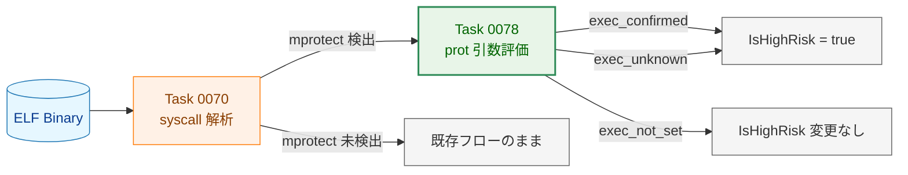

**凡例（Legend）**

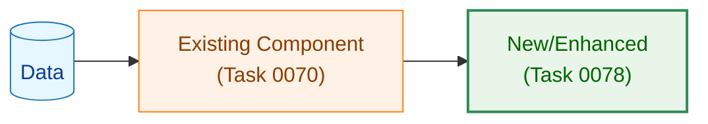

## 2. システム構成

### 2.1 全体アーキテクチャ

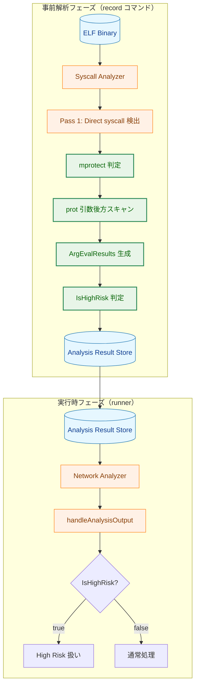

### 2.2 コンポーネント配置

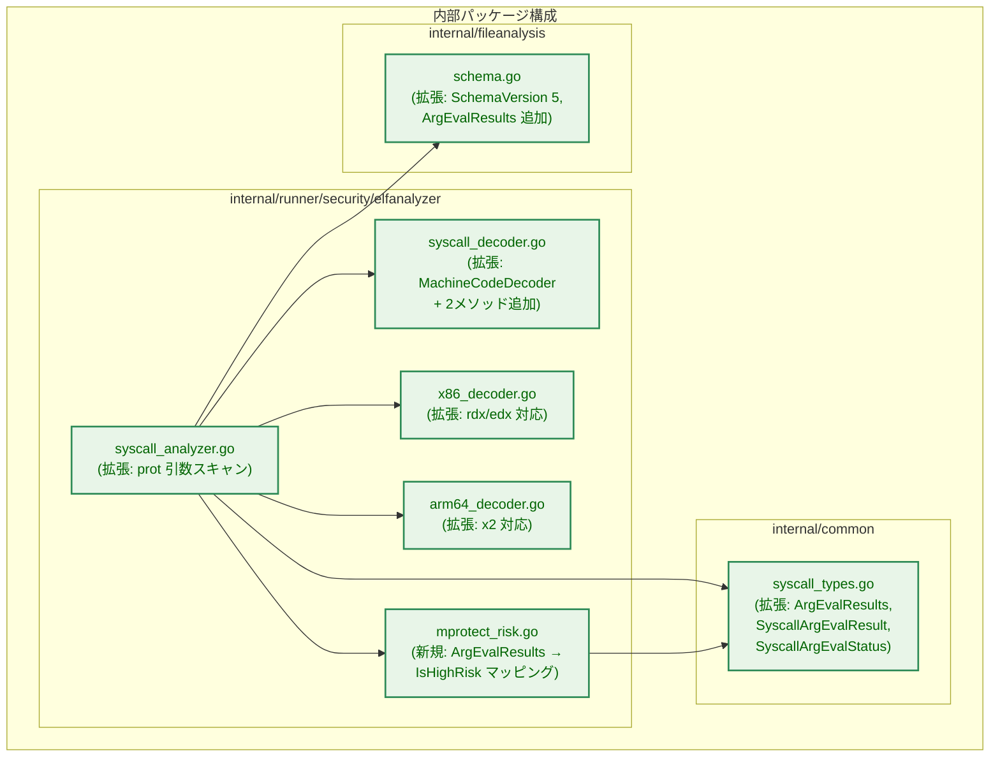

### 2.3 データフロー

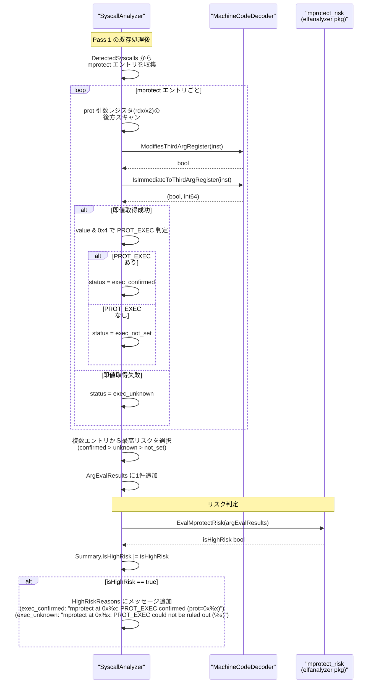

## 3. コンポーネント設計

### 3.1 データ構造の拡張

#### 3.1.1 `SyscallArgEvalResult` / `SyscallArgEvalStatus`（`internal/common`）

```go
// SyscallArgEvalStatus is a typed string for argument evaluation status values.
type SyscallArgEvalStatus string

const (
    // SyscallArgEvalExecConfirmed indicates prot value was obtained
    // and PROT_EXEC flag (0x4) is set.
    SyscallArgEvalExecConfirmed SyscallArgEvalStatus = "exec_confirmed"

    // SyscallArgEvalExecUnknown indicates prot value could not be
    // statically determined.
    SyscallArgEvalExecUnknown SyscallArgEvalStatus = "exec_unknown"

    // SyscallArgEvalExecNotSet indicates prot value was obtained
    // and PROT_EXEC flag (0x4) is NOT set.
    SyscallArgEvalExecNotSet SyscallArgEvalStatus = "exec_not_set"
)

// SyscallArgEvalResult represents the static evaluation result
// of a syscall argument.
type SyscallArgEvalResult struct {
    // SyscallName is the syscall being evaluated (e.g., "mprotect").
    SyscallName string               `json:"syscall_name"`

    // Status is the evaluation outcome.
    Status      SyscallArgEvalStatus  `json:"status"`

    // Details provides supplementary info.
    // For exec_confirmed/exec_not_set: prot value in hex (e.g., "prot=0x5").
    // For exec_unknown: reason (e.g., "scan limit exceeded").
    Details     string               `json:"details,omitempty"`
}
```

#### 3.1.2 `SyscallAnalysisResultCore` への追加フィールド

```go
// internal/common/syscall_types.go
type SyscallAnalysisResultCore struct {
    // ... existing fields ...

    // ArgEvalResults contains static evaluation results for syscall arguments.
    // Currently used for mprotect PROT_EXEC detection.
    // Only populated when relevant syscalls are detected; otherwise nil.
    ArgEvalResults []SyscallArgEvalResult `json:"arg_eval_results,omitempty"`
}
```

### 3.2 `MachineCodeDecoder` インターフェースの拡張

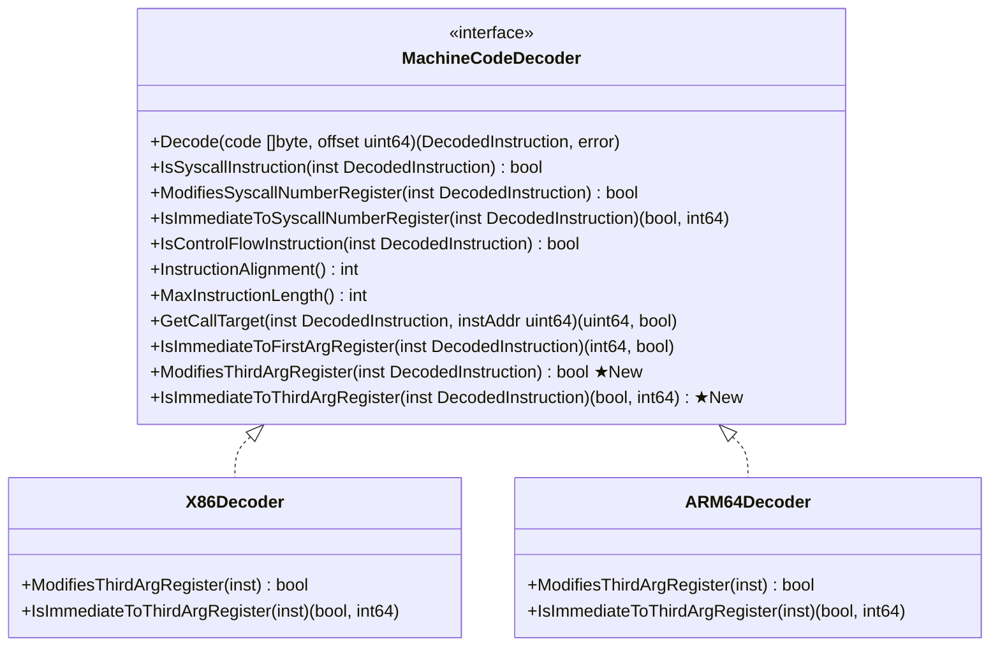

**新規メソッドの仕様**:

| メソッド | x86_64 対象レジスタ | arm64 対象レジスタ | 用途 |
|---|---|---|---|
| `ModifiesThirdArgRegister` | `edx` / `rdx` | `w2` / `x2` | `prot` 引数レジスタへの書き込み検出 |
| `IsImmediateToThirdArgRegister` | `edx` / `rdx` への即値 MOV | `w2` / `x2` への即値 MOV | `prot` 即値の取得 |

**メソッド名の選定理由**:
- `mprotect` のみに特化せず、「第3引数レジスタ」として汎用的に命名する
- x86_64 Linux syscall ABI の引数順序: `rdi`（第1）, `rsi`（第2）, `rdx`（第3）
- arm64 Linux syscall ABI の引数順序: `x0`（第1）, `x1`（第2）, `x2`（第3）
- 将来他の syscall の第3引数を評価する際にも再利用可能

### 3.3 `SyscallAnalyzer` の拡張

#### 3.3.1 prot 引数の後方スキャン

`analyzeSyscallsInCode` の末尾に `mprotect` エントリの引数評価ステップを追加する。

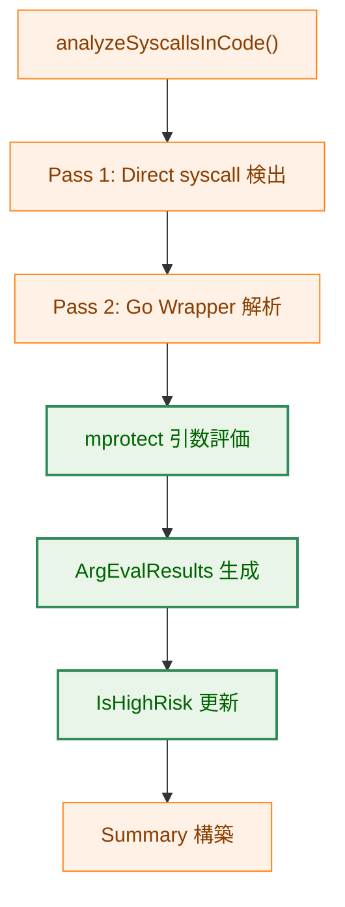

**新規メソッド**: `evaluateMprotectArgs`

```go
// evaluateMprotectArgs evaluates prot argument of mprotect syscall entries.
// It scans detected syscalls for mprotect, performs backward scan for prot
// register (rdx on x86_64, x2 on arm64), and returns the highest-risk
// SyscallArgEvalResult and its corresponding instruction address.
// Returns nil, 0 if no mprotect was detected.
func (a *SyscallAnalyzer) evaluateMprotectArgs(
    code []byte,
    baseAddr uint64,
    decoder MachineCodeDecoder,
    detectedSyscalls []common.SyscallInfo,
) (*common.SyscallArgEvalResult, uint64)
```

**後方スキャンの再利用**:

`backwardScanForSyscallNumber` は `ModifiesSyscallNumberRegister` と `IsImmediateToSyscallNumberRegister` を使用する。
`prot` 引数のスキャンでは同一のスキャンアルゴリズムを使い、対象レジスタのみ `ModifiesThirdArgRegister` と `IsImmediateToThirdArgRegister` に差し替える。

実現方式として、汎用的な後方スキャン関数を抽出し、レジスタ判定メソッドを関数引数として渡す設計とする:

```go
// backwardScanForRegister is a generalized backward scan that extracts an
// immediate value from a target register. modifiesReg and isImmediateToReg
// are decoder methods specifying which register to track.
func (a *SyscallAnalyzer) backwardScanForRegister(
    code []byte,
    baseAddr uint64,
    syscallOffset int,
    decoder MachineCodeDecoder,
    modifiesReg func(DecodedInstruction) bool,
    isImmediateToReg func(DecodedInstruction) (bool, int64),
) (value int64, method string)
```

既存の `backwardScanForSyscallNumber` はこの汎用関数のラッパーとして再実装する。
これにより、スキャンロジックの重複を排除し、`defaultMaxBackwardScan` の適用を一箇所に集約する。

### 3.4 リスク判定ヘルパー（`elfanalyzer` パッケージ）

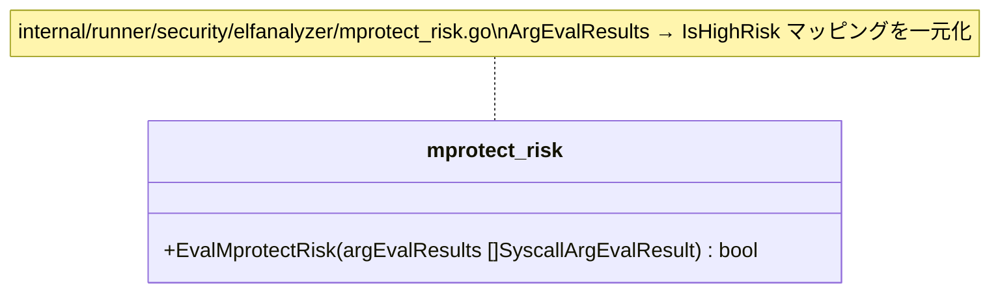

**関数シグネチャ**:

```go
// EvalMprotectRisk evaluates ArgEvalResults for mprotect-related risk.
// Returns true if IsHighRisk should be set based on mprotect detection.
//
// Mapping rules (from requirements §5.1):
//   - exec_confirmed → true
//   - exec_unknown   → true
//   - exec_not_set   → false
//   - no mprotect entries → false
func EvalMprotectRisk(argEvalResults []common.SyscallArgEvalResult) bool
```

**呼び出し箇所**:

`elfanalyzer/syscall_analyzer.go` の `analyzeSyscallsInCode`（事前解析時）のみ。
`Summary.IsHighRisk` を OR 条件で更新（既存の `true` を `false` に戻さない）。

`convertSyscallResult` は `analyzeSyscallsInCode` が設定した `Summary.IsHighRisk` の値をそのまま参照するため、変更不要。

### 3.5 `HighRiskReasons` への追記仕様

`EvalMprotectRisk` が `true` を返した場合、`analyzeSyscallsInCode` は `HighRiskReasons` に以下の形式でメッセージを追加する。`location` は `SyscallInfo.Location` の値（`mprotect` 命令のアドレス）、`details` は `SyscallArgEvalResult.Details` の値を使用する。

| Status | 追加するメッセージ |
|---|---|
| `exec_confirmed` | `"mprotect at 0x%x: PROT_EXEC confirmed (%s)"` （`%s` = Details の値、例: `"prot=0x5"`） |
| `exec_unknown` | `"mprotect at 0x%x: PROT_EXEC could not be ruled out (%s)"` （`%s` = Details の値、例: `"scan limit exceeded"`） |

`exec_not_set` の場合は `IsHighRisk` が変化しないため `HighRiskReasons` への追記も不要。

`SyscallArgEvalResult` は複数の `mprotect` エントリから最高リスクの1件を集約したものであるため、メッセージは1件のみ追加する。`location` には集約元のうち最高リスクと判定された `mprotect` 命令のアドレスを使用する（`evaluateMprotectArgs` の戻り値に location を含める設計については §3.3.1 関数シグネチャを参照）。

### 3.6 スキーマバージョンの更新


- `CurrentSchemaVersion` を `4` → `5` に更新
- `SyscallAnalysisData`（`internal/fileanalysis/schema.go`）は `SyscallAnalysisResultCore` を埋め込んでいるため、`ArgEvalResults` フィールドは自動的に JSON 出力に含まれる
- `omitempty` タグにより、`mprotect` 未検出時はフィールド自体が省略される

### 3.7 解析結果ファイル形式（v5）

```json
{
  "schema_version": 5,
  "file_path": "/usr/local/bin/myapp",
  "content_hash": "sha256:abc123...",
  "updated_at": "2025-02-05T10:30:00Z",
  "syscall_analysis": {
    "architecture": "x86_64",
    "analyzed_at": "2025-02-05T10:30:00Z",
    "detected_syscalls": [
      {"number": 10, "name": "mprotect", "is_network": false,
       "location": 8192, "determination_method": "immediate"},
      {"number": 1, "name": "write", "is_network": false,
       "location": 4256, "determination_method": "immediate"}
    ],
    "arg_eval_results": [
      {
        "syscall_name": "mprotect",
        "status": "exec_confirmed",
        "details": "prot=0x5"
      }
    ],
    "has_unknown_syscalls": false,
    "summary": {
      "has_network_syscalls": false,
      "is_high_risk": true,
      "total_detected_events": 2,
      "network_syscall_count": 0
    }
  }
}
```

## 4. 統合設計

### 4.1 `analyzeSyscallsInCode` の拡張フロー

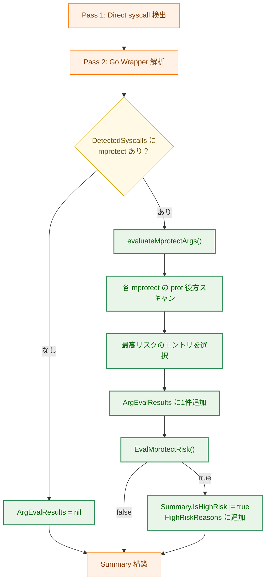

### 4.2 `convertSyscallResult` の拡張

`standard_analyzer.go` の `convertSyscallResult` は既存ロジックで `Summary.IsHighRisk` を参照している。`mprotect` 検出結果は `analyzeSyscallsInCode` 内で `Summary.IsHighRisk` に反映済みであるため、`convertSyscallResult` 側の変更は不要。

ストアから読み出した結果（`SyscallAnalysisData` → `SyscallAnalysisResult` 変換）でも `Summary.IsHighRisk` は保存済みの値がそのまま使用されるため、追加の判定処理は不要。

### 4.3 `handleAnalysisOutput` との関係

`handleAnalysisOutput`（`network_analyzer.go`）は `binaryanalyzer.AnalysisOutput` を受け取り、`isHighRisk` を返す。`mprotect` の検出結果は `Summary.IsHighRisk` を通じて既に `AnalysisOutput.Result = AnalysisError` に変換されているため、`handleAnalysisOutput` 自体の変更は不要。

```mermaid
flowchart LR
    classDef existing fill:#fff1e6,stroke:#ff7f0e,stroke-width:1px,color:#8a3e00
    classDef new fill:#e8f5e8,stroke:#2e8b57,stroke-width:2px,color:#006400

    A["mprotect 検出"] --> B["ArgEvalResults"]
    B --> C["EvalMprotectRisk()"]
    C --> D["Summary.IsHighRisk = true<br>HighRiskReasons に追加"]
    D --> E["convertSyscallResult()<br>(変更なし)"]
    E --> F["AnalysisOutput.Result = AnalysisError"]
    F --> G["handleAnalysisOutput()<br>(変更なし)"]
    G --> H["isHighRisk = true"]

    class A,B,C,D new
    class E,F,G,H existing
```

### 4.4 `defaultMaxBackwardScan` コメントの一般化

```go
// Before:
// defaultMaxBackwardScan is the default maximum number of instructions to scan
// backward from a syscall instruction to find the syscall number.

// After:
// defaultMaxBackwardScan is the default maximum number of instructions to scan
// backward from a syscall instruction. Applied to both syscall number extraction
// and syscall argument evaluation (e.g., mprotect prot flag).
```

## 5. セキュリティアーキテクチャ

### 5.1 `PROT_EXEC` 検出に基づくリスク判定

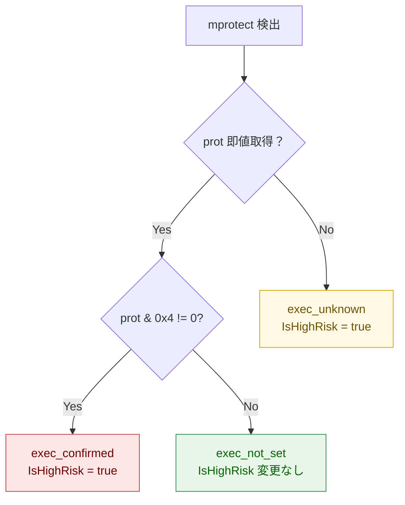

### 5.2 リスク判定マトリクス

| 条件 | `ArgEvalResults` Status | `Summary.IsHighRisk` | 理由 |
|------|---|---|---|
| `prot` 即値に `PROT_EXEC` あり | `exec_confirmed` | `true` に設定 | 動的コード実行の確証 |
| `prot` 即値取得不可 | `exec_unknown` | `true` に設定 | 動的コード実行を排除できない |
| `prot` 即値に `PROT_EXEC` なし | `exec_not_set` | 変更なし | 実行権限付与なし |
| `mprotect` 未検出 | エントリなし | 変更なし | 対象外 |

### 5.3 `IsHighRisk` の OR 条件

`Summary.IsHighRisk` は複数の要因から設定される。各要因は独立しており、一度 `true` になったら他の要因で `false` に戻さない。

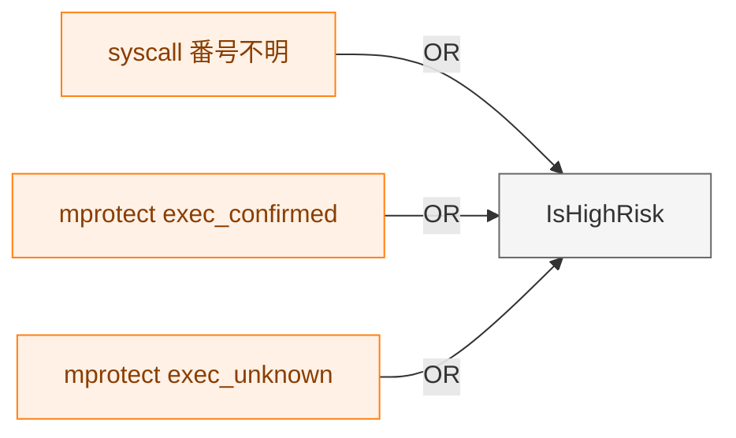

## 6. パフォーマンス設計

### 6.1 追加オーバーヘッドの見積もり

| 処理 | 条件 | 見積もり | 備考 |
|------|------|---------|------|
| `mprotect` フィルタリング | 常時 | < 0.1ms | `DetectedSyscalls` のリニアスキャン |
| `prot` 後方スキャン | `mprotect` 検出時のみ | < 1ms × `mprotect` 数 | 既存スキャンと同一計算量 |
| `ArgEvalResults` 集約 | `mprotect` 検出時のみ | 無視可能 | 最大値の選択のみ |

`mprotect` は一般的なバイナリでは少数（0〜数件）しか検出されないため、全体の解析時間への影響は要件 NFR-4.1.1 の通り軽微である。

### 6.2 最適化戦略

- `DetectedSyscalls` の走査時に `mprotect` 以外のエントリは無視（早期スキップ）
- 後方スキャン用のウィンドウデコード結果を再利用可能（既存 `decodeInstructionsInWindow` のまま）
- `ArgEvalResults` の集約は O(n) で完了（n = `mprotect` エントリ数）

## 7. エラーハンドリング設計

### 7.1 エラー回復戦略

| エラー種別 | 回復戦略 | 結果 |
|-----------|---------|------|
| `prot` 後方スキャンでデコード失敗 | `exec_unknown` として記録 | `IsHighRisk = true` |
| `prot` 後方スキャンでスキャン上限超過 | `exec_unknown` として記録 | `IsHighRisk = true` |
| `prot` 後方スキャンで制御フロー境界 | `exec_unknown` として記録 | `IsHighRisk = true` |
| `prot` 後方スキャンで間接設定検出 | `exec_unknown` として記録 | `IsHighRisk = true` |

後方スキャンの失敗モードはすべて `exec_unknown` に帰結し、安全側（`IsHighRisk = true`）に倒す。
これはタスク 0070 の `unknown:*` → `IsHighRisk = true` と同一の安全方針に従う。

### 7.2 既存エラーハンドリングへの影響

- `SyscallAnalyzer` のエラー返却パスは変更なし
- `ELFParseError`、`UnsupportedArchitectureError`、`ErrNoTextSection` は影響なし
- スキーマバージョン不一致時のエラー処理は既存の `SchemaVersionMismatchError` を維持

## 8. テスト戦略

### 8.1 テスト階層

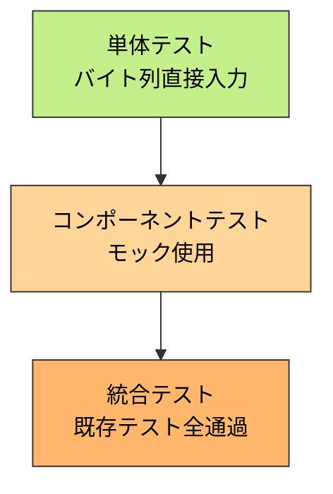

### 8.2 単体テスト（バイト列直接入力）

NFR-4.2.1 で定義されたテストケースを `MachineCodeDecoder` 拡張メソッドと `evaluateMprotectArgs` に対して実装する。

**x86_64 テストケース**:

| テストケース | バイト列パターン | 期待結果 |
|---|---|---|
| `PROT_EXEC` 確定（64bit） | `mov $0x7, %rdx` + `syscall` | `exec_confirmed`, `prot=0x7` |
| `PROT_EXEC` 確定（32bit） | `mov $0x4, %edx` + `syscall` | `exec_confirmed`, `prot=0x4` |
| `PROT_EXEC` 未設定 | `mov $0x3, %rdx` + `syscall` | `exec_not_set`, `prot=0x3` |
| 間接設定 | `mov %rsi, %rdx` + `syscall` | `exec_unknown` |
| 即値なし | `syscall` のみ | `exec_unknown` |
| 制御フロー境界 | `jmp` + `mov $0x7, %rdx` + `syscall` | `exec_unknown` |

**arm64 テストケース**:

| テストケース | バイト列パターン | 期待結果 |
|---|---|---|
| `PROT_EXEC` 確定 | `mov x2, #0x7` + `svc #0` | `exec_confirmed`, `prot=0x7` |
| `PROT_EXEC` 未設定 | `mov x2, #0x3` + `svc #0` | `exec_not_set`, `prot=0x3` |
| レジスタ間コピー | `mov x2, x1` + `svc #0` | `exec_unknown` |
| 即値なし | `svc #0` のみ | `exec_unknown` |
| 制御フロー境界 | `b` + `mov x2, #0x7` + `svc #0` | `exec_unknown` |

### 8.3 コンポーネントテスト

- `evaluateMprotectArgs`: 複数 `mprotect` エントリの集約ロジック
  - `exec_confirmed` + `exec_unknown` → `exec_confirmed`
  - `exec_unknown` + `exec_not_set` → `exec_unknown`
  - `exec_not_set` のみ → `exec_not_set`
- `EvalMprotectRisk`: `ArgEvalResults` → `IsHighRisk` マッピング
- スキーマ v5 の保存・読み込み往復テスト

### 8.4 統合テスト

- `make test` が全テストパスすること（AC-5）
- 既存の `Summary.HasNetworkSyscalls` の結果が変わらないこと（AC-5）

## 9. 段階的実装計画

### Phase 1: データ構造の定義

- [ ] `SyscallArgEvalStatus` 型と定数を `internal/common/syscall_types.go` に追加
- [ ] `SyscallArgEvalResult` 構造体を `internal/common/syscall_types.go` に追加
- [ ] `SyscallAnalysisResultCore` に `ArgEvalResults` フィールドを追加
- [ ] `CurrentSchemaVersion` を `5` に更新

### Phase 2: `MachineCodeDecoder` インターフェースの拡張

- [ ] `ModifiesThirdArgRegister` メソッドをインターフェースに追加
- [ ] `IsImmediateToThirdArgRegister` メソッドをインターフェースに追加
- [ ] `X86Decoder` に `rdx`/`edx` 対応の実装を追加
- [ ] `ARM64Decoder` に `x2`/`w2` 対応の実装を追加
- [ ] x86_64 / arm64 の単体テスト

### Phase 3: 後方スキャンの汎用化と `mprotect` 引数評価

- [ ] `backwardScanForRegister` 汎用関数を抽出
- [ ] 既存の `backwardScanForSyscallNumber` を汎用関数のラッパーに変換
- [ ] `evaluateMprotectArgs` メソッドを実装
- [ ] `analyzeSyscallsInCode` への統合
- [ ] `defaultMaxBackwardScan` のコメント一般化
- [ ] 単体テスト・コンポーネントテスト

### Phase 4: リスク判定ヘルパーと統合

- [ ] `EvalMprotectRisk` ヘルパー関数を `internal/runner/security/elfanalyzer/mprotect_risk.go` に実装
- [ ] `analyzeSyscallsInCode` からのヘルパー呼び出し
- [ ] テスト

### Phase 5: 検証

- [ ] `make test` 全テストパス
- [ ] `make lint` パス
- [ ] スキーマ v5 の保存・読み込み往復テスト

## 10. 設計上の判断と代替案

### 10.1 後方スキャンの汎用化方式

**採用案**: 関数引数によるレジスタ判定の差し替え

`backwardScanForRegister` に `modifiesReg` / `isImmediateToReg` を関数引数として渡す。
既存の `backwardScanForSyscallNumber` は `ModifiesSyscallNumberRegister` / `IsImmediateToSyscallNumberRegister` を渡すラッパーとなる。

**代替案（不採用）**: `mprotect` 専用のスキャン関数を新設

- コードが重複し、`defaultMaxBackwardScan` の適用箇所が分散する
- 将来他の引数スキャンが必要になった際にさらに重複が増加する

### 10.2 `MachineCodeDecoder` メソッド名の選定

**採用案**: `ModifiesThirdArgRegister` / `IsImmediateToThirdArgRegister`

- ABI 上の位置（第3引数）で命名し、特定の syscall に依存しない
- 将来他の syscall の第3引数評価にも適用可能

**代替案（不採用）**: `ModifiesProtRegister` / `IsImmediateToProtRegister`

- `prot` は `mprotect` 固有の概念であり、汎用性が低い

### 10.3 `EvalMprotectRisk` の配置場所

**採用案**: `internal/runner/security/elfanalyzer/mprotect_risk.go`

- `security` パッケージはすでに `elfanalyzer` パッケージを import しているため、`EvalMprotectRisk` を `security` に置くと `elfanalyzer → security → elfanalyzer` の import cycle が発生してビルド不能になる
- `elfanalyzer` 内に配置することで依存方向（`security` → `elfanalyzer` → `common`）を一方向に保てる
- `EvalMprotectRisk` の唯一の呼び出し元は `analyzeSyscallsInCode`（同パッケージ内）であり、パッケージ境界を越える必要がない
- 解析事実（`ArgEvalResults`）からリスク判定（`IsHighRisk`）への変換を `syscall_analyzer.go` のインラインではなく独立ファイルに分離し、責務の明確化と単体テストの容易化を実現する

**代替案（不採用）**: `internal/runner/security/mprotect_risk.go`

- `security` → `elfanalyzer` の既存 import に加え `elfanalyzer` → `security` の逆方向 import が生じ、循環依存でビルド不能

**代替案（不採用）**: `elfanalyzer/syscall_analyzer.go` 内にインライン実装

- リスク判定基準が解析ロジックに埋め込まれ、単独テストが困難になる

### 10.4 `EvalMprotectRisk` の呼び出し戦略

**採用案**: `analyzeSyscallsInCode` 内で `Summary.IsHighRisk` を事前に設定

- `convertSyscallResult` は既存ロジック（`Summary.IsHighRisk` の参照）を変更せずに済む
- ストアへの保存・読み出しで `Summary.IsHighRisk` がそのまま保持される
- `handleAnalysisOutput` への変更が不要

**代替案（不採用）**: `convertSyscallResult` 内で `ArgEvalResults` を評価

- `convertSyscallResult` が `ArgEvalResults` を読み取り、`IsHighRisk` を動的に決定する
- ストアからの読み出し→変換パスでも一貫性が保たれるが、`convertSyscallResult` の責務が拡大する
- `Summary.IsHighRisk` との二重管理リスクがある
