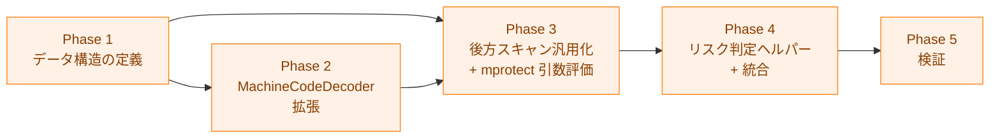

# 実装計画書: `mprotect(PROT_EXEC)` 静的検出

## 概要

本ドキュメントは、`mprotect(PROT_EXEC)` 静的検出機能の実装進捗を追跡する。
詳細仕様は [03_detailed_specification.md](03_detailed_specification.md) を参照。

## 依存関係

**凡例（Legend）**

**注記**: Phase 2 と Phase 3 の前半（`backwardScanForRegister` の抽出）は
Phase 1 完了後に並行して開始可能だが、Phase 3 の `evaluateMprotectArgs` は
Phase 2 完了後に実施する。

## Phase 1: データ構造の定義

`SyscallArgEvalResult` 型とスキーマバージョンの更新を行う。
他の全 Phase の土台となる。

### 1.1 型定義

- [x] `internal/common/syscall_types.go` に以下を追加
  - `SyscallArgEvalStatus` 型と 3 定数（`exec_confirmed`, `exec_unknown`, `exec_not_set`）
  - `SyscallArgEvalResult` 構造体
  - 仕様: 詳細仕様書 §2.1

### 1.2 `SyscallAnalysisResultCore` の拡張

- [x] `internal/common/syscall_types.go` の `SyscallAnalysisResultCore` に
  `ArgEvalResults []SyscallArgEvalResult` フィールドを追加
  - JSON タグに `omitempty` を付与
  - 仕様: 詳細仕様書 §2.2

### 1.3 スキーマバージョンの更新

- [x] `internal/fileanalysis/schema.go` の `CurrentSchemaVersion` を `4` → `5` に更新
  - バージョン履歴コメントを更新
  - 仕様: 詳細仕様書 §6
  - 受け入れ条件: AC-4

## Phase 2: `MachineCodeDecoder` インターフェースの拡張

第3引数レジスタ（`rdx`/`x2`）の検出メソッドを追加する。

### 2.1 インターフェース定義

- [x] `internal/runner/security/elfanalyzer/syscall_decoder.go` の
  `MachineCodeDecoder` インターフェースに 2 メソッドを追加
  - `ModifiesThirdArgRegister(inst DecodedInstruction) bool`
  - `IsImmediateToThirdArgRegister(inst DecodedInstruction) (bool, int64)`
  - 仕様: 詳細仕様書 §3

### 2.2 X86Decoder 実装

- [x] `internal/runner/security/elfanalyzer/x86_decoder.go` に実装を追加
  - `ModifiesThirdArgRegister`: `edx`/`rdx`/`dx`/`dl` の書き込み検出
  - `IsImmediateToThirdArgRegister`: 既存の `isImmediateToReg` ヘルパーを再利用
  - 仕様: 詳細仕様書 §3.1

### 2.3 ARM64Decoder 実装

- [x] `internal/runner/security/elfanalyzer/arm64_decoder.go` に実装を追加
  - `ModifiesThirdArgRegister`: `w2`/`x2` の書き込み検出
  - `IsImmediateToThirdArgRegister`: 既存の `arm64ImmValue` ヘルパーを再利用
  - 仕様: 詳細仕様書 §3.2

### 2.4 モックの更新

- [x] `internal/runner/security/elfanalyzer/syscall_analyzer_test.go` の
  `MockMachineCodeDecoder` に 2 メソッドのスタブを追加
  - 仕様: 詳細仕様書 §3.3

### 2.5 X86Decoder 単体テスト

- [x] `x86_decoder_test.go` にテストケースを追加
  - `TestX86Decoder_ModifiesThirdArgRegister`
  - `TestX86Decoder_IsImmediateToThirdArgRegister`
  - テストパターン: `mov $imm, %edx`、`mov $imm, %rdx`、`mov %rsi, %rdx`、
    `xor %edx, %edx`、非対象レジスタ
  - 仕様: 詳細仕様書 §8.1
  - 受け入れ条件: AC-2

### 2.6 ARM64Decoder 単体テスト

- [x] `arm64_decoder_test.go` にテストケースを追加
  - `TestARM64Decoder_ModifiesThirdArgRegister`
  - `TestARM64Decoder_IsImmediateToThirdArgRegister`
  - テストパターン: `mov x2, #imm`、`mov w2, #imm`、`mov x2, x1`、非対象レジスタ
  - 仕様: 詳細仕様書 §8.2
  - 受け入れ条件: AC-2

## Phase 3: 後方スキャンの汎用化と `mprotect` 引数評価

後方スキャンを汎用関数に抽出し、`mprotect` の `prot` 引数を評価する。

### 3.1 `backwardScanForRegister` 汎用関数の抽出

- [ ] `internal/runner/security/elfanalyzer/syscall_analyzer.go` に
  `backwardScanForRegister` を新規追加
  - `modifiesReg` / `isImmediateToReg` を関数引数として受け取る汎用スキャン
  - `maxValidSyscallNumber` の検証は含めない（呼び出し元で実施）
  - 仕様: 詳細仕様書 §4.1

### 3.2 `backwardScanForSyscallNumber` のラッパー化

- [ ] 既存の `backwardScanForSyscallNumber` を `backwardScanForRegister` のラッパーに変換
  - 外部インターフェース（引数・戻り値）は変更なし
  - `maxValidSyscallNumber` 検証をラッパー内で実施
  - 既存テスト（`TestSyscallAnalyzer_BackwardScan`）を実行して動作を確認
  - 仕様: 詳細仕様書 §4.1

### 3.3 `defaultMaxBackwardScan` コメントの一般化

- [ ] コメントを「syscall 番号取得のための後方スキャン上限」から
  「syscall 命令からの後方スキャン上限（syscall 番号・引数いずれにも適用）」に更新
  - 仕様: 詳細仕様書 §4.2

### 3.4 `evaluateMprotectArgs` メソッドの実装

- [ ] `internal/runner/security/elfanalyzer/syscall_analyzer.go` に
  `evaluateMprotectArgs` と `evalSingleMprotect` を追加
  - `mprotect` エントリのフィルタリング
  - `prot` 引数の後方スキャン
  - `PROT_EXEC`（`0x4`）フラグの判定
  - 複数エントリの最高リスク集約
  - `unknown:*` 判定メソッドを詳細文字列へ変換する
    `unknownMethodDetail` ヘルパーを追加
  - 仕様: 詳細仕様書 §4.3
  - 受け入れ条件: AC-1, AC-3, AC-6

### 3.5 `riskPriority` ヘルパーの実装

- [ ] `syscall_analyzer.go` に `riskPriority` 関数を追加
  - `exec_confirmed`(2) > `exec_unknown`(1) > `exec_not_set`(0)
  - 仕様: 詳細仕様書 §4.3

### 3.6 `analyzeSyscallsInCode` への統合

- [ ] `analyzeSyscallsInCode` に mprotect 引数評価ステップを追加
  - Pass 1・2 の後、Summary 構築の前に実行
  - `Summary.IsHighRisk` を OR 条件で更新（既存の代入を変更）
  - `HighRiskReasons` にメッセージを追加
  - Summary 構築ブロックのコメントを更新（`IsHighRisk` の条件に mprotect を追加）
  - `standard_analyzer.go` の `convertSyscallResult` docコメントを更新
  - 仕様: 詳細仕様書 §4.4, §10, §11.3
  - 受け入れ条件: AC-1, AC-3, AC-7

### 3.7 単体テスト・コンポーネントテスト

- [ ] `syscall_analyzer_test.go` に `TestSyscallAnalyzer_EvaluateMprotectArgs` を追加
  - テストパターン: `PROT_EXEC` 確定（64bit/32bit）、未設定、間接設定、制御フロー境界、
    非 mprotect syscall
  - 仕様: 詳細仕様書 §8.3
  - 受け入れ条件: AC-1, AC-2, AC-3

- [ ] `syscall_analyzer_test.go` に `TestSyscallAnalyzer_MultipleMprotect` を追加
  - テストパターン: `exec_confirmed + exec_not_set`、`exec_unknown + exec_not_set`、
    `exec_not_set` のみ
  - 仕様: 詳細仕様書 §8.4
  - 受け入れ条件: AC-6

## Phase 4: リスク判定ヘルパー

`EvalMprotectRisk` ヘルパーを実装し、リスク判定ロジックを明確化する。

### 4.1 `EvalMprotectRisk` ヘルパーの実装

- [ ] `internal/runner/security/elfanalyzer/mprotect_risk.go` を新規作成
  - `EvalMprotectRisk(argEvalResults []common.SyscallArgEvalResult) bool`
  - マッピング: `exec_confirmed` / `exec_unknown` → `true`、他 → `false`
  - 仕様: 詳細仕様書 §5.1
  - 受け入れ条件: AC-3, AC-7

### 4.2 `EvalMprotectRisk` テスト

- [ ] `internal/runner/security/elfanalyzer/mprotect_risk_test.go` を新規作成
  - テストパターン: `exec_confirmed` → true、`exec_unknown` → true、
    `exec_not_set` → false、空リスト → false、非 mprotect エントリ → false
  - 仕様: 詳細仕様書 §8.5

## Phase 5: 検証

全体動作の検証とスキーマ往復テストを行う。

### 5.1 スキーマ v5 往復テスト

- [ ] `internal/fileanalysis/` にスキーマ v5 の保存・読み込み往復テストを追加
  - `ArgEvalResults` 付きの Record の保存・復元
  - `ArgEvalResults` が nil の場合のフィールド省略確認
  - 仕様: 詳細仕様書 §8.6
  - 受け入れ条件: AC-4

### 5.2 フォーマット

- [ ] `make fmt` を実行し、全ファイルのフォーマットを適用

### 5.3 全テストパス

- [ ] `make test` で全テストがパスすることを確認
  - 既存の `Summary.HasNetworkSyscalls` の結果が変わらないことを含む
  - 受け入れ条件: AC-5

### 5.4 リンターパス

- [ ] `make lint` でリンターが全てパスすることを確認
