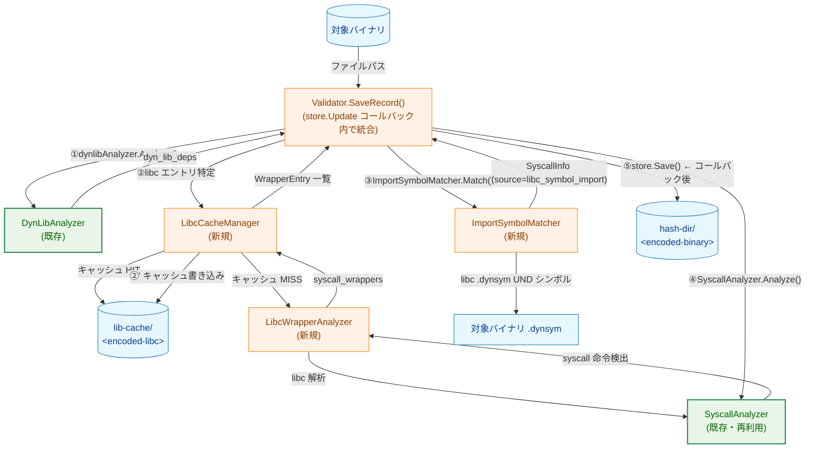
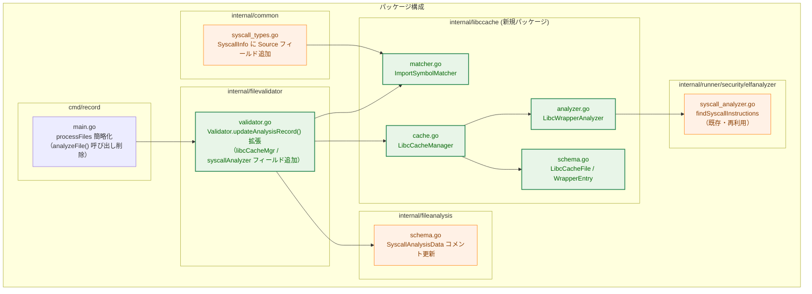
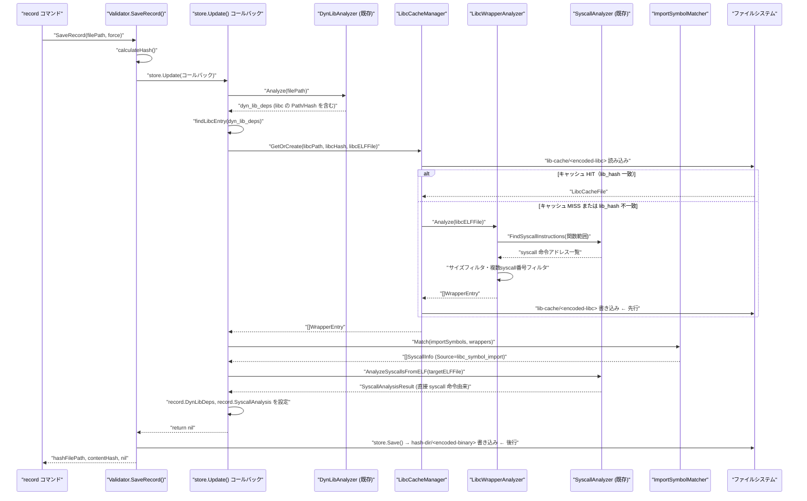
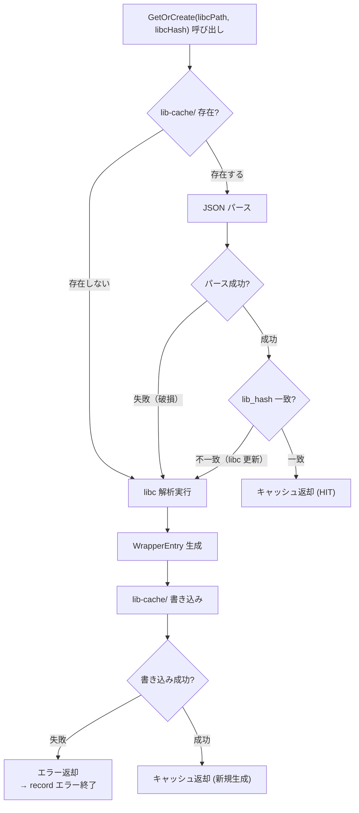
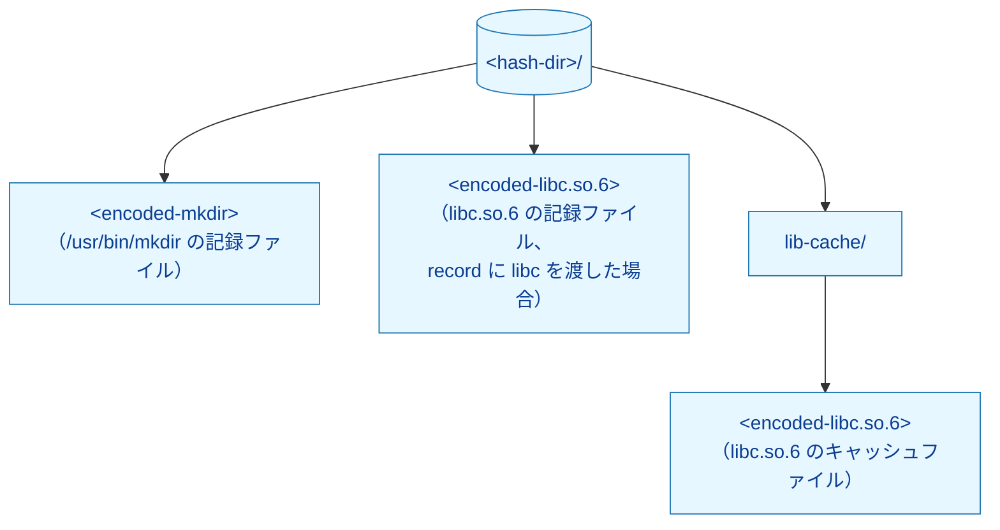
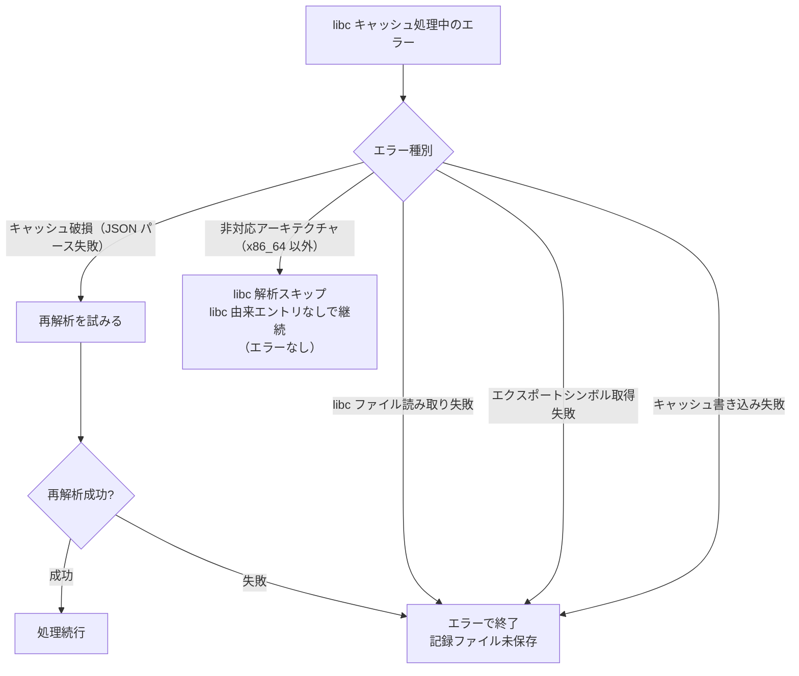
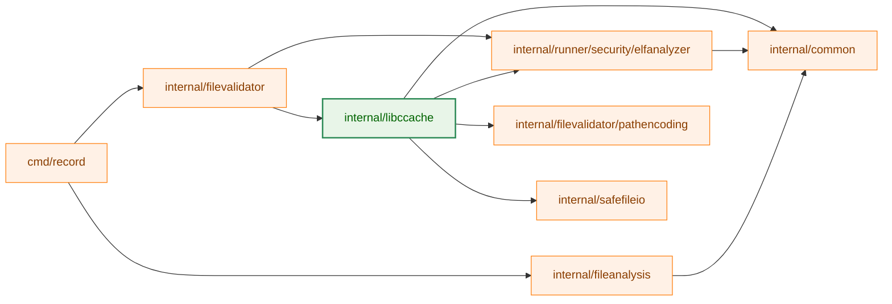
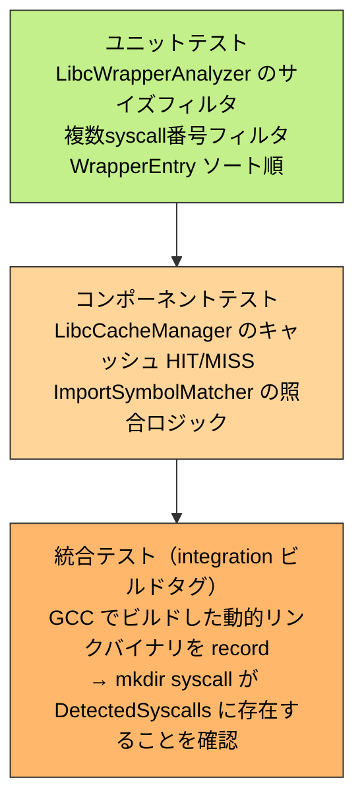

# アーキテクチャ設計書: libc システムコールラッパー関数キャッシュ

## 1. システム概要

### 1.1 アーキテクチャ目標

- 動的リンクバイナリが libc 経由で呼び出すシステムコールを、インポートシンボル照合によって補完検出する
- libc 解析結果をキャッシュし、`record` 実行のたびに再解析するコストを避ける
- 既存の `elfanalyzer` Pass 1 ロジックを再利用し、実装の重複を避ける
- 既存の `SyscallAnalysis` フロー（静的バイナリ）への影響を最小化する

### 1.2 設計原則

- **既存活用**: `elfanalyzer.SyscallAnalyzer` の `findSyscallInstructions` を再利用
- **DRY**: `pathencoding` パッケージの既存エンコーディング方式を再利用
- **セキュリティファースト**: 保存順序（キャッシュ先行）によるデータ整合性の保証
- **YAGNI**: x86_64 のみ対応、libc のみ対象の最小実装

## 2. システム構成

### 2.1 全体アーキテクチャ



**凡例（Legend）**


### 2.2 コンポーネント配置



### 2.3 データフロー（record コマンド実行時）

`Validator.SaveRecord()` が呼び出す `store.Update()` のコールバック内で、libc キャッシュ・インポートシンボル照合・syscall 解析をすべて実行する。コールバック return 後に `store.Save()` が記録ファイルを書くため、保存順序（キャッシュ先行）が自然に保証される。



### 2.4 キャッシュ有効性判定フロー



## 3. コンポーネント設計

### 3.1 新規パッケージ: `internal/libccache`

#### 3.1.1 スキーマ定義 (`schema.go`)

```go
// LibcCacheFile はキャッシュファイルの JSON スキーマ。
type LibcCacheFile struct {
    LibPath         string         `json:"lib_path"`
    LibHash         string         `json:"lib_hash"`
    AnalyzedAt      time.Time      `json:"analyzed_at"`
    SyscallWrappers []WrapperEntry `json:"syscall_wrappers"`
}

// WrapperEntry は 1 つのシステムコールラッパー関数を表す。
type WrapperEntry struct {
    Name   string `json:"name"`
    Number int    `json:"number"`
}
```

`SyscallWrappers` は `Number` 昇順でソートして保存する（決定論的出力）。

#### 3.1.2 libc エクスポート関数解析 (`analyzer.go`)

```go
// MaxWrapperFunctionSize はラッパー関数として認識する最大サイズ（バイト）。
const MaxWrapperFunctionSize = 256

// LibcWrapperAnalyzer は libc の ELF ファイルを解析し、
// syscall ラッパー関数の一覧を返す。
type LibcWrapperAnalyzer struct {
    analyzer *elfanalyzer.SyscallAnalyzer // AnalyzeSyscallsInRange を呼び出す（§6.2 参照）
}

// Analyze は libcELFFile のエクスポート関数を走査し、
// サイズフィルタと syscall 命令検出を適用して WrapperEntry を返す。
func (a *LibcWrapperAnalyzer) Analyze(libcELFFile *elf.File) ([]WrapperEntry, error)
```

**処理手順:**

1. `.dynsym` セクションからエクスポートシンボル（定義済み、関数型）を列挙する
2. 各シンボルのアドレス・サイズを取得し、`Size > MaxWrapperFunctionSize` のものをスキップする
3. `elfanalyzer.AnalyzeSyscallsInRange(code, sectionBaseAddr, funcStartOffset, funcEndOffset, decoder, table)` を呼び出す（後述 §6.2）。この関数が「syscall 命令位置の検出（Pass 1）＋各位置からの後方スキャンによる番号抽出」を一括して行い、`[]SyscallInfo`（`Number`, `DeterminationMethod` を含む）を返す
4. 返された `[]SyscallInfo` から `WrapperEntry.Number` を決定する。採用条件は以下をすべて満たすこと:
   - すべてのエントリの `DeterminationMethod == "immediate"` であること（`unknown:*` や他の方法は拒否）
   - すべてのエントリの `Number` が同一の正値であること
   - いずれかの条件を満たさない場合はその関数をスキップする

   **`immediate` のみを受理する根拠**: `backwardScanForSyscallNumber` の実装において、`Number >= 0` を返す唯一のパスは `DeterminationMethodImmediate` である（`syscall_analyzer.go:449-450`）。現時点では `DeterminationMethod == "immediate"` と `Number >= 0` は等価条件だが、将来の実装変更（新しい決定方法の追加等）によってこの等価性が崩れた際に誤った `WrapperEntry` がキャッシュに混入しないよう、`DeterminationMethod` を明示的にフィルタ条件に含める。
5. 採用した関数を `WrapperEntry` として収集し `Number` 昇順でソートして返す

#### 3.1.3 キャッシュ管理 (`cache.go`)

```go
// LibcCacheManager はライブラリキャッシュの読み書きを管理する。
type LibcCacheManager struct {
    cacheDir string // <hash-dir>/lib-cache/
    fs       safefileio.FileSystem
    analyzer *LibcWrapperAnalyzer
    pathEnc  *pathencoding.SubstitutionHashEscape // 具体型を直接使用（インターフェース不在のため）
}

// GetOrCreate はキャッシュを返すか、存在しない/無効な場合は解析して生成する。
// libcPath: 正規化済みの実体ファイルパス（DynLibDeps.Libs[].Path）
// libcHash: DynLibDeps.Libs[].Hash（"sha256:<hex>" 形式）
func (m *LibcCacheManager) GetOrCreate(libcPath, libcHash string, libcELFFile *elf.File) ([]WrapperEntry, error)
```

キャッシュファイルパス: `<cache-dir>/<pathencoding.Encode(libcPath)>`

`pathencoding` パッケージにはエンコーダーのインターフェース定義が存在しない（`SubstitutionHashEscape` 構造体とそのコンストラクタ `NewSubstitutionHashEscape()` のみ公開）。`LibcCacheManager` はこの具体型を直接保持する。テスト時もインターフェースではなく実装をそのまま使う。

#### 3.1.4 インポートシンボル照合 (`matcher.go`)

```go
// ImportSymbolMatcher は対象バイナリのインポートシンボルとキャッシュを照合する。
type ImportSymbolMatcher struct {
    syscallTable SyscallNumberTable
}

// Match はインポートシンボル一覧とキャッシュを照合し、SyscallInfo を生成する。
// 重複統合キー: (Number, Source, Name)
func (m *ImportSymbolMatcher) Match(
    importSymbols []string, // 対象バイナリの .dynsym UND シンボル名
    wrappers []WrapperEntry,
) []common.SyscallInfo
```

生成される `SyscallInfo`:
- `Source`: `"libc_symbol_import"`
- `Location`: `0`
- `DeterminationMethod`: `"immediate"` — キャッシュには `DeterminationMethod == "immediate"` のエントリしか格納されない（`LibcWrapperAnalyzer.Analyze()` のステップ 4 フィルタによる保証）ため、`WrapperEntry` から復元する際に `"immediate"` を設定することは根拠の捏造ではなく、キャッシュスキーマの不変条件の転写である
- `Name`, `Number`, `IsNetwork`: キャッシュ値と syscall テーブルから設定

### 3.2 `common.SyscallInfo` の拡張

```go
// internal/common/syscall_types.go
type SyscallInfo struct {
    Number              int    `json:"number"`
    Name                string `json:"name,omitempty"`
    IsNetwork           bool   `json:"is_network"`
    Location            uint64 `json:"location"`
    DeterminationMethod string `json:"determination_method"`
    Source              string `json:"source,omitempty"` // 追加: "libc_symbol_import" or "" (syscall 命令由来)
}
```

`omitempty` により既存の `Source` なしエントリは JSON 出力が変わらない。

### 3.3 `Validator` のリファクタリング方針

#### 3.3.1 制約の分析

保存順序の要件（libc キャッシュ先行）と `dyn_lib_deps` の生成タイミングには、以下の循環的な依存が存在する。

```
libc キャッシュ書き込みに必要: dyn_lib_deps（libcのPath/Hash）
dyn_lib_deps の生成タイミング: store.Update() コールバック内
store.Update() コールバック: store.Save()（記録ファイル書き込み）の直前
```

現行の `processFiles` は `SaveRecord()` 成功後に `analyzeFile()` を warning 扱いで呼び出している。この構造では「libc キャッシュを記録ファイルより先に書く」という順序保証を実現できない。

#### 3.3.2 採用するリファクタリング方針

**方針: `store.Update()` コールバック内への libc キャッシュ処理と SyscallAnalysis の統合**

`store.Update()` のコールバック実行と `store.Save()`（記録ファイル書き込み）の間には自然な順序がある。この構造を利用し、コールバック内で以下をすべて実行する。

```
store.Update() コールバック開始
  ↓
dynlibAnalyzer.Analyze() → dyn_lib_deps 取得
  ↓
libc エントリ特定（libc.so. 前方一致）
  ↓
LibcCacheManager.GetOrCreate() → lib-cache/ 書き込み  ← キャッシュ先行
  ↓
ImportSymbolMatcher.Match() → libc 由来 SyscallInfo 生成
  ↓
SyscallAnalyzer.AnalyzeSyscallsFromELF() → 静的 syscall 検出
  ↓
record.DynLibDeps, record.SyscallAnalysis を設定
  ↓
コールバック return nil
  ↓
store.Save() → 記録ファイル書き込み  ← 記録ファイルは必ずキャッシュの後
```

コールバック内でキャッシュ書き込みが先行し、コールバック return 後に `store.Save()` が記録ファイルを書くため、保存順序が自然に保証される。コールバックがエラーを返した場合、`store.Save()` は呼ばれないため記録ファイルは保存されない。

**現行の `analyzeFile()` の扱い**

`analyzeFile()` は `processFiles` から分離した独立呼び出しとして warning 扱いで実行されていた。このリファクタリングにより `SyscallAnalysis` もコールバック内に統合され、失敗時はエラーで終了する（warning 扱いを廃止）。

ただし `SyscallAnalysis` は非 ELF ファイル（スクリプト等）に対して実行不可のため、`ErrNotELF` は引き続き非エラーとして扱う（スキップ）。

#### 3.3.3 `Validator` への変更範囲

`dynlibAnalyzer.Analyze()` は現行でも `store.Update()` コールバック内で呼ばれているため、libc キャッシュ処理と `SyscallAnalysis` を同コールバック内に加えるのは自然な拡張である。

変更箇所:

- `filevalidator.Validator` に `libcCacheMgr` と `syscallAnalyzer` フィールドを追加する
- `updateAnalysisRecord()` のコールバック内に libc キャッシュ処理・インポートシンボル照合・syscall 解析を追加する
- `cmd/record/main.go` の `processFiles` から独立した `analyzeFile()` 呼び出しを削除する（コールバック内への統合のため）
- `syscallAnalysisContext` は `Validator` に吸収され廃止する

#### 3.3.4 libc 特定ロジック

```go
// findLibcEntry は dyn_lib_deps から libc エントリを返す。
// SOName が "libc.so." で前方一致するエントリを対象とする。
func findLibcEntry(deps *fileanalysis.DynLibDepsData) []fileanalysis.LibEntry {
    var result []fileanalysis.LibEntry
    for _, lib := range deps.Libs {
        if strings.HasPrefix(lib.SOName, "libc.so.") {
            result = append(result, lib)
        }
    }
    return result
}
```

#### 3.3.5 保存順序の保証（コールバック統合後）

```
[store.Update() コールバック内]
  1. dynlibAnalyzer.Analyze() → dyn_lib_deps 取得
  2. LibcCacheManager.GetOrCreate() → lib-cache/ 書き込み（キャッシュ先行）
  3. ImportSymbolMatcher.Match() + SyscallAnalyzer → SyscallInfo 収集
  4. record.DynLibDeps = dynLibDeps
  5. record.SyscallAnalysis = syscallData
  6. return nil
[store.Update() コールバック後]
  7. store.Save() → 記録ファイル（hash-dir/）書き込み
```

ステップ 2 が失敗した場合、コールバックがエラーを返し `store.Save()` は呼ばれない。ステップ 3 で `ErrNotELF` が返った場合は syscall 解析をスキップし、ステップ 4 以降を継続する。その他のエラーはすべてコールバックからエラーを返して終了する。

### 3.4 `fileanalysis/schema.go` のコメント更新

```go
// SyscallAnalysis contains syscall analysis result (optional).
// Present for static ELF binaries that have been analyzed,
// and for dynamic ELF binaries where syscalls via libc were detected.
SyscallAnalysis *SyscallAnalysisData `json:"syscall_analysis,omitempty"`
```

## 4. ファイルシステム構造



キャッシュファイルのファイル名エンコードには `internal/filevalidator/pathencoding` の既存実装を使用する。

## 5. エラーハンドリング設計

### 5.1 エラー分類



### 5.2 エラー型

`internal/libccache/errors.go` に以下を定義する:

| エラー型 | 説明 |
|---------|------|
| `ErrLibcFileNotAccessible` | libc ファイルの読み取り失敗 |
| `ErrExportSymbolsFailed` | エクスポートシンボル取得失敗 |
| `ErrCacheWriteFailed` | キャッシュファイルの書き込み失敗 |
| `ErrUnsupportedArchitecture` | 非対応アーキテクチャ（x86_64 以外） |

`ErrUnsupportedArchitecture` は `GetOrCreate` から返された場合に呼び出し元で検知してスキップする（唯一の継続パス）。

## 6. 依存関係

### 6.1 内部パッケージ依存関係



### 6.2 `elfanalyzer` からの再利用

`LibcWrapperAnalyzer` が `WrapperEntry.Number` を埋めるには、「syscall 命令の位置検出（`findSyscallInstructions`）」だけでなく、「各位置からの後方スキャンによる番号抽出（`extractSyscallInfo` → `backwardScanForSyscallNumber`）」まで必要である。現行の `AnalyzeSyscallsFromELF` はファイル全体の `.text` セクションを対象とするため、関数単位の部分範囲への適用には向かない。

このため、任意のバイト範囲に対して「位置検出 + 番号抽出」を一括実行する新しいエクスポート関数を `elfanalyzer` パッケージに追加する。

**追加するエクスポート API:**

```go
// AnalyzeSyscallsInRange は code[startOffset:endOffset] の範囲に含まれる
// syscall 命令を検出し、各命令の syscall 番号を後方スキャンで抽出して返す。
// sectionBaseAddr は code 全体の仮想アドレス起点。
// startOffset/endOffset は code 先頭からのバイトオフセット。
// Go ラッパー解析（Pass 2）は行わない。
// アーキテクチャ非対応の場合は ErrUnsupportedArchitecture を返す。
func (a *SyscallAnalyzer) AnalyzeSyscallsInRange(
    code []byte,
    sectionBaseAddr uint64,
    startOffset, endOffset int,
) ([]common.SyscallInfo, error)
```

`libccache.LibcWrapperAnalyzer` はこの関数を呼び出して `[]SyscallInfo` を取得し、`Number` の一意性を検査して `WrapperEntry` を生成する。

再利用方法の選択肢:

| 案 | 公開する API | メリット | デメリット |
|----|------------|---------|-----------|
| A | `FindSyscallInstructions` のみ（位置だけ） | 変更が小さい | `Number` を求める処理が未定義のまま残る |
| **B** | `AnalyzeSyscallsInRange`（位置検出 + 番号抽出） | `libccache` 側に番号抽出ロジックの重複が生じない | `elfanalyzer` の API 拡張が必要 |
| C | `LibcWrapperAnalyzer` を `elfanalyzer` パッケージ内に配置 | 内部関数に直接アクセス可能 | パッケージが肥大化 |

**採用: 案 B** — `AnalyzeSyscallsInRange` を `SyscallAnalyzer` のメソッドとして追加し、`libccache.LibcWrapperAnalyzer` から呼び出す。内部では既存の `findSyscallInstructions` + `extractSyscallInfo` を呼ぶだけであり、新規ロジックの追加は不要。

## 7. テスト戦略

### 7.1 テスト階層



### 7.2 テストデータ

`LibcWrapperAnalyzer` のユニットテストは、`elfanalyzer/testing` の既存パターンに倣い、最小限の ELF バイナリをインメモリ構築する。統合テストは GCC でコンパイルした動的リンクバイナリを使用し、GCC 非利用環境では `t.Skip()` でスキップする。

## 8. 非機能設計

### 8.1 パフォーマンス

- libc 解析はキャッシュ MISS 時のみ実行（初回または libc 更新時）
- 通常の `record` 実行: キャッシュファイル読み込み（< 1ms）+ ハッシュ照合 + JSON パースのみ
- サイズフィルタ（256 バイト超除外）により解析対象を約 2/3 に削減

### 8.2 スキーマ互換性

- `SyscallInfo.Source` は `omitempty` のため、既存の記録ファイルは正常に読み込める
- `CurrentSchemaVersion` の変更は不要（`01_requirements.md` §4.3 参照）

### 8.3 保守性

- `MaxWrapperFunctionSize = 256` を名前付き定数として定義（変更容易）
- `source` 値 `"libc_symbol_import"` を定数として定義
- ARM64 拡張時は `LibcWrapperAnalyzer` にアーキテクチャ別のデコーダーを追加するだけで対応可能
