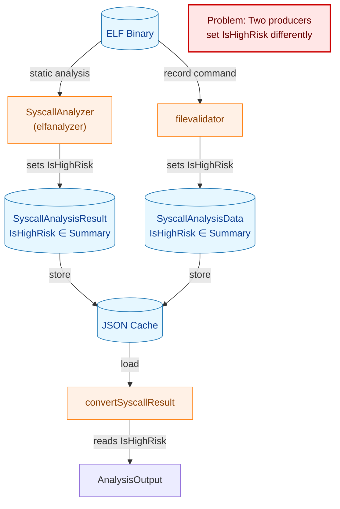
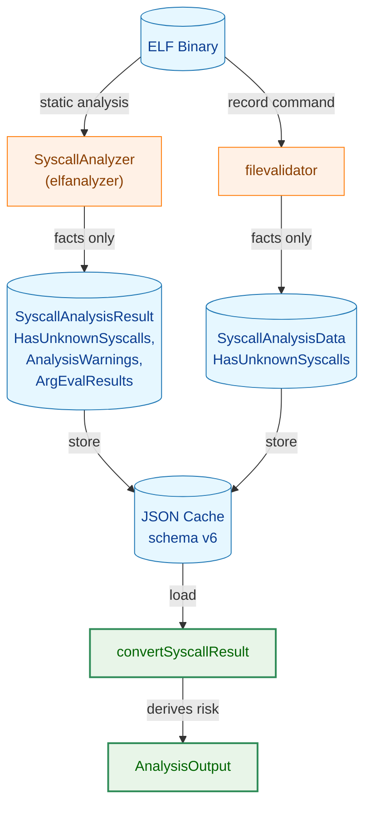
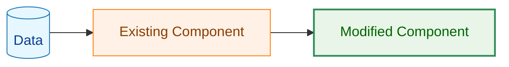
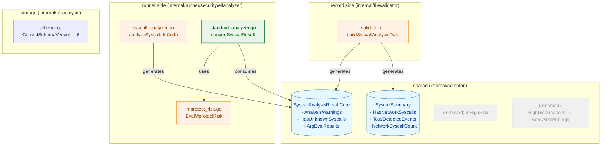
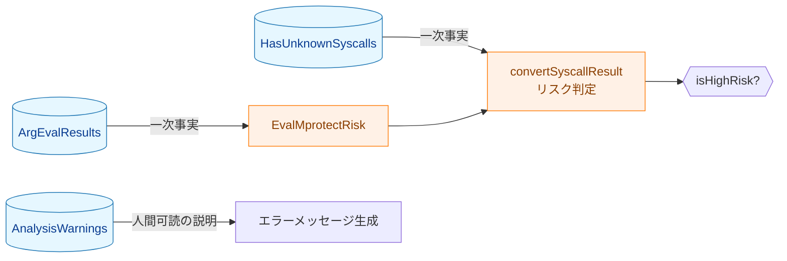
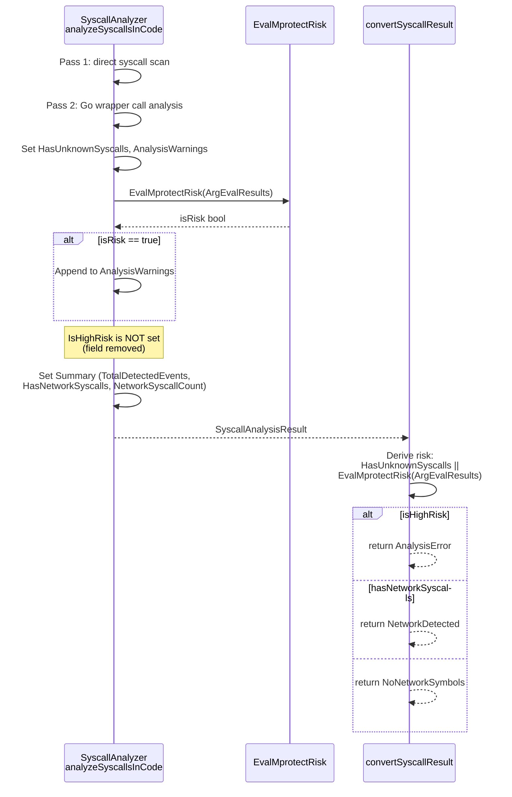
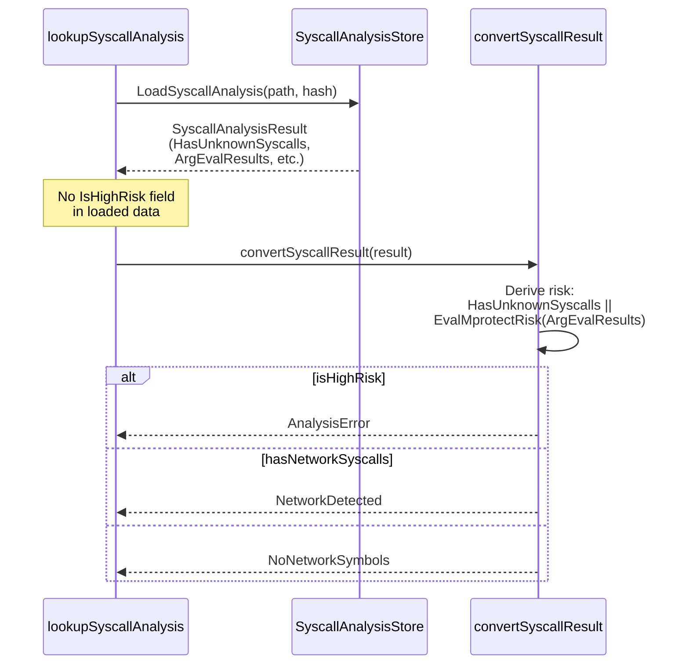
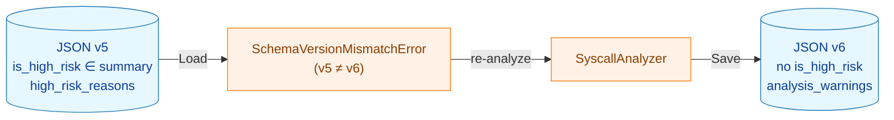

# アーキテクチャ設計書: `IsHighRisk` 廃止・`HighRiskReasons` リネーム

## 1. 設計の全体像

### 1.1 アーキテクチャ目標

- `common.SyscallSummary.IsHighRisk` フィールドを削除し、リスク判定ロジックを runner 側（`elfanalyzer`）に閉じ込める
- `HighRiskReasons` を `AnalysisWarnings` にリネームし、フィールド名を実態（解析上の観察事実）に一致させる
- 変更前後でリスク判定結果が同値であることを保証する

### 1.2 設計原則

- **責務分離**: 事実の記録（record 側: `filevalidator`）とリスク判断（runner 側: `elfanalyzer`）を明確に分離する
- **同値性保証**: `IsHighRisk` の廃止はリスク判定の挙動を変えない。判定条件は `HasUnknownSyscalls || EvalMprotectRisk(ArgEvalResults)` で現行と同値
- **一次事実依拠**: リスク判定は一次事実（`HasUnknownSyscalls`、`ArgEvalResults`）のみに依拠し、`AnalysisWarnings`（人間可読の説明文）に依拠しない
- **最小変更**: リスク判定ロジック自体や `EvalMprotectRisk` 関数名は変更しない

## 2. システム構成

### 2.1 変更前のデータフローと問題点



**問題**: `IsHighRisk` を 2 箇所（`elfanalyzer` と `filevalidator`）が異なるロジックで設定する。
`filevalidator` は `HasUnknownSyscalls` のみ、`elfanalyzer` は `HasUnknownSyscalls || EvalMprotectRisk(ArgEvalResults)` を使用しており、不整合が存在する。

### 2.2 変更後のデータフロー



**凡例（Legend）**



### 2.3 コンポーネント配置



## 3. コンポーネント設計

### 3.1 型定義の変更

#### `SyscallSummary`（`common` パッケージ）

変更前:
```go
type SyscallSummary struct {
    HasNetworkSyscalls  bool `json:"has_network_syscalls"`
    IsHighRisk          bool `json:"is_high_risk"`         // ← 削除
    TotalDetectedEvents int  `json:"total_detected_events"`
    NetworkSyscallCount int  `json:"network_syscall_count"`
}
```

変更後:
```go
type SyscallSummary struct {
    HasNetworkSyscalls  bool `json:"has_network_syscalls"`
    TotalDetectedEvents int  `json:"total_detected_events"`
    NetworkSyscallCount int  `json:"network_syscall_count"`
}
```

#### `SyscallAnalysisResultCore`（`common` パッケージ）

変更前:
```go
HighRiskReasons []string `json:"high_risk_reasons,omitempty"`
```

変更後:
```go
AnalysisWarnings []string `json:"analysis_warnings,omitempty"`
```

`omitempty` 動作・nil/空スライスの区別は不変。

### 3.2 リスク判定ロジックの移動

#### 変更前: `IsHighRisk` の設定箇所（2 箇所）

| 場所 | 式 | 問題 |
|------|-----|------|
| `elfanalyzer/syscall_analyzer.go` | `EvalMprotectRisk(ArgEvalResults) \|\| HasUnknownSyscalls` | ストアへ保存 |
| `filevalidator/validator.go` | `hasUnknown`（`HasUnknownSyscalls` のみ） | mprotect リスクが反映されない |

#### 変更後: リスク判定（1 箇所のみ）

| 場所 | 式 | 備考 |
|------|-----|------|
| `elfanalyzer/standard_analyzer.go` `convertSyscallResult` | `result.HasUnknownSyscalls \|\| EvalMprotectRisk(result.ArgEvalResults)` | 読み取り時に毎回導出 |

リスク判定をストア読み取り時に行うことで、判定ロジックが一箇所に集約される。
保存されたデータからも正しくリスクが導出される。

### 3.3 `AnalysisWarnings` の位置付け

`AnalysisWarnings` は解析中に観察された注意事項（事実の記述）であり、リスク判定には使用しない。



## 4. エラーハンドリング設計

### 4.1 エラー型

既存のエラー型を変更なく使用する:

```go
var ErrSyscallAnalysisHighRisk = errors.New("syscall analysis high risk")
```

### 4.2 エラーメッセージの変更

`convertSyscallResult` のエラーメッセージは `AnalysisWarnings`（旧 `HighRiskReasons`）を参照する。
フィールド名の変更のみであり、メッセージの内容・形式は変わらない。

```go
// Before
Error: fmt.Errorf("%w: %v", ErrSyscallAnalysisHighRisk, result.HighRiskReasons)

// After
Error: fmt.Errorf("%w: %v", ErrSyscallAnalysisHighRisk, result.AnalysisWarnings)
```

## 5. セキュリティ考慮事項

### 5.1 リスク判定の同値性

本変更はリスク判定の挙動を変えない。以下の表で同値性を示す。

| ケース | 変更前の `IsHighRisk` | 変更後の導出条件 | 結果 |
|--------|----------------------|------------------|------|
| `HasUnknownSyscalls = true`, `ArgEvalResults` 空 | `true` | `true \|\| false` = `true` | 同一 |
| `HasUnknownSyscalls = false`, `exec_confirmed` あり | `true` | `false \|\| true` = `true` | 同一 |
| `HasUnknownSyscalls = false`, `exec_unknown` あり | `true` | `false \|\| true` = `true` | 同一 |
| `HasUnknownSyscalls = false`, `exec_not_set` のみ | `false` | `false \|\| false` = `false` | 同一 |
| `HasUnknownSyscalls = false`, `ArgEvalResults` 空 | `false` | `false \|\| false` = `false` | 同一 |

### 5.2 安全方向の設計

- リスク判定は一次事実（`HasUnknownSyscalls`、`ArgEvalResults`）のみに依拠する
- `AnalysisWarnings` を判定条件に使わないため、説明文の変更がリスク判定に影響しない
- `filevalidator` 側で `IsHighRisk = hasUnknown` のみだった不整合が解消される

## 6. 処理フロー詳細

### 6.1 リアルタイム解析経路



### 6.2 キャッシュ読み取り経路



### 6.3 JSON スキーマバージョンの遷移



**運用への影響**: スキーマバージョンはレコードファイル全体に対して検証される（`file_analysis_store.go` の `Load`）。バージョンを 5 → 6 に上げると、syscall 分析キャッシュを持たないレコードも含め、**既存の全 JSON キャッシュが次回ロード時に `SchemaVersionMismatchError` となり再解析が走る**。再解析後は v6 として保存されるため、二回目以降のロードは正常に動作する。データ損失は発生しない。

## 7. テスト戦略

### 7.1 単体テスト

| テスト対象 | 検証内容 |
|-----------|---------|
| `syscall_types_test.go` | JSON ラウンドトリップで `is_high_risk` が含まれないこと、`analysis_warnings` が使われること |
| `syscall_analyzer_test.go` | `analyzeSyscallsInCode` が `IsHighRisk` を設定しないこと、`AnalysisWarnings` が正しく追加されること |
| `analyzer_test.go` | `convertSyscallResult` がモックデータ（`IsHighRisk` なし）から正しくリスク判定すること |
| `syscall_store_test.go` | 保存・ロードのラウンドトリップで `is_high_risk` なし・`analysis_warnings` ありの JSON が生成されること |
| `validator_test.go` | `filevalidator` が `IsHighRisk` を設定しないこと |

### 7.2 統合テスト

| テスト対象 | 検証内容 |
|-----------|---------|
| `syscall_analyzer_integration_test.go` | 実バイナリ解析結果に `IsHighRisk` が含まれないこと |
| スキーマバージョンテスト | v5 の JSON ロード時に `SchemaVersionMismatchError` が返ること |

### 7.3 リスク判定同値性テスト

既存のテストケースが変更後も同一の結果を返すことで同値性を検証する:

- `HasUnknownSyscalls = true` → `AnalysisError` を返す
- `EvalMprotectRisk = true` → `AnalysisError` を返す
- 両方 `false` → ネットワーク検出に応じた結果を返す

## 8. 実装の優先順位

### フェーズ 1: 型定義の変更

1. `common/syscall_types.go`: `IsHighRisk` 削除、`HighRiskReasons` → `AnalysisWarnings` リネーム
2. `fileanalysis/schema.go`: `CurrentSchemaVersion` を 6 に更新

### フェーズ 2: 実装コードの変更

3. `filevalidator/validator.go`: `IsHighRisk` 代入の削除
4. `elfanalyzer/syscall_analyzer.go`: `IsHighRisk` 代入の削除、`HighRiskReasons` → `AnalysisWarnings`
5. `elfanalyzer/standard_analyzer.go`: `convertSyscallResult` のリスク判定条件の置き換え
6. `elfanalyzer/mprotect_risk.go`: コメント更新

### フェーズ 3: テストの更新

7. 全テストファイルの `IsHighRisk` 参照削除・`HighRiskReasons` → `AnalysisWarnings` リネーム
8. `make test` および `make lint` の全パス確認

## 9. 将来の拡張性

### 9.1 リスク判定基準の変更

リスク判定条件が `convertSyscallResult` に一元化されるため、将来の判定基準変更が容易になる。
変更は `elfanalyzer` パッケージ内で完結し、`common` パッケージの型変更や JSON スキーマ更新を伴わない。

### 9.2 `EvalMprotectRisk` 関数の改名

本タスクではスコープ外とした `EvalMprotectRisk` 関数の改名は、
`IsHighRisk` との結びつきがなくなることで将来的に容易に実施できる。
