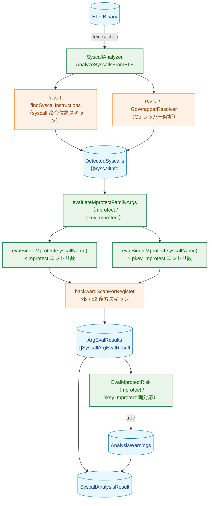
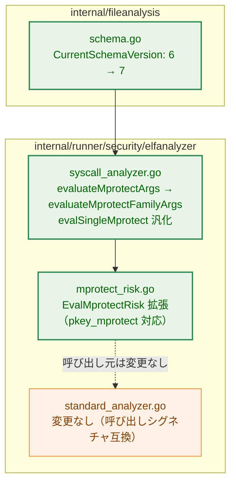
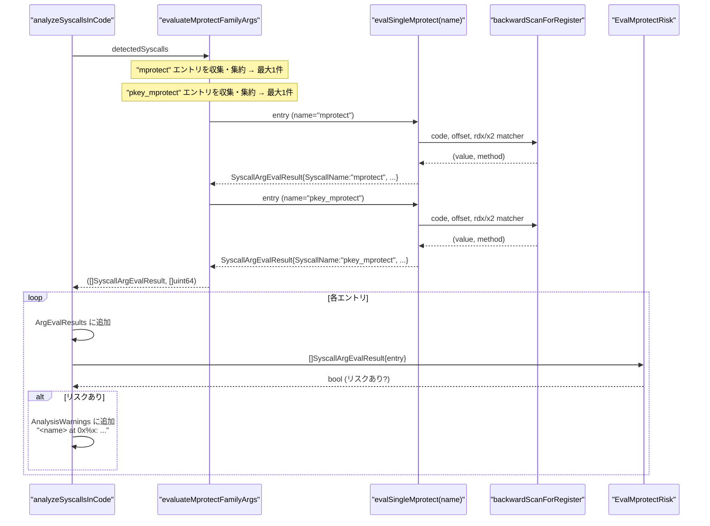
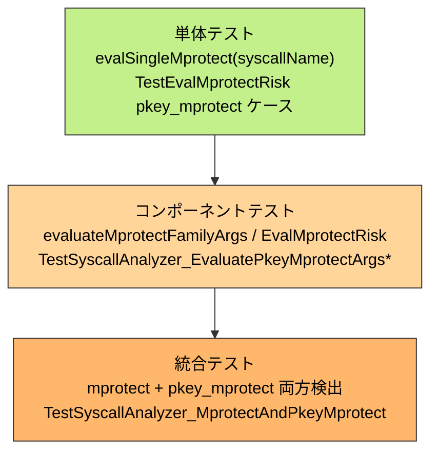

# アーキテクチャ設計書: `pkey_mprotect(PROT_EXEC)` 静的検出

## 1. システム概要

### 1.1 アーキテクチャ目標

- タスク 0078 で実装した `mprotect(PROT_EXEC)` 検出の最小変更での拡張
- 既存の `backwardScanForRegister` ロジックをそのまま流用
- `ArgEvalResults` の構造変更なし（JSON スキーマの型定義は不変）

### 1.2 設計原則

- **既存活用**: `backwardScanForRegister` / `evalSingleMprotect` を流用
- **最小変更**: シグネチャ変更は内部関数のみ、公開 API への影響なし
- **対称性**: `mprotect` と `pkey_mprotect` を同一のロジックで均等に処理

## 2. システム構成

### 2.1 全体アーキテクチャ



**凡例（Legend）**


### 2.2 変更対象コンポーネント配置



### 2.3 データフロー（`analyzeSyscallsInCode`）



## 3. インターフェース設計

### 3.1 変更される内部関数

#### `evaluateMprotectFamilyArgs`（`evaluateMprotectArgs` から改名）

```
変更前: evaluateMprotectArgs(code, baseAddr, decoder, detectedSyscalls)
        → (*SyscallArgEvalResult, uint64)

変更後: evaluateMprotectFamilyArgs(code, baseAddr, decoder, detectedSyscalls)
        → ([]common.SyscallArgEvalResult, []uint64)
```

戻り値の2スライスは同一インデックスで対応する
（`results[i]` の syscall 位置が `locations[i]`）。

#### `evalSingleMprotect`（汎化）

```
変更前: evalSingleMprotect(code, baseAddr, decoder, entry)
        → common.SyscallArgEvalResult
        ※ SyscallName は "mprotect" 固定

変更後: evalSingleMprotect(code, baseAddr, decoder, entry, syscallName string)
        → common.SyscallArgEvalResult
        ※ SyscallName に syscallName を使用
```

### 3.2 変更される公開関数

#### `EvalMprotectRisk`（`mprotect_risk.go`）

```
変更前: SyscallName == "mprotect" のエントリのみ評価

変更後: SyscallName が "mprotect" または "pkey_mprotect" のエントリを評価
        ※ 関数名・シグネチャは変更なし
```

### 3.3 変更なしの公開 API

以下は本タスクで変更しない：

| 関数/型 | 理由 |
|---|---|
| `SyscallAnalyzer.AnalyzeSyscallsFromELF` | 呼び出し元への影響なし |
| `SyscallAnalyzer.AnalyzeSyscallsInRange` | `evaluateMprotectFamilyArgs` を呼ばない |
| `common.SyscallArgEvalResult` | JSON 構造変更なし |
| `SyscallAnalysisResultCore.ArgEvalResults` | 型変更なし |
| `standard_analyzer.go` | `evaluateMprotectFamilyArgs` のシグネチャ変更が呼び出しシグネチャに波及しないため（`EvalMprotectRisk` は動作変更されるが、関数シグネチャは不変） |

## 4. スキーマ変更

### 4.1 JSON 構造への影響

`ArgEvalResults` の JSON 表現に変更なし。バージョン 7 以降の記録には
`"pkey_mprotect"` の `SyscallName` を持つエントリが追加されうる点のみが差分である。

```json
{
  "schema_version": 7,
  "syscall_analysis": {
    "arg_eval_results": [
      {"syscall_name": "mprotect",      "status": "exec_confirmed", "details": "prot=0x7"},
      {"syscall_name": "pkey_mprotect", "status": "exec_unknown",   "details": "indirect register setting"}
    ]
  }
}
```

### 4.2 後方互換性

バージョン 6 以前のレコードはスキーマバージョン不一致により自動無効化される（既存の動作）。

## 5. テスト戦略

### 5.1 テスト階層



### 5.2 既存テストへの影響

| テストファイル | 影響 | 対応 |
|---|---|---|
| `syscall_analyzer_test.go` | `evaluateMprotectArgs` 改名 | `evaluateMprotectFamilyArgs` に追従（テスト内呼び出しがあれば更新） |
| `mprotect_risk_test.go` | `EvalMprotectRisk` に `pkey_mprotect` ケース追加 | テストケース追加のみ |
| `file_analysis_store_test.go` | スキーマバージョン `CurrentSchemaVersion - 1` 参照 | 自動追従（変更不要） |
| `syscall_analyzer_test.go` `TestSyscallAnalyzer_MultipleMprotect` | `mprotect` 集約ロジックが継続動作 | 変更不要 |
