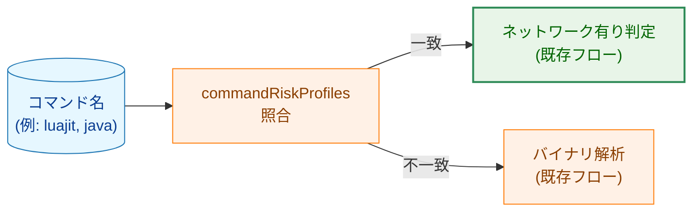
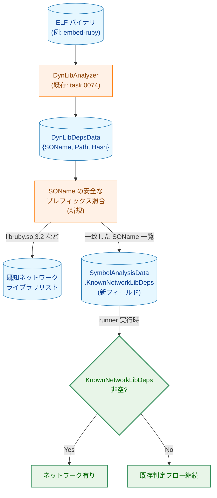
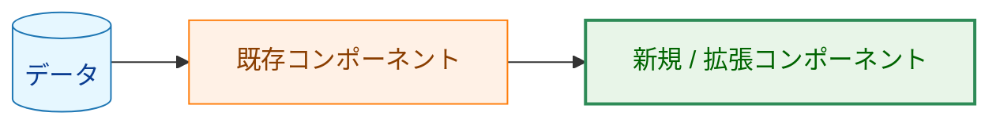
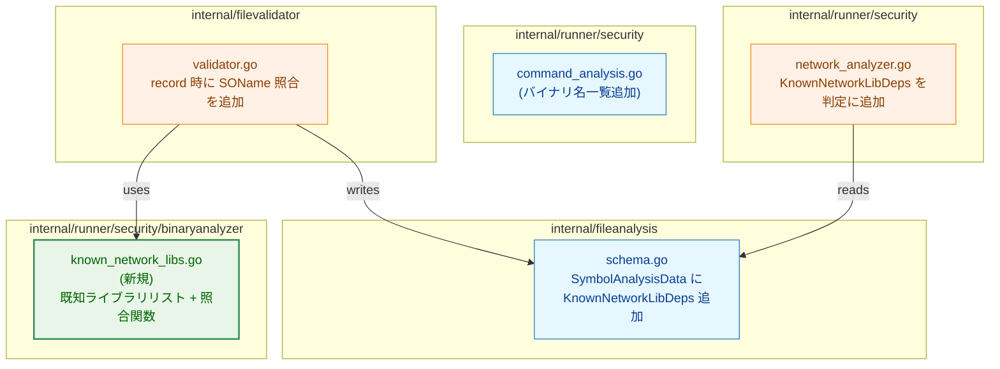

# アーキテクチャ設計書: 直接依存ライブラリによるネットワーク検出強化

## 1. システム概要

### 1.1 アーキテクチャ目標

- **方策 A**: `commandRiskProfiles` に言語ランタイムバイナリ名を追加し、バイナリ名ベースで正確に分類する
- **方策 C**: `record` 時に `DynLibDeps` の SOName を既知ネットワークライブラリリストと照合し、ライブラリ経由のネットワーク能力を検出する
- 既存のシンボル解析パイプラインへの変更を最小限に保つ

### 1.2 設計原則

- **False positive 回避**: 呼び出しグラフ解析は行わず、「既知のネットワークライブラリに依存している」という事実のみを根拠とする
- **既存活用**: `DynLibDepsData`（タスク 0074）を再利用。新規 I/O は不要
- **最小変更**: `SymbolAnalysisData` への `KnownNetworkLibDeps` フィールド追加のみ

---

## 2. システム構成

### 2.1 方策 A: commandRiskProfiles 拡張



追加対象バイナリ名は `command_analysis.go` の `commandProfileDefinitions` に追記するだけ。既存のインフラは一切変更不要。

### 2.2 方策 C: SOName ベース検出の全体フロー



**凡例（Legend）**



### 2.3 コンポーネント配置



---

## 3. データ構造の変更

### 3.1 `SymbolAnalysisData`（`internal/fileanalysis/schema.go`）

```go
// After change
type SymbolAnalysisData struct {
    AnalyzedAt         time.Time            `json:"analyzed_at"`
    DetectedSymbols    []DetectedSymbolEntry `json:"detected_symbols,omitempty"`
    DynamicLoadSymbols []DetectedSymbolEntry `json:"dynamic_load_symbols,omitempty"`

    // KnownNetworkLibDeps lists SOName values of known network libraries
    // detected from DynLibDeps during record.
    // If non-empty, this binary is treated as network-capable.
    KnownNetworkLibDeps []string `json:"known_network_lib_deps,omitempty"`
}
```

### 3.2 スキーマバージョン: 7 → 8

---

## 4. 新規コンポーネント: `known_network_libs.go`

### 4.1 配置パッケージ

`internal/runner/security/binaryanalyzer/known_network_libs.go`（新規）

既存の `network_symbols.go` と同パッケージに置く。`filevalidator` から参照する際の import cycle はない（`binaryanalyzer` は `filevalidator` に依存していないため）。

### 4.2 公開 API

```go
// IsKnownNetworkLibrary reports whether the SOName matches the known network library list.
// soname: DT_NEEDED value (for example, "libruby.so.3.2", "libcurl.so.4", "libpython3.11.so.1.0")
// Returns true if there is a match.
func IsKnownNetworkLibrary(soname string) bool

// KnownNetworkLibraryCount returns the number of registered libraries (for tests and documentation).
func KnownNetworkLibraryCount() int
```

### 4.3 照合ロジック

登録済みプレフィックスに対する安全な前方一致で判定する。SOName が `<prefix>` で始まり、その直後が `.`, `-`, 数字のいずれかである場合のみ一致とみなす。

```
"libruby.so.3.2"        → prefix "libruby"   に一致 ✓
"libcurl.so.4"          → prefix "libcurl"   に一致 ✓
"libpython3.11.so.1.0"  → prefix "libpython" に一致 ✓
"libpythonista.so"      → 区切り条件を満たさず不一致 ✗
"libstdc++.so.6"        → 未登録のため不一致 ✗
```

---

## 5. `record` 時の処理フロー変更

`filevalidator/validator.go` の `updateAnalysisRecord` 内、DynLibDeps 解決後かつ SymbolAnalysis 設定後に以下を追加：

```
既存: DynLibAnalyzer.Analyze() → record.DynLibDeps 設定
既存: binaryAnalyzer.AnalyzeNetworkSymbols() → record.SymbolAnalysis 設定
新規: record.DynLibDeps の各 SOName を IsKnownNetworkLibrary() で照合
      → 一致した SOName を record.SymbolAnalysis.KnownNetworkLibDeps に追加
```

`record.SymbolAnalysis` が nil（静的バイナリ等）の場合は `KnownNetworkLibDeps` の記録もスキップする。

---

## 6. `runner` 実行時の判定変更

`network_analyzer.go` の `isNetworkViaBinaryAnalysis` 内、キャッシュ読み込み後に以下を追加：

```
既存: len(data.DetectedSymbols) > 0 → NetworkDetected
新規: len(data.KnownNetworkLibDeps) > 0 → NetworkDetected（追加条件）
```

---

## 7. 既存コンポーネントへの影響

| コンポーネント | 変更内容 |
|---|---|
| `security/command_analysis.go` | バイナリ名追加（小規模） |
| `fileanalysis/schema.go` | `KnownNetworkLibDeps` フィールド追加、スキーマバージョン 7→8 |
| `binaryanalyzer/known_network_libs.go` | 新規ファイル（ライブラリリストと照合関数） |
| `filevalidator/validator.go` | SOName 照合ロジックを追加（数行） |
| `runner/security/network_analyzer.go` | `KnownNetworkLibDeps` の判定追加（数行） |
| `dynlibanalysis/` | 変更なし |
