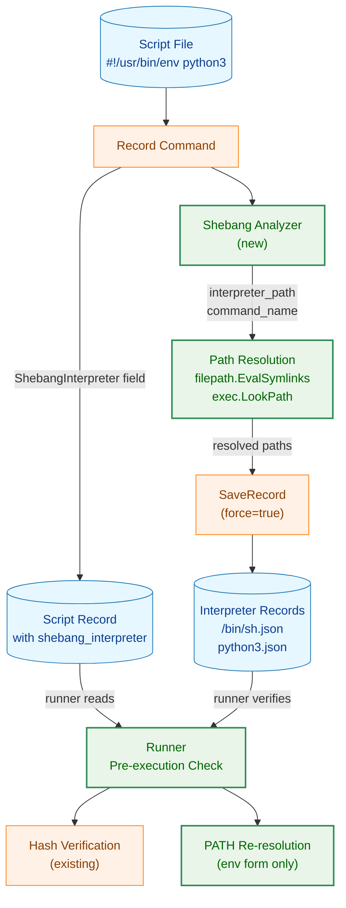
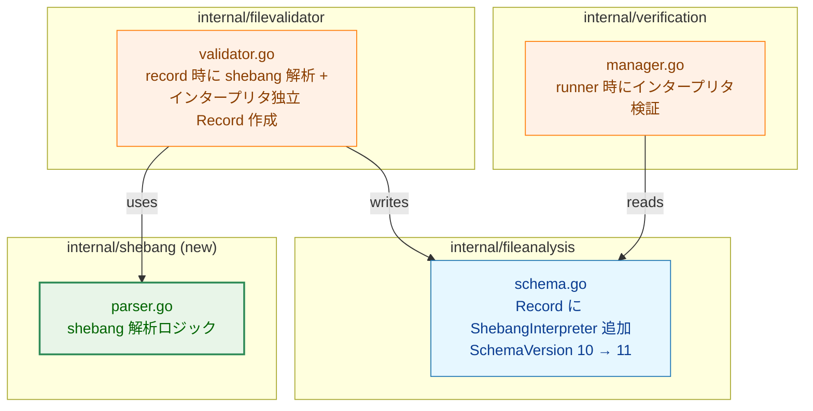
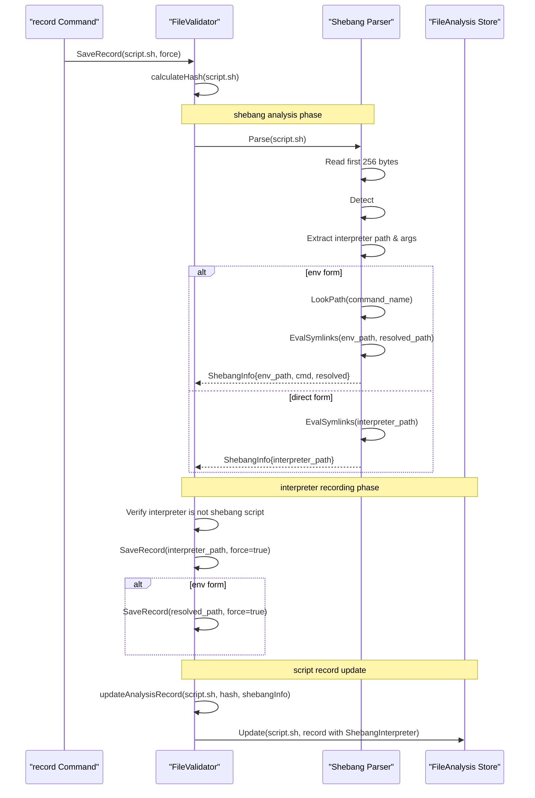
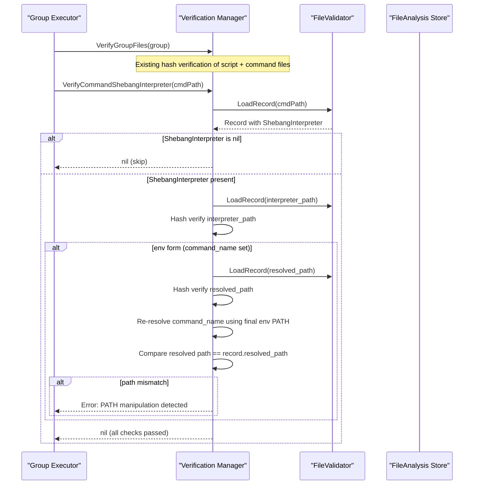
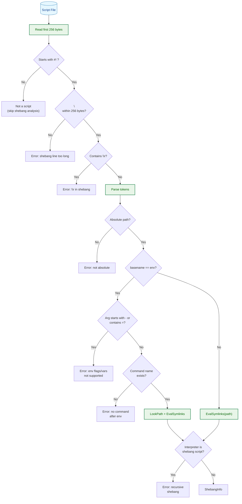
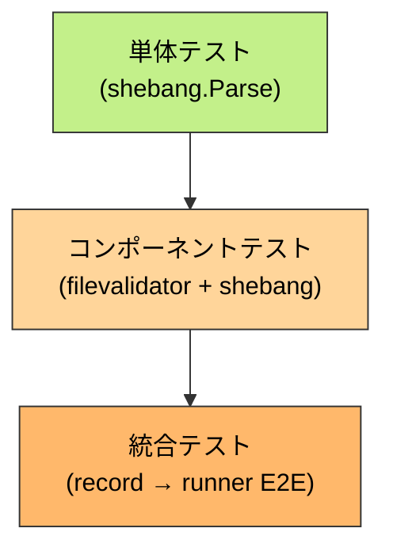

# アーキテクチャ設計書: Shebang インタープリタ追跡

## 1. システム概要

### 1.1 アーキテクチャ目標

- スクリプトファイルの shebang 行を解析し、インタープリタバイナリを自動的に record 対象に追加する
- runner 実行時にインタープリタの存在確認・ハッシュ検証・パス再解決を行う
- 既存の `SaveRecord` / `LoadRecord` パターンを最大限再利用し、変更範囲を最小化する
- `env` 形式（`#!/usr/bin/env python3`）と直接指定形式（`#!/bin/sh`）の両方を安全に処理する

### 1.2 設計原則

- **既存活用**: `SaveRecord(force=true)` でインタープリタの独立 Record を作成（DynLibDeps パターンと同一）
- **セキュリティファースト**: shebang 解析に Linux カーネル準拠の制限（256 バイト上限）、インタープリタ再帰検出、`env` フラグ拒否を実装
- **最小変更**: `Record` への `ShebangInterpreter` フィールド追加と、record/runner それぞれ 1 箇所のフック追加に限定
- **YAGNI**: `env -S` フラグ等の複雑な形式は対象外とし、明確にエラーとする

---

## 2. システム構成

### 2.1 全体アーキテクチャ



**凡例（Legend）**


### 2.2 コンポーネント配置



### 2.3 データフロー: record 時



### 2.4 データフロー: runner 時



---

## 3. コンポーネント設計

### 3.1 新規パッケージ: `internal/shebang`

shebang 解析のみに責務を限定した新規パッケージ。`filevalidator` から呼び出される。

#### 3.1.1 型定義

```go
// ShebangInfo holds the parsed result of a shebang line.
type ShebangInfo struct {
    // InterpreterPath is the absolute path to the interpreter binary.
    // For env form, this is the path to env itself (e.g., "/usr/bin/env").
    // Always resolved via filepath.EvalSymlinks.
    InterpreterPath string

    // CommandName is the command passed to env (e.g., "python3").
    // Empty for direct form (e.g., "#!/bin/sh").
    CommandName string

    // ResolvedPath is the PATH-resolved absolute path of CommandName.
    // Empty for direct form. Always resolved via filepath.EvalSymlinks.
    ResolvedPath string
}
```

#### 3.1.2 公開 API

```go
// Parse reads the shebang line from the file and returns the parsed result.
// Returns nil, nil if the file does not start with "#!".
// Returns an error for malformed shebangs (empty path, non-absolute, env flags, etc.).
func Parse(filePath string) (*ShebangInfo, error)

// IsShebangScript checks whether the file starts with "#!" magic bytes.
// Used to detect recursive shebang interpreters.
func IsShebangScript(filePath string) (bool, error)
```

### 3.2 データ構造の拡張: `Record`

#### 3.2.1 `fileanalysis.Record` への追加

```go
type Record struct {
    // ... existing fields ...

    // ShebangInterpreter holds interpreter information parsed from the
    // script's shebang line. nil for non-script files (ELF, text, etc.).
    ShebangInterpreter *ShebangInterpreterInfo `json:"shebang_interpreter,omitempty"`
}
```

#### 3.2.2 新規型: `ShebangInterpreterInfo`

```go
// ShebangInterpreterInfo records the interpreter associated with a script file.
type ShebangInterpreterInfo struct {
    // InterpreterPath is the shebang interpreter path (e.g., "/bin/sh", "/usr/bin/env").
    // Always symlink-resolved.
    InterpreterPath string `json:"interpreter_path"`

    // CommandName is the command name passed to env (e.g., "python3").
    // Empty for direct form.
    CommandName string `json:"command_name,omitempty"`

    // ResolvedPath is the PATH-resolved absolute path of CommandName (e.g., "/usr/bin/python3").
    // Empty for direct form. Always symlink-resolved.
    ResolvedPath string `json:"resolved_path,omitempty"`
}
```

### 3.3 `filevalidator.Validator` の拡張

`SaveRecord` に shebang 解析とインタープリタ独立 Record 作成の事前フェーズを追加し、`updateAnalysisRecord` は確定済みの shebang 情報を書き込む責務に限定する。

```
新規: 1. shebang.Parse(filePath)                → shebangInfo
新規: 2. Validate recursive shebang            → error if interpreter is script
新規: 3. SaveRecord(interpreter, force=true)   for each interpreter binary
既存: 4. updateAnalysisRecord(..., shebangInfo)
         ├─ DynLibAnalyzer.Analyze()           → record.DynLibDeps
         ├─ binaryAnalyzer.AnalyzeNetwork()    → record.SymbolAnalysis
         ├─ KnownNetworkLibDeps 照合
         ├─ analyzeSyscalls()
         └─ record.ShebangInterpreter = shebangInfo
```

この順序により、インタープリタの独立 Record 作成に失敗した場合でも、スクリプト Record だけが先に永続化される状態を回避できる。

### 3.4 `verification.Manager` の拡張

#### 3.4.1 新規メソッド

```go
// VerifyCommandShebangInterpreter verifies the integrity of the interpreter
// recorded in the script's ShebangInterpreter field.
func (m *Manager) VerifyCommandShebangInterpreter(cmdPath string, envVars map[string]string) error
```

#### 3.4.2 `ManagerInterface` への追加

```go
type ManagerInterface interface {
    ResolvePath(path string) (string, error)
    VerifyGroupFiles(runtimeGroup *runnertypes.RuntimeGroup) (*Result, error)
    VerifyCommandDynLibDeps(cmdPath string) error
    VerifyCommandShebangInterpreter(cmdPath string, envVars map[string]string) error  // new
}
```

#### 3.4.3 呼び出し元: `group_executor.go`

`verifyGroupFiles` 内の DynLibDeps 検証ループの後に、shebang インタープリタ検証ループを追加する。

```
既存: for each cmd → VerifyCommandDynLibDeps(resolvedPath)
新規: for each cmd → VerifyCommandShebangInterpreter(resolvedPath, envVars)
```

`envVars` は当該コマンドの最終環境変数（設定適用後）を渡す。`env` 形式の PATH 再解決に使用する。

---

## 4. セキュリティアーキテクチャ

### 4.1 脅威モデル

| 脅威 | 攻撃シナリオ | 対策 |
|------|------------|------|
| インタープリタ差し替え | `/bin/sh` を悪意のあるバイナリに置換 | ハッシュ検証（FR-3.3.3） |
| PATH 操作 | `PATH` を操作して異なる `python3` に誘導 | パス再解決 + 一致確認（FR-3.3.4） |
| 再帰 shebang | インタープリタ自体が shebang スクリプト | `IsShebangScript` で検出しエラー（FR-3.4） |
| env フラグ悪用 | `#!/usr/bin/env -S` で任意引数注入 | フラグ検出時にエラー（FR-3.1.3） |
| 長大 shebang 行 | 256 バイト超の shebang でバッファオーバーフロー | カーネル準拠 256 バイト上限（FR-3.1.4） |
| CR 混入 | `\r\n` 改行でインタープリタパスに `\r` 混入 | `\r` 検出時にエラー（FR-3.1.4） |

### 4.2 セキュリティ処理フロー



### 4.3 `skip_standard_paths` との関係

`skip_standard_paths` はインタープリタ検証には適用しない。インタープリタが標準パス（`/bin/sh` 等）に存在する場合でも、Record の存在確認・ハッシュ検証・パス再解決をすべて実施する。FR-3.2.1 によりインタープリタは常に record されるため、Record 欠落による問題は発生しない。

---

## 5. エラーハンドリング設計

### 5.1 record 時エラー

| エラー | 型 | 発生箇所 |
|--------|-----|---------|
| shebang 行が長すぎる | `ErrShebangLineTooLong` | `shebang.Parse` |
| shebang 行に `\r` 含む | `ErrShebangCR` | `shebang.Parse` |
| インタープリタパスが空 | `ErrEmptyInterpreterPath` | `shebang.Parse` |
| インタープリタパスが非絶対パス | `ErrInterpreterNotAbsolute` | `shebang.Parse` |
| env 後にコマンドなし | `ErrMissingEnvCommand` | `shebang.Parse` |
| env フラグ検出 | `ErrEnvFlagNotSupported` | `shebang.Parse` |
| env 変数代入検出 | `ErrEnvAssignmentNotSupported` | `shebang.Parse` |
| コマンドが PATH 解決不可 | `ErrCommandNotFound` | `shebang.Parse` |
| インタープリタが shebang | `ErrRecursiveShebang` | `filevalidator` |
| インタープリタの SaveRecord 失敗 | wrapped error | `filevalidator` |

### 5.2 runner 時エラー

| エラー | 型 | 発生箇所 |
|--------|-----|---------|
| インタープリタ Record 不在 | `ErrInterpreterRecordNotFound` | `verification.Manager` |
| インタープリタハッシュ不一致 | existing `ErrMismatch` | `filevalidator.Verify` |
| PATH 再解決結果不一致 | `ErrInterpreterPathMismatch` | `verification.Manager` |
| スキーマバージョン不一致 | existing `SchemaVersionMismatchError` | `fileanalysis.Store.Load` |

---

## 6. パフォーマンス設計

### 6.1 record 時

- shebang 解析: ファイル先頭 256 バイトの読み取りのみ（O(1)）
- インタープリタの独立 Record 作成: `SaveRecord(force=true)` で最大 2 回（`env` 形式の場合）の追加 I/O
- 同一インタープリタを複数スクリプトで共有する場合、`force=true` により毎回上書きされる（冪等）

### 6.2 runner 時

- `ShebangInterpreter` フィールドの有無チェック: Record の JSON デシリアライズ時に自動で行われる（追加コストなし）
- インタープリタハッシュ検証: ファイル 1 つまたは 2 つ（`env` 形式）の追加ハッシュ計算
- PATH 再解決: 最終環境の `PATH` を使ったコマンド探索 1 回（`env` 形式のみ）

### 6.3 パフォーマンス要件

| メトリクス | 目標値 | 根拠 |
|----------|-------|------|
| shebang 解析（ファイルあたり） | < 1ms | 256 バイト読み取り + トークン分割のみ |
| インタープリタ Record 作成 | < 50ms | 既存 SaveRecord と同等 |
| runner インタープリタ検証 | < 10ms | ハッシュ計算 + LookPath |

---

## 7. テスト戦略

### 7.1 テスト階層



### 7.2 テストカテゴリ

**単体テスト（`internal/shebang`）:**
- shebang 行の解析（直接形式、env 形式、各種エラーケース）
- `IsShebangScript` による magic bytes 検出

**コンポーネントテスト（`internal/filevalidator`）:**
- スクリプト record 時の ShebangInterpreter フィールド設定
- インタープリタ独立 Record 作成
- 再帰 shebang 検出

**コンポーネントテスト（`internal/verification`）:**
- インタープリタ Record 存在確認
- インタープリタハッシュ検証
- env 形式のパス再解決

**統合テスト（`cmd/runner`）:**
- スクリプト record → runner 実行の E2E フロー

---

## 8. 既存コンポーネントへの影響

| コンポーネント | 変更内容 |
|---|---|
| `internal/fileanalysis/schema.go` | `ShebangInterpreterInfo` 型追加、`Record` に `ShebangInterpreter` フィールド追加、`CurrentSchemaVersion` 10 → 11 |
| `internal/shebang/` | 新規パッケージ（shebang 解析ロジック） |
| `internal/filevalidator/validator.go` | `updateAnalysisRecord` に shebang 解析 + インタープリタ Record 作成を追加 |
| `internal/verification/manager.go` | `VerifyCommandShebangInterpreter` メソッド追加 |
| `internal/verification/interfaces.go` | `ManagerInterface` に `VerifyCommandShebangInterpreter` 追加 |
| `internal/runner/group_executor.go` | `verifyGroupFiles` にインタープリタ検証ループ追加 |
| `internal/verification/testing/testify_mocks.go` | モック更新 |
