# 実装計画書: Shebang インタープリタ追跡

## 進捗状況

- [ ] Phase 1: shebang パーサー（テスト先行）
- [ ] Phase 2: スキーマ変更
- [ ] Phase 3: record 時ロジック
- [ ] Phase 4: runner 時ロジック
- [ ] Phase 5: group executor 統合
- [ ] Phase 6: 最終検証

---

## Phase 1: shebang パーサー（テスト先行）

### 1.1 テスト実装（RED）

**ファイル**: `internal/shebang/parser_test.go`

- [ ] `TestParse_DirectForm`: `#!/bin/sh` → `InterpreterPath` が EvalSymlinks 解決後のパス
- [ ] `TestParse_DirectFormWithArgs`: `#!/bin/bash -e` → `/bin/bash` のみ抽出、`-e` は無視
- [ ] `TestParse_SpaceAfterShebang`: `#! /bin/sh` → 空白許容
- [ ] `TestParse_EnvForm`: `#!/usr/bin/env python3` → 3 フィールドすべて設定
- [ ] `TestParse_NotShebang_ELF`: ELF magic bytes → `nil, nil`
- [ ] `TestParse_NotShebang_Text`: 通常テキスト → `nil, nil`
- [ ] `TestParse_ErrEmptyInterpreterPath`: `#!\n` → `ErrEmptyInterpreterPath`
- [ ] `TestParse_ErrEmptyInterpreterPath_Whitespace`: `#!  \n` → `ErrEmptyInterpreterPath`
- [ ] `TestParse_ErrInterpreterNotAbsolute`: `#!python3\n` → `ErrInterpreterNotAbsolute`
- [ ] `TestParse_ErrMissingEnvCommand`: `#!/usr/bin/env\n` → `ErrMissingEnvCommand`
- [ ] `TestParse_ErrEnvFlagNotSupported`: `#!/usr/bin/env -S python3\n` → `ErrEnvFlagNotSupported`
- [ ] `TestParse_ErrEnvAssignmentNotSupported`: `#!/usr/bin/env PYTHONPATH=. python3\n` → `ErrEnvAssignmentNotSupported`
- [ ] `TestParse_ErrCommandNotFound`: `#!/usr/bin/env nonexistent_cmd\n` → `ErrCommandNotFound`
- [ ] `TestParse_ErrShebangLineTooLong`: 256 バイト以内に改行なし → `ErrShebangLineTooLong`
- [ ] `TestParse_ErrShebangCR`: `#!/bin/sh\r\n` → `ErrShebangCR`

**ファイル**: `internal/shebang/parser_test.go`（IsShebangScript テスト）

- [ ] `TestIsShebangScript_True`: shebang ファイル → `true`
- [ ] `TestIsShebangScript_False_ELF`: ELF ファイル → `false`
- [ ] `TestIsShebangScript_False_Text`: テキストファイル → `false`
- [ ] `TestIsShebangScript_False_Empty`: 空ファイル → `false`
- [ ] `TestIsShebangScript_False_OneByte`: 1 バイトファイル → `false`

この時点ではコンパイルエラー（パッケージ未作成）。

### 1.2 本体実装（GREEN）

**ファイル**: `internal/shebang/errors.go`

- [ ] `ErrShebangLineTooLong` sentinel error
- [ ] `ErrShebangCR` sentinel error
- [ ] `ErrEmptyInterpreterPath` sentinel error
- [ ] `ErrInterpreterNotAbsolute` sentinel error
- [ ] `ErrMissingEnvCommand` sentinel error
- [ ] `ErrEnvFlagNotSupported` sentinel error
- [ ] `ErrEnvAssignmentNotSupported` sentinel error
- [ ] `ErrCommandNotFound` sentinel error
- [ ] `ErrRecursiveShebang` sentinel error

**ファイル**: `internal/shebang/parser.go`

- [ ] `ShebangInfo` 型定義
- [ ] `Parse(filePath string, fs safefileio.FileSystem) (*ShebangInfo, error)` 実装
  - [ ] `fs.SafeOpenFile` でファイルオープン（シンボリックリンク攻撃防止）
  - [ ] ファイル先頭 256 バイト読み取り
  - [ ] `#!` プレフィックスチェック（非 shebang → `nil, nil`）
  - [ ] 改行検出（256 バイト以内に `\n` なし → `ErrShebangLineTooLong`）
  - [ ] `\r` 検出 → `ErrShebangCR`
  - [ ] トークン分割（空白スキップ + `strings.Fields`）
  - [ ] 空トークン → `ErrEmptyInterpreterPath`
  - [ ] 絶対パスチェック → `ErrInterpreterNotAbsolute`
  - [ ] 元のインタープリタトークンを保持（`rawInterpreter := tokens[0]`）
  - [ ] `filepath.EvalSymlinks` でシンボリックリンク解決（`resolvedInterpreter`）
  - [ ] `env` 判定（`filepath.Base(rawInterpreter) == "env"`、シンボリックリンク解決前のトークンで判定）
  - [ ] env 形式: `parseEnvForm(resolvedInterpreter, tokens[1:])` 呼び出し
  - [ ] 直接形式: `ShebangInfo{InterpreterPath: resolvedInterpreter}` 返却
- [ ] `parseEnvForm(envPath string, args []string) (*ShebangInfo, error)` 実装
  - [ ] 引数なし → `ErrMissingEnvCommand`
  - [ ] フラグ検出（`-` prefix）→ `ErrEnvFlagNotSupported`
  - [ ] 変数代入検出（`=` 含む）→ `ErrEnvAssignmentNotSupported`
  - [ ] `exec.LookPath(cmdArg)` で PATH 解決
  - [ ] 解決不可 → `ErrCommandNotFound`
  - [ ] `filepath.EvalSymlinks` で解決済みパスのシンボリックリンク解決
- [ ] `IsShebangScript(filePath string, fs safefileio.FileSystem) (bool, error)` 実装
  - [ ] `fs.SafeOpenFile` でファイルオープン
  - [ ] 先頭 2 バイト読み取り（`io.EOF` → `false, nil`、他エラー → エラー返却）

### 1.3 テスト実行

- [ ] `go test -tags test -v ./internal/shebang/...` — 全テスト GREEN

---

## Phase 2: スキーマ変更

### 2.1 スキーマ更新

**ファイル**: `internal/fileanalysis/schema.go`

- [ ] `ShebangInterpreterInfo` 構造体を追加
  - [ ] `InterpreterPath string` (`json:"interpreter_path"`)
  - [ ] `CommandName string` (`json:"command_name,omitempty"`)
  - [ ] `ResolvedPath string` (`json:"resolved_path,omitempty"`)
- [ ] `Record` に `ShebangInterpreter *ShebangInterpreterInfo` フィールドを追加 (`json:"shebang_interpreter,omitempty"`)
- [ ] `CurrentSchemaVersion` を 10 → 11 に更新
- [ ] コメントに `// Version 11 adds ShebangInterpreter to Record for shebang interpreter tracking.` を追記

### 2.2 テスト実行

- [ ] `go test -tags test -v ./internal/fileanalysis/...` — スキーマバージョンテストが GREEN
- [ ] 既存テストが壊れていないことを確認

---

## Phase 3: record 時ロジック

### 3.1 テスト実装（RED）

**ファイル**: `internal/filevalidator/validator_test.go` に追加

- [ ] `TestSaveRecord_ShebangDirect`: `#!/bin/sh` スクリプトの record → `ShebangInterpreter` 設定 + インタープリタ独立 Record 存在
- [ ] `TestSaveRecord_ShebangEnv`: `#!/usr/bin/env sh` スクリプトの record → 3 フィールド設定 + env / 解決先の独立 Record 存在
- [ ] `TestSaveRecord_ShebangELF`: ELF バイナリの record → `ShebangInterpreter` nil
- [ ] `TestSaveRecord_ShebangText`: shebang なしテキスト → `ShebangInterpreter` nil
- [ ] `TestSaveRecord_ShebangRecursive`: インタープリタが shebang スクリプト → エラー
- [ ] `TestSaveRecord_ShebangSymlink`: シンボリックリンク → 解決済みパスが記録される

### 3.2 本体実装（GREEN）

**ファイル**: `internal/filevalidator/validator.go`

- [ ] `resolveShebangInfo(filePath string) (*shebang.ShebangInfo, error)` ヘルパー実装
  - [ ] `shebang.Parse(filePath)` 呼び出し
  - [ ] `shebang.IsShebangScript` で再帰 shebang チェック
  - [ ] env 形式では `ResolvedPath` 側も再帰 shebang チェック
- [ ] `SaveRecord` に shebang 事前処理を追加
  - [ ] `resolveShebangInfo` を `Store.Update` 前に実行
  - [ ] `recordInterpreter(interpreterPath)` でインタープリタ Record 作成
  - [ ] env 形式の場合は `recordInterpreter(resolvedPath)` も呼び出し
  - [ ] インタープリタ記録成功後に `updateAnalysisRecord(..., shebangInfo)` を呼び出し
- [ ] `updateAnalysisRecord` の引数変更: `shebangInfo *shebang.ShebangInfo` を追加
  - [ ] `record.ShebangInterpreter` に `ShebangInterpreterInfo` を設定
  - [ ] 非 shebang の場合は `record.ShebangInterpreter = nil`
- [ ] `recordInterpreter(interpreterPath string) error` ヘルパー実装
  - [ ] `v.SaveRecord(interpreterPath, true)` を呼び出し（force=true）

### 3.3 テスト実行

- [ ] `go test -tags test -v ./internal/filevalidator/...` — 全テスト GREEN

---

## Phase 4: runner 時ロジック

### 4.1 テスト実装（RED）

**ファイル**: `internal/verification/manager_test.go` に追加

- [ ] `TestVerifyCommandShebangInterpreter_NilShebang`: non-script → skip
- [ ] `TestVerifyCommandShebangInterpreter_DirectForm_OK`: 正常系（直接形式）
- [ ] `TestVerifyCommandShebangInterpreter_EnvForm_OK`: 正常系（env 形式）
- [ ] `TestVerifyCommandShebangInterpreter_RecordNotFound`: インタープリタ Record 不在 → エラー
- [ ] `TestVerifyCommandShebangInterpreter_HashMismatch`: ハッシュ不一致 → エラー
- [ ] `TestVerifyCommandShebangInterpreter_PathMismatch`: env パス再解決不一致 → エラー
- [ ] `TestVerifyCommandShebangInterpreter_NoRecord`: コマンド Record なし → skip

### 4.2 本体実装（GREEN）

**ファイル**: `internal/verification/interfaces.go`

- [ ] `ManagerInterface` に `VerifyCommandShebangInterpreter(cmdPath string, envVars map[string]string) error` を追加

**ファイル**: `internal/verification/errors.go`

- [ ] `ErrInterpreterRecordNotFound` エラー型実装
- [ ] `ErrInterpreterPathMismatch` エラー型実装

**ファイル**: `internal/verification/manager.go`

- [ ] `VerifyCommandShebangInterpreter(cmdPath string, envVars map[string]string) error` 実装
  - [ ] `LoadRecord(cmdPath)` で Record 読み取り
  - [ ] `ShebangInterpreter == nil` → `nil` 返却（skip）
  - [ ] `verifyInterpreterHash(interpreter_path)` 呼び出し
  - [ ] env 形式: `verifyInterpreterHash(resolved_path)` + `verifyEnvPathResolution`
- [ ] `verifyInterpreterHash(interpreterPath string) error` 実装
  - [ ] `m.fileValidator.Verify(interpreterPath)` 呼び出し
  - [ ] `ErrHashFileNotFound` → `ErrInterpreterRecordNotFound` 変換
- [ ] `verifyEnvPathResolution(commandName, recordedResolvedPath string, envVars map[string]string) error` 実装
  - [ ] `envVars["PATH"]` 取得
  - [ ] `lookPathInEnv(commandName, pathEnv)` で PATH 解決
  - [ ] `filepath.EvalSymlinks` で正規化
  - [ ] パス不一致 → `ErrInterpreterPathMismatch` 返却
- [ ] `lookPathInEnv(name, pathEnv string) (string, error)` 実装
  - [ ] `filepath.SplitList(pathEnv)` でディレクトリ分割
  - [ ] 各ディレクトリで候補パス構築 + `os.Stat` + 実行ビットチェック

**ファイル**: `internal/verification/testing/testify_mocks.go`

- [ ] `MockManager` に `VerifyCommandShebangInterpreter` メソッド追加

### 4.3 テスト実行

- [ ] `go test -tags test -v ./internal/verification/...` — 全テスト GREEN

---

## Phase 5: group executor 統合

### 5.1 テスト実装（RED）

**ファイル**: `internal/runner/group_executor_test.go` に追加

- [ ] `TestVerifyGroupFiles_ShebangInterpreter_OK`: モックで正常系
- [ ] `TestVerifyGroupFiles_ShebangInterpreter_Error`: モックでエラー → 実行拒否

既存テストのモック設定に `VerifyCommandShebangInterpreter` を追加:

- [ ] 既存テストの `MockManager` 設定に `.On("VerifyCommandShebangInterpreter", ...).Return(nil)` を追加

### 5.2 本体実装（GREEN）

**ファイル**: `internal/runner/group_executor.go`

- [ ] `verifyGroupFiles` の DynLibDeps 検証ループの後にインタープリタ検証ループを追加
  - [ ] `for _, cmd := range runtimeGroup.Commands`
  - [ ] `ge.verificationManager.ResolvePath(cmd.ExpandedCmd)` でパス解決
  - [ ] `ge.verificationManager.VerifyCommandShebangInterpreter(resolvedPath, cmd.ExpandedEnv)` 呼び出し
  - [ ] エラー時はログ出力 + `return siErr`

### 5.3 テスト実行

- [ ] `go test -tags test -v ./internal/runner/...` — 全テスト GREEN

---

## Phase 6: 最終検証

### 6.1 全テスト実行

- [ ] `make test` — リポジトリ全体のテストが全て GREEN

### 6.2 コード品質

- [ ] `make fmt` — フォーマット差分がないこと
- [ ] `make lint` — lint エラーがないこと

---

## タスク依存関係

```mermaid
gantt
    title 実装フェーズ依存関係
    dateFormat X
    axisFormat %s

    section Phase 1
    shebang パーサー テスト  :p1t, 0, 1
    shebang パーサー 本体    :p1i, after p1t, 1

    section Phase 2
    スキーマ変更              :p2, after p1i, 1

    section Phase 3
    record ロジック テスト    :p3t, after p2, 1
    record ロジック 本体      :p3i, after p3t, 1

    section Phase 4
    runner ロジック テスト    :p4t, after p3i, 1
    runner ロジック 本体      :p4i, after p4t, 1

    section Phase 5
    group executor 統合       :p5, after p4i, 1

    section Phase 6
    最終検証                  :p6, after p5, 1
```

Phase 1 → Phase 2 → Phase 3 → Phase 4 → Phase 5 → Phase 6 の順序で、各フェーズは前のフェーズの完了に依存する。並列実行可能なフェーズはない（各フェーズが前フェーズの成果物に依存するため）。

---

## リスク分析と対策

| リスク | 影響度 | 確率 | 対策 |
|--------|--------|------|------|
| `SaveRecord` の再帰呼び出しで予期しない副作用 | 高 | 低 | `resolveShebangInfo` による事前チェックで shebang インタープリタを拒否 |
| `exec.LookPath` が record 環境と runner 環境で異なる結果 | 中 | 中 | 仕様通りの動作（runner は最終環境の PATH で再解決） |
| スキーマ v10 → v11 で既存 Record が無効化 | 低 | 確実 | Store.Update による自動マイグレーション（`--force` 不要） |
| shebang 解析で `os.Open` が symlink 攻撃に晒される | 中 | 低 | record 時は管理者権限で実行が前提。runner 側は Record の情報のみ使用し再解析しない |

---

## 実装上の注意事項

### `SaveRecord` 再帰呼び出しの安全性

`recordInterpreter` は `v.SaveRecord(interpreterPath, true)` を呼び出す。これは `updateAnalysisRecord` → shebang 解析 → `shebang.Parse` を再帰的に呼び出す。しかし：

1. インタープリタは `IsShebangScript` チェックにより ELF バイナリであることが保証済み
2. ELF バイナリに対する `shebang.Parse` は `nil, nil`（非 shebang）を返す
3. したがって `recordInterpreter` 内の `SaveRecord` は shebang フェーズをスキップし、再帰は 1 レベルで停止する

### `lookPathInEnv` と `exec.LookPath` の違い

`exec.LookPath` はプロセスの `PATH` 環境変数を使用するが、runner のコマンド実行では設定適用後の環境変数（`envVars`）が使用される。そのため、runner 側では `lookPathInEnv` が `envVars["PATH"]` を直接参照する独自実装が必要。

### スキーマバージョン変更の波及

`CurrentSchemaVersion` を 11 に変更すると、バージョン 10 以前のレコードは次回 `record` 実行時に自動再解析される（`--force` 不要）。開発環境の既存レコードは無効化されるが、意図した動作である。
