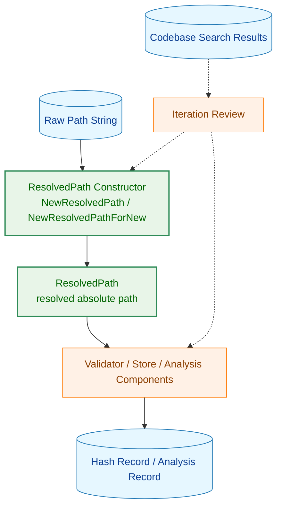
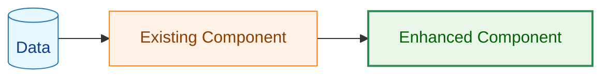
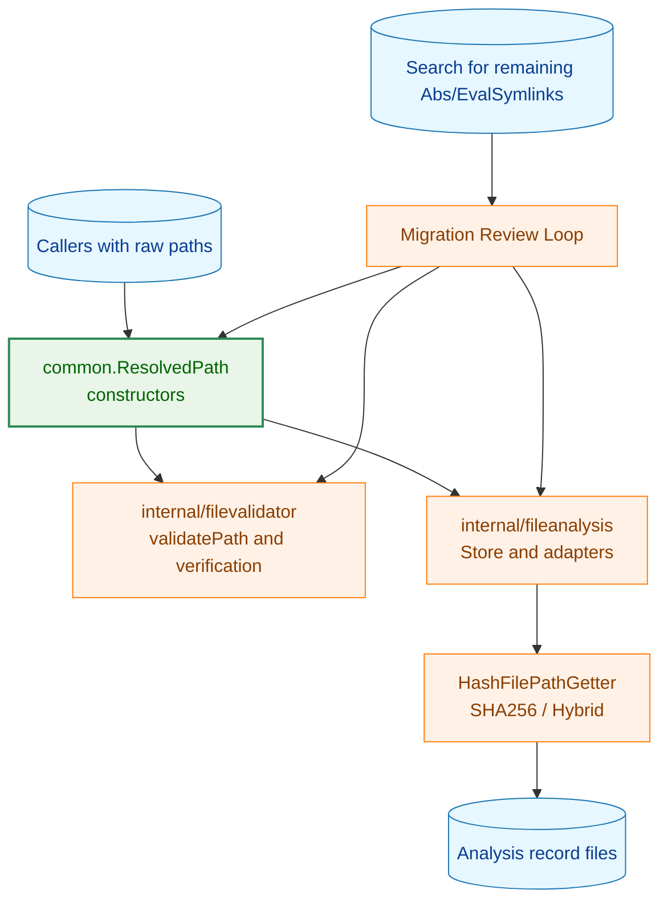
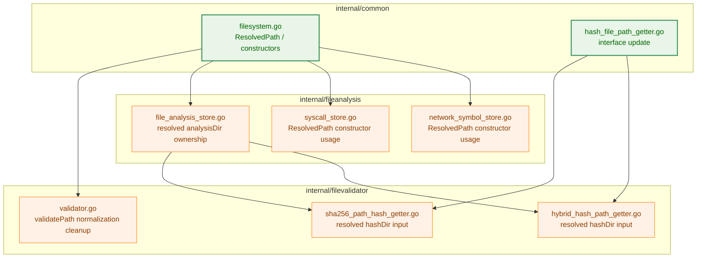
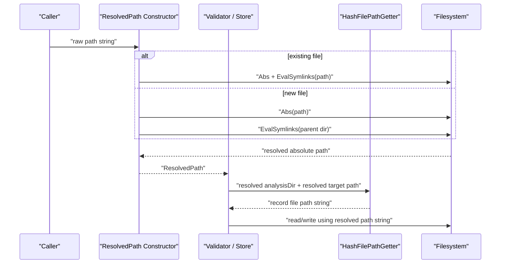
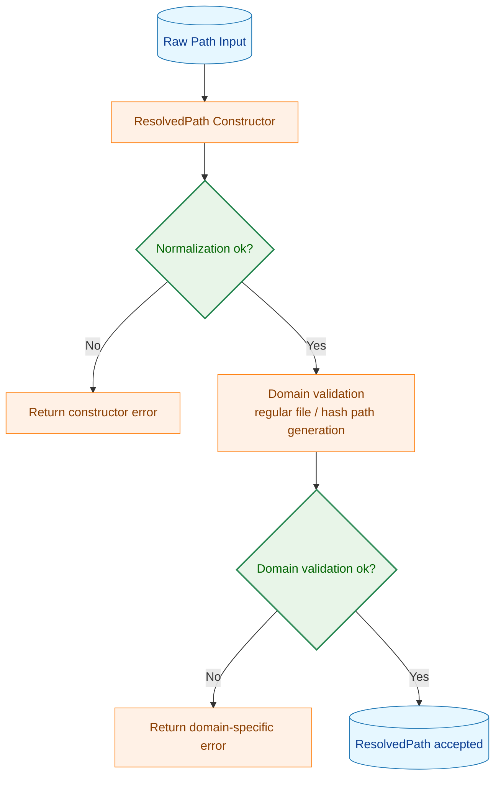
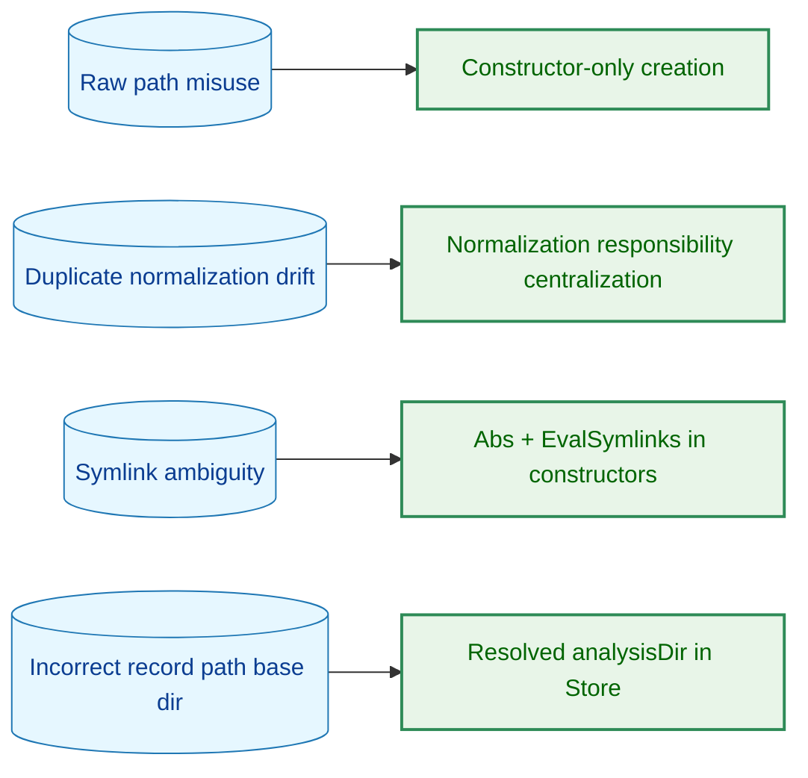
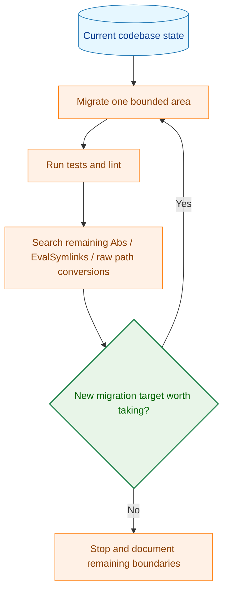

# アーキテクチャ設計書: ResolvedPath 型安全性強化

## 1. 設計の全体像

### 1.1 アーキテクチャ目標
- `ResolvedPath` を「絶対パスかつシンボリックリンク解決済み」を表す型として明確化する
- パス正規化の責務を `common` パッケージのコンストラクタへ集約する
- `filepath.Abs` / `filepath.EvalSymlinks` の重複実行を減らし、正規化経路を追跡しやすくする
- 既存ストレージ系コンポーネントの public API を大きく壊さずに移行する
- 一度の置換で終了せず、途中段階で再探索して移行対象の追加有無を判断できる構造にする

### 1.2 設計原則
- **型で保証**: `ResolvedPath` の生成はコンストラクタ経由に限定し、慣習依存を減らす
- **責務の集約**: 既存ファイルと新規ファイルの正規化ロジックは `NewResolvedPath` / `NewResolvedPathForNew` に集約する
- **重複排除**: 呼び出し側に残る `filepath.Abs` / `filepath.EvalSymlinks` / 再ラップを削減する
- **段階的移行**: コンパイルを維持しながら小さな単位で置換し、各段階で追加移行候補を再評価する
- **停止条件の明確化**: 追加の移行コストに対して安全性・保守性の改善が小さい場合は、その時点で打ち切れる判断基準を持つ

### 1.3 コンセプトモデル



**凡例（Legend）**



## 2. システム構成

### 2.1 全体アーキテクチャ



### 2.2 コンポーネント配置



### 2.3 データフロー



## 3. コンポーネント設計

### 3.1 データ構造

#### 3.1.1 ResolvedPath の責務

`ResolvedPath` は unexported フィールドを持つ struct とし、パッケージ外から任意文字列を直接代入できないようにする。

高レベル定義:

```go
type ResolvedPath struct {
    path string
}

func NewResolvedPath(path string) (ResolvedPath, error)
func NewResolvedPathForNew(path string) (ResolvedPath, error)
func (p ResolvedPath) String() string
```

#### 3.1.2 HashFilePathGetter の役割変更

ハッシュファイル格納先ディレクトリも `ResolvedPath` として受け取り、getter 実装が「解決済みディレクトリの配下にファイル名を組み立てる」責務だけを持つようにする。

```go
type HashFilePathGetter interface {
    GetHashFilePath(hashDir ResolvedPath, filePath ResolvedPath) (string, error)
}
```

### 3.2 コンストラクタ境界

#### 3.2.1 既存ファイル用コンストラクタ
- 入力: raw path string
- 出力: 実在ファイルを指す `ResolvedPath`
- 内部責務: empty 判定、絶対化、シンボリックリンク解決

#### 3.2.2 新規ファイル用コンストラクタ
- 入力: 新規作成予定ファイルの raw path string
- 出力: 親ディレクトリだけ解決済みの `ResolvedPath`
- 内部責務: empty 判定、絶対化、親ディレクトリ解決、ファイル名再結合

### 3.3 呼び出し側コンポーネントの責務分離

#### 3.3.1 `filevalidator.validatePath`
- `ResolvedPath` 生成前の `filepath.Abs` / `filepath.EvalSymlinks` を持たない
- ドメイン責務として regular file 判定のみを維持する
- 戻り値は必ず `ResolvedPath` とする

#### 3.3.2 `fileanalysis.Store`
- `analysisDir` を `ResolvedPath` として保持する
- record path の文字列組み立ては行うが、再解決はしない
- Load と Save 系で既存ファイル用 / 新規ファイル用の境界を意識できる構造にする

#### 3.3.3 syscall / network symbol store アダプタ
- 受け取る文字列パスは境界で `NewResolvedPath` に渡す
- 呼び出し元が事前解決していても、それを前提にしない
- 追加の `filepath.Abs` / `filepath.EvalSymlinks` は導入しない

## 4. エラーハンドリング設計

### 4.1 エラー方針
- 空文字列入力は `ErrEmptyPath` を返す
- 既存ファイル用コンストラクタでは、ファイル不存在やシンボリックリンク解決失敗をそのまま返す
- 新規ファイル用コンストラクタでは、親ディレクトリ不存在や解決失敗を返す
- 呼び出し側は path normalization 自体の失敗とドメイン検証失敗を分離して扱う

### 4.2 エラー伝播パターン



## 5. セキュリティ考慮事項

### 5.1 セキュリティ設計
- ハッシュ記録・検証で使うパスは、`ResolvedPath` により「解決済みであること」を型境界で明示する
- 新規ファイル用では親ディレクトリだけを解決し、未存在ファイルに `EvalSymlinks` できない問題を回避する
- 既存の `safefileio` による実 I/O 保護は維持し、今回のタスクでは責務を侵食しない

### 5.2 脅威モデル



## 6. 処理フロー詳細

### 6.1 反復移行サイクル

今回の作業は「要件、詳細仕様、実装」を一方向に進めるのではなく、途中で実コードを見直して追加移行候補を発見できる前提で進める。設計上は以下のサイクルを標準とする。



### 6.2 停止判断の基準
- 次の移行候補が security-critical path か
- `ResolvedPath` 導入で責務境界が明確になるか
- 変更範囲に対してテスト更新コストが過大でないか
- 上位インターフェース改変を伴い、今回の対象外に踏み込まないか

停止時は「未移行だが意図的に残した箇所」を明文化し、次タスクに分離できる状態にする。

## 7. テスト戦略

### 7.1 単体テスト
- `ResolvedPath` コンストラクタの empty path、相対パス、シンボリックリンク、非存在パスを検証する
- `NewResolvedPathForNew` の親ディレクトリ解決を検証する
- `HashFilePathGetter` のシグネチャ変更後も生成パスが安定することを検証する

### 7.2 統合テスト
- `filevalidator.validatePath` から重複正規化が除去されても検証結果が変わらないことを確認する
- `fileanalysis.Store` が symlink を含む `analysisDir` を解決済みで保持できることを確認する
- syscall / network symbol store が raw string 入力から安全に `ResolvedPath` 化できることを確認する

### 7.3 探索的レビュー
- 各実装フェーズ後に `rg` で `filepath.Abs` / `filepath.EvalSymlinks` / `common.NewResolvedPath(` を再検索する
- 検索結果を「妥当な境界」「要移行」「対象外」に分類し、次サイクルの対象を決める

## 8. 実装の優先順位

### Phase 1: 型境界の導入
- `ResolvedPath` の struct 化
- `NewResolvedPath` / `NewResolvedPathForNew` の整備
- `common` テストの更新

### Phase 2: ストレージ経路の移行
- `fileanalysis.Store` の `analysisDir` を `ResolvedPath` 化
- `HashFilePathGetter` と実装群の更新
- 既存 record path 生成経路の整合確認

### Phase 3: 呼び出し側の正規化削減
- `filevalidator.validatePath` の正規化一元化
- syscall / network symbol store の責務再確認
- 冗長な `Abs` / `EvalSymlinks` の削除

### Phase 4: 再探索と停止判断
- 残存箇所の検索
- 追加移行候補の価値判定
- 今回のスコープで止めるか、追加対応するかを決定

## 9. 将来の拡張性

### 9.1 想定される次段階
- `safefileio` 系 API へ `ResolvedPath` を伝搬する
- 解析系コンポーネントの public interface でも `ResolvedPath` を使う
- `ResolvedPath` と raw path の境界を静的解析でチェックする

### 9.2 設計上の拡張余地
- `ResolvedPath` のコンストラクタを境界にしたことで、将来メタデータ付与や監査ログ追加がしやすい
- 反復サイクル前提の設計により、今回対象外にした箇所を次タスクへ安全に切り出せる
