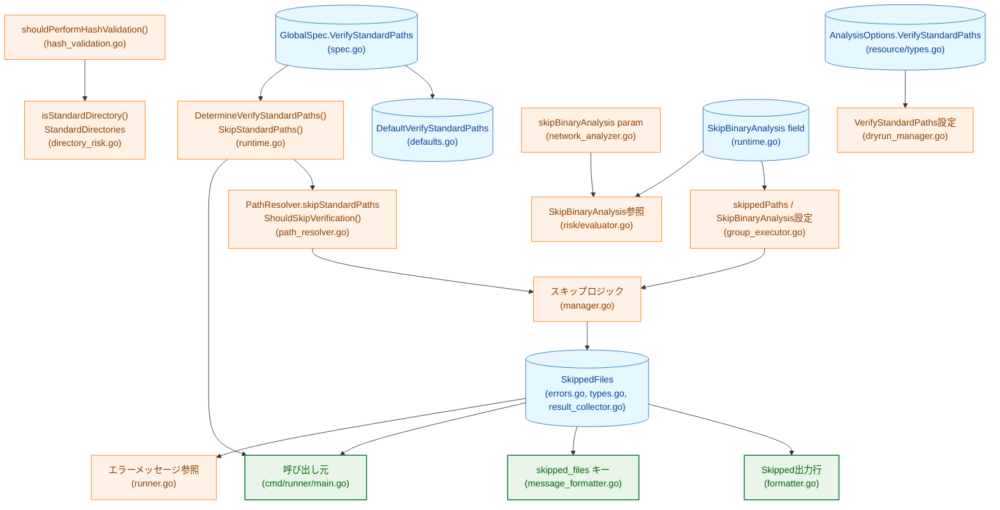
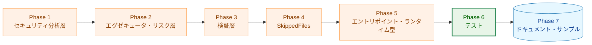

# 実装計画書: verify_standard_paths 機能の完全削除

## 1. 実装概要

### 1.1 実装目標

- `verify_standard_paths` 設定およびそれに関連するすべてのコード・テスト・ドキュメントを完全削除する
- 削除後、ハッシュ検証が常に全ファイルに対して実行される状態に統一する
- 削除完了後に `make build`・`make test`・`make lint` がすべて成功すること

### 1.2 実装スコープ

- **削除対象**: 20 個のソースファイル（変更）、対応するテストファイル（変更）
- **ドキュメント更新**: `docs/user/` 配下 12 ファイル、`docs/dev/` 配下 4 ファイル、`CHANGELOG.md`
- **サンプル更新**: `sample/` 配下 14 ファイル

### 1.3 削除対象の依存関係概要



**凡例（Legend）**


## 2. 実装フェーズ計画

削除は「呼び出し元 → 宣言元」の順で進め、各フェーズ完了時点でコードがコンパイル可能な状態を維持する。

### 2.1 Phase 1: セキュリティ分析層の削除

**目標**: `AnalysisOptions.VerifyStandardPaths`・`shouldPerformHashValidation()`・`isStandardDirectory()`・`StandardDirectories`・`IsNetworkOperation` の `skipBinaryAnalysis` パラメータを削除する

#### 対象ファイル

```
internal/runner/security/command_analysis.go
internal/runner/security/hash_validation.go
internal/runner/security/directory_risk.go
internal/runner/security/network_analyzer.go
internal/runner/resource/dryrun_manager.go
internal/runner/risk/evaluator.go
```

#### 実装内容

- `AnalysisOptions` 構造体から `VerifyStandardPaths bool` フィールドおよびそのコメントを削除（FR-3.6.1）
- `hash_validation.go` の `shouldPerformHashValidation()` 呼び出しと条件分岐を削除し、`validateFileHash()` を常に呼び出すよう変更（FR-3.6.2）
- `directory_risk.go` の `StandardDirectories` 変数と `isStandardDirectory()` 関数を削除（FR-3.6.2）
- `network_analyzer.go` の `IsNetworkOperation` から `skipBinaryAnalysis bool` パラメータ・関連コメント・条件分岐を削除し、バイナリ解析を常に実行（FR-3.6.5）
- `risk/evaluator.go` の `IsNetworkOperation` 呼び出しから `skipBinaryAnalysis` 引数を削除（FR-3.5.1、シグネチャ変更に対応）
- `resource/dryrun_manager.go` から `AnalysisOptions` への `VerifyStandardPaths` 設定を削除（FR-3.6.3）

#### 完了条件

- [ ] `AnalysisOptions` に `VerifyStandardPaths` フィールドが存在しないこと
- [ ] `shouldPerformHashValidation()` が存在しないこと
- [ ] `isStandardDirectory()` と `StandardDirectories` が存在しないこと
- [ ] `IsNetworkOperation` から `skipBinaryAnalysis` パラメータが削除されていること
- [ ] `risk/evaluator.go` の `IsNetworkOperation` 呼び出しが新しいシグネチャに対応していること
- [ ] `make build` が成功すること

### 2.2 Phase 2: エグゼキュータ層とリスク評価層の削除

**目標**: `group_executor.go` の `skippedPaths`・`SkipBinaryAnalysis` 設定と、`risk/evaluator.go` の `SkipBinaryAnalysis` 参照を削除する

#### 対象ファイル

```
internal/runner/group_executor.go
internal/runner/risk/evaluator.go
```

#### 実装内容

- `group_executor.go` から `skippedPaths` マップの構築ループおよび `cmd.SkipBinaryAnalysis = true` の設定を削除（FR-3.4.1）
- `risk/evaluator.go` から `cmd.SkipBinaryAnalysis` を参照するコメントおよび条件分岐を削除（FR-3.5.1）

#### 完了条件

- [ ] `group_executor.go` に `skippedPaths` マップが存在しないこと
- [ ] `group_executor.go` に `cmd.SkipBinaryAnalysis = true` の設定が存在しないこと
- [ ] `risk/evaluator.go` に `cmd.SkipBinaryAnalysis` を参照するコードが存在しないこと
- [ ] `make build` が成功すること

### 2.3 Phase 3: 検証層（PathResolver・Manager）の削除

**目標**: `PathResolver` のスキップ関連フィールドとメソッド、および `manager.go` のスキップロジックを削除する

#### 対象ファイル

```
internal/verification/path_resolver.go
internal/verification/manager.go
```

#### 実装内容

- `path_resolver.go` から `skipStandardPaths bool`・`standardPaths []string` フィールドを削除（FR-3.2.1）
- `NewPathResolver` の `skipStandardPaths bool` パラメータを削除し、コンストラクタ内の初期化処理を削除（FR-3.2.1）
- `ShouldSkipVerification()` メソッドを削除（FR-3.2.1）
- `manager.go` から `m.pathResolver.skipStandardPaths = runtimeGlobal.SkipStandardPaths()` の設定を削除（FR-3.3.1）
- `VerifyGlobalFiles` および `VerifyGroupFiles` 内の `ShouldSkipVerification` チェック・スキップ処理（`SkippedFiles` への追加、ログ出力、`continue` 文）を削除（FR-3.3.1）

#### 完了条件

- [ ] `PathResolver` に `skipStandardPaths`・`standardPaths` フィールドが存在しないこと
- [ ] `ShouldSkipVerification()` メソッドが存在しないこと
- [ ] `NewPathResolver` の引数が `skipStandardPaths` パラメータなしになっていること
- [ ] `manager.go` にスキップロジックが存在しないこと
- [ ] `make build` が成功すること

### 2.4 Phase 4: SkippedFiles の完全削除

**目標**: `SkippedFiles` に関連するすべての型・フィールド・メソッド・出力を削除する

#### 対象ファイル

```
internal/verification/errors.go
internal/verification/types.go
internal/verification/result_collector.go
internal/verification/manager.go
internal/runner/resource/formatter.go
internal/logging/message_formatter.go
cmd/runner/main.go
internal/runner/runner.go
```

#### 実装内容

- `errors.go` から `GlobalVerificationError.SkippedFiles int` および `Result.SkippedFiles []string` フィールドを削除（FR-3.7.1）
- `types.go` から `FileVerificationSummary.SkippedFiles int` フィールドを削除（FR-3.7.2）
- `result_collector.go` から `skippedFiles int` フィールド・`RecordSkip()` メソッド・`GetSummary()` 内の `SkippedFiles` 設定を削除（FR-3.7.3）
- `manager.go` から `Result` 初期化時の `SkippedFiles` 設定および `Error` 構築時の `SkippedFiles` 設定を削除し、Phase 3 後に残る参照を解消する（FR-3.7.1, FR-3.7.2）
- `formatter.go` から `"  Skipped: %d\n"` の出力行を削除（FR-3.7.4）
- `message_formatter.go` の `skipKeys` スライスリテラルから `"skipped_files"` エントリを削除（FR-3.7.5）
- `cmd/runner/main.go` から `SkippedFiles` を参照するログ出力を削除（FR-3.10.1）
- `runner.go` から `verErr.SkippedFiles` を参照するエラーメッセージ内の `Skipped` フィールドを削除（FR-3.10.2）

#### 完了条件

- [ ] `SkippedFiles` フィールドへの参照がコードベースに存在しないこと
- [ ] `RecordSkip()` メソッドが存在しないこと
- [ ] dry-run サマリー出力に `Skipped:` 行が出力されないこと
- [ ] `make build` が成功すること

### 2.5 Phase 5: エントリポイントとランタイム型の削除

**目標**: エントリポイント（`cmd/runner/main.go`、`runner.go`）の参照を削除し、ランタイム型・設定の宣言（`spec.go`、`defaults.go`、`runtime.go`）を削除する

#### 対象ファイル

```
cmd/runner/main.go
internal/runner/runnertypes/spec.go
internal/runner/config/defaults.go
internal/runner/runnertypes/runtime.go
internal/runner/resource/types.go
```

#### 実装内容

- `cmd/runner/main.go` から `DryRunOptions.VerifyStandardPaths` フィールドの設定および `DetermineVerifyStandardPaths()` 呼び出しを削除（FR-3.10.1）
- `spec.go` から `VerifyStandardPaths *bool` フィールドを削除（FR-3.1.1）
- `defaults.go` から `DefaultVerifyStandardPaths = true` 定数および `ApplyGlobalDefaults` 内の `VerifyStandardPaths` 設定ブロックを削除（FR-3.1.2）
- `runtime.go` から `DetermineVerifyStandardPaths()` 関数・`RuntimeGlobal.SkipStandardPaths()` メソッド・`RuntimeCommand.SkipBinaryAnalysis bool` フィールドを削除（FR-3.1.3, FR-3.1.4）
- `resource/types.go` から `DryRunOptions.VerifyStandardPaths bool` フィールドを削除（FR-3.6.4）

#### 完了条件

- [ ] `GlobalSpec` に `VerifyStandardPaths` フィールドが存在しないこと
- [ ] `DefaultVerifyStandardPaths` 定数が存在しないこと
- [ ] `DetermineVerifyStandardPaths()` が存在しないこと
- [ ] `RuntimeGlobal.SkipStandardPaths()` が存在しないこと
- [ ] `RuntimeCommand.SkipBinaryAnalysis` フィールドが存在しないこと
- [ ] `DryRunOptions` に `VerifyStandardPaths` フィールドが存在しないこと
- [ ] `make build` が成功すること
- [ ] `make test` がすべてパスすること（テスト削除前の暫定確認）

### 2.6 Phase 6: テストの削除・更新

**目標**: 削除されたコードを参照するすべてのテストケースを削除または更新する

#### 対象ファイル

```
internal/runner/runnertypes/spec_test.go
internal/runner/runnertypes/runtime_test.go
internal/runner/security/command_analysis_test.go
internal/runner/security/hash_validation_test.go
internal/runner/security/directory_risk_test.go
internal/verification/result_collector_test.go
internal/verification/errors_test.go
internal/verification/path_resolver_test.go
internal/verification/manager_test.go
internal/logging/message_formatter_test.go
internal/runner/resource/formatter_test.go
internal/runner/resource/security_test.go
internal/runner/group_executor_test.go
internal/runner/config/defaults_test.go
internal/runner/config/loader_defaults_test.go
cmd/runner/integration_security_test.go
cmd/runner/integration_dryrun_sensitive_test.go
cmd/runner/integration_workdir_test.go
```

#### 実装内容

- `spec_test.go`: `VerifyStandardPaths` を参照するテストケースを削除
- `runtime_test.go`: `SkipStandardPaths()`・`DetermineVerifyStandardPaths()` のテストを削除
- `command_analysis_test.go`: `VerifyStandardPaths` を参照するテストケースを削除
- `hash_validation_test.go`: `shouldPerformHashValidation()` のテストを削除
- `directory_risk_test.go`: `isStandardDirectory()` を参照するテストケースを削除
- `result_collector_test.go`: `RecordSkip()`・`SkippedFiles` のテストを削除
- `errors_test.go`: `SkippedFiles` を参照するテストケースを削除
- `path_resolver_test.go`: `ShouldSkipVerification()` および `skipStandardPaths` を参照するテストケースを削除
- `manager_test.go`: `TestShouldSkipVerification` を削除
- `message_formatter_test.go`: `shouldSkipInteractiveAttr()` の期待値から `skipped_files` を削除
- `formatter_test.go`: `Skipped:` 出力・`SkippedFiles` を参照するテストケースを削除
- `security_test.go`: `VerifyStandardPaths: true` を参照するテストケースを削除
- `group_executor_test.go`: `SkipBinaryAnalysis` を参照するテストケースを削除
- `defaults_test.go`・`loader_defaults_test.go`: `VerifyStandardPaths`・`DefaultVerifyStandardPaths` を参照するテストケースを削除し、`verify_standard_paths` を含む設定が unknown field として失敗することを検証する
- `command_analysis_test.go` または `integration_security_test.go`: 標準ディレクトリのコマンドでもハッシュ検証が常に実行されることを確認する回帰テストを追加または既存テストを更新する
- `integration_security_test.go`: `verify_standard_paths = false`・`VerifyStandardPaths: false` を参照するテストケースを削除し、`verify_standard_paths` を含む設定が拒否されることを確認する
- `integration_dryrun_sensitive_test.go`・`integration_workdir_test.go`: `DetermineVerifyStandardPaths` を参照するテストケースを削除

#### 完了条件

- [ ] `make test` がすべてパスすること
- [ ] `verify_standard_paths` を含む TOML が unknown field として失敗するテストがパスすること
- [ ] 標準ディレクトリのコマンドに対するハッシュ検証が常に実行される回帰テストがパスすること
- [ ] `make lint` がエラーなく完了すること

### 2.7 Phase 7: ドキュメントとサンプルの更新

**目標**: ユーザードキュメント・開発者ドキュメント・サンプルファイル・CHANGELOG を更新する

#### 対象ファイル（ドキュメント）

```
docs/user/toml_config/04_global_level.md（および .ja.md）
docs/user/toml_config/README.md（および .ja.md）
docs/user/runner_command.md（および .ja.md）
docs/user/toml_config/09_practical_examples.md（および .ja.md）
docs/user/toml_config/10_best_practices.md（および .ja.md）
docs/user/toml_config/11_troubleshooting.md（および .ja.md）
docs/user/toml_config/appendix.md（および .ja.md）
docs/user/dry_run_json_schema.md（および .ja.md）
docs/dev/security-architecture.md（および .ja.md）
docs/dev/config-inheritance-behavior.md（および .ja.md）
docs/translation_glossary.md
CHANGELOG.md
```

#### 対象ファイル（サンプル）

```
sample/starter.toml
sample/comprehensive.toml
sample/variable_expansion_basic.toml
sample/variable_expansion_advanced.toml
sample/variable_expansion_security.toml
sample/variable_expansion_test.toml
sample/auto_env_test.toml
sample/auto_env_group.toml
sample/slack-notify.toml
sample/slack-group-notification-test.toml
sample/risk-based-control.toml
sample/output_capture_basic.toml
sample/output_capture_too_large_error.toml
sample/workdir_examples.toml
```

#### 実装内容

- `04_global_level.md`（日英）: `verify_standard_paths` フィールドの説明を削除（FR-3.8.1）
- `README.md`・`runner_command.md`・`09〜11_*.md`・`appendix.md`（日英）: `verify_standard_paths`/`skip_standard_paths` への言及を削除（FR-3.8.2）
- `dry_run_json_schema.md`（日英）: `skipped_files` フィールドの行を削除（FR-3.8.3）
- `security-architecture.md`（日英）: `PathResolver` 構造体の `skipStandardPaths` フィールドを示すコードスニペットを削除（FR-3.8.5）
- `config-inheritance-behavior.md`（日英）: `skip_standard_paths` の行を削除（FR-3.8.5）
- `translation_glossary.md`: `標準パス検証 / verify_standard_paths` の行を削除（FR-3.8.5）
- `CHANGELOG.md`: Breaking Changes として `verify_standard_paths` 機能の完全削除を追記（FR-3.8.4）
  - 削除されたフィールド・メソッド・パラメータの一覧
  - `skipped_files` 出力の削除
  - `verify_standard_paths` を TOML に記述するとパースエラーになる旨
- `sample/*.toml`（14 ファイル）: `verify_standard_paths = false` の行を削除（FR-3.9.1）

#### 完了条件

- [ ] `docs/user/` 配下に `verify_standard_paths` への言及が存在しないこと
- [ ] `docs/user/dry_run_json_schema.md`（日英）から `skipped_files` の説明が削除されていること
- [ ] `docs/dev/security-architecture.md`（日英）から `skipStandardPaths` フィールドを含むコードスニペットが削除されていること
- [ ] `docs/dev/config-inheritance-behavior.md`（日英）から `skip_standard_paths` の行が削除されていること
- [ ] `docs/translation_glossary.md` から `verify_standard_paths` の行が削除されていること
- [ ] `sample/` 配下に `verify_standard_paths` の記述が存在しないこと
- [ ] `CHANGELOG.md` に Breaking Changes エントリが追加されていること

## 3. フェーズ間の依存関係



**凡例（Legend）**


各フェーズ完了時点で `make build` が成功することを確認してから次フェーズへ進む。Phase 6 完了時点で `make test` および `make lint` がすべて成功することを確認する。

## 4. 実装チェックリスト

### Phase 1: セキュリティ分析層

- [ ] `AnalysisOptions.VerifyStandardPaths` フィールドを削除（command_analysis.go）
- [ ] `shouldPerformHashValidation()` を削除し `validateFileHash()` を常に呼び出すよう変更（hash_validation.go）
- [ ] `StandardDirectories` 変数を削除（directory_risk.go）
- [ ] `isStandardDirectory()` 関数を削除（directory_risk.go）
- [ ] `IsNetworkOperation` の `skipBinaryAnalysis` パラメータ・コメント・条件分岐を削除（network_analyzer.go）
- [ ] `IsNetworkOperation` 呼び出しから `skipBinaryAnalysis` 引数を削除（risk/evaluator.go）
- [ ] `AnalysisOptions` への `VerifyStandardPaths` 設定を削除（resource/dryrun_manager.go）

### Phase 2: エグゼキュータ・リスク層

- [ ] `skippedPaths` マップの構築ループを削除（group_executor.go）
- [ ] `cmd.SkipBinaryAnalysis = true` の設定を削除（group_executor.go）
- [ ] `SkipBinaryAnalysis` 参照コメントおよび条件分岐を削除（risk/evaluator.go）

### Phase 3: 検証層

- [ ] `skipStandardPaths bool` フィールドを削除（path_resolver.go）
- [ ] `standardPaths []string` フィールドを削除（path_resolver.go）
- [ ] `NewPathResolver` の `skipStandardPaths bool` パラメータを削除（path_resolver.go）
- [ ] コンストラクタ内の `skipStandardPaths`・`standardPaths` 初期化を削除（path_resolver.go）
- [ ] `ShouldSkipVerification()` メソッドを削除（path_resolver.go）
- [ ] `m.pathResolver.skipStandardPaths = runtimeGlobal.SkipStandardPaths()` を削除（manager.go）
- [ ] `VerifyGlobalFiles` 内のスキップ処理を削除（manager.go）
- [ ] `VerifyGroupFiles` 内のスキップ処理を削除（manager.go）

### Phase 4: SkippedFiles

- [ ] `GlobalVerificationError.SkippedFiles int` フィールドを削除（errors.go）
- [ ] `Result.SkippedFiles []string` フィールドを削除（errors.go）
- [ ] `FileVerificationSummary.SkippedFiles int` フィールドを削除（types.go）
- [ ] `skippedFiles int` フィールドを削除（result_collector.go）
- [ ] `RecordSkip()` メソッドを削除（result_collector.go）
- [ ] `GetSummary()` 内の `SkippedFiles` 設定を削除（result_collector.go）
- [ ] `Result` 初期化時の `SkippedFiles` 設定を削除（manager.go）
- [ ] `Error` 構築時の `SkippedFiles` 設定を削除（manager.go）
- [ ] `"  Skipped: %d\n"` 出力行を削除（formatter.go）
- [ ] `skipKeys` の `"skipped_files"` エントリを削除（message_formatter.go）
- [ ] `SkippedFiles` を参照するログ出力を削除（cmd/runner/main.go）
- [ ] `verErr.SkippedFiles` 参照を削除（runner.go）

### Phase 5: エントリポイント・ランタイム型

- [ ] `DryRunOptions.VerifyStandardPaths` 設定と `DetermineVerifyStandardPaths()` 呼び出しを削除（cmd/runner/main.go）
- [ ] `VerifyStandardPaths *bool` フィールドを削除（spec.go）
- [ ] `DefaultVerifyStandardPaths` 定数を削除（defaults.go）
- [ ] `ApplyGlobalDefaults` 内の `VerifyStandardPaths` 設定ブロックを削除（defaults.go）
- [ ] `DetermineVerifyStandardPaths()` 関数を削除（runtime.go）
- [ ] `RuntimeGlobal.SkipStandardPaths()` メソッドを削除（runtime.go）
- [ ] `RuntimeCommand.SkipBinaryAnalysis bool` フィールドを削除（runtime.go）
- [ ] `DryRunOptions.VerifyStandardPaths bool` フィールドを削除（resource/types.go）

### Phase 6: テスト

- [ ] `VerifyStandardPaths` を参照するテストケースを削除（spec_test.go）
- [ ] `SkipStandardPaths()`・`DetermineVerifyStandardPaths()` のテストを削除（runtime_test.go）
- [ ] `VerifyStandardPaths` を参照するテストケースを削除（command_analysis_test.go）
- [ ] `shouldPerformHashValidation()` のテストを削除（hash_validation_test.go）
- [ ] `isStandardDirectory()` を参照するテストケースを削除（directory_risk_test.go）
- [ ] `RecordSkip()`・`SkippedFiles` のテストを削除（result_collector_test.go）
- [ ] `SkippedFiles` を参照するテストケースを削除（errors_test.go）
- [ ] `ShouldSkipVerification()` および `skipStandardPaths` を参照するテストケースを削除（path_resolver_test.go）
- [ ] `TestShouldSkipVerification` を削除（manager_test.go）
- [ ] `shouldSkipInteractiveAttr()` の期待値から `skipped_files` を削除（message_formatter_test.go）
- [ ] `Skipped:`・`SkippedFiles` を参照するテストケースを削除（formatter_test.go）
- [ ] `VerifyStandardPaths: true` を参照するテストケースを削除（security_test.go）
- [ ] `SkipBinaryAnalysis` を参照するテストケースを削除（group_executor_test.go）
- [ ] `VerifyStandardPaths`・`DefaultVerifyStandardPaths` を参照するテストケースを削除（defaults_test.go・loader_defaults_test.go）
- [ ] `verify_standard_paths` を含む設定が unknown field として失敗するテストを追加または更新（loader_defaults_test.go または integration_security_test.go）
- [ ] 標準ディレクトリのコマンドでもハッシュ検証が実行される回帰テストを追加または更新（command_analysis_test.go または integration_security_test.go）
- [ ] `verify_standard_paths`・`VerifyStandardPaths: false` を参照するテストケースを削除（integration_security_test.go）
- [ ] `DetermineVerifyStandardPaths` を参照するテストケースを削除（integration_dryrun_sensitive_test.go・integration_workdir_test.go）

### Phase 7: ドキュメント・サンプル

- [ ] `04_global_level.md`（日英）: `verify_standard_paths` の説明を削除
- [ ] `README.md`（日英）: `verify_standard_paths` への言及を削除
- [ ] `runner_command.md`（日英）: `verify_standard_paths` への言及を削除
- [ ] `09_practical_examples.md`（日英）: `verify_standard_paths` への言及を削除
- [ ] `10_best_practices.md`（日英）: `verify_standard_paths` への言及を削除
- [ ] `11_troubleshooting.md`（日英）: `verify_standard_paths` への言及を削除
- [ ] `appendix.md`（日英）: `verify_standard_paths` への言及を削除
- [ ] `dry_run_json_schema.md`（日英）: `skipped_files` フィールドの行を削除
- [ ] `security-architecture.md`（日英）: `skipStandardPaths` フィールドを含むコードスニペットを削除
- [ ] `config-inheritance-behavior.md`（日英）: `skip_standard_paths` の行を削除
- [ ] `translation_glossary.md`: `verify_standard_paths` の行を削除
- [ ] `CHANGELOG.md`: Breaking Changes エントリを追加
- [ ] `sample/` 配下 14 ファイル: `verify_standard_paths = false` の行を削除

## 5. 受け入れ基準との対応

| 受け入れ基準 | 対応フェーズ |
|------------|------------|
| AC-1: TOML 設定フィールドの削除 | Phase 5, 6 |
| AC-2: ランタイム型の削除 | Phase 5 |
| AC-3: PathResolver の削除 | Phase 3 |
| AC-4: ハッシュ検証が常に実行されること | Phase 1, 6 |
| AC-5: `SkipBinaryAnalysis` / `skipBinaryAnalysis` の削除 | Phase 1, 2, 5 |
| AC-6: `SkippedFiles` の削除 | Phase 3, 4 |
| AC-7: ドキュメントの更新 | Phase 7 |
| AC-8: ビルドとテストの成功 | Phase 6 完了時 |
| AC-9: `IsNetworkOperation` のシグネチャ変更 | Phase 1, 2 |
