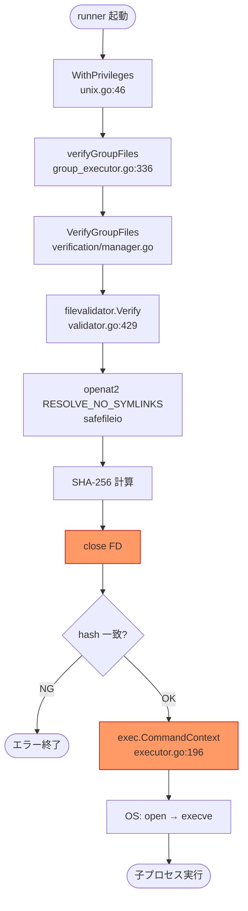

# 0090: TOCTOU 根本対策 — 現状分析

## 背景

[M2: バイナリ検証と exec の間の TOCTOU ウィンドウ](../0088_security_audit_findings/M2_toctou_verify_exec.md) の根本対策として `fexecve` / `execveat` を採用するための前段分析。

短期対策 (運用ドキュメント + ディレクトリパーミッション検査) は [0089_security_audit_fixes](../0089_security_audit_fixes/01_requirements.md) で対応済み。

本ドキュメントの目的は **要件定義書を作成する前に**、現状の実装を詳細に分析し、再実装が必要な関数の範囲と実装コストを明確にすることである。

---

## 1. 現状の処理フロー



**TOCTOU ウィンドウ**: E3 (FD close) と H の OS open の間でファイルを rename 差し替え可能。

---

## 2. 関係するコードの所在

### 2.1 検証側

| ファイル | 役割 |
|---|---|
| [internal/filevalidator/validator.go:429-446](../../../internal/filevalidator/validator.go#L429-L446) | `Verify` — path → open → hash → close |
| [internal/filevalidator/validator.go:453-](../../../internal/filevalidator/validator.go#L453) | `VerifyWithHash` — `Verify` + hash 値を返す |
| [internal/safefileio/safe_file_linux.go](../../../internal/safefileio/safe_file_linux.go) | `openat2(RESOLVE_NO_SYMLINKS)` ラッパ |
| [internal/verification/manager.go:39](../../../internal/verification/manager.go#L39) | `VerifyAndReadConfigFile` — config 用の検証+読込 |
| [internal/runner/group_executor.go:344](../../../internal/runner/group_executor.go#L344) | `verifyGroupFiles` — `VerifyGroupFiles` の呼び出し元 |

### 2.2 実行側

| ファイル | 役割 |
|---|---|
| [internal/runner/executor/executor.go:185-](../../../internal/runner/executor/executor.go#L185) | `executeCommandWithPath` — `exec.CommandContext` 呼び出し元 |
| [internal/runner/executor/executor.go:196](../../../internal/runner/executor/executor.go#L196) | `exec.CommandContext(ctx, path, ...)` — 実際の exec |

---

## 3. `fexecve` / `execveat` による根本対策の概要

### 3.1 アプローチ

1. 検証時に `openat2(RESOLVE_NO_SYMLINKS)` で FD を取得し **閉じずに保持**
2. 同じ FD から SHA-256 を計算して検証
3. 検証成功後、同じ FD を `execveat(fd, "", argv, envp, AT_EMPTY_PATH)` に渡して exec

これにより「検証した inode と実行する inode が同一」であることがカーネルレベルで保証される。

### 3.2 Linux syscall

```
execveat(int dirfd, const char *pathname, char *const argv[], char *const envp[], int flags)
syscall番号 (x86_64): 322
syscall番号 (arm64): 281
AT_EMPTY_PATH フラグ: 0x1000  — pathname が空文字列の場合 dirfd を直接 exec
```

---

## 4. 再実装が必要な範囲の詳細分析

### 4.1 `os/exec` が提供する機能のうち再実装が必要なもの

`exec.CommandContext` は内部で以下を行う。`execveat` に移行する場合、これらを自前で実装または代替手段を用意する必要がある。

| 機能 | `os/exec` の実装 | 再実装方針 |
|---|---|---|
| `fork` + `execveat` | `os.StartProcess` 経由 → 内部で `forkAndExecInChild` (Go ランタイム internal) が `execve` を呼ぶ | `syscall.ForkExec` / `syscall.Fork` + `syscall.Exec` はいずれも `execve` を発行するため **使用不可**。Go internal の `forkAndExecInChild` と同等のカスタム実装が必要: fork 後の子プロセス内で `syscall.RawSyscall6(SYS_EXECVEAT, ...)` を呼ぶ。fork〜exec 間は Go ランタイム (GC・goroutine スケジューラ) を使用できないため、メモリ確保を伴わない raw syscall のみで記述する必要がある |
| stdin/stdout/stderr リダイレクト | `exec.Cmd.Stdin/.Stdout/.Stderr` + pipe | `syscall.Pipe` で手動セットアップ |
| context キャンセル (SIGKILL) | `exec.Cmd` が goroutine で監視 | `os.Process.Kill` または `syscall.Kill` を goroutine で実行 |
| `Wait` / exit code 取得 | `exec.Cmd.Wait` | `syscall.Wait4` |
| `ExitError` / `ProcessState` | `exec.ExitError` | 同等の型を自作またはラップ |
| プロセスグループ管理 | `SysProcAttr.Setsid` 等 | `syscall.SysProcAttr` で継続可 |
| WaitDelay (タイムアウト猶予) | Go 1.20 以降 `exec.Cmd.WaitDelay` | 再実装コスト大 → 代替: SIGTERM→SIGKILL |

### 4.2 `filevalidator.Validator` の変更

現在の `Verify` / `VerifyWithHash` はファイルを open → 読込 → **close** して hash を返す。`fexecve` 対応には以下が必要:

```
// 新関数 (案)
func (v *Validator) VerifyAndRetainFD(filePath string) (fd uintptr, hash string, err error)
```

- `openat2` で FD を open し、hash を計算後、FD を **呼び出し元に返す**
- 呼び出し元は exec 完了後に FD を close する責務を持つ
- 既存の `Verify` / `VerifyWithHash` は内部で `VerifyAndRetainFD` を呼び close する形に変更可

**影響範囲:**
- `internal/filevalidator/validator.go` — 新関数追加
- `internal/filevalidator/filevalidator.go` (interface 定義) — interface 変更の要否を確認
- `internal/verification/manager.go` — `VerifyGroupFiles` の変更
- `internal/runner/group_executor.go` — FD 生存期間の管理
- `internal/runner/executor/executor.go` — `executeCommandWithPath` の置き換え

### 4.3 FD の生存期間管理

FD は検証完了から exec まで保持し続けなければならない。exec 失敗時・context キャンセル時のリークを防ぐため、`defer fd.Close()` パターンまたは専用の FD ホルダー型が必要。

### 4.4 マルチプラットフォーム対応

`execveat` は Linux 専用。macOS では `fexecve(3)` (libc 関数) が存在するが Go の `syscall` パッケージにはない。

| OS | 対応方針 |
|---|---|
| Linux (x86_64) | `SYS_EXECVEAT = 322` を直接 syscall |
| Linux (arm64) | `SYS_EXECVEAT = 281` を直接 syscall |
| macOS | ビルドタグ `!linux` で既存パスにフォールバック、または `cgo` 経由で `fexecve(3)` を呼ぶ |

現在のコードベースは `safefileio/safe_file_linux.go` / `safe_file_other.go` という Linux/非Linux 分割を既に採用しているため、同様のパターンで対応できる。

---

## 5. 実装コスト見積もり

### 5.1 コンポーネント別

| コンポーネント | 変更内容 | 難易度 | 工数感 |
|---|---|---|---|
| `filevalidator.Validator` | `VerifyAndRetainFD` 追加 | 低 | 小 |
| `verification/manager.go` | `VerifyGroupFiles` で FD を保持・返却 | 中 | 中 |
| `group_executor.go` | FD 生存期間管理 | 中 | 中 |
| `executor/executor.go` | `execveat` syscall 実装 + `os/exec` 代替 | 高 | 大 |
| stdin/stdout/stderr 再実装 | pipe + goroutine | 高 | 大 |
| context キャンセル対応 | goroutine + SIGTERM/SIGKILL | 中 | 中 |
| macOS フォールバック | ビルドタグ分岐 | 低-中 | 小-中 |
| テスト | 単体 + 統合 | 中 | 中-大 |

### 5.2 総合評価

- **高コスト・高リスク**: `os/exec` の再実装は Go のランタイムと密結合しており、fork/exec 周りは実装ミスがクリティカルなバグに直結する。特に `execveat` を呼ぶためには `syscall.ForkExec` は使えず、Go 標準ライブラリ internal の `forkAndExecInChild` に相当するカスタム実装が必要になる。この関数は fork 後〜exec 前の「unsafe window」(Go ランタイムが使用不可な区間) を raw syscall のみで記述しており、同等の制約を守った実装を自前で書く必要がある
- **緩和要因**: 現実的な運用環境 (root 所有ディレクトリ) では TOCTOU の実際のリスクは低く、短期対策 (0089) で実用上は十分
- **推奨**: 要件定義・設計に先立ち、PoC として `execveat` syscall 呼び出し単体の動作確認を行い、リスク評価を更新する

---

## 6. 次に行うべき作業

要件定義書の作成前に以下を実施する:

1. **詳細分析**: `os/exec` の内部実装 (`cmd/go/internal/execabs`, `os/exec/exec.go`) を精読し、再実装が必要な最小セットを確定する
2. **PoC 実装**: `syscall.Syscall6(SYS_EXECVEAT, fd, uintptr(unsafe.Pointer(&[]byte{0}[0])), uintptr(argv), uintptr(envp), AT_EMPTY_PATH, 0)` を呼ぶ最小プログラムで Linux 上の動作を確認する。第2引数 pathname は `AT_EMPTY_PATH` 使用時も NULL ポインタ (`0`) ではなく空文字列 (`""`) へのポインタを渡すこと (NULL では EFAULT または未定義動作になるカーネルがある)
3. **再実装スコープ確定**: PoC 結果をもとに、`os/exec` のどの機能を再実装するか・どの機能は捨てるかを決定する
4. **コスト再評価**: スコープ確定後に実装コストを再見積もりし、優先度・スケジュールを判断する
5. **設計書作成** (`01_requirements.md`, `02_architecture.md`): スコープ確定後に通常の要件定義プロセスへ移行する

---

## 7. Pros & Cons 分析と実装判断

### 7.1 前提

0089 の実装により、`verify_files` や `commands` で参照するバイナリのディレクトリおよびルートまでの全親ディレクトリに対して、再帰的なパーミッション検査が起動前に実施されるようになった。この検査が通過した場合、攻撃者はバイナリのあるディレクトリへの書き込み権限を持たないため、TOCTOU ウィンドウ内でのファイル差し替えは実質的に不可能である。

| | 0089 (実装済み) | 0090 (本タスク) |
|---|---|---|
| アプローチ | **事前条件の破壊**: 攻撃者がそもそも差し替えできないことをパーミッション検査で保証 | **ウィンドウの閉鎖**: 検証した FD を exec まで保持し、カーネルレベルで同一 inode を保証 |
| 依存するもの | 運用が正しくディレクトリを保護していること (設定依存) | カーネルの inode 同一性保証 (技術保証) |

### 7.2 実装する場合の利点 (Pros)

- **残留する設定依存リスクの排除**: 0089 はパーミッション検査ロジックの正確性に依存する。将来そのロジックにバグが入った場合や想定外の設定でチェックをすり抜けた場合、0090 がフォールバックとして機能する。
- **Defense in Depth の完成**: 「ディレクトリ保護」(0089) と「FD 保持 exec」(0090) の二重保護が揃うことで、セキュリティが設定に依存しない設計になる。
- **監査・コンプライアンス上の訴求力**: 「運用設定で緩和」より「カーネルレベルで排除」の方が外部監査への説明として明確に強い。
- **将来の設定ミスへの耐性**: インフラ変更やデプロイ環境の移行時に権限が誤って変更された場合でも、TOCTOU は成立しない。

### 7.3 実装しない場合の理由 (Cons)

- **実装コスト・リスクが高い割に限界的な改善**: 0089 が正しく動作している前提では残留リスクは「パーミッション検査ロジックにバグがある場合」に限定される。コストに対するリターンが小さい。
- **`os/exec` の再実装リスク**: `syscall.ForkExec` は内部で `execve` を発行するため使用不可。Go 標準ライブラリ internal の `forkAndExecInChild` 相当のカスタム実装が必要であり、fork〜exec 間の unsafe window (Go ランタイム使用不可な区間) を raw syscall のみで記述しなければならない。実装ミスはデッドロック・FD リーク・ゾンビプロセス等のクリティカルなバグに直結する。
- **Linux 専用化のコスト**: `execveat` は Linux 固有。macOS 対応にはビルドタグ分岐と 2 系統の実装・テストが必要。
- **保守コストの増大**: `os/exec` を使う現在のコードは Go の将来バージョンアップで自動的に改善を受けられるが、自前の fork/exec コードはランタイム変更への追随が必要になる。
- **テストの困難さ**: context キャンセル・タイムアウト・FD リークの境界ケースは単体テストでは担保しにくく、統合テストが必須になる。

### 7.4 判断: 現時点では実装しない

| 判断軸 | 評価 |
|---|---|
| 残留リスクの大きさ | 小 (0089 が機能している前提でほぼゼロ) |
| 実装コスト | 大 |
| 実装リスク (バグ導入) | 大 |
| 将来の保守コスト | 大 |
| 監査・設計上の完全性 | 向上する |

**現時点では実装しない。** 0089 の検査ロジックに実際のバグや抜け穴が発見された場合、または外部監査から根本対策の要求が出た場合に、PoC 実装フェーズへ移行する。

---

## 参考

- [M2 所見](../0088_security_audit_findings/M2_toctou_verify_exec.md)
- `man 2 execveat` — Linux execveat(2)
- `man 3 fexecve` — POSIX fexecve(3)
- [internal/safefileio/safe_file_linux.go](../../../internal/safefileio/safe_file_linux.go) — openat2 実装の参考
