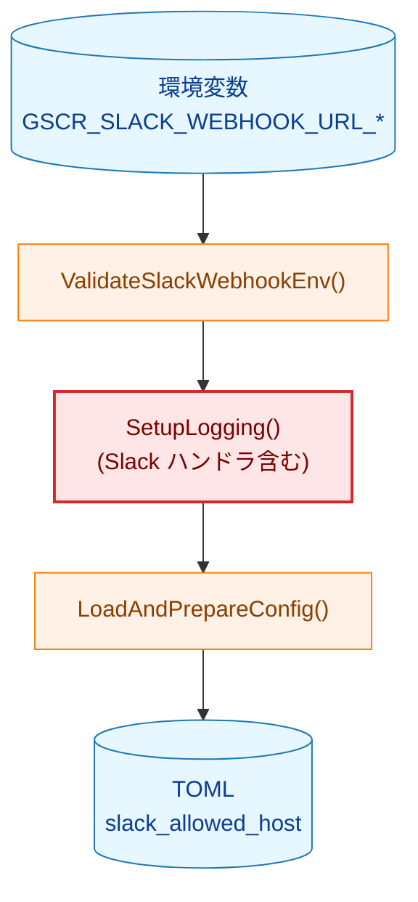
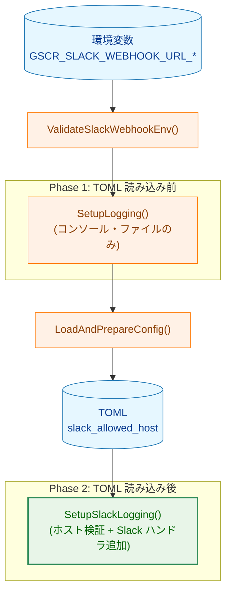
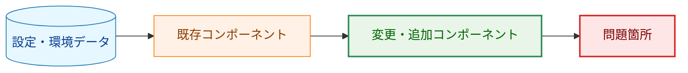
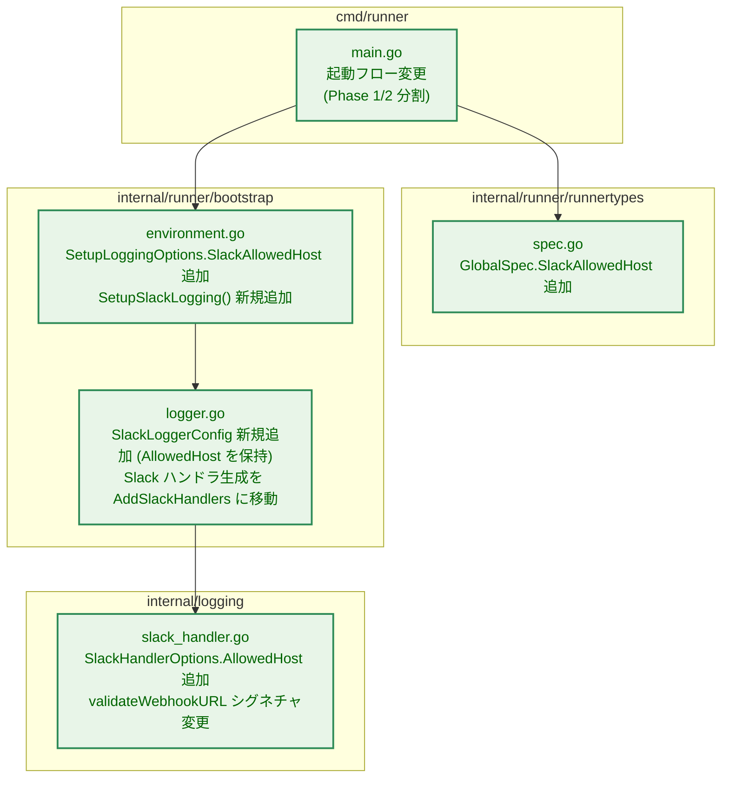
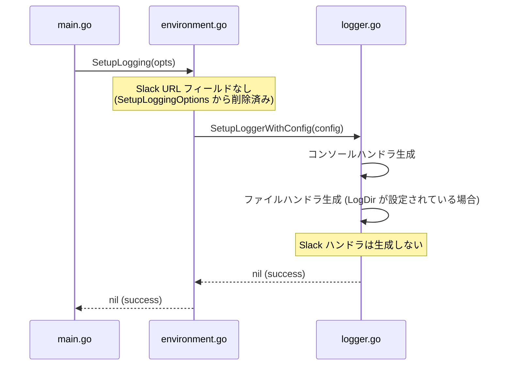
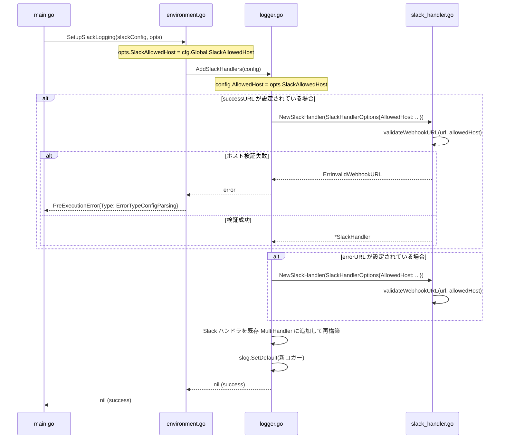
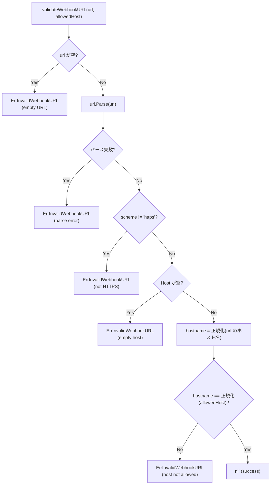
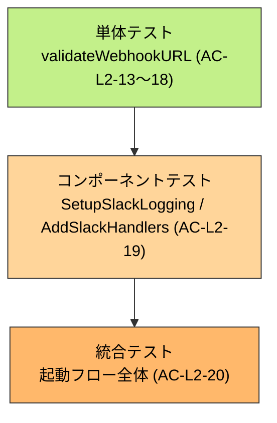

# アーキテクチャ設計書: Slack webhook URL ホスト allowlist

## 1. システム概要

### 1.1 アーキテクチャ目標

- SSRF・情報漏洩リスクの排除: 環境変数が改ざんされても任意ホストへの送信を防止する
- TOML によるポリシー管理: 許可ホストはハッシュ検証済み TOML で管理し、改ざんを検出可能にする
- 起動フローの整合性: TOML 読み込み後に Slack ハンドラを初期化し、許可ホストの確実な適用を保証する
- 既存検証の維持: 既存の HTTPS スキーム・ホスト名存在チェックを除去しない

### 1.2 設計原則

- **セキュリティファースト**: TOML 由来の許可ホストで URL を検証してから Slack ハンドラを生成する
- **最小変更**: 既存の起動フローの骨格を維持しつつ Slack 初期化のみを後段に移動する
- **明示的設定**: デフォルト許可ホストを持たず、利用者が TOML に明示した場合のみ Slack 通知を有効化する
- **単一ホスト**: 成功・エラー両 URL は同一ホストを使用することを前提とし、許可ホストは単一文字列で管理する

---

## 2. 起動フローの変更

### 2.1 現状の起動フロー (問題あり)



> 問題: Slack ハンドラ生成 (B) が TOML 読み込み (C→D) より前に実行されるため、許可ホストを参照できない。

### 2.2 変更後の起動フロー



**凡例（Legend）**



---

## 3. コンポーネント構成

### 3.1 変更対象パッケージ



### 3.2 許可ホスト伝播経路

```mermaid
flowchart LR
    classDef data fill:#e6f7ff,stroke:#1f77b4,stroke-width:1px,color:#0b3d91;
    classDef process fill:#fff1e6,stroke:#ff7f0e,stroke-width:1px,color:#8a3e00;

    A[("TOML<br>global.slack_allowed_host")] -->|"GlobalSpec<br>.SlackAllowedHost"| B["LoadAndPrepareConfig()"]
    B -->|"SetupLoggingOptions<br>.SlackAllowedHost"| C["SetupSlackLogging()"]
    C -->|"SlackLoggerConfig<br>.AllowedHost"| D["AddSlackHandlers()"]
    D -->|"SlackHandlerOptions<br>.AllowedHost"| E["NewSlackHandler()"]
    E -->|"allowedHost"| F["validateWebhookURL()"]

    class A data;
    class B,C,D,E,F process;
```



---

## 4. 詳細設計

### 4.1 Phase 1: `SetupLogging` の変更

`SetupLogging` はコンソールハンドラ・ファイルハンドラのみを初期化し、Slack ハンドラを生成しない。`SetupLoggingOptions` および `LoggerConfig` から `SlackWebhookURLSuccess/Error` フィールドを**削除**し、コンパイルレベルで Slack URL を受け付けなくする。



### 4.2 Phase 2: `SetupSlackLogging` の新規追加

TOML 読み込み後に呼び出す新関数。ホスト検証を実施してから Slack ハンドラを既存ロガーに追加する。



### 4.3 `validateWebhookURL` の変更



---

## 5. エラーハンドリング設計

### 5.1 エラー分類

| 状況 | エラー型 | `PreExecutionError.Type` |
|------|----------|--------------------------|
| Slack URL なし (`GSCR_SLACK_WEBHOOK_URL_*` 未設定) | — (エラーなし、サイレントに無効) | — |
| SUCCESS のみ設定、ERROR なし | `ErrSuccessWithoutError` | `ErrorTypeConfigParsing` (既存) |
| URL が HTTPS でない | `ErrInvalidWebhookURL` | `ErrorTypeConfigParsing` |
| URL のホストが許可ホストと不一致 | `ErrInvalidWebhookURL` | `ErrorTypeConfigParsing` |
| 許可ホストが未設定 かつ URL が設定されている | `ErrInvalidWebhookURL` | `ErrorTypeConfigParsing` |

### 5.2 エラーメッセージ例

```
Error: invalid webhook URL: host not allowed: evil.example.com (allowed: hooks.slack.com)
```

---

## 6. テスト戦略

### 6.1 テスト階層



### 6.2 各 AC とテスト対象の対応

| AC | テスト対象 | パッケージ |
|----|-----------|------------|
| AC-L2-13 | `validateWebhookURL` — 許可ホスト未設定 | `internal/logging` |
| AC-L2-14 | `validateWebhookURL` — ホスト不一致 | `internal/logging` |
| AC-L2-15 | `validateWebhookURL` — ホスト一致 | `internal/logging` |
| AC-L2-16 | `validateWebhookURL` — 大文字/小文字 | `internal/logging` |
| AC-L2-17 | `validateWebhookURL` — ポート番号付き URL | `internal/logging` |
| AC-L2-18 | `validateWebhookURL` — 既存 HTTPS/host チェック | `internal/logging` |
| AC-L2-19 | `SetupSlackLogging` — 許可ホスト伝播 | `internal/runner/bootstrap` |
| AC-L2-20 | 起動フロー — 許可ホスト未設定で起動失敗 | `internal/runner/bootstrap` |
