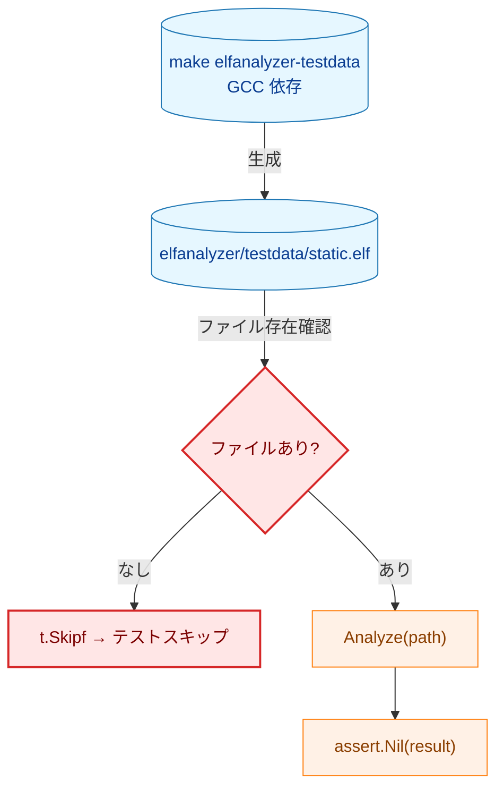
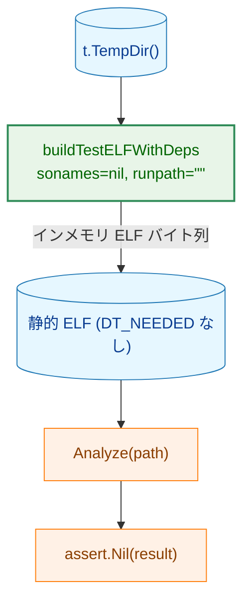
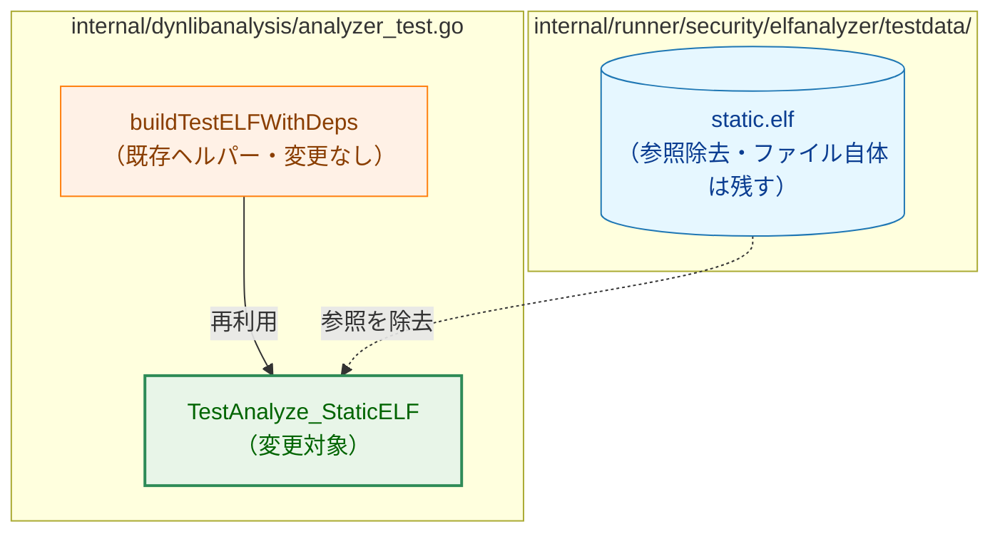
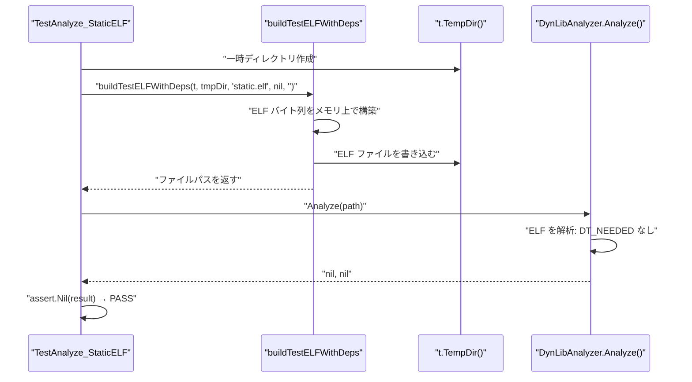

# アーキテクチャ設計書: TestAnalyze_StaticELF のインメモリ ELF 生成への移行

## 1. システム概要

### 1.1 アーキテクチャ目標

- 外部ファイル依存の解消
- 既存のインメモリ ELF ビルダー（`buildTestELFWithDeps`）の再利用
- テストの安定実行（GCC・`make` 不要）

### 1.2 設計原則

- **既存活用**: 同テストファイル内に存在する `buildTestELFWithDeps` ヘルパーを再利用する
- **YAGNI**: 新たなヘルパー関数は追加しない。`buildTestELFWithDeps` に `sonames=nil` を渡すことで静的 ELF を表現する
- **最小変更**: 変更対象は `TestAnalyze_StaticELF` 関数本体のみ

## 2. 変更前後の構成比較

### 2.1 変更前: 外部ファイル依存



**問題点**

- `make elfanalyzer-testdata` 未実行時はテストがスキップされる（カバレッジ欠落）
- `dynlibanalysis` パッケージが `elfanalyzer` パッケージのテストデータに依存（責務境界違反）

### 2.2 変更後: インメモリ ELF 生成



**凡例（Legend）**


## 3. コンポーネント設計

### 3.1 対象ファイルと変更範囲



### 3.2 `buildTestELFWithDeps` による静的 ELF の表現

`buildTestELFWithDeps` の引数に `sonames=nil`、`runpath=""` を渡すことで、DT_NEEDED エントリを持たない ELF バイナリが生成される。

生成される ELF の構造:

| セクション/セグメント | 内容 |
|---|---|
| ELF Header | ELF64 LE, ET_DYN, EM_X86_64 |
| PT_LOAD | ファイル全体をカバーするロードセグメント |
| PT_DYNAMIC | .dynamic セクションを指す動的セグメント |
| .dynamic | DT_STRTAB, DT_STRSZ, DT_NULL のみ（DT_NEEDED なし） |
| .dynstr | 空文字列のみ（`\x00`） |
| .shstrtab | セクション名テーブル |

### 3.3 変更前後のコード比較

**変更前**:

```go
func TestAnalyze_StaticELF(t *testing.T) {
    staticELF := "../runner/security/elfanalyzer/testdata/static.elf"
    if _, err := os.Stat(staticELF); err != nil {
        t.Skipf("static.elf testdata not accessible: %v", err)
    }

    a := newTestAnalyzer(t)
    result, err := a.Analyze(staticELF)
    require.NoError(t, err)
    assert.Nil(t, result, "static ELF with no DT_NEEDED should return nil")
}
```

**変更後**:

```go
func TestAnalyze_StaticELF(t *testing.T) {
    tmpDir := t.TempDir()
    // sonames=nil produces an ELF with no DT_NEEDED entries.
    staticELF := buildTestELFWithDeps(t, tmpDir, "static.elf", nil, "")

    a := newTestAnalyzer(t)
    result, err := a.Analyze(staticELF)
    require.NoError(t, err)
    assert.Nil(t, result, "static ELF with no DT_NEEDED should return nil")
}
```

## 4. データフロー



## 5. 影響範囲

| 対象 | 変更内容 |
|---|---|
| `internal/dynlibanalysis/analyzer_test.go` | `TestAnalyze_StaticELF` のみ書き換え |
| `internal/runner/security/elfanalyzer/testdata/static.elf` | 変更なし（`elfanalyzer` パッケージのテストが引き続き使用） |
| `Makefile` の `elfanalyzer-testdata` ターゲット | 変更なし |
| その他テスト | 変更なし |

## 6. 削除対象の依存関係

| 依存 | 削除理由 |
|---|---|
| `os.Stat` によるファイル存在確認 | インメモリ生成により不要 |
| `t.Skipf` によるスキップ処理 | インメモリ生成により不要 |
| `"../runner/security/elfanalyzer/testdata/static.elf"` パス参照 | パッケージ間依存の解消 |
