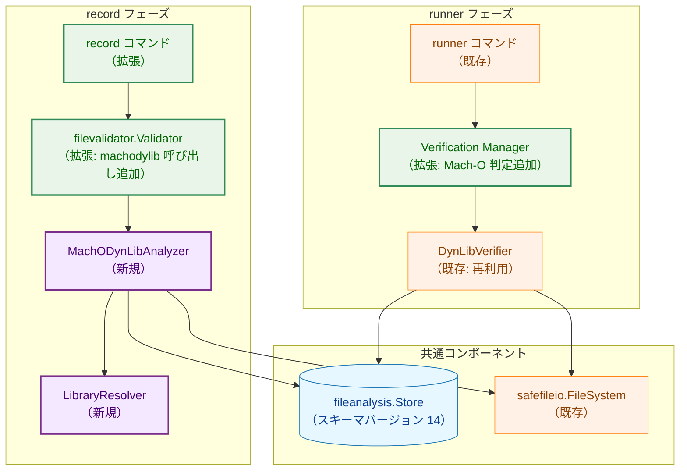
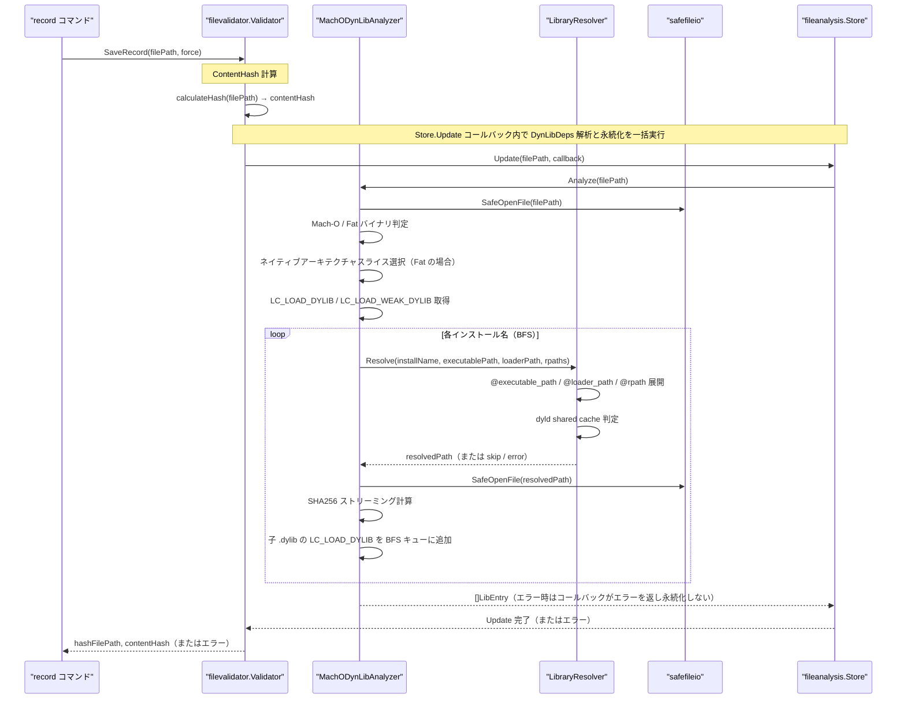
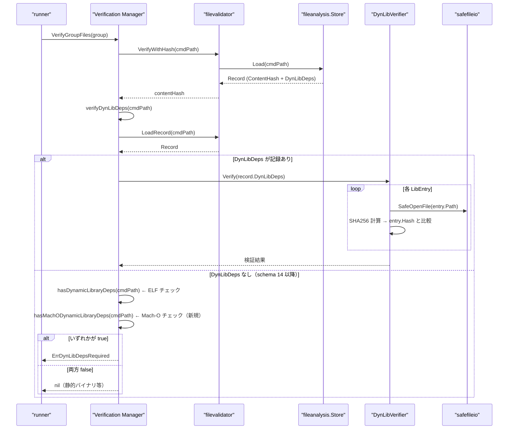
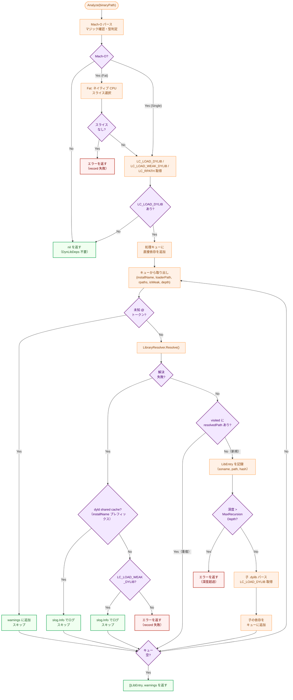
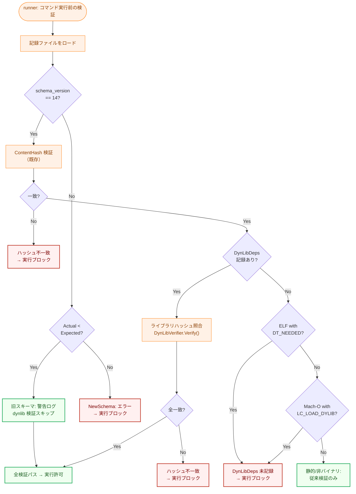
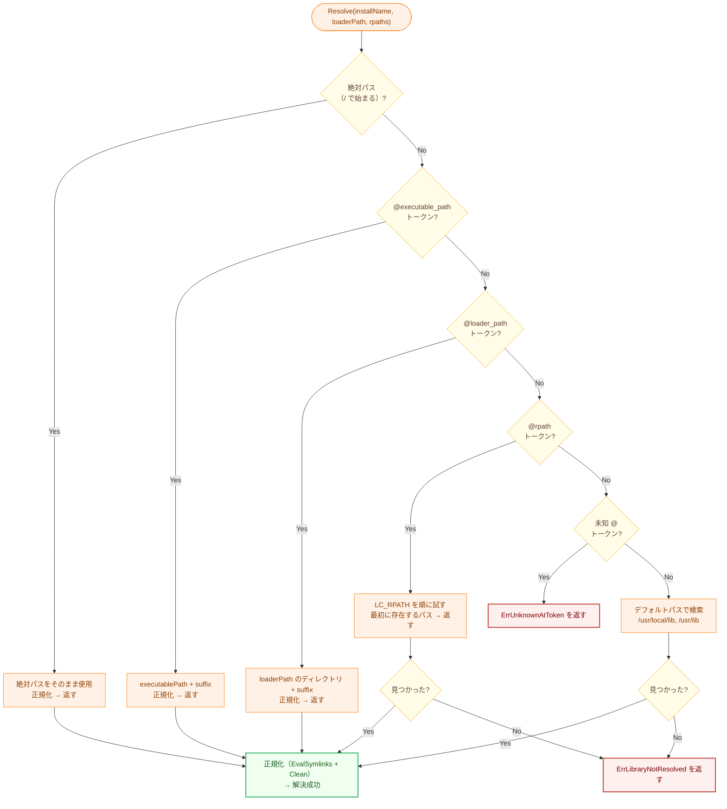
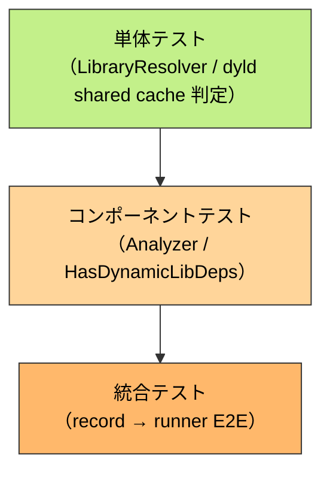
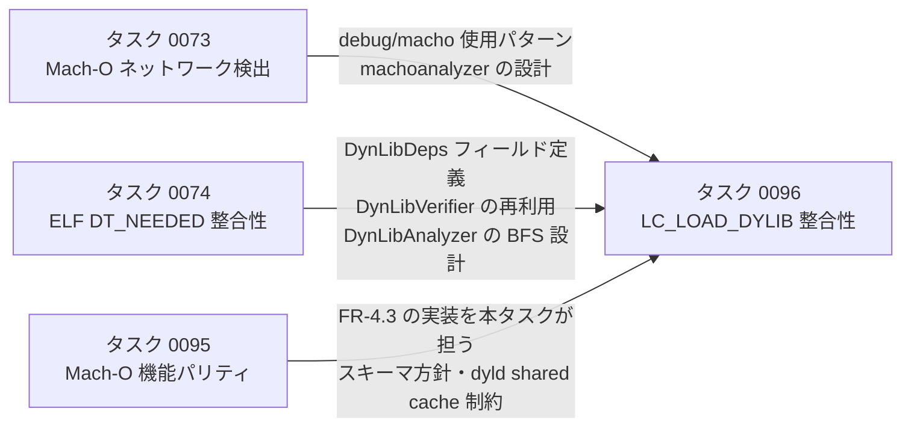

# Mach-O `LC_LOAD_DYLIB` 整合性検証 アーキテクチャ設計書

## 1. システム概要

### 1.1 目的

Mach-O バイナリの `LC_LOAD_DYLIB` / `LC_LOAD_WEAK_DYLIB` エントリから依存ライブラリの完全な依存ツリーを解決し、`record` 時にライブラリのフルパスとハッシュのスナップショットを記録する。`runner` 実行時にスナップショットと実環境を照合し、ライブラリの差し替え・改ざんを検出する。

本タスクは ELF 版タスク 0074（`DT_NEEDED` 整合性検証）の Mach-O 対応版であり、タスク 0095 FR-4.3 の実装を担う。

### 1.2 設計原則

- **Security First**: ライブラリ解決失敗時（`LC_LOAD_DYLIB`）は `record` を失敗させ、不完全なスナップショットを許容しない
- **Backward Compatible Schema Migration**: `CurrentSchemaVersion` を 13 → 14 に上げ、旧記録（schema 13）はスキーマバージョン不一致として扱うが `Actual < Expected` の場合は実行をブロックしない（後方互換）
- **Zero External Dependencies**: `otool` 等の外部コマンドに依存せず、Go 標準ライブラリ（`debug/macho`）のみを使用する
- **DRY**: 既存の `dynlibanalysis.DynLibVerifier`（ハッシュ照合）・`fileanalysis.LibEntry`（エントリ型）・`safefileio`（安全なファイル読み取り）を再利用する
- **YAGNI**: dyld のパス解決を完全に再現するのではなく、セキュリティ検証に必要な範囲（FR-3.1.2 の 5 ステップ）で実装する
- **ELF 版との統一**: `DynLibDeps []fileanalysis.LibEntry` フィールドを ELF 版と共用し、別フィールドは追加しない

## 2. システムアーキテクチャ

### 2.1 全体構成図



**凡例（Legend）**


### 2.2 パッケージ構成

```
internal/
├── machodylib/                          # NEW: Mach-O 動的ライブラリ解析パッケージ
│   ├── doc.go                           # パッケージドキュメント
│   ├── analyzer.go                      # MachODynLibAnalyzer: record 時の依存ツリー解決 + ハッシュ計算
│   ├── resolver.go                      # LibraryResolver: インストール名 → ファイルシステムパス解決
│   └── errors.go                        # エラー型定義
│
├── fileanalysis/
│   └── schema.go                        # CurrentSchemaVersion: 13 → 14
│
├── filevalidator/
│   └── validator.go                     # SaveRecord: MachODynLibAnalyzer の呼び出しを追加
│
├── verification/
│   └── manager.go                       # verifyDynLibDeps: Mach-O 判定を追加
│                                        # hasMachODynamicLibraryDeps: 新規プライベート関数
│
└── dynlibanalysis/
    └── verifier.go                      # DynLibVerifier: 変更なし（形式非依存のため再利用）
```

### 2.3 データフロー: `record` フェーズ



### 2.4 データフロー: `runner` フェーズ



## 3. コンポーネント設計

### 3.1 データ構造の拡張

#### 3.1.1 スキーマバージョンの更新

```go
// internal/fileanalysis/schema.go

const (
    // CurrentSchemaVersion は分析記録スキーマの現在バージョン。
    // Version 14: Mach-O バイナリについても DynLibDeps を記録する（LC_LOAD_DYLIB 整合性検証）。
    //             Record.AnalysisWarnings フィールドを追加（dynlib 解析の警告格納用）。
    // Load は schema_version != 14 の記録に対して SchemaVersionMismatchError を返す。
    CurrentSchemaVersion = 14
)
```

`Record` 構造体に新フィールド `AnalysisWarnings` を追加する：

```go
// Record（追加分のみ記載）
type Record struct {
    // ... 既存フィールド省略 ...

    // AnalysisWarnings は解析中に生成された警告メッセージの一覧。
    // 未知 @ トークン等でハッシュ検証不能な依存ライブラリが存在する場合に追記される。
    // nil / 空の場合は JSON に出力されない（omitempty）。
    AnalysisWarnings []string `json:"analysis_warnings,omitempty"`
}
```

> **NOTE**: 既存の `SyscallAnalysis.AnalysisWarnings`（`common.SyscallAnalysisResultCore` 内）は syscall 解析固有の警告フィールドである。dynlib 解析の警告は性質が異なり混在させるべきでないため、`Record` 直下に独立したフィールドを追加する。

`DynLibDeps []LibEntry` フィールドは ELF 版で既に定義済みで、Mach-O でも同一フィールドを使用する。

#### 3.1.2 `LibEntry` における Mach-O フィールドの意味

ELF 版との共用フィールドに対し、Mach-O では以下の意味を持つ：

| フィールド | Mach-O での意味 |
|-----------|----------------|
| `SOName`  | インストール名（例: `@rpath/libFoo.dylib`、`/usr/local/lib/libbar.dylib`） |
| `Path`    | 解決・正規化されたフルパス（`filepath.EvalSymlinks` + `filepath.Clean` 適用後） |
| `Hash`    | `"sha256:<hex>"` 形式のハッシュ値 |

### 3.2 `MachODynLibAnalyzer`: `record` 時の解析（新規）

```go
// internal/machodylib/analyzer.go

const (
    // MaxRecursionDepth は再帰的依存解決の最大深度（ELF 版と同一値）。
    MaxRecursionDepth = 20
)

// MachODynLibAnalyzer は Mach-O バイナリの LC_LOAD_DYLIB 依存ライブラリを
// 解決・記録する。
type MachODynLibAnalyzer struct {
    fs safefileio.FileSystem
}

// NewMachODynLibAnalyzer は新しいアナライザーを生成する。
func NewMachODynLibAnalyzer(fs safefileio.FileSystem) *MachODynLibAnalyzer

// Analyze は指定された Mach-O バイナリの直接・間接 LC_LOAD_DYLIB 依存ライブラリを
// BFS で解決し、ハッシュを計算した []LibEntry スナップショットを返す。
//
// 非 Mach-O ファイルまたは LC_LOAD_DYLIB エントリがない場合は (nil, nil, nil) を返す。
// LC_LOAD_DYLIB の解決失敗は error を返す（record 失敗）。
// LC_LOAD_WEAK_DYLIB の解決失敗はスキップして継続する。
// dyld shared cache ライブラリはスキップする（DynLibDeps に含めない）。
// 未知の @ トークンは warnings に追加し、継続する。
func (a *MachODynLibAnalyzer) Analyze(binaryPath string) ([]fileanalysis.LibEntry, []AnalysisWarning, error)

// HasDynamicLibDeps は指定されたパスの Mach-O バイナリが、dyld shared cache 以外の
// LC_LOAD_DYLIB / LC_LOAD_WEAK_DYLIB エントリを持つかどうかを確認する。
// runner フェーズで DynLibDeps 未記録 Mach-O を検出するために使用する。
// 非 Mach-O ファイルは (false, nil) を返す。
func HasDynamicLibDeps(path string, fs safefileio.FileSystem) (bool, error)
```

**`AnalysisWarning` 型**:

```go
// AnalysisWarning は解決不能な依存（未知 @ トークン等）の警告情報を保持する。
// filevalidator が Record.AnalysisWarnings []string に追記する際に
// フォーマット済み文字列へ変換して使用する。
type AnalysisWarning struct {
    InstallName string // 解決できなかったインストール名
    Reason      string // 警告の理由（例: "unknown @ token: @loader_rpath"）
}

// String は AnalysisWarning を Record.AnalysisWarnings に追記するためのフォーマット済み文字列を返す。
// 例: "dynlib warning: unknown @ token in @loader_rpath/libFoo.dylib (reason: unknown @ token: @loader_rpath)"
func (w AnalysisWarning) String() string
```

**再帰解決の処理フロー**:



**BFS キューのエントリ構造（実装メモ）**:

BFS キューの各エントリは以下の情報を保持する：
- `installName`: インストール名（SOName として LibEntry に記録）
- `loaderPath`: Load Command を持つ Mach-O ファイルのパス（`@loader_path` 展開の基準）
- `rpaths`: そのファイルの `LC_RPATH` エントリ一覧（`@rpath` 解決用）
- `isWeak`: `LC_LOAD_WEAK_DYLIB` の場合 true
- `depth`: 現在の再帰深度

`@rpath` の非継承：間接依存の解決は、当該 `.dylib` 自身の `LC_RPATH` のみを使用する（メインバイナリの `LC_RPATH` は継承しない）。ELF 版における DT_RUNPATH 非継承と同一の設計方針。

`visited` セットのキー：正規化後の `resolvedPath` のみをキーとして使用する（`@rpath` 展開後）。

### 3.3 `LibraryResolver`: インストール名の解決（新規）

```go
// internal/machodylib/resolver.go

// LibraryResolver はインストール名から実際のファイルシステムパスを解決する。
// dyld のパス解決アルゴリズムの必要部分を実装する。
type LibraryResolver struct {
    executablePath string // メインバイナリのディレクトリ（@executable_path 展開用）
}

// NewLibraryResolver は新しいリゾルバーを生成する。
// executablePath はメインバイナリのディレクトリパス。
func NewLibraryResolver(executablePath string) *LibraryResolver

// Resolve はインストール名を実際のファイルシステムパスに解決する。
// 解決順序は FR-3.1.2 に従う：
//  1. 絶対パス（/ で始まる）: そのまま使用
//  2. @executable_path トークン: メインバイナリのディレクトリに展開
//  3. @loader_path トークン: loaderPath のディレクトリに展開
//  4. @rpath トークン: rpaths を順に試し、最初に存在するパスを採用
//  5. デフォルトパス: /usr/local/lib, /usr/lib の順
//
// 未知の @ トークン（@executable_path / @loader_path / @rpath 以外）の場合は
// ErrUnknownAtToken を返す。
// 解決したパスが実在しない場合は ErrLibraryNotResolved を返す。
//
// 戻り値のパスは filepath.EvalSymlinks + filepath.Clean で正規化済み。
func (r *LibraryResolver) Resolve(installName, loaderPath string, rpaths []string) (string, error)
```

**dyld shared cache 判定ロジック**:

`Resolve` が `ErrLibraryNotResolved` を返した後、インストール名がシステムライブラリ系プレフィックス（`/usr/lib/`、`/usr/libexec/`、`/System/Library/`、`/Library/Apple/`）に一致する場合、dyld shared cache ライブラリと判定してスキップする（FR-3.1.5）。`Resolve` の失敗が「ファイルが存在しない」という事実を確認しているため、判定にはインストール名のプレフィックスチェックだけで十分。

```go
// IsDyldSharedCacheLib は指定されたインストール名が dyld shared cache に
// 収録されるシステムライブラリのプレフィックスに一致するかを判定する（FR-3.1.5）。
// Resolve が失敗した（ファイルが存在しない）後に呼び出すことで、
// 「システムプレフィックス かつ ファイル不在」の 2 条件を満たすことを保証する。
func IsDyldSharedCacheLib(installName string) bool
```

### 3.4 `DynLibVerifier`: `runner` 時の検証（既存: 変更なし）

`dynlibanalysis.DynLibVerifier` はハッシュ照合のみを行う形式非依存の実装であり、Mach-O の LibEntry に対してもそのまま再利用できる。

```go
// internal/dynlibanalysis/verifier.go（変更なし）

// Verify は記録済み依存ライブラリのハッシュ検証を実施する。
// 各 LibEntry について entry.Path のファイルをハッシュ計算し entry.Hash と比較する。
func (v *DynLibVerifier) Verify(deps []fileanalysis.LibEntry) error
```

### 3.5 `filevalidator.Validator.SaveRecord` の拡張

既存の `SaveRecord` は `Store.Update` コールバック内で ELF 用 `dynlibAnalyzer.Analyze()` を呼び出している。同コールバック内に Mach-O 用解析を追加する：

```go
// internal/filevalidator/validator.go（拡張）

type Validator struct {
    // ... 既存フィールド ...
    dynlibAnalyzer     *dynlibanalysis.DynLibAnalyzer  // ELF 用（既存）
    machoDynlibAnalyzer *machodylib.MachODynLibAnalyzer // Mach-O 用（新規）
}

// SaveRecord 内の Store.Update コールバック（概要）:
//   1. calculateHash(filePath) → contentHash
//   2. store.Update(filePath, func(record) {
//          record.ContentHash = contentHash
//          // ELF 解析（既存）
//          if v.dynlibAnalyzer != nil {
//              dynLibDeps, err := v.dynlibAnalyzer.Analyze(filePath)
//              if err != nil { return err }
//              record.DynLibDeps = dynLibDeps
//          }
//          // Mach-O 解析（新規）
//          if v.machoDynlibAnalyzer != nil && record.DynLibDeps == nil {
//              libs, warns, err := v.machoDynlibAnalyzer.Analyze(filePath)
//              if err != nil { return err }
//              record.DynLibDeps = libs
//              // warns を AnalysisWarnings に追記
//          }
//      })
```

> **NOTE**: ELF 解析と Mach-O 解析は排他的（ELF バイナリは Mach-O でなく、その逆も同様）。ELF アナライザーが non-nil の `DynLibDeps` を返した場合は Mach-O 解析をスキップする。

### 3.6 `verification.Manager.verifyDynLibDeps` の拡張

`verifyDynLibDeps` の「`DynLibDeps` なし」分岐に Mach-O チェックを追加する：

```go
// internal/verification/manager.go（拡張）

func (m *Manager) verifyDynLibDeps(cmdPath string) error {
    // ... 既存: record ロード・スキーマバージョン処理 ...

    if len(record.DynLibDeps) > 0 {
        // ハッシュ照合（ELF / Mach-O 共通）
        return m.dynlibVerifier.Verify(record.DynLibDeps)
    }

    // DynLibDeps なし: 動的リンクバイナリかどうかを確認
    // ELF チェック（既存）
    hasDynDeps, err := m.hasDynamicLibraryDeps(cmdPath)
    if err != nil {
        return fmt.Errorf("failed to check dynamic library dependencies: %w", err)
    }
    if hasDynDeps {
        return &dynlibanalysis.ErrDynLibDepsRequired{BinaryPath: cmdPath}
    }

    // Mach-O チェック（新規）
    hasMachoDynDeps, err := m.hasMachODynamicLibraryDeps(cmdPath)
    if err != nil {
        return fmt.Errorf("failed to check Mach-O dynamic library dependencies: %w", err)
    }
    if hasMachoDynDeps {
        return &dynlibanalysis.ErrDynLibDepsRequired{BinaryPath: cmdPath}
    }

    return nil
}

// hasMachODynamicLibraryDeps は指定パスの Mach-O バイナリが
// dyld shared cache 以外の動的依存を持つかどうかを確認する。
// machodylib.HasDynamicLibDeps に委譲する。
func (m *Manager) hasMachODynamicLibraryDeps(path string) (bool, error) {
    return machodylib.HasDynamicLibDeps(path, m.safeFS)
}
```

**スキーマバージョン処理の変更点**:

スキーマバージョン不一致の処理は既存のまま変更なし：

| 状態 | 処理 |
|------|------|
| `SchemaVersionMismatchError.Actual < Expected`（旧 schema 13） | 警告ログを出して dynlib 検証をスキップ（後方互換） |
| `SchemaVersionMismatchError.Actual > Expected`（将来の新 schema） | エラーを返す（前方互換違反） |
| `ErrRecordNotFound` | dynlib 検証不要（hash 未記録 = 検証対象外） |

## 4. セキュリティアーキテクチャ

### 4.1 攻撃ベクターと防御

| 攻撃ベクター | 防御層 | 検出メカニズム |
|------------|-------|-------------|
| ライブラリ改ざん（同一パスで中身書き換え） | ハッシュ照合 | `DynLibVerifier.Verify` でハッシュ不一致を検出 |
| ライブラリ丸ごと差し替え（同一パスへ別ライブラリをコピー） | ハッシュ照合 | `DynLibVerifier.Verify` でハッシュ不一致を検出 |
| `DYLD_LIBRARY_PATH` ハイジャック | 設計上除外 | `runner` は `DYLD_LIBRARY_PATH` をクリアして実行、`record` 時も使用しない |
| 間接依存ライブラリの差し替え | BFS 再帰解決 | 完全な依存ツリーがスナップショットに含まれる |
| `DYLD_INSERT_LIBRARIES` 注入 | 設計上除外 | `runner` が環境変数クリア済み |
| `dlopen` による未知ライブラリのロード | 既存の `HasDynamicLoad` 検出 | 既存の方策 B（タスク 0074）で対応済み |
| シンボリックリンク攻撃（ライブラリ読み取り時） | `safefileio` | `O_NOFOLLOW` による防止 |
| 不完全な記録（`path: ""`）の悪用 | 防御的検出 | `DynLibVerifier` が `ErrEmptyLibraryPath` を返す |
| 旧スキーマ記録による検証すり抜け | スキーマバージョン | `Actual < Expected` → 警告付き実行許可（後方互換）、`Actual > Expected` → 拒否 |

### 4.2 セキュリティ処理フロー（`runner` フェーズ）



### 4.3 ファイル読み取りの安全性

ライブラリのハッシュ計算時は `safefileio.SafeOpenFile()` を使用してストリーミングで読み取る（ELF 版と同一）。パスの正規化は `filepath.EvalSymlinks` → `filepath.Clean` の順で適用する。

`record` 時にこの正規化を `LibEntry.Path` 記録前に行うことで、シンボリックリンク由来の偽不一致を防ぐ。

## 5. ライブラリパス解決アルゴリズム

### 5.1 解決優先順位



### 5.2 `@rpath` 解決における `@executable_path` / `@loader_path` の展開

`LC_RPATH` エントリ自体に `@executable_path` / `@loader_path` が含まれる場合、`@rpath` 展開前に同様のトークン置換を行う：

```
LC_RPATH: @executable_path/../lib
  → /opt/app/../lib
  → /opt/lib（Clean 後）
  → /opt/lib/libFoo.dylib が存在する場合に採用
```

### 5.3 `@loader_path` の解決コンテキスト

| 解決対象 | `@loader_path` の基準ディレクトリ |
|---------|--------------------------------|
| メインバイナリの直接依存 | メインバイナリのディレクトリ |
| 間接依存（`.dylib` がさらに依存する `.dylib`） | その `.dylib` 自身のディレクトリ |

これにより `@loader_path` は「Load Command を含む Mach-O ファイルのディレクトリ」という FR-3.1.3 の定義と一致する。

### 5.4 Fat バイナリのスライス選択

`runtime.GOARCH` から CPUType を導出し、`debug/macho.FatFile.Arches` から一致するスライスを選択する：

| `runtime.GOARCH` | `macho.CpuType` |
|-----------------|-----------------|
| `"arm64"` | `macho.CpuArm64` |
| `"amd64"` | `macho.CpuAmd64` |
| その他 | — （一致なし → エラー） |

一致するスライスが存在しない場合は `ErrNoMatchingSlice` を返して `record` を失敗させる（別スライスへの暗黙フォールバックを禁止する）。

### 5.5 dyld shared cache ライブラリの判定

`LibraryResolver.Resolve` が失敗した（ファイルが実在しない）後、インストール名が以下のプレフィックスに一致する場合に dyld shared cache ライブラリと判定する。Resolve の失敗がファイル不在を示しているため、プレフィックスチェックだけで FR-3.1.5 の 2 条件（システムプレフィックス かつ ファイル不在）を満たす：

```go
var systemLibPrefixes = []string{
    "/usr/lib/",
    "/usr/libexec/",
    "/System/Library/",
    "/Library/Apple/",
}
```

判定が true の場合：
- `DynLibDeps` にエントリを追加しない
- `slog.Info` で「dyld shared cache 由来と判断、コード署名検証に委譲」をログ出力
- BFS キューへの追加もしない（その先の依存は解決不要）

単にファイルシステム上に実体がないだけの非システムライブラリは dyld shared cache ライブラリとみなさず、FR-3.1.7 の解決失敗として扱う。

### 5.6 `record` 時と `runner` 時の `DYLD_LIBRARY_PATH` の扱い

| フェーズ | `DYLD_LIBRARY_PATH` | 理由 |
|---------|---------------------|------|
| `record` 時 | **使用しない（無視）** | ユーザー環境に依存しない絶対パスを基準として記録する |
| `runner` 実行時 | **クリアして実行** | パスハイジャック攻撃防止（既存動作）|

## 6. エラーハンドリング設計

### 6.1 エラー型定義（新規）

```go
// internal/machodylib/errors.go

// ErrLibraryNotResolved は LC_LOAD_DYLIB のインストール名を
// いずれの解決方法でもファイルシステムパスに解決できなかったことを示す。
type ErrLibraryNotResolved struct {
    InstallName string
    LoaderPath  string
    Tried       []string // 試みたパスの一覧
}

// ErrUnknownAtToken は未知の @ プレフィックストークン（@executable_path /
// @loader_path / @rpath 以外）を検出したことを示す。
type ErrUnknownAtToken struct {
    InstallName string
    Token       string
}

// ErrRecursionDepthExceeded は依存解決の再帰深度が上限を超えたことを示す。
type ErrRecursionDepthExceeded struct {
    Depth    int
    MaxDepth int
    SOName   string
}

// ErrNoMatchingSlice は Fat バイナリにネイティブアーキテクチャと
// 一致するスライスが存在しないことを示す。
type ErrNoMatchingSlice struct {
    BinaryPath string
    GOARCH     string
}
```

`ErrLibraryHashMismatch`・`ErrEmptyLibraryPath`・`ErrDynLibDepsRequired` は `dynlibanalysis` パッケージの既存型を再利用する（`DynLibVerifier` が使用する）。

### 6.2 エラーメッセージ例

**LC_LOAD_DYLIB 解決失敗（`record` 時）**:
```
failed to resolve dynamic library: @rpath/libFoo.dylib
  loader: /opt/app/bin/myapp
  tried:
    - /opt/app/lib/libFoo.dylib (not found)
    - /usr/local/lib/libFoo.dylib (not found)
    - /usr/lib/libFoo.dylib (not found)
```

**ハッシュ不一致（`runner` 時）**:
```
dynamic library hash mismatch: @rpath/libFoo.dylib
  path: /opt/app/lib/libFoo.dylib
  expected hash: sha256:abc123...
  actual hash: sha256:def456...
  please re-run 'record' command
```

**dyld shared cache ライブラリ（`record` 時のログ、Info レベル）**:
```
dynlib: skipping dyld shared cache library (delegating to code signing): /usr/lib/libSystem.B.dylib
```

## 7. パフォーマンス設計

### 7.1 パフォーマンス特性

| 操作 | 処理内容 | 想定時間 |
|------|---------|---------|
| Mach-O パース | `debug/macho` による Load Commands 走査 | < 5ms |
| インストール名解決 | パス展開・ファイル存在確認 | < 1ms/ライブラリ |
| ライブラリハッシュ計算 | `safefileio` + SHA256 ストリーミング | < 50ms/ライブラリ（数 MB の場合） |
| BFS 全体（典型的） | 5〜15 ライブラリ × (解決 + ハッシュ) | < 1s |
| `runner` ハッシュ検証 | ハッシュ計算時間に支配される | `record` 時と同等 |

macOS では間接依存の大半が dyld shared cache（スキップ対象）であるため、実際に BFS が展開するのはサードパーティやバンドル `.dylib` のサブツリーに限定され、ELF 版より対象ライブラリ数は少ない。

### 7.2 最適化方針

- `visited` セットにより同一ライブラリの重複解析を防止する
- ハッシュ計算にはストリーミング計算を使用し、メモリ使用量を抑制する
- dyld shared cache ライブラリを早期スキップし、無駄なファイルアクセスを削減する

## 8. 段階的実装計画

### 8.1 Phase 1: `machodylib` パッケージ基盤

- [ ] `machodylib` パッケージ作成・型定義
- [ ] エラー型定義（`errors.go`）
- [ ] dyld shared cache 判定ロジック（`IsDyldSharedCacheLib`）
- [ ] `LibraryResolver` 実装（絶対パス・`@executable_path`・`@loader_path`・`@rpath`・デフォルトパス）
- [ ] `LC_RPATH` 内のトークン展開
- [ ] Fat バイナリのスライス選択
- [ ] `LibraryResolver` のユニットテスト

### 8.2 Phase 2: `MachODynLibAnalyzer` の実装（`record` 拡張）

- [ ] `MachODynLibAnalyzer` 実装（BFS + ハッシュ計算）
- [ ] `LC_LOAD_WEAK_DYLIB` のスキップ処理
- [ ] 未知 `@` トークンの警告処理
- [ ] 循環依存防止（`visited` セット）
- [ ] 再帰深度制限（`MaxRecursionDepth`）
- [ ] `HasDynamicLibDeps` 関数の実装
- [ ] `MachODynLibAnalyzer.Analyze` のユニットテスト
- [ ] テスト用 Mach-O フィクスチャの作成（`testdata/`）

### 8.3 Phase 3: スキーマバージョン更新・`filevalidator` 拡張

- [ ] `fileanalysis.Record` に `AnalysisWarnings []string` フィールドを追加
- [ ] `fileanalysis.CurrentSchemaVersion`: 13 → 14
- [ ] `Validator` に `machoDynlibAnalyzer` フィールド追加
- [ ] `SaveRecord` のコールバック内に Mach-O 解析呼び出しを追加
- [ ] `AnalysisWarnings` への警告追記処理（`[]AnalysisWarning` → `[]string` 変換）
- [ ] `record` 拡張の統合テスト（Mach-O バイナリで DynLibDeps が記録されること）

### 8.4 Phase 4: `verification.Manager` 拡張・仕上げ

- [ ] `hasMachODynamicLibraryDeps` 実装
- [ ] `verifyDynLibDeps` に Mach-O 判定を追加
- [ ] `runner` 検証の統合テスト（正常系・改ざん検出・後方互換性）
- [ ] 既存の ELF テストの全パス確認
- [ ] `make lint` / `make fmt` パス確認

## 9. テスト戦略

### 9.1 テスト階層



### 9.2 単体テスト

| テストケース | パッケージ | 検証内容 |
|-------------|----------|---------|
| 絶対パスの解決 | `machodylib` | そのパスが直接使用されること |
| `@executable_path` 展開 | `machodylib` | メインバイナリのディレクトリへの展開 |
| `@loader_path` 展開（直接依存） | `machodylib` | メインバイナリのディレクトリが基準 |
| `@loader_path` 展開（間接依存） | `machodylib` | `.dylib` 自身のディレクトリが基準 |
| `@rpath` 展開（単一 `LC_RPATH`） | `machodylib` | `LC_RPATH` エントリへの展開 |
| `@rpath` 展開（複数 `LC_RPATH`） | `machodylib` | 最初に存在するパスへの展開 |
| `LC_RPATH` 内の `@executable_path` | `machodylib` | 二重展開が正しく行われること |
| デフォルトパス検索 | `machodylib` | `/usr/local/lib`, `/usr/lib` の順で解決 |
| dyld shared cache 判定 | `machodylib` | システムプレフィックス + 実体なし → true |
| dyld shared cache 判定（偽陰性防止） | `machodylib` | 非システムパスは false |
| 未知 `@` トークン | `machodylib` | `ErrUnknownAtToken` が返ること |
| 解決失敗 | `machodylib` | `ErrLibraryNotResolved` にインストール名が含まれること |
| Fat バイナリのスライス選択 | `machodylib` | ネイティブアーキテクチャのスライスが選択されること |
| Fat バイナリ（一致なし） | `machodylib` | `ErrNoMatchingSlice` が返ること |

### 9.3 コンポーネントテスト

| テストケース | 検証内容 |
|-------------|---------|
| `Analyze` 正常系 | LC_LOAD_DYLIB を持つ Mach-O から DynLibDeps を取得 |
| `Analyze` 非 Mach-O | `(nil, nil, nil)` を返すこと |
| `Analyze` LC_LOAD_DYLIB なし | `(nil, nil, nil)` を返すこと |
| `Analyze` LC_LOAD_DYLIB 解決失敗 | エラーで記録が保存されないこと |
| `Analyze` LC_LOAD_WEAK_DYLIB 解決失敗 | スキップして継続されること |
| `Analyze` dyld shared cache のみ | `DynLibDeps` が nil であること |
| `Analyze` 未知 `@` トークン | `record` は継続し、`AnalysisWarnings` に記録されること |
| `Analyze` 間接依存の再帰解決 | 直接依存の `.dylib` がさらに依存する `.dylib` も記録されること |
| `Analyze` 間接依存の `@rpath` 解決 | 各 `.dylib` 自身の `LC_RPATH` が使われること |
| `Analyze` 循環依存の防止 | 無限ループせず正常終了すること |
| `Analyze` 再帰深度超過 | `ErrRecursionDepthExceeded` が返ること |
| `HasDynamicLibDeps` Mach-O + dyld cache 以外の依存 | `(true, nil)` |
| `HasDynamicLibDeps` Mach-O + dyld cache のみ | `(false, nil)` |
| `HasDynamicLibDeps` 非 Mach-O | `(false, nil)` |

### 9.4 統合テスト

| テストケース | 検証内容 |
|-------------|---------|
| `record` → `runner` 正常 | ハッシュ照合成功、実行許可 |
| ライブラリ改ざん検出 | `record` 後にライブラリを書き換え → `runner` がブロック |
| ライブラリ差し替え検出 | `record` 後に別ライブラリをコピー → `runner` がブロック |
| 非 Mach-O バイナリ | `DynLibDeps` なしで従来検証 |
| 旧スキーマ Mach-O 記録 | 後方互換性: 実行が許可されること（スキーマ 13） |
| schema 14 Mach-O で `DynLibDeps` なし | 実行がブロックされること |
| `LC_LOAD_DYLIB` 解決失敗 | `record` がエラーで終了し記録が保存されないこと |
| 未知 `@` トークン | `record` は継続し `AnalysisWarnings` に警告が保存されること |
| 既存 ELF `DynLibDeps` 検証 | 正常動作（非影響確認） |

### 9.5 テストフィクスチャ

- `LC_RPATH`、`@rpath` インストール名を持つ最小 Mach-O バイナリを `testdata/` に配置
- フィクスチャ生成スクリプトを合わせて格納し再現性を確保
- テスト用ダミー `.dylib` をテンポラリディレクトリに配置してパス解決を検証

## 10. 依存関係とリスク

### 10.1 内部依存関係

| 依存元 | 依存先 | 依存内容 |
|-------|-------|---------|
| `machodylib` | `fileanalysis` | `LibEntry` 型 |
| `machodylib` | `safefileio` | 安全なファイル読み取り |
| `filevalidator` | `machodylib` | `Validator.SaveRecord` 内で `MachODynLibAnalyzer.Analyze` を呼び出し |
| `verification` | `machodylib` | `HasDynamicLibDeps` 経由で Mach-O 動的依存チェック |
| `verification` | `dynlibanalysis` | `DynLibVerifier.Verify`（Mach-O LibEntry に対して再利用） |

### 10.2 先行タスクとの関係



### 10.3 アーキテクチャリスク

| リスク | 影響度 | 対策 |
|-------|-------|------|
| `@rpath` の解決精度 | 低 | dyld の完全再現は不要、セキュリティ検証に必要な範囲に限定 |
| dyld shared cache 判定の誤り | 中 | インストール名プレフィックス + ファイル実体なしの 2 条件で判定 |
| Fat バイナリのアーキテクチャ不一致 | 低 | ネイティブスライスのみを対象とし、フォールバックを禁止 |
| `CurrentSchemaVersion` 変更の影響 | 高 | 全管理対象バイナリの `record` 再実行が必要（README に明記）。旧スキーマは後方互換で実行許可 |
| macOS 限定 API の使用 | 低 | `debug/macho` は Go 標準ライブラリに含まれクロスプラットフォーム対応。実際の Mach-O 解析は macOS でのみ意味を持つが、コンパイルは他 OS でも可能 |
