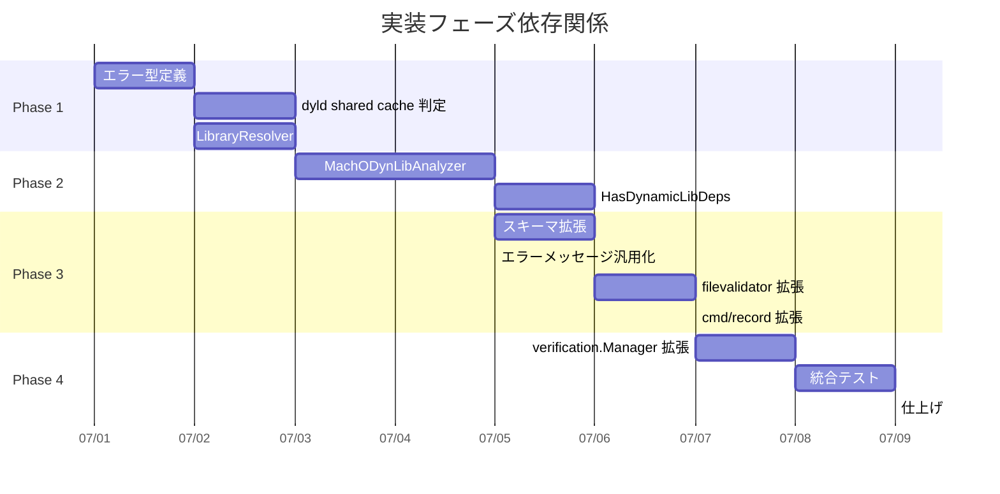

# Mach-O `LC_LOAD_DYLIB` 整合性検証 実装計画書

## 1. 実装概要

### 1.1 実装目標

- Mach-O バイナリの `LC_LOAD_DYLIB` / `LC_LOAD_WEAK_DYLIB` から依存ライブラリの完全な依存ツリーを解決し、`record` 時にスナップショットを記録する
- `runner` 実行時にハッシュ照合でライブラリの改ざんを検出する
- dyld shared cache ライブラリ（macOS 11 以降でファイルシステム上に実体がないシステムライブラリ）を適切にスキップする
- `CurrentSchemaVersion` を 13 → 14 に上げ、旧記録（schema 13）に対しては `runner` がエラーを返して実行をブロックする（不完全なレコードによる検証すり抜けを防止）

### 1.2 実装スコープ

| 区分 | 内容 |
|------|------|
| 新規パッケージ | `internal/machodylib/`（5 ファイル + テスト + testdata） |
| 拡張対象 | `fileanalysis`, `filevalidator`, `verification`, `elfdynlib`（旧 `elfdynlib`）, `cmd/record` |
| 新規ファイル数 | 約 12 ファイル（実装 + テスト + testdata） |
| テストケース | 単体 約 20 件、コンポーネント 約 15 件、統合 約 10 件 |

### 1.3 想定工数

| Phase | 工数 | 内容 |
|-------|------|------|
| Phase 0 | 0.5 日 | `elfdynlib` → `elfdynlib` パッケージリネーム・関連フィールド/メソッドリネーム |
| Phase 1 | 2 日 | `machodylib` パッケージ基盤（エラー型・shared cache 判定・LibraryResolver） |
| Phase 2 | 2 日 | `MachODynLibAnalyzer`（BFS 依存解決 + ハッシュ計算） |
| Phase 3 | 1.5 日 | スキーマバージョン更新・`filevalidator` 拡張・`cmd/record` 拡張 |
| Phase 4 | 1.5 日 | `verification.Manager` 拡張・統合テスト・仕上げ |
| 合計 | 7.5 日 | |

## 2. 実装フェーズ計画

### 2.0 Phase 0: `elfdynlib` → `elfdynlib` リネーム (0.5 日)

**目標**: ELF 固有パッケージ名・フィールド名を明確化し、後続フェーズで追加する Mach-O 対応コードとの混同を防ぐ。このリネームを先行させることで、Phase 1 以降のコードが最初から正しい名前で書かれ、後からの一括リネームを不要にする。

#### 実装対象

```
internal/elfdynlib/ → internal/elfdynlib/   # ディレクトリ名変更
internal/filevalidator/validator.go              # フィールド・メソッドリネーム
cmd/record/main.go                               # フィールドリネーム
internal/verification/manager.go                # import パス更新
internal/libccache/integration_test.go          # import パス・呼び出し更新
internal/verification/manager_test.go           # import パス更新
```

#### 実装内容

##### 2.0.1 パッケージディレクトリのリネーム

- `internal/elfdynlib/` → `internal/elfdynlib/`
- 全ファイル冒頭の `package elfdynlib` → `package elfdynlib`

##### 2.0.2 import パスの一括更新

`elfdynlib` を import している全ファイルのパスを更新する：

| ファイル | 変更内容 |
|---------|---------|
| `internal/filevalidator/validator.go` | import + フィールド・メソッド参照 |
| `cmd/record/main.go` | import + フィールド・呼び出し |
| `internal/verification/manager.go` | import + 型参照 |
| `internal/libccache/integration_test.go` | import + `SetELFDynLibAnalyzer` 呼び出し |
| `internal/verification/manager_test.go` | import + 型参照 |

##### 2.0.3 フィールド・メソッドリネーム

**`internal/filevalidator/validator.go`**

| 変更前 | 変更後 |
|--------|--------|
| `dynlibAnalyzer *elfdynlib.DynLibAnalyzer` （旧名称） | `elfDynlibAnalyzer *elfdynlib.DynLibAnalyzer` |
| `func (v *Validator) SetELFDynLibAnalyzer(...)` | `func (v *Validator) SetELFDynLibAnalyzer(...)` |

**`cmd/record/main.go`**

| 変更前 | 変更後 |
|--------|--------|
| `elfDynlibAnalyzerFactory func() *elfdynlib.DynLibAnalyzer` | `elfDynlibAnalyzerFactory func() *elfdynlib.DynLibAnalyzer` |

#### 完了条件

- [x] `internal/elfdynlib/` パッケージが存在し、`package elfdynlib` 宣言になっていること
- [x] `internal/elfdynlib/` ディレクトリが削除されていること
- [x] `Validator.elfDynlibAnalyzer` フィールドが存在すること
- [x] `Validator.SetELFDynLibAnalyzer` メソッドが存在すること
- [x] `cmd/record/main.go` の `elfDynlibAnalyzerFactory` フィールドが存在すること
- [-] `make test` 全パスすること
- [x] `make lint` / `make fmt` がパスすること

---

### 2.1 Phase 1: `machodylib` パッケージ基盤 (2 日)

**目標**: `machodylib` パッケージを新規作成し、エラー型定義、dyld shared cache 判定、LibraryResolver（インストール名 → ファイルシステムパス解決）を実装する。

#### 実装対象

```
internal/machodylib/                     # NEW パッケージ
├── doc.go                               # パッケージドキュメント
├── errors.go                            # エラー型定義
├── shared_cache.go                      # IsDyldSharedCacheLib
├── resolver.go                          # LibraryResolver
├── shared_cache_test.go                 # shared cache 判定テスト
├── resolver_test.go                     # LibraryResolver テスト
└── testdata/
    └── README.md                        # テストデータの説明と生成方法
```

#### 実装内容

##### 2.1.1 パッケージ作成とドキュメント

**ファイル**: `internal/machodylib/doc.go`

```go
// Package machodylib provides Mach-O dynamic library dependency analysis
// for LC_LOAD_DYLIB integrity verification.
package machodylib
```

##### 2.1.2 エラー型定義

**ファイル**: `internal/machodylib/errors.go`

- `ErrLibraryNotResolved`: ライブラリ解決失敗（InstallName, LoaderPath, Tried を含む）
- `ErrUnknownAtToken`: 未知の `@` プレフィックストークン（InstallName, Token を含む）
- `ErrRecursionDepthExceeded`: 再帰深度超過（Depth, MaxDepth, SOName を含む）
- `ErrNoMatchingSlice`: Fat バイナリでネイティブスライスなし（BinaryPath, GOARCH を含む）

`ErrLibraryHashMismatch`・`ErrEmptyLibraryPath`・`ErrDynLibDepsRequired` は `elfdynlib` パッケージの既存型を再利用する。

##### 2.1.3 dyld shared cache 判定

**ファイル**: `internal/machodylib/shared_cache.go`

- `systemLibPrefixes` パッケージ変数: `/usr/lib/`, `/usr/libexec/`, `/System/Library/`, `/Library/Apple/`
- `IsDyldSharedCacheLib(installName string) bool`: インストール名がシステムライブラリプレフィックスに一致するかを判定する。`Resolve` が失敗した（ファイル不在）後に呼び出すことで、FR-3.1.5 の 2 条件（システムプレフィックス かつ ファイル不在）を満たす

##### 2.1.4 LibraryResolver 実装

**ファイル**: `internal/machodylib/resolver.go`

- `defaultSearchPaths` パッケージ変数: `/usr/local/lib`, `/usr/lib`
- `LibraryResolver` 構造体（`executableDir string`）
- `NewLibraryResolver(executableDir string) *LibraryResolver`
- `Resolve(installName, loaderPath string, rpaths []string) (string, error)`: FR-3.1.2 の 5 段階優先順位で解決
  1. 絶対パス（`/` で始まり `@` トークンなし）: そのまま使用
  2. `@executable_path` トークン: `executableDir` に展開
  3. `@loader_path` トークン: `loaderPath` のディレクトリに展開
  4. `@rpath` トークン: `rpaths` を順に試し、最初に存在するパスを採用
  5. デフォルト検索パス: `/usr/local/lib`, `/usr/lib` の順
- `expandRpathEntry(rpathEntry, loaderPath string) string`: LC_RPATH エントリ内の `@executable_path` / `@loader_path` 展開
- `splitAtToken(installName string) (token, suffix string)`: `@rpath/libFoo.dylib` → `("@rpath", "libFoo.dylib")` — suffix は先頭の `/` を含まない
- `tryResolve(candidate string) (string, error)`: `filepath.Clean` → `os.Lstat`（ファイル不在とその他のエラーを区別）→ `filepath.EvalSymlinks` → `filepath.Clean` で正規化パス返却

> **設計注記（`safefileio` 不使用）**: `tryResolve` は `os.Lstat` で存在確認とエラー分類を行ったうえで `filepath.EvalSymlinks` を使用する。`safefileio` はコンテンツ読み取り向けであり、パス存在確認向けではない。ELF 版 `elfdynlib.LibraryResolver` と同一の方針で、not-found 判定とエラー wrapping の一貫性を保つ。

#### 完了条件

- [x] `machodylib` パッケージが作成されていること
- [x] エラー型が全て定義されていること
- [x] `IsDyldSharedCacheLib` がシステムプレフィックスを正しく判定すること
- [x] `IsDyldSharedCacheLib` が非システムパス（`/usr/local/lib/`, `/opt/homebrew/lib/` 等）に false を返すこと
- [x] `LibraryResolver.Resolve` が絶対パスを正しく解決すること
- [x] `LibraryResolver.Resolve` が `@executable_path` を正しく展開すること
- [x] `LibraryResolver.Resolve` が `@loader_path` を正しく展開すること
- [x] `LibraryResolver.Resolve` が `@rpath` を LC_RPATH エントリ順に試して解決すること
- [x] `LibraryResolver.Resolve` が `LC_RPATH` 内の `@executable_path` を展開すること
- [x] `LibraryResolver.Resolve` がデフォルト検索パスで解決すること
- [x] 未知 `@` トークンで `ErrUnknownAtToken` が返ること
- [x] 解決失敗で `ErrLibraryNotResolved` が返り、InstallName と Tried が含まれること
- [x] 戻り値のパスが `filepath.EvalSymlinks` + `filepath.Clean` で正規化されていること
- [x] 全ユニットテストがパスすること
- [x] `make lint` / `make fmt` がパスすること

---

### 2.2 Phase 2: `MachODynLibAnalyzer` の実装 (2 日)

**目標**: `record` コマンドで Mach-O バイナリの動的ライブラリ依存関係を BFS で再帰的に解決・記録する `MachODynLibAnalyzer` を実装する。

#### 実装対象

```
internal/machodylib/analyzer.go            # NEW
internal/machodylib/analyzer_test.go       # NEW
internal/machodylib/testdata/              # テスト用 Mach-O フィクスチャ
```

#### 実装内容

##### 2.2.1 `MachODynLibAnalyzer` 実装

**ファイル**: `internal/machodylib/analyzer.go`

- `MaxRecursionDepth = 20`: 再帰深度上限（ELF 版と同一値）
- `AnalysisWarning` 構造体（`InstallName`, `Reason`）: 未知トークン等の警告情報
- `AnalysisWarning.String() string`: `Record.AnalysisWarnings` に追記するフォーマット済み文字列
- `MachODynLibAnalyzer` 構造体（`fs safefileio.FileSystem`）
- `NewMachODynLibAnalyzer(fs safefileio.FileSystem) *MachODynLibAnalyzer`
- `Analyze(binaryPath string) ([]fileanalysis.LibEntry, []AnalysisWarning, error)`:
  - Mach-O / Fat バイナリ判定（`openMachO`）
  - 非 Mach-O → `(nil, nil, nil)`
  - LC_LOAD_DYLIB なし → `(nil, nil, nil)`
  - BFS キューで再帰的依存解決
  - dyld shared cache ライブラリスキップ
  - 未知 `@` トークン → warnings に追加して継続
  - `LC_LOAD_WEAK_DYLIB` 解決失敗 → スキップして継続
  - `LC_LOAD_DYLIB` 解決失敗 → エラー（record 失敗）
  - `visited` セット（resolvedPath）で循環依存防止
  - `MaxRecursionDepth` 超過 → エラー
- `HasDynamicLibDeps(path string, fs safefileio.FileSystem) (bool, error)`: Mach-O バイナリが dyld shared cache 以外の動的依存を持つかを確認。`runner` フェーズで使用

##### 2.2.2 Mach-O パース・Load Command 抽出

**ファイル**: `internal/machodylib/analyzer.go`（同一ファイル内の unexported 関数）

- `depEntry` 構造体（`installName string`, `isWeak bool`）
- `bfsItem` 構造体（`installName`, `loaderPath`, `rpaths`, `isWeak`, `depth`）
- `openMachO(binaryPath string) (*macho.File, error)`:
  - Fat バイナリ → `runtime.GOARCH` → `macho.Cpu` マッピング → スライス選択
  - 単一 Mach-O → そのまま返却
  - 非 Mach-O → エラー
- `goarchToCPUType(goarch string) macho.Cpu`: `arm64` → `CpuArm64`, `amd64` → `CpuAmd64`
- `extractLoadCommands(f *macho.File) (deps []depEntry, rpaths []string)`:
  - `f.Loads` を直接走査し、`LC_LOAD_DYLIB`・`LC_LOAD_WEAK_DYLIB`・`LC_RPATH` を抽出
  - `macho.File.ImportedLibraries()` は weak/strong を区別できないため使用しない（FR-3.1.1）
- `extractDylibName(raw []byte, bo binary.ByteOrder) string`: LC_LOAD_DYLIB raw bytes から名前抽出
- `extractRpathName(raw []byte, bo binary.ByteOrder) string`: LC_RPATH raw bytes からパス抽出
- `parseMachODeps(path string) ([]depEntry, []string, error)`: 子 .dylib の依存を取得（BFS 継続用）

##### 2.2.3 ハッシュ計算

**ファイル**: `internal/machodylib/analyzer.go`

- `computeFileHash(fs safefileio.FileSystem, path string) (string, error)`:
  - `fs.SafeOpenFile` → SHA256 ストリーミング計算 → `"sha256:<hex>"` 形式
  - `elfdynlib.computeFileHash` と同一ロジック（循環依存回避のため重複定義）

> **`computeFileHash` の重複について**: `elfdynlib.computeFileHash` と同一ロジックだが、YAGNI の観点で本タスクでは重複を許容する。将来の共通ユーティリティ切り出しは別途検討。

##### 2.2.4 テストフィクスチャ作成

**ファイル**: `internal/machodylib/testdata/README.md`

テスト用 Mach-O バイナリとダミー `.dylib` の生成方法を記述する。
- `clang` によるテスト `.dylib` とバイナリのコンパイル
- `install_name_tool` による `LC_RPATH` の設定
- テスト用 Mach-O バイナリは `//go:build darwin` ビルドタグで macOS のみで実行

#### 完了条件

- [x] `MachODynLibAnalyzer.Analyze` が LC_LOAD_DYLIB を持つ動的 Mach-O から `[]LibEntry` を返すこと
- [x] `MachODynLibAnalyzer.Analyze` が非 Mach-O で `(nil, nil, nil)` を返すこと
- [-] `MachODynLibAnalyzer.Analyze` が LC_LOAD_DYLIB なし Mach-O で `(nil, nil, nil)` を返すこと
- [x] `LibEntry` に `SOName`（インストール名）, `Path`（解決済みフルパス）, `Hash`（`"sha256:<hex>"`）が正しく記録されること
- [-] LC_LOAD_DYLIB の解決失敗で `record` が失敗し、何も永続化されないこと
- [-] LC_LOAD_WEAK_DYLIB の解決失敗でスキップして継続されること
- [x] dyld shared cache ライブラリ（システムプレフィックス + ファイル不在）がスキップされること
- [x] dyld shared cache のみの依存では `DynLibDeps` が nil であること
- [-] 未知 `@` トークンで `AnalysisWarning` が生成され、`record` は継続すること
- [-] 間接依存が再帰的に解決・記録されること
- [-] 間接依存の `@rpath` 解決が各 `.dylib` 自身の `LC_RPATH` を使って行われること
- [-] 循環依存で無限ループしないこと（`visited` セット）
- [-] 再帰深度超過時にエラーで `record` が失敗すること
- [-] Fat バイナリでネイティブアーキテクチャのスライスが選択されること
- [-] Fat バイナリで一致スライスがない場合に `ErrNoMatchingSlice` が返ること
- [-] `HasDynamicLibDeps` が単一アーキテクチャ Mach-O + 非 dyld-cache 依存で `(true, nil)` を返すこと
- [-] `HasDynamicLibDeps` が Fat バイナリ + 非 dyld-cache 依存で `(true, nil)` を返すこと
- [x] `HasDynamicLibDeps` が Mach-O + dyld-cache のみで `(false, nil)` を返すこと
- [x] `HasDynamicLibDeps` が非 Mach-O で `(false, nil)` を返すこと
- [-] テスト用 Mach-O フィクスチャが `testdata/` に配置されていること
- [x] 全ユニットテストがパスすること
- [x] `make lint` / `make fmt` がパスすること

---

### 2.3 Phase 3: スキーマバージョン更新・`filevalidator` 拡張・`cmd/record` 拡張 (1.5 日)

**目標**: スキーマバージョンを 14 に上げ、`filevalidator` に Mach-O 解析を統合し、`cmd/record` から `MachODynLibAnalyzer` を注入する。

#### 実装対象

```
internal/fileanalysis/schema.go            # 拡張
internal/elfdynlib/errors.go          # 拡張（エラーメッセージ汎用化）
internal/filevalidator/validator.go        # 拡張
cmd/record/main.go                         # 拡張
```

#### 実装内容

##### 2.3.1 `fileanalysis.Record` の拡張

**ファイル**: `internal/fileanalysis/schema.go`

- `CurrentSchemaVersion`: 13 → 14
  - バージョン 14: Mach-O バイナリについても `DynLibDeps` を記録する。`Record.AnalysisWarnings` フィールドを追加
  - `Store.Update` は旧記録（schema 13, `Actual < Expected`）を新規記録として上書き可能とする（既存実装で対応済み）
  - `runner` は旧記録（schema 13）に対して `SchemaVersionMismatchError` を返して実行をブロックする（不完全なレコードによる検証すり抜けを防止）
- `Record.AnalysisWarnings []string` フィールド追加（`json:"analysis_warnings,omitempty"`）

> **NOTE**: 既存の `SyscallAnalysis` 内の `AnalysisWarnings`（`common.SyscallAnalysisResultCore` 内）は syscall 解析固有。dynlib 解析の警告は性質が異なるため `Record` 直下に独立フィールドを追加する。

##### 2.3.2 `elfdynlib/errors.go` のエラーメッセージ汎用化

**ファイル**: `internal/elfdynlib/errors.go`

`ErrDynLibDepsRequired` のエラーメッセージから "ELF binary" を "binary" に汎用化する：

変更前: `"dynamic library dependencies not recorded for ELF binary: %s"`
変更後: `"dynamic library dependencies not recorded for binary: %s"`

doc comment も合わせて更新する:

変更前: `// ErrDynLibDepsRequired indicates that a DynLibDeps record is required but not present for an ELF binary.`
変更後: `// ErrDynLibDepsRequired indicates that a DynLibDeps record is required but not present for a binary.`

##### 2.3.3 `Validator` への `MachODynLibAnalyzer` 注入

**ファイル**: `internal/filevalidator/validator.go`

- `Validator.machoDynlibAnalyzer *machodylib.MachODynLibAnalyzer` フィールド追加
- `SetMachODynLibAnalyzer(a *machodylib.MachODynLibAnalyzer)` セッター追加
- `updateAnalysisRecord` の `store.Update` コールバック内に Mach-O 解析を統合

コールバック内の DynLibDeps 解析ロジック：

```go
// stale データ防止: 毎回初期化してから再解析
record.DynLibDeps = nil
record.AnalysisWarnings = nil

// ELF 解析（既存）
if v.elfDynlibAnalyzer != nil {
    dynLibDeps, err := v.elfDynlibAnalyzer.Analyze(filePath)
    if err != nil { return err }
    record.DynLibDeps = dynLibDeps
}

// Mach-O 解析（新規）: ELF 解析が結果を返さなかった場合のみ実行
if v.machoDynlibAnalyzer != nil && len(record.DynLibDeps) == 0 {
    libs, warns, err := v.machoDynlibAnalyzer.Analyze(filePath)
    if err != nil { return err }
    record.DynLibDeps = libs
    for _, w := range warns {
        record.AnalysisWarnings = append(record.AnalysisWarnings, w.String())
    }
}
```

> **設計注記**: `record.DynLibDeps = nil` と `record.AnalysisWarnings = nil` の初期化により、`--force` での再記録時に ELF → Mach-O（またはその逆）へファイルが差し替わった場合でも stale データが残らない。この初期化は本タスクで新たに追加する変更であり、現行の ELF 解析コードには含まれていない。既存の ELF テストへの影響を確認すること。

> **設計注記（store.Update と I/O の関係）**: `store.Update` は現時点でファイルロック機構を持たない（Load → インメモリ修正 → Save の単純シーケンス）。そのため、コールバック内で重い I/O（再帰 Mach-O 探索・SHA256 計算等）を行っても「ロック保持期間の肥大化」は発生しない。YAGNI 観点からも今の設計（コールバック内で解析）で問題ない。

##### 2.3.4 `cmd/record/main.go` への `MachODynLibAnalyzer` 注入

**ファイル**: `cmd/record/main.go`

- `deps` 構造体に `machoDynlibAnalyzerFactory func() *machodylib.MachODynLibAnalyzer` フィールド追加
- デフォルト初期化:
  ```go
  machoDynlibAnalyzerFactory: func() *machodylib.MachODynLibAnalyzer {
      return machodylib.NewMachODynLibAnalyzer(
          safefileio.NewFileSystem(safefileio.FileSystemConfig{}))
  },
  ```
- `run()` 関数内で `MachODynLibAnalyzer` を作成し、`fv.SetMachODynLibAnalyzer()` で注入:
  ```go
  if d.machoDynlibAnalyzerFactory != nil {
      fv.SetMachODynLibAnalyzer(d.machoDynlibAnalyzerFactory())
  }
  ```

> **根拠**: 既存の `elfDynlibAnalyzerFactory` / `SetELFDynLibAnalyzer` パターンと同一。

##### 2.3.5 既存テストの更新

- `CurrentSchemaVersion` に依存するテストケースをバージョン 14 に更新
- `ErrDynLibDepsRequired` のエラーメッセージを参照するテストケースを更新

#### 完了条件

- [ ] `CurrentSchemaVersion` が 14 に変更されていること
- [ ] `Record` に `AnalysisWarnings []string` フィールドが追加されていること
- [ ] `ErrDynLibDepsRequired` のエラーメッセージが "binary" に汎用化されていること
- [ ] `Validator.SetMachODynLibAnalyzer` セッターが追加されていること
- [ ] `updateAnalysisRecord` コールバック内で DynLibDeps と AnalysisWarnings が初期化されてから再解析されること
- [ ] ELF 解析と Mach-O 解析が排他的に実行されること（ELF が結果を返した場合 Mach-O をスキップ）
- [ ] `cmd/record/main.go` で `MachODynLibAnalyzer` が注入されること
- [ ] `record --force` で Mach-O の `DynLibDeps` が更新されること
- [ ] 既存の `ContentHash` / `SymbolAnalysis` / `SyscallAnalysis` が変更されないこと
- [ ] `CurrentSchemaVersion` に依存する既存テストが更新されていること
- [ ] 全テストがパスすること
- [ ] `make lint` / `make fmt` がパスすること

---

### 2.4 Phase 4: `verification.Manager` 拡張・統合テスト・仕上げ (1.5 日)

**目標**: `runner` 実行時の Mach-O バイナリに対する dynlib 検証を追加し、全体の統合テストを完了する。

#### 実装対象

```
internal/verification/manager.go                       # 拡張
internal/verification/testing/testify_mocks.go         # 更新（MockManager への追加）
cmd/runner/integration_*_test.go                       # 統合テスト（必要に応じて追加）
```

#### 実装内容

##### 2.4.1 `verification.Manager` への Mach-O 判定追加

**ファイル**: `internal/verification/manager.go`

- `hasMachODynamicLibraryDeps(path string) (bool, error)` プライベートメソッド追加
  - `machodylib.HasDynamicLibDeps(path, m.safeFS)` に委譲
- `verifyDynLibDeps` の「`DynLibDeps` なし」分岐に Mach-O チェックを追加:
  - 既存: ELF チェック（`hasDynamicLibraryDeps`）→ 該当なら `ErrDynLibDepsRequired`
  - 新規: Mach-O チェック（`hasMachODynamicLibraryDeps`）→ 該当なら `ErrDynLibDepsRequired`
  - ELF / Mach-O ともに該当しない → `nil`（静的バイナリ・スクリプト等）

> **NOTE**: `DynLibVerifier.Verify` は形式非依存のためそのまま再利用。変更不要。

##### 2.4.2 `MockManager` の更新

**ファイル**: `internal/verification/testing/testify_mocks.go`

既存の `MockManager` に影響がある場合のみ更新する。`hasMachODynamicLibraryDeps` はプライベートメソッドのため、モック更新は不要な見込み。

##### 2.4.3 統合テスト

統合テストは `cmd/runner/` 配下に追加（Mach-O 固有テストは `//go:build darwin` ビルドタグ）:

1. **`record` → `runner` 正常フロー**: テスト用 Mach-O バイナリを `record` → `runner` で検証成功
2. **ライブラリ改ざん検出**: `record` 後にライブラリを書き換え → `runner` がブロック
3. **旧スキーマブロック**: schema 13 の記録で Mach-O バイナリの実行がブロックされること（`SchemaVersionMismatchError`）
4. **`DynLibDeps` 未記録検出**: schema 14 + Mach-O + non-dyld-cache 依存 + `DynLibDeps` なし → ブロック
5. **dyld shared cache のみの許可**: 依存が全て dyld shared cache → `DynLibDeps` nil → 実行許可
6. **既存 ELF 検証の非影響**: ELF バイナリの `DynLibDeps` 検証が正常動作すること

##### 2.4.4 `elfdynlib/errors.go` 変更の影響確認

`ErrDynLibDepsRequired` のエラーメッセージ変更が既存テストに影響する場合、テスト側を更新する。`errors.Is()` でエラー型を検証しているテストには影響なし。

##### 2.4.5 全体仕上げ

- `make test` 全パス確認
- `make lint` 全パス確認
- `make fmt` 全パス確認

#### 完了条件

- [ ] `hasMachODynamicLibraryDeps` が Mach-O + 非 dyld-cache 依存で `(true, nil)` を返すこと
- [ ] `hasMachODynamicLibraryDeps` が非 Mach-O で `(false, nil)` を返すこと
- [ ] `verifyDynLibDeps` が DynLibDeps あり + ハッシュ一致で `nil` を返すこと
- [ ] `verifyDynLibDeps` が DynLibDeps あり + ハッシュ不一致で `ErrLibraryHashMismatch` を返すこと
- [ ] `verifyDynLibDeps` が DynLibDeps なし + 動的 Mach-O（schema ≥ 14）で `ErrDynLibDepsRequired` を返すこと
- [ ] `verifyDynLibDeps` が DynLibDeps なし + 動的 Mach-O（schema < 14）で `SchemaVersionMismatchError` を返すこと（実行ブロック）
- [ ] `verifyDynLibDeps` が DynLibDeps なし + 非 Mach-O + 非 ELF で `nil` を返すこと
- [ ] 統合テスト: `record` → `runner` 正常フローが通ること
- [ ] 統合テスト: ライブラリ改ざん検出が動作すること
- [ ] 統合テスト: 旧スキーマ（schema 13）の記録で実行がブロックされること
- [ ] 統合テスト: `DynLibDeps` 未記録検出（新スキーマ）が動作すること
- [ ] 統合テスト: dyld shared cache のみの Mach-O バイナリが許可されること
- [ ] 既存の ELF `DynLibDeps` 検証テストが全てパスすること
- [ ] 既存の `ContentHash` 検証テストが全てパスすること
- [ ] `make test` / `make lint` / `make fmt` が全てパスすること

## 3. タスク依存関係

### 3.1 前提条件

- タスク 0074（ELF `DT_NEEDED` 整合性検証）が完了済みであること
  - `DynLibDeps []fileanalysis.LibEntry`、`DynLibVerifier`、共有エラー型が利用可能
- タスク 0073（Mach-O ネットワーク操作検出）が完了済みであること
  - `debug/macho` の使用パターン・`machoanalyzer` の設計が参考可能

### 3.2 実装順序の依存関係



### 3.3 並行実装可能なタスク

| タスクグループ | 含まれるタスク | 前提条件 |
|-------------|------------|---------|
| A: パッケージ基盤 | Phase 1（エラー型・shared cache・Resolver） | なし |
| B: Analyzer | Phase 2（MachODynLibAnalyzer・HasDynamicLibDeps） | Phase 1 完了 |
| C: record 拡張 | Phase 3（スキーマ・filevalidator・cmd/record） | Phase 2 完了 |
| D: runner 拡張 | Phase 4（verification.Manager・統合テスト） | Phase 2 + Phase 3 完了 |

Phase 3 と Phase 4 は逐次実行が必要（Phase 4 が Phase 3 のスキーマ変更に依存）。

## 4. リスク分析と対策

### 4.1 技術的リスク

#### 4.1.1 MEDIUM: Load Command raw bytes パースの正確性

**リスク**: `macho.File.Loads` の `Raw()` バイトから `LC_LOAD_DYLIB`・`LC_LOAD_WEAK_DYLIB`・`LC_RPATH` の名前/パスを直接パースする。フォーマットの理解に誤りがあると正しく抽出できない。

**対策**: Mach-O フォーマットの公式ドキュメント（Apple のヘッダファイル `<mach-o/loader.h>`）に基づく実装。実際の macOS バイナリ（`/usr/bin/ls` 等）でのコンポーネントテスト。`otool -L` の出力との突き合わせテスト。

**検出方法**: `extractLoadCommands` のユニットテストで raw bytes からの名前抽出を検証。

#### 4.1.2 MEDIUM: Fat バイナリの `io.SectionReader` 操作

**リスク**: Fat バイナリのスライス選択で `io.NewSectionReader` を使用してスライスオフセットからの読み取りを行う。オフセット計算やファイルハンドル管理のミスでパース失敗の可能性がある。

**対策**: `debug/macho.OpenFat` + `Arches[i].Open()` の標準ライブラリ API が使える場合はそちらを優先的に検討する。使えない場合は `io.NewSectionReader` でスライスの `Offset` と `Size` を指定して `macho.NewFile` に渡す。テストフィクスチャには Fat バイナリを含める。

**検出方法**: `TestOpenMachO_FatBinary` テストケース。

#### 4.1.3 LOW: `@rpath` の解決精度

**リスク**: dyld の完全な `@rpath` 解決アルゴリズムと微妙に異なる動作をする可能性がある。

**対策**: FR-3.1.2 の 5 段階に限定した実装（YAGNI）。セキュリティ検証に必要な範囲で十分。macOS 上の実バイナリ（Homebrew 由来等）を使った統合テストで検証。

### 4.2 セキュリティリスク

#### 4.2.1 HIGH: `CurrentSchemaVersion` 変更の影響

**リスク**: バージョン 13 から 14 への変更後、全管理対象バイナリの `record` 再実行が必要。失念すると `runner` が全コマンドをブロックする。

**対策**: `Store.Update` は旧スキーマ（`Actual < Expected`）を上書き許可する既存実装で対応済み。`runner` は旧スキーマ記録に対して `SchemaVersionMismatchError` を返して実行をブロックするため、全管理対象バイナリの `record` 再実行が必要。README・CHANGELOG に移行手順を明記。

#### 4.2.2 LOW: dyld shared cache 判定の誤り

**リスク**: 非システムライブラリがシステムプレフィックスに偽装された場合のスキップ。

**対策**: `IsDyldSharedCacheLib` は `Resolve` 失敗（ファイル不在）後にのみ呼ばれるため、ファイルが実在する偽装ライブラリは通常の Resolve 成功パスでハッシュ検証される。「ファイル不在 + システムプレフィックス」の 2 条件で判定するため、単なるプレフィックス偽装では抜けられない。

### 4.3 運用リスク

#### 4.3.1 MEDIUM: 依存ライブラリのセキュリティアップデート

**リスク**: macOS アップデートやパッケージマネージャによるライブラリ更新で、`DynLibDeps` のハッシュが不一致になり `runner` がコマンドをブロックする。

**対策**: 想定動作（ライブラリ差し替え検出機能の正常な発動）。`record` の再実行で解消。エラーメッセージに `record` 再実行の案内を含める。

#### 4.3.2 LOW: テスト環境の制約

**リスク**: Mach-O 固有のテストは macOS CI でのみ実行可能。Linux CI ではスキップされる。

**対策**: `//go:build darwin` ビルドタグで macOS 限定テストを分離。コンパイル自体は全プラットフォームで通ること（`debug/macho` は Go 標準ライブラリ）。

## 5. 品質基準

### 5.1 テストカバレッジ

| パッケージ | 目標カバレッジ |
|-----------|-------------|
| `machodylib` | 80% 以上（macOS 環境） |
| `filevalidator`（Mach-O 拡張部分） | 90% 以上 |
| `verification`（Mach-O 判定部分） | 90% 以上 |

### 5.2 コード品質

- `make lint` パス（golangci-lint）
- `make fmt` パス（gofumpt）
- `make test` 全パス（`go test -tags test -v ./...`）
- ソースコード内のコメントは英語で記述

### 5.3 受入基準チェック

全 AC（AC-1〜AC-4）の各項目に対応するテストケースが存在し、全てパスすること。

## 6. 参照

- [01_requirements.md](01_requirements.md): 要件定義書
- [02_architecture.md](02_architecture.md): アーキテクチャ設計書
- [03_detailed_specification.md](03_detailed_specification.md): 詳細仕様書
- タスク 0074: ELF `DT_NEEDED` 整合性検証（ELF 版の実装計画）
- タスク 0073: Mach-O ネットワーク操作検出
- タスク 0095: Mach-O 機能パリティ（親タスク）
