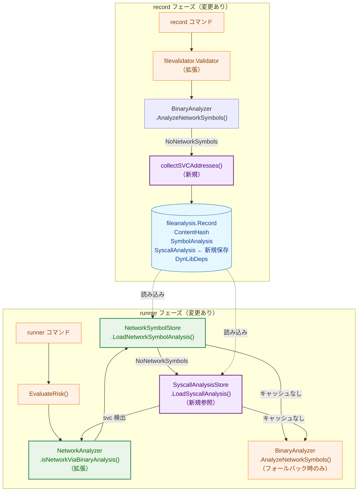
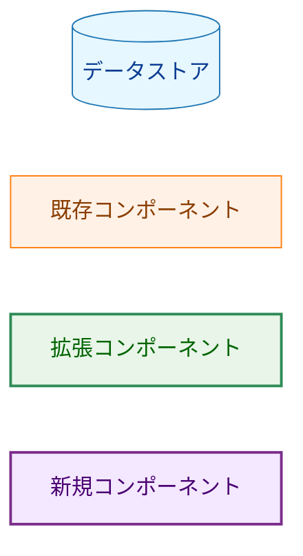
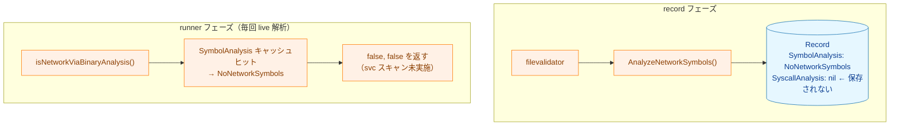
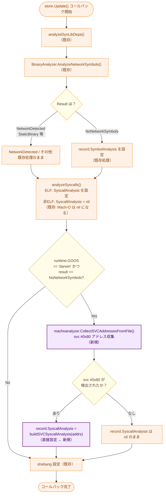
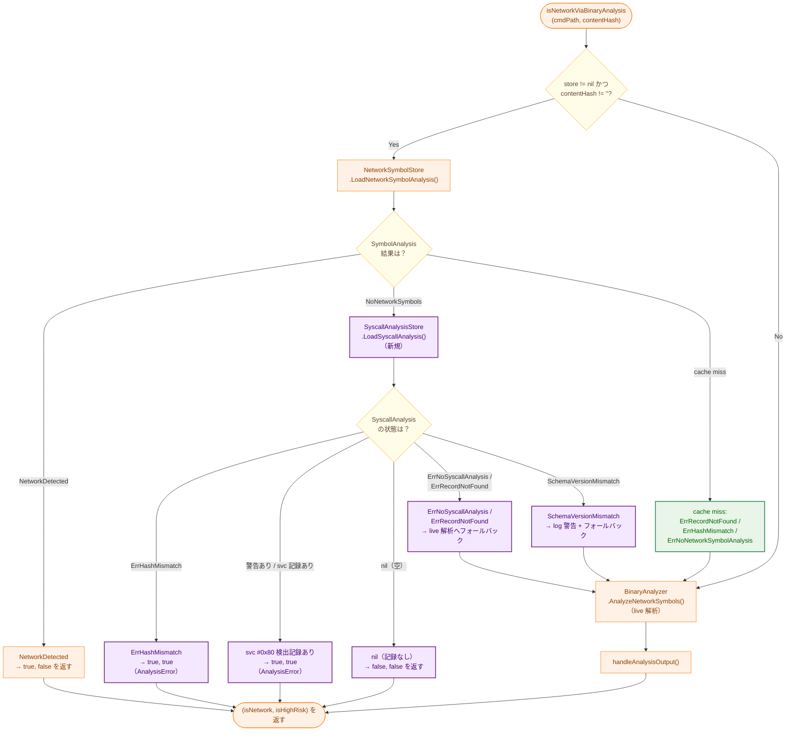
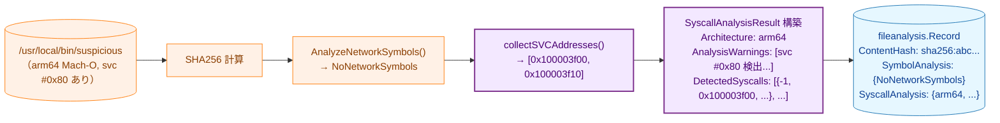
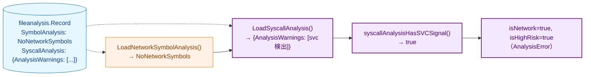

# Mach-O arm64 svc #0x80 キャッシュ統合・CGO フォールバック アーキテクチャ設計書

## 1. システム概要

### 1.1 目的

本タスクは以下の2つの問題を解消する。

1. **svc #0x80 スキャン結果の未キャッシュ**
   `record` 時に `svc #0x80` スキャン結果を `SyscallAnalysis` へ保存し、`runner` がキャッシュを利用できるようにする。

2. **SymbolAnalysis キャッシュヒット時の svc スキャン迂回（セキュリティ問題）**
   `SymbolAnalysis = NoNetworkSymbols` の Mach-O バイナリに対して、`runner` が `SyscallAnalysis` キャッシュを追加参照することで、キャッシュ経由の検出迂回を防ぐ。

ELF 版タスク 0077 の「CGO バイナリフォールバック」パターンを Mach-O に対応させ、`record` → `runner` の一貫したキャッシュフローを実現する。

### 1.2 設計原則

- **Security First**: `svc #0x80` は番号解析の有無によらず常に `AnalysisError`（高リスク）とする。`ErrHashMismatch` は安全側フェイルセーフとして `AnalysisError` を返す
- **DRY**: `SyscallAnalysis` の保存・読み込みパターン（タスク 0070/0072/0077）をそのまま踏襲する
- **Non-Breaking Change**: ELF バイナリの解析フローを変更しない。スキーマバージョンを変更しない
- **YAGNI**: syscall 番号（`x16` レジスタ）解析は行わず、`svc #0x80` の有無のみをシグナルとして扱う

## 2. システムアーキテクチャ

### 2.1 全体構成図



**凡例（Legend）**



### 2.2 変更前後の比較

#### 変更前: svc スキャン結果が未キャッシュ



**問題**: `SymbolAnalysis` キャッシュヒット後に `svc #0x80` スキャンが迂回される。

#### 変更後: SyscallAnalysis キャッシュを追加参照

```mermaid
flowchart TB
    classDef data fill:#e6f7ff,stroke:#1f77b4,stroke-width:1px,color:#0b3d91;
    classDef process fill:#fff1e6,stroke:#ff7f0e,stroke-width:1px,color:#8a3e00;
    classDef enhanced fill:#e8f5e8,stroke:#2e8b57,stroke-width:2px,color:#006400;
    classDef new fill:#f3e8ff,stroke:#7b2d8b,stroke-width:2px,color:#4a0072;

    subgraph RecordPhase["record フェーズ（変更あり）"]
        FV2["filevalidator（拡張）"]
        BA2["AnalyzeNetworkSymbols()"]
        SVC2["collectSVCAddresses()（新規）"]
        STORE2[("Record<br>SymbolAnalysis: NoNetworkSymbols<br>SyscallAnalysis: {arch: arm64, ...} ← 保存")]
    end

    subgraph RunnerPhase["runner フェーズ（変更あり）"]
        NA2["isNetworkViaBinaryAnalysis()（拡張）"]
        SYMHIT2["SymbolAnalysis キャッシュヒット<br>→ NoNetworkSymbols"]
        SVCCHECK["SyscallAnalysis キャッシュ参照（新規）"]
        BLOCK["true, true を返す<br>（AnalysisError）"]
    end

    FV2 --> BA2
    BA2 -->|"NoNetworkSymbols"| SVC2
    SVC2 --> STORE2

    NA2 --> SYMHIT2 --> SVCCHECK --> BLOCK

    class STORE2 data;
    class FV2,BA2,NA2 process;
    class SYMHIT2 enhanced;
    class SVC2,SVCCHECK,BLOCK new;
```



## 3. コンポーネント設計

### 3.1 `machodylib` パッケージの変更

#### 3.1.1 `svc_scanner.go` の拡張

既存の `containsSVCInstruction(f *macho.File) (bool, error)` に加えて、
各 `svc #0x80` の仮想アドレスを収集する 2 つの関数を追加する。

```go
// collectSVCAddresses scans the __TEXT,__text section of a Mach-O file
// and returns the virtual addresses of all svc #0x80 instructions found.
// Returns nil, nil if no svc #0x80 found, or if the architecture is not arm64.
func collectSVCAddresses(f *macho.File) ([]uint64, error)

// CollectSVCAddressesFromFile opens filePath via the given FileSystem and returns
// the virtual addresses of all svc #0x80 instructions found in the Mach-O binary.
// Returns nil, nil if the file is not a Mach-O arm64 binary, or if no svc found.
// Called by filevalidator on darwin to record svc scan results.
func CollectSVCAddressesFromFile(filePath string, fs safefileio.FileSystem) ([]uint64, error)
```

**`collectSVCAddresses` の実装の詳細**:
- `__TEXT,__text` セクションを 4 バイトアラインで走査（ARM64 固定幅命令を前提）
- `svc #0x80` エンコード（`0xD4001001`、リトルエンディアン）にマッチした命令のアドレスを収集
- セクションの `Addr`（仮想アドレスベース）にオフセットを加算して仮想アドレスを算出
- arm64 以外のアーキテクチャでは即座に `nil, nil` を返す

**`CollectSVCAddressesFromFile` の実装の詳細**:
- `safefileio.SafeOpenFile` でファイルを開く
- ファイル先頭 4 バイトで Mach-O/Fat マジックを確認し、非 Mach-O なら `nil, nil` を返す
- Fat バイナリの場合は全スライスを試行し arm64 スライスのみ `collectSVCAddresses` を呼ぶ
- 単一アーキテクチャ Mach-O の場合は直接 `collectSVCAddresses` を呼ぶ
- Mach-O ファイルでもパースエラーの場合はエラーを返す

既存の `containsSVCInstruction` は `collectSVCAddresses` を呼び出す形に変更し、
重複ロジックを排除する（DRY）。

#### 3.1.2 Fat バイナリへの対応

`CollectSVCAddressesFromFile` は Fat バイナリの各スライスを順次試行する。
各 arm64 スライスに対して `collectSVCAddresses` を呼び出し、アドレスを単純に連結して返す。
Fat バイナリ内では各スライスが独立した仮想アドレス空間を持つため、アドレスの重複排除は行わない。
`analyzeAllFatSlices()` とは独立した処理であり、`filevalidator` 側から直接呼び出す。

### 3.2 `filevalidator` パッケージの変更

#### 3.2.1 `updateAnalysisRecord` の拡張

`store.Update()` コールバック内に Mach-O svc スキャンを追加する。

**実装上の重要な注意**: 既存の `analyzeSyscalls()` は非ELFファイルに対して
`record.SyscallAnalysis = nil`（「stale 値を消去」）を設定する。
Mach-O svc スキャンは `analyzeSyscalls()` の**後**に実行し、
`record.SyscallAnalysis` を直接上書きすることで、この消去を回避する。
`SaveSyscallAnalysis()` は呼び出さない（コールバック内で直接設定する）。



**`SymbolAnalysis = NetworkDetected` 時の svc スキャンについて**:
要件 FR-3.2.2 は「NetworkDetected 時も svc スキャンを継続すべき」と記述しているが、
同要件の受け入れ条件 AC-1 および テスト表（§6.1）は「NetworkDetected の場合は
`SyscallAnalysis` が保存されないこと」と規定している。
`runner` は `SymbolAnalysis = NoNetworkSymbols` の場合のみ `SyscallAnalysis` を参照するため、
NetworkDetected バイナリに svc 結果を保存しても実用上の追加セキュリティ効果はない。
よって本アーキテクチャは AC-1 に従い、**NetworkDetected 時は svc スキャンをスキップする**。

**`buildSVCSyscallAnalysis` の出力（svc #0x80 検出時）**:

| フィールド | 値 |
|-----------|-----|
| `Architecture` | `"arm64"` |
| `AnalysisWarnings` | `["svc #0x80 を検出: libSystem.dylib を迂回した直接 syscall が存在する"]` |
| `DetectedSyscalls[n].Number` | `-1`（syscall 番号は解析しない） |
| `DetectedSyscalls[n].Location` | 各 `svc #0x80` の仮想アドレス |
| `DetectedSyscalls[n].Source` | `"direct_svc_0x80"` |
| `DetectedSyscalls[n].DeterminationMethod` | `"direct_svc_0x80"` |

**保存しない場合**: `svc #0x80` が 0 件の場合は `record.SyscallAnalysis` を `nil` のままにする。

**`CollectSVCAddressesFromFile` エラー時の処理**:
`CollectSVCAddressesFromFile` がエラーを返した場合、`updateAnalysisRecord` はそのエラーを返して
レコード保存を中断する（`AnalysisError` と同様、安全側フェイルセーフ）。

#### 3.2.2 `--force` フラグとの整合性

Mach-O svc スキャン結果は `store.Update()` コールバック内で `record.SyscallAnalysis` に
直接設定するため、`--force` の有無にかかわらず常に最新の値で上書きされる（追加変更不要）。

### 3.3 `runner/security` パッケージの変更

#### 3.3.1 `isNetworkViaBinaryAnalysis` の拡張フロー



#### 3.3.2 SyscallAnalysis 高リスク判定ロジック

`SyscallAnalysis` からの判定は以下のいずれかを満たす場合に `AnalysisError`（高リスク）とする：

- `SyscallAnalysisData.AnalysisWarnings` が空でない
- `SyscallAnalysisData.DetectedSyscalls` に `DeterminationMethod == "direct_svc_0x80"` のエントリが存在する

この判定ロジックは `syscallAnalysisHasSVCSignal(data *SyscallAnalysisData) bool` として分離し、テスト容易性を高める。

#### 3.3.3 エラーハンドリングまとめ

| エラー種別 | 処理 | 理由 |
|-----------|------|------|
| `ErrRecordNotFound` | フォールバック | 古い record（svc 未保存）との互換性 |
| `ErrNoSyscallAnalysis` | フォールバック | svc #0x80 が存在しなかった正常ケース |
| `ErrHashMismatch` | `AnalysisError` を返す | ファイル改ざんの可能性 → 安全側フェイルセーフ |
| `SchemaVersionMismatchError` | ログ警告 + フォールバック | スキーマ変更に対する寛容性 |
| その他エラー | フォールバック | 予期しない問題に対する寛容性 |

## 4. データフロー

### 4.1 `record` フェーズのデータフロー（Mach-O、svc #0x80 あり）



### 4.2 `runner` フェーズのデータフロー（SyscallAnalysis キャッシュヒット）



## 5. インターフェース定義

### 5.1 `collectSVCAddresses` 関数（新規）

```go
// collectSVCAddresses scans the __TEXT,__text section of a Mach-O file
// and returns the virtual addresses of all svc #0x80 instructions found.
// Returns nil, nil if no svc #0x80 found, or if the architecture is not arm64.
func collectSVCAddresses(f *macho.File) ([]uint64, error)
```

**場所**: `internal/runner/security/machoanalyzer/svc_scanner.go`

### 5.2 `syscallAnalysisHasSVCSignal` 関数（新規）

```go
// syscallAnalysisHasSVCSignal reports whether the given SyscallAnalysisData
// contains evidence of svc #0x80 direct syscall usage.
func syscallAnalysisHasSVCSignal(data *fileanalysis.SyscallAnalysisData) bool
```

**場所**: `internal/runner/security/network_analyzer.go`

### 5.3 `NetworkAnalyzer` への `syscallStore` 追加

現在の `NetworkAnalyzer` は `store fileanalysis.NetworkSymbolStore` のみを持つ。
本タスクで `syscallStore fileanalysis.SyscallAnalysisStore` フィールドを新規追加し、
新コンストラクタで注入する。

```go
type NetworkAnalyzer struct {
    binaryAnalyzer binaryanalyzer.BinaryAnalyzer
    store          fileanalysis.NetworkSymbolStore  // 既存
    syscallStore   fileanalysis.SyscallAnalysisStore // 新規
}

// NewNetworkAnalyzerWithStores creates a NetworkAnalyzer with both symbol and syscall stores.
// If either store is nil, the corresponding cache is disabled.
func NewNetworkAnalyzerWithStores(
    symStore fileanalysis.NetworkSymbolStore,
    svcStore fileanalysis.SyscallAnalysisStore,
) *NetworkAnalyzer
```

`fileanalysis.SyscallAnalysisStore` インターフェースは変更なし:

```go
type SyscallAnalysisStore interface {
    LoadSyscallAnalysis(filePath string, expectedHash string) (*SyscallAnalysisResult, error)
    SaveSyscallAnalysis(filePath, fileHash string, result *SyscallAnalysisResult) error
}
```

既存の `NewNetworkAnalyzerWithStore(store fileanalysis.NetworkSymbolStore)` は後方互換のため残す（`syscallStore = nil`）。

## 6. スキーマ変更

### 6.1 スキーマバージョン

本タスクでは**スキーマバージョンを変更しない**（引き続き v14）。
`SyscallAnalysis` は既存の任意フィールドであり、`nil` の場合は
`ErrNoSyscallAnalysis` として live 解析にフォールバックする。

### 6.2 `SyscallAnalysisData` フィールドの使用

既存の `SyscallAnalysisData` 構造体をそのまま使用する（変更なし）。

```go
type SyscallAnalysisData struct {
    Architecture     string
    DetectedSyscalls []common.SyscallInfo
    AnalysisWarnings []string
    ArgEvalResults   []common.SyscallArgEvalResult
}
```

`common.SyscallInfo` の各フィールドの使用方針：

| フィールド | 値 | 補足 |
|-----------|-----|------|
| `Number` | `-1` | syscall 番号は解析しない（YAGNI） |
| `Name` | `""` | 同上 |
| `IsNetwork` | `false` | 直接 syscall の種別は不明 |
| `Location` | 仮想アドレス | `svc #0x80` 命令のアドレス |
| `DeterminationMethod` | `"direct_svc_0x80"` | 検出方法の識別子 |
| `Source` | `"direct_svc_0x80"` | 検出ソースの識別子 |

## 7. 変更対象ファイル一覧

| ファイル | 変更種別 | 変更内容 |
|---------|---------|---------|
| `internal/runner/security/machoanalyzer/svc_scanner.go` | 拡張 | `collectSVCAddresses()` 追加（パッケージプライベート）、`CollectSVCAddressesFromFile()` 追加（exported）、`containsSVCInstruction()` を `collectSVCAddresses()` に委譲してリファクタリング |
| `internal/filevalidator/validator.go` | 拡張 | `updateAnalysisRecord()` の `store.Update()` コールバック内で `analyzeSyscalls()` の後に `machoanalyzer.CollectSVCAddressesFromFile()` を呼び出し、`record.SyscallAnalysis` を直接設定 |
| `internal/runner/security/network_analyzer.go` | 拡張 | `NetworkAnalyzer` に `syscallStore` フィールドを追加。`NewNetworkAnalyzerWithStores()` を追加。`isNetworkViaBinaryAnalysis()` で `NoNetworkSymbols` 後に `SyscallAnalysis` キャッシュを参照。`syscallAnalysisHasSVCSignal()` を追加 |

## 8. 先行タスクとの関係

| 先行タスク | 再利用コンポーネント |
|----------|------------------|
| 0073 (Mach-O ネットワーク検出) | `containsSVCInstruction` → `collectSVCAddresses` にリファクタリング |
| 0076 (ネットワークシンボルキャッシュ) | `isNetworkViaBinaryAnalysis` のキャッシュ参照フロー |
| 0077 (CGO バイナリフォールバック) | `SyscallAnalysisStore` の注入パターンと `ErrHashMismatch` の安全側フェイルセーフ |
