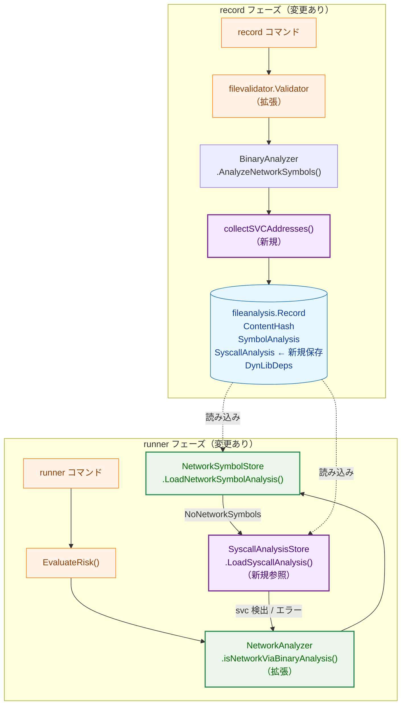
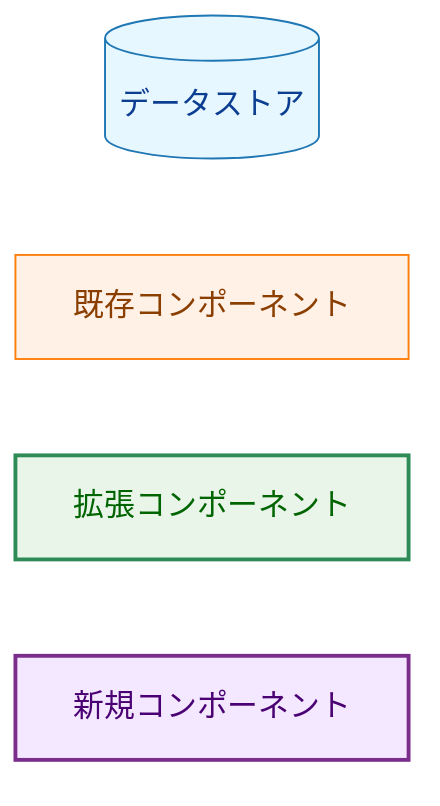
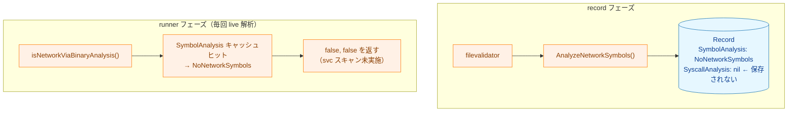
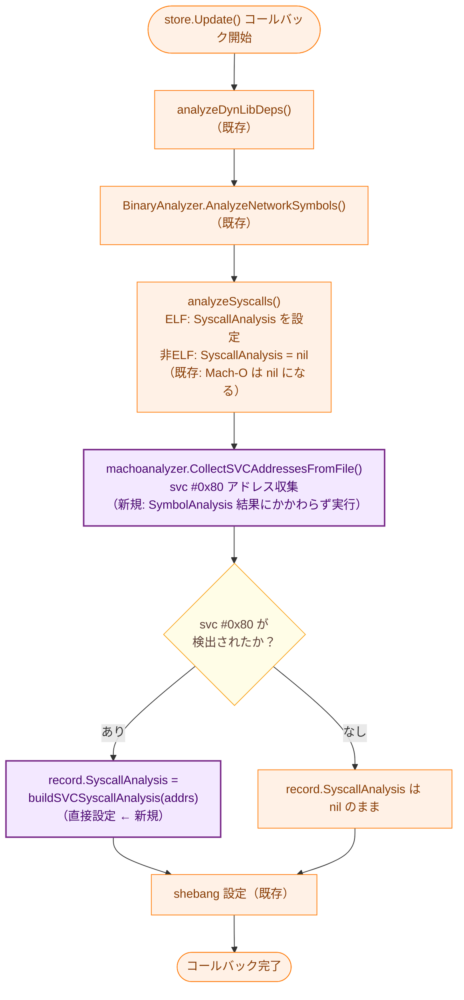
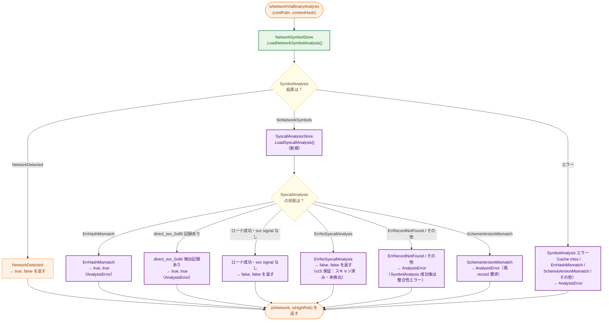
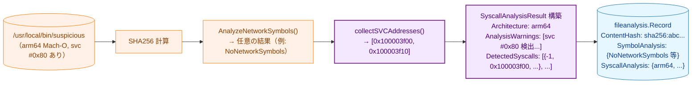
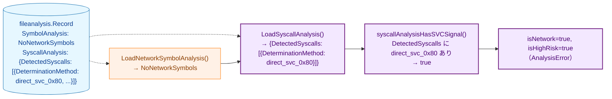

# Mach-O arm64 svc #0x80 キャッシュ統合・CGO フォールバック アーキテクチャ設計書

## 1. システム概要

### 1.1 目的

本タスクは以下の2つの問題を解消する。

1. **svc #0x80 スキャン結果の未キャッシュ**
   `record` 時に `svc #0x80` スキャン結果を `SyscallAnalysis` へ保存し、`runner` がキャッシュを利用できるようにする。

2. **SymbolAnalysis キャッシュヒット時の svc スキャン迂回（セキュリティ問題）**
   `SymbolAnalysis = NoNetworkSymbols` の Mach-O バイナリに対して、`runner` が `SyscallAnalysis` キャッシュを追加参照することで、キャッシュ経由の検出迂回を防ぐ。

ELF 版タスク 0077 の「CGO バイナリフォールバック」パターンを Mach-O に対応させ、`record` → `runner` の一貫したキャッシュフローを実現する。

### 1.2 設計原則

- **Security First**: `svc #0x80` は番号解析の有無によらず常に `AnalysisError`（高リスク）とする。`ErrHashMismatch` は安全側フェイルセーフとして `AnalysisError` を返す
- **DRY**: `SyscallAnalysis` の保存・読み込みパターン（タスク 0070/0072/0077）をそのまま踏襲する
- **Non-Breaking Change**: ELF バイナリの解析フローを変更しない。スキーマバージョンを v15 に変更し、v14 レコードは再 `record` を強制する
- **YAGNI**: syscall 番号（`x16` レジスタ）解析は行わず、`svc #0x80` の有無のみをシグナルとして扱う

## 2. システムアーキテクチャ

### 2.1 全体構成図



**凡例（Legend）**



### 2.2 変更前後の比較

#### 変更前: svc スキャン結果が未キャッシュ



**問題**: `SymbolAnalysis` キャッシュヒット後に `svc #0x80` スキャンが迂回される。

#### 変更後: SyscallAnalysis キャッシュを追加参照

```mermaid
flowchart TB
    classDef data fill:#e6f7ff,stroke:#1f77b4,stroke-width:1px,color:#0b3d91;
    classDef process fill:#fff1e6,stroke:#ff7f0e,stroke-width:1px,color:#8a3e00;
    classDef enhanced fill:#e8f5e8,stroke:#2e8b57,stroke-width:2px,color:#006400;
    classDef new fill:#f3e8ff,stroke:#7b2d8b,stroke-width:2px,color:#4a0072;

    subgraph RecordPhase["record フェーズ（変更あり）"]
        FV2["filevalidator（拡張）"]
        BA2["AnalyzeNetworkSymbols()"]
        SVC2["collectSVCAddresses()（新規）"]
        STORE2[("Record<br>SymbolAnalysis: NoNetworkSymbols<br>SyscallAnalysis: {arch: arm64, ...} ← 保存")]
    end

    subgraph RunnerPhase["runner フェーズ（変更あり）"]
        NA2["isNetworkViaBinaryAnalysis()（拡張）"]
        SYMHIT2["SymbolAnalysis キャッシュヒット<br>→ NoNetworkSymbols"]
        SVCCHECK["SyscallAnalysis キャッシュ参照（新規）"]
        BLOCK["true, true を返す<br>（AnalysisError）"]
    end

    FV2 --> BA2
    BA2 --> SVC2
    SVC2 --> STORE2

    NA2 --> SYMHIT2 --> SVCCHECK --> BLOCK

    class STORE2 data;
    class FV2,BA2,NA2 process;
    class SYMHIT2 enhanced;
    class SVC2,SVCCHECK,BLOCK new;
```



## 3. コンポーネント設計

### 3.1 `machoanalyzer` パッケージの変更

#### 3.1.1 `svc_scanner.go` の拡張

既存の `containsSVCInstruction(f *macho.File) (bool, error)` に加えて、
各 `svc #0x80` の仮想アドレスを収集する 2 つの関数を追加する。

```go
// collectSVCAddresses scans the __TEXT,__text section of a Mach-O file
// and returns the virtual addresses of all svc #0x80 instructions found.
// Returns nil, nil if no svc #0x80 found, or if the architecture is not arm64.
func collectSVCAddresses(f *macho.File) ([]uint64, error)

// CollectSVCAddressesFromFile opens filePath via the given FileSystem and returns
// the virtual addresses of all svc #0x80 instructions found in the Mach-O binary.
// Returns nil, nil if the file is not a Mach-O arm64 binary, or if no svc found.
// Called by filevalidator to record svc scan results; safe to call
// cross-platform because Mach-O detection relies on file magic bytes, not build tags.
func CollectSVCAddressesFromFile(filePath string, fs safefileio.FileSystem) ([]uint64, error)
```

**`collectSVCAddresses` の実装の詳細**:
- `__TEXT,__text` セクションを 4 バイトアラインで走査（ARM64 固定幅命令を前提）
- `svc #0x80` エンコード（`0xD4001001`、リトルエンディアン）にマッチした命令のアドレスを収集
- セクションの `Addr`（仮想アドレスベース）にオフセットを加算して仮想アドレスを算出
- arm64 以外のアーキテクチャでは即座に `nil, nil` を返す

**`CollectSVCAddressesFromFile` の実装の詳細**:
- `fs.SafeOpenFile` でファイルを開く
- ファイル先頭 4 バイトで Mach-O/Fat マジックを確認し、非 Mach-O なら `nil, nil` を返す
- Fat バイナリの場合は全スライスを試行し arm64 スライスのみ `collectSVCAddresses` を呼ぶ
- 単一アーキテクチャ Mach-O の場合は直接 `collectSVCAddresses` を呼ぶ
- Mach-O ファイルでもパースエラーの場合はエラーを返す

既存の `containsSVCInstruction` は `collectSVCAddresses` を呼び出す形に変更し、
重複ロジックを排除する（DRY）。

#### 3.1.2 Fat バイナリへの対応

`CollectSVCAddressesFromFile` は Fat バイナリの各スライスを順次試行する。
各 arm64 スライスに対して `collectSVCAddresses` を呼び出し、アドレスを単純に連結して返す。
Fat バイナリ内では各スライスが独立した仮想アドレス空間を持つため、アドレスの重複排除は行わない。
`analyzeAllFatSlices()` とは独立した処理であり、`filevalidator` 側から直接呼び出す。

### 3.2 `filevalidator` パッケージの変更

#### 3.2.1 `updateAnalysisRecord` の拡張

`store.Update()` コールバック内に Mach-O svc スキャンを追加する。

**実装上の重要な注意**: 既存の `analyzeSyscalls()` は非ELFファイルに対して
`record.SyscallAnalysis = nil`（「stale 値を消去」）を設定する。
Mach-O svc スキャンは `analyzeSyscalls()` の**後**に実行し、
`record.SyscallAnalysis` を直接上書きすることで、この消去を回避する。
`SaveSyscallAnalysis()` は呼び出さない（コールバック内で直接設定する）。



**`SymbolAnalysis = NetworkDetected` 時の svc スキャンについて**:
`record` は `SymbolAnalysis` の結果にかかわらず svc スキャンを実行し、検出結果を保存する。
`runner` が `NetworkDetected` 時に `SyscallAnalysis` を参照しないという判断は `runner` 側で行う（FR-3.2.2 参照）。
これにより `record` の責務（バイナリ状態の記録）と `runner` の責務（脅威判断）の境界が明確になる。

**`buildSVCSyscallAnalysis` の出力（svc #0x80 検出時）**:

| フィールド | 値 |
|-----------|-----|
| `Architecture` | `"arm64"` |
| `AnalysisWarnings` | `["svc #0x80 detected: direct syscall bypassing libSystem.dylib"]` |
| `DetectedSyscalls[n].Number` | `-1`（syscall 番号は解析しない） |
| `DetectedSyscalls[n].Location` | 各 `svc #0x80` の仮想アドレス |
| `DetectedSyscalls[n].Source` | `"direct_svc_0x80"` |
| `DetectedSyscalls[n].DeterminationMethod` | `"direct_svc_0x80"` |

**保存しない場合**: `svc #0x80` が 0 件の場合は `record.SyscallAnalysis` を `nil` のままにする。

**`CollectSVCAddressesFromFile` エラー時の処理**:
`CollectSVCAddressesFromFile` がエラーを返した場合、`updateAnalysisRecord` はそのエラーを返して
レコード保存を中断する（`AnalysisError` と同様、安全側フェイルセーフ）。

#### 3.2.2 `--force` フラグとの整合性

Mach-O svc スキャン結果は `store.Update()` コールバック内で `record.SyscallAnalysis` に
直接設定するため、`--force` の有無にかかわらず常に最新の値で上書きされる（追加変更不要）。

### 3.3 `runner/security` パッケージの変更

#### 3.3.1 `isNetworkViaBinaryAnalysis` の拡張フロー



#### 3.3.2 SyscallAnalysis 高リスク判定ロジック

`SyscallAnalysis` からの判定は以下を満たす場合に `AnalysisError`（高リスク）とする：

- `SyscallAnalysisResult.DetectedSyscalls` に `DeterminationMethod == "direct_svc_0x80"` のエントリが存在する

`AnalysisWarnings` は ELF 側の syscall 解析を含む汎用的な警告を含み得るため、`svc #0x80` 検出の高リスク判定条件には使用しない。

この判定ロジックは `syscallAnalysisHasSVCSignal(result *SyscallAnalysisResult) bool` として分離し、テスト容易性と判定根拠の明確性を高める。

#### 3.3.3 ストア注入チェーンの変更

`SyscallAnalysisStore` を `NetworkAnalyzer` まで到達させるため、既存の
`NetworkSymbolStore` 注入チェーンを以下のように拡張する。

1. `verification.Manager` に `GetSyscallAnalysisStore() fileanalysis.SyscallAnalysisStore` を追加する
2. `runner.createNormalResourceManager()` で path resolver から `NetworkSymbolStore` と
    `SyscallAnalysisStore` の両方を取得する
3. `resource.NewDefaultResourceManager()` に `SyscallAnalysisStore` 引数を追加する
4. `resource.NewNormalResourceManagerWithOutput()` に `SyscallAnalysisStore` 引数を追加する
5. `risk.NewStandardEvaluator()` に `SyscallAnalysisStore` 引数を追加し、
    `security.NewNetworkAnalyzerWithStores()` を呼び出す

この変更により、live 解析フォールバックを維持したまま、`runner` の通常実行パスでも
`SyscallAnalysis` キャッシュを利用できる。

#### 3.3.4 エラーハンドリングまとめ

**SymbolAnalysis 読み込みエラー**

| エラー種別 | 処理 | 理由 |
|-----------|------|------|
| すべてのエラー（`ErrRecordNotFound` / `ErrHashMismatch` / `SchemaVersionMismatchError` / その他） | `AnalysisError` を返す | production では record 済みが前提 → live 解析フォールバックなし |

**SyscallAnalysis 読み込みエラー**

| エラー種別 | 処理 | 理由 |
|-----------|------|------|
| `ErrNoSyscallAnalysis` | `false, false` を返す | v15 スキーマ保証：スキャン実施済み・svc 未検出 |
| `ErrHashMismatch` | `AnalysisError` を返す | ファイル改ざんの可能性 → 安全側フェイルセーフ |
| `SchemaVersionMismatchError` | `AnalysisError` を返す | v14 以前 → 再 `record` を要求 |
| `ErrRecordNotFound` / その他エラー | `AnalysisError` を返す | SymbolAnalysis ロード成功後は record が必ず存在するため整合性エラー |

`isNetworkViaBinaryAnalysis` 内の live 解析コード（`a.binaryAnalyzer.AnalyzeNetworkSymbols()`）は
完全に削除する。すべてのケースが直接 return するため、フォールバックパスは不要となる。

## 4. データフロー

### 4.1 `record` フェーズのデータフロー（Mach-O、svc #0x80 あり）

`record` は `SymbolAnalysis` の結果にかかわらず svc スキャンを実行する。
以下は `SymbolAnalysis = NoNetworkSymbols` の例だが、`NetworkDetected` の場合も同様に svc スキャン結果が保存される。



### 4.2 `runner` フェーズのデータフロー（SyscallAnalysis キャッシュヒット）



## 5. インターフェース定義

### 5.1 `collectSVCAddresses` 関数（新規）

```go
// collectSVCAddresses scans the __TEXT,__text section of a Mach-O file
// and returns the virtual addresses of all svc #0x80 instructions found.
// Returns nil, nil if no svc #0x80 found, or if the architecture is not arm64.
func collectSVCAddresses(f *macho.File) ([]uint64, error)
```

**場所**: `internal/runner/security/machoanalyzer/svc_scanner.go`

### 5.2 `syscallAnalysisHasSVCSignal` 関数（新規）

```go
// syscallAnalysisHasSVCSignal reports whether the given SyscallAnalysisResult
// contains evidence of svc #0x80 direct syscall usage.
func syscallAnalysisHasSVCSignal(result *fileanalysis.SyscallAnalysisResult) bool
```

**場所**: `internal/runner/security/network_analyzer.go`

### 5.3 `NetworkAnalyzer` への `syscallStore` 追加

現在の `NetworkAnalyzer` は `store fileanalysis.NetworkSymbolStore` のみを持つ。
本タスクで `syscallStore fileanalysis.SyscallAnalysisStore` フィールドを新規追加し、
新コンストラクタで注入する。

```go
type NetworkAnalyzer struct {
    binaryAnalyzer binaryanalyzer.BinaryAnalyzer
    store          fileanalysis.NetworkSymbolStore  // 既存
    syscallStore   fileanalysis.SyscallAnalysisStore // 新規
}

// NewNetworkAnalyzerWithStores creates a NetworkAnalyzer with both symbol and syscall stores.
// If either store is nil, the corresponding cache is disabled.
func NewNetworkAnalyzerWithStores(
    symStore fileanalysis.NetworkSymbolStore,
    svcStore fileanalysis.SyscallAnalysisStore,
) *NetworkAnalyzer
```

`fileanalysis.SyscallAnalysisStore` インターフェースは変更なし:

```go
type SyscallAnalysisStore interface {
    LoadSyscallAnalysis(filePath string, expectedHash string) (*SyscallAnalysisResult, error)
    SaveSyscallAnalysis(filePath, fileHash string, result *SyscallAnalysisResult) error
}
```

既存の `NewNetworkAnalyzerWithStore(store fileanalysis.NetworkSymbolStore)` は後方互換のため残す（`syscallStore = nil`）。

## 6. スキーマ変更

### 6.1 スキーマバージョン

本タスクで**スキーマバージョンを v14 から v15 に変更する**。
v15 スキーマ自体が「svc スキャンを実施済み」であることを保証するため、
`SyscallAnalysis` が `nil`（`ErrNoSyscallAnalysis`）の場合は「スキャン済み・svc 未検出」を意味し、
`runner` は live 解析へフォールバックせず `false, false` を返す。
v14 以前のレコードは `SchemaVersionMismatchError` を返し、再 `record` を要求する。

### 6.2 `SyscallAnalysisData` フィールドの使用

既存の `SyscallAnalysisData` 構造体をそのまま使用する（変更なし）。

```go
type SyscallAnalysisData struct {
    // SyscallAnalysisResultCore contains the common fields shared with
    // elfanalyzer.SyscallAnalysisResult. Embedding ensures field-level
    // compatibility between the two types.
    common.SyscallAnalysisResultCore
}
```

`common.SyscallInfo` の各フィールドの使用方針：

| フィールド | 値 | 補足 |
|-----------|-----|------|
| `Number` | `-1` | syscall 番号は解析しない（YAGNI） |
| `Name` | `""` | 同上 |
| `IsNetwork` | `false` | 直接 syscall の種別は不明 |
| `Location` | 仮想アドレス | `svc #0x80` 命令のアドレス |
| `DeterminationMethod` | `"direct_svc_0x80"` | 検出方法の識別子 |
| `Source` | `"direct_svc_0x80"` | 検出ソースの識別子 |

## 7. 変更対象ファイル一覧

| ファイル | 変更種別 | 変更内容 |
|---------|---------|---------|
| `internal/runner/security/machoanalyzer/svc_scanner.go` | 拡張 | `collectSVCAddresses()` 追加（パッケージプライベート）、`CollectSVCAddressesFromFile()` 追加（exported）、`containsSVCInstruction()` を `collectSVCAddresses()` に委譲してリファクタリング |
| `internal/filevalidator/validator.go` | 拡張 | `updateAnalysisRecord()` の `store.Update()` コールバック内で `analyzeSyscalls()` の後に `machoanalyzer.CollectSVCAddressesFromFile()` を呼び出し、`record.SyscallAnalysis` を直接設定 |
| `internal/runner/security/network_analyzer.go` | 拡張 | `NetworkAnalyzer` に `syscallStore` フィールドを追加。`NewNetworkAnalyzerWithStores()` を追加。`isNetworkViaBinaryAnalysis()` で `NoNetworkSymbols` 後に `SyscallAnalysis` キャッシュを参照。`syscallAnalysisHasSVCSignal()` を追加 |
| `internal/runner/risk/evaluator.go` | 拡張 | `NewStandardEvaluator()` に `SyscallAnalysisStore` を注入し、`NewNetworkAnalyzerWithStores()` を呼び出す |
| `internal/runner/resource/normal_manager.go` | 拡張 | `NewNormalResourceManagerWithOutput()` に `SyscallAnalysisStore` 引数を追加し、risk evaluator へ転送 |
| `internal/runner/resource/default_manager.go` | 拡張 | `NewDefaultResourceManager()` に `SyscallAnalysisStore` 引数を追加し、normal manager へ転送 |
| `internal/runner/runner.go` | 拡張 | path resolver から `GetSyscallAnalysisStore()` を取得し、resource manager 構築時に注入 |
| `internal/verification/manager.go` | 拡張 | `GetSyscallAnalysisStore()` を追加し、verification と runner が同一 hash dir の syscall store を共有できるようにする |

## 8. 先行タスクとの関係

| 先行タスク | 再利用コンポーネント |
|----------|------------------|
| 0073 (Mach-O ネットワーク検出) | `containsSVCInstruction` → `collectSVCAddresses` にリファクタリング |
| 0076 (ネットワークシンボルキャッシュ) | `isNetworkViaBinaryAnalysis` のキャッシュ参照フロー |
| 0077 (CGO バイナリフォールバック) | `SyscallAnalysisStore` の注入パターンと `ErrHashMismatch` の安全側フェイルセーフ |
