# libSystem.dylib syscall ラッパー関数キャッシュ アーキテクチャ設計書

## 1. システム概要

### 1.1 目的

`libSystem.dylib`（実体: `libsystem_kernel.dylib`）のエクスポート関数を関数単位で静的解析し、
「エクスポート関数名 → 実測 BSD syscall 番号」のマッピングをキャッシュする機能を実装する。
これにより、動的リンク Mach-O バイナリが libSystem 経由で呼び出すネットワーク syscall を
インポートシンボル照合によって検出できるようにする。

macOS 11 以降は `libsystem_kernel.dylib` がファイルシステム上に存在しないことが多いため、
ファイルシステム上の実体を優先し、存在しない場合のみ dyld shared cache から抽出
（`blacktop/ipsw/pkg/dyld`）する。

### 1.2 設計原則

- **DRY**: ELF 版タスク 0079 の `libccache` パッケージ（スキーマ・キャッシュ I/O・ソート処理）
  を最大限再利用する。Mach-O 固有の処理のみ追加する
- **Security First**: dyld shared cache 抽出失敗はエラーにせずフォールバックし、安全側に倒す
- **YAGNI**: x86_64 Mach-O 向け解析は対象外。macOS arm64 のみ
- **Non-Breaking Change**: ELF libc キャッシュフロー・タスク 0097 の svc スキャンを変更しない。
  スキーマバージョン変更不要（`SyscallInfo` の `Source` 値追加のみ）

## 2. システムアーキテクチャ

### 2.1 全体構成図

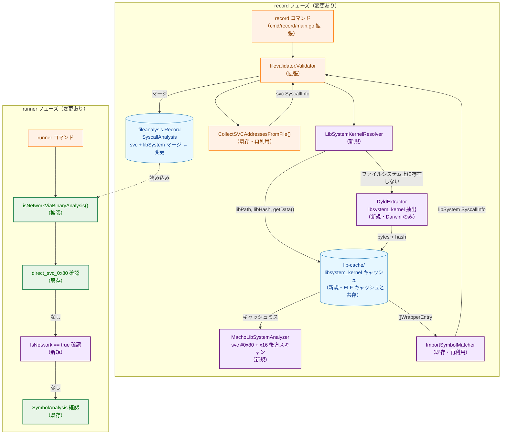

**凡例（Legend）**

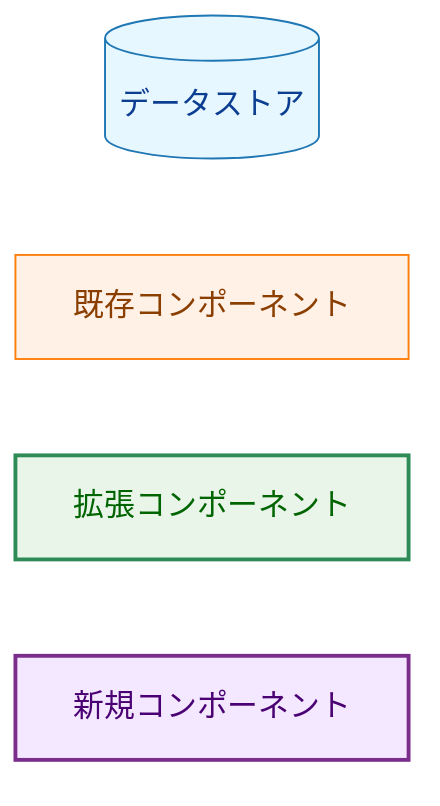

### 2.2 パッケージ構成図

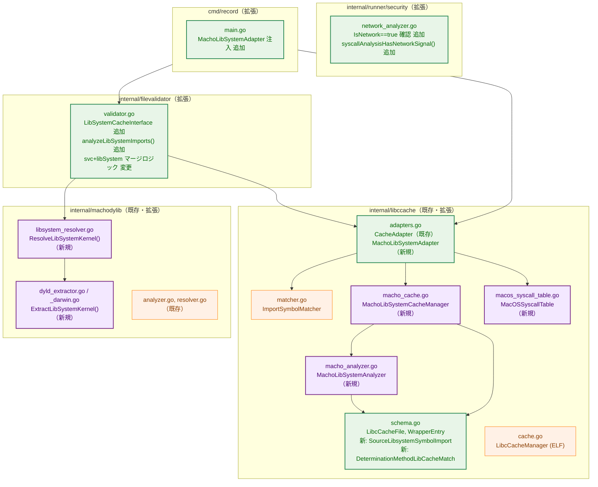

## 3. コンポーネント設計

### 3.1 macOS BSD syscall テーブル（新規）

**ファイル**: `internal/libccache/macos_syscall_table.go`

macOS arm64 の BSD syscall 番号テーブル（FR-3.5.1）を実装する。
ELF 版の `elfanalyzer.SyscallTable` と同様に `SyscallNumberTable` インターフェースを実装する。

```go
// MacOSSyscallTable implements SyscallNumberTable for macOS arm64 BSD syscalls.
type MacOSSyscallTable struct{}

// macOSSyscallEntries defines the macOS arm64 BSD syscall table.
// Keys are syscall numbers (without BSD class prefix 0x2000000).
var macOSSyscallEntries = map[int]macOSSyscallEntry{
    3:   {name: "read",        isNetwork: false},
    4:   {name: "write",       isNetwork: false},
    5:   {name: "open",        isNetwork: false},
    6:   {name: "close",       isNetwork: false},
    27:  {name: "recvmsg",     isNetwork: true},
    28:  {name: "sendmsg",     isNetwork: true},
    29:  {name: "recvfrom",    isNetwork: true},
    30:  {name: "accept",      isNetwork: true},
    31:  {name: "getpeername", isNetwork: true},
    32:  {name: "getsockname", isNetwork: true},
    74:  {name: "mprotect",    isNetwork: false},
    97:  {name: "socket",      isNetwork: true},
    98:  {name: "connect",     isNetwork: true},
    104: {name: "bind",        isNetwork: true},
    105: {name: "setsockopt",  isNetwork: true},
    106: {name: "listen",      isNetwork: true},
    118: {name: "getsockopt",  isNetwork: true},
    133: {name: "sendto",      isNetwork: true},
    134: {name: "shutdown",    isNetwork: true},
    135: {name: "socketpair",  isNetwork: true},
}
```

**注意**: `sendmmsg` / `recvmmsg` は Linux 固有であり macOS には存在しないため含めない。

### 3.2 Mach-O libSystem アナライザー（新規）

**ファイル**: `internal/libccache/macho_analyzer.go`

`libsystem_kernel.dylib` の Mach-O バイナリを関数単位で解析し、
syscall ラッパー関数の一覧（`[]WrapperEntry`）を返す。
ELF 版の `LibcWrapperAnalyzer` に相当するが、Mach-O 固有の処理を行う。

```go
// MachoLibSystemAnalyzer analyzes a libsystem_kernel.dylib Mach-O file and returns
// a list of syscall wrapper functions.
type MachoLibSystemAnalyzer struct{}

// Analyze scans exported functions in machoFile and returns WrapperEntry values
// for functions recognized as syscall wrappers.
// Returns UnsupportedArchitectureError for non-arm64 architectures.
func (a *MachoLibSystemAnalyzer) Analyze(machoFile *macho.File) ([]WrapperEntry, error)
```

**関数単位解析の処理フロー**:

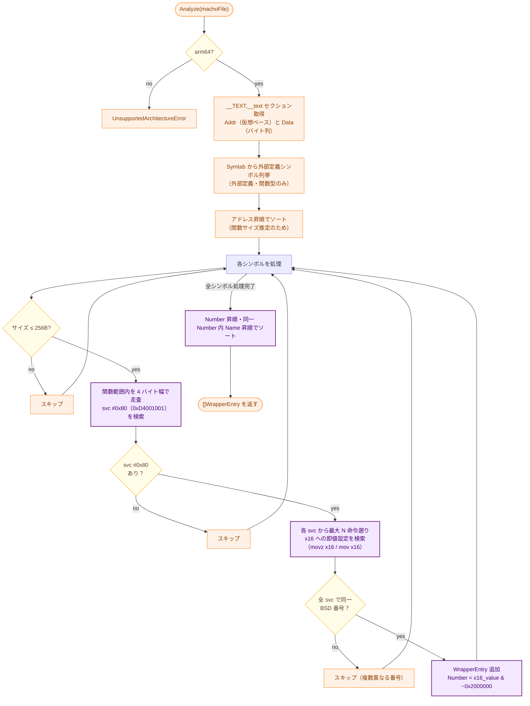

**関数サイズ推定**: Mach-O のシンボルテーブルには ELF の `st_size` 相当フィールドがないため、
アドレス昇順ソート後に隣接シンボルのアドレス差で推定する。最後のシンボルは
`__TEXT,__text` セクション終端までを使用する。

**x16 後方スキャン**: `svc #0x80` から最大 16 命令を遡り、以下の命令パターンを検出する。

- `mov x16, #imm`（`movz x16, #imm` ≡ `0xD280_0010 | (imm << 5)`）
- `movz x16, #imm, lsl #16` + `movk x16, #imm` シーケンス（上位 16 bit が必要な場合）

**BSD クラスプレフィックス除去**: `x16` の値が `0x2000000` 以上の場合、
`0x2000000` を除去した値を syscall 番号として記録する。

**ELF 版との差異**:

| 項目 | ELF 版（`LibcWrapperAnalyzer`） | Mach-O 版（`MachoLibSystemAnalyzer`） |
|------|-------------------------------|--------------------------------------|
| 対象ファイル | `*elf.File` | `*macho.File` |
| セクション | `.text` | `__TEXT,__text` |
| シンボル列挙 | `File.DynamicSymbols()` | `File.Symtab` |
| 関数サイズ | `sym.Size`（ELF フィールド） | 隣接シンボルアドレス差で推定 |
| syscall 命令 | `svc #0`（Linux ARM64）または `syscall`（x86-64） | `svc #0x80`（macOS ARM64） |
| syscall 番号 | `x8`（ARM64）または `eax`（x86-64） | `x16`（BSD クラスプレフィックス付き） |
| 後方スキャン | `elfanalyzer.SyscallAnalyzer` 経由 | `MachoLibSystemAnalyzer` 内蔵 |

### 3.3 dyld shared cache 抽出（新規）

**ファイル**: `internal/machodylib/dyld_extractor.go`（non-Darwin スタブ）
**ファイル**: `internal/machodylib/dyld_extractor_darwin.go`（Darwin 実装）

macOS 11 以降で `libsystem_kernel.dylib` がファイルシステム上に存在しない場合に
dyld shared cache から抽出する（FR-3.1.6）。

```go
// LibSystemKernelBytes holds the in-memory bytes of libsystem_kernel.dylib
// extracted from the dyld shared cache, along with its SHA-256 hash.
type LibSystemKernelBytes struct {
    Data []byte // Mach-O bytes.
    Hash string // "sha256:<hex>" (SHA-256 of Data).
}

// ExtractLibSystemKernelFromDyldCache extracts libsystem_kernel.dylib from the
// dyld shared cache. Returns nil, nil if the cache is not found (fallback case).
// On non-Darwin platforms, always returns nil, nil.
func ExtractLibSystemKernelFromDyldCache() (*LibSystemKernelBytes, error)
```

**Darwin 実装の詳細**:
- 試行パス順序: `/System/Library/dyld/dyld_shared_cache_arm64e` → `dyld_shared_cache_arm64`
- `blacktop/ipsw/pkg/dyld` を使用してインストール名
  `/usr/lib/system/libsystem_kernel.dylib` のイメージを展開
- `lib_path`: `/usr/lib/system/libsystem_kernel.dylib`（dyld shared cache 内のインストール名）
- `lib_hash`: 抽出した `Data` の SHA-256

**実装上の制約**:
- `pkg/dyld` の具体的なメソッド名に仕様を依存させない。必要な責務は
    「shared cache を開く」「対象 install name のイメージを特定する」「Mach-O バイト列を取得する」
    の 3 点に限定し、パッケージ API 差異は `dyld_extractor_darwin.go` 内に閉じ込める

**失敗時の挙動**: 以下のいずれかの場合は `nil, nil` を返す（フォールバックへ移行、エラーなし）。
`slog.Info` でログを出力する。
- dyld shared cache ファイルが存在しない
- `libsystem_kernel.dylib` イメージが見つからない
- 展開・解析に失敗

### 3.4 libSystem kernel リゾルバー（新規）

**ファイル**: `internal/machodylib/libsystem_resolver.go`

`DynLibDeps` から `libsystem_kernel.dylib` の実体を特定する（FR-3.1.5）。
結果として、キャッシュマネージャーが使用できる情報を返す。

**解決方針**:
- `DynLibDeps` 走査では `libSystem.B.dylib` と `libsystem_kernel.dylib` を別々に保持する。
    `libsystem_kernel.dylib` が直接含まれている場合はその実体パスを優先使用する
- `libSystem.B.dylib` のみが含まれる場合は、まず umbrella 側の実体がファイルシステム上に
    存在するか確認し、存在する場合は `LC_REEXPORT_DYLIB` を走査して
    `libsystem_kernel.dylib` の install name を特定し、タスク 0096 のライブラリ解決ロジックを
    再利用して実体パスを得る
- umbrella 側がファイルシステム上に存在しない、または re-export 解決ができない場合のみ、
    ウェルノウンパス `/usr/lib/system/libsystem_kernel.dylib` を試行し、それでも存在しなければ
    dyld shared cache 抽出へ進む
- `ResolveLibSystemKernel()` 自体は `nil, nil` を返すだけでよいが、呼び出し側は
    `DynLibDeps` の内容から「libSystem 依存なし」と「dyld 抽出失敗」のどちらで
    フォールバックしたかを判定し、FR-3.4.3 の reason ログを出力できるようにする

```go
// LibSystemKernelSource represents the resolved source of libsystem_kernel.dylib.
type LibSystemKernelSource struct {
    // Path is the filesystem path (non-empty for the filesystem case).
    Path string
    // Hash is the SHA-256 hash in "sha256:<hex>" format.
    // For filesystem case: computed from the file.
    // For dyld cache case: computed from extracted bytes.
    Hash string
    // GetData returns the Mach-O bytes.
    // For filesystem case: reads from Path.
    // For dyld cache case: returns pre-extracted bytes.
    GetData func() ([]byte, error)
}

// ResolveLibSystemKernel resolves the libsystem_kernel.dylib source from DynLibDeps.
// Returns nil if:
//   - no libSystem-family library is present in DynLibDeps (fallback)
//   - dyld shared cache extraction also fails (fallback)
// Returns error only for unrecoverable conditions (permission errors, etc.).
func ResolveLibSystemKernel(
    dynLibDeps []fileanalysis.LibEntry,
    fs safefileio.FileSystem,
) (*LibSystemKernelSource, error)
```

**解決フロー**（FR-3.1.5 に基づく）:

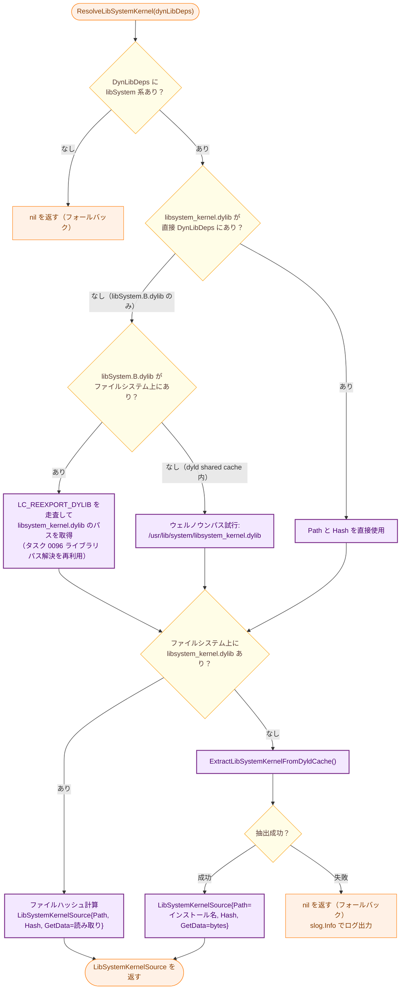

### 3.5 Mach-O libSystem キャッシュマネージャー（新規）

**ファイル**: `internal/libccache/macho_cache.go`

ELF 版 `LibcCacheManager` と同じ JSON スキーマ・命名規則・ディレクトリを使用しつつ、
Mach-O バイナリを対象とするキャッシュマネージャー。

```go
// MachoLibSystemCacheManager manages the read and write of libSystem analysis cache files.
// Uses the same LibcCacheFile schema and cache directory as LibcCacheManager.
type MachoLibSystemCacheManager struct {
    cacheDir string
    analyzer *MachoLibSystemAnalyzer
    pathEnc  *pathencoding.SubstitutionHashEscape
}

// GetOrCreate returns cached wrappers, or analyzes libsystem_kernel and creates cache on miss.
// libPath is the canonical path (install name or filesystem path) used for cache file naming.
// libHash is "sha256:<hex>" used for cache validity check.
// getData is called only on cache miss to obtain the Mach-O bytes.
func (m *MachoLibSystemCacheManager) GetOrCreate(
    libPath, libHash string,
    getData func() ([]byte, error),
) ([]WrapperEntry, error)
```

**ELF 版との差異**:
- `GetOrCreate` の第 3 引数が `getData func() ([]byte, error)`（遅延取得コールバック）。
  ファイルシステム経由と dyld shared cache 経由の両方に対応するため
- キャッシュミス時は `getData()` で Mach-O バイト列を取得し、
  `debug/macho.NewFile(bytes.NewReader(data))` で `*macho.File` に変換して解析
- キャッシュ I/O（`writeFileAtomic`、`json.MarshalIndent`、`pathencoding`）は
  同一パッケージの関数を共有

**キャッシュ有効性判定**（FR-3.1.4、ELF 版と同一）:
1. JSON パース成功
2. `schema_version == LibcCacheSchemaVersion`（= 1）
3. `lib_hash == libHash`

### 3.6 Mach-O libSystem アダプター（新規）

**ファイル**: `internal/libccache/adapters.go`（既存ファイルへ追加）

`filevalidator.LibSystemCacheInterface` を実装するアダプター。
`resolver` フィールドは持たず、`machodylib.ResolveLibSystemKernel()` を直接呼び出す設計とする。

```go
// MachoLibSystemAdapter implements filevalidator.LibSystemCacheInterface
// by combining MachoLibSystemCacheManager and ImportSymbolMatcher.
type MachoLibSystemAdapter struct {
    cacheMgr     *MachoLibSystemCacheManager
    fs           safefileio.FileSystem  // Passed to ResolveLibSystemKernel.
    syscallTable SyscallNumberTable     // MacOSSyscallTable.
}

// GetSyscallInfos resolves libsystem_kernel.dylib source from dynLibDeps,
// gets/creates the wrapper cache, matches importSymbols against the cache,
// and returns detected SyscallInfo entries.
//
// Falls back to name-only matching (FR-3.4) when either:
//   - dynLibDeps does not contain a libSystem-family library (FR-3.4.1 condition 2)
//   - dyld shared cache extraction also fails (FR-3.4.1 condition 1)
//
// Returns (nil, nil) immediately when dynLibDeps is empty or libSystemCache is nil.
func (a *MachoLibSystemAdapter) GetSyscallInfos(
    dynLibDeps []fileanalysis.LibEntry,
    importSymbols []string,
) ([]common.SyscallInfo, error)
```

**`GetSyscallInfos` の処理フロー**:
1. `machodylib.ResolveLibSystemKernel(dynLibDeps, a.fs)` を呼び出す
2. 結果が `nil` の場合（libSystem 非存在または dyld shared cache 抽出失敗）:
     - `DynLibDeps` の内容から reason を判定し、`slog.Info` で reason と検出件数をログ出力
         （FR-3.4.3）
   - シンボル名単体一致（FR-3.4.2）を実行: FR-3.5.1 のネットワーク syscall 名リストと
     `importSymbols` を照合し、一致した名前の `SyscallInfo` を生成
   - `DeterminationMethod = DeterminationMethodSymbolNameMatch`、`Source = SourceLibsystemSymbolImport`
3. 結果が非 `nil` の場合: `cacheMgr.GetOrCreate(libPath, libHash, getData)` でキャッシュ取得
     - `cacheMgr.GetOrCreate()` が `UnsupportedArchitectureError` を返した場合は
         `slog.Info` を出力して libSystem 解析をスキップし、`nil, nil` を返す
4. `ImportSymbolMatcher.MatchWithMethod(importSymbols, wrappers, DeterminationMethodLibCacheMatch)` で照合
5. 結果の `SyscallInfo` スライスを返す

### 3.7 `filevalidator.Validator` の拡張

**ファイル**: `internal/filevalidator/validator.go`

#### 3.7.1 新規インターフェース定義

```go
// LibSystemCacheInterface abstracts libSystem wrapper cache operations for Mach-O.
type LibSystemCacheInterface interface {
    // GetSyscallInfos resolves the libsystem_kernel.dylib source from dynLibDeps,
    // matches importSymbols against the cache, and returns the detected syscalls.
    // Returns nil, nil when libSystem is not in dynLibDeps (non-Mach-O or no libSystem dep).
    GetSyscallInfos(
        dynLibDeps []fileanalysis.LibEntry,
        importSymbols []string,
    ) ([]common.SyscallInfo, error)
}

// SetLibSystemCache injects the LibSystemCacheInterface used during record operations.
func (v *Validator) SetLibSystemCache(m LibSystemCacheInterface) {
    v.libSystemCache = m
}
```
```

#### 3.7.2 `updateAnalysisRecord()` の変更

**変更前**（タスク 0097 後の状態）:

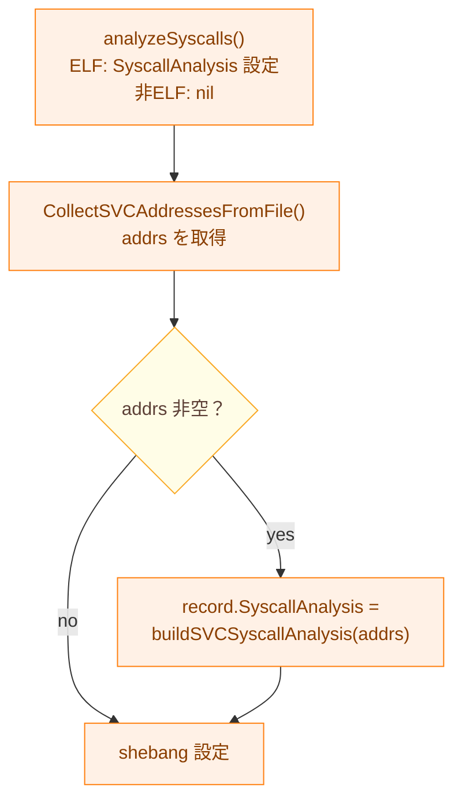

**変更後**（タスク 0100 後）:

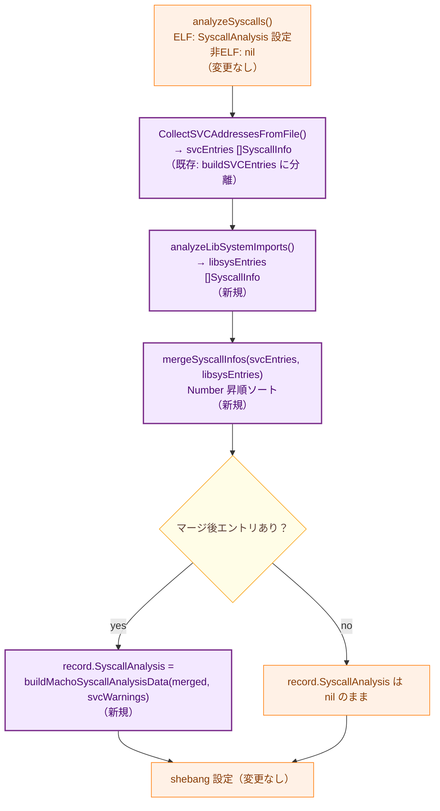

**`analyzeLibSystemImports()` の処理**:

```go
func (v *Validator) analyzeLibSystemImports(
    record *fileanalysis.Record,
    filePath string,
) ([]common.SyscallInfo, error) {
    if v.libSystemCache == nil || len(record.DynLibDeps) == 0 {
        return nil, nil
    }
    // Obtain imported symbols from the Mach-O binary using debug/macho.
    // Return nil, nil for non-Mach-O files such as ELF binaries.
    importSymbols, err := getMachoImportSymbols(v.fileSystem, filePath)
    if err != nil || importSymbols == nil {
        return nil, err
    }
    // Strip the Mach-O underscore prefix via machoanalyzer.NormalizeSymbolName.
    // Example: "_socket" -> "socket", "_socket$UNIX2003" -> "socket".
    // NormalizeSymbolName is the exported form of machoanalyzer.normalizeSymbolName
    // added by this task (see the change list in section 8).
    normalized := make([]string, len(importSymbols))
    for i, sym := range importSymbols {
        normalized[i] = machoanalyzer.NormalizeSymbolName(sym)
    }
    return v.libSystemCache.GetSyscallInfos(record.DynLibDeps, normalized)
}

// getMachoImportSymbols opens filePath and returns its imported symbols via
// debug/macho.File.ImportedSymbols(). Returns nil, nil for non-Mach-O files.
func getMachoImportSymbols(fs safefileio.FileSystem, filePath string) ([]string, error)
```

**`buildSVCSyscallAnalysis()` のリファクタリング**:
現行の `buildSVCSyscallAnalysis(addrs []uint64) *fileanalysis.SyscallAnalysisData` は
svc アドレスリストから直接 `SyscallAnalysisData` を構築している。
本タスクでは以下の 2 関数に分離する。

```go
// buildSVCSyscallEntries converts svc #0x80 addresses to SyscallInfo entries.
// Returns nil when addrs is empty.
func buildSVCSyscallEntries(addrs []uint64) []common.SyscallInfo

// buildMachoSyscallAnalysisData merges svc and libSystem entries and constructs
// SyscallAnalysisData. AnalysisWarnings is set only when svcEntries is non-empty.
func buildMachoSyscallAnalysisData(
    svcEntries []common.SyscallInfo,
    libsysEntries []common.SyscallInfo,
) *fileanalysis.SyscallAnalysisData
```
**マージ結果の `SyscallAnalysis` フィールド**:

| フィールド | 値 |
|-----------|-----|
| `Architecture` | `"arm64"` |
| `AnalysisWarnings` | svc 検出ありの場合: `["svc #0x80 detected: ..."]`; なしの場合: 空 |
| `DetectedSyscalls` | svc エントリ（`Number=-1`）+ libSystem エントリ（正の番号）を Number 昇順で統合 |

**dedup ルール**: svc エントリは `Number=-1`（すべて異なる `Location` で重複なし）。
libSystem エントリは同一 `Number` の重複を `ImportSymbolMatcher.Match()` 内で排除済み。
両者間の `Number` 衝突はないため、追加の dedup は不要（FR-3.3.2 の重複統合ルールに準拠）。

### 3.8 `runner` の拡張

**ファイル**: `internal/runner/security/network_analyzer.go`

#### 3.8.1 新規ヘルパー関数

```go
// syscallAnalysisHasNetworkSignal reports whether the given SyscallAnalysisResult
// contains IsNetwork==true entries from libSystem symbol import detection.
// Returns false when result is nil.
func syscallAnalysisHasNetworkSignal(result *fileanalysis.SyscallAnalysisResult) bool {
    if result == nil {
        return false
    }
    for _, entry := range result.DetectedSyscalls {
        if entry.IsNetwork {
            return true
        }
    }
    return false
}
```

既存の `syscallAnalysisHasSVCSignal()` は変更不要。両者が独立して判定を行う。

#### 3.8.2 `isNetworkViaBinaryAnalysis()` の拡張フロー

FR-3.6.2 の優先順位に従い、`SyscallAnalysis` の確認ステップを拡張する。

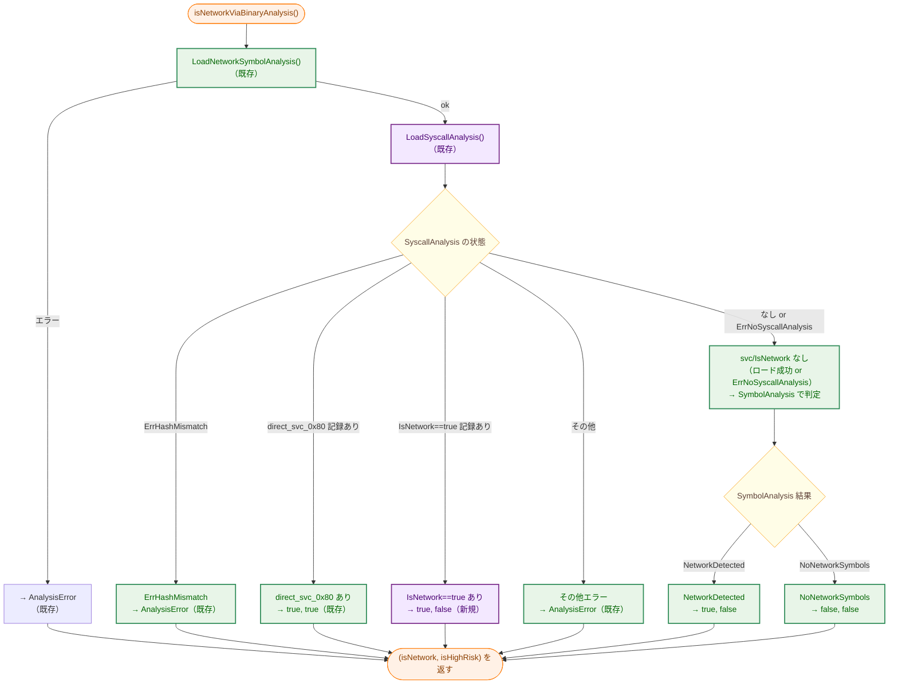

**優先順位**（FR-3.6.2）:
1. `direct_svc_0x80` エントリあり → `true, true`（高リスク確定）
2. `IsNetwork == true` エントリあり → `true, false`（ネットワーク検出）
3. `SymbolAnalysis` 結果に基づいて判定

**実装上の注意（既存コードとの統合）**: 現行の `network_analyzer.go` の switch 文は
`svcResult` をローカル変数に保持している。`IsNetwork` チェックは `switch` の後、
SymbolAnalysis 参照の前に追加する。

```go
// Existing switch statement (unchanged).
var svcResult *fileanalysis.SyscallAnalysisResult
// ...LoadSyscallAnalysis assigns svcResult inside the switch...

// New step: check IsNetwork.
if syscallAnalysisHasNetworkSignal(svcResult) {
    slog.Info("SyscallAnalysis cache indicates libSystem network syscall",
        "path", cmdPath)
    return true, false
}
// Existing SymbolAnalysis handling continues below...
```

この順序により、`direct_svc_0x80` の確認（switch 内）が `IsNetwork` 確認より先に行われる。

**注意**: `SyscallAnalysis` は `SymbolAnalysis` の結果にかかわらずロードする。
これは `NetworkDetected` の Mach-O バイナリに対しても `direct_svc_0x80` による
高リスク確定を正しく返すためである（タスク 0097 からの継承）。

## 4. データフロー

### 4.1 `record` フェーズ（macOS 11+ 通常環境）

```mermaid
flowchart LR
    classDef data fill:#e6f7ff,stroke:#1f77b4,stroke-width:1px,color:#0b3d91;
    classDef process fill:#fff1e6,stroke:#ff7f0e,stroke-width:1px,color:#8a3e00;
    classDef new fill:#f3e8ff,stroke:#7b2d8b,stroke-width:2px,color:#4a0072;

    BIN[("/usr/local/bin/tool<br>（arm64 Mach-O, socket 使用）")]
    DEPS["DynLibDeps:<br>[{SOName: /usr/lib/libSystem.B.dylib, ...}]"]
    RESOLVE["ResolveLibSystemKernel()<br>→ dyld shared cache 抽出<br>Path: /usr/lib/system/libsystem_kernel.dylib<br>Hash: sha256:abc..."]
    CACHE_CHECK{"キャッシュ<br>ヒット？"}
    ANALYZE["MachoLibSystemAnalyzer.Analyze()<br>→ [{name: socket, number: 97}, ...]"]
    WRITE_CACHE[("lib-cache/<br>libsystem_kernel.dylib<br>キャッシュファイル")]
    IMPORT_SYMS["ImportedSymbols():<br>[_socket, _connect, ...]"]
    NORMALIZE["normalizeSymbolName:<br>[socket, connect, ...]"]
    MATCH["ImportSymbolMatcher.Match()<br>→ [{Number:97, Name:socket, IsNetwork:true, Source:libsystem_symbol_import}]"]
    SVC["CollectSVCAddressesFromFile()<br>→ [] (svc なし)"]
    MERGE["mergeSyscallInfos([], libsysEntries)"]
    STORE[("fileanalysis.Record<br>SyscallAnalysis:<br>  DetectedSyscalls:<br>    - Number:97, IsNetwork:true<br>      Source: libsystem_symbol_import<br>      DeterminationMethod: lib_cache_match")]

    BIN --> DEPS --> RESOLVE --> CACHE_CHECK
    CACHE_CHECK -->|"ミス"| ANALYZE --> WRITE_CACHE --> MATCH
    CACHE_CHECK -->|"ヒット"| MATCH
    BIN --> IMPORT_SYMS --> NORMALIZE --> MATCH
    BIN --> SVC --> MERGE
    MATCH --> MERGE --> STORE

    class STORE,WRITE_CACHE data;
    class BIN,DEPS process;
    class RESOLVE,ANALYZE,IMPORT_SYMS,NORMALIZE,MATCH,SVC,MERGE new;
    class CACHE_CHECK process;
```

### 4.2 `runner` フェーズ（libSystem ネットワーク syscall 検出）

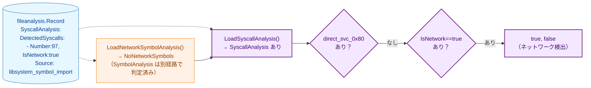

### 4.3 最終フォールバックのデータフロー

dyld shared cache からの抽出も失敗した場合（異常環境）:

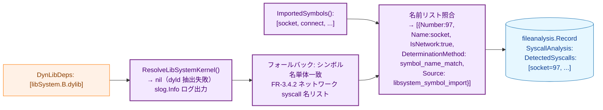

## 5. インターフェース定義

### 5.1 新規定数（`internal/libccache/schema.go` に追加）

```go
// SourceLibsystemSymbolImport is the value of SyscallInfo.Source for syscalls
// detected via libSystem import symbol matching.
const SourceLibsystemSymbolImport = "libsystem_symbol_import"

// DeterminationMethodLibCacheMatch indicates the syscall was determined via
// libSystem function-level analysis cache matching.
const DeterminationMethodLibCacheMatch = "lib_cache_match"

// DeterminationMethodSymbolNameMatch indicates the syscall was determined via
// symbol name-only matching (fallback path).
const DeterminationMethodSymbolNameMatch = "symbol_name_match"
```

### 5.2 `filevalidator.LibSystemCacheInterface`（新規）

§3.7.1 に定義。`validator.go` に `libSystemCache LibSystemCacheInterface` フィールドおよび
`SetLibSystemCache(m LibSystemCacheInterface)` メソッドを追加する（既存の `SetLibcCache` パターンと同様）。

```go
// LibSystemCacheInterface abstracts libSystem wrapper cache operations for Mach-O binaries.
// Defined in internal/filevalidator/validator.go.
type LibSystemCacheInterface interface {
    GetSyscallInfos(
        dynLibDeps []fileanalysis.LibEntry,
        importSymbols []string,
    ) ([]common.SyscallInfo, error)
}
```

### 5.3 `MachoLibSystemCacheManager.GetOrCreate`（新規）

```go
func (m *MachoLibSystemCacheManager) GetOrCreate(
    libPath, libHash string,
    getData func() ([]byte, error),
) ([]WrapperEntry, error)
```

**引数**:
- `libPath`: キャッシュファイル命名・`lib_path` フィールドに使用するパス
- `libHash`: キャッシュ有効性判定・`lib_hash` フィールドに使用するハッシュ
- `getData`: Mach-O バイト列を返すコールバック（キャッシュミス時のみ呼び出し）

### 5.4 `MachoLibSystemAnalyzer.Analyze`（新規）

```go
func (a *MachoLibSystemAnalyzer) Analyze(machoFile *macho.File) ([]WrapperEntry, error)
```

arm64 以外の場合は `*elfanalyzer.UnsupportedArchitectureError` を返す
（ELF 版 `LibcWrapperAnalyzer.Analyze` と同じエラー型を使用する）。

### 5.5 `machodylib.ResolveLibSystemKernel`（新規）

```go
func ResolveLibSystemKernel(
    dynLibDeps []fileanalysis.LibEntry,
    fs safefileio.FileSystem,
) (*LibSystemKernelSource, error)
```

### 5.6 `machodylib.ExtractLibSystemKernelFromDyldCache`（新規）

```go
func ExtractLibSystemKernelFromDyldCache() (*LibSystemKernelBytes, error)
```

non-Darwin では常に `nil, nil`。Darwin では dyld shared cache を解析して返す。

## 6. `ImportSymbolMatcher` の再利用

既存の `libccache.ImportSymbolMatcher` を Mach-O 向けにも再利用する。
ただし、既存の `Match()` は `DeterminationMethod` を `elfanalyzer.DeterminationMethodImmediate`
（= `"immediate"`）に固定しているため、Mach-O 版では `DeterminationMethod` を外部指定できる
新規メソッド `MatchWithMethod()` を追加する。

**既存の `Match()`（変更不要）**:
```go
// Still used by the ELF path. It always sets DeterminationMethod = "immediate".
func (m *ImportSymbolMatcher) Match(importSymbols []string, wrappers []WrapperEntry) []common.SyscallInfo
```

**新規追加 `MatchWithMethod()`**:
```go
// MatchWithMethod is like Match but uses the provided determinationMethod for each SyscallInfo.
// Used by MachoLibSystemAdapter to set DeterminationMethod = "lib_cache_match" on cache hit,
// or "symbol_name_match" on fallback.
func (m *ImportSymbolMatcher) MatchWithMethod(
    importSymbols []string,
    wrappers []WrapperEntry,
    determinationMethod string,
) []common.SyscallInfo
```

Mach-O キャッシュヒット時: `DeterminationMethodLibCacheMatch`（`"lib_cache_match"`）
フォールバック時: `DeterminationMethodSymbolNameMatch`（`"symbol_name_match"`）

**`SyscallNumberTable` について**: 既存の `libccache.SyscallNumberTable` インターフェースは
`filevalidator.SyscallNumberTable` と構造的に同一だが別定義である。`MacOSSyscallTable` は
`libccache.SyscallNumberTable` を実装する（`libccache` パッケージ内で定義するため）。
`filevalidator.SyscallNumberTable` インターフェースは ELF 向けに使用されており、変更しない。

## 7. スキーマへの影響

スキーマバージョンの変更は不要（NFR-4.3）。

本タスクで `SyscallAnalysis` に追加される `DetectedSyscalls` エントリは：
- `Source: "libsystem_symbol_import"` —— 新しい Source 値だが `Source` フィールド自体は既存
- `Number`: 正の整数（既存フィールド）
- `IsNetwork`: `true` または `false`（既存フィールド）

古いコードで作成されたレコードを新コードで読み込む場合: `SyscallAnalysis == nil` は
「libSystem 照合未実施」を意味するが、`runner` は `IsNetwork` エントリの有無で判定するため
後方互換性に問題はない（v15 保証: svc スキャン実施済み・未検出の場合に限り `nil`）。

**注意点**: 本タスク実装後、Mach-O バイナリの `SyscallAnalysis == nil` の意味が変化する。

| 条件 | 変更前（タスク 0097 後） | 変更後（本タスク後） |
|------|------------------------|-------------------|
| svc スキャン未検出 + libSystem 照合未実施 | nil | — |
| svc スキャン未検出 + libSystem ネットワーク syscall 未検出 | nil | nil |
| svc スキャン未検出 + libSystem ネットワーク syscall 検出 | nil | 非 nil（本タスク新規） |

`runner` は `DetectedSyscalls` の内容で判定するため、nil セマンティクスの変化は判定結果に影響しない。

## 8. 変更対象ファイル一覧

| ファイル | 変更種別 | 変更内容 |
|---------|---------|---------|
| `internal/libccache/schema.go` | 拡張 | `SourceLibsystemSymbolImport`、`DeterminationMethodLibCacheMatch`、`DeterminationMethodSymbolNameMatch` 定数追加 |
| `internal/libccache/macos_syscall_table.go` | 新規 | `MacOSSyscallTable` 型・macOS BSD syscall テーブル（FR-3.5.1） |
| `internal/libccache/macho_analyzer.go` | 新規 | `MachoLibSystemAnalyzer`（Mach-O 関数単位解析、x16 後方スキャン） |
| `internal/libccache/macho_cache.go` | 新規 | `MachoLibSystemCacheManager`（Mach-O 用キャッシュ管理） |
| `internal/libccache/adapters.go` | 拡張 | `MachoLibSystemAdapter`（`filevalidator.LibSystemCacheInterface` 実装）追加 |
| `internal/libccache/matcher.go` | 拡張 | `MatchWithMethod()` 追加（`DeterminationMethod` 外部注入） |
| `internal/machodylib/libsystem_resolver.go` | 新規 | `LibSystemKernelSource`、`ResolveLibSystemKernel()` |
| `internal/machodylib/dyld_extractor.go` | 新規 | `LibSystemKernelBytes`、non-Darwin スタブ `ExtractLibSystemKernelFromDyldCache()` |
| `internal/machodylib/dyld_extractor_darwin.go` | 新規 | Darwin 実装（`blacktop/ipsw/pkg/dyld` 使用） |
| `internal/filevalidator/validator.go` | 拡張 | `LibSystemCacheInterface` 定義、`libSystemCache` フィールド追加、`SetLibSystemCache()` 追加、`analyzeLibSystemImports()` 追加、svc+libSystem マージロジックに変更 |
| `internal/runner/security/machoanalyzer/symbol_normalizer.go` | 拡張 | `normalizeSymbolName` を `NormalizeSymbolName` としてエクスポート（`filevalidator` から再利用するため） |
| `internal/runner/security/network_analyzer.go` | 拡張 | `syscallAnalysisHasNetworkSignal()` 追加、`isNetworkViaBinaryAnalysis()` で `IsNetwork` 確認ステップ追加 |
| `cmd/record/main.go` | 拡張 | `MachoLibSystemAdapter` の初期化・注入（`fv.SetLibSystemCache(...)` 追加） |

## 9. 先行タスクとの関係

| 先行タスク | 本タスクとの関係 |
|----------|----------------|
| 0073 (Mach-O ネットワーク検出) | `normalizeSymbolName`（アンダースコアプレフィックス除去）を再利用 |
| 0079 (ELF libc syscall ラッパーキャッシュ) | `LibcCacheFile` スキーマ・`WrapperEntry`・`ImportSymbolMatcher`・キャッシュ I/O を再利用 |
| 0096 (Mach-O LC_LOAD_DYLIB 整合性検証) | `DynLibDeps` が Mach-O で記録されることが前提。`LC_REEXPORT_DYLIB` パス解決ロジックを再利用 |
| 0097 (Mach-O svc #0x80 キャッシュ統合) | `CollectSVCAddressesFromFile()`・`SyscallAnalysis` への Mach-O 信号保存が前提。validator.go の svc スキャン処理を再利用しつつマージロジックに変更 |

**外部ライブラリ依存**:

| ライブラリ | 用途 |
|-----------|------|
| `github.com/blacktop/ipsw/pkg/dyld` | dyld shared cache のパースと `libsystem_kernel.dylib` イメージの抽出（Darwin のみ） |
