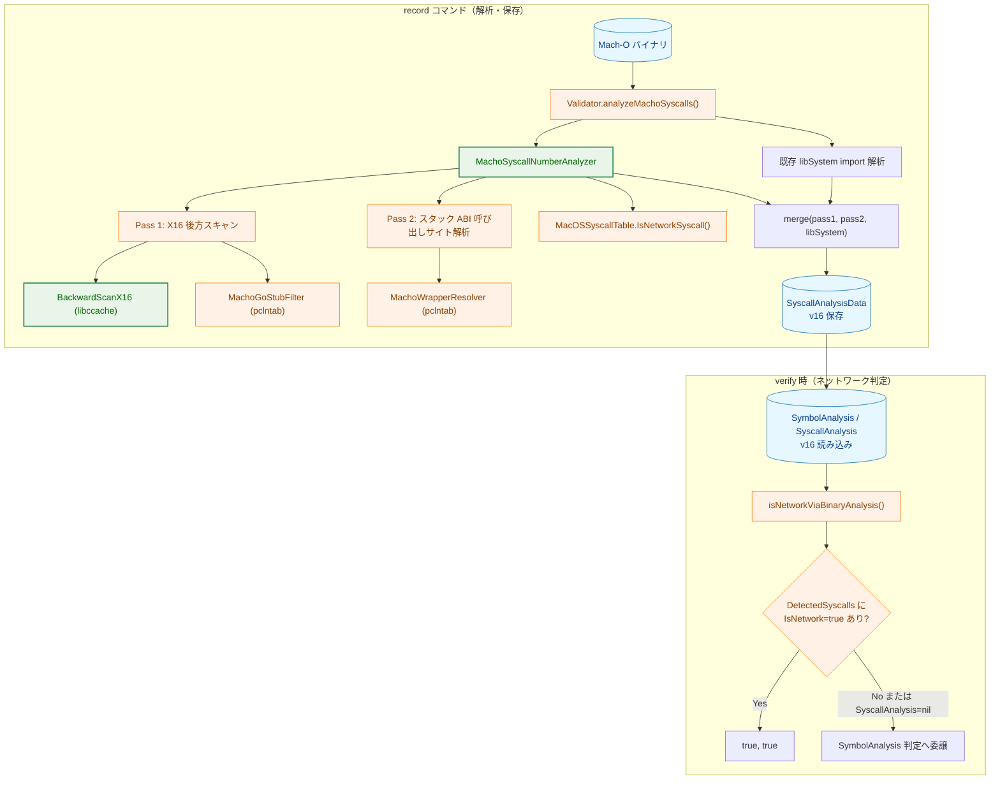
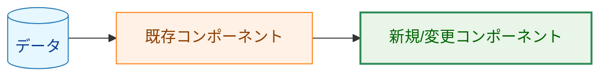
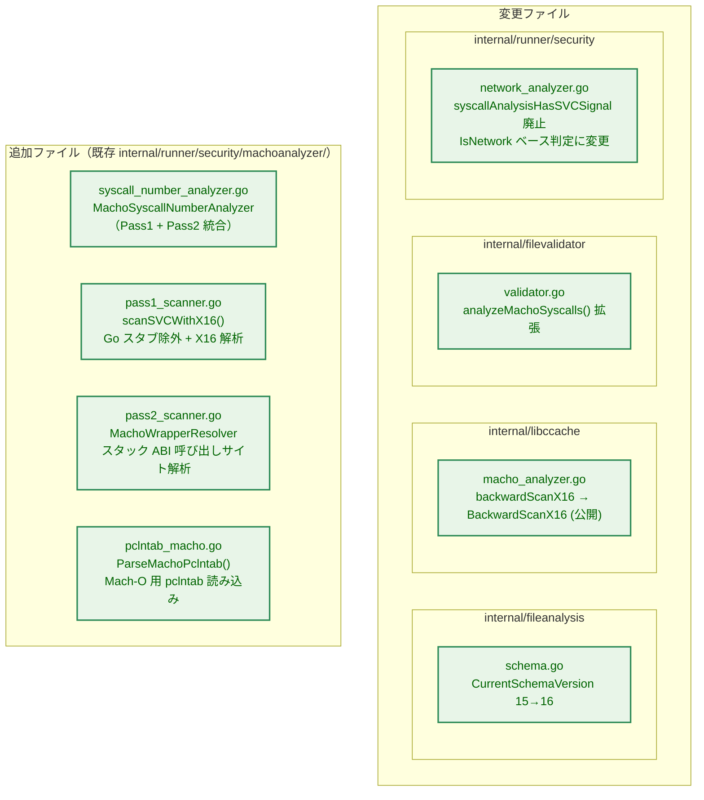
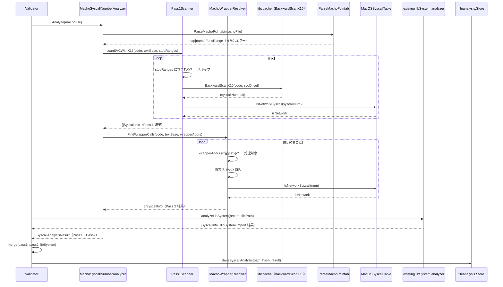
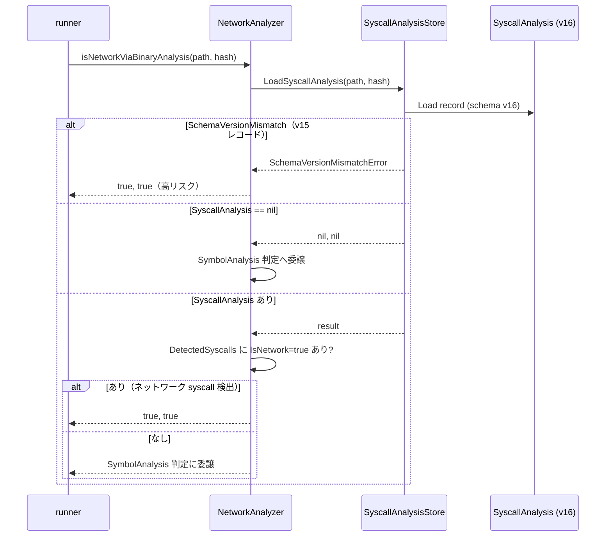
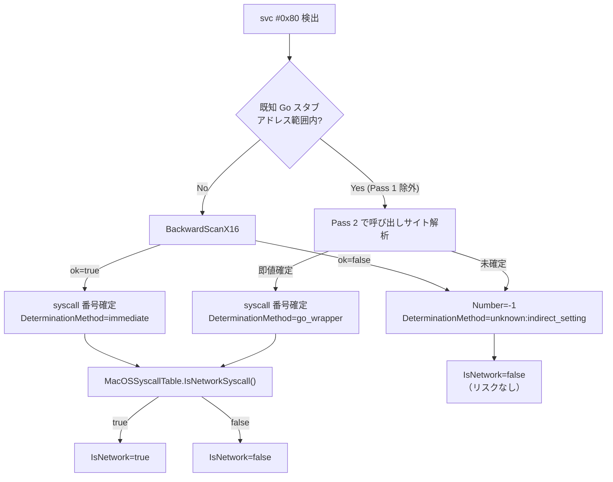
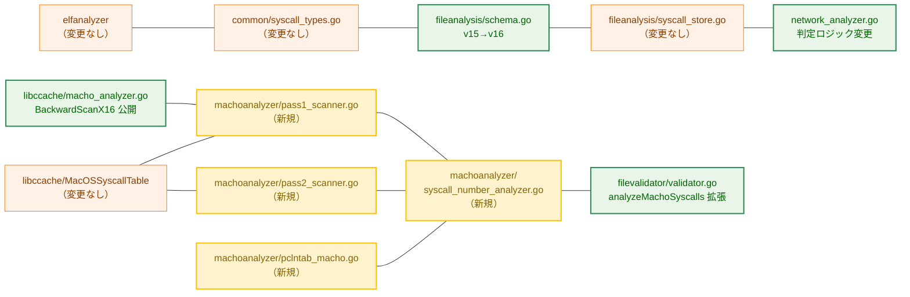

# アーキテクチャ設計書: Mach-O arm64 syscall 番号解析

## 1. システム概要

### 1.1 アーキテクチャ目標

- `svc #0x80` の存在ではなく syscall 番号の内容でリスク判定することで、正規の Go バイナリ（`record` コマンド自身を含む）の偽陽性を排除する
- `backwardScanX16`・`MacOSSyscallTable` など `libccache` の既存実装を最大限再利用し、重複開発を避ける
- ELF アナライザ（`elfanalyzer` パッケージ）の二パス設計（Pass 1: 直接 svc スキャン、Pass 2: ラッパー呼び出しサイト解析）を Mach-O arm64 向けに移植する
- `DeterminationMethodDirectSVC0x80` / `"direct_svc_0x80"` 判定方式を廃止し、`IsNetwork` フラグベースに統一する
- タスク 0100 の libSystem import 解析を維持しつつ、Mach-O 直接 syscall 番号解析結果と統合する

### 1.2 設計原則

- **既存活用**: `libccache.BackwardScanX16`・`MacOSSyscallTable`・`collectSVCAddresses` を再利用
- **ELF との一貫性**: `DeterminationMethod` 定数・`SyscallAnalysisResultCore` スキーマ・`GoWrapperResolver` 設計パターンを踏襲
- **フェイルセーフ**: 解析エラー時は `AnalysisError` 扱いで実行ブロック
- **YAGNI**: x86_64 Mach-O や非 Go バイナリへの汎用対応は本タスクのスコープ外

## 2. システム構成

### 2.1 全体アーキテクチャ（record 時 / verify 時）



**凡例（Legend）**



### 2.2 パッケージ構成



### 2.3 record 時のデータフロー（二パス解析）



### 2.4 verify 時のデータフロー（判定ロジック変更）



## 3. コンポーネント設計

### 3.1 MachoSyscallNumberAnalyzer（新規）

`internal/runner/security/machoanalyzer/syscall_number_analyzer.go`（既存 `machoanalyzer` パッケージへの追加）

```
MachoSyscallNumberAnalyzer
├── Analyze(f *macho.File) (*fileanalysis.SyscallAnalysisResult, error)
│   ├── ParseMachoPclntab(f) → funcRanges / wrapperAddrs（gopclntab なければスキップ）
│   ├── collectSVCAddresses(f) → svcAddrs
│   ├── scanSVCWithX16(code, textBase, svcAddrs, stubRanges) → pass1Results
│   ├── FindWrapperCalls(code, textBase, wrapperAddrs) → pass2Results
│   └── merge(pass1Results, pass2Results) → SyscallAnalysisResult
```

ELF の `SyscallAnalyzer` と同等の役割。戻り値は `fileanalysis.SyscallAnalysisResult`（`common.SyscallAnalysisResultCore` 埋め込み）を使用して既存の保存・読み込みパスを変更なしに再利用する。libSystem import 解析結果との最終マージは既存の `Validator.analyzeMachoSyscalls()` 側で行う。

### 3.2 ParseMachoPclntab（新規）

`internal/runner/security/machoanalyzer/pclntab_macho.go`

Mach-O ファイルの `__gopclntab` セクションからデータを読み込み、ELF 版 `parsePclntabFuncsRaw` と同じコアロジック（`gosym.NewLineTable` + `gosym.NewTable`）で関数名 → アドレス範囲マップを構築する。

CGO オフセット補正は ELF 版と同一の `detectPclntabOffset` アルゴリズムを流用（`__TEXT,__text` セクションとの CALL/BL 相互参照）。

`__gopclntab` セクションが存在しない場合は `ErrNoPclntab` を返し、呼び出し側は Pass 1/Pass 2 の除外・解決なしで継続する。

### 3.3 Pass 1 スキャン（新規）

`internal/runner/security/machoanalyzer/pass1_scanner.go`

1. `collectSVCAddresses(f)` で `svc #0x80` アドレスを列挙（既存）
2. pclntab 由来の `stubRanges`（known Go stubs の関数アドレス範囲集合）に含まれるアドレスをスキップ（`isInsideRange` で判定）
3. 残りの `svc #0x80` 各アドレスについて `libccache.BackwardScanX16(code, svcOffset)` を呼び出す
4. 成功: `DeterminationMethod = "immediate"`、BSD prefix 除去済み syscall 番号、`MacOSSyscallTable.IsNetworkSyscall()` でネットワーク判定
5. 失敗（`ok == false`）: `DeterminationMethod = "unknown:indirect_setting"`、`Number = -1`、`IsNetwork = false`

主要な内部関数: `scanSVCWithX16(svcAddrs, code, textBase, stubRanges, table) []SyscallInfo`

`libccache.BackwardScanX16` を呼ぶには `backwardScanX16` を公開名（`BackwardScanX16`）に変更する。用途は内部パッケージ間の再利用であり、外部公開 API としての互換性保証までは不要とする。

Pass 1 と Pass 2 の結果は排他的である：Pass 1 はスタブアドレス範囲**外**の `svc #0x80` のみを解析し、Pass 2 はスタブ範囲**内**関数の呼び出しサイトを解析するため、同一アドレスに対して両 Pass が結果を生成することはない。マージ時の重複排除は不要。

### 3.4 Pass 2 スキャン（新規）

`internal/runner/security/machoanalyzer/pass2_scanner.go`

ELF の `ARM64GoWrapperResolver` に対応する `MachoWrapperResolver` を実装する。

- pclntab から `knownGoWrappers`（`syscall.Syscall` 等）のアドレスを解決し `wrapperAddrs` マップを構築
- ラッパー関数のアドレス範囲を `wrapperRanges`（ソート済み）として保持し、ラッパー内からの再帰 BL を除外（`IsInsideWrapper` で判定）
- `__TEXT,__text` を走査して `BL target` 命令を検出し、`target ∈ wrapperAddrs` であれば呼び出しサイトとして処理
- 呼び出しサイトから後方スキャン（最大 `defaultMaxBackwardScan` 命令）:
  1. `STP xN, ..., [SP, #8]` または `STR xN, [SP, #8]` を検出 → xN を特定
  2. xN への即値設定 `MOVZ xN, #imm` / `MOVZ xN, #hi, LSL#16` + `MOVK xN, #lo` を検出 → syscall 番号を取得
- 制御フロー命令（`B`/`BL`/`RET`/`CBZ` 等）を後方スキャンの境界とする
- 解決成功: `DeterminationMethod = "go_wrapper"`
- 解決失敗: `DeterminationMethod = "unknown:indirect_setting"`、`Number = -1`

ELF 版との違い: ELF arm64 は第1引数が X0 レジスタ（レジスタ ABI）だが、macOS arm64 では旧スタック ABI により第1引数は `[SP, #8]`。このオフセットは調査対象の Go arm64 Mach-O スタブで確認された呼び出し規約に基づく。

Pass 2 の解析対象（`knownGoWrappers`）は Pass 1 の除外対象（`knownMachoSyscallImpls`）のサブセットではなく、`runtime.syscall` 等の Go バージョン依存スタブが追加的に含まれる場合がある。Pass 2 はラッパーの呼び出し側を解析するため、`runtime.syscall` が内部で `svc #0x80` を発行するとしても Pass 2 は呼び出しサイトを対象とする。

### 3.5 libccache 変更

`backwardScanX16` → `BackwardScanX16` に改名（公開）。

変更はシグネチャと命名のみ。同パッケージ内の呼び出し箇所（`analyzeWrapperFunction`）を合わせて更新する。

### 3.6 network_analyzer.go 変更

`syscallAnalysisHasSVCSignal`（`"direct_svc_0x80"` を検出する関数）を削除する。

`SyscallAnalysis` の参照ロジックを以下に変更する：

| 条件 | 変更前 | 変更後 |
|------|--------|--------|
| `DetectedSyscalls` に `IsNetwork=true` あり | N/A | `true, true` |
| `DetectedSyscalls` に `IsNetwork=true` なし | N/A | `SymbolAnalysis` 判定へ委譲 |
| `DeterminationMethod = "direct_svc_0x80"` のエントリあり | `true, true` | **削除（廃止）** |
| `SyscallAnalysis == nil`（`nil, nil` 返却） | `false, false` | `SymbolAnalysis` 判定へ委譲 |

### 3.7 スキーマバージョン

`internal/fileanalysis/schema.go` の `CurrentSchemaVersion` を `15` → `16` に変更する。

v15 レコード読み込み時は既存の `SchemaVersionMismatchError` が返却され、`network_analyzer.go` の `case errors.As(err, &svcSchemaMismatch)` ブランチが `true, true` を返す（既存のフェイルセーフ動作）。

## 4. セキュリティアーキテクチャ

### 4.1 フェイルセーフ設計



- `Number=-1` かつ `IsNetwork=false` は偽陰性のリスクがあるが、これらは Go runtime スタブ内の `svc #0x80` に由来し、Pass 2 でネットワーク syscall の呼び出しサイトが別途補足される
- 解析エラー（Mach-O パース失敗等）は `AnalysisError` として伝播し、`network_analyzer.go` が `true, true` を返す

### 4.2 ELF との一貫性

| 項目 | ELF arm64 | Mach-O arm64（本タスク後） |
|------|-----------|--------------------------|
| 検出命令 | `svc #0` | `svc #0x80` |
| syscall 番号レジスタ | X8 | X16 |
| Pass 1 後方スキャン関数 | `arm64BackwardScan` | `BackwardScanX16`（libccache） |
| Pass 2 第1引数 | X0（レジスタ ABI） | `[SP, #8]`（旧スタック ABI） |
| `DeterminationMethod` 定数 | `elfanalyzer` パッケージ定義 | 同定数を使用（`immediate` / `go_wrapper` / `unknown:*`） |
| pclntab 読み込み | `elfanalyzer.ParsePclntab` | `machoanalyzer.ParseMachoPclntab`（新規） |

## 5. パフォーマンス設計

Pass 1・Pass 2 はいずれも `__TEXT,__text` セクションを 4 バイト単位で一方向スキャンする（O(N)、N = コードサイズ）。pclntab の読み込みは解析開始時に一度だけ実施する。

ELF 版と同等のスキャン方式であり、`record` コマンドの処理時間への影響は軽微と見込む。

## 6. 依存関係と影響範囲



**影響を受けないコンポーネント:**
- `elfanalyzer` パッケージ（変更なし）
- `common/syscall_types.go`（`DeterminationMethodDirectSVC0x80` 定数は互換性のため残す）
- `fileanalysis/syscall_store.go`・`SyscallAnalysisStore` インターフェース（変更なし）
- `libccache/MacOSSyscallTable`（変更なし）
