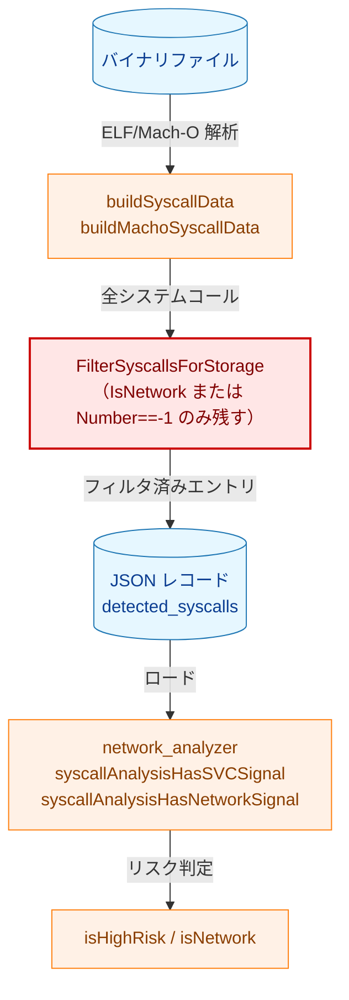
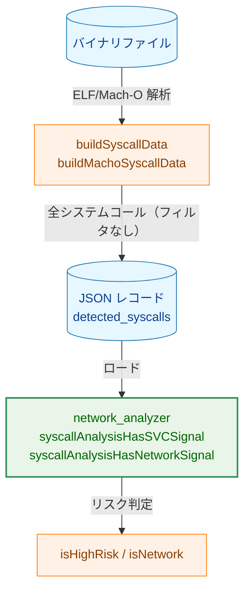
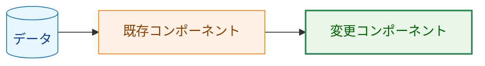
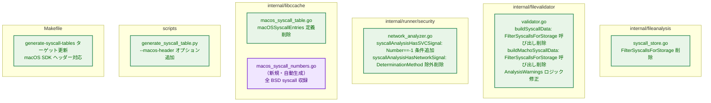
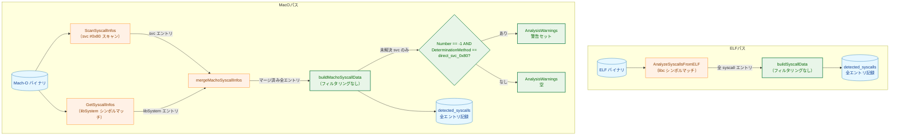
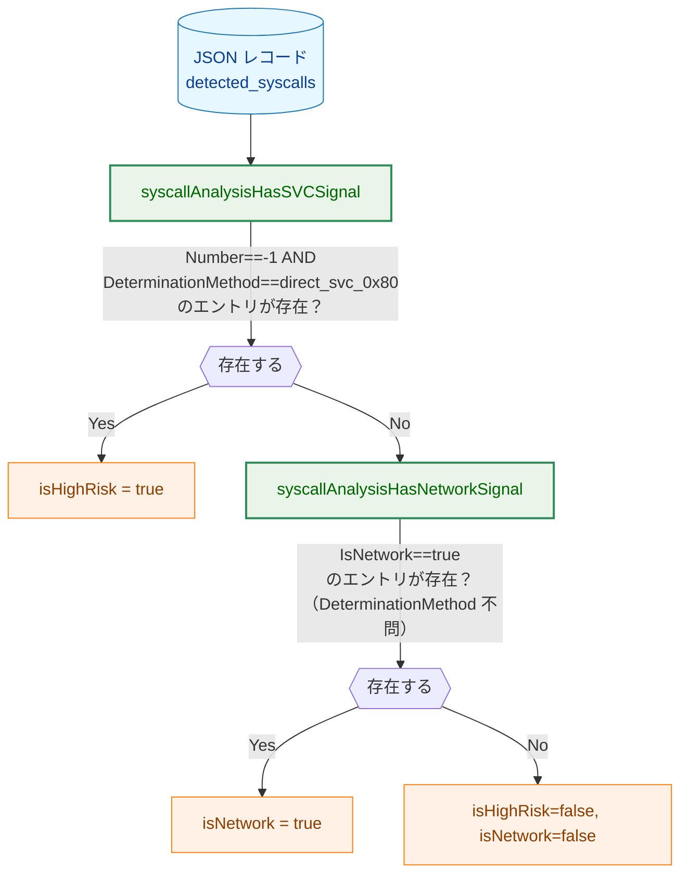
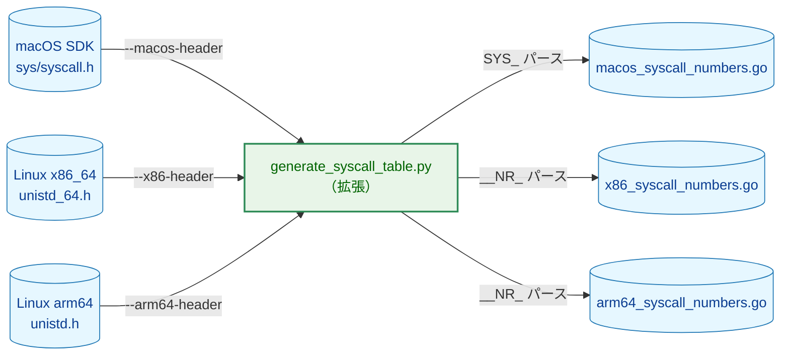

# アーキテクチャ設計書: record コマンドのシステムコールフィルタリング削除

## 1. システム概要

### 1.1 アーキテクチャ目標

- `record` コンポーネントからリスク判断ロジックを除去し、関心の分離を徹底する
- `runner` コンポーネントがフィルタリングされていない全システムコール情報を基にリスク判定できるようにする
- macOS BSD syscall テーブルを自動生成化し、手動管理コストを排除する

### 1.2 設計原則

- **関心の分離**: `record` はシステムコールを記録するのみ。フィルタリングは `runner` 側の責務
- **後方互換性**: JSON スキーマは変更しない。`detected_syscalls` の内容が増えるのみ
- **YAGNI**: 既存の構造・インターフェースを活用し、不要な抽象化を追加しない

## 2. 変更前後のアーキテクチャ

### 2.1 変更前: フィルタリングあり

### 2.2 変更後: フィルタリングなし

**凡例（Legend）**

## 3. コンポーネント設計

### 3.1 変更コンポーネント一覧

### 3.2 `record` パスのデータフロー

### 3.3 `runner` パスのリスク判定フロー

## 4. macOS syscall テーブル自動生成設計

### 4.1 ファイル役割分担

| ファイル | 変更種別 | 内容 |
|---------|---------|------|
| `internal/libccache/macos_syscall_numbers.go` | 新規（自動生成） | `macOSSyscallEntries` マップ変数（全 BSD syscall） |
| `internal/libccache/macos_syscall_table.go` | 修正 | `macOSSyscallEntries` 定義を削除。`MacOSSyscallTable` 構造体・メソッド・`networkSyscallWrapperNames` は残す |

### 4.2 生成スクリプトの拡張

### 4.3 macOS ネットワーク syscall セット

Linux の `NETWORK_SYSCALL_NAMES` から macOS で存在しない名前（`accept4`・`recvmmsg`・`sendmmsg`）を除いたセットを `MACOS_NETWORK_SYSCALL_NAMES` として定義する。

### 4.4 Makefile の更新方針

- `MACOS_SYSCALL_HEADER` 変数を追加（デフォルト: `xcrun --show-sdk-path` 経由で取得）
- `SYSCALL_TABLE_OUTPUTS` に `internal/libccache/macos_syscall_numbers.go` を追加
- macOS SDK ヘッダーが存在しない環境（Linux CI 等）では macOS テーブル生成をスキップし、コミット済みファイルをそのまま使用する

## 5. テスト戦略

### 5.1 影響を受けるテストファイル

| テストファイル | 変更内容 |
|-------------|---------|
| `internal/fileanalysis/syscall_store_test.go` | `FilterSyscallsForStorage` 前提テスト削除または置換 |
| `internal/filevalidator/validator_test.go` | 非ネットワーク・解決済み syscall が保持されるよう更新 |
| `internal/filevalidator/validator_macho_test.go` | 解決済み非ネットワーク svc 保持・未解決 svc のみ警告発出の前提に更新 |
| `internal/runner/security/network_analyzer_test.go` | 未解決 svc のみ high risk・IsNetwork 不問での network signal 判定に更新 |
| `internal/libccache/` テスト | macOS syscall テーブル拡張後の `GetSyscallName`・`IsNetworkSyscall` 動作検証 |

### 5.2 テスト方針

- 各 AC（受け入れ基準）に対して最低 1 つのテストを用意する
- 境界値: 解決済み svc（Number != -1）は高リスク判定しない、未解決 svc（Number == -1）は高リスク判定する
- 後方互換性: 旧レコード（フィルタリング済み）でも runner が正しく動作することを確認する

### 5.3 受け入れ基準と確認方法

| 観点 | 確認方法 |
|---|---|
| AC-1, AC-2, AC-3 | `validator_test.go` / `validator_macho_test.go` の単体テストで `DetectedSyscalls` と `AnalysisWarnings` を確認する |
| AC-4, AC-5 | `network_analyzer_test.go` で未解決 svc と解決済みネットワーク svc の判定分岐を確認する |
| AC-6 | `internal/libccache` 配下のテストと `make generate-syscall-tables` で生成結果と API 挙動を確認する |
| AC-7 | `make test` / `make lint` を実行して既存テストの回帰がないことを確認する |
| AC-8 | `docs/tasks/0104_macho_syscall_number_analysis/03_detailed_specification.md` と `04_implementation_plan.md` の superseded 記述をレビューして整合を確認する |
| NFR-1 | `network_analyzer_test.go` で旧レコード相当のフィルタ済み `DetectedSyscalls` を与え、判定が変わらないことを確認する |

## 6. 変更対象外

- `SymbolAnalysis`（`AnalyzeNetworkSymbols`）のフィルタリングロジック
- JSON スキーマバージョン（`CurrentSchemaVersion`）
- `mergeMachoSyscallInfos` の並べ替えロジック
- `internal/libccache/macos_syscall_table.go` の `MacOSSyscallTable` 構造体・メソッド・`networkSyscallWrapperNames`
