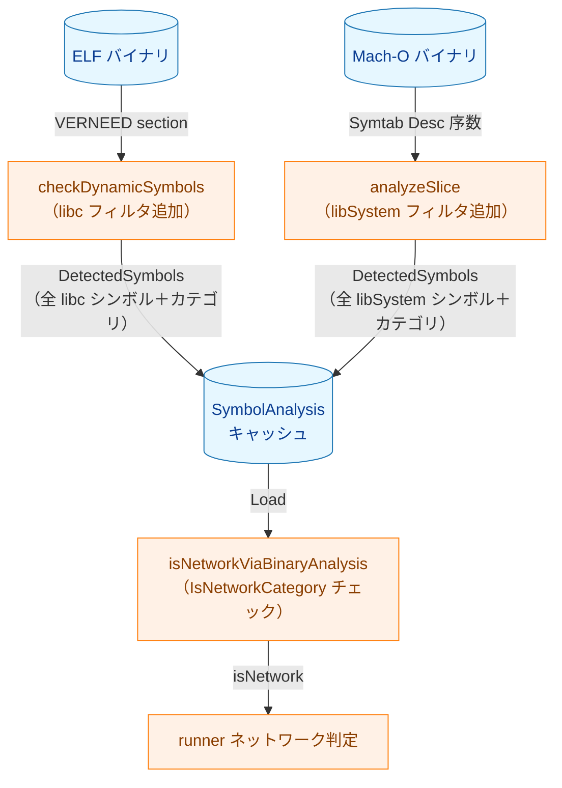
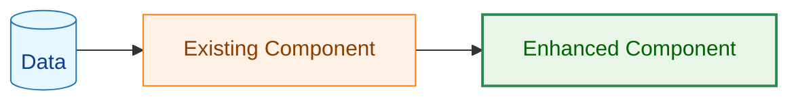
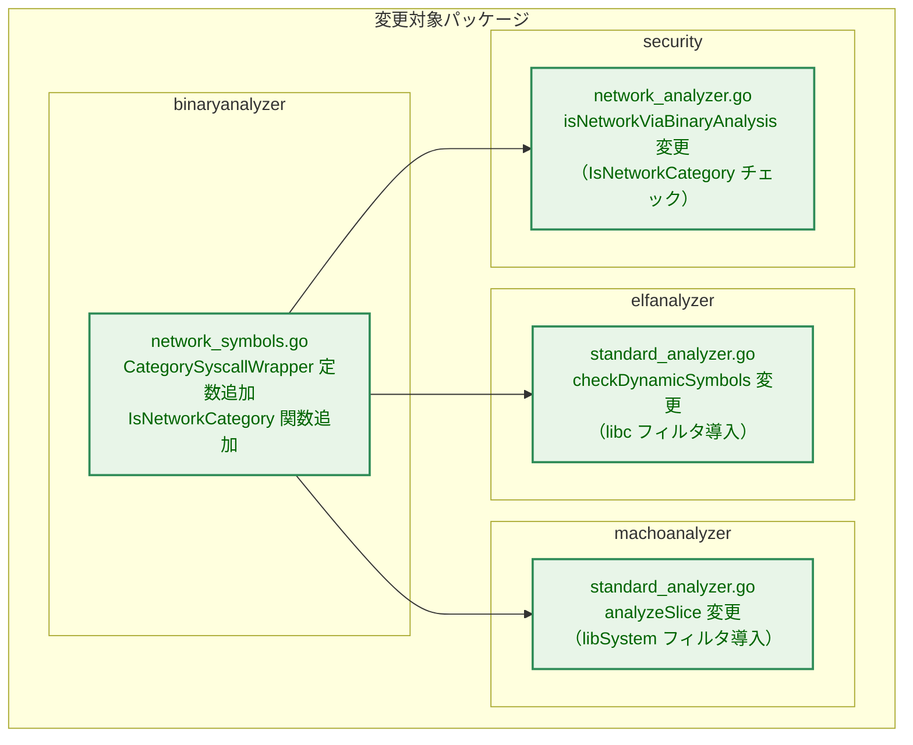
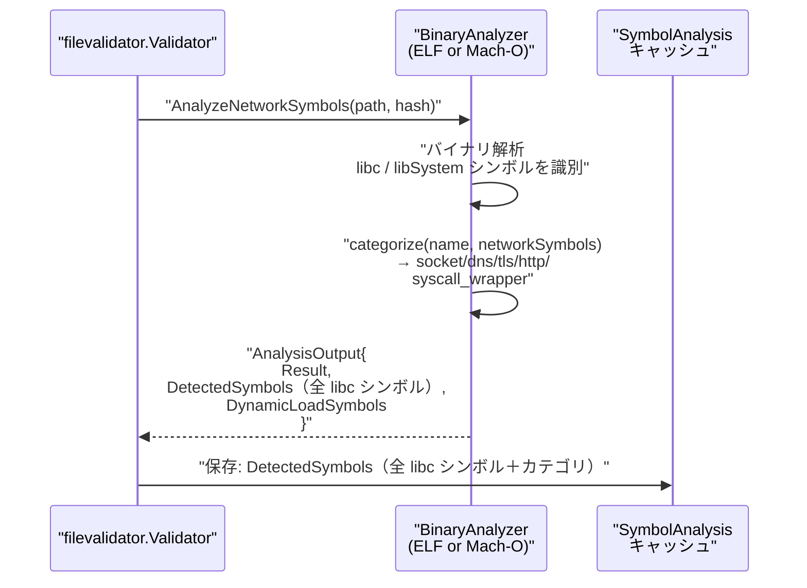
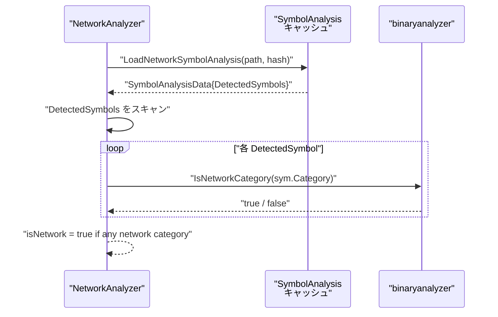
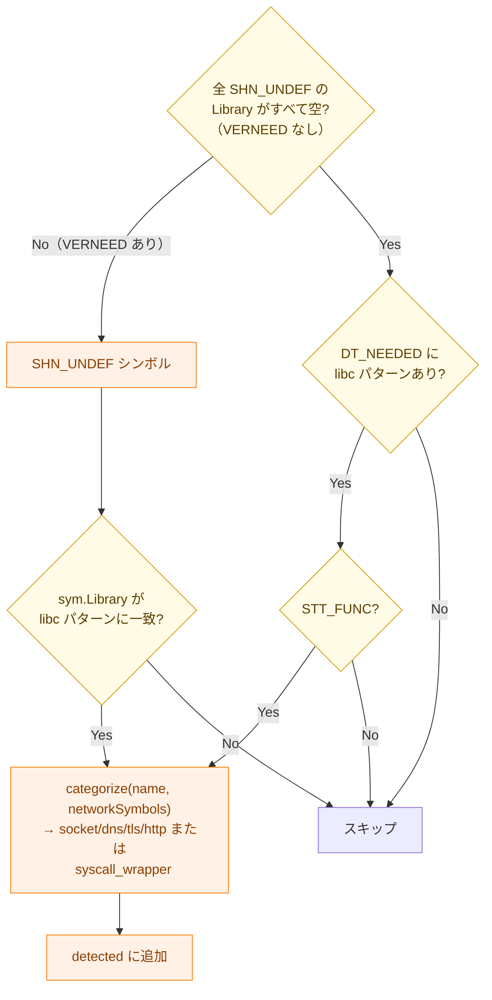
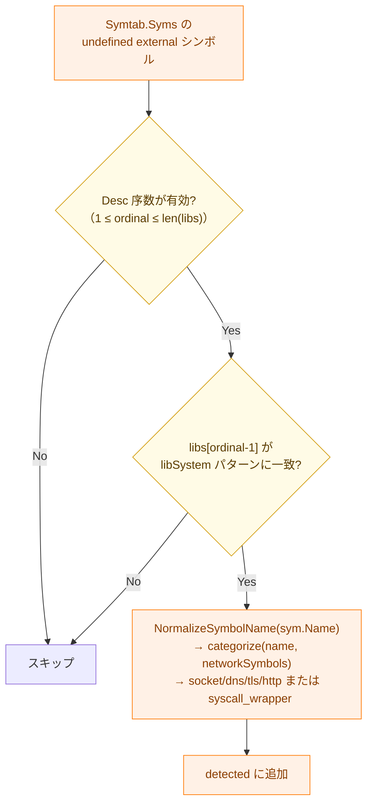
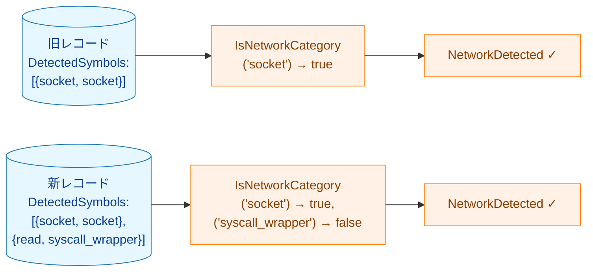
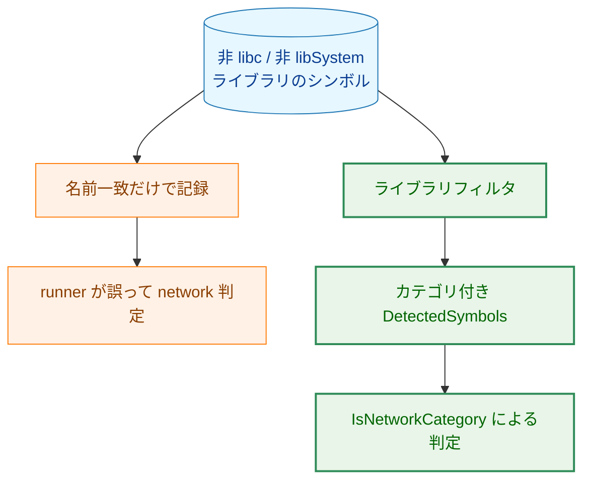

# アーキテクチャ設計書: シンボル解析のライブラリフィルタ導入

## 1. システム概要

### 1.1 アーキテクチャ目標

- ELF バイナリ：`sym.Library`（VERNEED セクション由来）を使用した libc シンボルの正確な識別
- Mach-O バイナリ：Symtab の `Desc` フィールド（ライブラリ序数）を使用した libSystem シンボルの識別
- ネットワーク判定ロジック（`runner` 側）をカテゴリフィールドベースに更新
- 既存 `networkSymbols` マップをカテゴリ付与のみに限定して再利用

### 1.2 設計原則

- **関心の分離**：`record` はシンボルを収集するのみ、`runner` がネットワーク判定を行う
- **ライブラリ限定**：libc / libSystem 由来シンボルのみを記録する
- **後方互換性**：旧レコードの `DetectedSymbols`（ネットワーク系カテゴリのみ）は引き続き正しく機能する
- **最小変更**：既存の `networkSymbols` マップと `binaryanalyzer` インターフェースを最大限再利用

## 2. システム構成

### 2.1 全体アーキテクチャ



**凡例（Legend）**



### 2.2 コンポーネント配置



### 2.3 データフロー（record フェーズ）



### 2.4 データフロー（verify フェーズ）



## 3. コンポーネント設計

### 3.1 binaryanalyzer パッケージの拡張

#### 3.1.1 新定数 `CategorySyscallWrapper`

```go
// network_symbols.go
const (
    CategorySocket        SymbolCategory = "socket"     // 既存
    CategoryHTTP          SymbolCategory = "http"        // 既存
    CategoryTLS           SymbolCategory = "tls"         // 既存
    CategoryDNS           SymbolCategory = "dns"         // 既存
    CategoryDynamicLoad   SymbolCategory = "dynamic_load" // 既存
    CategorySyscallWrapper SymbolCategory = "syscall_wrapper" // 新規
)
```

#### 3.1.2 新関数 `IsNetworkCategory`

```go
// network_symbols.go
func IsNetworkCategory(cat string) bool {
    switch SymbolCategory(cat) {
    case CategorySocket, CategoryDNS, CategoryTLS, CategoryHTTP:
        return true
    }
    return false
}
```

#### 3.1.3 `AnalysisOutput.DetectedSymbols` のセマンティクス変更

変更前：`NetworkDetected` の場合のみ設定
変更後：`NetworkDetected` および `NoNetworkSymbols` の両方で設定

`DetectedSymbols` には libc / libSystem からインポートされた **全シンボル** が含まれ、カテゴリで分類される。`Result` はネットワーク系カテゴリが存在するかどうかで決定する。

### 3.2 ELF シンボル解析の変更（FR-1）

#### 3.2.1 libc シンボルの識別方法

Go 1.22 以降（本プロジェクトは 1.26.2）、`debug/elf.DynamicSymbols()` が返す `elf.Symbol.Library` フィールドに VERNEED セクション（`.gnu.version_r`）由来のライブラリ名が格納される。

```
elf.Symbol.Library の例：
  socket   → "libc.so.6"     （glibc）
  read     → "libc.so.6"     （glibc）
  atan2    → "libm.so.6"     （libm）
```

**識別ロジック（プライマリ）**：

```
strings.HasPrefix(sym.Library, "libc.so.") ||
strings.HasPrefix(sym.Library, "libc.musl-")
```

**フォールバック**（VERNEED 情報なし・全 SHN_UNDEF シンボルの `Library` が空の場合）：

フォールバックは「SHN_UNDEF シンボルが存在するがそのすべてで `Library == ""`」の場合にのみ適用する（一部のシンボルに Library 情報があれば VERNEED ありと判断し、フォールバックと混在させない）。

この条件を満たすとき `elfFile.ImportedLibraries()` で DT_NEEDED エントリを確認し、libc パターンが少なくとも 1 つ存在し、かつ libc 以外のライブラリが含まれない場合に限って `SHN_UNDEF` かつ `STT_FUNC` である全シンボルを libc 由来とみなす。libc 以外の DT_NEEDED が混在する場合は、全 `STT_FUNC` を libc に帰属させる根拠がないためフォールバックを無効化する。DT_NEEDED に libc パターンがない場合も全シンボルをスキップする（ライブラリフィルタの趣旨を維持）。

#### 3.2.2 `checkDynamicSymbols` の変更

現行シグネチャ：`checkDynamicSymbols(dynsyms []elf.Symbol)`

新シグネチャ：`checkDynamicSymbols(elfFile *elf.File)` — フォールバックのために `ImportedLibraries()` が必要



**結果決定ロジック（変更後）**：

```go
// detected = 全 libc シンボル（ネットワーク系＋syscall_wrapper）
hasNetwork := false
for _, sym := range detected {
    if binaryanalyzer.IsNetworkCategory(sym.Category) {
        hasNetwork = true
        break
    }
}
result := binaryanalyzer.NoNetworkSymbols
if hasNetwork {
    result = binaryanalyzer.NetworkDetected
}
// DetectedSymbols は NetworkDetected / NoNetworkSymbols 両方に設定
return binaryanalyzer.AnalysisOutput{
    Result:             result,
    DetectedSymbols:    detected,
    DynamicLoadSymbols: dynamicLoadSyms,
}
```

### 3.3 Mach-O シンボル解析の変更（FR-2）

#### 3.3.1 libSystem シンボルの識別方法

Mach-O の two-level namespace バイナリでは、シンボルテーブル（`LC_SYMTAB`）の各 undefined external シンボルの `n_desc` フィールドにライブラリ序数（library ordinal）が埋め込まれている。

```
ライブラリ序数の取得：
  ordinal = int((sym.Desc >> 8) & 0xFF)

特殊値：
  0   → SELF_LIBRARY_ORDINAL（自身のバイナリ）
  254 → DYNAMIC_LOOKUP_ORDINAL（実行時解決）
  255 → EXECUTABLE_ORDINAL（メイン実行ファイル）
  1..253 → ImportedLibraries()[ordinal-1] のライブラリ名
```

**libSystem 判定ロジック**：

```go
func isLibSystemLibrary(path string) bool {
    if path == "/usr/lib/libSystem.B.dylib" {
        return true
    }
    base := filepath.Base(path)
    return strings.HasPrefix(base, "libsystem_") &&
           strings.HasSuffix(base, ".dylib")
}
```

#### 3.3.2 `analyzeSlice` の変更

**プライマリ**（`Symtab` + `Dysymtab` あり）：



**フォールバック**（`Symtab` が nil の場合）：

`f.ImportedLibraries()` で libSystem が含まれる場合、`f.ImportedSymbols()` で全インポートシンボルを取得し、全シンボルを libSystem 由来とみなす。libSystem が含まれない場合は空（`DetectedSymbols: nil`）を返す。ネットワーク名フィルタ（`networkSymbols`）は適用しない（ライブラリフィルタの趣旨を維持）。

#### 3.3.3 シンボル名の正規化

Mach-O のシンボル名には `_socket`、`_socket$UNIX2003` のような接頭辞・接尾辞が付くため、既存の `NormalizeSymbolName(sym.Name)` で正規化してから `categorize` に渡す。ELF ではこの変換は不要（`elf.Symbol.Name` に追加修飾はない）。

#### 3.3.4 結果決定ロジック

ELF と同様に、`IsNetworkCategory` で Result を決定し、`DetectedSymbols` は NetworkDetected / NoNetworkSymbols 両方に設定する。

### 3.4 `network_analyzer.go` の変更（FR-3）

#### 3.4.1 `isNetworkViaBinaryAnalysis` のシンボル依存判定

変更前：

```go
if len(data.DetectedSymbols) > 0 || len(data.KnownNetworkLibDeps) > 0 {
    output.Result = binaryanalyzer.NetworkDetected
```

変更後：

```go
hasNetworkSymbol := false
for _, sym := range data.DetectedSymbols {
    if binaryanalyzer.IsNetworkCategory(sym.Category) {
        hasNetworkSymbol = true
        break
    }
}
if hasNetworkSymbol || len(data.KnownNetworkLibDeps) > 0 {
    output.Result = binaryanalyzer.NetworkDetected
```

**変更理由**：`DetectedSymbols` が全 libc シンボルを含むようになるため、`len(data.DetectedSymbols) > 0` だと libc を持つ全バイナリが network 判定されてしまう。

## 4. カテゴリ付与ロジック

### 4.1 カテゴリ決定ルール

ELF・Mach-O ともに共通のカテゴリ付与関数を使用する：

```go
func categorizeSymbol(name string, networkSymbols map[string]SymbolCategory) string {
    if cat, found := networkSymbols[name]; found {
        return string(cat)  // "socket" / "dns" / "tls" / "http"
    }
    return string(CategorySyscallWrapper)  // "syscall_wrapper"
}
```

### 4.2 カテゴリ分類表

| シンボル例 | ライブラリ | カテゴリ | networkSymbols に存在 |
|---------|--------|--------|------------------|
| `socket` | libc / libSystem | `"socket"` | ✓ |
| `connect` | libc / libSystem | `"socket"` | ✓ |
| `getaddrinfo` | libc / libSystem | `"dns"` | ✓ |
| `SSL_connect` | libssl（非 libc） | **記録しない** | ✓（ただし除外） |
| `read` | libc / libSystem | `"syscall_wrapper"` | ✗ |
| `write` | libc / libSystem | `"syscall_wrapper"` | ✗ |
| `open` | libc / libSystem | `"syscall_wrapper"` | ✗ |

### 4.3 ネットワーク判定カテゴリ

`IsNetworkCategory(cat)` が `true` を返すカテゴリ：`"socket"`, `"dns"`, `"tls"`, `"http"`

`"syscall_wrapper"`, `"dynamic_load"`, `"syscall"` は `false` を返す。

## 5. 後方互換性

### 5.1 旧レコードとの互換性

旧 `record` が生成したレコードの `DetectedSymbols` にはネットワーク系カテゴリのシンボルのみが記録されている（`"socket"`, `"dns"`, `"tls"`, `"http"`）。

新 `runner` の `isNetworkViaBinaryAnalysis` は `IsNetworkCategory` でネットワーク判定を行うため、旧レコードのネットワーク系カテゴリシンボルは正しく `NetworkDetected` と判定される。



## 6. 影響範囲まとめ

| ファイル | 変更種別 | 概要 |
|--------|--------|------|
| `binaryanalyzer/network_symbols.go` | 追加 | `CategorySyscallWrapper` 定数、`IsNetworkCategory` 関数 |
| `elfanalyzer/standard_analyzer.go` | 変更 | `checkDynamicSymbols` シグネチャ変更、libc フィルタ追加 |
| `machoanalyzer/standard_analyzer.go` | 変更 | `analyzeSlice` の libSystem フィルタ追加 |
| `security/network_analyzer.go` | 変更 | `IsNetworkCategory` ベースのネットワーク判定 |
| 対応する `_test.go` ファイル | 変更 | 新フィルタロジックの検証 |

## 7. エラーハンドリング設計

### 7.1 既存エラー型の利用

- 新しい公開エラー型は追加しない
- ELF 解析で `DynamicSymbols()` が失敗した場合は既存の `AnalysisError` を返す
- ELF 解析で `elf.ErrNoSymbols` または実質的に空の `.dynsym` に到達した場合は `StaticBinary` として既存の静的解析経路へフォールバックする
- Mach-O フォールバックで `ImportedSymbols()` の取得に失敗した場合は `AnalysisError` を返し、シンボル取得不能を安全側に倒す

### 7.2 フォールバック方針

- ELF: VERNEED ありと判定できる場合は `sym.Library` のみを信頼し、DT_NEEDED フォールバックと混在させない
- ELF: VERNEED なしのときだけ DT_NEEDED を確認し、libc が唯一の依存ライブラリである場合に限って `STT_FUNC` の undefined symbol を記録する
- Mach-O: Symtab がない場合だけ `ImportedLibraries()` + `ImportedSymbols()` フォールバックを使う
- 旧レコード読込時はスキーマ変更を伴わないため、カテゴリベース判定のみで安全に処理する

## 8. セキュリティ考慮事項

### 8.1 セキュリティ設計上の意図

- 非 libc / 非 libSystem のシンボルを除外し、ネットワーク名だけで過剰検出するリスクを下げる
- `DetectedSymbols` に syscall wrapper を残しつつ、`runner` 側では `IsNetworkCategory` を通したカテゴリ判定だけを採用して誤検知を防ぐ
- `DynamicLoadSymbols` と `KnownNetworkLibDeps` の既存判定を保持し、ライブラリフィルタ導入で既存の高リスク検知を弱めない

### 8.2 脅威モデル



## 9. 処理フロー詳細

### 9.1 ELF の結果決定フロー

1. `.dynsym` の undefined symbol を列挙する
2. VERNEED の有無に応じて libc 帰属判定方法を一意に選ぶ
3. libc 由来シンボルをすべて `DetectedSymbols` に追加する
4. `IsDynamicLoadSymbol` に一致するシンボルは並行して `DynamicLoadSymbols` に追加する
5. `DetectedSymbols` にネットワーク系カテゴリが 1 件でもあれば `NetworkDetected`、なければ `NoNetworkSymbols` を返す

### 9.2 Mach-O の結果決定フロー

1. `Desc` のライブラリ序数で libSystem 帰属を解決する
2. libSystem 由来シンボルを正規化して `DetectedSymbols` に追加する
3. Symtab がない場合だけ `ImportedLibraries()` に libSystem があるか確認してフォールバックする
4. ELF と同様に `IsNetworkCategory` で最終結果を決める

## 10. テスト戦略

### 10.1 ユニットテスト

- `binaryanalyzer/network_symbols_test.go` で `IsNetworkCategory` の真偽境界を検証する
- `elfanalyzer/analyzer_test.go` で VERNEED あり・なしの両分岐と libc 以外除外を検証する
- `machoanalyzer/analyzer_test.go` で library ordinal 解決、Symtab なしフォールバック、非 libSystem 除外を検証する
- `network_analyzer_test.go` で `syscall_wrapper` のみでは network 判定にならないことを検証する

### 10.2 統合テストと後方互換性

- 既存レコード互換性は `DetectedSymbols` の既存カテゴリを持つデータを用いた `network_analyzer_test.go` で維持を確認する
- 変更後のドキュメントどおりに `make test` と `make lint` を通し、既存セキュリティ判定ロジックへの退行がないことを確認する

### 10.3 受け入れ基準との対応

- AC-1: ELF で `socket` と `read` がともに記録されること
- AC-2: libc 以外のみの ELF で `DetectedSymbols` が空であること
- AC-3: Mach-O で `socket` と `read` がともに記録されること
- AC-4: `runner` がカテゴリベースでのみ network 判定すること
- AC-5: 回帰テスト一式が成功すること

## 11. 実装の優先順位

1. `binaryanalyzer` に `CategorySyscallWrapper` と `IsNetworkCategory` を追加する
2. ELF アナライザを更新し、もっとも誤判定しやすい VERNEED / DT_NEEDED 分岐を先に固める
3. Mach-O アナライザへ library ordinal ベースのフィルタを導入する
4. `network_analyzer.go` をカテゴリベース判定へ切り替える
5. 単体テスト、後方互換テスト、`make test` / `make lint` で全体確認する

## 12. 将来の拡張性

- 将来 `networkSymbols` に新カテゴリが追加されても、`IsNetworkCategory` の判定集合だけを更新すれば `runner` の意味論を保てる
- Mach-O の libSystem 判定は、将来 `MachoLibSystemCache` を使う実装に差し替えても `analyzeSlice` の責務を維持できる
- ELF の libc 判定は、将来より厳密な ABI 判定を導入しても `categorize` と結果決定ロジックを変更せずに拡張できる
