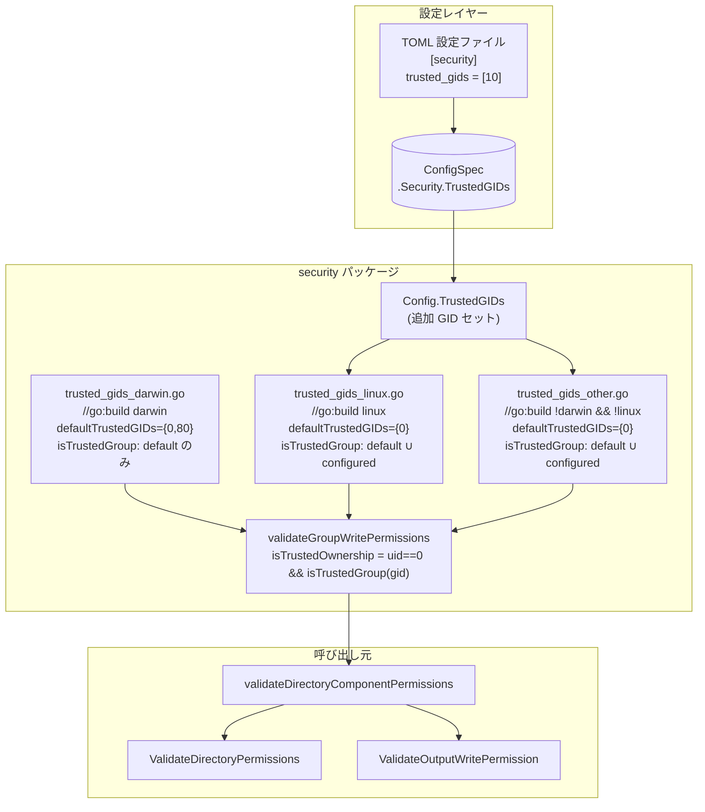
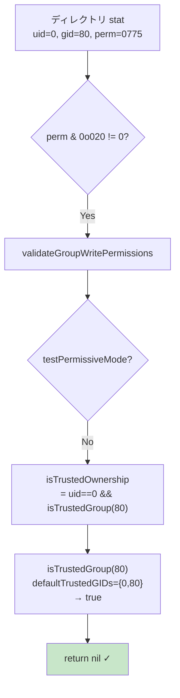
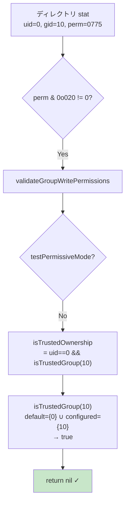
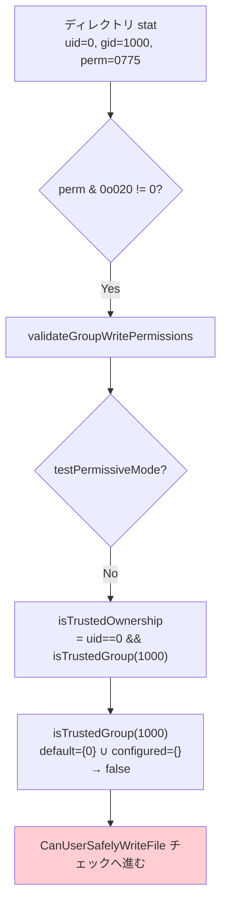
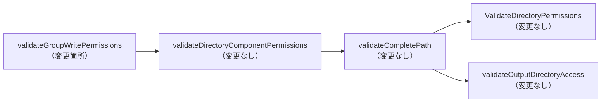
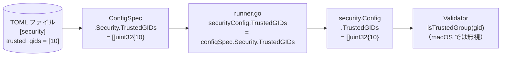

# アーキテクチャ設計書: ディレクトリセキュリティ検証における信頼済みグループホワイトリスト

## 1. システム概要

### 1.1 設計原則

#### セキュリティファースト原則
- **最小変更**: セキュリティ判定ロジックの変更を最小限に抑え、誤用リスクを低減する
- **プラットフォーム分離**: プラットフォーム固有の定数をビルドタグで分岐し、コアロジックを汚染しない
- **後方互換性**: GID=0（root グループ）は引き続き信頼済みとして扱い、既存の動作を維持する

#### 関心の分離
- **定数定義**: プラットフォームごとのデフォルト信頼済み GID はビルドタグで分岐したファイルに置く
- **ロジック**: `validateGroupWritePermissions` はプラットフォーム固有コードを含まない
- **設定**: Linux 向けの追加 GID は TOML 設定ファイル経由で注入する

### 1.2 アーキテクチャ目標

1. **機能目標**
   - macOS の `/Applications`（uid=0, gid=80, perm=0775）をエラーなく通過させる
   - Linux で `trusted_gids` 設定による追加 GID のホワイトリスト化を実現する

2. **品質目標**
   - 既存テストをすべて通過させる
   - 新プラットフォーム対応は定義ファイルの追加のみで完結する

3. **保守性目標**
   - コアロジックの変更箇所を最小限に抑える（`validateGroupWritePermissions` の1箇所）

## 2. システムアーキテクチャ

### 2.1 全体アーキテクチャ図



### 2.2 コンポーネント構成

#### 新規ファイル

| ファイル | 役割 |
|---------|------|
| `internal/runner/security/trusted_gids_darwin.go` | macOS: デフォルト信頼済み GID 定義（GID 0, 80）+ `isTrustedGroup` 実装（Config.TrustedGIDs 無視） |
| `internal/runner/security/trusted_gids_linux.go` | Linux: デフォルト信頼済み GID 定義（GID 0）+ `isTrustedGroup` 実装（Config.TrustedGIDs 参照） |
| `internal/runner/security/trusted_gids_other.go` | その他 OS: デフォルト信頼済み GID 定義（GID 0）+ `isTrustedGroup` 実装（Config.TrustedGIDs 参照） |

#### 変更ファイル

| ファイル | 変更内容 |
|---------|---------|
| `internal/runner/security/types.go` | `Config` に `TrustedGIDs []uint32` フィールドを追加 |
| `internal/runner/security/file_validation.go` | `validateGroupWritePermissions` の `isRootOwned` 判定を `isTrustedOwnership` へ置き換え |
| `internal/runner/runnertypes/spec.go` | `SecuritySpec` 型と `ConfigSpec.Security` フィールドを追加 |
| `internal/runner/runner.go` | `securityConfig.TrustedGIDs` に `configSpec.Security.TrustedGIDs` を転写 |

### 2.3 データフロー

#### macOS での判定フロー



#### Linux での判定フロー（trusted_gids 設定あり）



#### 非信頼グループの判定フロー



## 3. セキュリティアーキテクチャ

### 3.1 設計上のセキュリティ考慮

#### プラットフォーム固定値の採用

macOS の `admin` グループ（GID 80）は全バージョンで固定値であるため、ビルドタグで静的に定義する。設定ファイルで上書き可能にするよりも、攻撃面が小さい。

#### Linux のデフォルトを GID 0 のみに限定

GID 10 (`wheel`) は RHEL/Arch 系では管理者グループだが、Debian/Ubuntu では `uucp`（シリアル通信グループ）である。デフォルトホワイトリストに GID 10 を含めると、Debian/Ubuntu 環境でセキュリティリスクが生じる。したがって Linux のデフォルトは GID 0 のみとし、追加は設定ファイルで明示的に指定させる。

#### `others` 書き込みビットの検証は変更なし

`perm & 0o002` の検証は `validateGroupWritePermissions` の呼び出し元（`validateDirectoryComponentPermissions`）が担う。本タスクではこの検証を変更しない。

### 3.2 変更の影響範囲



変更は `validateGroupWritePermissions` 内の `isRootOwned` 判定の置き換えのみ。呼び出しシグネチャは変更しない。

## 4. TOML 設定スキーマ設計

### 4.1 新規セクション

```toml
# Linux 環境での追加信頼済みグループ GID（任意）
[security]
trusted_gids = [10]  # 例: RHEL/Arch の wheel グループ (GID 10)
```

### 4.2 設計上の制約

| 制約 | 内容 |
|------|------|
| macOS では無視 | macOS では `trusted_gids` 設定値を読み飛ばす（`admin` GID 80 はビルドタグで固定） |
| 省略可能 | `[security]` セクション全体が省略可能（後方互換） |
| GID=0 は常に信頼済み | `trusted_gids` に 0 を含まなくてもデフォルトで信頼済み |

### 4.3 設定の流れ



## 5. 実装方針

### 5.1 ビルドタグ戦略

プラットフォーム定義ファイルには `//go:build` ディレクティブを使用する。

```
trusted_gids_darwin.go  // go:build darwin
trusted_gids_linux.go   // go:build linux
trusted_gids_other.go   // go:build !darwin && !linux
```

各ファイルは同じシグネチャの `defaultTrustedGIDs` 変数を定義し、コアロジックはこの変数を参照する。

### 5.2 GID セットの表現

実行時に `isTrustedGroup(gid uint32) bool` を `O(1)` で判定するため、GID セットを `map[uint32]struct{}` で保持する。

- `defaultTrustedGIDs`: ビルドタグで決まるプラットフォーム固有の定数セット
- `Config.TrustedGIDs`: 設定ファイルで追加される GID スライス

`isTrustedGroup` は両方を合わせてチェックする。

### 5.3 後方互換性の確保

変更前の `isRootOwned`（uid=0 && gid=0）は `isTrustedOwnership`（uid=0 && isTrustedGroup(gid)）の特殊ケースである。GID 0 はすべてのプラットフォームで `defaultTrustedGIDs` に含まれるため、既存の動作は維持される。

## 6. テスト戦略

### 6.1 テスト方針

各受け入れ基準（AC-1〜AC-6）に対してユニットテストを作成する。プラットフォームに依存するテスト（AC-1, AC-5）はビルドタグや `runtime.GOOS` による条件付きスキップを用いる。

### 6.2 テスト対象関数

| 関数 | テスト内容 |
|------|-----------|
| `isTrustedGroup` | デフォルト GID・設定 GID・非信頼 GID の判定 |
| `validateGroupWritePermissions` | `isTrustedOwnership` が true/false の場合の動作 |
| TOML パース | `[security].trusted_gids` の読み込み |

### 6.3 既存テストへの影響

`validateGroupWritePermissions` のシグネチャは変更しないため、既存テストへの影響は最小限である。ただし、一部のテストが `isRootOwned` の挙動を前提としている場合は更新が必要になる可能性がある。
