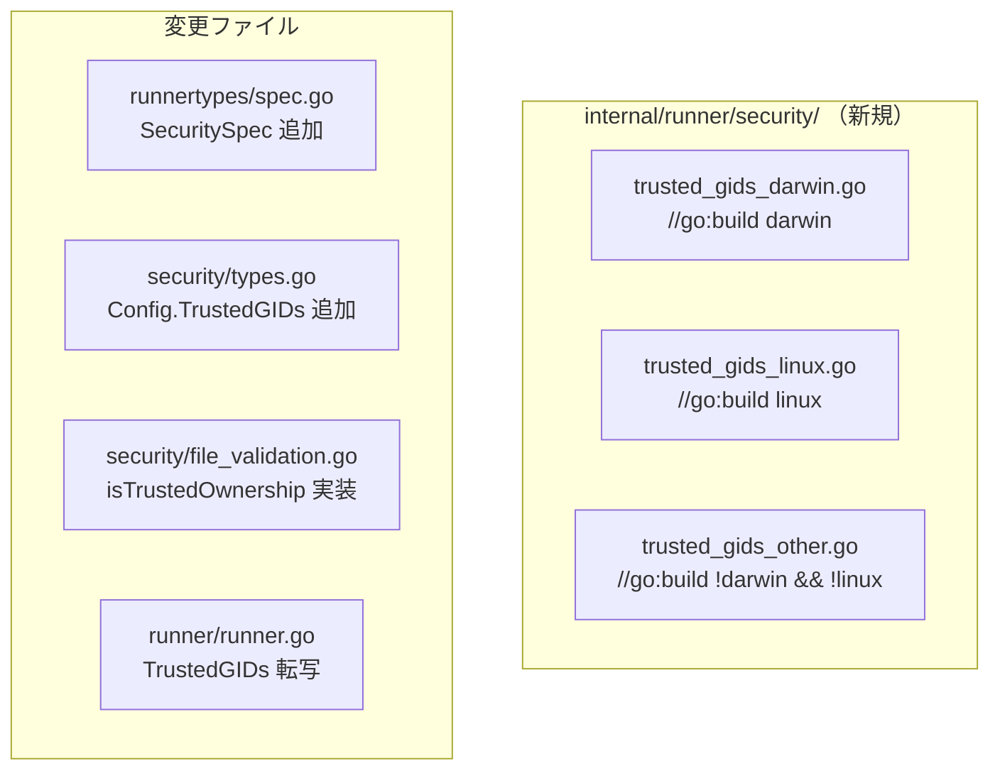

# 詳細仕様書: ディレクトリセキュリティ検証における信頼済みグループホワイトリスト

## 1. ファイル構成

### 1.1 新規ファイル



### 1.2 変更ファイル一覧

| ファイル | 変更種別 | 変更概要 |
|---------|---------|---------|
| `internal/runner/security/trusted_gids_darwin.go` | 新規 | macOS: `defaultTrustedGIDs` 定義 + `isTrustedGroup` 実装（Config.TrustedGIDs を無視） |
| `internal/runner/security/trusted_gids_linux.go` | 新規 | Linux: `defaultTrustedGIDs` 定義 + `isTrustedGroup` 実装（Config.TrustedGIDs を参照） |
| `internal/runner/security/trusted_gids_other.go` | 新規 | その他 OS: `defaultTrustedGIDs` 定義 + `isTrustedGroup` 実装（Config.TrustedGIDs を参照） |
| `internal/runner/runnertypes/spec.go` | 変更 | `SecuritySpec` 型と `ConfigSpec.Security` フィールド追加 |
| `internal/runner/security/types.go` | 変更 | `Config.TrustedGIDs` フィールド追加 |
| `internal/runner/security/file_validation.go` | 変更 | `validateGroupWritePermissions` の `isRootOwned` を `isTrustedOwnership` へ置き換え |
| `internal/runner/runner.go` | 変更 | `securityConfig.TrustedGIDs` に `configSpec.Security.TrustedGIDs` を転写 |

## 2. 関数・型仕様

### 2.1 プラットフォーム固有ファイル

各ファイルは `defaultTrustedGIDs` 変数と `isTrustedGroup` メソッドの両方を定義する。macOS は `Config.TrustedGIDs` を無視する実装、Linux/other は両方を合わせてチェックする実装とすることで、プラットフォームごとの動作差をこれらのファイルに閉じ込める。

#### `trusted_gids_darwin.go`

```go
//go:build darwin

package security

// defaultTrustedGIDs is the default trusted group GID set for macOS.
// GID 80 is the macOS admin group (fixed across versions).
// GID 0 is the root group (backward compatibility).
var defaultTrustedGIDs = map[uint32]struct{}{
    0:  {},
    80: {},
}

// isTrustedGroup checks only the default trusted GID set on macOS.
// On macOS, the trusted_gids config is ignored (admin GID 80 is fixed by build tag).
func (v *Validator) isTrustedGroup(gid uint32) bool {
    _, ok := defaultTrustedGIDs[gid]
    return ok
}
```

#### `trusted_gids_linux.go`

```go
//go:build linux

package security

// defaultTrustedGIDs is the default trusted group GID set for Linux.
// Only GID 0 (root group) is included. Administrator groups (wheel, etc.)
// vary by distribution and must be configured explicitly.
var defaultTrustedGIDs = map[uint32]struct{}{
    0: {},
}

// isTrustedGroup checks both Linux default trusted GIDs and Config.TrustedGIDs.
func (v *Validator) isTrustedGroup(gid uint32) bool {
    if _, ok := defaultTrustedGIDs[gid]; ok {
        return true
    }
    for _, trusted := range v.config.TrustedGIDs {
        if trusted == gid {
            return true
        }
    }
    return false
}
```

#### `trusted_gids_other.go`

```go
//go:build !darwin && !linux

package security

// defaultTrustedGIDs is the default trusted group GID set for other platforms.
var defaultTrustedGIDs = map[uint32]struct{}{
    0: {},
}

// isTrustedGroup checks both default trusted GIDs and Config.TrustedGIDs.
func (v *Validator) isTrustedGroup(gid uint32) bool {
    if _, ok := defaultTrustedGIDs[gid]; ok {
        return true
    }
    for _, trusted := range v.config.TrustedGIDs {
        if trusted == gid {
            return true
        }
    }
    return false
}
```

### 2.2 `internal/runner/runnertypes/spec.go` への追加

#### 追加する型

```go
// SecuritySpec maps to the [security] section in a TOML configuration file.
type SecuritySpec struct {
    // TrustedGIDs is an additional trusted group GID list
    // for Linux and other non-macOS platforms.
    // On macOS, this field is ignored. When omitted, only default
    // whitelist entries are used.
    TrustedGIDs []uint32 `toml:"trusted_gids"`
}
```

#### `ConfigSpec` への追加フィールド

```go
type ConfigSpec struct {
    // ... 既存フィールド ...

    // Security はセキュリティ関連の設定（任意）
    Security SecuritySpec `toml:"security"`
}
```

### 2.3 `internal/runner/security/types.go` への追加

#### `Config` への追加フィールド

```go
type Config struct {
    // ... 既存フィールド ...

    // TrustedGIDs is an additional trusted group GID list from config.
    // It is used with defaultTrustedGIDs in isTrustedGroup checks.
    // This field is effective on non-macOS platforms and ignored on macOS.
    TrustedGIDs []uint32
}
```

### 2.4 `internal/runner/security/file_validation.go` への変更

`isTrustedGroup` はプラットフォーム固有ファイル（`trusted_gids_*.go`）に定義する。
`file_validation.go` では `validateGroupWritePermissions` の root 判定を置き換え、信頼済み所有権を通した場合のデバッグログを追加する。

#### `validateGroupWritePermissions` の変更箇所

変更前:
```go
// Traditional safe case: root-owned directory
isRootOwned := stat.Uid == UIDRoot && stat.Gid == GIDRoot
if isRootOwned {
    return nil
}
```

変更後:
```go
// Safe case: root-owned directory with trusted group
isTrustedOwnership := stat.Uid == UIDRoot && v.isTrustedGroup(stat.Gid)
if isTrustedOwnership {
    slog.Debug("Directory has trusted ownership, group write allowed",
        slog.String("path", dirPath),
        slog.Any("gid", stat.Gid),
        slog.String("permissions", fmt.Sprintf("%04o", perm)))
    return nil
}
```

### 2.5 `internal/runner/runner.go` への変更

`runner.go` の `security.DefaultConfig()` 呼び出し直後に、`configSpec.Security.TrustedGIDs` を `securityConfig.TrustedGIDs` へ転写する。

macOS では `isTrustedGroup` が `Config.TrustedGIDs` を無視するため、転写自体は OS を問わず無条件に行ってよい。

```go
// Create security config with hardcoded allowed commands
securityConfig := security.DefaultConfig()
// Transfer trusted GIDs from config spec (ignored on macOS by isTrustedGroup)
securityConfig.TrustedGIDs = configSpec.Security.TrustedGIDs

// Create validator with merged security config
validator, err := security.NewValidator(securityConfig, security.WithGroupMembership(gmProvider))
```

## 3. 受け入れ基準とテストの対応

### AC-1: `/Applications` でエラーが発生しない（macOS）

**テスト対象**: `validateGroupWritePermissions`

```go
// Test case (macOS only)
//
// Test for AC-1
func TestValidateGroupWritePermissions_MacOSAdmin(t *testing.T) {
    if runtime.GOOS != "darwin" {
        t.Skip("macOS only")
    }
    // uid=0, gid=80, perm=0775 directory -> no error
    stat := &syscall.Stat_t{Uid: 0, Gid: 80}
    // ...
}
```

### AC-2: `others` 書き込み可能ディレクトリは引き続き拒否

**テスト対象**: `validateDirectoryComponentPermissions`

既存テストが担保する。`validateGroupWritePermissions` の変更による影響はない。

### AC-3: 非特権グループのグループ書き込みは引き続き拒否

**テスト対象**: `validateGroupWritePermissions`

```go
// Test for AC-3
func TestValidateGroupWritePermissions_UntrustedGroup(t *testing.T) {
    // uid=0, gid=1000 (untrusted), perm=0775 directory -> error
}
```

### AC-4: root:root 所有ディレクトリは引き続き許容

**テスト対象**: `validateGroupWritePermissions`

```go
// Test for AC-4 (backward compatibility)
func TestValidateGroupWritePermissions_RootRoot(t *testing.T) {
    // uid=0, gid=0, perm=0775 -> no error
}
```

### AC-5: Linux で `trusted_gids` を設定すると追加 GID が信頼済みになる

**テスト対象**: `isTrustedGroup`、TOML パース

```go
// Test for AC-5 (Linux only)
func TestValidateGroupWritePermissions_LinuxTrustedGID(t *testing.T) {
    if runtime.GOOS != "linux" {
        t.Skip("Linux only")
    }
    // With trusted_gids = [10], uid=0, gid=10, perm=0775 -> no error
    // Without trusted_gids, uid=0, gid=10, perm=0775 -> error
}
```

### AC-6: 既存テストの通過

`make test` および `make lint` がエラーなしで通過することを確認する。

## 4. エラーハンドリング

### 4.1 変更による新規エラーパス

本変更では新規エラーパスは発生しない。`isTrustedGroup` は `bool` を返すのみであり、エラーを返さない。

### 4.2 既存エラーの維持

変更後も `isTrustedOwnership` が false の場合は従来通り `CanUserSafelyWriteFile` によるチェックへ進む。このパスでのエラー型（`ErrInvalidDirPermissions`）は変更しない。

## 5. ロギング

### 5.1 ログ出力の変更

`validateGroupWritePermissions` の `isRootOwned` パスを `isTrustedOwnership` パスへ置き換える。ログ出力は以下のように変更する。

変更前（暗黙的にスキップ）:
```go
isRootOwned := stat.Uid == UIDRoot && stat.Gid == GIDRoot
if isRootOwned {
    return nil  // ログなし
}
```

変更後（デバッグログを追加）:
```go
isTrustedOwnership := stat.Uid == UIDRoot && v.isTrustedGroup(stat.Gid)
if isTrustedOwnership {
    slog.Debug("Directory has trusted ownership, group write allowed",
        slog.String("path", dirPath),
        slog.Any("gid", stat.Gid),
        slog.String("permissions", fmt.Sprintf("%04o", perm)))
    return nil
}
```

## 6. 後方互換性

### 6.1 設定ファイルの後方互換性

`[security]` セクションは省略可能であり、既存の設定ファイルは変更なしで動作する。

### 6.2 動作の後方互換性

| ケース | 変更前 | 変更後 |
|-------|--------|--------|
| uid=0, gid=0, perm=0775 | エラーなし | エラーなし（GID 0 はデフォルト信頼済み） |
| uid=0, gid=80, perm=0775（macOS） | エラー（false positive） | エラーなし（修正） |
| uid=0, gid=1000, perm=0775 | エラー（CanUserSafelyWriteFile で判定） | エラー（変更なし） |
| perm=0777 | エラー | エラー（変更なし） |

## 7. 実装上の注意事項

### 7.1 循環参照の確認

`runner.go` は `security` パッケージと `runnertypes` パッケージの両方を既に使用しており、新たな循環参照は生じない。

### 7.2 macOS での `trusted_gids` 設定の無視

macOS ビルドでは `runner.go` が `securityConfig.TrustedGIDs` に値を転写するが、`trusted_gids_darwin.go` の `isTrustedGroup` 実装が `Config.TrustedGIDs` を参照しない。したがって TOML で `trusted_gids` を指定しても macOS では効果がない。これにより macOS での誤設定（管理者でないグループを誤ってホワイトリスト化する等）を防止する。
