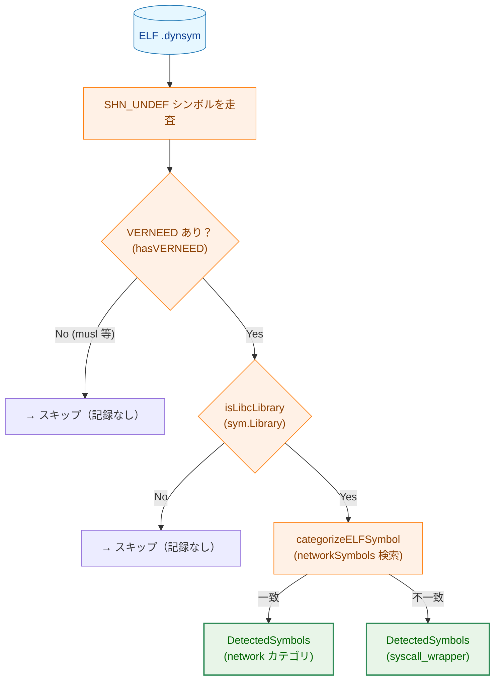
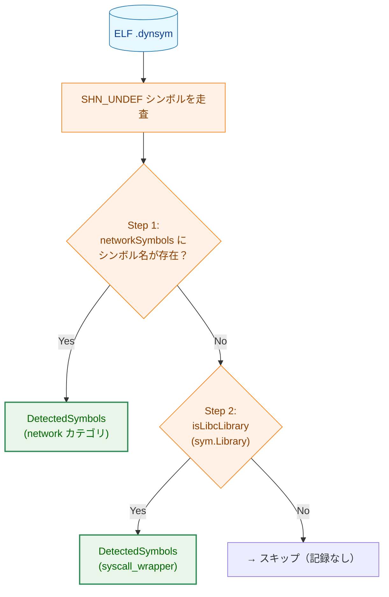
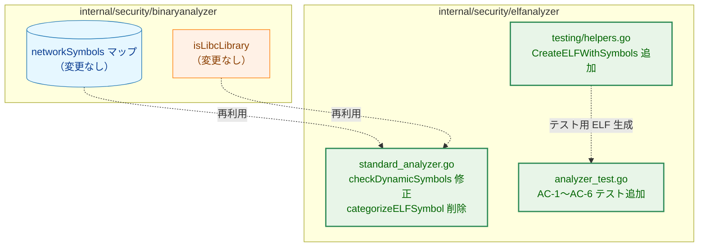
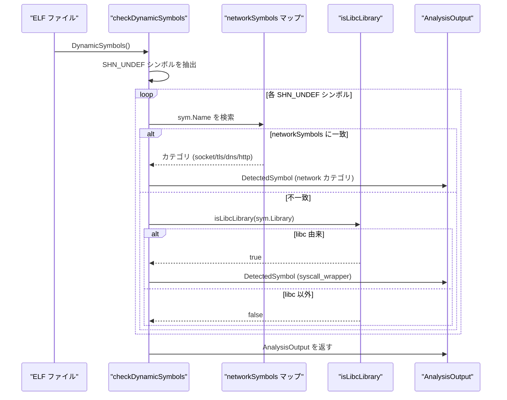

# アーキテクチャ設計書: ELF バイナリ VERNEED なし時の名前ベースシンボル検出

## 1. アーキテクチャ目標

- musl libc 等 VERNEED を生成しない ELF バイナリでネットワークシンボルを検出する
- 既存の `networkSymbols` マップ（Task 0076 導入済み）を再利用する
- glibc 環境への回帰なし（Task 0106 の検出結果を維持・拡張）
- 変更範囲を最小化する（`checkDynamicSymbols` の分類ロジックのみ）

## 2. システム構成

### 2.1 変更前アーキテクチャ

現行実装では、`checkDynamicSymbols` は「VERNEED あり」かつ「libc 由来」の条件を**両方**満たすシンボルのみを記録する。

**問題点**: VERNEED なし（musl）バイナリは `socket` や `SSL_CTX_new` をインポートしていても検出されない。また VERNEED あり・非 libc ライブラリ（libssl 等）由来のシンボルも記録されない。

### 2.2 変更後アーキテクチャ（FR-2 二段階フィルタ）

新実装では VERNEED の有無を問わず、**シンボル名** を最初の判定基準とする二段階フィルタを適用する。

**凡例（Legend）**

### 2.3 変更前後の比較

「記録」は `binaryanalyzer.AnalysisOutput.DetectedSymbols` への追加（内部表現）を指す。JSON `symbol_analysis.detected_symbols` にはシンボル名のみが保存され、カテゴリは含まれない（schema v19）。

| 条件 | 変更前 | 変更後 |
|------|--------|--------|
| VERNEED なし + `socket` | 検出されない | `socket` カテゴリで内部記録、JSON に名前 `"socket"` を保存 |
| VERNEED なし + `SSL_CTX_new` | 検出されない | `tls` カテゴリで内部記録、JSON に名前 `"SSL_CTX_new"` を保存 |
| VERNEED なし + `read` | 検出されない | 記録なし（networkSymbols 未登録、Library が空） |
| VERNEED あり + libc + `socket` | `socket` カテゴリで記録 | 同じ（Step 1 で記録） |
| VERNEED あり + libc + `read` | `syscall_wrapper` で記録 | 同じ（Step 2 で記録） |
| VERNEED あり + libssl + `SSL_CTX_new` | 記録なし | `tls` カテゴリで内部記録（改善） |
| VERNEED あり + libm + `pow` | 記録なし | 記録なし（変化なし） |

## 3. コンポーネント設計

### 3.1 変更コンポーネント

### 3.2 `hasVERNEED` 変数の削除

変更前のコードは `hasVERNEED` フラグを使って「VERNEED あり時のみ libc 判定を行う」というガードを設けていた。

新設計では `isLibcLibrary(sym.Library)` が Library 空文字で `false` を返す（既存実装の保証）ため、このガードは不要になる。musl バイナリでは `sym.Library` が常に空であり、Step 2 の libc 判定は自然に偽となる。

`hasVERNEED` スキャンを削除し、`hasAnyUndef` スキャン一本に簡略化する。

## 4. データフロー

## 5. テスト戦略

### 5.1 テスト用 ELF の生成

既存の `testing/helpers.go` には `CreateDynamicELFFile`（固定シンボル `__libc_start_main` のみ）しかない。AC-1〜AC-4、AC-6 を網羅するために、任意のシンボルリストを指定できる新ヘルパー `CreateELFWithSymbols` を追加する。AC-5（VERNEED あり）は既存の `with_socket.elf` テストデータを使用する。詳細は詳細仕様書を参照。

### 5.2 既存テストへの影響

`TestStandardELFAnalyzer_LibcSymbolFiltering` の `"non-libc symbols are not recorded"` サブテストは、libssl の `SSL_CTX_new` が記録されないことを assert している。新実装では Step 1 により `SSL_CTX_new` が `tls` カテゴリで記録されるため、このサブテストの更新が必要である。更新内容の詳細は詳細仕様書を参照。
