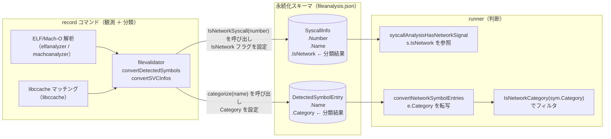
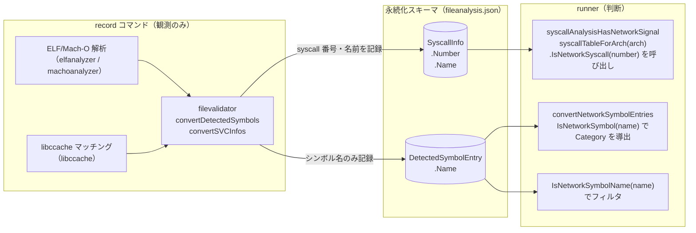
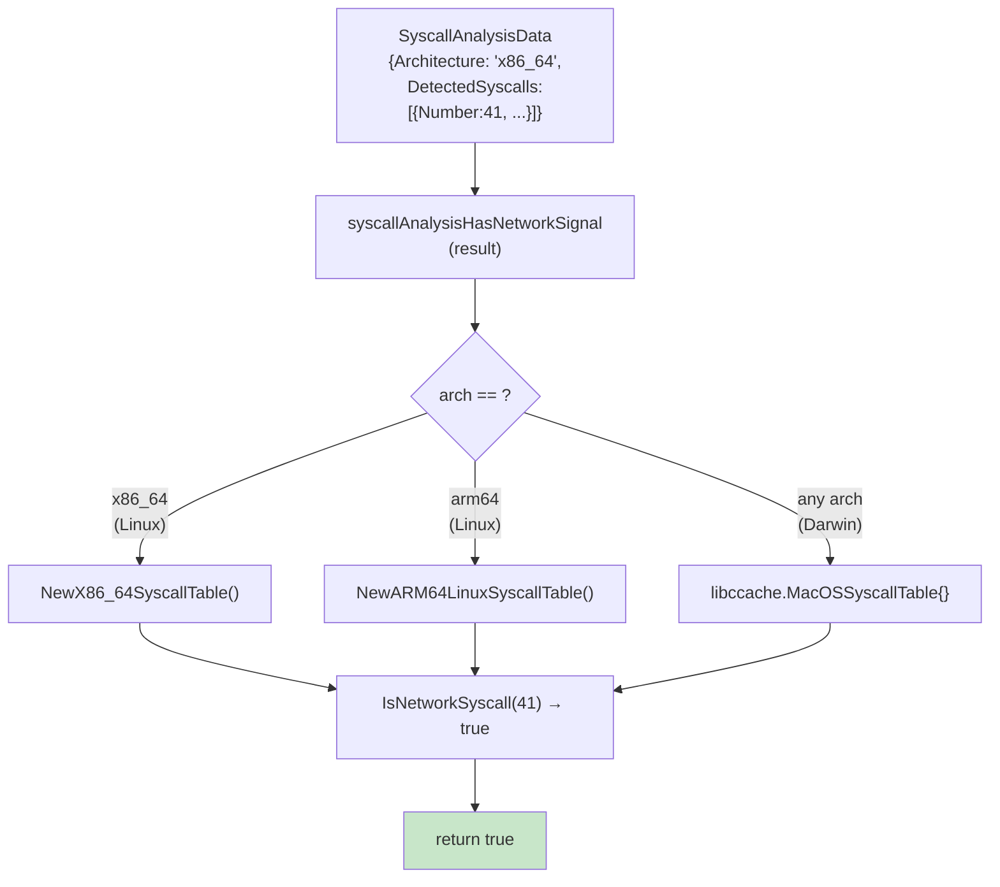
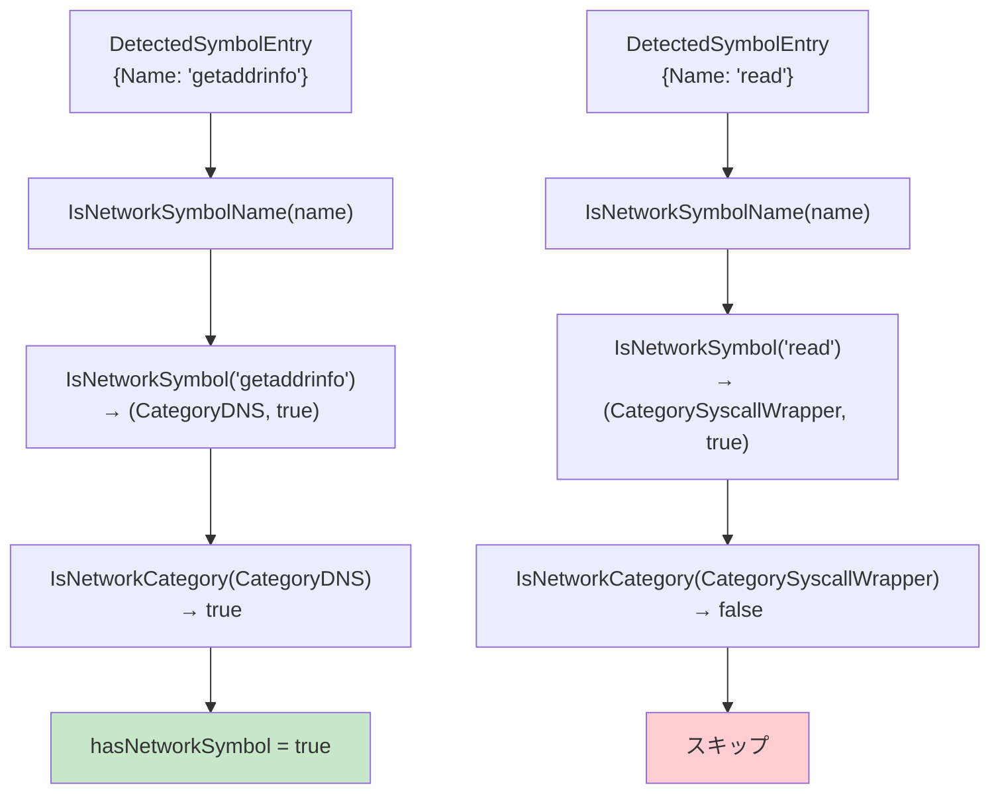
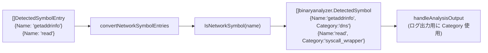
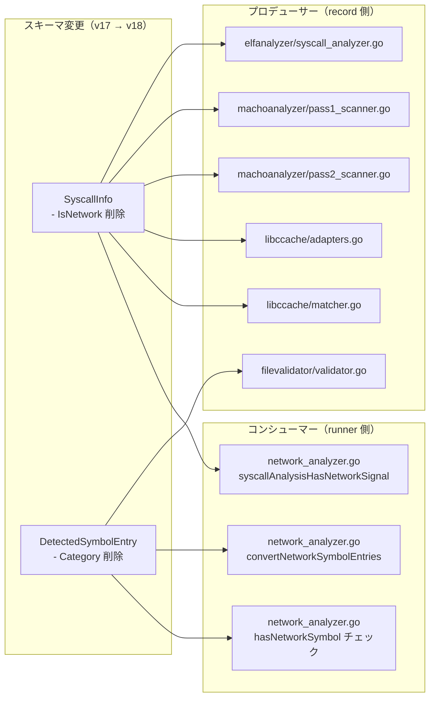

# アーキテクチャ設計書: record 側リスク分類フィールドの除去

## 1. システム概要

### 1.1 設計原則

#### 責務分離原則
- **record は観測者**: 実行ファイルの構造的事実（syscall 番号、シンボル名、ライブラリ依存）のみを記録する
- **runner は判断者**: 記録された観測事実にポリシーを適用してリスクを判断する
- リスク分類の定義変更（「どの syscall がネットワーク系か」「どのシンボルがネットワーク系か」）は runner 側だけに閉じる

#### 行動不変原則
- 本タスクはスキーマのクリーンアップであり、`IsNetworkOperation` の判定結果は変更前後で同一でなければならない
- syscall テーブルおよびシンボルレジストリの内容は変更しない

#### 最小変更原則
- 変更は削除が中心であり、新たなロジックの追加は最小限に抑える
- runner 内部の `binaryanalyzer.DetectedSymbol.Category` フィールドは保持する（ログ出力等で利用）

### 1.2 アーキテクチャ目標

1. **機能目標**
   - `SyscallInfo.IsNetwork` を JSON スキーマから除去し、runner が syscall 番号から導出する
   - `DetectedSymbolEntry.Category` を JSON スキーマから除去し、runner がシンボル名から導出する

2. **品質目標**
   - 既存テストをすべて通過させる
   - `runner` の `IsNetworkOperation` 返り値は変更前後で同一

3. **保守性目標**
   - ネットワーク系 syscall の定義変更がスキーマ変更を伴わなくなる
   - ネットワーク系シンボルの定義変更がスキーマ変更を伴わなくなる

---

## 2. 責務の変化

### 2.1 現行アーキテクチャ（変更前）



### 2.2 新アーキテクチャ（変更後）



---

## 3. コンポーネント構成

### 3.1 変更ファイル一覧

| ファイル | 変更種別 | 変更概要 |
|---------|---------|---------|
| `internal/common/syscall_types.go` | 変更 | `SyscallInfo.IsNetwork` フィールド削除 |
| `internal/common/syscall_grouping.go` | 変更 | `IsNetwork` 伝播ロジック削除 |
| `internal/fileanalysis/schema.go` | 変更 | `DetectedSymbolEntry.Category` フィールド削除、スキーマバージョン 18 |
| `internal/filevalidator/validator.go` | 変更 | `IsNetwork` / `Category` の設定箇所を削除 |
| `internal/runner/security/elfanalyzer/syscall_analyzer.go` | 変更 | `IsNetwork` 設定を削除（2 箇所） |
| `internal/runner/security/machoanalyzer/pass1_scanner.go` | 変更 | `IsNetwork` 設定を削除 |
| `internal/runner/security/machoanalyzer/pass2_scanner.go` | 変更 | `IsNetwork` 設定を削除 |
| `internal/libccache/adapters.go` | 変更 | `IsNetwork` 設定を削除 |
| `internal/libccache/matcher.go` | 変更 | `IsNetwork` 設定を削除（2 箇所） |
| `internal/runner/security/binaryanalyzer/network_symbols.go` | 変更 | `IsNetworkSymbolName` ヘルパー追加 |
| `internal/runner/security/network_analyzer.go` | 変更 | `syscallAnalysisHasNetworkSignal` を番号ベースに、`convertNetworkSymbolEntries` を名前ベースに変更 |

### 3.2 新規ファイルなし

本タスクでは新規ファイルは作成しない。すべての変更は既存ファイルへの修正である。

---

## 4. データフロー設計

### 4.1 `IsNetwork` 除去後の syscall ネットワーク判定フロー



`syscallAnalysisHasNetworkSignal` は関数内で `syscallTableForArch(arch string)` を呼び出し、アーキテクチャ文字列と `runtime.GOOS` からテーブルを選択する。未知のアーキテクチャの場合は `nil` を返し、ネットワーク検知をスキップする（`false` を返す fail-open 挙動）。

### 4.2 `Category` 除去後のシンボルネットワーク判定フロー



### 4.3 `convertNetworkSymbolEntries` 変更後のフロー



runner 内部の `binaryanalyzer.DetectedSymbol.Category` はログ出力に引き続き使用する。永続化スキーマには含まれない。

---

## 5. アーキテクチャ上の設計判断

### 5.1 syscall テーブル選択戦略

**問題**: `syscallAnalysisHasNetworkSignal` が `result.Architecture`（"x86_64", "arm64"）に加えて OS も区別する必要がある。"arm64" は Linux arm64 と macOS arm64 で syscall 番号体系が異なる。

**解決策**: `runtime.GOOS` を判定条件に加える。record と runner は同一システム上で実行されるため、記録時の OS と判定時の OS は一致する。

```
darwin → libccache.MacOSSyscallTable（BSD syscall、アーキテクチャ問わず）
linux, arch=x86_64 → elfanalyzer.NewX86_64SyscallTable()
linux, arch=arm64  → elfanalyzer.NewARM64LinuxSyscallTable()
不明/未サポート    → nil（ネットワーク検知をスキップ: `false` を返す fail-open）
```

`network_analyzer.go` はすでに `runtime.GOOS` を使用しており（`NewBinaryAnalyzer`）、同じパターンを踏襲する。

**トレードオフ**: `libccache.MacOSSyscallTable` を `network_analyzer.go` から使用するために `libccache` パッケージを import する。循環参照がないことを確認する（`libccache` → `elfanalyzer` → ... → `security` の経路が存在しないことを確認）。

### 5.2 `IsNetworkSymbolName` ヘルパーの導入

`IsNetworkSymbol(name)` は `(SymbolCategory, bool)` を返すが、呼び出し元が必要なのは「このシンボルがネットワーク系か（`syscall_wrapper` を除く）」という真偽値だけである。`binaryanalyzer.IsNetworkSymbolName(name)` を追加することで、呼び出し元のコードがシンプルになる。

### 5.3 runner 内部表現（`binaryanalyzer.DetectedSymbol.Category`）の保持

`binaryanalyzer.DetectedSymbol` は runner 内部の表現であり、永続化されない。`Category` フィールドはログ出力（`formatDetectedSymbols`）に使用されているため、削除しない。ただし `convertNetworkSymbolEntries` でのカテゴリ導出を `e.Category`（スキーマ由来）から `IsNetworkSymbol(e.Name)`（ランタイム導出）に切り替える。

---

## 6. スキーマ変更の影響範囲



---

## 7. テスト戦略

### 7.1 テスト方針

各受け入れ基準（AC-1〜AC-7）に対してユニットテストを作成する。外部動作の不変性（AC-3）については、既存のテストがリグレッションを担保するため、新規テストは差分のみに集中する。

### 7.2 テスト対象関数

| 関数 | テスト内容 |
|------|-----------|
| `syscallAnalysisHasNetworkSignal` | ネットワーク番号あり/なし/不明アーキテクチャ/nil の各ケース |
| `IsNetworkSymbolName` | ネットワークシンボル/syscall_wrapper/未知シンボルの判定 |
| `convertNetworkSymbolEntries` | Category が名前から正しく導出されること |
| `SyscallInfo` JSON シリアライズ | `is_network` フィールドが出力されないこと |
| `DetectedSymbolEntry` JSON シリアライズ | `category` フィールドが出力されないこと |

### 7.3 既存テストへの影響

`SyscallInfo.IsNetwork` を参照しているテストは削除またはフィールドアクセス箇所を除去する。`DetectedSymbolEntry.Category` を参照しているテストは同様に更新する。これらの変更はコンパイルエラーとして検出される。
