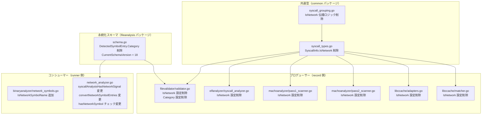

# 詳細仕様書: record 側リスク分類フィールドの除去

## 1. ファイル構成

### 1.1 変更ファイル一覧



---

## 2. 型・フィールド変更

### 2.1 `internal/common/syscall_types.go`

#### `SyscallInfo` 型の変更

**変更前:**
```go
type SyscallInfo struct {
    Number      int                 `json:"number"`
    Name        string              `json:"name,omitempty"`
    IsNetwork   bool                `json:"is_network"`
    Occurrences []SyscallOccurrence `json:"occurrences,omitempty"`
}
```

**変更後:**
```go
type SyscallInfo struct {
    Number      int                 `json:"number"`
    Name        string              `json:"name,omitempty"`
    Occurrences []SyscallOccurrence `json:"occurrences,omitempty"`
}
```

### 2.2 `internal/fileanalysis/schema.go`

#### `DetectedSymbolEntry` 型の変更

**変更前:**
```go
type DetectedSymbolEntry struct {
    Name     string `json:"name"`
    Category string `json:"category"`
}
```

**変更後:**
```go
type DetectedSymbolEntry struct {
    Name string `json:"name"`
}
```

#### `CurrentSchemaVersion` の更新

**変更前:**
```go
// Version 17 groups detected_syscalls by syscall number. ...
// Load returns SchemaVersionMismatchError for records with schema_version != 17.
CurrentSchemaVersion = 17
```

**変更後:**
```go
// Version 17 groups detected_syscalls by syscall number. ...
// Version 18 removes is_network from SyscallInfo and category from DetectedSymbolEntry.
// Risk classification (network syscall / network symbol detection) is now performed
// by the runner at runtime using syscall tables and symbol registries.
// Load returns SchemaVersionMismatchError for records with schema_version != 18.
CurrentSchemaVersion = 18
```

---

## 3. プロデューサー側変更

### 3.1 `internal/common/syscall_grouping.go`

`GroupAndSortSyscalls` から `IsNetwork` の伝播ロジックを削除する。

**変更前（抜粋）:**
```go
group = &SyscallInfo{
    Number:      info.Number,
    Name:        info.Name,
    IsNetwork:   info.IsNetwork,
    Occurrences: make([]SyscallOccurrence, 0),
}
// ...
if info.IsNetwork {
    group.IsNetwork = true
}
```

**変更後（抜粋）:**
```go
group = &SyscallInfo{
    Number:      info.Number,
    Name:        info.Name,
    Occurrences: make([]SyscallOccurrence, 0),
}
// IsNetwork の伝播ロジックを削除（フィールド自体が存在しない）
```

### 3.2 `internal/runner/security/elfanalyzer/syscall_analyzer.go`

`IsNetwork` 設定を行っている 2 箇所を削除する。

**変更箇所 1（Go wrapper syscall、行 329–331 付近）:**

変更前:
```go
if call.SyscallNumber >= 0 {
    info.Name = table.GetSyscallName(call.SyscallNumber)
    info.IsNetwork = table.IsNetworkSyscall(call.SyscallNumber)
}
```

変更後:
```go
if call.SyscallNumber >= 0 {
    info.Name = table.GetSyscallName(call.SyscallNumber)
}
```

**変更箇所 2（直接 syscall 命令、行 621–623 付近）:**

変更前:
```go
if info.Number >= 0 {
    info.Name = table.GetSyscallName(info.Number)
    info.IsNetwork = table.IsNetworkSyscall(info.Number)
}
```

変更後:
```go
if info.Number >= 0 {
    info.Name = table.GetSyscallName(info.Number)
}
```

### 3.3 `internal/runner/security/machoanalyzer/pass1_scanner.go`

`SyscallInfo` 初期化から `IsNetwork` フィールドを削除する。

**変更前:**
```go
info = common.SyscallInfo{
    Number:    num,
    Name:      table.GetSyscallName(num),
    IsNetwork: table.IsNetworkSyscall(num),
    Occurrences: []common.SyscallOccurrence{...},
}
```

**変更後:**
```go
info = common.SyscallInfo{
    Number:    num,
    Name:      table.GetSyscallName(num),
    Occurrences: []common.SyscallOccurrence{...},
}
```

### 3.4 `internal/runner/security/machoanalyzer/pass2_scanner.go`

pass1 と同様に `IsNetwork` フィールドを `SyscallInfo` 初期化から削除する。

### 3.5 `internal/libccache/adapters.go`

`SyscallInfo` 初期化から `IsNetwork` フィールドを削除する（行 243–254 付近）。

**変更前:**
```go
result = append(result, common.SyscallInfo{
    Number:    number,
    Name:      name,
    IsNetwork: a.syscallTable.IsNetworkSyscall(number),
    Occurrences: []common.SyscallOccurrence{...},
})
```

**変更後:**
```go
result = append(result, common.SyscallInfo{
    Number:    number,
    Name:      name,
    Occurrences: []common.SyscallOccurrence{...},
})
```

### 3.6 `internal/libccache/matcher.go`

`Match` メソッドおよび `MatchWithMethod` メソッド（計 2 箇所）の `SyscallInfo` 初期化から `IsNetwork` フィールドを削除する。

**変更前（各箇所）:**
```go
info := common.SyscallInfo{
    Number:    w.Number,
    Name:      m.syscallTable.GetSyscallName(w.Number),
    IsNetwork: m.syscallTable.IsNetworkSyscall(w.Number),
    Occurrences: []common.SyscallOccurrence{...},
}
```

**変更後（各箇所）:**
```go
info := common.SyscallInfo{
    Number:    w.Number,
    Name:      m.syscallTable.GetSyscallName(w.Number),
    Occurrences: []common.SyscallOccurrence{...},
}
```

### 3.7 `internal/filevalidator/validator.go`

**`buildSVCInfos` 関数（行 762–780 付近）:**

`SyscallInfo` 初期化から `IsNetwork: false` を削除する。フィールド自体が存在しなくなるため単純な削除となる。

**`convertDetectedSymbols` 関数（行 749–757 付近）:**

変更前:
```go
func convertDetectedSymbols(syms []binaryanalyzer.DetectedSymbol) []fileanalysis.DetectedSymbolEntry {
    ...
    entries[i] = fileanalysis.DetectedSymbolEntry{Name: s.Name, Category: s.Category}
    ...
}
```

変更後:
```go
func convertDetectedSymbols(syms []binaryanalyzer.DetectedSymbol) []fileanalysis.DetectedSymbolEntry {
    ...
    entries[i] = fileanalysis.DetectedSymbolEntry{Name: s.Name}
    ...
}
```

---

## 4. コンシューマー側変更

### 4.1 `internal/runner/security/binaryanalyzer/network_symbols.go`

`IsNetworkSymbolName` ヘルパー関数を追加する。

```go
// IsNetworkSymbolName returns true if the given symbol name belongs to a
// network-related category (socket, dns, tls, or http).
// Returns false for syscall_wrapper and dynamic_load categories, and for
// unknown symbol names.
func IsNetworkSymbolName(name string) bool {
    cat, found := IsNetworkSymbol(name)
    return found && IsNetworkCategory(string(cat))
}
```

### 4.2 `internal/runner/security/network_analyzer.go`

#### `syscallTableForArch` 関数の追加

`network_analyzer.go` に以下のヘルパーを追加する。

```go
// syscallTableInterface abstracts syscall number → network classification.
// Structurally identical to elfanalyzer.SyscallNumberTable (defined locally
// to avoid depending on a specific package here).
type syscallTableInterface interface {
    IsNetworkSyscall(number int) bool
}

// syscallTableForArch returns the appropriate SyscallNumberTable for the given
// architecture string and current platform (runtime.GOOS).
// Returns nil if the architecture is unknown or unsupported on this platform.
func syscallTableForArch(arch string) syscallTableInterface {
    if runtime.GOOS == gosDarwin {
        return libccache.MacOSSyscallTable{}
    }
    switch arch {
    case "x86_64":
        return elfanalyzer.NewX86_64SyscallTable()
    case "arm64":
        return elfanalyzer.NewARM64LinuxSyscallTable()
    }
    return nil
}
```

`network_analyzer.go` がすでに `libccache` を import していない場合は import を追加する。循環参照の有無を事前に確認すること（§5 参照）。

#### `syscallAnalysisHasNetworkSignal` 関数の変更

**変更前:**
```go
func syscallAnalysisHasNetworkSignal(result *fileanalysis.SyscallAnalysisResult) bool {
    if result == nil {
        return false
    }
    for _, s := range result.DetectedSyscalls {
        if s.IsNetwork {
            return true
        }
    }
    return false
}
```

**変更後:**
```go
// syscallAnalysisHasNetworkSignal reports whether any detected syscall is
// network-related according to the syscall table for the result's architecture.
// Returns false when the architecture is unknown or unsupported (safe side).
func syscallAnalysisHasNetworkSignal(result *fileanalysis.SyscallAnalysisResult) bool {
    if result == nil {
        return false
    }
    table := syscallTableForArch(result.Architecture)
    if table == nil {
        return false
    }
    for _, s := range result.DetectedSyscalls {
        if s.Number >= 0 && table.IsNetworkSyscall(s.Number) {
            return true
        }
    }
    return false
}
```

関数シグネチャは変更しない（引数を増やさない）。`table` の選択は関数内部で行う。

#### `convertNetworkSymbolEntries` 関数の変更

**変更前:**
```go
func convertNetworkSymbolEntries(entries []fileanalysis.DetectedSymbolEntry) []binaryanalyzer.DetectedSymbol {
    if len(entries) == 0 {
        return nil
    }
    syms := make([]binaryanalyzer.DetectedSymbol, len(entries))
    for i, e := range entries {
        syms[i] = binaryanalyzer.DetectedSymbol{Name: e.Name, Category: e.Category}
    }
    return syms
}
```

**変更後:**
```go
func convertNetworkSymbolEntries(entries []fileanalysis.DetectedSymbolEntry) []binaryanalyzer.DetectedSymbol {
    if len(entries) == 0 {
        return nil
    }
    syms := make([]binaryanalyzer.DetectedSymbol, len(entries))
    for i, e := range entries {
        cat, _ := binaryanalyzer.IsNetworkSymbol(e.Name)
        syms[i] = binaryanalyzer.DetectedSymbol{Name: e.Name, Category: string(cat)}
    }
    return syms
}
```

#### `isNetworkViaBinaryAnalysis` 内の `hasNetworkSymbol` チェックの変更

**変更前:**
```go
hasNetworkSymbol := false
for _, sym := range data.DetectedSymbols {
    if binaryanalyzer.IsNetworkCategory(sym.Category) {
        hasNetworkSymbol = true
        break
    }
}
```

**変更後:**
```go
hasNetworkSymbol := false
for _, sym := range data.DetectedSymbols {
    if binaryanalyzer.IsNetworkSymbolName(sym.Name) {
        hasNetworkSymbol = true
        break
    }
}
```

---

## 5. 実装上の注意事項

### 5.1 循環参照の確認

`network_analyzer.go`（`runner/security` パッケージ）から `libccache` パッケージを import するために循環参照がないことを確認する。

現在の import 関係（関連部分のみ）:
```
runner/security/network_analyzer.go
  → runner/security/elfanalyzer
  → runner/security/machoanalyzer
  → fileanalysis
  → common
libccache
  → elfanalyzer
  → common
```

`libccache` は `runner/security` を import していないため、`runner/security` → `libccache` の追加は循環参照を生じさせない。

### 5.2 `SyscallAnalysisResult` 型エイリアスの注意

`fileanalysis.SyscallAnalysisResult` は `fileanalysis.SyscallAnalysisData` のエイリアスまたはラッパーである可能性がある。`network_analyzer.go` が `*fileanalysis.SyscallAnalysisResult` を受け取っている場合、この型が `SyscallAnalysisData` と同一か確認し、`Architecture` フィールドへのアクセスが正しいことを検証する。

### 5.3 `Number == -1` の扱い

`SyscallInfo.Number == -1` は「syscall 番号が解決できなかった」ことを示す。`syscallAnalysisHasNetworkSignal` では `s.Number >= 0` の条件で除外する（変更後のコードに明示済み）。この動作は変更前の `IsNetwork == false`（`Number == -1` のエントリは IsNetwork = false で作成される）と等価である。

### 5.4 `IsNetworkSymbol` の返り値と `DynamicLoadSymbols`

`DynamicLoadSymbols` に含まれるシンボル（dlopen, dlsym, dlvsym）は `binaryanalyzer.IsDynamicLoadSymbol(name)` で識別される。これらは `networkSymbolRegistry` には含まれないため、`IsNetworkSymbol(name)` は `("", false)` を返す。`convertNetworkSymbolEntries` は `DynamicLoadSymbols` にも呼ばれるが、`Category: ""` として扱われ、ログ表示のみに影響する（`IsNetworkCategory("")` は false を返すため、判定ロジックには影響しない）。

---

## 6. 受け入れ基準とテストの対応

### AC-1: `SyscallInfo` に `is_network` フィールドが存在しない

**テスト対象**: `common.SyscallInfo` の JSON マーシャリング

```go
// AC-1: is_network フィールドが JSON 出力に含まれないこと
func TestSyscallInfo_JSONDoesNotContainIsNetwork(t *testing.T) {
    info := common.SyscallInfo{Number: 41, Name: "socket"}
    data, err := json.Marshal(info)
    require.NoError(t, err)
    assert.NotContains(t, string(data), "is_network")
}
```

**コンパイル保証**: `SyscallInfo.IsNetwork` フィールドが削除されているため、`info.IsNetwork` へのアクセスはコンパイルエラーになる。

### AC-2: `DetectedSymbolEntry` に `category` フィールドが存在しない

**テスト対象**: `fileanalysis.DetectedSymbolEntry` の JSON マーシャリング

```go
// AC-2: category フィールドが JSON 出力に含まれないこと
func TestDetectedSymbolEntry_JSONDoesNotContainCategory(t *testing.T) {
    entry := fileanalysis.DetectedSymbolEntry{Name: "getaddrinfo"}
    data, err := json.Marshal(entry)
    require.NoError(t, err)
    assert.NotContains(t, string(data), "category")
}
```

**コンパイル保証**: `DetectedSymbolEntry.Category` フィールドが削除されているため、`entry.Category` へのアクセスはコンパイルエラーになる。

### AC-3: ネットワーク検出結果が変更前後で一致する

**テスト対象**: `syscallAnalysisHasNetworkSignal`、`isNetworkViaBinaryAnalysis`

以下の各ケースで `IsNetworkOperation` の結果が変更前後で等しいことを確認する:

```go
// AC-3a: ネットワーク syscall を含む SyscallAnalysisData
func TestSyscallAnalysisHasNetworkSignal_NetworkSyscall(t *testing.T) {
    result := &fileanalysis.SyscallAnalysisResult{
        SyscallAnalysisResultCore: common.SyscallAnalysisResultCore{
            Architecture: "x86_64",
            DetectedSyscalls: []common.SyscallInfo{
                {Number: 41, Name: "socket"}, // x86_64 socket syscall
            },
        },
    }
    assert.True(t, syscallAnalysisHasNetworkSignal(result))
}

// AC-3b: ネットワーク syscall を含まない SyscallAnalysisData
func TestSyscallAnalysisHasNetworkSignal_NonNetworkSyscall(t *testing.T) {
    result := &fileanalysis.SyscallAnalysisResult{
        SyscallAnalysisResultCore: common.SyscallAnalysisResultCore{
            Architecture: "x86_64",
            DetectedSyscalls: []common.SyscallInfo{
                {Number: 1, Name: "write"}, // 非ネットワーク syscall
            },
        },
    }
    assert.False(t, syscallAnalysisHasNetworkSignal(result))
}

// AC-3c: ネットワークシンボルを含む DetectedSymbols（isNetworkViaBinaryAnalysis 経由）
// 既存の NetworkAnalyzer 統合テストが担保する
```

### AC-4: スキーマバージョンが 18 に更新されている

**テスト対象**: `fileanalysis.CurrentSchemaVersion`、`fileanalysis.Load`

```go
// AC-4a: CurrentSchemaVersion が 18 であること
func TestCurrentSchemaVersion(t *testing.T) {
    assert.Equal(t, 18, fileanalysis.CurrentSchemaVersion)
}

// AC-4b: schema_version=17 のレコードが SchemaVersionMismatchError を返すこと
func TestLoad_SchemaVersion17_ReturnsError(t *testing.T) {
    // schema_version: 17 の JSON を構築
    json := `{"schema_version": 17, ...}`
    _, err := fileanalysis.Load(...)
    var mismatch *fileanalysis.SchemaVersionMismatchError
    assert.ErrorAs(t, err, &mismatch)
    assert.Equal(t, 18, mismatch.Expected)
    assert.Equal(t, 17, mismatch.Actual)
}
```

### AC-5: 古いスキーマのレコードが自動移行される

**テスト対象**: `fileanalysis.Store.Update`

```go
// AC-5: schema_version=17 のレコードが --force なしで上書きされること
func TestStore_Update_OlderSchema_Overwritable(t *testing.T) {
    // schema_version=17 のレコードを書き込んだ後、Store.Update を呼び出す
    // ErrSchemaNewer エラーが返らないこと（上書き可能と判断されること）
}
```

AC-5 は `Store.Update` の既存動作（`Actual < Expected` → 上書き可能）に依存する。既存のスキーマバージョン関連テストが担保する。

### AC-6: `make test` および `make lint` が通過する

CI で確認する。個別テストでの担保は不要。

### AC-7: FR-2 の安全側挙動が満たされる

**テスト対象**: `syscallAnalysisHasNetworkSignal`、`syscallTableForArch`

```go
// AC-7a: 不明なアーキテクチャでは false を返すこと
func TestSyscallAnalysisHasNetworkSignal_UnknownArch(t *testing.T) {
    result := &fileanalysis.SyscallAnalysisResult{
        SyscallAnalysisResultCore: common.SyscallAnalysisResultCore{
            Architecture: "mips",  // 未サポート
            DetectedSyscalls: []common.SyscallInfo{
                {Number: 41},
            },
        },
    }
    assert.False(t, syscallAnalysisHasNetworkSignal(result))
}

// AC-7b: Number < 0 の syscall はネットワーク判定に使用しないこと
func TestSyscallAnalysisHasNetworkSignal_NegativeNumber(t *testing.T) {
    result := &fileanalysis.SyscallAnalysisResult{
        SyscallAnalysisResultCore: common.SyscallAnalysisResultCore{
            Architecture: "x86_64",
            DetectedSyscalls: []common.SyscallInfo{
                {Number: -1},  // 未解決
            },
        },
    }
    assert.False(t, syscallAnalysisHasNetworkSignal(result))
}

// AC-7c: result が nil の場合 false を返すこと
func TestSyscallAnalysisHasNetworkSignal_Nil(t *testing.T) {
    assert.False(t, syscallAnalysisHasNetworkSignal(nil))
}
```

---

## 7. 後方互換性

### 7.1 スキーマの後方互換性

| レコードのバージョン | Load の結果 | Store.Update の動作 |
|-------------------|------------|-------------------|
| 18（新） | 成功 | 更新可（同一バージョン） |
| 17（旧） | `SchemaVersionMismatchError` | 上書き可（Actual < Expected） |
| 19 以降（将来） | `SchemaVersionMismatchError` | 拒否（Actual > Expected） |

### 7.2 動作の後方互換性

| ケース | 変更前 | 変更後 |
|-------|--------|--------|
| syscall 41 (socket, x86_64) が検出された | `IsNetwork=true` → ネットワーク判定 | `IsNetworkSyscall(41)=true` → ネットワーク判定（同等） |
| syscall 1 (write, x86_64) が検出された | `IsNetwork=false` → 非ネットワーク | `IsNetworkSyscall(1)=false` → 非ネットワーク（同等） |
| `getaddrinfo` シンボルが検出された | `Category="dns"`, `IsNetworkCategory=true` → ネットワーク | `IsNetworkSymbolName=true` → ネットワーク（同等） |
| `read` シンボルが検出された | `Category="syscall_wrapper"`, `IsNetworkCategory=false` → 非ネットワーク | `IsNetworkSymbolName=false` → 非ネットワーク（同等） |
| `dlopen` シンボルが検出された | `DynamicLoadSymbols` → isHighRisk | `DynamicLoadSymbols`（変更なし）→ isHighRisk（同等） |

---

## 8. テスト変更一覧

### 8.1 削除・修正が必要なテスト

以下のテストは `SyscallInfo.IsNetwork` または `DetectedSymbolEntry.Category` を直接参照しており、フィールド削除に伴いコンパイルエラーになる。各テストの意図を確認し、以下の方針で修正する。

| ファイル | 参照フィールド | 対応方針 |
|---------|-------------|---------|
| `internal/common/syscall_types_test.go` | `IsNetwork` | `IsNetwork` フィールドの参照を削除。テストが IsNetwork の設定/読み取りのみを行っているなら削除。他の不変性を検証しているなら IsNetwork 参照箇所のみ除去 |
| `internal/common/syscall_grouping_test.go` | `IsNetwork` | `IsNetwork` フィールドの参照を削除。グルーピング結果の期待値から `IsNetwork` を除去 |
| `internal/fileanalysis/syscall_store_test.go` | `IsNetwork` | `IsNetwork` フィールドの参照を削除。期待値の構築から `IsNetwork` を除去 |
| `internal/fileanalysis/network_symbol_store_test.go` | `Category` | `DetectedSymbolEntry.Category` の設定・検証を削除。期待値の構築から `Category` を除去し、`Name` のみで検証する |
| `internal/filevalidator/validator_test.go` | `IsNetwork` | `IsNetwork` フィールドの参照を削除。期待値の構築および assert から `IsNetwork` を除去 |
| `internal/filevalidator/validator_macho_test.go` | `IsNetwork` | `IsNetwork` フィールドの参照を削除。期待値の構築および assert から `IsNetwork` を除去 |
| `internal/runner/security/syscall_store_adapter_test.go` | `IsNetwork` | `IsNetwork` フィールドの参照を削除。`SyscallInfo` 初期化から `IsNetwork` を除去 |
| `internal/runner/security/network_analyzer_test.go` | `IsNetwork`、`Category`（`DetectedSymbolEntry`） | `SyscallInfo.IsNetwork` の参照を削除し、`syscallAnalysisHasNetworkSignal` のテストを新ロジックに合わせて更新。`DetectedSymbolEntry{Category: ...}` の `Category` フィールドを削除 |
| `internal/runner/security/command_analysis_test.go` | `Category`（`DetectedSymbolEntry`） | `fileanalysis.DetectedSymbolEntry{Category: ...}` の `Category` フィールドを削除 |
| `internal/libccache/adapters_macho_test.go` | `IsNetwork` | `IsNetwork` の期待値を `SyscallInfo` から除去 |
| `internal/libccache/matcher_test.go` | `IsNetwork` | `IsNetwork` の期待値を `SyscallInfo` から除去 |
| `internal/libccache/integration_darwin_test.go` | `IsNetwork` | `SyscallInfo.IsNetwork` の assert を削除 |

### 8.2 新規追加テスト

| テスト | ファイル |
|-------|---------|
| `TestSyscallInfo_JSONDoesNotContainIsNetwork` | `internal/common/syscall_types_test.go` |
| `TestDetectedSymbolEntry_JSONDoesNotContainCategory` | `internal/fileanalysis/schema_test.go` |
| `TestSyscallAnalysisHasNetworkSignal_*`（AC-3, AC-7 対応） | `internal/runner/security/network_analyzer_test.go` |
| `TestIsNetworkSymbolName` | `internal/runner/security/binaryanalyzer/network_symbols_test.go` |
| `TestCurrentSchemaVersion` | `internal/fileanalysis/schema_test.go` |
