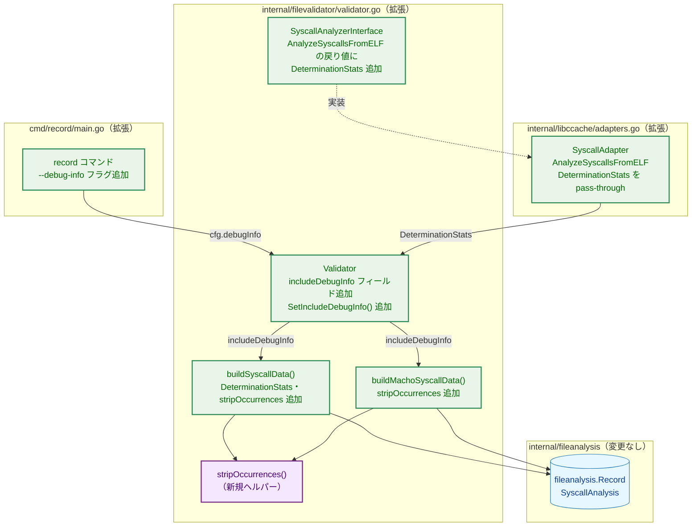
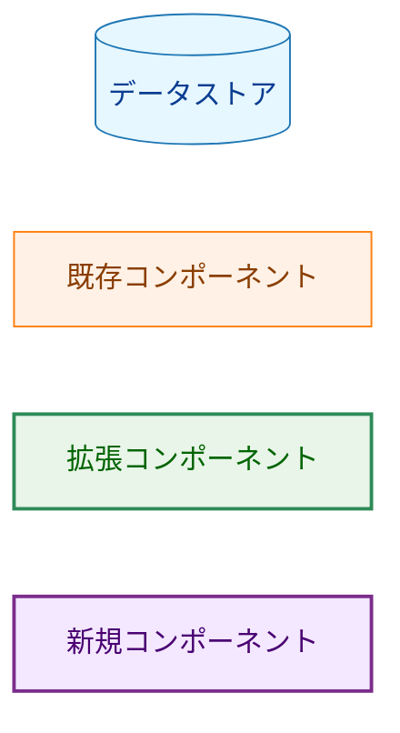
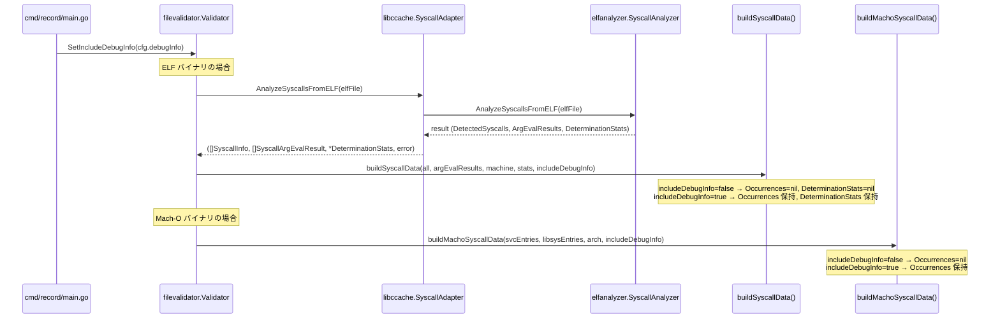

# アーキテクチャ設計書: record コマンドへのデバッグ情報出力フラグ追加

## 1. システム概要

### 1.1 目的

`record` コマンドに `--debug-info` フラグを追加し、セキュリティ判断に不要なデバッグ情報
（`Occurrences`、`DeterminationStats`）を JSON 出力からデフォルトで除外する。
フラグ指定時のみこれらを含める。

### 1.2 設計原則

- **最小変更**: 解析ロジックは変更しない。出力制御のみを追加する
- **フラグ伝搬パターン一致**: 既存の `SetSyscallAnalyzer` / `SetLibcCache` と同じセッター方式で `includeDebugInfo` を `Validator` へ伝搬する
- **保存前除去**: `Occurrences` / `DeterminationStats` の除去はすべて保存直前（`buildSyscallData` / `buildMachoSyscallData`）で行い、解析中の使用には影響を与えない

## 2. システムアーキテクチャ

### 2.1 全体構成図



**凡例（Legend）**



### 2.2 フラグ伝搬フロー



### 2.3 変更前後の JSON 出力比較

#### デフォルト（`--debug-info` なし）— 変更後

```json
{
  "detected_syscalls": [
    {
      "number": 1,
      "name": "write"
    }
  ]
}
```

#### `--debug-info` あり — 変更後（変更前と同等）

```json
{
  "detected_syscalls": [
    {
      "number": 1,
      "name": "write",
      "occurrences": [
        {
          "location": 4198400,
          "determination_method": "immediate"
        }
      ]
    }
  ],
  "determination_stats": {
    "immediate_total": 1
  }
}
```

## 3. コンポーネント設計

### 3.1 `cmd/record/main.go`

**変更内容:**
- `recordConfig` に `debugInfo bool` フィールドを追加
- `parseArgs` に `--debug-info` フラグを追加
- `run` 関数内で `fv.SetIncludeDebugInfo(cfg.debugInfo)` を呼び出す

### 3.2 `internal/filevalidator/validator.go`

#### `SyscallAnalyzerInterface`

`AnalyzeSyscallsFromELF` の戻り値に `*common.SyscallDeterminationStats` を追加する。

**変更前:**
```go
AnalyzeSyscallsFromELF(elfFile *elf.File) ([]common.SyscallInfo, []common.SyscallArgEvalResult, error)
```

**変更後:**
```go
AnalyzeSyscallsFromELF(elfFile *elf.File) ([]common.SyscallInfo, []common.SyscallArgEvalResult, *common.SyscallDeterminationStats, error)
```

**影響範囲:**
- `libccache.SyscallAdapter`（本タスクで更新）
- テストの stub 実装（本タスクで更新）

#### `Validator` 構造体

```go
type Validator struct {
    // ...（既存フィールド）
    includeDebugInfo bool  // 新規追加
}
```

#### セッターメソッド

```go
func (v *Validator) SetIncludeDebugInfo(b bool) {
    v.includeDebugInfo = b
}
```

#### `buildSyscallData` 関数シグネチャ変更

**変更前:**
```go
func buildSyscallData(all []common.SyscallInfo, argEvalResults []common.SyscallArgEvalResult, machine elf.Machine) *fileanalysis.SyscallAnalysisData
```

**変更後:**
```go
func buildSyscallData(all []common.SyscallInfo, argEvalResults []common.SyscallArgEvalResult, machine elf.Machine, stats *common.SyscallDeterminationStats, includeDebugInfo bool) *fileanalysis.SyscallAnalysisData
```

#### `buildMachoSyscallData` 関数シグネチャ変更

**変更前:**
```go
func buildMachoSyscallData(svcEntries []common.SyscallInfo, libsysEntries []common.SyscallInfo, arch string) *fileanalysis.SyscallAnalysisData
```

**変更後:**
```go
func buildMachoSyscallData(svcEntries []common.SyscallInfo, libsysEntries []common.SyscallInfo, arch string, includeDebugInfo bool) *fileanalysis.SyscallAnalysisData
```

#### `stripOccurrences` ヘルパー関数（新規）

```go
func stripOccurrences(syscalls []common.SyscallInfo) []common.SyscallInfo
```

各 `SyscallInfo` のコピーを作成し `Occurrences` を nil にして返す。

### 3.3 `internal/libccache/adapters.go`

`SyscallAdapter.AnalyzeSyscallsFromELF` の戻り値に `*common.SyscallDeterminationStats` を追加し、
elfanalyzer の結果から pass-through する。

**変更前:**
```go
func (a *SyscallAdapter) AnalyzeSyscallsFromELF(elfFile *elf.File) ([]common.SyscallInfo, []common.SyscallArgEvalResult, error)
```

**変更後:**
```go
func (a *SyscallAdapter) AnalyzeSyscallsFromELF(elfFile *elf.File) ([]common.SyscallInfo, []common.SyscallArgEvalResult, *common.SyscallDeterminationStats, error)
```

## 4. 変更コンポーネント一覧

| ファイル | 変更種別 | 主な変更内容 |
|---------|---------|------------|
| `cmd/record/main.go` | 拡張 | `--debug-info` フラグ追加、`SetIncludeDebugInfo` 呼び出し |
| `internal/filevalidator/validator.go` | 拡張 | `SyscallAnalyzerInterface` 変更、`Validator` フィールド・セッター追加、`buildSyscallData` / `buildMachoSyscallData` 変更、`stripOccurrences` 追加 |
| `internal/libccache/adapters.go` | 拡張 | `SyscallAdapter.AnalyzeSyscallsFromELF` の戻り値変更 |
| `internal/filevalidator/validator_test.go` | 拡張 | stub 更新、デバッグフラグ有無テスト追加 |
| `internal/filevalidator/validator_macho_test.go` | 拡張 | デバッグフラグ有無テスト追加 |
| `internal/libccache/adapters_test.go` | 拡張 | stub 更新 |

**変更なし:**
- `internal/runner/security/elfanalyzer/` — 解析ロジックは変更しない
- `internal/runner/security/machoanalyzer/` — 解析ロジックは変更しない
- `internal/fileanalysis/` — スキーマ変更なし
- `internal/runner/` — `runner` コマンドは変更しない
- `cmd/verify/` — `verify` コマンドは変更しない

## 5. 設計上の判断

### 5.1 `SyscallAnalyzerInterface` の戻り値変更

`DeterminationStats` を JSON に含めるためには、elfanalyzer の結果から
`DeterminationStats` を `Validator` へ届ける経路が必要である。

既存の `SyscallAnalyzerInterface.AnalyzeSyscallsFromELF` は
`([]SyscallInfo, []SyscallArgEvalResult, error)` のみを返すため、
`DeterminationStats` は `libccache.SyscallAdapter` 内で破棄されていた。

今回この戻り値に `*common.SyscallDeterminationStats` を追加することで、
既存の呼び出しパターンを維持しつつ、デバッグモード時に `DeterminationStats` を
JSON に含められるようにする。

**代替案（却下）**: `Validator` 内に `DeterminationStats` を取得する専用メソッドを追加し
型アサーションで呼び出す方式。インターフェースを変更しない利点があるが、
型アサーションは脆くテストが難しいため採用しない。

### 5.2 `stripOccurrences` の責務配置

`Occurrences` の除去は `buildSyscallData` / `buildMachoSyscallData` の呼び出し側ではなく、
これらの関数内部で行う。これにより、呼び出し側（`updateAnalysisRecord` / `analyzeMachoSyscalls`）が
フラグの影響を意識せず、保存先を一箇所に集約できる。

### 5.3 スキーマバージョン

`Occurrences` フィールドはすでに `omitempty` タグを持つ。デフォルト出力で nil になるだけであり、
スキーマの後方互換性は保たれる。スキーマバージョンの変更は不要。
