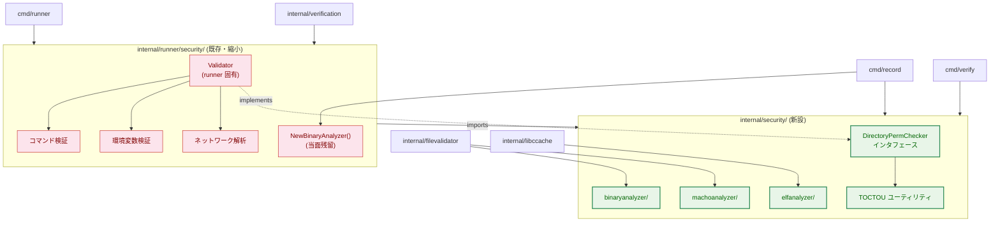
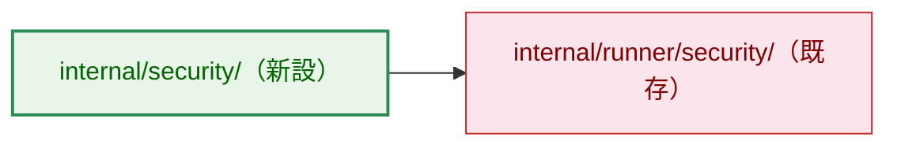
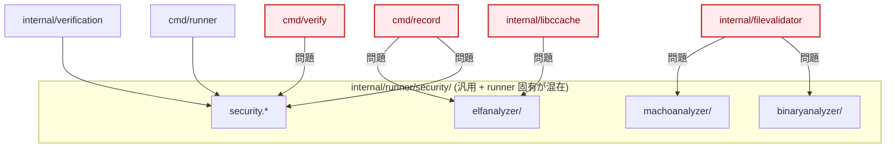
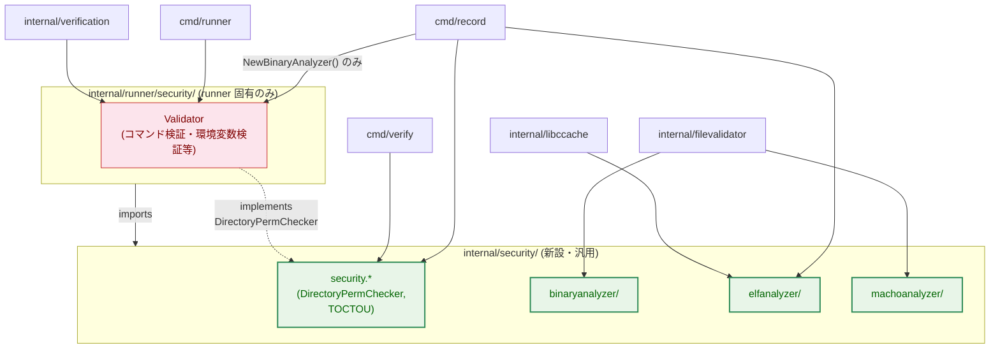
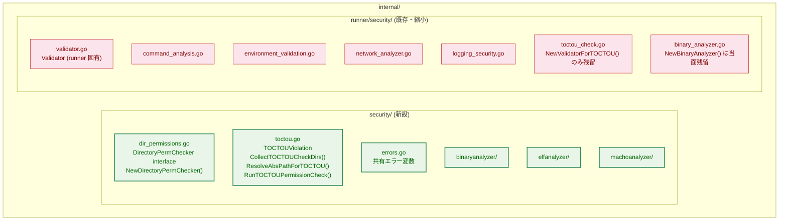
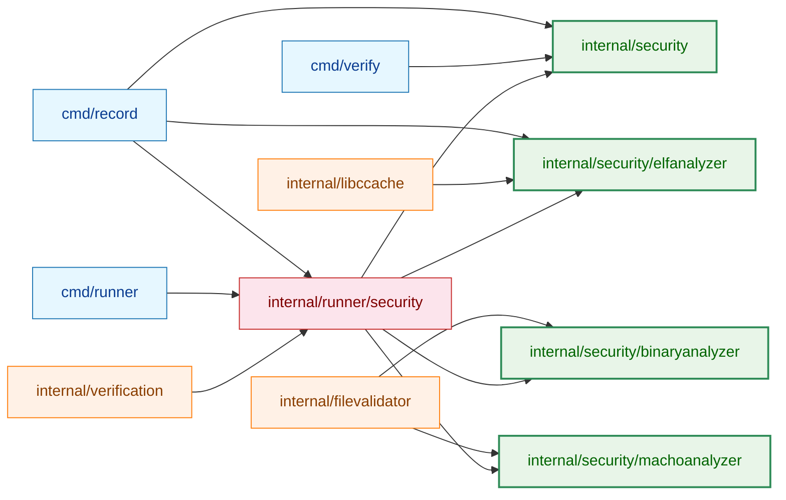
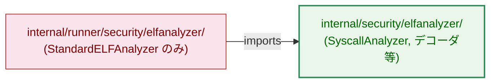
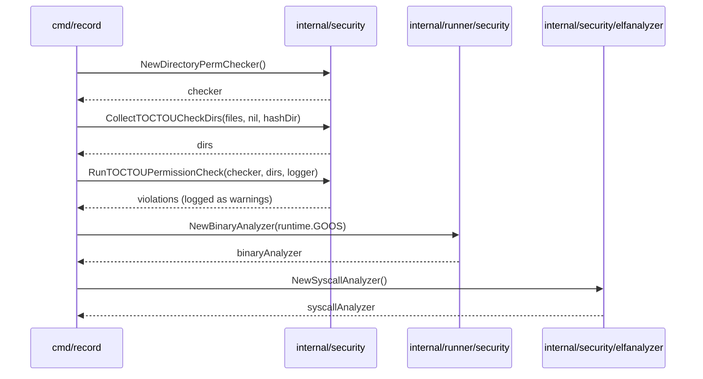
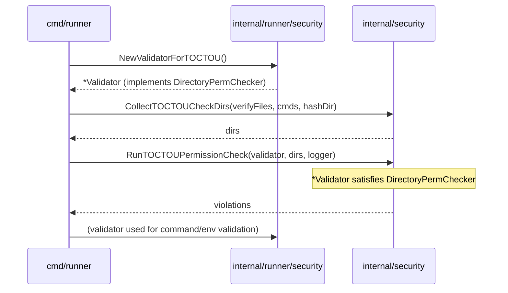

# アーキテクチャ設計書: セキュリティパッケージの再構成

## 1. 設計の全体像

### 1.1 設計原則

- **単一責務**: `internal/runner/security` を runner 固有機能に限定し、汎用機能を `internal/security` へ分離する
- **依存方向の統一**: 汎用パッケージ → runner 固有パッケージ の依存を禁止する
- **インタフェース境界**: `DirectoryPermChecker` インタフェースにより、`internal/runner/security.Validator` を `internal/security` から切り離す
- **最小変更**: セキュリティロジックは変更せず、パッケージ配置のみを変更する

### 1.2 概念モデル



**凡例（Legend）**



---

## 2. システム構成

### 2.1 全体アーキテクチャ（移行前後の比較）

#### 移行前



#### 移行後



### 2.2 コンポーネント配置



### 2.3 依存グラフ（移行後）



---

## 3. コンポーネント設計

### 3.1 `elfanalyzer` パッケージの分割

`elfanalyzer` パッケージは機能的に 2 つの層を持つ。

| 層 | 内容 | runner 依存 | 移動先 |
|---|---|---|---|
| コア層 | `SyscallAnalyzer`・ELF 命令デコーダ等 | なし | `internal/security/elfanalyzer/` |
| 拡張層 | `StandardELFAnalyzer`（特権アクセス付き） | `runnertypes.PrivilegeManager` あり | `internal/runner/security/elfanalyzer/` に残留 |

`cmd/record` と `internal/libccache` が使用するのは **コア層**（`NewSyscallAnalyzer()`）のみであり、
拡張層（`NewStandardELFAnalyzer()`）は `cmd/runner` でのみ使用される。
これにより `internal/security/elfanalyzer/` に `internal/runner/` 依存を持ち込まずに済む。



### 3.2 `internal/security` パッケージ

#### 3.2.1 `DirectoryPermChecker` インタフェース

```go
// DirectoryPermChecker validates directory permissions for TOCTOU safety.
// internal/runner/security.Validator implements this interface.
type DirectoryPermChecker interface {
    ValidateDirectoryPermissions(path string) error
}
```

TOCTOU チェック関数はこのインタフェースを受け取ることで、
`internal/runner/security.Validator` への直接依存を排除する。

#### 3.2.2 `NewDirectoryPermChecker()` ファクトリ

```go
// NewDirectoryPermChecker creates a standalone DirectoryPermChecker
// using the real OS file system and group membership checking.
// Used by cmd/record and cmd/verify without depending on internal/runner/security.
func NewDirectoryPermChecker() (DirectoryPermChecker, error)
```

OS 標準のファイルシステムと `groupmembership.New()` を使用する。
`internal/runner/security.Validator` が持つ `v.fs` への注入には対応しない
（production での standalone 使用が目的）。

#### 3.2.3 TOCTOU ユーティリティ関数

`internal/runner/security/toctou_check.go` から以下を移動する。

| 関数／型 | 変更内容 |
|---|---|
| `TOCTOUViolation` | そのまま移動 |
| `CollectTOCTOUCheckDirs()` | そのまま移動（依存なし） |
| `ResolveAbsPathForTOCTOU()` | そのまま移動（依存なし） |
| `RunTOCTOUPermissionCheck()` | 引数型を `*Validator` → `DirectoryPermChecker` に変更 |

#### 3.2.4 `NewBinaryAnalyzer()` ファクトリ

`NewBinaryAnalyzer()` は `StandardELFAnalyzer`（`runnertypes.PrivilegeManager` 依存）を
利用するため、当面 `internal/runner/security/binary_analyzer.go` に残留する。
`cmd/record` は `NewBinaryAnalyzer()` 利用のため `internal/runner/security` への依存を
限定的に維持する。

### 3.3 `internal/runner/security` の変更点

| 変更 | 詳細 |
|---|---|
| `NewValidatorForTOCTOU()` 残留 | `cmd/runner` が引き続き使用できるよう残す |
| `Validator.ValidateDirectoryPermissions()` | `internal/security.DirectoryPermChecker` を自動的に満たす（メソッドシグネチャ変更なし） |
| `binary_analyzer.go` 残留 | `NewBinaryAnalyzer()` は当面 runner 側に保持 |
| `binaryanalyzer/`・`machoanalyzer/` 削除 | `internal/security/` へ移動 |
| `elfanalyzer/` は層分割 | コア層を `internal/security/elfanalyzer/` へ移動し、`StandardELFAnalyzer` は残留 |
| `CollectTOCTOUCheckDirs()` 等の削除 | `internal/security` へ移動 |

`internal/runner/security` は `internal/security` をインポートし、
TOCTOU ユーティリティ等を `internal/security` から再エクスポート（ラッパー関数）しても良いが、
`cmd/runner` が直接 `internal/security` をインポートする方がより明確である。

---

## 4. エラーハンドリング設計

### 4.1 エラー変数の配置

ディレクトリ権限チェックで使用するエラー変数は `internal/security/errors.go` に配置する。

```go
var (
    ErrInvalidDirPermissions  = errors.New("invalid directory permissions")
    ErrInsecurePathComponent  = errors.New("insecure path component")
    ErrInvalidPath            = errors.New("invalid path")
    // ...
)
```

runner 固有のエラー変数（`ErrCommandNotAllowed`・`ErrUnsafeEnvironmentVar` 等）は
`internal/runner/security/errors.go` に残留する。

### 4.2 エラー変数の重複回避

`internal/runner/security` が既に持つエラー変数のうち、`internal/security` に移動する
ものについては、`internal/runner/security` 側でエイリアスを定義するか、
または `internal/security` のエラー変数を直接参照するよう変更する。

---

## 5. セキュリティ考慮事項

### 5.1 セキュリティロジック不変の原則

本リファクタリングはパッケージの配置を変更するのみで、
以下のセキュリティロジックは一切変更しない。

- ディレクトリ権限チェックアルゴリズム（world-writable・group-writable 判定）
- TOCTOU 防止のためのパス収集ロジック（全祖先ディレクトリの走査）
- バイナリ解析ロジック（ELF/Mach-O syscall 解析）

### 5.2 `NewDirectoryPermChecker()` のセキュリティ

`NewDirectoryPermChecker()` は `groupmembership.New()` を使用して
グループメンバーシップを確認する。これは `NewValidatorForTOCTOU()` と同等の
セキュリティ水準を保つ。

---

## 6. 処理フロー詳細

### 6.1 `cmd/record` の TOCTOU チェックフロー（移行後）



### 6.2 `cmd/runner` の TOCTOU チェックフロー（移行後）



---

## 7. テスト戦略

### 7.1 単体テスト

- `internal/security/DirectoryPermChecker` の実装: 既存の `file_validation_test.go` を移植
- `internal/security/CollectTOCTOUCheckDirs` 等: 既存の `toctou_check_test.go` を移植
- `internal/runner/security/NewBinaryAnalyzer`: 既存の `binary_analyzer_test.go` を維持

### 7.2 統合テスト

- `make test` での全テスト合格を確認
- `go list -deps ./cmd/record/` で `internal/runner/security/elfanalyzer` が含まれないことを確認
- `go list -deps ./cmd/verify/` で `internal/runner/security` が含まれないことを確認

### 7.3 後退テスト（回帰テスト）

既存の全テストをインポートパスの更新のみで再利用し、
ロジック変更がないことを確認する。

---

## 8. 実装の優先順位

### Phase 1: 新パッケージ基盤の構築（依存なし作業）

1. `internal/security/binaryanalyzer/` 作成（コピー＋インポートパス更新）
2. `internal/security/elfanalyzer/` 作成（コピー＋インポートパス更新）
3. `internal/security/machoanalyzer/` 作成（コピー＋インポートパス更新）
4. `internal/security/errors.go` 作成
5. `internal/security/dir_permissions.go` 作成（`DirectoryPermChecker` + standalone 実装）
6. `internal/security/toctou.go` 作成（TOCTOU ユーティリティ移動）
7. `internal/runner/security/binary_analyzer.go` は維持し、依存先のみ更新

### Phase 2: 利用側のインポートパス更新

8. `internal/filevalidator` のインポートパス更新
9. `internal/libccache` のインポートパス更新
10. `internal/runner/security` の更新（サブパッケージ削除・internal/security 参照）
11. `cmd/record` のインポートパス更新
12. `cmd/verify` のインポートパス更新
13. `cmd/runner` のインポートパス更新（TOCTOU 関数の参照先変更）

### Phase 3: 旧サブパッケージの削除

14. `internal/runner/security/binaryanalyzer/` 削除
15. `internal/runner/security/elfanalyzer/` のうちコア層を削除（`StandardELFAnalyzer` 関連は残留）
16. `internal/runner/security/machoanalyzer/` 削除
17. `internal/runner/security/binary_analyzer.go` は残留し、仕様上の位置づけを明確化

### Phase 4: 検証

18. `make test` 実行
19. `make lint` 実行
20. 依存グラフの確認

---

## 9. 将来の拡張性

本設計では `DirectoryPermChecker` インタフェースを導入することで、
将来的に以下の拡張が容易になる。

- `internal/runner/security.Validator` のファイルシステム注入（テスト用）を
  `cmd/record`・`cmd/verify` に適用したい場合、`NewDirectoryPermChecker` に
  `Option` パターンを追加する
- TOCTOU チェックのアルゴリズム強化は `internal/security/toctou.go` のみ変更すればよく、
  `cmd/record`・`cmd/verify`・`cmd/runner` すべてに自動適用される
