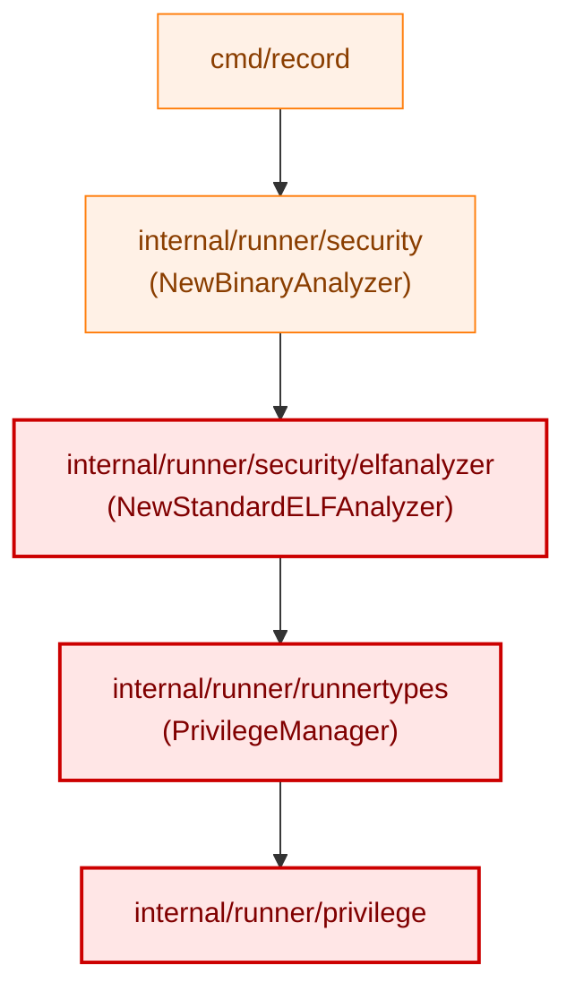
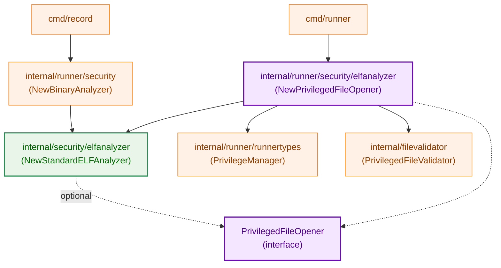
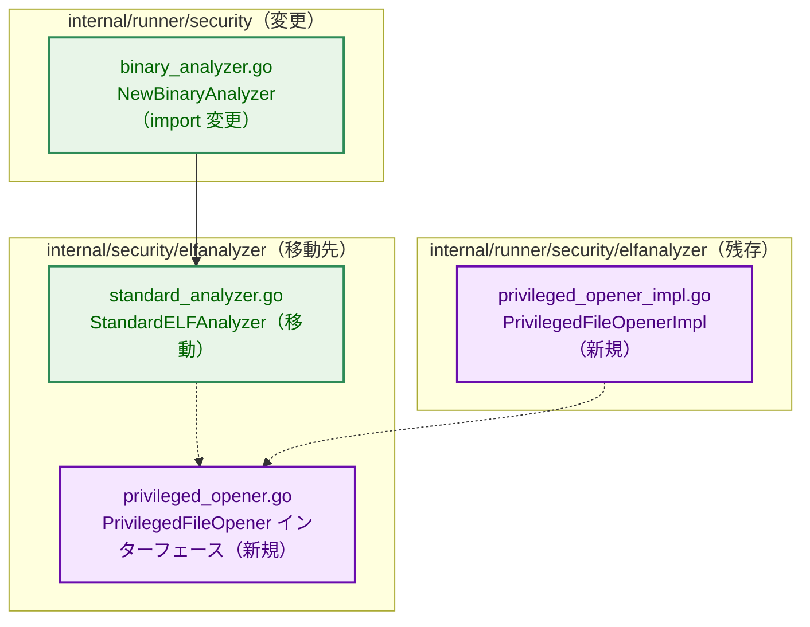
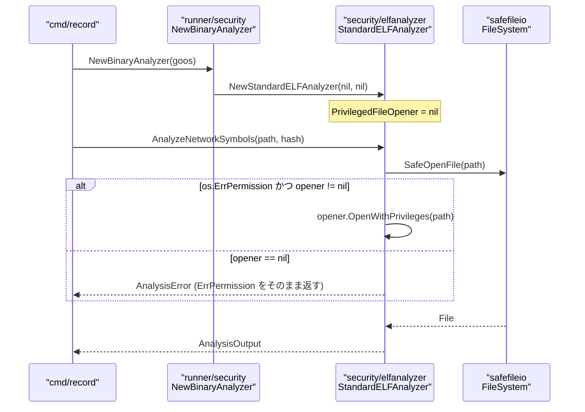
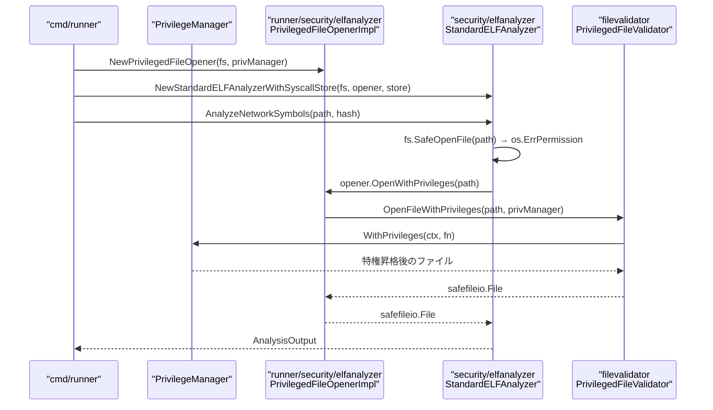

# アーキテクチャ設計書: StandardELFAnalyzer の internal/security/elfanalyzer への移動

## 1. システム概要

### 1.1 アーキテクチャ目標

- `cmd/record` の `internal/runner/security/elfanalyzer` への推移的依存を解消する
- `StandardELFAnalyzer` を runner 非依存なパッケージ (`internal/security/elfanalyzer`) に移動する
- `cmd/runner` における execute-only バイナリへの特権アクセス機能を維持する
- テスト・ベンチマークを含む全件のテストを通す

### 1.2 設計原則

- **インターフェースによる抽象化**: `runnertypes.PrivilegeManager` への直接依存を、薄いインターフェース `PrivilegedFileOpener` で置き換える
- **依存方向の制御**: runner 固有の実装は `internal/runner/security/elfanalyzer` に残し、コアロジックは runner に依存しない
- **最小変更**: `StandardELFAnalyzer` のロジック自体は変更せず、依存だけを切り替える

## 2. システム構成

### 2.1 移動前の依存関係

**凡例（Legend）**

`cmd/record` は `PrivilegeManager` を実際には使用しない（`nil` を渡す）が、
パッケージのインポートだけで runner 固有の依存ツリーが引き込まれる。

### 2.2 移動後の依存関係

**凡例（Legend）**

### 2.3 コンポーネント配置

### 2.4 データフロー: `cmd/record` の ELF 解析パス

### 2.5 データフロー: `cmd/runner` の execute-only バイナリ解析パス

## 3. コンポーネント設計

各コンポーネントの詳細なコードレベル仕様（インターフェース定義・コンストラクタシグネチャ・差分コード・テスト移行手順）は
[詳細仕様書](03_detailed_specification.md) を参照。

### 3.1 新規インターフェース: `PrivilegedFileOpener`

**配置**: `internal/security/elfanalyzer/privileged_opener.go`

`runnertypes.PrivilegeManager` への直接依存を断ち切る唯一の変更点。
`StandardELFAnalyzer` はこのインターフェースのみを知り、実装（runner 側）を知らない。
`nil` の場合は特権昇格を行わず `os.ErrPermission` をそのまま返す。

### 3.2 `StandardELFAnalyzer` の移動と変更

**移動元**: `internal/runner/security/elfanalyzer/standard_analyzer.go`
**移動先**: `internal/security/elfanalyzer/standard_analyzer.go`

`privManager runnertypes.PrivilegeManager` フィールドと `pfv *filevalidator.PrivilegedFileValidator` フィールドを
`opener PrivilegedFileOpener` 1フィールドに置き換える。ロジック自体は変更しない。

移動完了後、`internal/runner/security/elfanalyzer/standard_analyzer.go` と
`internal/runner/security/elfanalyzer/analyzer.go` は削除する。
コンパイル時チェック (`var _ binaryanalyzer.BinaryAnalyzer`) は移動先に持ち込む。

### 3.3 新規実装: `PrivilegedFileOpenerImpl`

**配置**: `internal/runner/security/elfanalyzer/privileged_opener_impl.go`

`filevalidator.PrivilegedFileValidator` と `runnertypes.PrivilegeManager` をラップし、
`PrivilegedFileOpener` インターフェースを実装する。runner 固有の依存をここに閉じ込める。

### 3.4 `internal/runner/security/elfanalyzer` パッケージの残存ファイル

移動完了後、このパッケージには以下のファイルのみが残る：

| ファイル | 役割 |
|---------|------|
| `doc.go` | パッケージコメント（runner 固有の ELF アナライザコンポーネント） |
| `privileged_opener_impl.go` | `PrivilegedFileOpenerImpl`（新規） |

### 3.5 `internal/runner/security/binary_analyzer.go` の変更

`internal/runner/security/elfanalyzer` のインポートを `internal/security/elfanalyzer` に変え、
`NewStandardELFAnalyzer(nil, nil)` の呼び出し先を切り替える。
これにより `cmd/record → runner/security → runner/security/elfanalyzer → runnertypes`
の推移的依存チェーンが切れる。

### 3.6 `internal/runner/security/syscall_store_adapter.go` の変更

このファイルはすでに `internal/security/elfanalyzer` を直接インポートしている。
コメント中の関数参照の更新のみで対応できる。

## 4. テスト移行設計

テストファイルの具体的な変更内容は [詳細仕様書](03_detailed_specification.md) を参照。

### 4.1 テストファイルの移動

| 移動元 | 移動先 |
|--------|--------|
| `runner/security/elfanalyzer/analyzer_test.go` | `security/elfanalyzer/` |
| `runner/security/elfanalyzer/analyzer_benchmark_test.go` | `security/elfanalyzer/` |
| `runner/security/elfanalyzer/standard_analyzer_fallback_test.go` | `security/elfanalyzer/` |

3ファイルすべて `package elfanalyzer`（内部パッケージテスト）として移動先でも同じ宣言を維持する。
`standard_analyzer_fallback_test.go` はプライベート関数 (`isLibcLibrary`, `categorizeELFSymbol`) に
直接アクセスするため内部テストのまま維持することが必須。

### 4.2 テストデータの統合

`internal/runner/security/elfanalyzer/testdata/` は
`internal/security/elfanalyzer/testdata/` と同一内容のため、移動後に削除して重複を解消する。

## 5. 受け入れ基準との対応

| AC | 設計上の保証 |
|----|------------|
| AC-1 | `binary_analyzer.go` が `runner/security/elfanalyzer` をインポートしなくなるため解消 |
| AC-2 | `cmd/verify` は `runner/security` を一切インポートしないため現状維持 |
| AC-3 | コンストラクタのシグネチャ変更は全呼び出し箇所で対応済み |
| AC-4 | テストファイルを移動・修正し、全件パスを確認 |
| AC-5 | `PrivilegedFileOpenerImpl` が `PrivilegeManager` をラップし特権アクセスを維持 |

## 6. リスクと対策

### 6.1 アーキテクチャリスク

| リスク | 影響度 | 対策 |
|-------|--------|------|
| テスト移動時のプライベート関数アクセス | 中 | `package elfanalyzer` の内部テストとして移動 |
| `SyscallAnalysisStore` 型エイリアスの扱い | 低 | 移動先パッケージで直接 `secelfanalyzer.SyscallAnalysisStore` を参照 |
| `runner/security/elfanalyzer` の空パッケージ化 | 低 | `doc.go` + `privileged_opener_impl.go` が残るため問題なし |

### 6.2 スコープ境界

- `filevalidator.PrivilegedFileValidator` 自体はそのまま残す（runner 依存を持つが、`PrivilegedFileOpenerImpl` 内に閉じ込めるため許容）
- `cmd/runner` の `runner/security/elfanalyzer` への依存は維持（`PrivilegedFileOpenerImpl` の生成が必要なため）
- `StandardELFAnalyzer` 以外の既存コンポーネントはスコープ外
