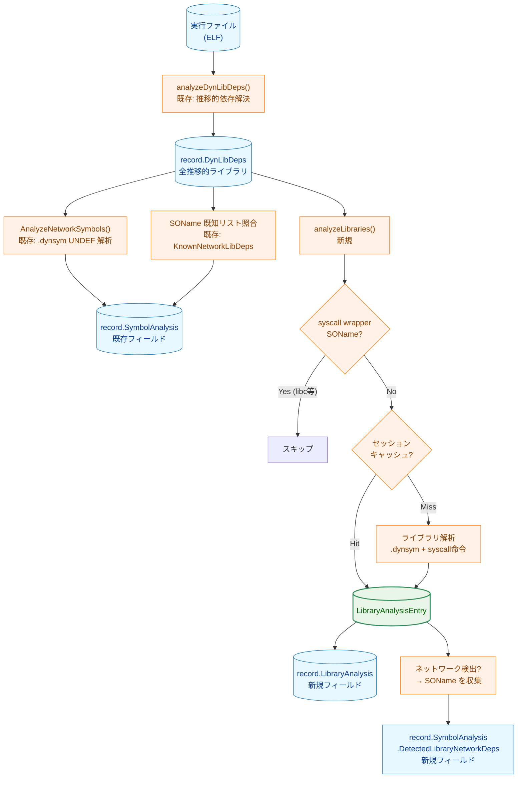
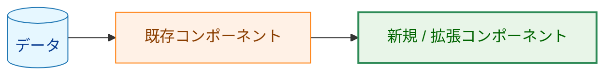
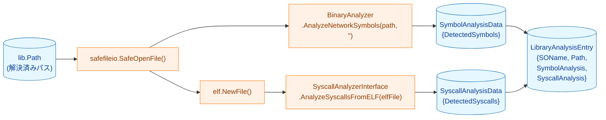
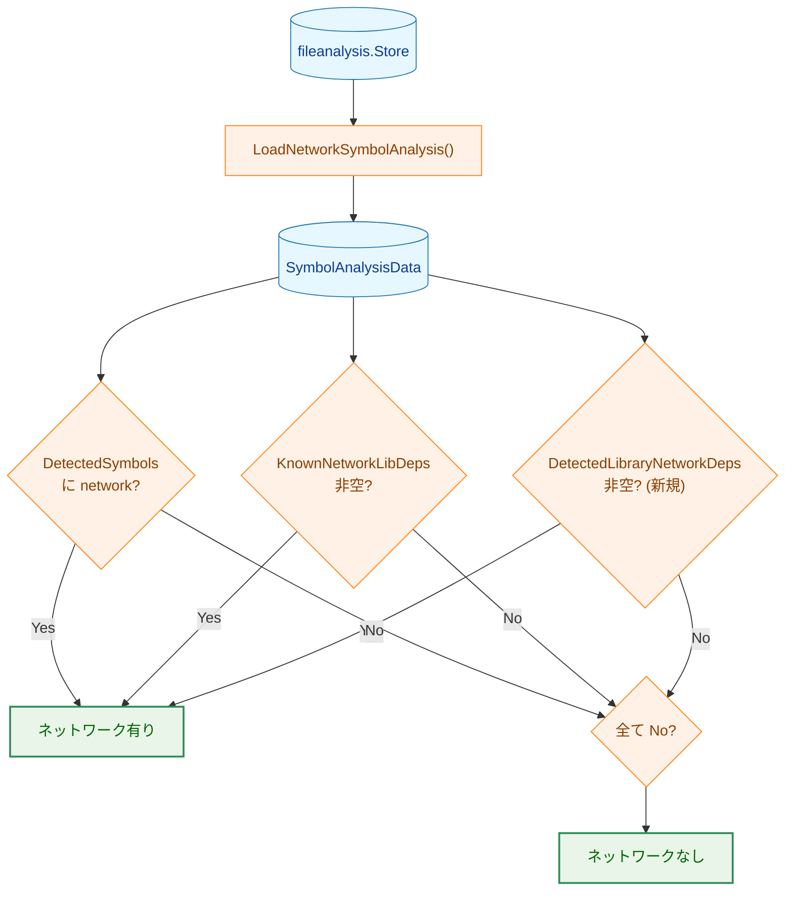
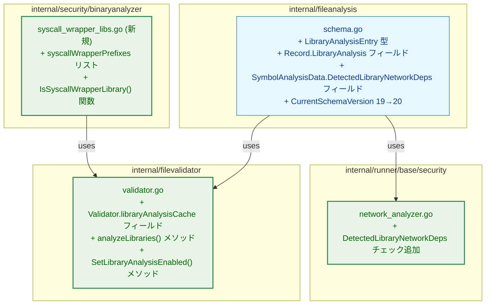

# 動的リンクライブラリの再帰的システムコール解析 アーキテクチャ設計書

## 1. 設計目標

- `record` 時に実行ファイルの DynLibDeps（推移的依存含む）をライブラリ単位で解析し、
  ネットワーク系システムコールを検出する
- 既存の解析エンジン（`SyscallAnalyzerInterface`・`binaryanalyzer.BinaryAnalyzer`）を再利用し、
  新規アルゴリズムを最小限に抑える
- セッション内キャッシュで重複解析を防ぎ、`record` コマンドの実行時間増加を抑制する
- runner 側の判定ロジック変更を最小限に抑える（既存の `SymbolAnalysisData` フィールドを拡張）

---

## 2. 全体フロー

### 2.1 record コマンドの解析フロー（変更後）



**凡例（Legend）**



### 2.2 ライブラリ単体の解析フロー



### 2.3 runner のリスク判定フロー（変更後）



---

## 3. コンポーネント変更一覧



---

## 4. データ構造の変更

### 4.1 新規型: `LibraryAnalysisEntry`（`internal/fileanalysis/schema.go`）

```go
type LibraryAnalysisEntry struct {
    SOName          string               `json:"soname"`
    Path            string               `json:"path"`
    SyscallAnalysis *SyscallAnalysisData `json:"syscall_analysis,omitempty"`
    SymbolAnalysis  *SymbolAnalysisData  `json:"symbol_analysis,omitempty"`
}
```

### 4.2 `Record` への追加（`internal/fileanalysis/schema.go`）

```go
// LibraryAnalysis contains per-library analysis results for application libraries
// (excluding syscall wrappers) found in DynLibDeps.
LibraryAnalysis []LibraryAnalysisEntry `json:"library_analysis,omitempty"`
```

### 4.3 `SymbolAnalysisData` への追加（`internal/fileanalysis/schema.go`）

```go
// DetectedLibraryNetworkDeps lists SOName values of application libraries
// in which network syscalls or symbols were detected via library-level analysis.
DetectedLibraryNetworkDeps []string `json:"detected_library_network_deps,omitempty"`
```

### 4.4 スキーマバージョン: 19 → 20

---

## 5. 新規コンポーネント: `syscall_wrapper_libs.go`

### 5.1 配置パッケージ

`internal/security/binaryanalyzer/syscall_wrapper_libs.go`（新規）

既存の `known_network_libs.go` と同パッケージに置く。

`matchesKnownPrefix()` ヘルパーは既存の `known_network_libs.go` にある。
`IsSyscallWrapperLibrary` はこの関数を再利用してプレフィックス照合を行う。

### 5.2 公開 API

```go
func IsSyscallWrapperLibrary(soname string) bool
```

---

## 6. `Validator` への追加

### 6.1 セッション内キャッシュ

`Validator` に以下のフィールドを追加する。

```go
libraryAnalysisCache    map[string]*fileanalysis.LibraryAnalysisEntry  // keyed by resolved path
libraryAnalysisEnabled  bool
```

### 6.2 `analyzeLibraries()` メソッド

`updateAnalysisRecord` 内で `analyzeELFSyscalls` の直前に呼び出す。

```
Input:  record *fileanalysis.Record（DynLibDeps 設定済み）
Output: record.LibraryAnalysis および record.SymbolAnalysis.DetectedLibraryNetworkDeps を設定
```

処理フロー:
1. `libraryAnalysisEnabled` が false → 早期リターン
2. `record.DynLibDeps` をイテレート
3. VDSO (`knownVDSOs`) は除外
4. `IsSyscallWrapperLibrary(lib.SOName)` が true → 除外
5. `libraryAnalysisCache[lib.Path]` にヒット → キャッシュから取得
6. キャッシュミス → `analyzeOneLibrary(lib)` を呼ぶ → キャッシュに格納
7. 結果を `record.LibraryAnalysis` に追加
8. ネットワーク系 syscall またはシンボルが検出された場合は SOName を `DetectedLibraryNetworkDeps` に追加

### 6.3 `analyzeOneLibrary()` メソッド

```
Input:  lib fileanalysis.LibEntry
Output: *fileanalysis.LibraryAnalysisEntry, error
```

処理フロー:
1. `v.binaryAnalyzer.AnalyzeNetworkSymbols(lib.Path, "")` で `.dynsym` 解析（空のハッシュを渡して syscall store lookup を無効化）
2. ELF ファイルを `openELFFile` で開く（存在しない・ELF でない場合は SymbolAnalysis のみ）
3. ELF ファイルが開けた場合: `v.syscallAnalyzer.AnalyzeSyscallsFromELF(elfFile)` で機械語解析
4. 結果を `LibraryAnalysisEntry` に詰めて返す

エラー処理: ファイルオープン失敗・機械語解析エラーは `AnalysisWarnings` に追記して継続。

### 6.4 `SetLibraryAnalysisEnabled()` メソッド

```go
func (v *Validator) SetLibraryAnalysisEnabled(enabled bool)
```

`cmd/record/main.go` で依存注入時に呼び出す。デフォルトは `false`（既存の動作を維持）。

---

## 7. runner 側の変更

`internal/runner/base/security/network_analyzer.go` の
`isNetworkViaBinaryAnalysis` の `SymbolAnalysisData` 判定部分に
`DetectedLibraryNetworkDeps` のチェックを追加する。

既存の `KnownNetworkLibDeps` チェックと同じ位置・同じ判定基準で追加する。

---

## 8. 有効化フロー（cmd/record/main.go）

```
既存: v.SetELFDynLibAnalyzer(...)
既存: v.SetBinaryAnalyzer(...)
既存: v.SetSyscallAnalyzer(...)
新規: v.SetLibraryAnalysisEnabled(true)  // 新しい SetLibraryAnalysisEnabled を呼ぶ
```
