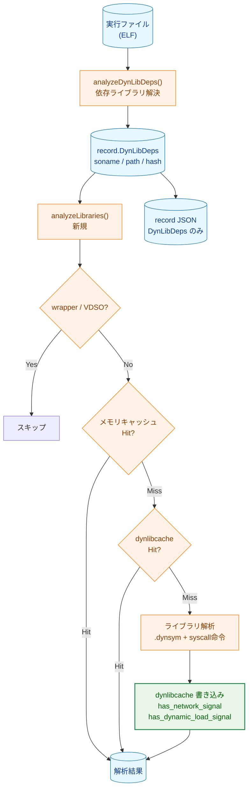
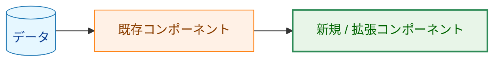
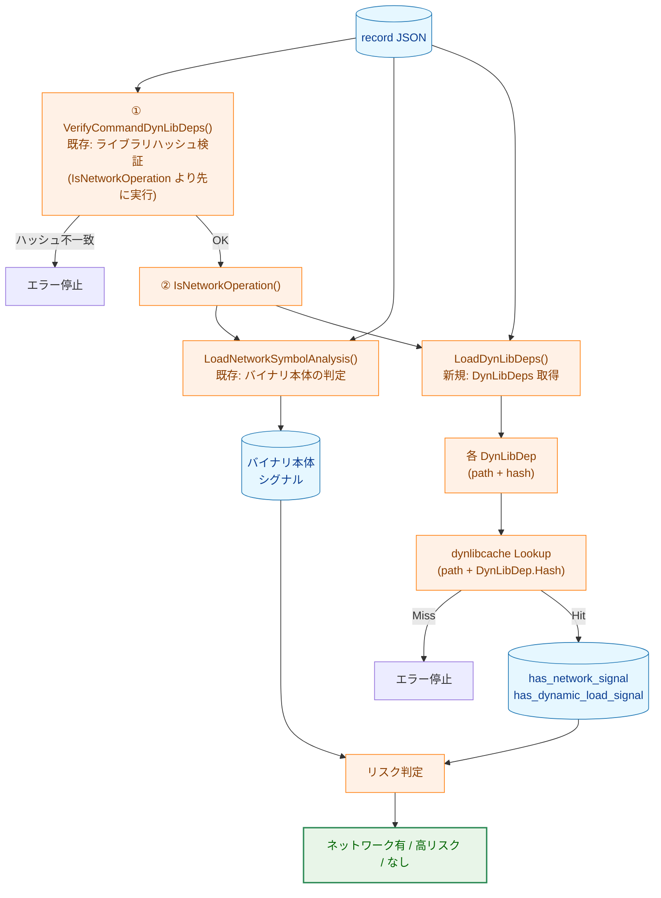
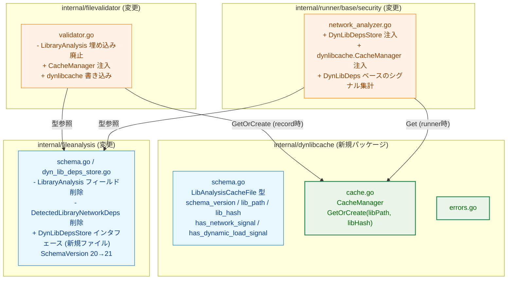

# ライブラリ解析結果の共通キャッシュ化 アーキテクチャ設計書

## 1. 設計目標

- ライブラリ解析結果を実行ファイルレコードから分離し、**ライブラリ単位の共通キャッシュファイル**（Library Analysis Cache）へ集約する
- `runner` が実行時に Library Analysis Cache を直接参照してリスク判定（ネットワーク・動的ロード）を行う
- Library Analysis Cache を `libc-cache` とは独立したスキーマ・パッケージで実装する
- `DynLibDeps` に記録済みのハッシュをキャッシュ参照キーとして活用し、ライブラリファイルの二重読み取りを避ける

---

## 2. 全体フロー

### 2.1 record フロー

**凡例（Legend）**

### 2.2 runner フロー

---

## 3. コンポーネント変更一覧

---

## 4. Library Analysis Cache パッケージ（`internal/dynlibcache`）

### 4.1 役割と責務

各共有ライブラリの解析結果（syscall シグナル・動的ロードシグナル）を永続化・取得する。
`record` が書き込み、`runner` が読み込む。

`libc-cache`（`internal/libccache`）との違い:

| | libc-cache | Library Analysis Cache（本タスク） |
|---|---|---|
| 用途 | syscall 番号 → ネットワーク判定テーブル | 共有ライブラリのシグナル解析結果 |
| 読者 | `record` コマンド | `runner` コマンド（`record` が書く） |
| キー | OS/arch | `lib_path` + `lib_hash` |
| パッケージ | `internal/libccache` | `internal/dynlibcache` |

### 4.2 キャッシュキーと保存先

- キャッシュキー: `lib_path` + `lib_hash`（+ `schema_version`）
- ファイル名: `pathencoding.SubstitutionHashEscape.Encode(lib_path)` （libccache と同じ方式）
- ファイル内部でも `lib_hash` と `schema_version` を保持し、読み込み時に再検証する
- ハッシュ不一致またはスキーマバージョン不一致の場合は Cache Miss とし、`record` 時には再解析・上書きする
- 保存ディレクトリは libc-cache・レコード JSON のいずれとも独立した専用ディレクトリとする

### 4.3 CacheManager の動作

**GetOrCreate(libPath, libHash)** の処理フロー:

1. キャッシュファイルを読み込む
2. ファイルが存在しない → Cache Miss（再解析）
3. `schema_version` 不一致 → Cache Miss（再解析）
4. `lib_hash` 不一致 → Cache Miss（再解析）
5. すべて一致 → Cache Hit（既存結果を返す）
6. Cache Miss の場合: ライブラリを解析し、キャッシュファイルを書き込んで結果を返す

---

## 5. record 側の変更

### 5.1 ライブラリ解析とキャッシュ書き込み

0123 で実装した `analyzeLibraries()` メソッドを以下の点で変更する:

- `LibraryAnalysisEntry` を `record.LibraryAnalysis` に埋め込む代わりに、
  `CacheManager.GetOrCreate(lib.Path, lib.Hash)` を呼び出してキャッシュに書き込む
- `DetectedLibraryNetworkDeps` のサマリ集計を廃止する
- セッション内メモリキャッシュ（同一 `record` 実行中の重複解析防止）は維持する

### 5.2 Record スキーマの変更

以下のフィールドを `fileanalysis.Record` / `SymbolAnalysisData` から削除する:

- `Record.LibraryAnalysis []LibraryAnalysisEntry`
- `SymbolAnalysisData.DetectedLibraryNetworkDeps []string`

`CurrentSchemaVersion` を 20 → 21 に更新する。

---

## 6. runner 側の変更

### 6.1 DynLibDeps の取得

`NetworkAnalyzer` に `DynLibDepsStore` インタフェース（新規）を注入する。
`LoadNetworkSymbolAnalysis` と同様に `filePath + contentHash` でレコードを参照し、
`DynLibDeps []LibEntry` を返す。

### 6.2 ライブラリシグナルの集計

`IsNetworkOperation` 内の処理を以下の順序で拡張する:

1. 既存: バイナリ本体の `SymbolAnalysisData` を参照してネットワーク判定
2. 新規: `DynLibDeps` を取得し、各ライブラリについて `CacheManager` からシグナルを参照
3. 新規: いずれかのライブラリで `has_network_signal = true` → NetworkDetected
4. 新規: いずれかのライブラリで `has_dynamic_load_signal = true` → 高リスク判定に反映

`DynLibDeps[i].Hash` には `VerifyCommandDynLibDeps` によって検証済みのハッシュが入っているため、
`CacheManager` 参照時にライブラリファイルを再度開く必要はない。

### 6.3 キャッシュミス時の挙動

`runner` 実行時にライブラリの Library Analysis Cache が存在しない場合はエラーとして処理を停止する
（`record` 再実行が必要）。

`VerifyCommandDynLibDeps`（フロー①）が成功した時点でライブラリのハッシュ整合性は確認済みである。
`IsNetworkOperation`（フロー②）でキャッシュミスが発生した場合は「ライブラリは改ざんされていないが
解析キャッシュが存在しない」状態を意味し、`record` 未実行または `record` 時のキャッシュ保存失敗が原因である。

---

## 7. エラー処理方針

| 発生フェーズ | 状況 | 対応 |
|---|---|---|
| record 時 | キャッシュファイル読み込み失敗（破損等） | 警告を `AnalysisWarnings` に記録し、再解析して継続 |
| record 時 | キャッシュファイル書き込み失敗 | 警告を `AnalysisWarnings` に記録し、継続（ただし runner 実行時はキャッシュミスエラーになる） |
| runner 時 | ライブラリのキャッシュファイルが存在しない | エラー停止（`record` 再実行が必要） |
| runner 時 | ライブラリのハッシュ不一致 | `VerifyCommandDynLibDeps` が先に検出してエラー停止 |
| runner 時 | スキーマバージョン不一致 | エラー停止（`record` 再実行が必要） |
