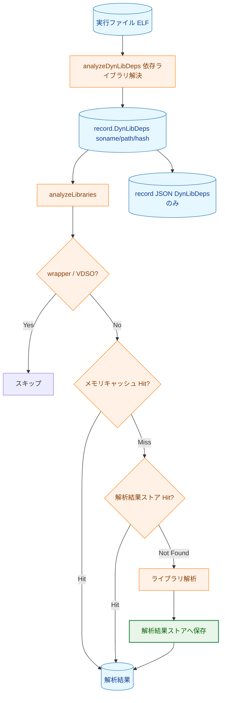
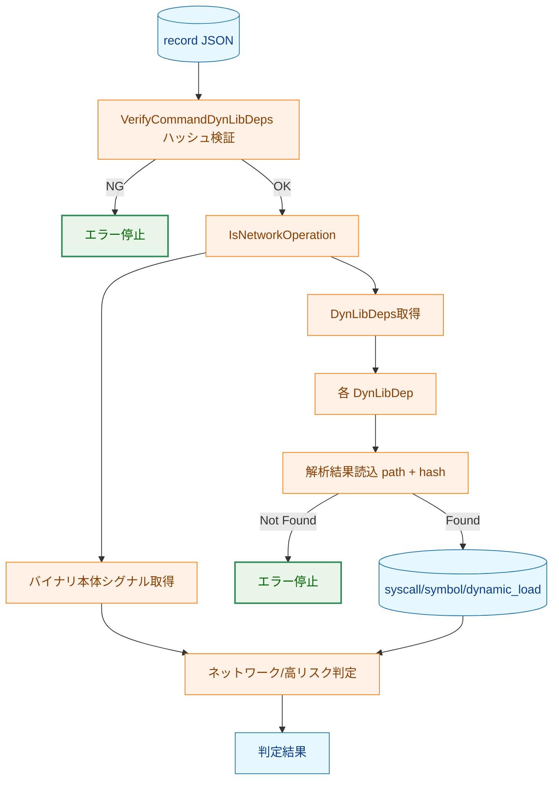
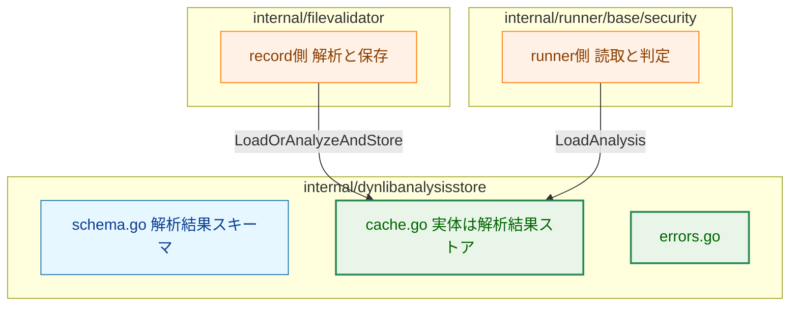

# 動的ライブラリ解析結果ストア導入 アーキテクチャ設計書

## 1. 設計目標

- ライブラリ解析結果を実行ファイルレコードから分離し、ライブラリ単位の動的ライブラリ解析結果ストアへ集約する
- runner は実行時に動的ライブラリ解析結果を読み取り、syscall_analysis / symbol_analysis / dynamic_load_symbols からリスク判定を導出する
- 解析結果ストアは libc-cache と独立したスキーマ・保存先・用途で実装する
- DynLibDeps に記録済みのハッシュを解析結果取得キーに利用し、ライブラリファイルの二重読み取りを避ける

---

## 2. 用語規則

- record 文脈での再利用戦略に限ってキャッシュという語を使う
- runner 文脈では常に動的ライブラリ解析結果という語を使う
- 実装パッケージ名は internal/dynlibanalysisstore を最終形とする

---

## 3. 全体フロー

### 3.1 record フロー

### 3.2 runner フロー

---

## 4. コンポーネント設計

---

## 5. record 側設計

### 5.1 責務

- 解析対象ライブラリを抽出する
- 解析結果ストアに結果があれば再利用する
- 解析結果がなければ解析して保存する
- レコードには DynLibDeps のみを書き込む

### 5.2 再解析回避キャッシュ

record のみ、同一実行中のメモリキャッシュを利用する。

- 目的: 重複ライブラリ再解析の回避
- キー: libPath + # + libHash
- runner ではこのキャッシュ戦略を持ち込まない

---

## 6. runner 側設計

### 6.1 責務

- DynLibDeps と整合する動的ライブラリ解析結果を読み込む
- 読み込んだ解析結果から判定値を導出する
- 解析結果が取得できない場合は fail-closed で停止する

### 6.2 判定入力

runner が使う入力は以下の 3 つのみとする。

- syscall_analysis
- symbol_analysis
- dynamic_load_symbols

### 6.3 解析結果未取得時の挙動

runner 実行時に必要な解析結果が取得できない場合は、record 未実行、保存失敗、
破損などを示すためエラー停止する。

---

## 7. エラー処理方針

| 発生フェーズ | 状況 | 対応 |
|---|---|---|
| record 時 | Analyze がファイル不在を検出 | error を返し、当該実行ファイルのレコードは不出力。セッションは次ファイルへ継続 |
| record 時 | Analyze が 1 GB 超過を検出 | error を返し、当該実行ファイルのレコードは不出力。セッションは次ファイルへ継続 |
| record 時 | 解析結果読込失敗（破損等） | 警告を記録し再解析して継続 |
| record 時 | 解析結果保存失敗 | 警告を記録し継続（runner 時は解析結果未取得エラーになり得る） |
| runner 時 | 解析結果未取得 | エラー停止 |
| runner 時 | DynLibDeps ハッシュ不一致 | VerifyCommandDynLibDeps で先にエラー停止 |
| runner 時 | スキーマ不一致 | エラー停止（record 再実行が必要） |

### 7.1 ファイル不在とサイズ超過の統一処理

ファイル不在（FR-3.6.2）とサイズ超過（FR-3.6.1）は、ともに Analyze が error を返し、
analyzeLibraries が上位へ伝播する。

- 当該実行ファイルのレコードは書き込まれない
- record セッションは次の実行ファイル処理を継続する
