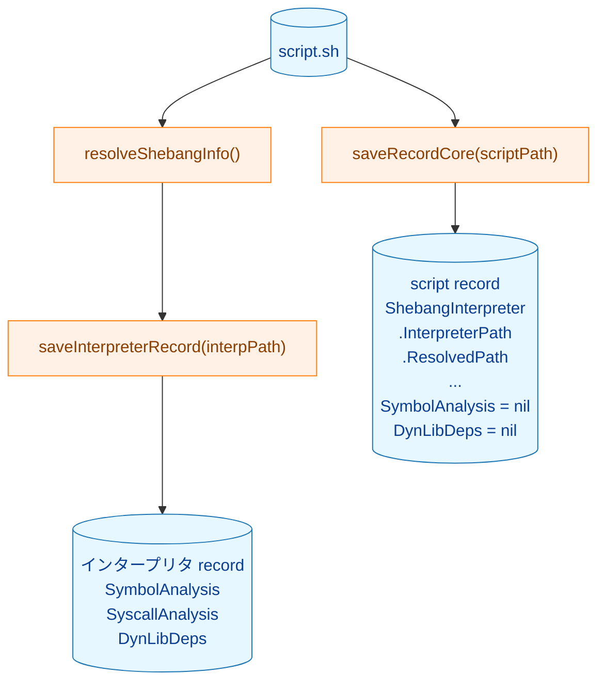
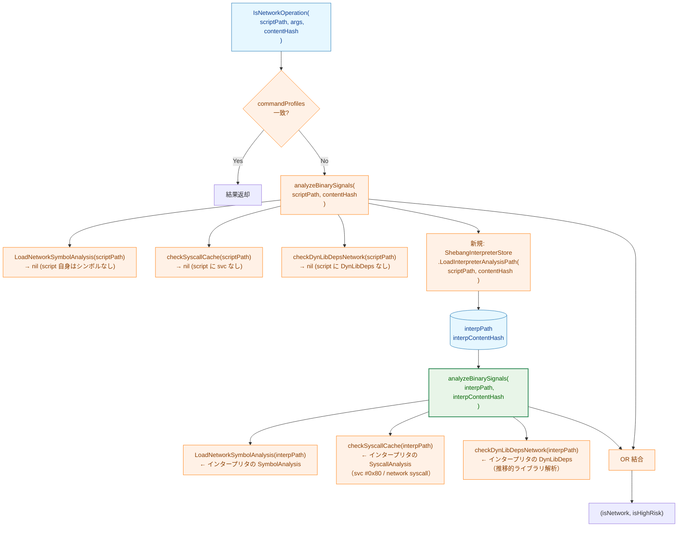
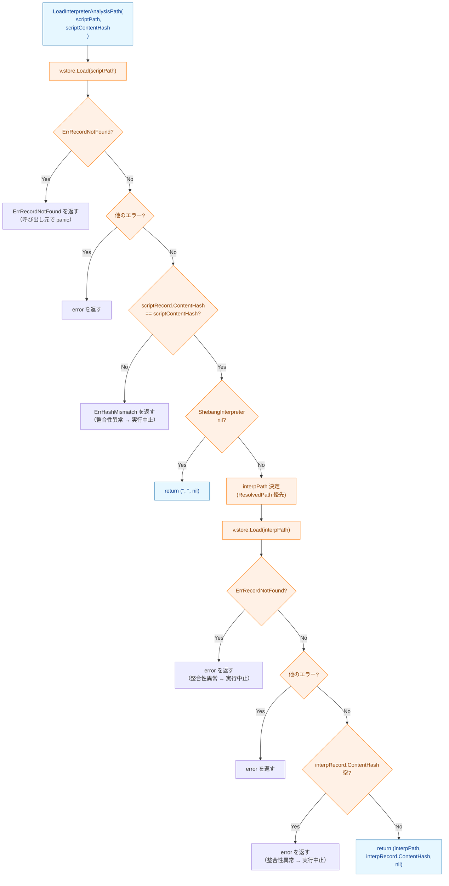

# shebang スクリプトのネットワークリスク解析 アーキテクチャ設計書

## 1. 設計目標

- runner がスクリプトを処理する際、インタープリタの JSON レコードも読み込み、そこに記録されたリスクシグナル（`SymbolAnalysis`・`SyscallAnalysis`・`DynLibDeps`）を活用する
- `record` 側のコードを変更せず、インタープリタバイナリの既存レコードを再利用する
- インタープリタの `SyscallAnalysis`（svc #0x80・ネットワーク syscall）・共有ライブラリの推移的解析を自動的に活用する
- `analyzeBinarySignals` の再帰呼び出しにより既存の解析ロジックを最大限再利用する

---

## 2. 現状と課題

### 2.1. record コマンドの動作（変更なし）

`SaveRecord(scriptPath)` は shebang スクリプトを処理するとき、インタープリタバイナリの record も自動保存する。



インタープリタの record には完全な解析結果が保存されているが、script の record の `SymbolAnalysis` と `DynLibDeps` は `nil` のため runner のリスク判定が機能しない（課題）。

---

## 3. 変更後の runner リスク判定フロー

### 3.1. 全体フロー



**凡例（Legend）**


---

## 4. `ShebangInterpreterStore` インターフェース

### 4.1. インターフェース定義

`fileanalysis` パッケージに新規追加:

```go
// ShebangInterpreterStore provides the interpreter binary path and content hash
// for a shebang script, enabling the runner to follow the shebang chain.
type ShebangInterpreterStore interface {
    // LoadInterpreterAnalysisPath returns the effective interpreter binary path
    // and its content hash for the shebang script at scriptPath.
    // scriptContentHash is used to validate freshness of the script's record.
    // Returns ("", "", nil) if the script has no ShebangInterpreter or the
    // interpreter's record is not found.
    LoadInterpreterAnalysisPath(scriptPath, scriptContentHash string) (interpPath, interpContentHash string, err error)
}
```

### 4.2. 処理フロー



---

## 5. インタープリタパス決定ロジック

| shebang 形式 | 使用するパス | 根拠 |
|-------------|-------------|------|
| `#!/bin/bash` (direct 形式) | `ShebangInterpreter.InterpreterPath` | シンボルリンク解決済みのインタープリタバイナリパス |
| `#!/usr/bin/env python3` (env 形式) | `ShebangInterpreter.ResolvedPath` | `env` ではなく実際に実行される `python3` のパス |

---

## 6. `analyzeBinarySignals` の拡張

### 6.1. 拡張箇所

既存の解析（`SymbolAnalysis`・`SyscallAnalysis`・`DynLibDeps`）の実行後、`shebangStore` が設定されている場合に shebang チェーン追跡を追加する。

```
analyzeBinarySignals(cmdPath, contentHash):
  [既存] SymbolAnalysis キャッシュ参照
  [既存] SyscallAnalysis キャッシュ参照（svc #0x80）
  [既存] DynLibDeps 推移的解析
  [新規] if shebangStore != nil && contentHash != "":
           interpPath, interpHash = shebangStore.LoadInterpreterAnalysisPath(cmdPath, contentHash)
           if interpPath != "" && interpHash != "":
               interpNet, interpHigh = analyzeBinarySignals(interpPath, interpHash)
               isNetwork |= interpNet
               hasDynLoad |= interpHigh
```

### 6.2. 再帰呼び出しが安全な理由

- インタープリタは常にネイティブバイナリ（ELF/Mach-O）であり、`record` でのシェバン再帰チェック（`ErrRecursiveShebang`）により保証される
- インタープリタのレコードには `ShebangInterpreter = nil`（バイナリのため）が格納されるため、再帰呼び出し先では shebang チェーン追跡がスキップされる（最大 1 段の再帰）

---

## 7. `NetworkAnalyzer` への注入

```go
// NetworkAnalyzer にフィールドを追加
type NetworkAnalyzer struct {
    goos             string
    store            fileanalysis.NetworkSymbolStore
    syscallStore     fileanalysis.SyscallAnalysisStore
    depsStore        fileanalysis.DynLibDepsStore
    libAnalysisStore dynamicanalysis.Store
    shebangStore     fileanalysis.ShebangInterpreterStore  // 新規（nil で無効化）
}
```

`NewNetworkAnalyzer` の引数に `shebangStore fileanalysis.ShebangInterpreterStore` を追加し、DI で注入する。

---

## 8. record 側を変更しない理由

- インタープリタバイナリの `record` 実行時に `SymbolAnalysis`・`SyscallAnalysis`・`DynLibDeps` はすでに保存される
- runner 側でインタープリタの JSON を読み込むことで、あらゆるリスクシグナルを自動的に取得できる
- record 側にデータを複製すると整合性の問題（インタープリタが更新された場合のキャッシュ陳腐化）が発生する可能性があるが、本設計では常に最新のインタープリタ記録を参照する
