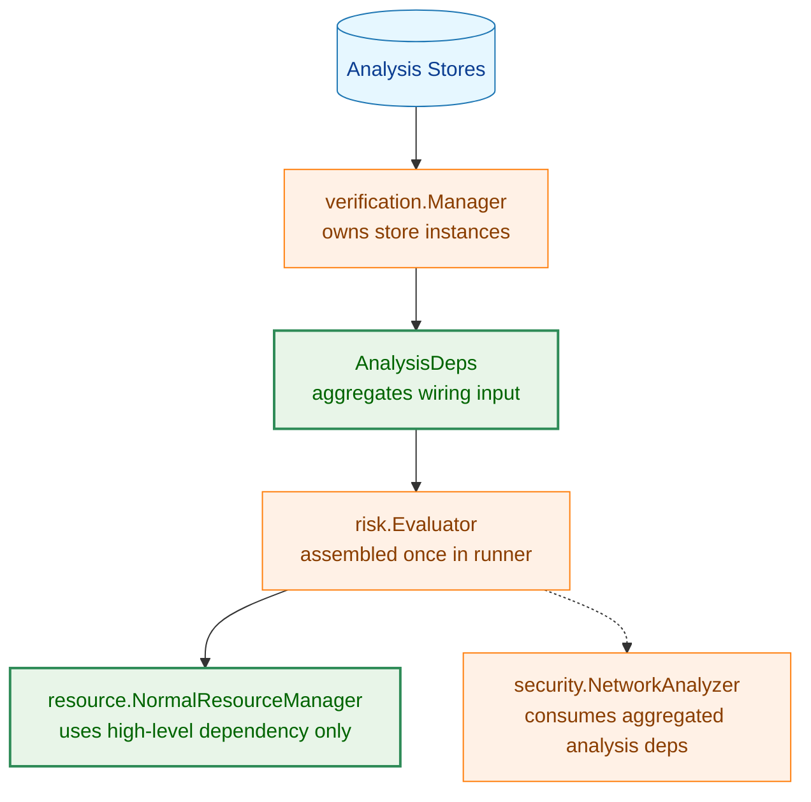
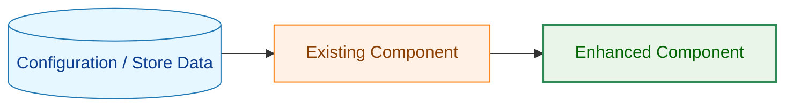
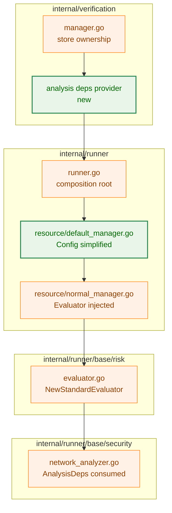
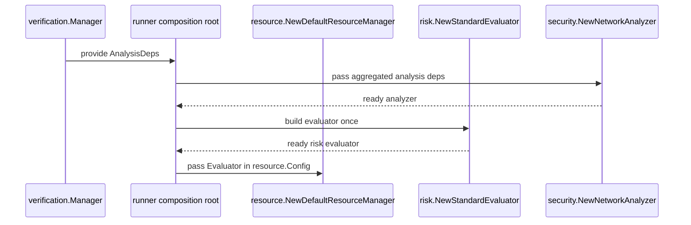
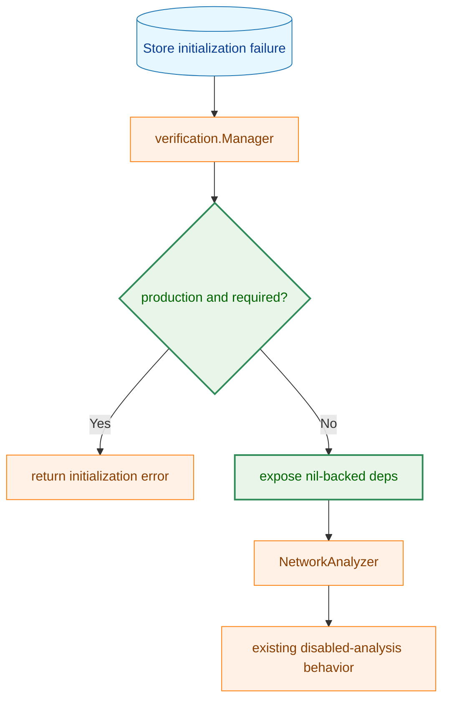
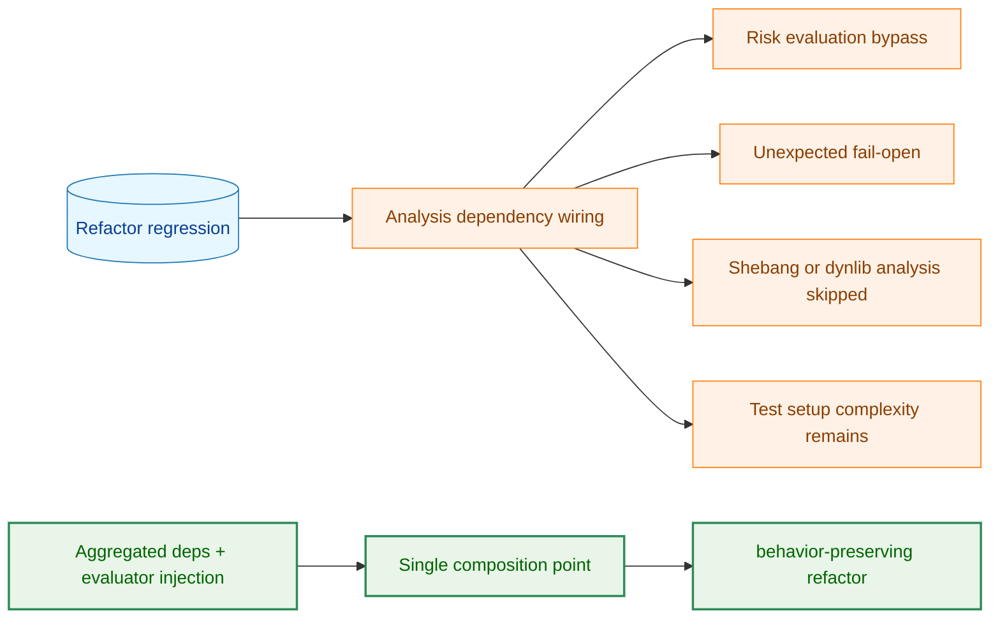
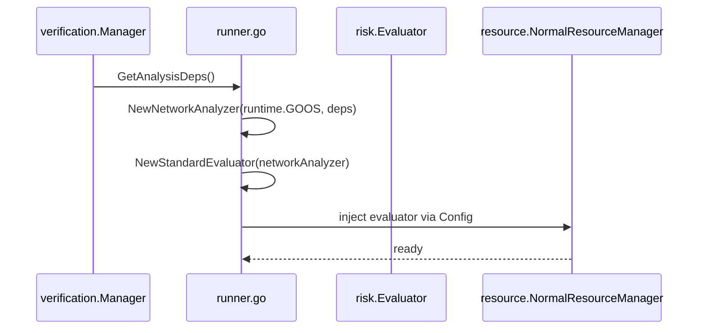
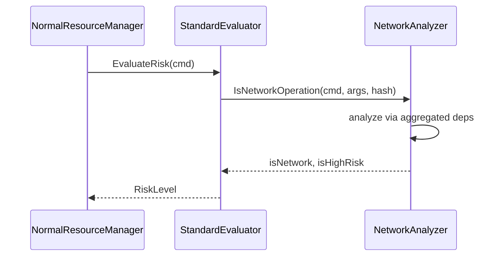

# アーキテクチャ設計書: NetworkAnalyzer 周辺の依存配線簡素化

## 1. 設計の全体像

### 1.1 設計目標

- `NetworkAnalyzer` 周辺の長い依存受け渡し経路を短縮する
- `resource` レイヤーから分析ストアの詳細を除去する
- 分析ストアの生成責務を `verification` に留める
- 既存のネットワーク判定ロジックとフェイルクローズ挙動を維持する
- 将来の分析依存追加時の変更範囲を局所化する

### 1.2 設計原則

- **Composition Root 集約**: 依存組み立ては `runner` / `verification` 境界で完結させる
- **責務分離**: `resource` は実行制御、`risk` は判定、`security` は解析、`verification` は生成を担当する
- **最小公開面**: 公開コンストラクタは詳細ストア列挙を避け、集約依存または高位抽象のみを受け取る
- **段階的移行**: まず依存 bundle を導入し、その後 `risk.Evaluator` 注入へ収束させる
- **挙動不変**: ネットワーク検出アルゴリズムや nil による無効化意味は保持する

### 1.3 コンセプトモデル



**凡例（Legend）**



## 2. システム構成

### 2.1 現状と目標の比較

```mermaid
flowchart TB
    classDef data fill:#e6f7ff,stroke:#1f77b4,stroke-width:1px,color:#0b3d91;
    classDef process fill:#fff1e6,stroke:#ff7f0e,stroke-width:1px,color:#8a3e00;
    classDef enhanced fill:#e8f5e8,stroke:#2e8b57,stroke-width:2px,color:#006400;
    classDef risk fill:#fff5e6,stroke:#cc7a00,stroke-width:2px,color:#7a4900;

    subgraph Current[現状]
        C1["verification.Manager\nGetXxxStore x5"] --> C2["runner.createNormalResourceManager\ncollect stores individually"]
        C2 --> C3["resource.Config\n5 store fields"]
        C3 --> C4["newNormalManager"]
        C4 --> C5["risk.NewStandardEvaluator\n5 store args"]
        C5 --> C6["security.NewNetworkAnalyzer\n5 store args"]
    end

    subgraph Target[目標]
        T1["verification.Manager\nGetAnalysisDeps"] --> T2["runner composition root\nassemble once"]
        T2 --> T3["resource.Config\nEvaluator only"]
        T3 --> T4["newNormalManager"]
        T4 --> T5["risk.Evaluator"]
        T5 --> T6["security.NewNetworkAnalyzer\naggregated deps"]
    end

    class C1,C2,C4,C5,C6,T1,T2,T4,T5,T6 process;
    class C3,T3 enhanced;
    class Current,Target risk;
```



### 2.2 コンポーネント配置



### 2.3 データフロー



## 3. コンポーネント設計

### 3.1 依存集約の基本形

分析用ストア群を 1 つの型に集約する。

```go
// analysis dependencies for network-oriented risk evaluation
// nil fields preserve current "feature disabled" behavior.
type AnalysisDeps struct {
    NetworkSymbolStore fileanalysis.NetworkSymbolStore
    SyscallStore       fileanalysis.SyscallAnalysisStore
    DynLibDepsStore    fileanalysis.DynLibDepsStore
    LibAnalysisStore   dynamicanalysis.Store
    ShebangStore       fileanalysis.ShebangInterpreterStore
}
```

この型の配置候補は以下の 2 つである。

- `internal/runner/base/security`: `NetworkAnalyzer` に最も近い依存定義として配置する
- `internal/runner/base/risk`: evaluator 構築専用の束として配置する

推奨は `security` 配置である。理由は、依存の実利用者が `NetworkAnalyzer` であり、
束の意味を最も自然に説明できるためである。

### 3.2 NetworkAnalyzer のコンストラクタ設計

`NewNetworkAnalyzer` は個別ストア列挙をやめ、集約依存を受け取る。

```go
func NewNetworkAnalyzer(goos string, deps AnalysisDeps) *NetworkAnalyzer
```

内部保持も同じ集約単位へ寄せる。

```go
type NetworkAnalyzer struct {
    goos string
    deps AnalysisDeps
}
```

この変更により、依存追加時の修正箇所は以下に限定される。

- `AnalysisDeps` 定義
- 依存を組み立てる composition root
- `NetworkAnalyzer` 内部の参照箇所

### 3.3 StandardEvaluator のコンストラクタ設計

`StandardEvaluator` は分析ストア群を知らず、`AnalysisDeps` または完成済み `NetworkAnalyzer` を受け取る。

候補は 2 つある。

1. `NewStandardEvaluator(deps security.AnalysisDeps) Evaluator`
2. `NewStandardEvaluator(networkAnalyzer *security.NetworkAnalyzer) Evaluator`

推奨は 1 ではなく 2 である。
理由は、`risk` が保持すべきものは判定器であり、分析ストア構成そのものではないためである。
最終形としては `risk` が `NetworkAnalyzer` の完成品だけを受け取り、
依存組み立てはその手前で終える。

### 3.4 resource.Config の簡素化

`resource.Config` から分析ストア群の個別フィールドを削除し、
`risk.Evaluator` を直接保持する。

```go
type Config struct {
    Executor         executor.CommandExecutor
    FileSystem       executor.FileSystem
    PrivilegeManager runnertypes.PrivilegeManager
    PathResolver     PathResolver
    Logger           *slog.Logger
    Mode             ExecutionMode
    DryRunOpts       *DryRunOptions
    OutputManager    output.CaptureManager
    MaxOutputSize    int64
    RiskEvaluator    risk.Evaluator
}
```

`newNormalManager` は以下のどちらかを行う。

- `cfg.RiskEvaluator` をそのまま使用する
- 未指定時のみ既定 evaluator を補完する

推奨は前者である。`resource` は evaluator を利用するだけに留め、
既定 evaluator の生成責務を持たない方が境界が明確になる。

### 3.5 verification.Manager の提供 API

`verification.Manager` は分析ストア群の所有者として、
`GetAnalysisDeps() security.AnalysisDeps` を提供する。

この API を採用する理由は以下の通り。

- `verification` は分析基盤の生成責務に集中できる
- `runner` が composition root として evaluator 組み立てを完結できる
- `verification` が `risk` 実装へ依存せず、層構造を保てる

`verification` に `NewRiskEvaluator()` を持たせる案は採用しない。
その案は配線をさらに短くできるが、`verification` が `risk` の知識を持つため、
基盤層の責務が広がるためである。

### 3.6 推奨する最終責務分担

- `verification.Manager`: 分析ストア生成と集約依存の提供
- `runner.createNormalResourceManager`: 集約依存から `NetworkAnalyzer` / `risk.Evaluator` を 1 回だけ組み立てる
- `resource.DefaultResourceManager`: evaluator を受け取って保持する
- `risk.StandardEvaluator`: `NetworkAnalyzer` を使ってコマンドリスクを判定する
- `security.NetworkAnalyzer`: 分析依存を使ってネットワーク関連シグナルを判定する

## 4. エラーハンドリング設計

### 4.1 基本方針

- 配線変更によって既存のエラー分類を変えない
- 分析ストアの `nil` は従来通り「該当分析が無効」を意味する
- `verification` の初期化失敗時ポリシーは既存の fail-open / fail-closed に従う
- `resource` は evaluator 組み立て済みを受け取るため、依存欠落の解釈を持たない

### 4.2 エラー境界



## 5. セキュリティ考慮事項

### 5.1 セキュリティ設計原則

- 具体ストア生成を `security` に移さない
- `nil` による分析無効化意味を変更しない
- フェイルクローズ条件を配線整理で弱めない
- shebang 追跡や dynlib 解析の高リスク判定を不変とする

### 5.2 脅威モデル



## 6. 処理フロー詳細

### 6.1 初期化フロー



### 6.2 実行時フロー



## 7. テスト戦略

### 7.1 単体テスト

- `security.NewNetworkAnalyzer` が集約依存を受け取る構造へ変更されても既存判定ロジックが保たれることを確認する
- `risk.NewStandardEvaluator` が `NetworkAnalyzer` 完成品を受け取ることを確認する
- `resource.newNormalManager` が evaluator を直接利用し、分析ストア詳細を持たないことを確認する

### 7.2 統合テスト

- runner 初期化時に `verification.Manager` 由来の分析依存から evaluator が正しく構築されることを確認する
- ネットワーク判定を含む既存 integration test が通ることを確認する
- dry-run / normal の両モードで初期化が壊れていないことを確認する

### 7.3 セキュリティテスト

- 分析ストア欠落時の fail-open / fail-closed ポリシーが不変であることを確認する
- shebang 追跡と dynlib 依存分析が従来通り有効化・無効化されることを確認する
- 分析依存の配線変更によりリスク評価がスキップされないことを確認する

## 8. 実装の優先順位

### Phase 1: 依存集約型の導入

- `AnalysisDeps` を定義する
- `NewNetworkAnalyzer` を集約依存へ対応させる
- 既存の個別引数呼び出し箇所を置き換える

### Phase 2: evaluator 構築責務の整理

- `risk.NewStandardEvaluator` が `NetworkAnalyzer` 完成品を受け取る形へ変更する
- `resource.Config` から分析ストア詳細を削除する
- `NormalResourceManager` は evaluator 注入のみに変更する

### Phase 3: composition root の単純化

- `verification.Manager` から集約依存を取得する API を追加する
- `runner.createNormalResourceManager` の個別型アサーションと個別 getter 群を除去する
- 既存初期化テストを更新し、挙動互換を確認する

## 9. 将来の拡張性

- 分析ストアが 1 つ増えても `AnalysisDeps` と組み立て箇所だけの変更で済む
- `resource` は evaluator のみを知るため、新しい分析機能追加の影響を受けにくい
- `verification.Manager` が他の分析セットを提供する場合も、provider 境界を増やすだけで対応できる
- 将来的に evaluator factory を導入する場合でも、現在の集約依存設計を土台として段階移行できる
