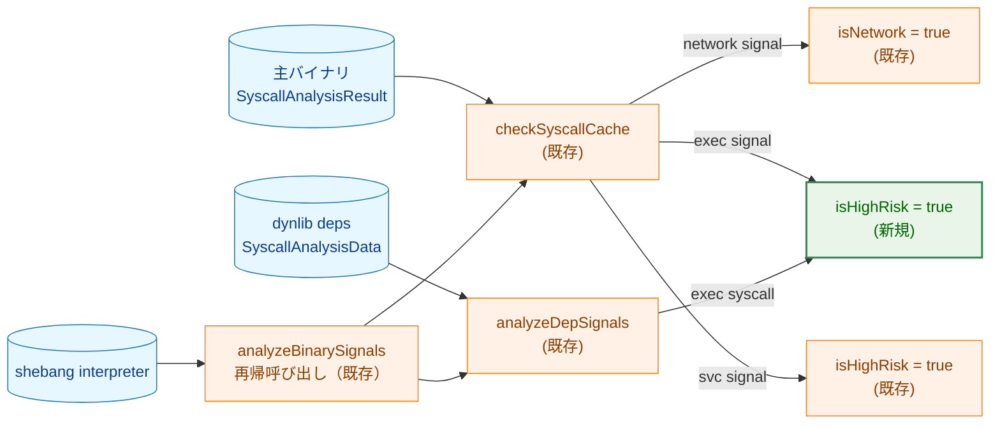
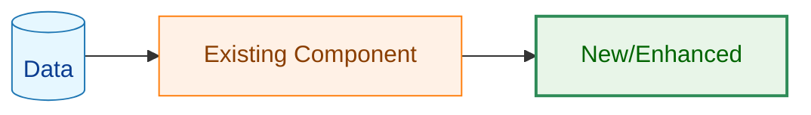
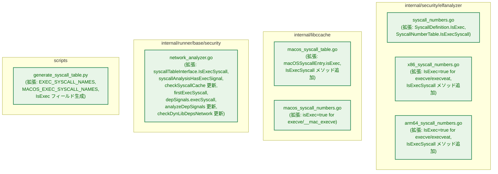
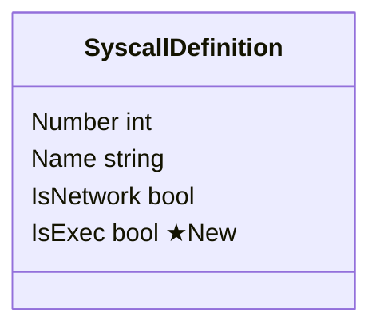
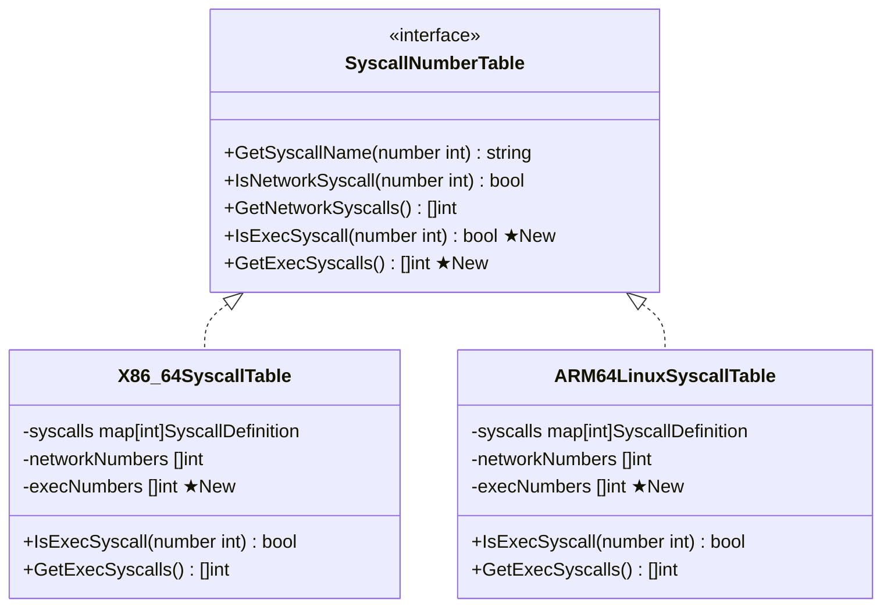
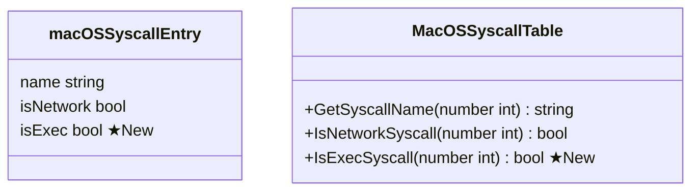
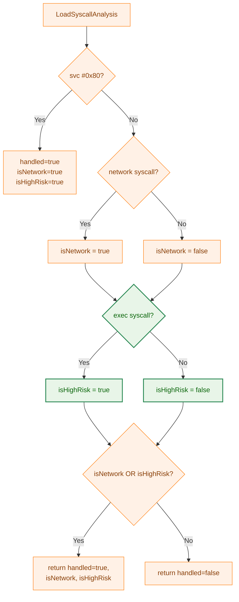
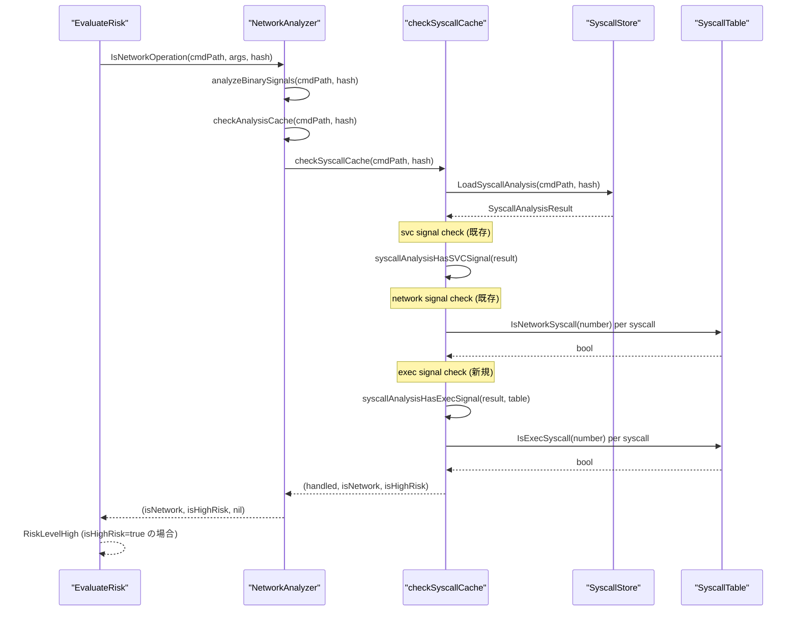
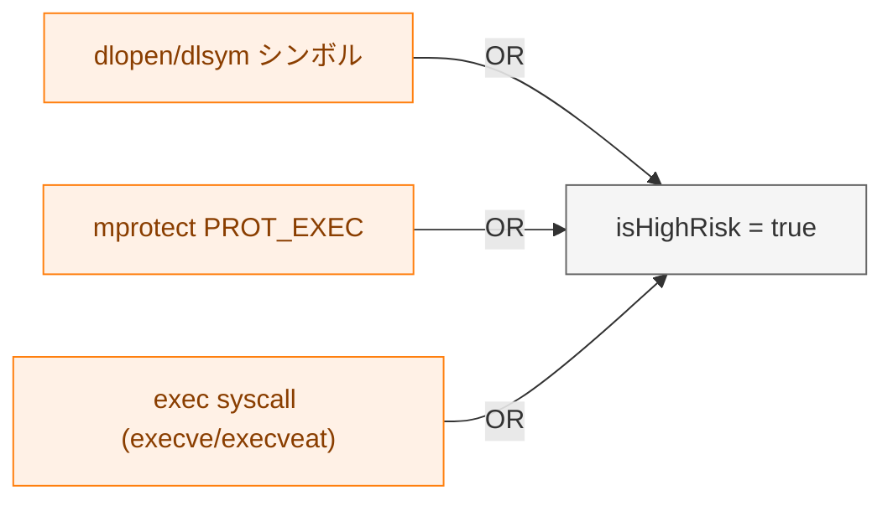
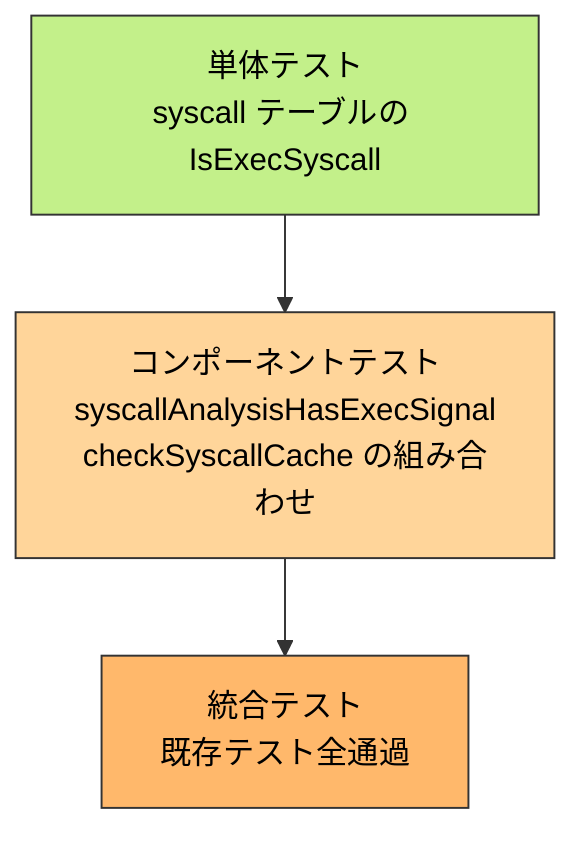

# アーキテクチャ設計書: exec syscall による高リスク検出

## 1. システム概要

### 1.1 アーキテクチャ目標

- 既存の syscall 静的解析インフラ（タスク 0070/0072/0097）を再利用し、exec syscall 検出を追加する
- `SyscallDefinition` / `macOSSyscallEntry` に `IsExec` フラグを追加することで、ネットワーク分類と対称な実装を実現する
- `checkSyscallCache` 内で exec signal を検出し、`isHighRisk = true` にマッピングする
- 生成スクリプト（`generate_syscall_table.py`）を更新することで、将来のアーキテクチャ追加時の保守コストを最小化する

### 1.2 設計原則

- **既存活用**: network syscall 検出パターン（`IsNetwork`, `syscallAnalysisHasNetworkSignal`）をそのまま exec 検出に適用する
- **対称性**: exec 関連フィールド名・メソッド名は network 関連の命名規則に従う
- **最小変更**: 新規ファイルの作成は不要。既存ファイルへの追加のみ
- **フェイルクローズ不変**: exec 検出の追加は既存の安全側へ倒す設計に影響しない

### 1.3 スコープと位置づけ

本タスクは既存の syscall 静的解析インフラの拡張であり、解析済みの結果（`SyscallAnalysisResult`）から exec syscall を識別するフラグとロジックを追加する。



**凡例（Legend）**



## 2. システム構成

### 2.1 変更対象ファイル一覧



### 2.2 データ構造の変更

#### 2.2.1 SyscallDefinition（elfanalyzer パッケージ）



`IsNetwork` フィールドと同じパターンで `IsExec` を追加する。

#### 2.2.2 SyscallNumberTable インターフェース（elfanalyzer パッケージ）



#### 2.2.3 macOSSyscallEntry と MacOSSyscallTable（libccache パッケージ）



**注意**: `libccache.SyscallNumberTable` インターフェースは `GetSyscallName` と `IsNetworkSyscall` のみを定義し、`MacOSSyscallTable` の `IsExecSyscall` は `libccache.SyscallNumberTable` の外部に実装する。これは `libccache.SyscallNumberTable` が exec 分類とは無関係な用途（`ImportSymbolMatcher`）で使用されているためである。`MacOSSyscallTable` は `network_analyzer.go` の `syscallTableInterface` を通じて使用される。

### 2.3 detection フローの変更

#### 2.3.1 syscallTableInterface の拡張

```go
// Before:
type syscallTableInterface interface {
    IsNetworkSyscall(number int) bool
}

// After:
type syscallTableInterface interface {
    IsNetworkSyscall(number int) bool
    IsExecSyscall(number int) bool   // ★New
}
```

#### 2.3.2 checkSyscallCache の拡張



**設計上の注意**: 既存の実装では `syscallAnalysisHasNetworkSignal` が true の場合に即座に `return true, true, false` していた。exec signal との組み合わせを正しく処理するため、early return を廃止し、両シグナルを評価してから返すように変更する。

## 3. データフロー

### 3.1 事前解析フェーズ（変更なし）

exec syscall の記録は既存の syscall 静的解析（タスク 0070/0072/0097）で行われる。`execve` は `SyscallDefinition.IsExec = true` としてテーブルに定義されているが、解析結果の JSON 形式（`SyscallAnalysisData`）は変更不要である。解析結果には syscall 番号と名称が記録されており、実行時に `IsExecSyscall(number)` でフィルタリングする。

### 3.2 実行時フェーズ



## 4. コンポーネント設計

### 4.1 検出対象のカバレッジ

| 検出対象 | 実装箇所 | 新規実装要否 |
|---|---|---|
| 主バイナリの exec syscall | `checkSyscallCache` | 要（FR-3.2.3） |
| dynlib 依存ライブラリの exec syscall | `analyzeDepSignals` + `firstExecSyscall` | 要（FR-3.2.4） |
| shebang インタープリタの exec syscall | `followShebangChain` → `analyzeBinarySignals` 再帰 → `checkSyscallCache` | 不要（FR-3.2.3 完了で自動カバー） |
| shebang インタープリタの dynlib 依存の exec syscall | `followShebangChain` → `analyzeBinarySignals` 再帰 → `checkDynLibDepsNetwork` | 不要（FR-3.2.4 完了で自動カバー） |

### 4.2 syscallAnalysisHasExecSignal 関数

`syscallAnalysisHasNetworkSignal` と同じパターンで実装する。

```go
// syscallAnalysisHasExecSignal reports whether the given SyscallAnalysisResult
// contains any detected syscall classified as an exec syscall.
func syscallAnalysisHasExecSignal(result *fileanalysis.SyscallAnalysisResult, goos string) bool {
    if result == nil {
        return false
    }
    if len(result.DetectedSyscalls) == 0 {
        return false
    }
    table := syscallTableForArch(goos, result.Architecture)
    if table == nil {
        return false
    }
    for _, s := range result.DetectedSyscalls {
        if s.Number >= 0 && table.IsExecSyscall(s.Number) {
            return true
        }
    }
    return false
}
```

### 4.3 checkSyscallCache の変更

```go
// Before (network signal の early return を廃止):
if syscallAnalysisHasNetworkSignal(svcResult, a.goos) {
    slog.Info("SyscallAnalysis cache indicates network syscall", "path", cmdPath)
    return true, true, false  // ← early return で exec signal を見逃す
}

// After (両シグナルを評価してから返す):
isNet := syscallAnalysisHasNetworkSignal(svcResult, a.goos)
isExec := syscallAnalysisHasExecSignal(svcResult, a.goos)

if isNet {
    slog.Info("SyscallAnalysis cache indicates network syscall", "path", cmdPath)
}
if isExec {
    slog.Warn("SyscallAnalysis cache indicates exec syscall; treating as high risk", "path", cmdPath)
}
if isNet || isExec {
    return true, isNet, isExec
}
return false, false, false
```

### 4.4 dynlib 依存ライブラリの exec 検出

`analyzeDepSignals` に exec syscall 検出を追加する。

```go
// depSignals の拡張:
type depSignals struct {
    dynLoadSymbols  []string
    networkSymbols  []string
    networkSyscall  string
    execSyscall     string  // ★New
    mprotectRisk    common.SyscallArgEvalResult
    hasMprotectRisk bool
}

// analyzeDepSignals の拡張（result.SyscallAnalysis != nil ブロック内）:
s.networkSyscall = firstNetworkSyscall(table, result.SyscallAnalysis)
s.execSyscall = firstExecSyscall(table, result.SyscallAnalysis)  // ★New
```

`checkDynLibDepsNetwork` に exec signal のハンドリングを追加する。

```go
if sigs.execSyscall != "" {
    execLog.log("dynlib analysis detected exec syscall; treating as high risk",
        "cmd_path", cmdPath, "dep_path", dep.Path, "syscall", sigs.execSyscall)
    isHighRisk = true
}
```

`firstExecSyscall` は `firstNetworkSyscall` と同一のパターンで実装し、`table.IsExecSyscall` を使用する。

### 4.5 syscall テーブルの拡張パターン

`X86_64SyscallTable` と `ARM64LinuxSyscallTable` の両方で同一パターンを適用する。

```go
// SyscallDefinition のエントリ例（x86_64）:
{59, "execve", false, true},     // IsNetwork=false, IsExec=true
{322, "execveat", false, true},  // IsNetwork=false, IsExec=true

// テーブル構造体:
type X86_64SyscallTable struct {
    syscalls       map[int]SyscallDefinition
    networkNumbers []int
    execNumbers    []int  // ★New
}

// IsExecSyscall メソッド:
func (t *X86_64SyscallTable) IsExecSyscall(number int) bool {
    if def, ok := t.syscalls[number]; ok {
        return def.IsExec
    }
    return false
}

// GetExecSyscalls メソッド:
func (t *X86_64SyscallTable) GetExecSyscalls() []int {
    result := make([]int, len(t.execNumbers))
    copy(result, t.execNumbers)
    return result
}
```

### 4.6 生成スクリプトの変更

```python
# 追加するセット定数:
EXEC_SYSCALL_NAMES = {
    "execve",
    "execveat",
}

MACOS_EXEC_SYSCALL_NAMES = {
    "execve",
    "__mac_execve",
}

# SyscallDefinition の生成ロジック（build_body 内）:
# Before:
is_network = "true" if name in NETWORK_SYSCALL_NAMES else "false"
lines.append(f'\t\t{{{num}, "{name}", {is_network}}},')

# After:
is_network = "true" if name in NETWORK_SYSCALL_NAMES else "false"
is_exec = "true" if name in EXEC_SYSCALL_NAMES else "false"
lines.append(f'\t\t{{{num}, "{name}", {is_network}, {is_exec}}},')
```

生成テンプレートも更新し、`execNumbers` フィールドの初期化と `IsExecSyscall` / `GetExecSyscalls` メソッドの生成を追加する。

## 5. セキュリティアーキテクチャ

### 5.1 リスク判定マトリクス

| 検出シグナル | isNetwork | isHighRisk | 最終リスクレベル |
|---|---|---|---|
| exec syscall のみ | false | true | High |
| network syscall のみ | true | false | Medium |
| exec + network syscall | true | true | High |
| exec なし、network なし | false | false | Low（他要因なし） |

### 5.2 exec signal の位置づけ

exec signal は `isHighRisk` に分類される。これは dlopen シンボル検出および mprotect PROT_EXEC 検出と同じ論理に基づく：「静的解析で把握した内容を実行時に無効化できる能力を持つ」バイナリは high リスクとして扱う。



### 5.3 スキーマバージョンの変更なし

exec syscall の検出は既存の `SyscallAnalysisData` が保持する `DetectedSyscalls` リストを参照するのみで、保存形式の変更はない。`CurrentSchemaVersion` は変更不要である。

## 6. テスト戦略

### 6.1 テスト階層



### 6.2 テストスコープ

- **単体テスト**: 各 `IsExecSyscall` メソッドが正しい syscall に true/false を返すことの検証
- **コンポーネントテスト**: `syscallAnalysisHasExecSignal` と `checkSyscallCache` に対して、exec only / exec + network / no exec の各パターンをテスト
- **統合テスト**: `make test` で全既存テストがパスすることの確認

### 6.3 既存テストとの干渉

`checkSyscallCache` の network signal early return を修正することで、既存の network-only テストケースが影響を受けないことを確認すること。
