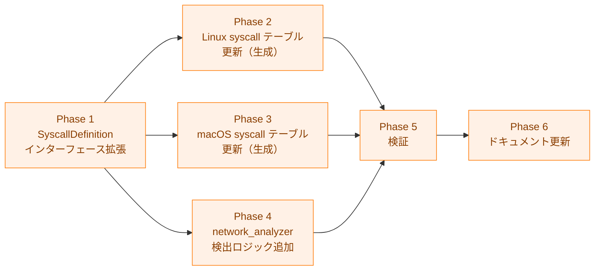

# 実装計画書: exec syscall による高リスク検出

## 概要

本ドキュメントは exec syscall による高リスク検出機能の実装進捗を追跡する。
詳細仕様は [03_detailed_specification.md](03_detailed_specification.md) を参照。

## 依存関係

**凡例（Legend）**

**依存関係（論理的な順序）**: Phase 2・3・4 は Phase 1 が完了してから開始できる。Phase 4 内では 4.1〜4.5（主バイナリ検出）が完了してから 4.6〜4.7（dynlib 検出）を開始する。Phase 6 は Phase 5 完了後に開始する。

**実施順序（運用上の制約）**: CLAUDE.md の逐次ツール実行プロトコルに従い、各フェーズは上から順に 1 フェーズずつ実施すること。依存関係図は「どのフェーズが先に完了している必要があるか」を示すものであり、「複数フェーズを同時に作業してよい」という意味ではない。

---

## Phase 1: SyscallDefinition とインターフェース拡張

syscall テーブルの生成スクリプトと手動実装の基礎となるインターフェースを確立する。

### 1.1 SyscallDefinition の拡張

- [x] `internal/security/elfanalyzer/syscall_numbers.go` を編集
  - `SyscallDefinition` 構造体に `IsExec bool` フィールドを追加
  - 仕様: 詳細仕様書 §2.1

### 1.2 SyscallNumberTable インターフェースの拡張

- [x] `internal/security/elfanalyzer/syscall_numbers.go` を編集
  - `SyscallNumberTable` インターフェースに `IsExecSyscall(number int) bool` を追加
  - `SyscallNumberTable` インターフェースに `GetExecSyscalls() []int` を追加
  - 仕様: 詳細仕様書 §2.2
  - 受け入れ条件: AC-1

### 1.3 生成スクリプトの更新

- [x] `scripts/generate_syscall_table.py` を編集
  - `EXEC_SYSCALL_NAMES = {"execve", "execveat"}` セットを追加
  - `MACOS_EXEC_SYSCALL_NAMES = {"execve", "__mac_execve"}` セットを追加
  - `build_body` 関数に `IsExec` フィールドの生成を追加
  - `STRUCT_TEMPLATE` に `execNumbers []int` フィールドを追加
  - `STRUCT_TEMPLATE` に `IsExecSyscall` / `GetExecSyscalls` メソッドの生成を追加
  - `generate_macos` 関数に `isExec` フィールドの生成を追加
  - 仕様: 詳細仕様書 §7
  - 受け入れ条件: AC-5

---

## Phase 2: Linux syscall テーブルの更新

生成スクリプトを使用して Linux 用の syscall テーブルを再生成し、手動テストを追加する。

### 2.1 Linux テーブルの再生成

- [x] `make generate-syscall-tables` を実行して x86_64 / arm64 テーブルを再生成
  - 生成後に `x86_syscall_numbers.go` と `arm64_syscall_numbers.go` の変更内容を確認
  - execve / execveat に `IsExec: true` が設定されていること
  - `execNumbers` フィールドと `IsExecSyscall` / `GetExecSyscalls` メソッドが生成されていること
  - 仕様: 詳細仕様書 §3, §4
  - 受け入れ条件: AC-1

### 2.2 x86_64 syscall テーブルのテスト

- [x] `internal/security/elfanalyzer/x86_syscall_numbers_test.go` を編集
  - `TestX86_64SyscallTable_IsExecSyscall` を追加
    - execve(59) → true
    - execveat(322) → true
    - socket(41) → false
    - read(0) → false
    - 存在しない番号(-1, 9999) → false
  - `TestX86_64SyscallTable_GetExecSyscalls` を追加
    - 返り値に 59 と 322 が含まれること
    - 返り値の長さが 2 であること
    - 返り値がコピーであること（内部状態を変更しても次の呼び出しに影響しない）
  - 仕様: 詳細仕様書 §8.1
  - 受け入れ条件: AC-1

### 2.3 arm64 syscall テーブルのテスト

- [x] `internal/security/elfanalyzer/arm64_syscall_numbers_test.go` を編集
  - `TestARM64LinuxSyscallTable_IsExecSyscall` を追加
    - execve(221) → true
    - execveat(281) → true
    - socket(198) → false
    - read(63) → false
    - 存在しない番号(-1) → false
  - 仕様: 詳細仕様書 §8.2
  - 受け入れ条件: AC-1

---

## Phase 3: macOS syscall テーブルの更新

macOS 用のテーブル構造体とメソッドを手動で更新し、再生成後に検証する。

### 3.1 macOSSyscallEntry の拡張

- [ ] `internal/libccache/macos_syscall_table.go` を編集
  - `macOSSyscallEntry` 構造体に `isExec bool` フィールドを追加
  - `MacOSSyscallTable` に `IsExecSyscall(number int) bool` メソッドを追加
  - 仕様: 詳細仕様書 §5.1, §5.2
  - 受け入れ条件: AC-2

### 3.2 macOS テーブルの再生成

`internal/libccache/macos_syscall_numbers.go` は自動生成ファイルであるため、生成スクリプト（Phase 1.3 で更新済み）を使って再生成すること。

**正規の手順（macOS 環境が利用可能な場合）**:
- [ ] macOS 環境で `make generate-macos-syscall-table` を実行（Linux ヘッダー不要、macOS 専用ターゲット）
  - SDK ヘッダーのパスを変更する場合は `MACOS_SYSCALL_HEADER=/path/to/syscall.h make generate-macos-syscall-table`
  - execve(59) に `isExec: true` が設定されていること
  - \_\_mac\_execve(380) に `isExec: true` が設定されていること
  - 仕様: 詳細仕様書 §5.3
  - 受け入れ条件: AC-2, AC-5

**macOS 環境が利用できない場合の代替手順（最終手段）**:
- [ ] `macos_syscall_numbers.go` を手動編集する前に、生成スクリプト（`generate_syscall_table.py`）を更新済みであることを確認する
- [ ] 手動編集後、`make generate-syscall-tables --macos-header ...` を macOS 環境で実行した結果と差分がないことを後で検証する
- [ ] 手動編集の旨を PR に明記し、macOS 再生成による上書きを後続のタスクとして記録する
  - NOTE: 手動編集はスクリプトとのドリフトを招くため、macOS 環境での再生成を最優先とすること

### 3.3 macOS syscall テーブルのテスト

- [ ] `internal/libccache/macos_syscall_table_test.go` を編集
  - `TestMacOSSyscallTable_IsExecSyscall` を追加
    - execve(59) → true
    - \_\_mac\_execve(380) → true
    - socket(97) → false
    - read(3) → false
    - 存在しない番号(-1) → false
  - 仕様: 詳細仕様書 §8.3
  - 受け入れ条件: AC-2

---

## Phase 4: network_analyzer の検出ロジック追加

exec signal の検出と `checkSyscallCache` の更新を行う。

### 4.1 syscallTableInterface の拡張

- [ ] `internal/runner/base/security/network_analyzer.go` を編集
  - `syscallTableInterface` に `IsExecSyscall(number int) bool` を追加
  - 仕様: 詳細仕様書 §6.1
  - 受け入れ条件: AC-3

### 4.2 syscallAnalysisHasExecSignal 関数の追加

- [ ] `internal/runner/base/security/network_analyzer.go` を編集
  - `syscallAnalysisHasNetworkSignal` の直後に `syscallAnalysisHasExecSignal` 関数を追加
  - 仕様: 詳細仕様書 §6.2
  - 受け入れ条件: AC-3

### 4.3 checkSyscallCache と checkAnalysisCache の更新

- [ ] `internal/runner/base/security/network_analyzer.go` を編集（`checkSyscallCache`）
  - `handled=true` を exec または SVC の場合のみに限定する
  - exec signal を検出した場合は `slog.Warn` でログ出力し `(true, isNet, true)` を返す
  - network-only の場合は `(false, isNet, false)` を返す（symbol analysis をスキップしない）
  - 仕様: 詳細仕様書 §6.3
  - 受け入れ条件: AC-4
- [ ] `internal/runner/base/security/network_analyzer.go` を編集（`checkAnalysisCache`）
  - `checkSyscallCache` の戻り値を変数に受けて `handled=false` でも `syscallIsNet` を積算する
  - `syscallHandled=true` の場合のみ early return し、それ以外は symbol analysis を常時実行する
  - symbol analysis の結果と syscall シグナルを OR で統合して返す
  - 仕様: 詳細仕様書 §6.4
  - 受け入れ条件: AC-4

### 4.4 syscallAnalysisHasExecSignal のテスト

- [ ] `internal/runner/base/security/network_analyzer_test.go` を編集
  - `TestSyscallAnalysisHasExecSignal` を追加
    - execve を含む SyscallAnalysisResult → true
    - execveat を含む SyscallAnalysisResult → true
    - network syscall のみ → false
    - exec syscall なし（write のみ）→ false
    - DetectedSyscalls が空 → false
    - result が nil → false
  - 仕様: 詳細仕様書 §8.4
  - 受け入れ条件: AC-3

### 4.5 checkSyscallCache の統合テスト

- [ ] `internal/runner/base/security/network_analyzer_test.go` を編集
  - `TestNetworkAnalyzer_ExecSyscallIsHighRisk` を追加
    - exec syscall のみ（execve）→ (isNetwork=false, isHighRisk=true)
    - exec + network → (isNetwork=true, isHighRisk=true)
    - network のみ → (isNetwork=true, isHighRisk=false)
    - exec なし → isHighRisk への影響なし
  - 仕様: 詳細仕様書 §8.5
  - 受け入れ条件: AC-4

### 4.6 dynlib 依存ライブラリの exec 検出

- [ ] `internal/runner/base/security/network_analyzer.go` を編集
  - `depSignals` 構造体に `execSyscall string` フィールドを追加
  - `firstExecSyscall` 関数を `firstNetworkSyscall` の直後に追加
  - `analyzeDepSignals` に `s.execSyscall = firstExecSyscall(table, result.SyscallAnalysis)` を追加
  - `checkDynLibDepsNetwork` に `sigs.execSyscall != ""` → `isHighRisk = true` の処理を追加
  - 仕様: 詳細仕様書 §7
  - 受け入れ条件: AC-7

### 4.7 dynlib exec 検出テスト

- [ ] `internal/runner/base/security/network_analyzer_test.go` を編集
  - `TestFirstExecSyscall` を追加
    - execve を含む SyscallAnalysisData → `"execve"`
    - network syscall のみ → `""`
    - DetectedSyscalls が空 → `""`
    - table が nil → `""`
    - data が nil → `""`
  - `TestAnalyzeDepSignals_ExecSyscall` を追加
    - execve を含む SyscallAnalysis → `execSyscall == "execve"`
    - exec syscall なし → `execSyscall == ""`
    - SyscallAnalysis が nil → `execSyscall == ""`
  - `TestNetworkAnalyzer_DynLibExecSyscallIsHighRisk` を追加
    - dynlib に execve のみ → (isNetwork=false, isHighRisk=true)
    - dynlib に network + exec → (isNetwork=true, isHighRisk=true)
    - dynlib に exec syscall なし → isHighRisk への影響なし
  - 仕様: 詳細仕様書 §8.6
  - 受け入れ条件: AC-7

---

## Phase 5: 検証

全体動作の検証を行う。

### 5.1 フォーマット

- [ ] `make fmt` を実行し、全ファイルのフォーマットを適用

### 5.2 全テストパス

- [ ] `make test` で全テストがパスすることを確認
  - 既存の `IsNetworkSyscall` / `IsNetworkOperation` の結果が変わらないこと
  - 受け入れ条件: AC-6

### 5.3 リンターパス

- [ ] `make lint` でリンターが全てパスすることを確認

### 5.4 生成スクリプトの整合性確認

- [ ] `make generate-syscall-tables` を再実行し、生成結果が既存ファイルと一致すること（差分なし）
  - 受け入れ条件: AC-5

---

## Phase 6: ドキュメント更新

ユーザー向け・開発者向けドキュメントに exec syscall 検出の説明を追記する。

### 6.1 コマンドレベル設定ガイド（英語版）

- [ ] `docs/user/toml_config/06_command_level.md` を編集
  - 「Risk Assessment Mechanism」の番号付きリストに項目 5 を追加
  - 内容: exec syscall（execve/execveat）検出による自動高リスク分類の説明
  - 仕様: 詳細仕様書 §11.1

### 6.2 コマンドレベル設定ガイド（日本語版）

- [ ] `docs/user/toml_config/06_command_level.ja.md` を編集
  - 「リスク評価の仕組み」の番号付きリストに項目 5 を追加
  - 内容: §6.1 の日本語版
  - 仕様: 詳細仕様書 §11.2

### 6.3 セキュリティアーキテクチャ設計書（英語版）

- [ ] `docs/dev/architecture_design/security-architecture.md` を編集
  - syscall analysis の説明（§2 "Analysis content"）に exec syscall 検出を追記
  - Security Guarantees リストに exec syscall 検出を追記
  - Threat Model "Dangerous Binary Execution" の Threats / Countermeasures に追記
  - 仕様: 詳細仕様書 §11.3

### 6.4 セキュリティアーキテクチャ設計書（日本語版）

- [ ] `docs/dev/architecture_design/security-architecture.ja.md` を編集
  - §6.3 と同内容を日本語の対応箇所に適用
  - 仕様: 詳細仕様書 §11.4
