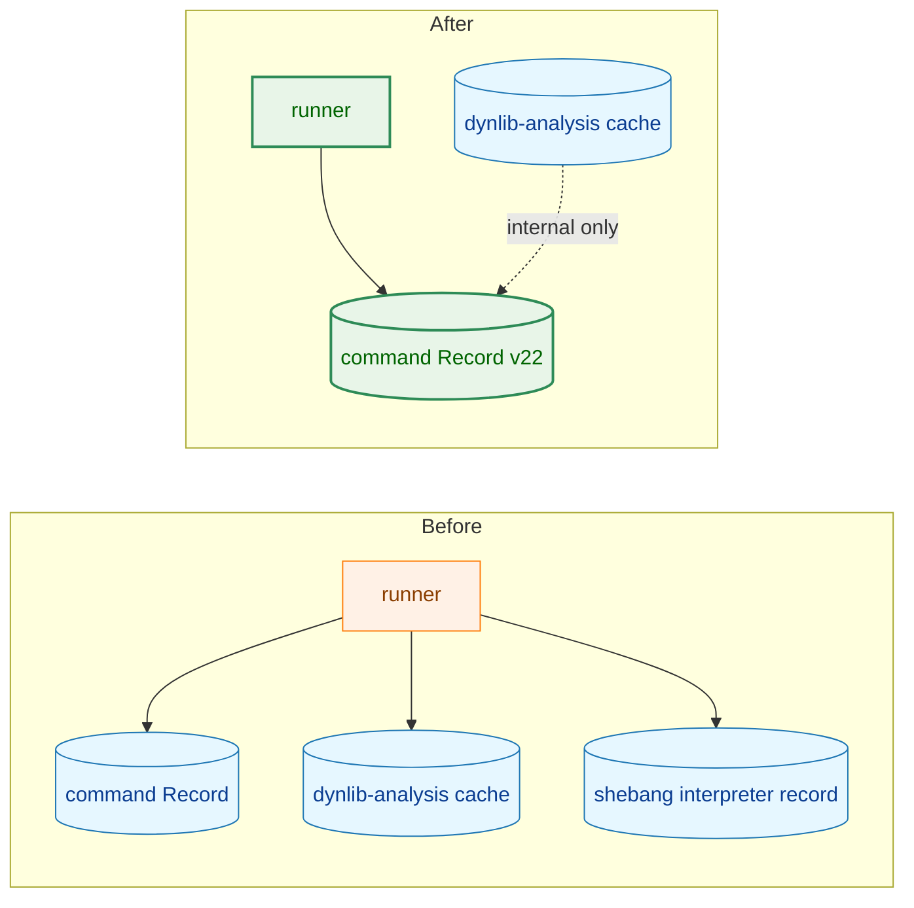
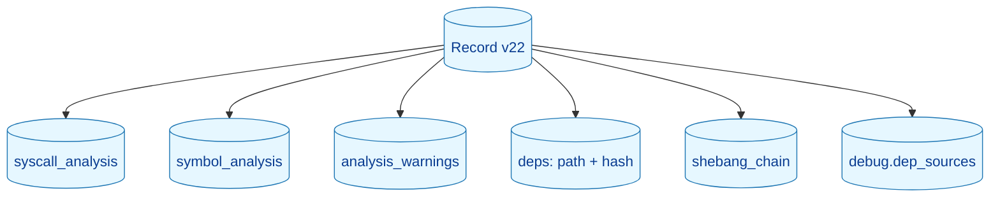
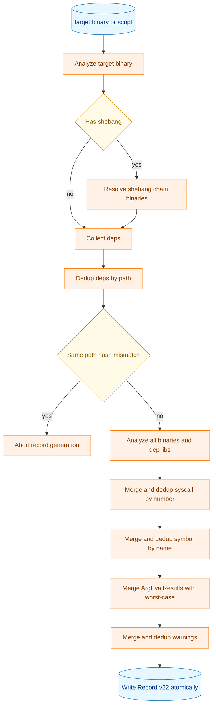
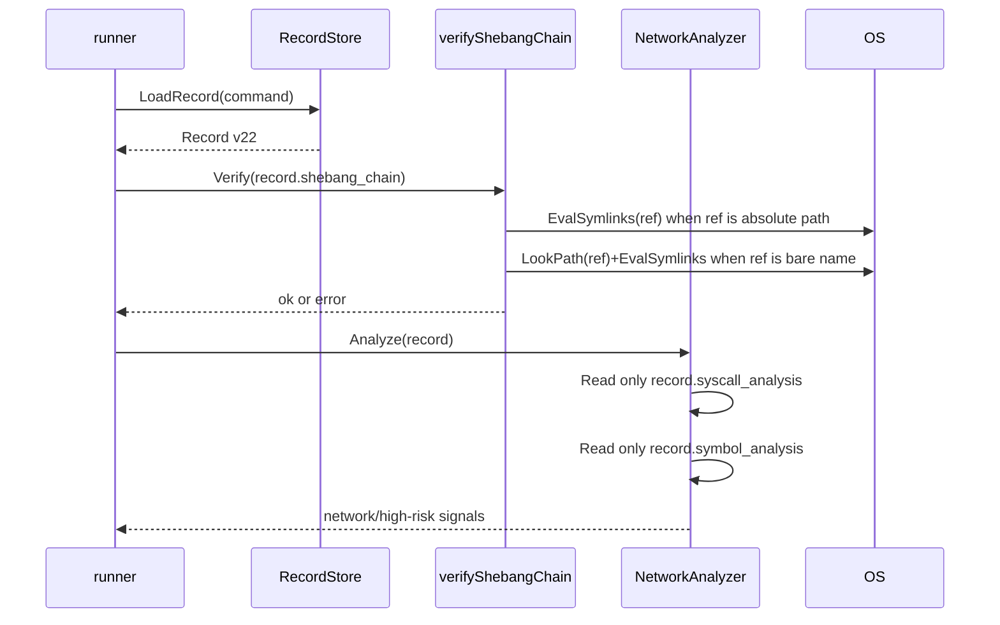
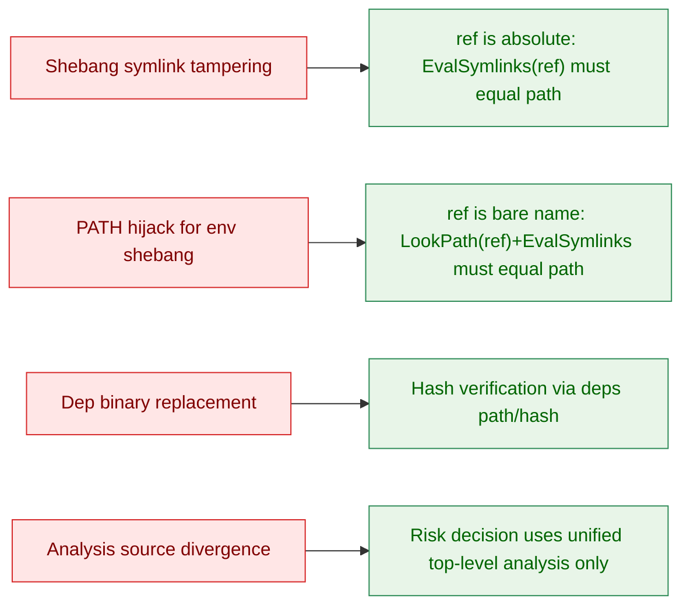

# アーキテクチャ設計書: Record スキーマ v22

## 1. 設計方針

### 1.1 目的

1. リスク判定入力を Record トップレベルへ集約する
2. `deps` と `shebang_chain` を検証専用データへ縮約する
3. `runner` の解析依存を `RecordStore` 単一依存にする

### 1.2 原則

1. Self-contained: 実行時の解析判断は Record 1件で完結させる
2. Single source of risk: ネットワークリスク判定は `syscall_analysis` と `symbol_analysis` のみを参照する
3. Fail-closed: dedup 不整合や shebang 再解決不一致は実行停止とする

## 2. 全体構成

### 2.1 Before / After

### 2.2 コンポーネント責務

| コンポーネント | 主責務 | 非責務 |
|---|---|---|
| `record` | 解析対象全体を解析し、トップレベル解析結果を統合して Record に保存 | 実行時リスク判定 |
| `runner.NetworkAnalyzer` | Record のトップレベル解析結果だけでリスク判定 | dep ごとの再解析、shebang 追跡解析 |
| `verifyShebangChain` | `raw_path` と `command_name` の実行時再解決検証 | リスク判定 |
| `deps` | hash 整合性検証対象の列挙 | リスク判定入力 |

## 3. データモデル

### 3.1 Record v22 論理モデル

### 3.2 スキーマ責務分離

1. `syscall_analysis` / `symbol_analysis`
   リスク判定用の統合済みデータ
2. `deps`
   実行時 hash 検証用の参照データ
3. `shebang_chain`
   実行時の再解決整合性検証データ。各エントリの `ref`（絶対パスまたはベア名）を解決して `path` と比較する
4. `analysis_warnings`
   非致命警告の統合ログ
5. `debug.dep_sources`
   `-debug-info` 時のみのトレーサビリティ情報

## 4. 処理フロー

### 4.1 record 側

### 4.2 runner 側

## 5. 変更対象設計

### 5.1 record

1. コマンド本体、shebang チェーン各バイナリ、各 dep ライブラリを解析対象とする
2. VDSO と syscall wrapper ライブラリは解析スキップする
3. 結果はトップレベルへ統合し、`deps` には `path` + `hash` のみを出力する
4. `saveInterpreterRecord` は削除する
5. `analysis_warnings` は Record トップレベルに統合する

### 5.2 runner / NetworkAnalyzer

1. `AnalysisDeps` は `RecordStore` のみを保持する
2. `analyzeBinarySignals` は Record ロード後、トップレベル解析結果のみで判定する
3. `checkDepsSignals` を削除する
4. `followShebangChain`（解析目的）を削除する
5. `ErrDepAnalysisNotEmbedded` を削除する

### 5.3 verification.Manager

1. `GetAnalysisDeps` は `AnalysisDeps{RecordStore: m.fileValidator}` を返す
2. `networkSymbolStore` `syscallAnalysisStore` `dynLibDepsStore` `dynlibAnalysisStore` `shebangStore` を削除する

## 6. セキュリティ設計

### 6.1 検出ポイント

### 6.2 エラー境界

1. dedup 中の同一 path hash 不一致は `record` 側で致命エラー
2. shebang 再解決不一致は `runner` 側で致命エラー
3. v21 以下 Record は `SchemaVersionMismatchError`

## 7. 文書整合ルール

1. AC番号は [./01_requirements.md](./01_requirements.md) に一致させる
2. テスト対応表は [./03_detailed_specification.md](./03_detailed_specification.md) と [./04_implementation_plan.md](./04_implementation_plan.md) で同一の削除対象を指す
