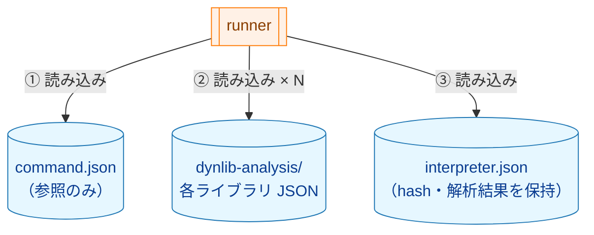
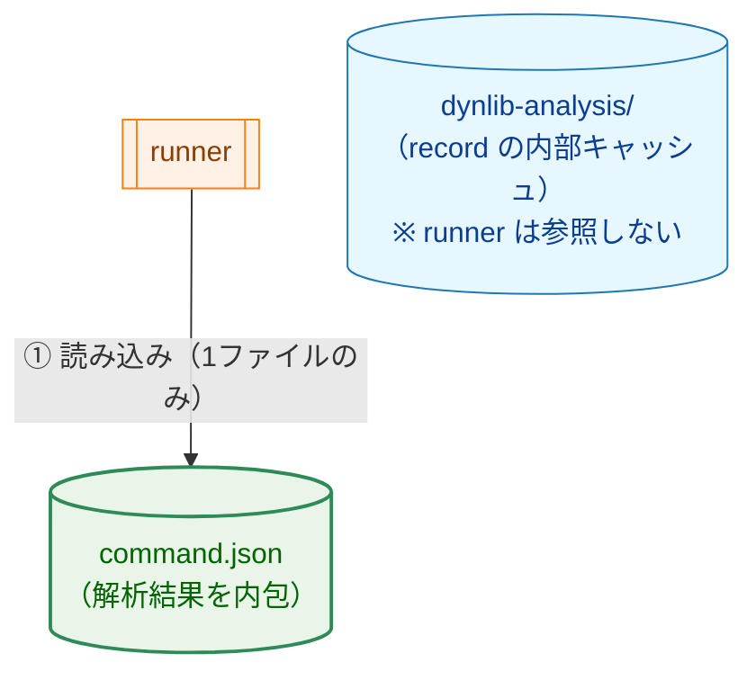
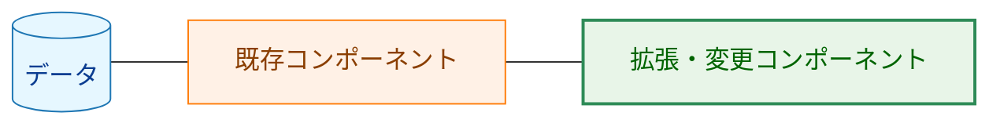
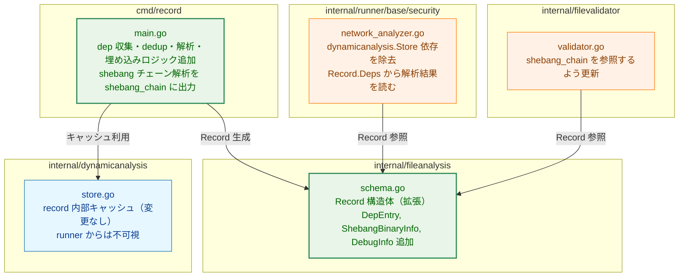
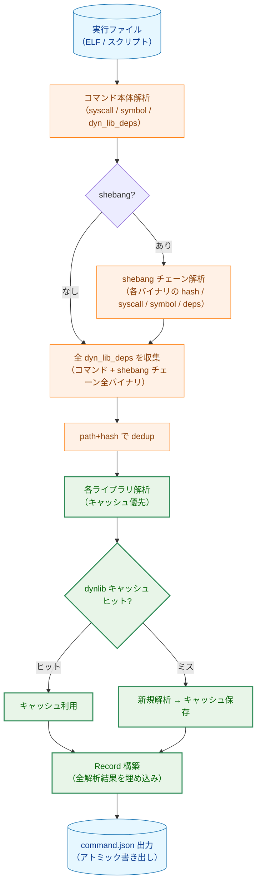
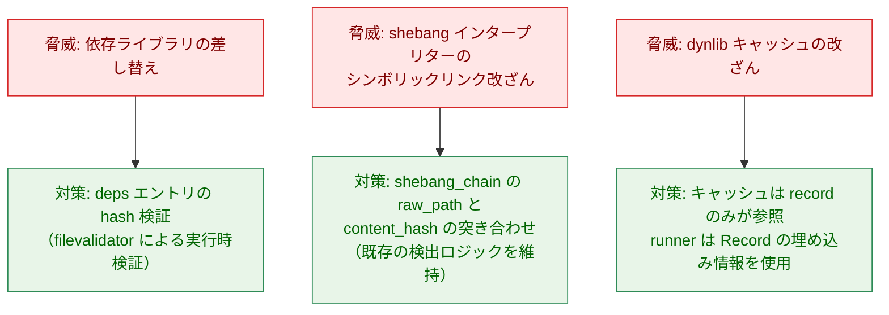
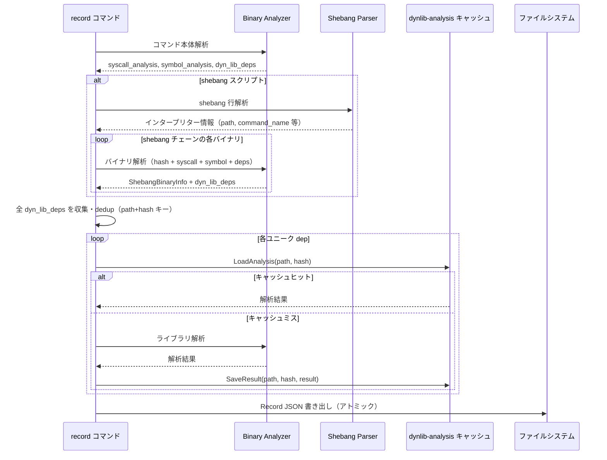
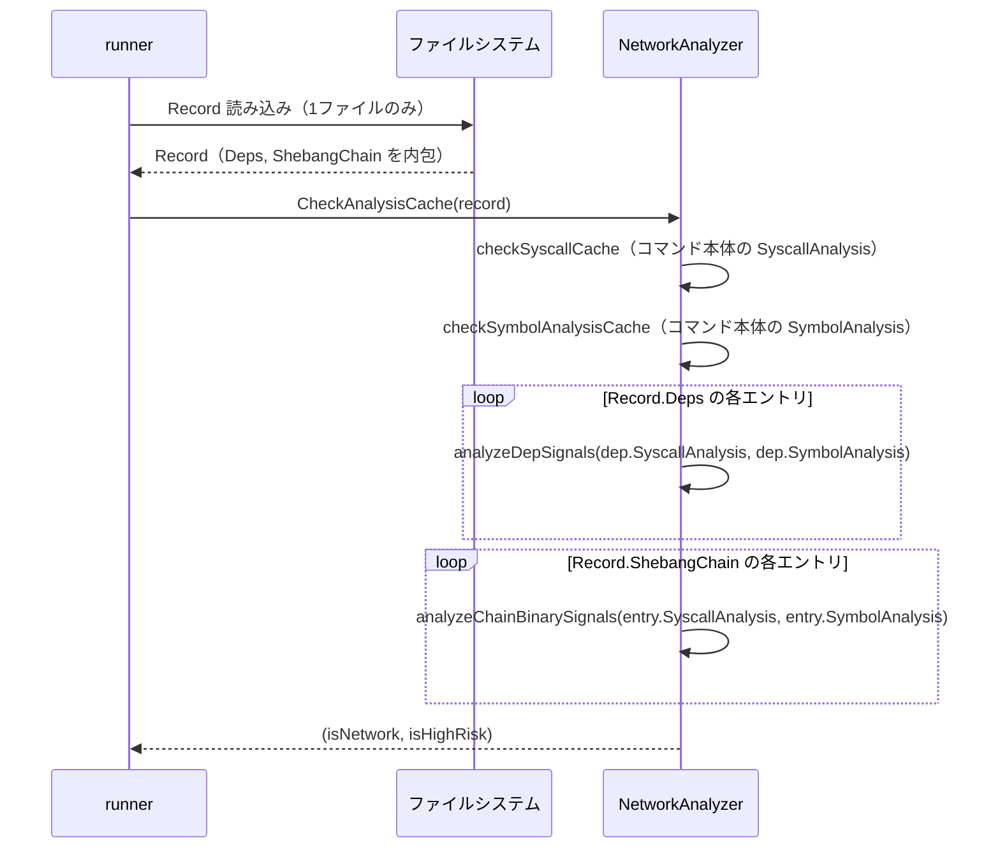

# アーキテクチャ設計書: コマンド Record 完全自己完結化

## 1. 設計概要

### 1.1 設計目標

- `runner` が参照するファイルをコマンドの Record JSON 1ファイルのみにする
- Record ファイル1つで完全な解析情報を提供し、配布・移植を容易にする
- `runner` の `dynamicanalysis.Store` への依存を除去してコードをシンプルにする

### 1.2 設計原則

- **自己完結性**: コマンドの Record は実行時判断に必要な全情報を内包する
- **dedup**: 複数の依存元から参照される共有ライブラリは `path` を主キーとして1エントリに統合する（hash が一致する場合に統合。不一致の場合は致命的エラーとして `record` を中断する）
- **キャッシュの分離**: dynlib-analysis キャッシュは `record` の内部最適化手段として維持し、`runner` からは不可視とする
- **段階的デバッグ**: 通常用途には必要最小限の情報のみ記録し、`-debug-info` 時のみ詳細な由来情報を追記する

## 2. システム構成

### 2.1 全体アーキテクチャ（変更前後）

**変更前**: `runner` が複数ファイルを参照



**変更後**: `runner` は1ファイルのみ参照



**凡例（Legend）**



### 2.2 コンポーネント配置



### 2.3 record コマンドの処理フロー（変更後）



## 3. コンポーネント設計

### 3.1 スキーマ設計（fileanalysis.Record の変更）

**変更前後のフィールド対応:**

| 変更前フィールド | 変更後フィールド | 変更内容 |
|-----------------|-----------------|---------|
| `DynLibDeps []LibEntry` | `Deps []DepEntry` | 解析結果（`syscall_analysis`、`symbol_analysis`、`warnings`）を追加 |
| `ShebangInterpreter *ShebangInterpreterInfo` | `ShebangChain []ShebangBinaryInfo` | `content_hash` と解析結果を追加、リスト形式に変更 |
| `AnalysisWarnings []string`（Record レベル） | `DepEntry.Warnings []string`（各エントリ内） | 警告を dep ごとに記録 |
| （なし） | `Debug *DebugInfo` | `-debug-info` 時のみ |

**新規型定義（概要）:**

```go
// DepEntry は単一の依存共有ライブラリを表す。
// Deps リスト内では path+hash をキーとして dedup される。
type DepEntry struct {
    SOName          string
    Path            string
    Hash            string
    SyscallAnalysis *SyscallAnalysisData  // nullable（syscall wrapper は nil）
    SymbolAnalysis  *SymbolAnalysisData   // nullable
    Warnings        []string              // 解析中の非致命的警告
}

// ShebangBinaryInfo は shebang チェーンの1バイナリを表す。
type ShebangBinaryInfo struct {
    RawPath         string  // shebang 行の記述（先頭エントリのみ）
    Path            string  // シンボリックリンク解決済みパス
    CommandName     string  // env 形式の引数名（env バイナリのエントリのみ）
    ContentHash     string
    SyscallAnalysis *SyscallAnalysisData  // nullable
    SymbolAnalysis  *SymbolAnalysisData   // nullable
}

// DebugInfo は -debug-info 時のみ記録されるデバッグ情報。
type DebugInfo struct {
    // DepSources は各 dep の由来バイナリパスのリストを保持する。
    // キー: dep の絶対パス、値: 由来バイナリ絶対パスのリスト
    DepSources map[string][]string
}
```

### 3.2 shebang_chain の JSON 表現例

**直接形式 `#!/bin/bash`:**

```json
"shebang_chain": [
  {
    "raw_path": "/bin/bash",
    "path": "/usr/bin/bash",
    "content_hash": "sha256:...",
    "syscall_analysis": { "architecture": "arm64", "detected_syscalls": [...] },
    "symbol_analysis": { "detected_symbols": [...] }
  }
]
```

**env 形式 `#!/usr/bin/env python3`:**

```json
"shebang_chain": [
  {
    "raw_path": "/usr/bin/env",
    "path": "/usr/bin/env",
    "command_name": "python3",
    "content_hash": "sha256:...",
    "syscall_analysis": null,
    "symbol_analysis": { "detected_symbols": [...] }
  },
  {
    "path": "/usr/bin/python3.12",
    "content_hash": "sha256:...",
    "syscall_analysis": { "architecture": "arm64", "detected_syscalls": [...] },
    "symbol_analysis": { "detected_symbols": [...] }
  }
]
```

### 3.3 debug.dep_sources の JSON 表現例（-debug-info 時のみ）

```json
"debug": {
  "dep_sources": {
    "/usr/lib/aarch64-linux-gnu/libz.so.1.3": [
      "/usr/local/bin/myscript.sh",
      "/usr/bin/python3.12"
    ],
    "/usr/lib/aarch64-linux-gnu/libssl.so.3": [
      "/usr/bin/python3.12"
    ]
  }
}
```

`dep_sources` のキーは dep の絶対パス、値はその dep を依存に持つバイナリの絶対パスのリスト（コマンド自身または shebang チェーンのバイナリ）。

### 3.4 deps の dedup ロジック

`record` コマンドが全バイナリの `dyn_lib_deps` を収集する際に、以下のロジックで dedup する。

1. コマンド本体の `dyn_lib_deps` を収集
2. shebang チェーンの各バイナリ（env バイナリを含む）の `dyn_lib_deps` を収集
3. `path` を主キーとして dedup する。同一 path で異なる hash が出現した場合は致命的エラーとして `record` を中断する（どちらのバイナリが実際にロードされるか不明なため、不正なセキュリティポリシー適用を防ぐ）
4. 各ユニークなライブラリについて dynlib-analysis キャッシュを参照し、ヒットしなければ新規解析

### 3.5 NetworkAnalyzer の変更

**変更前:**

```
NetworkAnalyzer.deps.LibAnalysisStore (dynamicanalysis.Store)
  ↓ LoadAnalysis(dep.Path, dep.Hash)
  ↓ *dynamicanalysis.Result
```

**変更後:**

```
NetworkAnalyzer は Record.Deps を直接参照
  ↓ dep.SyscallAnalysis, dep.SymbolAnalysis を読む
```

`NetworkAnalyzer` の `AnalyzerDeps` 構造体から `LibAnalysisStore dynamicanalysis.Store` フィールドを除去する。`checkDynLibDepsNetwork` は `[]fileanalysis.DepEntry` を受け取り、各エントリの解析フィールドを直接参照する。

## 4. エラーハンドリング設計

### 4.1 runner からの ErrAnalysisNotFound 除去

現在、dynlib キャッシュが存在しない場合は `ErrAnalysisNotFound` → 「高リスクフォールバック」の処理が `runner` に存在する。新設計では Record に全解析結果が埋め込まれるため、この処理は不要となる。

Record 自体が存在しない場合は既存の `SchemaVersionMismatchError` / ファイル不存在エラーが適用される（変更なし）。

### 4.2 dedup 時の hash 不一致

同一 path で異なる hash の dep が複数のバイナリから参照された場合:

- `record` コマンドを致命的エラーで中断する
- どちらの hash のバイナリが実際にロードされるか不明であり、いずれかの解析結果を採用することは不正なセキュリティポリシー適用につながるため、fail-closed とする
- Record は生成しない（不整合な Record が `runner` に読み込まれることを防ぐ）

## 5. セキュリティ考慮事項

### 5.1 整合性の維持

- `deps` の各エントリは hash を保持し、`runner` がファイルを使用する前にハッシュ検証を行う（既存の filevalidator の動作を維持）
- `shebang_chain` の各バイナリも `content_hash` を保持し、シンボリックリンクリダイレクト攻撃を検出できる
- Record の書き出しはアトミック（既存の動作を維持）

### 5.2 dynlib キャッシュの信頼性

dynlib-analysis キャッシュは `record` コマンドのみが参照する内部最適化手段であり、`runner` は参照しない。キャッシュが改ざんされても `record` が生成した Record の内容（解析結果）が `runner` の判断基準となるため、実行時のセキュリティには影響しない。キャッシュの改ざんが影響するのは `record` の次回実行時のみであり、hash 不一致により改ざんを検出できる（既存の動作を維持）。

### 5.3 脅威モデル: Record の情報完全性



## 6. 処理フロー詳細

### 6.1 record コマンドの deps 収集シーケンス



### 6.2 runner の NetworkAnalyzer 処理フロー（変更後）



## 7. テスト戦略

### 7.1 ユニットテスト

- `DepEntry` の JSON シリアライズ・デシリアライズ（`syscall_analysis` null / 非 null、`warnings` あり / なし）
- dedup ロジック（同一 path+hash → 統合、同一 path 異なる hash → 致命的エラーで中断）
- `ShebangBinaryInfo` の直接形式・env 形式の JSON 表現
- `DebugInfo` の `-debug-info` あり / なしでの生成（`omitempty` 動作）

### 7.2 統合テスト

- `record` コマンドが ELF バイナリの `deps` を埋め込んだ Record を生成する（AC-1〜4 検証）
- `record` コマンドが直接形式 shebang の `shebang_chain`（1エントリ）を生成する（AC-2 検証）
- `record` コマンドが env 形式 shebang の `shebang_chain`（2エントリ）を生成する（AC-3 検証）
- `runner` が dynlib-analysis キャッシュなしで Record のみから正しく動作する（F-003 AC-3 検証）
- スキーマバージョンミスマッチ時に `SchemaVersionMismatchError` が返される（F-005 AC-2 検証）

### 7.3 後方互換性テスト

- 旧バージョン（v21 以前）の Record を読み込んだ際に `SchemaVersionMismatchError` が返される
- `record` 再実行による旧 Record の上書きが正常に動作する

## 8. 実装の優先順位

### Phase 1: スキーマ定義
`fileanalysis/schema.go` に `DepEntry`、`ShebangBinaryInfo`、`DebugInfo` を追加し、`CurrentSchemaVersion` をインクリメント。既存フィールドを削除・置換。旧バージョン Record に対するエラー動作テストを追加。

### Phase 2: record コマンド
deps 収集・dedup・解析・埋め込みロジックを実装。shebang チェーン解析を `shebang_chain` に出力。`-debug-info` 時の `dep_sources` 生成を追加。

### Phase 3: runner の更新
`NetworkAnalyzer` から `dynamicanalysis.Store` 依存を除去し、`Record.Deps` を直接参照するよう変更。`filevalidator` の `ShebangChain` 参照を更新。

### Phase 4: 検証
全テストのパス、リンターパス、エンドツーエンド動作確認。

## 9. 将来の拡張性

- **推移的依存の解析**: 将来的に共有ライブラリが依存するライブラリ（推移的依存）も `deps` に追加する拡張が可能。`DepEntry` の構造はそのまま利用できる（現在は直接依存のみ）
- **多段 shebang チェーン**: `shebang_chain` はリスト構造のため、インタープリター自体がスクリプトである場合への対応が可能（現在はスコープ外）
- **並列 record**: dedup 後の各ライブラリ解析を並列実行する最適化が可能。現在のスキーマ設計は並列化に対応できる
