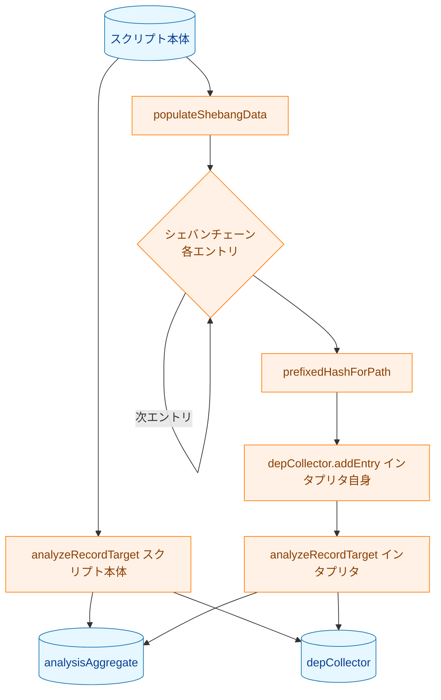
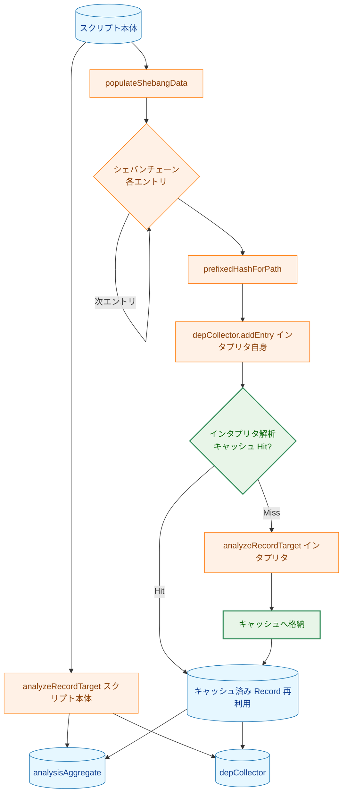
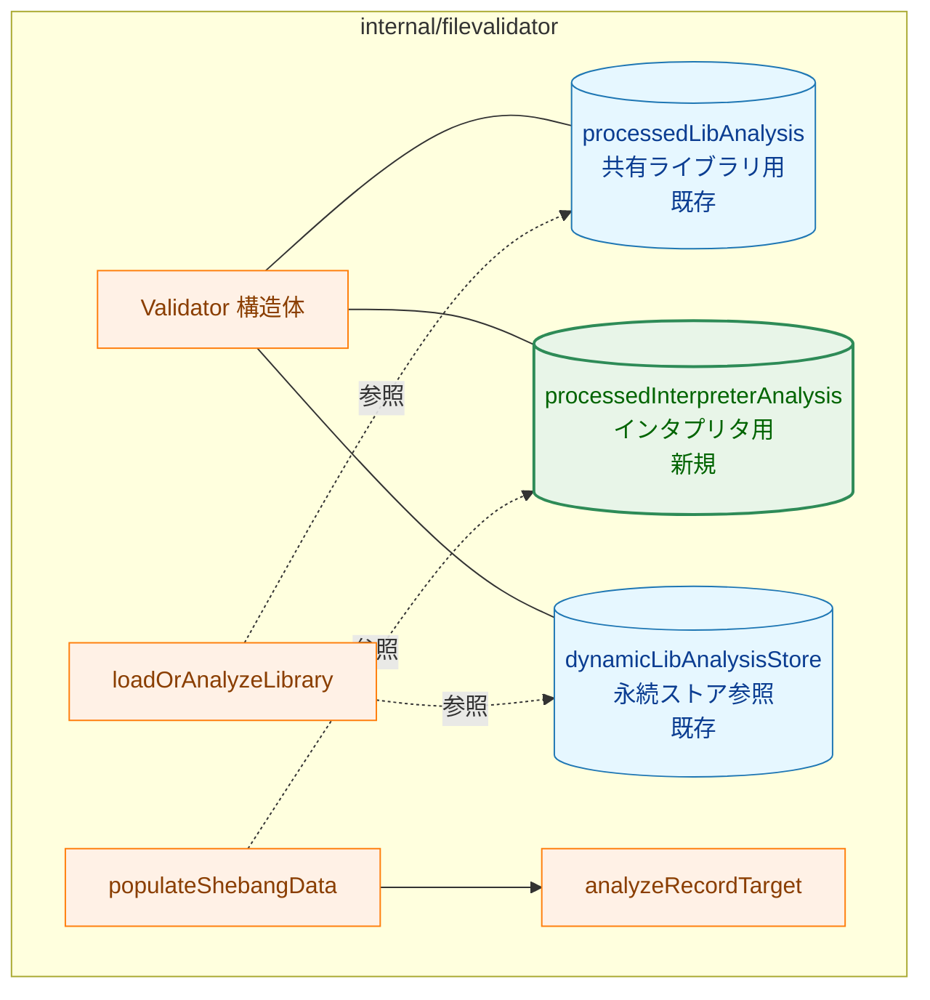
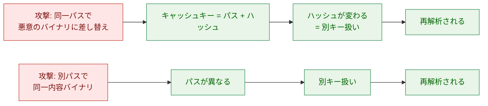
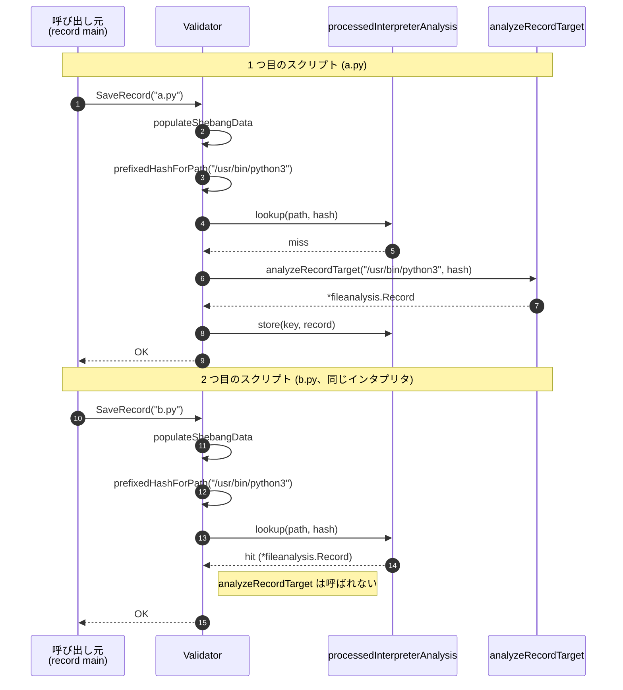
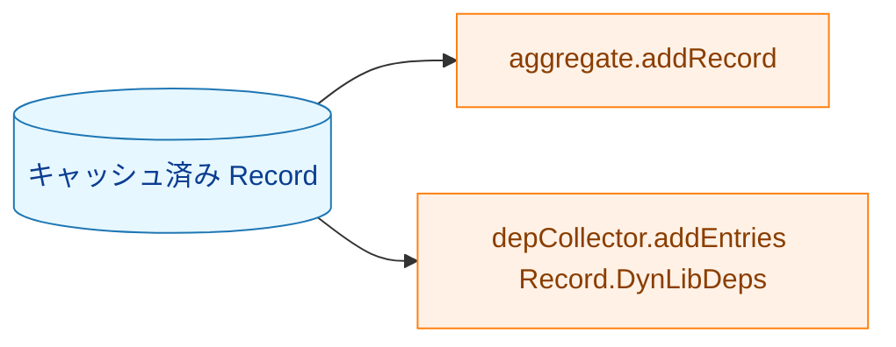

# シェバンインタプリタ解析結果のセッション内キャッシュ アーキテクチャ設計書

## 1. 設計目標

- 単一 `Validator` インスタンス内で、シェバンチェーン上のインタプリタバイナリに対する
  `analyzeRecordTarget` の戻り値を再利用する
- `record` の最終出力（`fileanalysis.Record`）はキャッシュ導入前後で完全に同一にする
- 既存の共有ライブラリキャッシュ（`processedLibAnalysis` / `dynamicLibAnalysisStore`）
  および永続化スキーマには手を入れない
- 設計・実装の表面積を最小に保ち、将来のセッション横断キャッシュ導入時に共存できる構造とする

---

## 2. 設計原則

- **単一責任**: キャッシュは「インタプリタ解析結果の再利用」のみを担い、
  `depCollector` / `analysisAggregate` への登録ロジックには影響を与えない
- **YAGNI**: プロセス内に閉じたインメモリキャッシュのみを実装。永続化や LRU は導入しない
- **DRY**: 既存の `libCacheKey` 構造体（`{Path, Hash}`）を流用し、
  キャッシュキーの定義を再発明しない
- **不変条件の維持**: キャッシュヒット時とミス時で、後続の集約処理に渡されるオブジェクトの
  内容と同一性が等価であることを保証する

---

## 3. 全体フロー

### 3.1 現状フロー（簡略）



### 3.2 変更後フロー



緑強調がキャッシュ機構の追加箇所。`analyzeRecordTarget` 自身および
`aggregate.addRecord` / `depCollector.addEntries` のシグネチャ・呼び出し回数の
意味づけは変更しない。ヒット時にも同じ `*fileanalysis.Record` ポインタを集約に渡す。

---

## 4. コンポーネント設計

### 4.1 配置



### 4.2 `Validator` 構造体への追加

新フィールド（インメモリマップ）を 1 つ追加する。

| フィールド名 | 型 | 役割 |
|---|---|---|
| `processedInterpreterAnalysis` | `map[libCacheKey]*fileanalysis.Record` | シェバンチェーン上のインタプリタバイナリに対する `analyzeRecordTarget` の結果をキー（パス + ハッシュ）で保持 |

`libCacheKey` は既存の `{Path, Hash}` 構造体（[validator.go:573](../../../internal/filevalidator/validator.go) 付近）をそのまま再利用する。

### 4.3 ライフサイクル

- **生成**: `New` / `newValidator` で `Validator` を生成した時点では nil でよい。
  既存の `processedLibAnalysis` と同様、初回参照時に lazy-init する形を踏襲する
- **生存期間**: `Validator` インスタンスの生存期間と一致する
- **破棄**: `Validator` がスコープアウトすれば GC で回収される

### 4.4 影響範囲

| 関数 | 変更内容 |
|---|---|
| `Validator` 構造体 | 新フィールド `processedInterpreterAnalysis` を追加 |
| `populateShebangData` | チェーンエントリの `analyzeRecordTarget` 呼び出しをキャッシュ参照経由に置き換え |
| `analyzeRecordTarget` | 変更なし（キャッシュロジックは呼び出し側に閉じる） |
| `loadOrAnalyzeLibrary` | 変更なし |
| 永続ストア (`dynamicanalysis.Store`) | 変更なし |
| `fileanalysis` スキーマ | 変更なし |

新規ヘルパ関数を 1 つ追加する想定（実装詳細は実装時に確定する）。

```text
loadOrAnalyzeShebangTarget(path, hash string) (*fileanalysis.Record, error)
```

役割:
1. キャッシュ参照
2. ヒット時はキャッシュ済み `*fileanalysis.Record` を返却
3. ミス時は `analyzeRecordTarget` を実行し、成功したら結果をキャッシュに格納

---

## 5. データ設計

### 5.1 キャッシュキーの選択理由

| 候補 | 選択 | 理由 |
|---|:---:|---|
| パスのみ | × | 同一パスでハッシュが異なる別バイナリを誤って再利用してしまう |
| ハッシュのみ | × | 異なるパスで偶然同一内容のバイナリがあった場合、ログ・診断時の混乱要因 |
| パス + ハッシュ（採用） | ◯ | 既存 `libCacheKey` と一致。同一性の判断基準として安全かつ実装も最小 |

### 5.2 値型の選択理由

`*fileanalysis.Record` をそのままキャッシュする。

- `analyzeRecordTarget` の戻り値型と一致するためゼロ変換でキャッシュ可能
- キャッシュヒット時に同じポインタを `aggregate.addRecord` / `depCollector.addEntries` に
  渡すことで、ミス時とまったく同じ後続処理経路を通る
- `Record` は本機能のキャッシュ後に書き換えられない（`populateShebangData` 内では読み取り専用）

---

## 6. エラー処理設計

### 6.1 ハッシュ計算失敗

`prefixedHashForPath` がエラーを返した場合は、現状どおり `populateShebangData` から
そのままエラーを返す。キャッシュへのアクセスは行わない（キーが構築できないため）。

### 6.2 `analyzeRecordTarget` 失敗

ミス時の `analyzeRecordTarget` がエラーを返した場合は、
**キャッシュには格納せず**、エラーをそのまま呼び出し元へ伝播する。

- 失敗結果のキャッシュは fail-closed の安全性を損ねるため避ける
- 同一プロセス内で再試行されることは通常ないが、仮にあっても再解析される

### 6.3 警告の取り扱い

`analyzeRecordTarget` の戻り値に含まれる `AnalysisWarnings` は
`*fileanalysis.Record` の一部としてキャッシュされる。再利用時にも同じ警告群が
`aggregate.addRecord` 経由で集約に取り込まれるため、`record.AnalysisWarnings` の
最終出力に差は生じない。

---

## 7. セキュリティ考慮事項

### 7.1 キャッシュポイズニング耐性



キャッシュキーがパス + ハッシュであるため、内容が変わればキーが変わり再解析される。
かつ同一プロセス内に閉じるため、悪意のあるプロセスが事前にキャッシュを汚染することは
原理的に不可能。

### 7.2 ディスクへの書き出しなし

本キャッシュはインメモリに閉じるため、ストレージ上に痕跡を残さない。
権限の弱いユーザがファイルを介してキャッシュ内容を改変するリスクはない。

### 7.3 既存のセキュリティ機構の維持

- `checkNotShebang`（再帰シェバン検出）: キャッシュ参照前の `prefixedHashForPath` よりも
  さらに前の `resolveShebangInfo` で実行されており、キャッシュ導入前後で順序は変わらない
- 後段の verify 時のハッシュ照合: キャッシュは記録時のみで、verify 時の動作に影響しない

---

## 8. 処理フロー詳細

### 8.1 シーケンス: 同一インタプリタを共有する 2 スクリプト処理



### 8.2 ヒット時の後続処理の等価性

ヒット時は以下の順序で従来と同じ後続処理を行う。



つまりキャッシュは「`analyzeRecordTarget` の実行をスキップする」だけであり、
`aggregate` / `depCollector` への寄与は完全に同一に保たれる。

---

## 9. テスト戦略

### 9.1 ユニットテスト

| テスト観点 | 対応 AC | 概要 |
|---|---|---|
| キャッシュヒット時に解析がスキップされる | AC-1 | 同一インタプリタを参照する 2 スクリプトを順に処理し、`analyzeRecordTarget` 経路の呼び出し回数を観測する |
| 結果同一性 | AC-2 | キャッシュ導入前後で `fileanalysis.Record` の内容が同一であることを検証 |
| ハッシュ不一致時の独立解析 | AC-3 | 同一パスで異なるハッシュの場合、両方が独立に解析されることを検証 |
| env 形式シェバン | AC-4 | `#!/usr/bin/env python3` のチェーン両要素がキャッシュ対象として動作することを検証 |
| 集約への寄与の維持 | AC-5 | キャッシュヒット時にも `depCollector` への登録と `analysisAggregate` への寄与が行われることを検証 |
| ライブラリキャッシュとの独立性 | AC-7 | 共有ライブラリ用キャッシュの動作が変わらないことを既存テストで担保 |

### 9.2 観測手段

`analyzeRecordTarget` の重複実行抑制は、プロダクションコードに分岐を入れずに
観測する。要件 FR-3.4.1 に従い、プロダクションコード側へ build tag やテスト専用
カウンタは導入しない。テストでは以下の組み合わせで観測する。

- Analyzer 注入機構（`SetELFDynLibAnalyzer` / `SetBinaryAnalyzer` /
  `SetSyscallAnalyzer` 等）を利用して、パス別の呼び出し回数を記録するスパイ実装を
  差し込み、同一インタプリタへの呼び出しが 1 回に抑えられたことを検証する
- AC-3 の同一パス・異ハッシュ検証では、`filevalidator` パッケージ内テストから
  `Validator.processedInterpreterAnalysis` のキー集合を直接観測する。必要なテスト用
  インタプリタ生成ヘルパは同パッケージ側にローカル実装し、
  `internal/runner/e2e_shebang_test.go` の非公開ヘルパには依存しない

再利用対象は `internal/filevalidator/validator_library_analysis_test.go` の
`validatorWithTempHashDir`、`libraryTestBinaryAnalyzer` 相当のパターン、および
`internal/filevalidator/validator_shebang_test.go` の shebang fixture 作成方法とする。

### 9.3 統合テスト

`internal/runner/e2e_shebang_test.go` の既存テストが、本変更後も合格することで
シェバン処理全体の互換性を担保する。

---

## 10. 実装の優先順位

| フェーズ | 内容 |
|---|---|
| Phase 1 | `Validator` 構造体への `processedInterpreterAnalysis` フィールド追加と lazy-init |
| Phase 2 | `loadOrAnalyzeShebangTarget` ヘルパの実装と `populateShebangData` からの呼び出し置き換え |
| Phase 3 | テスト追加（AC-1, AC-2, AC-3, AC-4, AC-5） |
| Phase 4 | 既存テストの回帰確認 / `make fmt` / `make test` / `make lint` |

詳細は `04_implementation_plan.md` で確定する。

---

## 11. 将来の拡張性

### 11.1 セッション横断永続キャッシュへの発展余地

将来的にプロセス間でインタプリタ解析結果を共有したくなった場合、
新たな永続ストア（例: `internal/recordtargetcache`）を追加し、
`loadOrAnalyzeShebangTarget` の内部で「メモリキャッシュ → 永続ストア → 解析」の
三段構成へ拡張すれば、本タスクの設計を活かしたまま機能追加が可能。

ただし、永続化には次の論点が伴うため、別タスクとして要件を立てる前提とする。

- インタプリタが推移的に依存する `.so` の更新検出（インタプリタ自身のハッシュは不変だが
  依存 lib のハッシュが変わるケース）
- スキーマバージョニング
- ディスク使用量の管理

### 11.2 ライブラリキャッシュとの統合

長期的に「インタプリタもライブラリも `*fileanalysis.Record` 相当を返す統一キャッシュへ
統合する」設計余地はあるが、現状の `dynamicanalysis.Result` はスキーマが異なるため、
本タスクでは統合を行わず別タスクで検討する。
