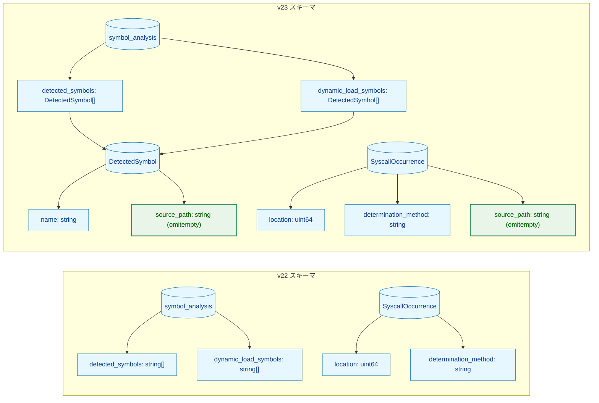
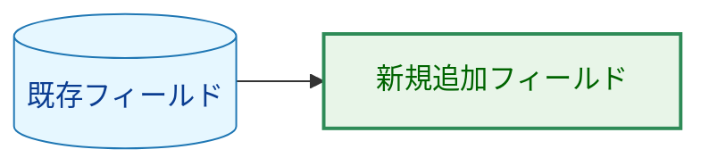
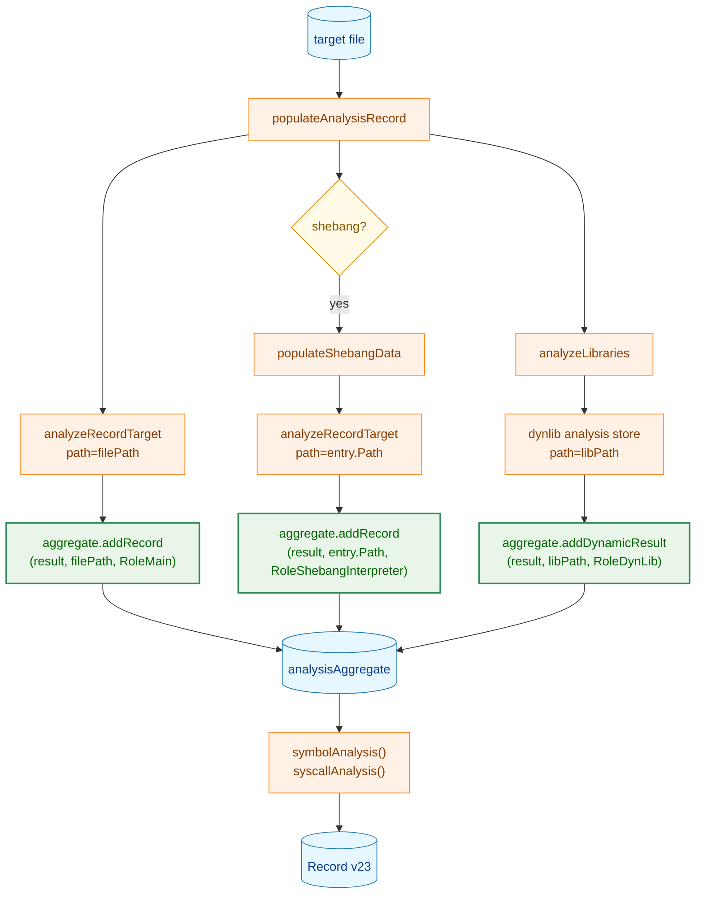
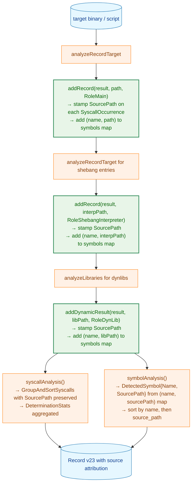

# アーキテクチャ設計書: デバッグ情報へのシンボル・syscall 呼び出し元帰属

## 1. 設計方針

### 1.1 目的

`--debug-info` 指定時に各シンボル・syscall occurrence が「どのバイナリに由来するか」を特定できるよう、集約パイプラインへの source path 伝達と JSON スキーマ拡張を行う。

### 1.2 原則

1. **In-place attribution**: 集約済みフィールドの各エントリに `source_path` を直接付与する。デバッグ専用の並列構造（`per_source_analysis`）は持ち込まない
2. **Debug-only attribution overhead**: `source_path` は `omitempty` により `--debug-info` 非指定時の JSON には出力されない。一方で、`detected_symbols` / `dynamic_load_symbols` は `string[]` から `DetectedSymbol[]` へ変更されるため、非 debug 時にも構造変更由来のサイズ増分は生じうる
3. **Policy-transparent**: ネットワークリスク判定（`network_analyzer`）の動作はシンボル名の有無で行うため、型変更（`string` → `DetectedSymbol`）後も判定結果は変わらない
4. **Deduplication split**: `--debug-info` 時は `(name, source_path)` 単位で重複除去（同一シンボルでも異なるバイナリから来た場合は別エントリ）、非 debug 時は `name` 単位で重複除去（従来動作を維持）

## 2. データモデル

### 2.1 スキーマ変更概要（v22 → v23）



**凡例**



### 2.2 JSON 出力例

`/usr/bin/zmore`（shebang `#!/bin/sh` → `/usr/bin/dash`）を `--debug-info` 付きで記録した場合：

```json
{
  "schema_version": 23,
  "file_path": "/usr/bin/zmore",
  "symbol_analysis": {
    "detected_symbols": [
      { "name": "socket", "source_path": "/usr/bin/dash" }
    ]
  },
  "syscall_analysis": {
    "architecture": "x86_64",
    "detected_syscalls": [
      {
        "number": 41,
        "name": "socket",
        "occurrences": [
          {
            "source_path": "/usr/bin/dash",
            "location": 0,
            "determination_method": "lib_cache_match",
            "source": "libc_symbol_import"
          }
        ]
      }
    ]
  }
}
```

同一シンボルが複数バイナリに由来する場合（`--debug-info`）：

```json
"detected_symbols": [
  { "name": "socket", "source_path": "/usr/bin/dash" },
  { "name": "socket", "source_path": "/usr/lib/x86_64-linux-gnu/libcurl.so.4" }
]
```

`--debug-info` なし（`source_path` は `omitempty` で省略、`name` 単位で重複除去）：

```json
"detected_symbols": [
  { "name": "socket" }
]
```

## 3. コンポーネント設計

### 3.1 変更対象一覧

| ファイル | 変更内容 |
|---|---|
| `internal/common/syscall_types.go` | `SyscallOccurrence` に `SourcePath string` を追加 |
| `internal/fileanalysis/schema.go` | `DetectedSymbol` 新設、`SymbolAnalysisData` フィールド型変更、`CurrentSchemaVersion = 23` |
| `internal/filevalidator/validator.go` | `analysisAggregate` の内部キー型変更、`addRecord` シグネチャ変更 |
| `internal/runner/base/security/network_analyzer.go` | `DetectedSymbol.Name` を参照するよう更新 |
| 各テストファイル | `SymbolAnalysisData` 構築箇所を `[]DetectedSymbol` に更新 |

### 3.2 `analysisAggregate` の変更

`--debug-info` の有無によって重複除去の粒度が異なるため、aggregate 生成時にフラグを受け取る。

```
現行:
  symbols  map[string]struct{}        // name 単位で重複除去
  dynLoads map[string]struct{}

変更後:
  includeDebugInfo bool
  symbols          map[detectedSymbolKey]struct{}  // debug 時: (name, sourcePath) 単位
  dynLoads         map[detectedSymbolKey]struct{}  // 非 debug 時: sourcePath="" で name 単位と等価

type detectedSymbolKey struct {
    name       string
    sourcePath string
}
```

`SourceRole` は `internal/filevalidator/validator.go` 内の非公開型として定義する。

```go
type sourceRole string

const (
    roleMain               sourceRole = "main"
    roleShebangInterpreter sourceRole = "shebang_interpreter"
    roleDynLib             sourceRole = "dynlib"
)
```

`addRecord` および `addDynamicResult` のシグネチャ変更（同一パターン）：

```
現行: addRecord(record *fileanalysis.Record)
変更後: addRecord(record *fileanalysis.Record, sourcePath string, role sourceRole)

現行: addDynamicResult(result *dynamicanalysis.Result)
変更後: addDynamicResult(result *dynamicanalysis.Result, sourcePath string, role sourceRole)
```

`addRecord` 内で、`record.SyscallAnalysis.DetectedSyscalls` の各 `SyscallOccurrence.SourcePath` が未設定の場合に `sourcePath` をセットする。`addDynamicResult` も同様に `result.SyscallAnalysis` の occurrences に `sourcePath` をセットする。

### 3.3 集約パイプラインへの source path 伝達



### 3.4 `source_path` のセマンティクス

| 検出経路 | `source_path` の値 |
|---|---|
| 直接 syscall 命令（ELF SYSCALL 命令） | その命令を含むバイナリのパス |
| libc インポート経由（`location=0`） | そのシンボルをインポートしているバイナリのパス |
| dynlib 内の syscall | その dynlib のパス |
| shebang インタープリター由来 | インタープリターのパス（symlink 解決済み） |

## 4. 処理フロー

### 4.1 record 側（`--debug-info` 指定時）



### 4.2 `--debug-info` なしのパス

`SyscallOccurrence.SourcePath` の stamp は `includeDebugInfo=true` の場合のみ行う。`includeDebugInfo=false` 時は occurrences そのものが `stripOccurrences()` により除去されるため、`SourcePath` は JSON に出力されない。

`DetectedSymbol.SourcePath` は `includeDebugInfo=false` 時に aggregate 内で `sourcePath=""` を dedup キーとして使うため、出力される `DetectedSymbol` の `source_path` フィールドは常に空文字列となり `omitempty` により省略される。

### 4.3 `network_analyzer` への影響

`network_analyzer.analyzeRecordSignals` が呼び出す `buildAnalysisOutputFromSymbolData` 内に変更が必要な箇所が 2 つある。

1. `convertNetworkSymbolEntries(data.DetectedSymbols)` — 引数型が `[]string` → `[]DetectedSymbol` に変わるため、関数シグネチャと実装を更新する
2. `slices.ContainsFunc(data.DetectedSymbols, binaryanalyzer.IsNetworkSymbolName)` — 要素型が `DetectedSymbol` になるため、述語を `func(s fileanalysis.DetectedSymbol) bool { return binaryanalyzer.IsNetworkSymbolName(s.Name) }` に変更する

どちらも名前ベースの判定ロジック自体は変更しない。

## 5. スキーマ互換性

| バージョン | 動作 |
|---|---|
| v23（本タスク） | 正常ロード |
| v22 以下 | `SchemaVersionMismatchError` を返す |
| v22 以下（`record` 再実行時） | `--force` なしで v23 に上書き再生成 |

`SymbolAnalysisData.DetectedSymbols/DynamicLoadSymbols` の型変更（`[]string` → `[]DetectedSymbol`）は JSON デシリアライズ時に非互換となるが、`SchemaVersionMismatchError` によって v22 以下のレコードは読み込み拒否されるため、実運用上の互換性問題は発生しない。

## 6. 文書整合ルール

1. AC番号は [./01_requirements.md](./01_requirements.md) に一致させる
2. テスト対応表は [./01_requirements.md](./01_requirements.md) と [./04_implementation_plan.md](./04_implementation_plan.md) で同一の変更対象を指す
