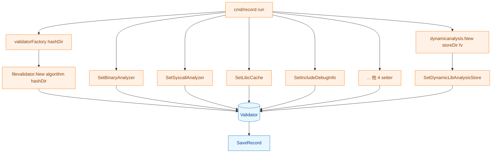
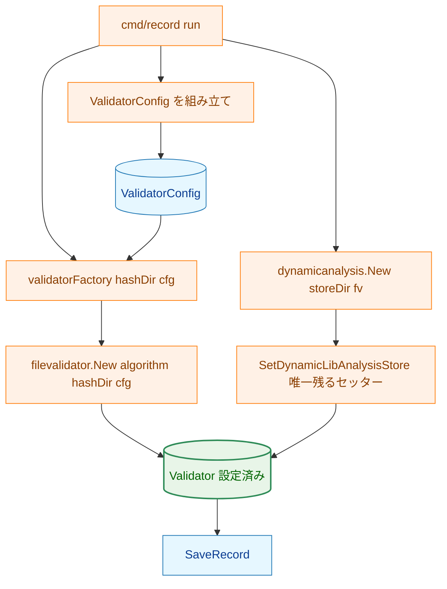
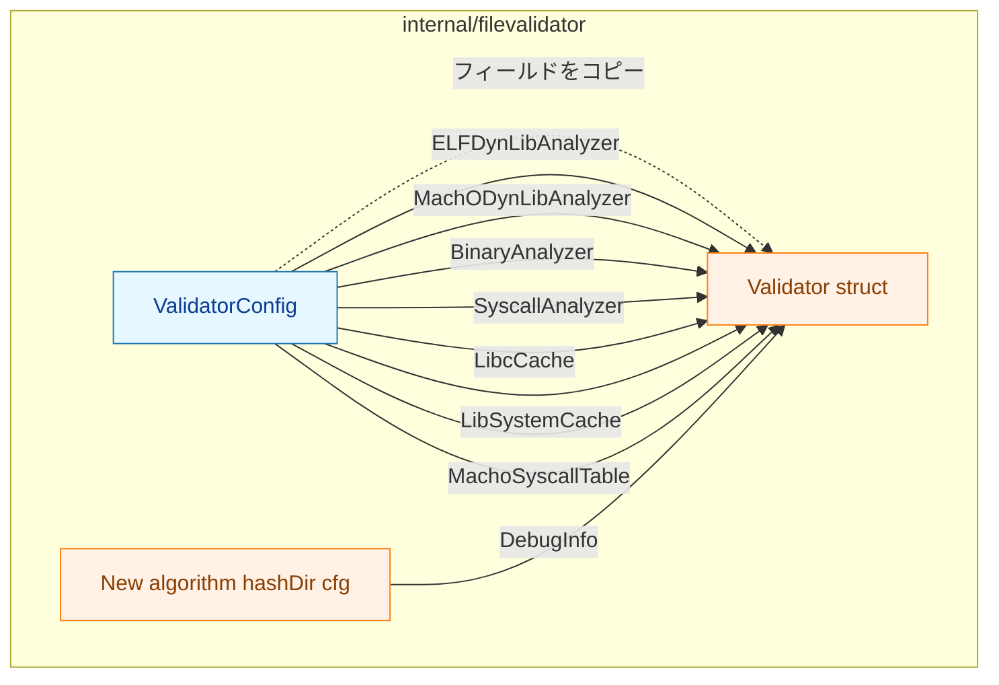
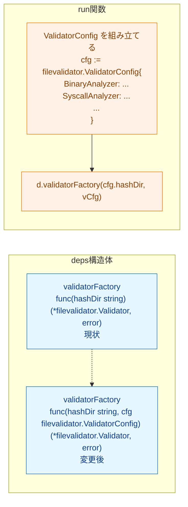
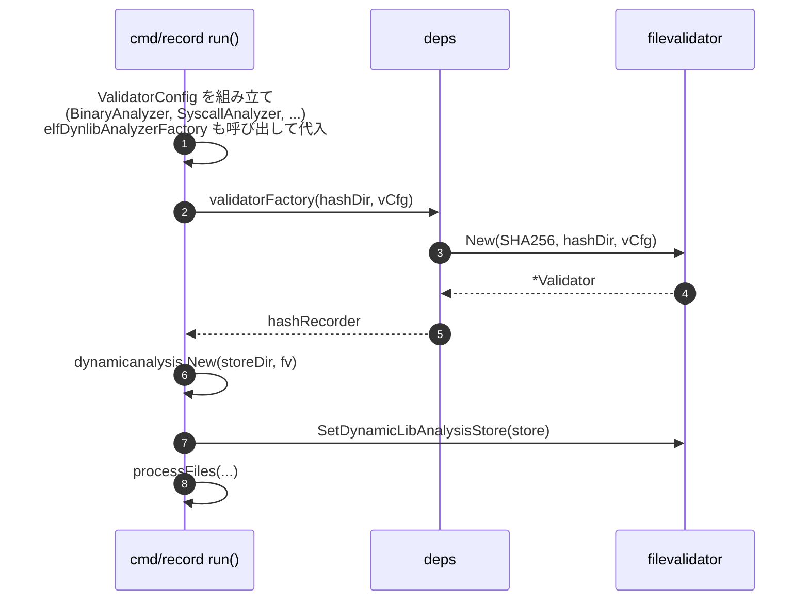

# Validator 設定構造体への移行 アーキテクチャ設計書

## 1. 設計目標

- `Validator` の設定フェーズ（`New` 呼び出し）と実行フェーズ（`SaveRecord` 等）を
  型レベルで分離し、セッターによる設定変更をコンパイル時に防ぐ
- `dynamicLibAnalysisStore` については循環依存の都合で例外とし、引き続きセッターを維持する
- `ValidatorConfig{}` ゼロ値 = 「すべての解析を無効」として既存テストの移行コストを最小化する
- `cmd/record/main.go` の factory 型を更新して `ValidatorConfig` を受け渡しできる形にする

---

## 2. 設計原則

- **YAGNI**: `ValidatorConfig` には今タスクで削除するセッターのフィールドのみを追加する
- **DRY**: `elfDynlibAnalyzerFactory` / `machoDynlibAnalyzerFactory` は
  `deps` に残り、factory 呼び出し後に `ValidatorConfig` フィールドへ組み込む
- **ゼロ値有効**: `ValidatorConfig{}` が有効な「最小構成」として機能すること

---

## 3. 全体フロー

### 3.1 現状フロー



### 3.2 変更後フロー



`Set*` の呼び出しが `SetDynamicLibAnalysisStore` のみになり、
設定フェーズが `ValidatorConfig` の組み立てに集約される。

---

## 4. コンポーネント設計

### 4.1 `ValidatorConfig` 型



**`ValidatorConfig` の定義骨格**（型名・フィールド名のみ; 実装詳細は実装時に確定）:

```go
type ValidatorConfig struct {
    ELFDynLibAnalyzer   *elfdynlib.DynLibAnalyzer
    MachODynLibAnalyzer *machodylib.MachODynLibAnalyzer
    BinaryAnalyzer      binaryanalyzer.BinaryAnalyzer
    SyscallAnalyzer     SyscallAnalyzerInterface
    LibcCache           LibcCacheInterface
    LibSystemCache      LibSystemCacheInterface
    MachoSyscallTable   SyscallNumberTable
    DebugInfo           bool
}
```

### 4.2 `New` シグネチャ

```go
func New(algorithm HashAlgorithm, hashDir string, cfg ValidatorConfig) (*Validator, error)
```

`newValidator`（内部関数）も同様に `cfg ValidatorConfig` を受け取り、
各フィールドを `Validator` 構造体に展開する。

### 4.3 `cmd/record/main.go` の factory 型変更



`deps.elfDynlibAnalyzerFactory` / `deps.machoDynlibAnalyzerFactory` は
そのまま残し、`run()` 内で `ValidatorConfig.ELFDynLibAnalyzer` /
`ValidatorConfig.MachODynLibAnalyzer` に代入してから factory に渡す。

factory の返り値は具象型 `*filevalidator.Validator` のまま維持する。
`SetDynamicLibAnalysisStore` は引き続きセッターで注入する必要があり、
呼び出し側 (`run()`) は `*Validator` を直接保持するのが自然なため。

---

## 5. 影響範囲

### 5.1 `internal/filevalidator/`

| 変更種別 | 対象 |
|---|---|
| 新規定義 | `ValidatorConfig` 型 |
| シグネチャ変更 | `New`, `newValidator` |
| 削除 | `SetBinaryAnalyzer`, `SetSyscallAnalyzer`, `SetLibcCache`, `SetLibSystemCache`, `SetMachoSyscallTable`, `SetELFDynLibAnalyzer`, `SetMachODynLibAnalyzer`, `SetIncludeDebugInfo` |
| 変更なし | `SetDynamicLibAnalysisStore`, `Validator` フィールド名 |

### 5.2 `cmd/record/main.go`

| 変更種別 | 対象 |
|---|---|
| 型変更 | `validatorFactory` の関数型 |
| 追加 | `ValidatorConfig` を組み立てるコード |
| 削除 | `Set*` 呼び出し（`SetDynamicLibAnalysisStore` を除く） |

### 5.3 テスト・呼び出し箇所の見込み

| 変更パターン | 件数の見込み |
|---|---|
| `New(&SHA256{}, hashDir)` → `New(&SHA256{}, hashDir, ValidatorConfig{})` | 約 75 箇所（production 4 + テスト 71）の大半が `, ValidatorConfig{}` 追加のみ |
| `v.SetBinaryAnalyzer(spy)` 等を `ValidatorConfig{BinaryAnalyzer: spy}` に変更 | 約 73 箇所（production 8（`cmd/record/main.go`） + テスト 65）に加え、`internal/filevalidator/validator.go` のセッター宣言 8 個を削除 |
| `testRunDeps()` の factory 型更新 | `cmd/record/main_test.go` 等 数箇所 |

> **補足**: 件数は本タスク開始時点でのコードベース調査によるおおよその見積もり。
> 実装時に新規テストが追加・削除されても誤差の範囲。

---

## 6. エラー処理設計

`ValidatorConfig` 自体のバリデーションは行わない。

- ゼロ値フィールド = 該当解析が無効（現状のセッターを nil で呼ぶことと等価）
- 将来的に「アナライザの組み合わせが不正」な場合を検出したければ
  `New` 内でチェック関数を追加できるが、本タスクでは行わない

---

## 7. セキュリティ考慮事項

`ValidatorConfig` の各フィールドはすべてインタフェース/ポインタであり、
セッター廃止後は `New` 呼び出し以降に外部から書き換えられない。

`processedInterpreterAnalysis` / `processedLibAnalysis` の一貫性問題（タスク 0130 で文書化）は、
`includeDebugInfo` / `binaryAnalyzer` / `syscallAnalyzer` の全フィールドが
構成時に固定されることで解消される。

`dynamicLibAnalysisStore` は例外だが、セッターの契約コメント（タスク 0130 で追記）で
「`SaveRecord` 前に呼ぶこと」が文書化されており、実運用上の呼び出し順は保証されている。

---

## 8. 処理フロー詳細

### 8.1 `cmd/record/run()` での `ValidatorConfig` 組み立て順



`elfDynlibAnalyzerFactory` の呼び出しが `run()` 内に移動する。
現在は `run()` が type assertion で `*Validator` を取り出してセッターを呼んでいるが、
変更後は factory に `ValidatorConfig` を渡す形になる。

---

## 9. テスト戦略

### 9.1 既存テストの移行方針

移行は機械的なため、新規テストは追加しない。AC-1（ゼロ値等価性）だけは、
`ValidatorConfig{}` を渡した場合に既存テストが同じ結果を返すことで自動的に保証される。

### 9.2 削除された setter に対する回帰テスト

削除されたセッターはコンパイルエラーを引き起こすため、AC-2 はビルド成功により担保される。

### 9.3 重点確認

- `cmd/record/main.go` の統合テスト（`TestRunWithSyscallAnalysis` 等）が
  `ValidatorConfig` 経由でも同じ解析結果を返すことを確認
- `internal/libccache/integration_test.go` など、外部テストがセッターを呼んでいた箇所を
  `ValidatorConfig` フィールドに置き換えた後も pass することを確認

---

## 10. 実装の優先順位

| フェーズ | 内容 |
|---|---|
| Phase 1 | `ValidatorConfig` 型定義、`New` / `newValidator` シグネチャ変更 |
| Phase 2 | `internal/filevalidator` パッケージ内テストの移行 |
| Phase 3 | `cmd/record/main.go` の factory 型変更・`ValidatorConfig` 組み立て |
| Phase 4 | 外部テスト（`libccache`, `runner`, `verification` 等）の移行 |
| Phase 5 | `make fmt` / `make test` / `make lint` |

---

## 11. 将来の拡張性

### 11.1 `dynamicLibAnalysisStore` の循環依存解消

将来的に `Validator` が `dynamicanalysis.Analyzer` インタフェースを実装するのではなく、
外部から別の `Analyzer` を渡せる設計に変えることができれば、
`dynamicLibAnalysisStore` も `ValidatorConfig` に含められる。
ただし、それには `Validator.AnalyzeLibrary` の呼び出し設計変更を伴うため別タスクとする。

### 11.2 `newValidator` の非公開維持

`newValidator` は引き続き非公開とし、テスト用の迂回路は作らない。
テストは `New(&SHA256{}, hashDir, cfg)` のみを経由する。
