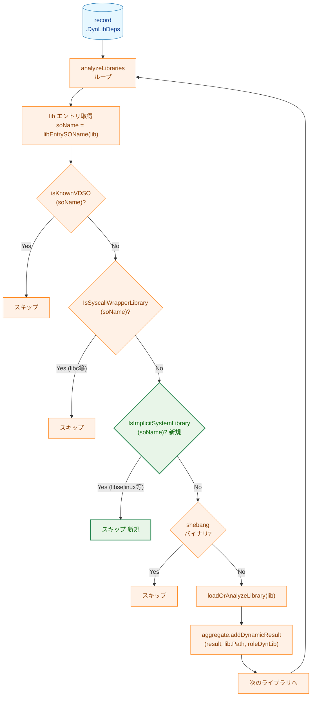
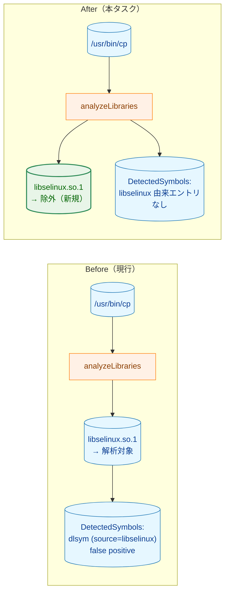
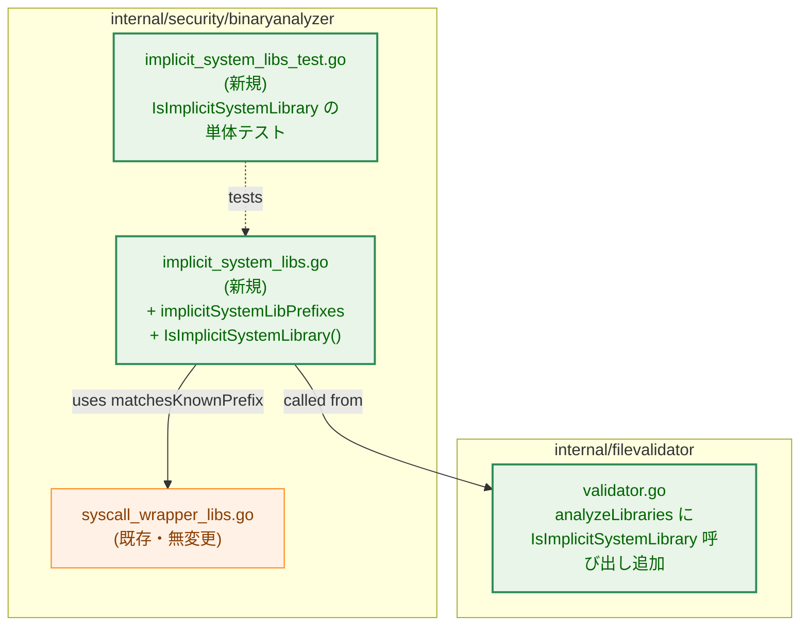

# 暗黙的システムライブラリの再帰的解析除外 アーキテクチャ設計書

## 1. 設計目標

- task 0123 で導入された `analyzeLibraries` の除外判定に「暗黙的システムライブラリ」
  カテゴリを追加し、libselinux 由来の false positive を解消する
- 既存の `IsSyscallWrapperLibrary` と意味的に明確に分離する（両者は除外する理由が
  異なるため、別関数として独立させる）
- 既存のファイル完全性検証（`DynLibDeps` のハッシュ記録・検証）は変更しない
- ネットワーク API 検出経路（実行ファイル本体の `.dynsym` / 機械語 / dlopen /
  mprotect 解析）には一切影響を与えない

---

## 2. 設計判断のサマリ

| 判断項目 | 採用案 | 理由 |
|---|---|---|
| 除外リストの API 形態 | `IsImplicitSystemLibrary` を新規追加（既存 `IsSyscallWrapperLibrary` と並列） | 「syscall ラッパー」と「暗黙的システムライブラリ」は除外理由が異なる。意味論を混ぜず、各リストの選定基準を独立して維持できる |
| 除外リストの配置ファイル | `internal/security/binaryanalyzer/implicit_system_libs.go`（新規） | 既存 `syscall_wrapper_libs.go` と同パッケージ。`matchesKnownPrefix` を共有 |
| 初期エントリ | `libselinux` 1 件 | 要件 FR-1.1。他候補（libacl, libattr 等）は将来追加 |
| Validator の統合点 | `analyzeLibraries` のループ内で `IsSyscallWrapperLibrary` の直後に `IsImplicitSystemLibrary` をチェック | 既存の早期 continue パターンに従う |
| 既存レコードとの互換性 | スキーマバージョン非変更 | データ構造は不変。意味的な変化（libselinux シンボルの欠落）は false positive 削減方向のみで、後方互換性は壊れない |
| `DynLibDeps` への影響 | 変更なし | ハッシュ検証は維持。除外はあくまで「再帰的解析パイプライン」のみに適用 |

---

## 3. 全体フロー

### 3.1 record の analyzeLibraries 内除外判定（変更後）



**凡例（Legend）**


### 3.2 false positive 解消の効果（before / after）



---

## 4. コンポーネント変更一覧



---

## 5. 新規コンポーネント: `implicit_system_libs.go`

### 5.1 配置パッケージ

`internal/security/binaryanalyzer/implicit_system_libs.go`（新規）

既存 `syscall_wrapper_libs.go` と同パッケージに置き、ヘルパー関数 `matchesKnownPrefix`
を共有する（package private 関数として既に存在する）。

### 5.2 リスト構造

```go
// implicitSystemLibPrefixes lists SOName prefixes for libraries that many
// executables transitively link against without intentionally using them.
// These libraries are excluded from library-level recursive analysis
// (Validator.analyzeLibraries) to reduce false positives in DetectedSymbols
// and SyscallAnalysis.
//
// Selection criteria (all must hold):
//   1. Widely linked implicitly by common executables (e.g., GNU coreutils)
//      even when not used directly.
//   2. The library itself does not use BSD socket / DNS resolution APIs,
//      or uses only non-network kernel interfaces (e.g., /sys, netlink for
//      kernel facility communication).
//   3. False positives have been observed where symbols/syscalls imported
//      by these libraries do not match the linking executable's actual
//      behavior.
//
// Libraries NOT in this list (kept under recursive analysis):
//   - Intermediate application libraries (libssl, libcurl, libxml2, etc.)
//   - Language runtimes (libpython, libruby, etc.)
//   - libpam (network NSS / LDAP may be reached transitively)
var implicitSystemLibPrefixes = []string{
    "libselinux", // SELinux userspace library; transitively linked by many
                  // binaries but its imported dlsym/execve/open symbols do
                  // not reflect the linking executable's behavior.
}
```

### 5.3 公開 API

```go
// IsImplicitSystemLibrary reports whether soname is a known implicit system
// library that should be excluded from library-level recursive analysis.
//
// Implicit system libraries are libraries that are widely linked but rarely
// used directly (e.g., libselinux). They are excluded for false-positive
// reduction. See implicitSystemLibPrefixes for the list and selection
// criteria.
func IsImplicitSystemLibrary(soname string) bool {
    for _, prefix := range implicitSystemLibPrefixes {
        if matchesKnownPrefix(soname, prefix) {
            return true
        }
    }
    return false
}
```

`matchesKnownPrefix` は既存の `syscall_wrapper_libs.go` で定義済みの package-private
関数を再利用する（SOName の version separator チェックを共通化）。

---

## 6. `Validator.analyzeLibraries` への変更

### 6.1 修正前（現行）

```go
for _, lib := range record.DynLibDeps {
    soName := libEntrySOName(lib)
    if isKnownVDSO(soName) {
        continue
    }
    if binaryanalyzer.IsSyscallWrapperLibrary(soName) {
        continue
    }
    if _, ok := shebangPaths[lib.Path]; ok {
        continue
    }

    result, err := v.loadOrAnalyzeLibrary(lib)
    if err != nil {
        return err
    }
    aggregate.addDynamicResult(result, lib.Path, roleDynLib)
}
```

### 6.2 修正後

```go
for _, lib := range record.DynLibDeps {
    soName := libEntrySOName(lib)
    if isKnownVDSO(soName) {
        continue
    }
    if binaryanalyzer.IsSyscallWrapperLibrary(soName) {
        continue
    }
    if binaryanalyzer.IsImplicitSystemLibrary(soName) {  // <-- 追加
        continue
    }
    if _, ok := shebangPaths[lib.Path]; ok {
        continue
    }

    result, err := v.loadOrAnalyzeLibrary(lib)
    if err != nil {
        return err
    }
    aggregate.addDynamicResult(result, lib.Path, roleDynLib)
}
```

判定順序は「最も限定的かつ最も多いケースを先に」が原則だが、本リスト（libselinux 1 件）は
件数が小さく順序の影響は無視できる。可読性のため `IsSyscallWrapperLibrary` の直後に
配置する。

---

## 7. データ構造・スキーマへの影響

### 7.1 スキーマバージョン: **変更しない**

判断理由:

- `Record`, `DetectedSymbol`, `SyscallOccurrence` 等のフィールド構造は不変
- 変化するのは「`DetectedSymbols` / `SyscallAnalysis` に libselinux 由来のエントリが
  含まれなくなる」というセマンティクスのみ
- 互換性方向:
  - 新 `runner` が旧レコード（libselinux 由来エントリを含む）を読む場合:
    `dynamic_load` カテゴリの dlsym が記録されているため、保守側に倒れた判定となる
    （= 動的ロードあり扱い）。安全側の挙動であり実害なし
  - 旧 `runner` が新レコード（libselinux 由来エントリなし）を読む場合: 単にエントリが
    減るだけで、判定は正常に動作する
- false positive の解消は次回 `record` 実行時から自動的に得られる

### 7.2 `DynLibDeps` のハッシュ記録は維持

libselinux は依然として `DynLibDeps` に登録され、`verify` 時にファイルハッシュが
検証される。本タスクは「再帰的解析パイプライン」のみへの介入であり、ファイル
整合性検証経路には影響しない。

---

## 8. ネットワーク API 検出経路への影響評価

要件 FR-2 で挙げた検出経路ごとに、本変更による影響を評価する。

| 検出経路 | 検出方法 | 本変更の影響 |
|---|---|---|
| libc wrapper 経由のネットワーク syscall | 実行ファイル本体の `.dynsym` UNDEF 解析 | 影響なし（実行ファイル本体は解析対象） |
| 機械語 `syscall`/`svc` 命令 | 実行ファイル本体・除外対象外ライブラリの機械語スキャン | 影響なし（libselinux は機械語スキャン対象外になるが、libselinux 内の syscall 命令は libc 経由の通常呼び出しのため、これらは false positive 抑制の対象でもある） |
| `dlopen` / `dlsym` 検出 | 実行ファイル本体の `.dynsym` UNDEF を `CategoryDynamicLoad` で分類 | 影響なし（実行ファイル本体は解析対象） |
| `mprotect` + `PROT_EXEC` / `pkey_mprotect` | 実行ファイル本体・除外対象外ライブラリの機械語解析 | 影響なし（実行ファイル本体は解析対象） |

ポイント: 本変更は「libselinux **自身**の内部実装の解析」をスキップするだけであり、
実行ファイルや他のライブラリの解析には影響しない。

---

## 9. テスト戦略

### 9.1 単体テスト（新規 `implicit_system_libs_test.go`）

`syscall_wrapper_libs_test.go` と同形式で、`IsImplicitSystemLibrary` の挙動を検証する。

| テストケース | 入力 | 期待値 |
|---|---|---|
| match | `libselinux.so.1` | `true` |
| match (version 2) | `libselinux.so.2` | `true` |
| match (exact) | `libselinux` | `true` |
| no match (unrelated) | `libssl.so.3`, `libcurl.so.4`, `libc.so.6` | `false` |
| no match (prefix boundary) | `libselinuxabc.so.1`, `libselinuxutil.so.1` | `false` |

### 9.2 統合テスト（`validator.go` 周辺）

- libselinux に依存する実行ファイル相当のテストフィクスチャ（既存テストヘルパで
  ELF を合成可能であればそれを使用）に対して `analyzeLibraries` を実行し、
  以下を検証:
  - `record.SymbolAnalysis.DetectedSymbols` に `source_path` が libselinux のエントリが
    含まれないこと（AC-1）
  - `record.SyscallAnalysis.DetectedSyscalls` の `occurrences[].source_path` に
    libselinux のパスが含まれないこと（AC-2）
  - 同じ実行ファイルの `DynLibDeps` には libselinux のエントリが残ること（AC-7）

### 9.3 既存テストの非破壊

- `IsSyscallWrapperLibrary` のテストは無変更
- 既存の `analyzeLibraries` 統合テスト（libselinux 以外のライブラリを対象とする
  もの）は無変更

### 9.4 受け入れ基準とのマッピング

| AC | テスト |
|----|--------|
| AC-1 | 統合テスト: cp 相当のテストバイナリで libselinux 由来 `DetectedSymbols` なし |
| AC-2 | 統合テスト: `SyscallAnalysis.occurrences[].source_path` に libselinux なし |
| AC-3 | 既存の libc ネットワークシンボル検出テスト（無変更で通過） |
| AC-4 | 既存の機械語 syscall 検出テスト（無変更で通過） |
| AC-5 | 既存の `DynamicLoadSymbols` 検出テスト（無変更で通過） |
| AC-6 | 既存の mprotect/PROT_EXEC 検出テスト（無変更で通過） |
| AC-7 | 統合テスト: libselinux が `DynLibDeps` に残ることを確認 |
| AC-8 | 単体テスト: `libselinuxabc.so.1` で `false` を返す |
| AC-9 | `make test` / `make lint` 通過 |

---

## 10. 関連タスクとの整合

| タスク | 整合性確認内容 |
|---|---|
| 0123 dynlib 再帰的 syscall 解析 | 本タスクが `analyzeLibraries` の除外チェック層を 1 段増やすが、解析エンジン本体・キャッシュ機構には影響しない |
| 0124 dynlib library analysis cache | 除外対象は cache lookup よりも前に弾かれるため、cache へのエントリ追加が抑制される（cache size 減少方向） |
| 0125 mprotect+PROT_EXEC 検出 | 実行ファイル本体・除外対象外ライブラリでの検出は維持（FR-2 §8 で明記） |
| 0131 デバッグ source attribution | `source_path` フィールドは引き続き機能する。本タスクは「libselinux を発生源とするエントリを生成しない」だけ |

---

## 11. 将来拡張の余地

本タスクのスコープ外として、以下の拡張が将来検討可能。

1. **除外リストの拡大**: libacl, libattr, libcap, libaudit 等を実運用観測に基づき
   追加する（追加時は単に `implicitSystemLibPrefixes` に行を加えるのみで、コード変更
   不要）
2. **設定ファイルによるユーザー側拡張**: 現状はハードコード限定だが、必要があれば
   TOML 経由で除外リストに加算する仕組みを後で導入可能
3. **関数レベル到達可能性解析**: task 0123 §8 と同様、libxml2 等の「中間ライブラリ
   での false positive」を抑制するには関数単位解析が必要となる。除外リスト方式の限界
   を超える場合の選択肢
